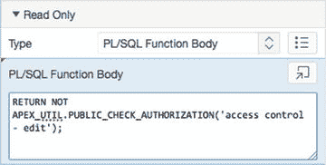
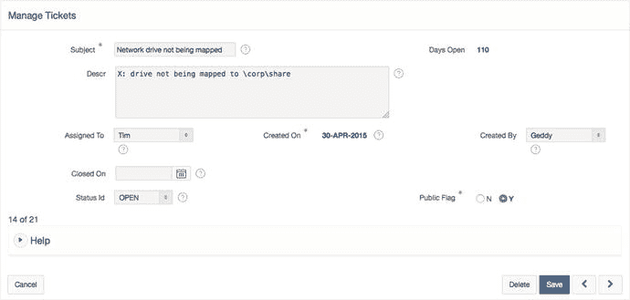
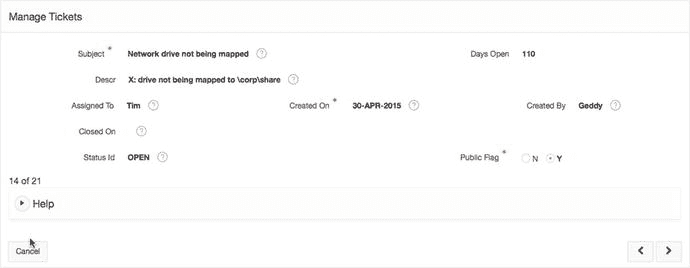
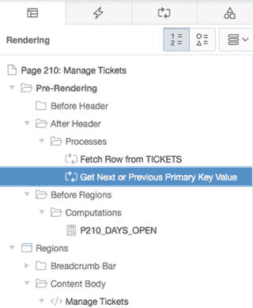
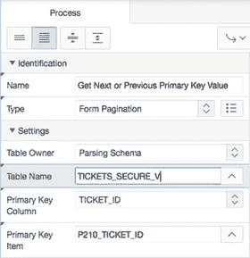
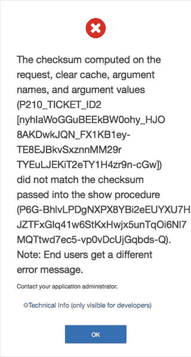

# 按钮的安全设置

对 **管理多工单** 按钮重复步骤 32。为测试此更改，请使用用户名 `Martin` 登录。该用户已被授予查看权限，因此不会显示第 200 页上的按钮。这是否意味着 `Martin` 无法创建工单？

让我们回顾一下您应用到管理页面的步骤。安全性首先应用到页面本身，然后应用了额外的安全性以防止出现访问被拒绝的错误。对于创建工单的按钮，移除按钮的安全性并不能阻止页面被直接运行——无论是通过应用程序生成器，还是通过将 URL 中的页码更改为 `210` 或 `230`。

**重要提示** 移除或隐藏按钮、选项卡或其他链接，并不能保护它们原本指向的目标；它仅有助于减少用户在已安全的组件上看到的错误。

服务台应用程序的设计使得 **管理多工单** 页面仅对具有编辑权限的用户可用，因此整个页面在编辑级别上是安全的。工单的单记录视图对所有认证用户仍然可见，但不再显示与记录操作相关的按钮：

1.  编辑应用程序的页面 `210`。
2.  通过单击其名称，编辑 **管理工单** 区域中的 **创建** 按钮。
3.  在 **安全性** 部分，将 **授权方案** 设置为 `访问控制 - 编辑`。
4.  对 **删除** 和 **保存** 按钮，以及位于 **工单详情** 区域的第二个 **创建** 按钮，重复步骤 35 和 36。记得 **保存** 您的更改。

**注意** 前一步骤也可以通过使用 APEX 5.0 的新多重编辑功能来完成。只需多重选择您希望编辑的项目，并为所有选定项目更改一次 **授权方案** 即可。

5.  编辑应用程序的页面 `220`。
6.  通过单击其名称，编辑 **创建** 按钮。
7.  在 **安全性** 部分，将 **授权方案** 设置为 `访问控制 - 编辑`。
8.  对 **删除** 和 **保存** 按钮，重复步骤 39 和 40。记得 **保存** 您的更改。
9.  编辑应用程序的页面 `230`。
10. 通过单击页面名称，编辑页面属性。
11. 在 **安全性** 部分，将 **授权方案** 设置为 `访问控制 - 编辑`，并单击 **保存**。

现在使用不同的用户复查应用程序。注意用户 `Martin` 仍然可以从 **工单** 报表导航查看工单详情，但没有修改数据库中记录的按钮。尽管表单元素是可编辑的，但没有正确的表单提交，它们不会被写回数据库。

## 只读项目

通常，用户可以在 APEX 中编辑项目的值。在某些情况下，您希望禁止他们这样做，但又不想完全隐藏该项目。在上一步结束时，用户 `Martin` 无法保存对工单信息的编辑，尽管表单允许 `Martin` 更改表单项目的值。

为协助防止更改，APEX 中的每个项目都有一个您可以编程设置的只读属性。其方法与管理项目条件类似。因为只读属性不能直接使用授权方案，所以您可以使用 APEX API `APEX_UTIL.PUBLIC_CHECK_AUTHORIZATION` 来确定用户是否有权编辑数据。此 API 接受授权方案名称作为参数，执行验证，并返回一个可用于 PL/SQL 逻辑的布尔值结果。

尽管我们可以去为每个区域中的每个单独项目应用只读条件，但有一种方法可以使整个区域变为只读。

以下是使用上述只读属性和 API 的步骤：

1.  通过在相应页面上单击区域名称，导航到并编辑表 9-1 中指示的区域。

    **表 9-1.** 需要只读属性的项目

    | 页面编号 | 页面 210 | 页面 220 |
    | :--- | :--- | :--- |
    | 待更新区域 | 管理工单 | 工单详情 |

2.  在 **只读** 部分，将 **类型** 设置为 `PL/SQL 函数体`，如图 9-25 所示。将 **PL/SQL 函数体** 的值设置为以下内容：

    **图 9-25.** 使用只读属性将区域设置为只读

    

    ```
    RETURN NOT APEX_UTIL.PUBLIC_CHECK_AUTHORIZATION('access control - edit');
    ```

当您以 `Martin` 身份运行应用程序时，第 210 页上关于某个工单的信息会显示数据，而不会出现表单元素的混淆。以任何其他用户身份验证，则会在表单元素中显示数据并显示相应的按钮。只读视图的结果如图 9-26 所示；请与编辑模式下的表单（如图 9-27 所示）进行比较。

**图 9-27.** 编辑模式下的工单记录



**图 9-26.** 只读模式下的工单记录




## 数据安全

至此，应用程序的大部分已相对安全。你所缺乏的是应用于隔离应用程序用户间数据的**数据安全**。任何经过认证的用户都可以查看并修改其他用户的记录。APEX 没有提供内置的构建来保护数据。APEX 确实支持并能够与 Oracle 其他确实能保护数据的技术（例如虚拟专用数据库、Oracle 标签安全和透明数据加密）良好配合。

尽管有多种方法可以处理数据隔离和安全问题，但其中一种较简单的方法是使用视图来强制实施用户可访问的数据，以替代对基表的所有直接引用。这种方法很有效，并且适用于所有版本的 Oracle 数据库。其工作原理是在视图中添加一个安全函数，该函数使用当前的 APEX 用户名，过滤掉其他用户的数据。

要实施此数据安全措施，你需要运行一个脚本来创建一个名为 `TICKET_SECURE_V` 的新视图，然后重新创建另外两个视图 `TICKET_ACTIVITY_V` 和 `TICKET_V`，使它们指向这个安全视图，而不是直接指向 `TICKETS` 表。接着，你需要修改访问工单数据的页面的其他关键组件，以同样使用新的安全视图。步骤如下：

定位、上传并运行脚本 `ch9_data_security_script.sql`。如果需要分步说明，请参考第 4 章。你应在结果报告中看到三行，且全部成功完成。

脚本运行完成后，运行应用程序并导航到“分析”页面。你应该会注意到，只有分配给当前登录用户的工单或工单详情才会显示。接下来，修改其他几个页面的源代码，使其引用你刚刚创建的新安全对象：

编辑应用程序的第 200 页。
点击名称选择“工单”报告。
定位并打开文件 `ch9_report_p200.txt`，然后将其内容复制到 SQL 查询文本区域，替换原有内容。保存你的更改。
运行第 200 页，注意你只能看到分配给当前用户的工单。你需要在“管理多个工单”页面进行类似的更改：

编辑应用程序的第 230 页。
双击“管理多个工单”报告进行编辑。
定位并打开文件 `ch9_report_p230.txt`，将其内容复制到 SQL 查询文本区域，替换原有内容。保存你的更改。
运行第 230 页，注意你只能看到分配给当前用户的工单。最后，你也应该将此规则应用于图表，因为它仍然允许你查看系统中所有记录的状态，这是不准确的：

编辑应用程序的第 500 页。
在“按状态统计的工单”图表下，点击系列 1 的名称进行编辑。
定位并打开文件 `ch9_report_p500.txt`，将其内容复制到 SQL 查询区域，替换原有内容。保存你的更改。
运行第 500 页，注意该图表仅反映未分配工单或分配给当前用户的工单的状态。这是数据安全方面的一个巨大进步，但你还未完全完成。你可能已经注意到，如果在第 210 页编辑其中一条记录，你可以使用右下角的“下一个 (>)”和“上一个 (<)”按钮来查看属于其他用户的记录。因此，你需要堵住这个安全漏洞：

编辑应用程序的第 210 页。
`获取下一个或上一个主键值` 过程的位置如图 9-28 所示。点击其名称编辑该过程。



图 9-28.
`获取下一个或上一个主键值` 过程的位置。

将表名的值更改为 `TICKETS_SECURE_V`，如图 9-29 所示。如果你使用值列表，请确保搜索的是“视图”选项卡。点击保存。



图 9-29.
更新用于获取下一条记录的源。

现在，你所有的数据都根据登录系统的用户身份进行了安全保护。真的如此吗？

## 会话状态保护

攻击 Web 应用程序最常见的方式之一是通过一种称为**URL 篡改**的攻击形式。你不需要是程序员或黑客就能发动此类攻击，你只需更改浏览器中的 URL 即可。APEX 在 2.2 版本中引入了会话状态保护功能。启用后，它会在 URL 中添加一个校验和值。如果 URL 的任何部分被更改，生成的校验和将与预期值不匹配，页面将根本无法渲染。

默认情况下，APEX 5.0 在应用程序级别启用会话状态保护，并对使用向导构建的任何表单和报告应用项目级别的会话状态保护。因此，如果用户篡改 APEX URL，系统将阻止他们查看分配给其他用户的工单。

在应用程序的第 200 页运行工单报告。将鼠标悬停在“编辑”图标上并检查 URL。注意 URL 中的 `&cs=` 部分。`&cs=` 参数是由 APEX 自动生成的校验和。更改 URL 中 `P210_TICKET_ID` 的值，或删除 `&cs=` 及其右侧的所有内容，然后尝试运行页面。你将收到一条类似于图 9-30 所示的错误消息。



图 9-30.
URL 篡改导致的校验和错误消息。

## 本章总结

在本章中，你通过利用 APEX 的关键功能，为“服务台”应用程序应用了新的安全措施。你实现了一个新的自定义认证方案，以控制对应用程序敏感部分的访问用户。你还检查了针对已认证和未认证人员的条件安全，并添加了参数以允许应用程序供两者使用。

恭喜！你刚刚编写了你的第一个 APEX 应用程序。凭借迄今为止学到的技能，你有能力创建几乎任何你需要的系统。花点时间沉浸在你的成就感中，然后准备学习如何将你的应用程序从开发环境迁移到其他系统。

