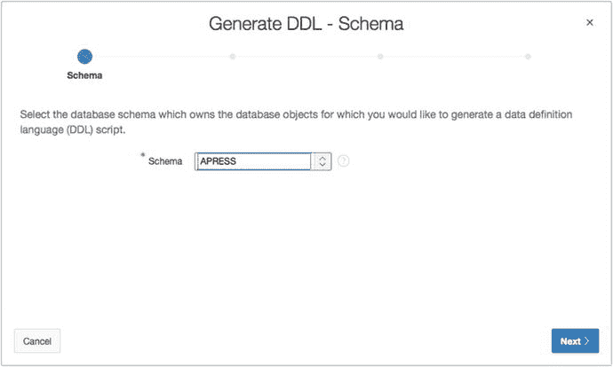
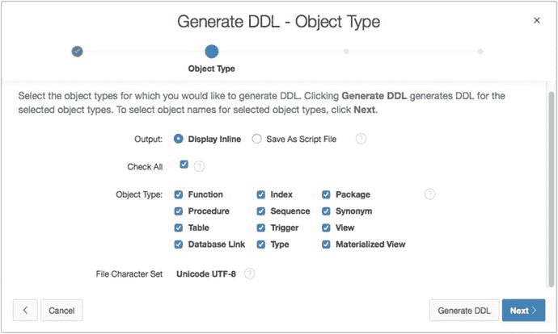
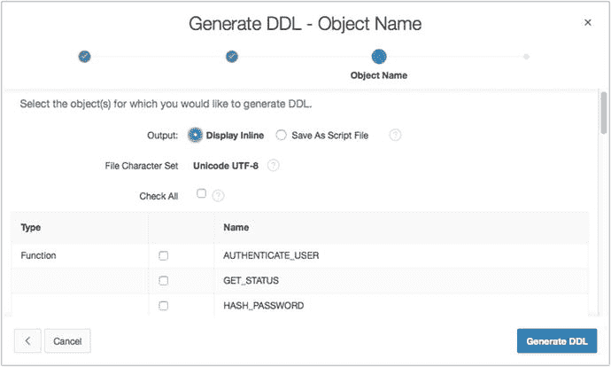
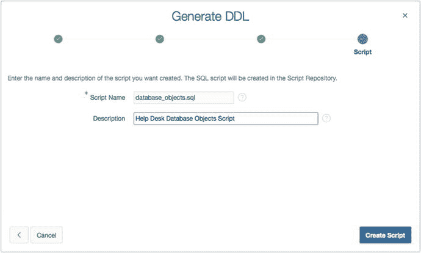
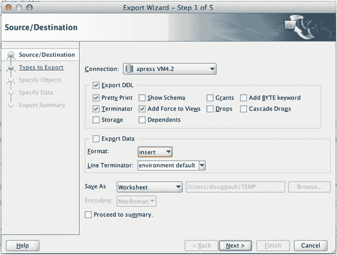
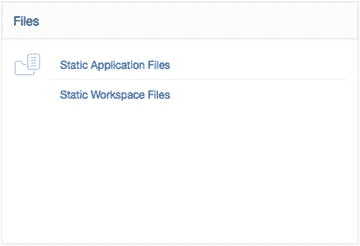
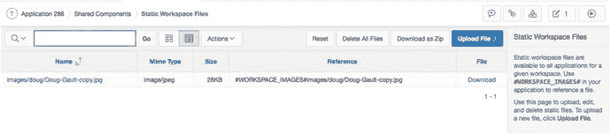
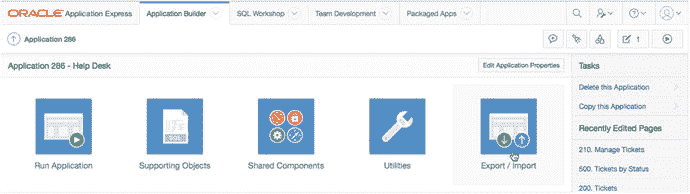
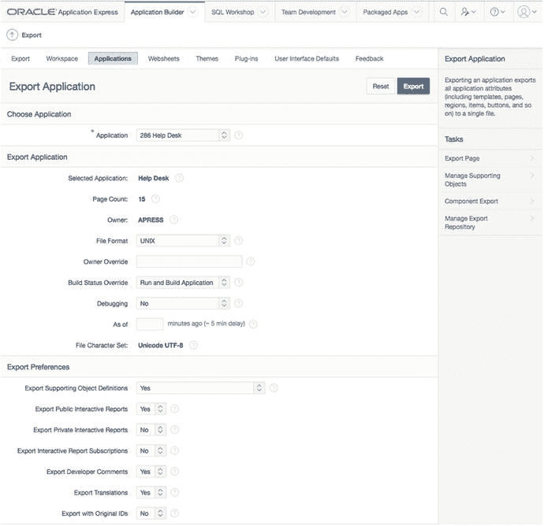

# 10. 应用程序打包与部署

应用程序打包与部署的概念是开发者在设计应用程序时应从一开始就考虑的事情。对于 APEX 而言，内置功能有助于简化这项工作。在应用程序部署方面，有多种方法可以实现相同的最终目标，没有两个 IT 组织的做法完全相同。本章将讨论 APEX 提供的用于帮助你打包和部署应用程序的工具，以及如何以非常 APEX 中心化的方式来使用它们。

注意：你的组织可能已有标准化的方式来实现本章介绍的许多功能。在实施任何这些方法之前，请检查并确保你不是在重复造轮子。


## 识别应用组件

你的 APEX 应用不仅仅是应用程序导出文件本身。它还包括底层的数据库对象、图像、层叠样式表（`CSS`）以及 `JavaScript` 脚本。而且这些组件可能存储在与 APEX 相同或不同的服务器上，更不用说可能并未存储在 APEX 元数据存储库中。本质上，你需要了解如何组装所有内容，以便从头开始实例化你的应用。因此，理解构成你应用的所有组件、它们存储的位置以及如何将它们打包以便于迁移，是非常重要的。

你可以将各种组件大致分为四个主要组别：

*   `外部文件`：你的应用可能访问不存储在 APEX 存储库中的文件。例如，你的公司可能有一套通用的 `CSS` 和图像文件，被多个网站使用，以保持标准的外观和感觉。
*   `数据库对象`：这些包括应用使用的所有表、视图、`PL/SQL` 对象以及任何其他数据库对象。其中大部分驻留在应用的“`解析为`”模式中。
*   `基于 APEX 的文件`：这些是已上传到应用程序“支持对象”中“`文件`”部分的文件。它们可能包括图像、`CSS`、`JavaScript`、静态文件等，并存储在 APEX 存储库中。
*   `APEX 应用程序导出`：这是 APEX 应用程序的核心，包含页面、区域、项目、验证等。

当需要部署应用程序时，这些类型的文件每一种都需要稍作不同的处理。以下部分将分别介绍每种文件类型，以及如何获取其最新版本以便迁移到替代平台。本章稍后将讨论如何使用 APEX 的`支持对象`功能，将适当的项目打包到应用程序导出文件中。

### `外部文件`

如前所述，`外部文件`存在于 APEX 元数据存储库之外，通常也位于 Oracle 数据库之外。在大多数情况下，这些文件被放置在为 APEX 提供 HTTP 服务的应用服务器上的目录结构中。通常它们位于处理 APEX 请求的域名的文档根目录（`docroot`）下的某个目录中。因为它们存在于 APEX 之外，所以无法合理地将其包含在应用程序的支持对象中，因此需要与其他文件类型分开处理。

你必须仔细跟踪你的应用使用了哪些文件，以及这些文件在应用开发过程中是否发生了变化。另一个值得关注的领域是，是否有其他应用程序（无论是 APEX 还是其他技术构建的）也在使用这些相同的文件。

例如，你应用程序的版本 1 可能引用一个存储在应用服务器上的 `JavaScript` 文件。在开发应用程序版本 2 的过程中，你可能修改了该文件，需要将其从开发服务器迁移到 `QA` 或生产环境。但是，如果你的同事正在开发另一个使用相同 `JavaScript` 文件的应用程序呢？你必须非常小心地处理你所做的更改以及部署方式，以免无意中影响其他系统。

将这些文件从开发环境迁移到 `QA` 或生产环境时，你可能需要与负责维护应用服务器层的人员合作。他们可能已有既定的流程来规划从一个环境到另一个环境的迁移。

如果你是独自工作，并且是文件迁移的唯一负责人，那么养成保留被替换文件的备份副本的习惯是好的，以防万一出现问题。你可以通过简单地重命名当前使用的文件，在文件名中包含某种版本标识符来实现。在文件名中包含日期是一个有效的方法。在 `Linux` 中，命令类似于：

```
mv my_old_file.js my_old_file_2015_09_17_12_37.js
```

如果你正在使用源代码控制系统，并且对迁移到生产环境的文件版本打上了标签，那么你可能不需要采取这个额外的步骤。

关键是要确保你能够从覆盖文件可能引发的任何问题中恢复。没有什么比让系统陷入瘫痪，却没有简单的方法恢复到之前状态更糟糕的了。

### `数据库对象`

`数据库对象`看起来应该很直接，因为它们存在于 Oracle 中，并且它们的定义 SQL 代码相对容易重新创建。对于一个全新的应用程序来说，这个假设是相当准确的。

然而，一旦应用程序上线，如果你需要更改表结构，你不能简单地用新版本替换底层表。用户可能已经在系统中输入或操作了数据，而你的职责是确保在系统新版本推出时，数据的完整性得以保持。


## 新应用

当您部署一个全新的应用程序时，有几种工具可以帮助您生成底层数据库对象的脚本。`APEX SQL Workshop` 中的 `Utilities` 菜单包含一个 `Generate DDL`（生成 DDL）工具，其功能正如其名。如果您针对应用程序的“解析为”模式运行此工具，它将允许您生成一个包含底层数据库对象的 SQL 脚本。

如图 10-1 所示，向导会询问您希望使用哪个可用模式作为生成脚本的基础。


图 10-1. 选择要为其生成对象定义脚本的模式

随后，向导会让您选择要在脚本中包含哪些类型的数据库对象（参见图 10-2）。请确保选中应用程序使用的所有对象类型。选择 `Check All`（全选）将为您提供为所选模式中的所有对象生成脚本的选项。此时，您还可以决定是否希望内联显示生成的脚本以便复制粘贴，或者将其作为脚本文件保存到 `APEX` 脚本库中。


图 10-2. 在 `Generate DDL` 向导中选择对象类型

向导的下一步（参见图 10-3）列出了所有符合您在上一步所选类型的对象。您可以根据意愿选择性地包含哪些对象。您的特定应用程序可能只使用模式内对象的一个子集，因此在生成 DDL 时，您只需选择那些相关的对象即可。


图 10-3. 在 `Generate DDL` 向导中选择所需的特定对象

注意：如果您遇到多个应用程序共享同一个底层模式的情况，您可能希望对数据库对象应用一种命名约定，以便知道哪些对象与哪个应用程序相关。常见的数据库对象命名约定是在对象名称前添加一个三字母前缀。例如，Help Desk（服务台）应用程序的表 `USERS` 将变为 `HDA_USERS`。同样，请咨询您的公司，了解其是否已有对象命名约定。

如果您选择将脚本保存到 `APEX` 脚本库，下一步允许您输入要创建的文件名和描述，如图 10-4 所示。


图 10-4. 为 `Generate DDL` 向导正在创建的脚本命名

至此，包含所有选定对象的脚本便生成了。生成引擎能够很好地按正确顺序创建那些依赖于其他对象的对象，从而确保脚本运行时不会发生错误。不过，测试这些脚本以确保一切运行顺畅始终是一个好习惯。

Oracle 的 `SQL Developer` 产品也提供了一个工具，可以为您选择的模式生成 DDL。图 10-5 显示了 `SQL Developer Database Export`（SQL Developer 数据库导出）工具的启动画面。


图 10-5. `SQL Developer Database Export` 工具的第一个屏幕

此工具与 `APEX` 向导非常相似，但它让您对输出的格式和内容有更多的控制权，包括是否包含模式名称、存储子句、授权等。`SQL Developer` 的另一个优点是能够导出表中存在的数据。这对于系统正常运行所需的种子数据非常方便。

无论您选择使用基于 `APEX` 的工具还是 `SQL Developer`，为新系统生成对象创建脚本都是直接了当的。

## 现有应用

对于已经发布到生产环境的应用程序，部署过程可能要复杂得多。您需要考虑生产环境中的版本，以及底层数据库结构与您已在开发环境中创建并准备部署的版本之间可能存在哪些差异。

幸运的是，有一些工具可以帮助识别两个模式之间的差异。这些工具还可以生成实现这些差异所需的 DDL 脚本。

然而，不幸的事实是，尽管 `APEX SQL Workshop` 实用程序包含一个模式比较工具，但它有一些严重的局限性。首先，被比较的两个模式必须都可从同一个工作区访问。如果您的生产模式存在于单独的服务器上（通常如此），这就无法实现。第二个限制是，基于 `APEX` 的比较工具能识别出不同的对象，但不会说明它们有何不同，也不会生成同步模式所需的 DDL。

对于这类功能，您必须依赖外部程序或脚本。以下列出了几种选择，它们都可以生成所需的脚本，以将生产环境的数据库对象结构与您在开发中引入的变更同步：

*   `SQL Developer`：Oracle 自家的产品可以运行两个独立服务器上独立模式之间的完整模式比较，并生成一个将某个模式与另一个同步的脚本。该工具的旧版本存在一些问题，但自 `SQL Developer` 版本 3.2 起，比较引擎已显著升级，生成的脚本非常可靠。
*   `Oracle Enterprise Manager`：如果您拥有 `Change Management Pack`（变更管理套件）和 `Oracle Enterprise Manager`（`OEM`），那么您可以比较模式并生成同步脚本。但是，开发人员很少被授予访问 `OEM` 的权限，因为它更像是一个数据库管理工具，并且可能会让开发人员访问到管理员们不希望他们接触的多个敏感实用程序。
*   `Schema Compare for Oracle`：Red Gate Software 将其在为 SQL Server 市场创建工具方面的丰富经验转向了 Oracle 数据库市场。其成果是一款允许您在两个 Oracle 模式之间进行比较、查看和生成同步脚本的工具。这可能是市场上最好的第三方工具，但唯一的缺点是它只在 Windows 上运行。
*   `TOAD for Oracle`：`TOAD`（最初代表 Tool for Oracle Application Development，Oracle 应用程序开发工具）是由 Dell 软件部门（前身为 Quest Software）编写和分发的工具。尽管它能做的远不止于此，但作为 `DB Admin`（数据库管理）模块一部分提供的模式比较工具相当复杂，能够生成非常清晰准确的脚本。

无论您使用哪种工具，输出的都是一个脚本。当该脚本在生产环境上运行时，将执行所需的 DDL 来修改底层数据库对象，使其与您在开发环境中创建的结构保持一致。

然而，这些工具都没有考虑可能驻留在被修改表中的数据。在实施任何生成的升级脚本之前，请务必非常小心，了解它们可能对底层数据造成什么影响，并减轻任何数据丢失或损坏的风险。

这个主题非常庞大，超出了本书的范围。在版本之间进行数据迁移的问题没有自动化解决方案。更多时候，它归结于手工编写的脚本和大量的测试。


## 基于 APEX 的文件

APEX 为开发者提供了将静态文件作为应用程序共享组件的一部分上传到 APEX 元数据存储库的能力。图 10-6 展示了共享组件页面的文件部分。其中有两种类型的文件：直接与应用程序绑定的文件，以及当前工作区内所有应用程序都可用的文件。


*图 10-6. 应用程序共享组件页面的文件部分*

静态应用文件可以是任何文件类型，例如 CSS 文件、JavaScript 文件、图像、文档等，这些可能是你应用程序所需的一部分。在应用程序内部引用它们时，需在文件名前加上 `#APP_IMAGES#` 替换变量。

由于这些项目直接与特定应用程序绑定，因此在执行应用程序导出时（如本章后面所述）会自动包含它们。

静态工作区文件同样可以是任何文件类型，但它们不是直接绑定到某个应用程序，而是通过使用 `#WORKSPACE_IMAGES#` 替换变量，使得当前工作区内的所有应用程序都能访问它们。

尽管静态工作区文件被视为共享组件，但它们不包含在应用程序导出中。这意味着你需要单独迁移这些项目。你可以从允许上传它们的同一屏幕执行此操作。你可以选择使用与该项目关联的下载链接来下载并迁移单个文件，或者直接点击“压缩下载”按钮，随后会出现一个对话框，允许你导出包含所有静态工作区文件的压缩文件。这两种选项如图 10-7 所示。


*图 10-7. 静态工作区文件页面支持单个或批量下载*

作为共享组件上传的文件很可能是你将在整个应用程序中引用的内容。它们可能代表你主题的一部分，例如选项卡或按钮的图像，或者可能是用于显示状态的图标，或者在被点击时允许最终用户编辑数据行的图标。

需要明确的一个关键区别是，上传到此区域的文件不应与应用程序的数据有直接关系。诸如产品图片、员工照片之类的东西应该存储在应用程序的 `parse as` 模式中，与图片相关的数据放在一起。

## APEX 应用程序导出

总的来说，APEX 应用程序导出易于执行。该界面包含一个旨在生成用于重建 APEX 应用程序的脚本的过程。

此时，了解应用程序导出包含什么和不包含什么是重要的。我们已经讨论过，底层数据库对象不包含在内，上传到共享组件的静态工作区文件部分的任何内容也不包含在内。但是所有其他共享组件，包括静态应用文件，都包含在导出文件中。

值得一提的是，所有已配置和已分配的共享组件都包含在 APEX 应用程序导出中，无论应用程序是否正在使用它们。例如，一个 APEX 应用程序同时只能有一个当前的身份验证方案，但可能会有多个身份验证方案被配置并分配给该应用程序。用户界面主题的情况也是如此。

虽然这并不严格算是一个问题，但最佳实践是删除任何未被应用程序使用的共享组件，以便应用程序导出的大小保持尽可能小且易于管理。大多数共享组件都提供使用情况报告，因此你可以看到它们是否正在被使用。

应用程序导出功能位于应用程序构建器主页顶部的图标菜单中，如图 10-8 所示。


*图 10-8. 导出选项位于页面顶部的图标菜单中*

当你启动向导时，它首先会提示你是要导入还是导出应用程序。一旦你选择“导出”，你将被带到导出页面，如图 10-9 所示。


*图 10-9. 导出应用程序页面*

你可以使用页面顶部附近的选择列表来选择要导出的应用程序。“导出应用程序”部分允许你更概括地规定应如何导出应用程序。它包括以下选项：

*   文件格式：它不涉及目标平台，而是关于文件生成时对回车符和换行符的处理方式。
*   所有者覆盖：允许你通过输入或选择来覆盖当前分配的 `parse as` 模式。
*   构建状态覆盖：让你选择应用程序导入时的默认构建状态。默认是“运行和构建应用程序”，但你可以将状态设置为“仅运行应用程序”。
*   调试：规定应用程序安装时默认是启用还是禁用调试。调试对于开发中的应用程序很有用。然而，作为最佳实践，你应该为生产应用程序关闭调试，以防止用户看到可能仅在调试模式下才会显示的内容。
*   截至时间：允许你将应用程序导出为它在若干分钟前的状态。要使此功能生效，必须由 DBA 在数据库级别启用闪回查询。你可以闪回的时间量由数据库级别的 `UNDO_RETENTION` 参数控制。

> **注意：** 虽然你可以为“导出应用程序”部分中的设置选择默认值，但重要的是要理解，这些设置在应用程序导入时可以被覆盖。此时，你只是在为导入设置默认值。

在“导出首选项”部分，有几个选项允许你决定应用程序导出中包含哪些内容。可用的选项如下：


