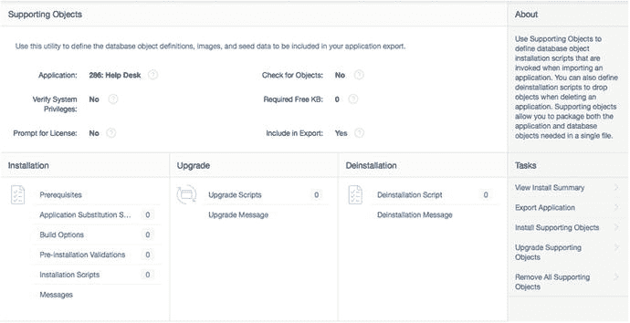
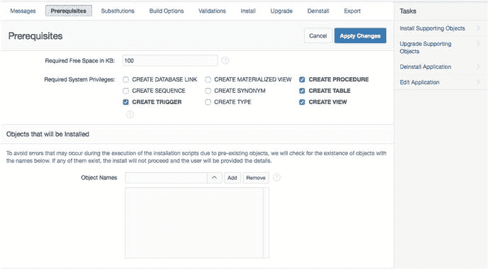
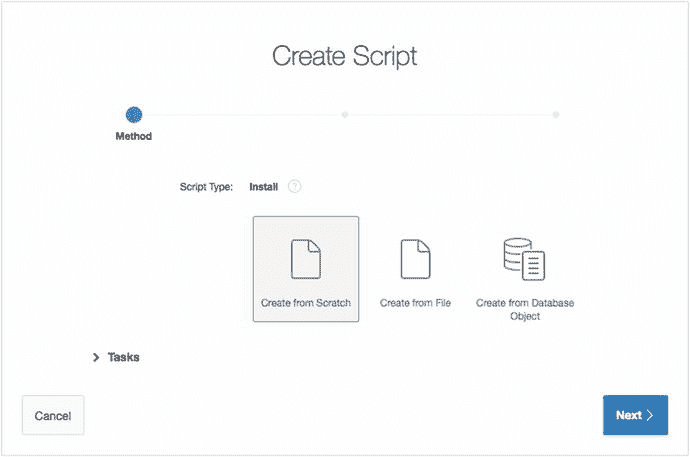
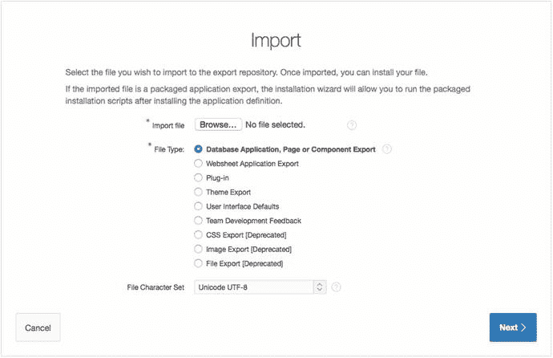
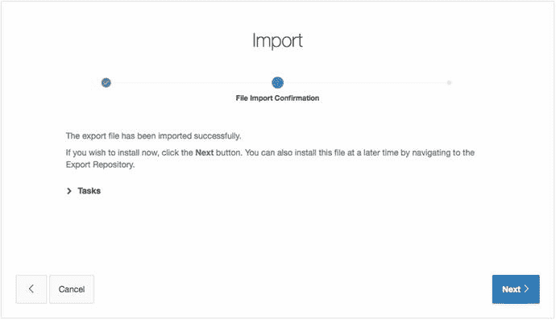
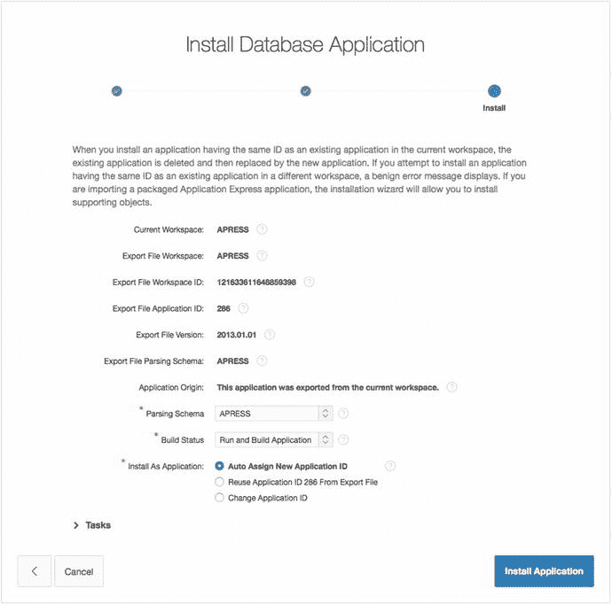

# 支持对象

应用程序导出捕获应用程序的完整定义，包括大多数共享组件，但它不包含在另一台服务器上完全重建应用程序所需的一切。但是，APEX 提供了一项功能，允许您将诸如底层数据库表之类的脚本打包到应用程序导出中。此功能称为支持对象。

支持对象功能实际上提供了比这更强大的功能。它还提供了创建和控制安装、以及升级和卸载任何可以使用 SQL 编写脚本的内容的能力。

您可以通过导航到应用程序的 `共享组件` 页面，然后从 `任务` 菜单中选择 `管理支持对象` 选项来访问支持对象管理界面。图 10-10 显示了支持对象主页。

*图 10-10. 支持对象管理主页*

该页面分为几个区域。顶部的 `摘要` 区域显示了当前在支持对象中定义的内容，下方的三个区域（`安装`、`升级` 和 `卸载`）允许您编辑脚本并定义在每个阶段可用的操作。

单击任何链接将转到带选项卡的定义页面，如图 10-11 所示。

*图 10-11. 支持对象选项卡定义屏幕*

通过此页面上的选项卡，您可以定义在三个阶段中的每个阶段要执行的操作以及应运行的任何脚本。虽然我们不会在此处显示每个选项卡内容的图片，但在本节中，我们将逐一介绍它们，讨论其内容和目的，最后介绍 `消息` 选项卡。

## 先决条件

此部分定义应运行哪些内置检查，以确保应用程序安装到的数据库架构具有适当的权限。您可以提供应用程序正常工作所需的最小空间量。在安装时，系统会检查“解析为”架构的默认表空间，以确保有足够的可用空间。您还可以检查以确保架构具有以下任何特定权限：

`CREATE DATABASE LINK`

`CREATE MATERIALIZED VIEW`

`CREATE PROCEDURE`

`CREATE SEQUENCE`

`CREATE SYNONYM`

`CREATE TABLE`

`CREATE TRIGGER`

`CREATE TYPE`

`CREATE VIEW`

页面底部区域允许您列出支持对象安装脚本将创建的所有对象。在安装时，如果列出的任何对象已存在，安装将不会继续，因为可能存在冲突。安装应用程序的用户会收到有关已发现哪些对象已存在的详细信息。

此部分的范围可能看起来有点有限，但稍后讨论的 `验证` 部分允许进行更自由格式的先决条件检查。

## 替换

此部分提供了允许安装用户在安装时定义应用程序级替换字符串值的能力。虽然替换字符串旨在用作静态变量，但您可能并不总是在安装前知道这些字符串的值应该是什么。通过此界面，您可以选择要让安装用户定义的替换变量以及每个变量的提示是什么。

替换变量不常用，因此此功能也不太可能被使用。但是，如果需要，知道它存在是好的。

## 构建选项

在 第 13 章 中，我们将讨论构建选项以及它们可用于排除或隐藏已分配功能的事实。此部分允许您选择您定义的构建选项是否对安装用户可用。通过选择一个构建选项，系统将提示用户是否希望包含或排除与该构建选项关联的功能。

大多数情况下，将应用程序迁移到生产环境时，您希望排除所有构建选项。

## 验证

此部分允许您定义要运行的任意数量的预安装验证。这些验证类似于普通的页面验证，并允许完全控制应用程序安装是否可以继续。您可以根据需要进行任意多个验证，并且验证也可以是有条件的。

如果任何验证失败，安装将停止，并向用户显示失败验证中定义的错误消息。

### 安装

这是支持对象的核心部分，您在此定义要运行的脚本，以及安装应用程序正常工作所需所有对象的顺序。您可以在此创建和管理用于安装数据库对象、工作区或应用程序镜像、CSS 文件、静态文件等的脚本。根据所含脚本的类型，您可能有多种创建方式。

对于创建底层数据库对象的脚本，您可能已经使用过诸如`SQL Developer`或`SQL Workshop's Generate DDL tool`之类的工具来将脚本生成到文件。

您可以选择上传预先创建的脚本文件、从零开始创建脚本，或者基于应用程序“解析为”模式中数据库对象的定义来创建脚本。您可以通过图 10-12 所示的`创建脚本向导`来完成此操作。

图 10-12. `创建脚本向导`

选择`从头创建`会显示一个脚本编辑屏幕，您可以在此从头输入脚本步骤，或从文本编辑器复制粘贴脚本。但是，如果脚本已存储在文件中，您可能需要使用`从文件创建`选项，该选项允许您从本地计算机上传脚本。

`从数据库对象创建`选项会显示一个向导，允许您选择应用程序“解析为”模式中存在的哪些对象要包含在脚本中。一旦选择了对象，向导将为您构建创建脚本并呈现以供编辑。然后，您可以将脚本保存为支持对象安装序列的一部分。

从数据库对象创建脚本的主要区别在于，`APEX`会记录您选择了哪些对象，并允许您返回并针对底层的“解析为”模式刷新脚本，添加您可能需要的新对象，甚至删除不需要的对象。这可能比使用外部脚本生成工具更有用，因为它直接集成到应用程序导出中。但是，某些 IT 部门要求将底层数据库对象创建脚本与应用程序导出分开，作为一个控制点。再次强调，请确保您了解公司将应用程序迁移到生产环境所使用的流程并遵循其标准。

无论脚本如何生成，一旦创建，您就可以更改脚本的名称、其执行顺序以及运行它的条件。

您是有多个脚本（每个对象或对象类型一个），还是一个创建所有所需对象的大型脚本，这完全取决于您自己。只需确保，如果您选择使用多个脚本，请按照界面中列出的顺序测试它们的执行，以确保任何依赖关系都被考虑在内。

### 升级

`升级`选项卡与`安装`选项卡非常相似，因为它允许您创建或上传脚本。但在这种情况下，脚本用于升级现有应用程序的支持对象（如果安装程序发现应用程序已安装在工作区中）。

安装程序通过让您编写查询来检查模式中是否存在支持对象来实现此功能。如果查询返回一行或多行，则运行升级脚本集来代替安装脚本集。

### 卸载

此部分允许您定义单个脚本，用于删除由安装或升级脚本创建的对象。当您为支持对象文件生成安装脚本时，用于卸载这些文件的 API 调用会自动添加到卸载脚本中。但是，您需要手动添加必要的代码来删除相应的数据库对象。

### 导出

`导出`选项卡仅允许您设置在导出应用程序时是否包含支持对象的默认值。此选项也可在“支持对象”主屏幕上使用。

### 消息

`消息`页面让您能够控制在安装应用程序时向安装用户显示的文本。您可以编辑的部分文本如下：

*   `欢迎`：成功导入并安装应用程序定义后，安装向导会提示用户为应用程序安装支持对象。此消息介绍应用程序并描述安装脚本的操作。
*   `许可`：如果使用此应用程序需要用户接受许可证，请在此处输入许可证文本。在安装支持对象之前，系统会提示用户接受该消息。如果许可证没有文本，则在安装向导中跳过此步骤。
*   `应用程序替换`：介绍应用程序替换提示。它应说明这些值不易更改，并在输入前确保其值正确。如果没有应用程序替换变量需要输入，则不显示此消息。
*   `构建选项`：介绍可供用户选择的构建选项。如果没有可用的构建选项，则跳过该步骤且不显示消息。
*   `验证`：介绍在安装支持对象之前将执行的验证。如果没有验证，则跳过该步骤且不显示消息。
*   `确认`：在运行安装脚本和应用配置选项之前显示。
*   `安装后成功`：在应用程序的支持对象已成功安装且无错误后显示。
*   `安装后失败`：在应用程序的支持对象脚本运行后显示，但仅限于发生错误的情况。用户可以查看发生的错误。
*   `升级欢迎消息`：提供一条消息，告知用户安装程序检测到预先存在的支持对象，现在将运行升级向导。
*   `升级确认消息`：在运行升级脚本之前呈现一条消息，允许用户选择是否继续。
*   `升级成功消息`：在支持对象升级脚本成功运行且无错误后显示。
*   `升级失败消息`：在支持对象升级脚本运行后显示，但仅限于发生错误的情况。用户可以查看发生的错误。
*   `卸载消息`：在运行支持对象卸载脚本之前呈现。
*   `卸载后消息`：在运行支持对象卸载脚本后立即呈现。

注意

由于所有脚本类型都是标准的`SQL`和`PL/SQL`，您可以选择编写相当复杂的逻辑，在脚本内部决定要采取的步骤。但是，各个脚本之间没有交互性或共享的会话状态，因此您不能在第一个脚本中决定是否运行第二个或第三个脚本。无论先前脚本的结果如何，集合中的每个脚本都将运行。仅在所有脚本运行完毕后才显示错误。

构建包含支持对象的打包应用程序的过程可能令人生畏。好消息是，在标准的`IT`环境中，很少使用支持对象来处理迁移数据库对象的脚本。尽管支持对象非常有用，但它们更适用于诸如 shrink-wrapped 软件之类的情况，即应用程序被发送到远程站点，与安装用户几乎没有直接交互。

对于在单个组织内开发和部署的应用程序，可能已存在用于将应用程序迁移到生产环境的规则和指南。请确保您与组织核实并遵守这些标准。

## 导入
通过提供应用程序导出脚本，即可导入 APEX 应用程序。您可以导入到不同的工作区，或导入回原始工作区。应用程序导入向导可从应用程序构建器主页访问。图 10-13 展示了该向导的初始页面。

图 10-13.
识别为数据库应用程序的导入文件

如您所见，该向导允许您导入许多不同类型的 APEX 导出脚本。请确保为您尝试导入的文件选择正确的类型。导入应用程序导出脚本时，点击 `浏览` 来选择应用程序导出文件，并务必选择 `数据库应用程序、页面或组件导出`。

图 10-14 中的页面表明应用程序导出文件已从您的计算机上传到服务器。请记住，应用程序文件是一个脚本。尽管在此阶段已上传，但尚未运行；因此，应用程序并未安装。

图 10-14.
文件上传成功。继续安装应用程序

点击 `下一步` 按钮将启动将应用程序安装到当前工作区的步骤。APEX 会提示您输入一些关键信息，如图 10-15 所示。

图 10-15.
将应用程序安装到工作区

此时，请选择 `解析方案` 和 `构建状态`，然后决定如何处理应用程序 ID。解析方案可以是与该工作区关联的任何数据库方案。`构建状态` 可将应用程序设置为 `运行时` 模式，这对于生产环境非常有用；默认设置允许 `运行和构建`（或编辑）模式。最后一个选项涉及应用程序 ID 值；默认选项是在安装时分配新的应用程序 ID，这允许同一个应用程序在工作区中存在多次——每次使用不同的 ID。

如果您选择重用导出文件中的应用程序 ID，或更改为自选的应用程序 ID，APEX 会检查该 ID 的应用程序是否已存在。如果同一工作区中已存在具有该 ID 的应用程序，系统会提示您是否希望用正在导入的应用程序替换当前分配给该应用程序 ID 的应用程序。如果所选 ID 的应用程序存在于不同的工作区中，则禁止您使用该应用程序 ID。这可以防止您意外覆盖其他工作区中的应用程序。

如果应用程序具有支持对象，下一个屏幕会询问您是否要安装这些支持对象。它还提供了预览将要运行的支持对象脚本的选项。

要继续安装支持对象，请选择 `是` 单选按钮并点击 `下一步` 按钮。然后，向导将引导您完成创建支持对象时设置的所有步骤。它会执行任何先决条件检查和验证，并决定是运行安装脚本还是升级脚本。系统会向您展示与替换字符串和构建选项相关的所有选择和选项。

最后，系统要求您确认支持对象的安装（或升级）。继续使用向导将运行相应的脚本。如果在脚本执行期间出现错误，错误将呈现给您查看。如果没有错误，您将有机会查看安装摘要，或者编辑或运行应用程序。

## 总结
正如您所见，APEX 具有强大的内置迁移功能。导出和导入工具易于使用且功能强大。额外能够构建安装脚本来管理应用程序的数据库端，这极大地帮助您在一个流程中部署独立的应用程序。但请记住，有些文件可能需要手动迁移，因为它们不在 APEX 能够通过支持对象处理的范畴内。

