# 11. 理解 Websheets

Websheets 是 APEX 4.0 一项全新的瞩目功能，使最终用户能够完全控制网络内容和结构。在 APEX 的早期，当它还被称为 `Project Marvel`，后来被称为 `HTML DB` 时，有些人认为最终用户可以使用 APEX 来开发他们自己的应用程序。虽然对于简单的类似电子表格的应用程序来说确实如此，但大多数最终用户对于构建需要底层规范化数据库以及 `SQL`、`PL/SQL` 和 `JavaScript` 代码片段的 Web 应用程序感到不适。Websheets 现在实现了早期对于最终用户开发 Web 内容（如博客、维基和非常简单的业务应用程序）的承诺。Websheets 赋予了最终用户这种能力，而无需强迫他们学习如何规范化数据库或编写代码。Websheets 中的一切，除了一些可选的高级功能外，都是声明式的。

Websheets 在设计上易于使用。然而，像所有计算机工具一样，它存在相关的学习曲线。这是坏消息。好消息是学习曲线非常平缓。该工具严重依赖向导，这些向导能直观地引导您完成内容创建过程。

本章将概述 websheets 的底层结构，描述导航风格，并重点介绍一些能提高您工作效率的便捷功能。本章将集中讨论 websheets 能做什么，而第 12 章 将通过引导您完成一些分步场景来关注 websheets 是如何构建的。阅读本章并学习完下一章后，您将能够快速创建外观专业的网络内容。

注意
阅读本章时，您可能会发现自己想知道如何创建所讨论的某些内容。不必担心——下一章中的示例将深入探讨创建 websheet 所涉及的主要任务。本章将提供背景知识，使您能够跟上并完全理解接下来的示例。

## Websheet 结构

Websheet（参见 `Figure 11-1`）的基本构建块很容易理解。Websheet 是网页的容器。网页反过来又是节（section）的容器。一个节类似于 APEX 数据库应用中的区域（region），用于容纳你的内容。批注（annotations）则用于增强内容和搜索功能。

共有五种节类型：

*   文本（Text）：文本节包含易于格式化的文本。指向其他内容和图像的链接通过非常简单的标记语法嵌入在文本中。
*   导航（Navigation）：导航节帮助你在页面层次结构中导航。创建这些节几乎不需要你费心思或努力。你也可以通过使用节导航在长页面内部设置导航。
*   数据（Data）：数据节用于以类似电子表格的行-列格式显示数据。数据节有两种类型：报表和数据网格。报表用于显示来自 Websheet 外部（即来自分配给工作区的模式中的表）的只读数据。数据网格是你构建的类似电子表格的对象。你需要负责定义列、添加数据录入业务规则、提供默认值等等。如果你使用过电子表格，你会发现这项工作相对容易完成。
*   图表（Chart）：图表节用于显示图形。图表节从数据节获取数据。你可以通过一个简单直观的向导将图表节链接到数据节。
*   PL/SQL：具备 PL/SQL 知识的用户可以创建 PL/SQL 节，并针对关联的模式编写自己的代码。仅当 Websheet 应用程序开发人员在 Websheet 属性页面上启用了 `Allow SQL and PL/SQL` 属性时，PL/SQL 节才可用。

## 导航

我们从两个上下文讨论 Websheet 导航。首先，我们讨论浏览 Websheet 的内容。其次，我们讨论浏览用于构建 Websheet 的页面。请注意，在实践中，你经常需要在这两个上下文之间来回切换。

在两种上下文中，通常有几种方法可以导航到给定的页面或节。重复的导航选择一开始可能会让你有点困惑。然而，在你使用 Websheet 一段时间后，导航选择会变得有用且直观。本章并未记录所有可能的导航路径；相反，它向你展示了在哪里可以找到导航链接，以便你能快速找到一种适合你的、舒适的导航风格。

### 内容导航

内容导航使你能够快速跳转到页面以及页面内的节。页面导航是强制性的，会在你创建 Websheet 层次结构时自动为你创建。节导航是可选的，在需要大量垂直滚动的长页面上非常有用。

页面导航由 Websheet 本身通过添加分层面包屑（breadcrumbs）自动创建。在 `Figure 11-2`（你将构建的 Websheet 截图——一个足球队管理应用程序）中，分层面包屑位于左侧的下拉菜单中，其中包含指向 `Players`（球员）、`Results`（赛果）和 `Schedule`（赛程）的链接。对于小型 Websheet，面包屑和右侧的导航节可能就是你所需要的全部。

其次，你可以通过创建页面导航节来手动添加页面导航。你还可以在页面内容中嵌入显式的页面链接（参见 `Figure 11-3`）。添加页面导航节的详细内容将在后面的“导航节”标题下讨论。嵌入式链接在“标记语法”部分有详细说明。

节导航是可选的。它对于内容繁重、需要大量滚动才能到达页面底部的页面非常有用。节导航与页面导航几乎完全相同（参见 `Figure 11-4`）。页面导航节和节导航节之间的主要区别在于节导航缺乏层次结构；节没有子级。

### 结构导航

结构导航用于访问那些用于构建和更新 Websheet 结构及内容的页面。在大多数 Websheet 页面上，有两个区域可以让你访问结构页面（参见 `Figure 11-5`）。第一个区域包含页面顶部的下拉菜单。这些菜单不会因页面不同而改变。第二个区域位于每个页面的右侧。该区域包含一组节，这些节又包含指向各种结构页面的链接。这些节和链接因页面而异，并根据页面的上下文量身定制。

除了这些区域，一些结构链接也嵌入在内容节中。这些嵌入式链接便于直接访问当前显示内容的编辑页面。

## 帮助

不要忽视 `Help`（帮助）链接（参见 `Figure 11-6`）。帮助内容清晰、简洁且实用。点击 `Help` 链接会调用一个与上下文相适应的弹出页面，其中主要包含静态信息，供你闲暇时阅读。我们强烈建议你这样做；这只需要几分钟时间。

除了静态信息，还有一个选项卡包含动态信息。`Application Content`（应用程序内容）选项卡包含 Websheet 所有页面、节、文件、图像、数据网格和报表的完整列表（参见 `Figure 11-7`）。这些列表以交互式报告（Interactive Reports）的形式呈现，你可以根据需要定制它们。

所有交互式报告都包含一个列，该列显示显式的标记语法，使你能够直接将指向所列对象的链接嵌入到你的内容中。这省去了你必须记住标记语法细节并手动输入的麻烦；你也避免了调试拼写错误的烦恼。

标记语法使用方法的示例如 `Figure 11-8` 所示。一个指向 `Results` 页面的链接被嵌入在 `Important News` 文本节的内容中。点击 `Important News` 文本节中的 `Edit` 链接将带你到相应的 `Edit` 页面（参见 `Figure 11-9`），该页面展示了此示例的底层标记语法。

## 标记语法

用于在 Web 内容中嵌入链接的标记语法看起来有点像计算机语言。最终用户可能会觉得语法有点吓人；然而，语法结构简单、宽容，并且在帮助页面上有详细的文档说明：

`[[ LINK_TYPE: LINK_TARGET | LINK_NAME ]]`

起始和结束定界符是易于阅读的两个方括号。`LINK_TYPE` 是一个带有冒号的关键字。可用的链接类型在表 11-1 中描述。

### 表 11-1. `LINK_TYPE` 及描述

| `page:` | 链接到 WebSheet 中的一个页面 |
| `section:` | 链接到 WebSheet 中的一个节 |
| `url:` 和 `popupurl:` | 链接到一个 URL |
| `file:` | 将目标文件下载到用户的计算机 |
| `image:` | 在文本节的页面中显示一个图像 |
| `data grid:` 或 `datagrid` | 链接到一个数据网格的编辑页面 |
| `report:` | 链接到一个只读的报告页面 |
| `sql:` | 在网格中显示 SQL 语句的结果 |
| `sqlvalue:` | 显示 SQL 语句中的单个值 |

`LINK_TARGET` 指定点击链接时显示的对象。对于页面链接，`LINK_TARGET` 是页面别名。对于文件，`LINK_TARGET` 是文件名或别名。唯一的例外是 `sql:` `LINK_TYPE`。`sql:` `LINK_TYPE` 的 `LINK_TARGET` 不是一个链接；它是一个返回行和列数据的 SQL 语句。SQL 数据在页面显示时自动显示。`sql:` 语法也被称为 SQL 标签，此功能必须由管理员在应用程序属性区域中开启。这将在后面的“报告：设置”部分中介绍。

竖线字符分隔 `LINK_TARGET` 和 `LINK_NAME`。语法中唯一挑剔的部分是竖线前后必须有单个空格。

`LINK_NAME` 包含嵌入页面内容中的文本。用户点击此文本以跟随链接。此模式有两个例外。首先，`image` 的 `LINK_NAME` 是可选的，可以用 HTML 标记代替。例如，您可以使用 HTML 标记来调整图像大小。其次，`sql:` `LINK_TYPE` 没有 `LINK_NAME`。`LINK_NAME` 不是必需的，因为 SQL 数据本身会自动嵌入页面内容中。

这种标记语法是宽容的。它不区分大小写，并且 WebSheet 代码会做出几个友好的假设。例如，如果您省略 `LINK_TYPE`，WebSheet 会扫描其元数据以查找 `LINK_TARGET`。如果找到完全匹配项，WebSheet 会认为这就是您要找的目标。换句话说，您可以在语法上有点马虎，仍然能得到正确的结果。

## 用户身份验证

用户身份验证管理用户如何登录 WebSheet。有四种选项：

*   Application Express 账户：WebSheet 用户使用在托管该 WebSheet 的 APEX 工作区中设置的 ID 和密码登录 WebSheet。
*   单点登录 (SSO)：Oracle 的单点登录 (SSO) 技术使用户能够登录到其计算环境一次，然后访问其所有应用程序（例如 WebSheet），而无需重新输入用户名和密码。这是一个高级功能，超出了入门书籍的范围。
*   LDAP：轻量级目录访问协议 (LDAP) 被 WebSheet 用来在使用非 Oracle 身份验证方案的计算环境中提供 SSO 能力。这是一个高级功能，超出了入门书籍的范围。
*   自定义：此高级功能将在第 12 章中明确解释和说明。

身份验证方法通常在工作区管理员最初创建 WebSheet 骨架时选择。如果 WebSheet 已设置为使用 Application Express 账户身份验证，并且您以 Application Express 开发人员身份登录到工作区，则可以从 WebSheet 属性中编辑身份验证类型，如图 11-10 所示。

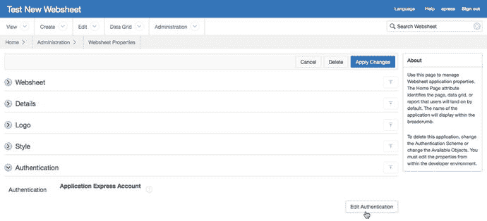

**图 11-10.** 为 WebSheet 设置的 Application Express 账户身份验证

当您点击“编辑身份验证”按钮时，您将被重定向到应用程序生成器中的 WebSheet 应用程序属性页面（参见图 11-11）。

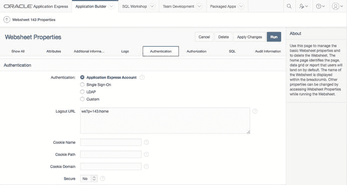

**图 11-11.** 应用程序生成器中显示的用户身份验证选项

当您使用 Application Express 账户身份验证选项并且也登录到应用程序生成器时，点击“编辑身份验证”按钮会将您带出 WebSheet 并直接进入应用程序生成器。一开始您可能不明显感觉到这个转换，因为页面主体相似。您需要通过查看页面顶部和菜单来验证您的上下文。参见图 11-11。

如果 WebSheet 使用 SSO、LDAP 或自定义身份验证，您必须以 APEX 管理员或开发人员身份登录到 APEX Builder。登录后，导航到 WebSheet 的应用程序属性页面，在那里您可以选择所需的身份验证方案并进行配置。图 11-11 所示示例的细节将在第 12 章中讨论。

## 用户授权

网页表格有三种授权角色：

*   **读者**：这是只读角色。图 11-12 展示了读者看到的网页表格主页。该页面包含内容以及导航对象。当你深入查看数据页面时，可以看到数据，但无法看到用于添加、更改和删除数据的按钮。

    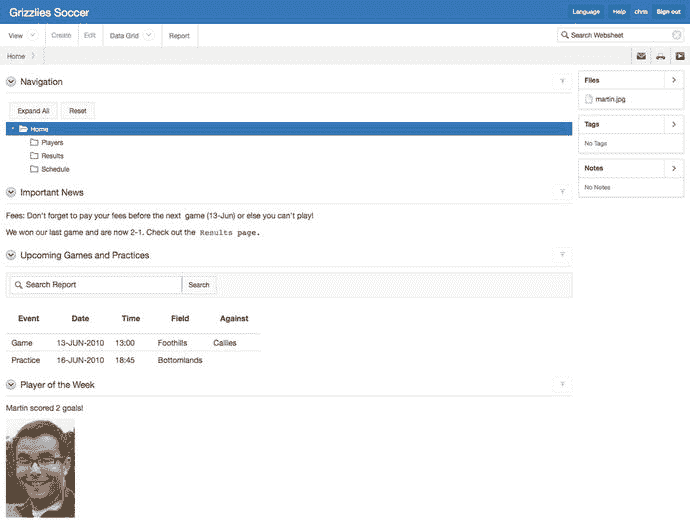

    图 11-12. 读者看到的网页表格主页

*   **贡献者**：此角色被允许添加、更改和删除网页表格的内容，以及操作结构。图 11-13 是贡献者看到的网页表格主页。请注意为此角色添加的丰富功能集。顶部的下拉菜单包含指向结构页面的链接。文本部分包含`编辑`链接。右侧部分包含指向结构页面的链接。当你深入查看数据页面时，可以看到允许你添加、更改和删除内容的按钮。

    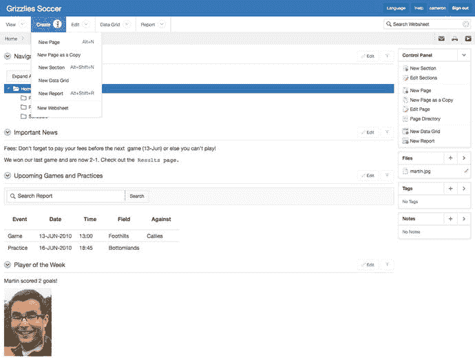

    图 11-13. 贡献者看到的网页表格主页

*   **管理员**：此角色可以创建和删除网页表格。它负责维护网页表格的全局属性，并维护可以访问该网页表格的用户列表。图 11-14 是管理员视图的网页表格主页。与贡献者视图相比，唯一的增加是页面顶部的`管理`下拉菜单。

    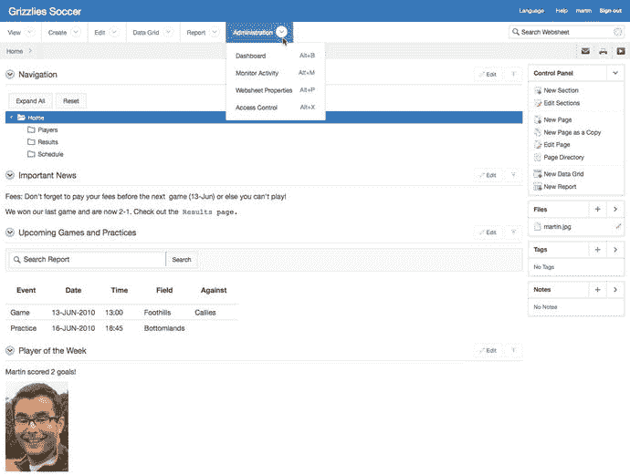

    图 11-14. 管理员看到的网页表格主页

网页表格管理员通过`访问控制列表`配置用户权限，该列表位于`管理`下拉菜单下（见图 11-15）。此任务通常在设置身份验证方案后完成。

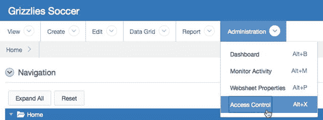

图 11-15. 导航到访问控制列表

`访问控制列表`易于创建和维护（见图 11-16）。点击`创建条目`按钮可以创建新条目。点击列表中的铅笔图标可以更改现有条目。在这两种情况下，你都会被带到`条目详情`页面，该页面只有两个字段：用户名和权限级别（见图 11-17）。

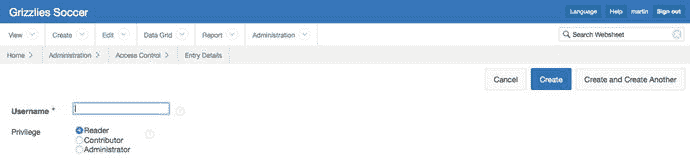

图 11-17. 条目详情页面

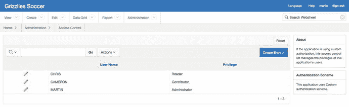

图 11-16. 访问控制列表

`访问控制列表`对所使用的身份验证方案有一定敏感性。当你使用`SSO`、`LDAP`或自定义身份验证方案时，`访问控制列表`是必需的。在此上下文中，它易于理解和构建。你将`访问控制列表`构建为身份验证方案中用户列表的副本。两个列表之间的连接点是用户名。网页表格用户名必须与身份验证方案中的用户 ID 匹配。

当你使用`Application Express 帐户`身份验证方案时，事情会变得有点难以理解。在这种情况下，使用`访问控制列表`是可选的。因为网页表格位于 Application Express 工作区内部，所以它可以直接使用现有的`APEX`用户帐户。网页表格权限是从`APEX`用户帐户权限推断出来的。表 11-2 说明了`APEX`工作区权限与网页表格权限之间的转换。你可以通过将`APEX`用户添加到`访问控制列表`来覆盖默认转换。例如，你可能希望某个`APEX`工作区管理员在特定网页表格上拥有`读者`权限。为此，你将`APEX`工作区管理员的 ID 添加到`访问控制列表`，并将权限设置为`读者`。

表 11-2. 访问控制配置

| 身份验证方案 | 无访问控制列表 | 有访问控制列表 |
| --- | --- | --- |
| `Application Express 帐户` | `APEX 管理员` = 网页表格管理员 `APEX 开发人员` = 网页表格贡献者 `APEX 终端用户` = 网页表格读者 | `访问控制列表`会覆盖推断出的`APEX`网页表格权限。 |
| `单点登录` | 不适用 - `访问控制列表`是必需的。 | `访问控制 ID`必须与`SSO ID`匹配。 |
| `LDAP` | 不适用 - `访问控制列表`是必需的。 | `访问控制 ID`必须与`LDAP ID`匹配。 |
| `自定义` | 不适用 - `访问控制列表`是必需的。 | `访问控制 ID`必须与自定义 ID 匹配。 |

网页表格可以设置为公开访问。这意味着任何调用网页表格 URL 的人都被允许以`读者`角色访问该网页表格。不需要使用 ID 和密码登录。你可以通过转到`APEX 应用程序构建器`中网页表格的`属性`页面，并更改`授权`部分下的`允许公共访问`控件来设置此功能。参见图 11-18。

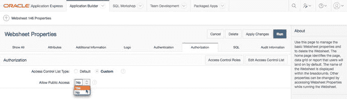

图 11-18. 导航到应用程序属性页面

在`允许公共访问`下拉菜单中选择`是`，然后点击`应用更改`按钮。现在，当你运行网页表格应用程序时，你会自动以用户“nobody”登录，并拥有`读者`权限。需要更新网页表格内容的管理员和贡献者可以通过所有网页表格页面右上角出现的`登录`链接进行登录（见图 11-19）。

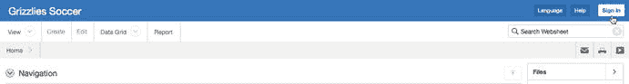

图 11-19. 带有登录链接的公开网页表格

## 章节

章节包含你的内容。接下来的章节将通过向你展示现有对象的`编辑`页面，来说明网页表格结构环境中的有用功能。创建新网页表格对象的分步过程将在第 12 章中介绍。

### 文本部分

文本部分包含文本、嵌入的链接和图像。文本部分可用于创建维基和博客。要启动一个维基，原始作者创建一个文本部分，然后邀请贡献者编辑该文本部分的内容。要启动一个博客，原始作者创建一个文本部分，然后邀请贡献者在回复第一个部分时添加更多的文本部分。

要访问文本部分的“编辑”页面，你需要点击该文本部分右上角的 `编辑` 链接（参见图 11-20）。

图 11-20. 导航到文本部分的编辑页面

文本部分的编辑页面在调用时简洁明了。默认情况下，可折叠区域是折叠状态（参见图 11-21）。右上角的可折叠区域链接（一个小箭头图标）包含文本格式控件。点击此图标展开该区域，会显示一个类似于你常用文字处理器的编辑面板。

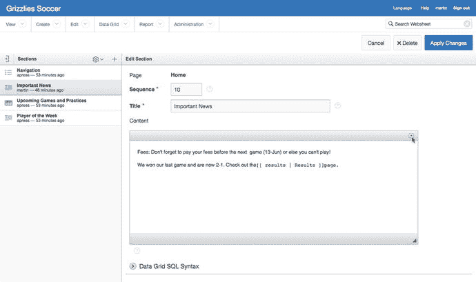
图 11-21. 文本部分的编辑页面，折叠状态

左下角的链接 `数据网格 SQL 语法` 包含指向如何从你的 WebSheet 中的数据网格访问信息的链接。点击这些链接会弹出一个页面，其中包含许多数据查询和链接的、可剪切粘贴的语法。

最后，左侧部分包含页面上所有部分的列表。点击任何一个部分名称都可以编辑该部分的属性和/或内容。该区域顶部还有一个工具栏，可让你执行各种任务。参见图 11-22。

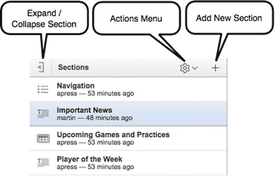
图 11-22. “编辑部分”页面上的“部分”工具栏

当你展开可折叠区域时，可以看到可用于增强你内容的丰富功能（参见图 11-23）。右上角的图标展开为一个包含多个格式图标的区域。我们不会详细描述每个格式图标的用法；它们非常直观，因为它们与你可能经常使用的其他工具（如文字处理器）相似。

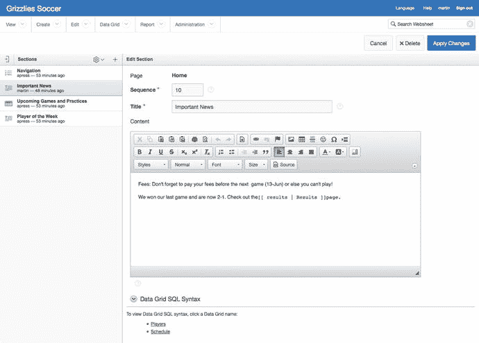
图 11-23. 文本部分的编辑页面，展开状态

其他可用元素包括：

*   页面底部的页面部分列表向你显示当前部分相对于页面上其他部分的位置。
*   “帮助”部分包含指向帮助页面选项卡的直接链接。
*   “任务”部分包含指向自动化流程的链接，用于将该部分移动到现有或新页面。

`显示历史记录` 链接将在本章后面的“管理”部分进行解释。

**注意**
许多页面在底部包含可折叠区域。有些区域包含帮助文本；其他区域包含有助于让你感知位置和上下文的列表，这反过来又有助于你正确编写内容。在所有情况下，页面底部的可折叠区域都非常有用。

### 导航部分

向 Web 内容添加导航部分最重要的方面在于，添加它们几乎不需要你费心费力或进行思考。导航部分易于使用，因为它们是声明式的，WebSheet 会处理几乎所有的细节，如页面链接和格式。添加导航部分的细节将在 第 12 章 中讨论。

图 11-24 显示了一个页面导航部分。点击 `编辑` 链接将带你进入编辑页面（参见图 11-25）。编辑页面有五个输入项：

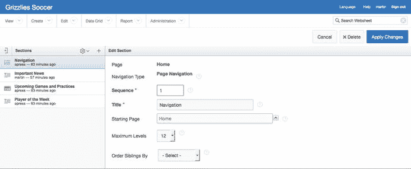
图 11-25. 页面导航部分的编辑页面

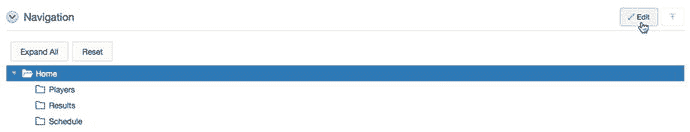
图 11-24. 页面导航部分

*   `顺序`：定位该部分在页面上其他部分中的位置。
*   `标题`：该部分的标题。
*   `起始页面`：让你从页面层次结构中主页下方的页面开始导航树。在此示例中，用户可以在其个人页面顶部添加一个页面导航部分，该部分仅显示层次结构中其个人页面下方的页面。
*   `最大层级`：限制在页面导航部分中显示的层级数量。在此示例中，如果你将 `最大层级` 值设置为 3，即使用户在其个人页面下添加了子页面，你也只会看到图 11-24 中显示的页面。
*   `同级排序依据`：允许你选择同一层级所有页面的排序顺序。选项包括 `页面名称`、`创建日期` 和 `更新日期`。

图 11-26 显示了一个部分导航部分，你可以在图 11-27 中看到其编辑页面。唯一的输入项是 `顺序` 和 `标题`。在这种情况下，WebSheet 会处理所有其他细节。你不需要做任何工作。

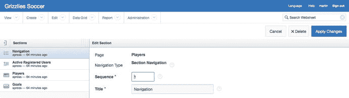
图 11-27. 部分导航部分的编辑页面

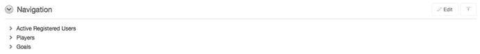
图 11-26. 部分导航部分

### 数据部分

数据部分有两种类型：数据网格和报告。数据网格是类似电子表格的对象，你可以完全在 WebSheet 内部创建。报告显示来自 WebSheet 外部的外部数据库表或视图的只读数据。

我们将首先了解数据网格，因为它们是 WebSheet 原生的，并且很可能是你使用最多的部分。

#### 数据网格

数据网格是网络表格中最复杂的部分。不过，如果您对电子表格有所了解，那么学习如何使用网络表格中的数据网格可能会觉得相当容易。

本节将重点介绍数据网格的一些特性。第 12 章将引导您完成从头创建数据网格所需的步骤。

数据网格用于以列行格式组织数据。设计和数据都保存在网络表格环境中；无需外部配置。

数据网格和报表都可以放入数据部分中，您还可以在文本部分嵌入指向它们的链接。图 11-28 显示了在数据部分中显示的数据网格。在此上下文中，数据网格是只读的，就像报表一样。“编辑”链接会转到允许您编辑数据部分的页面，但不能编辑数据网格本身。

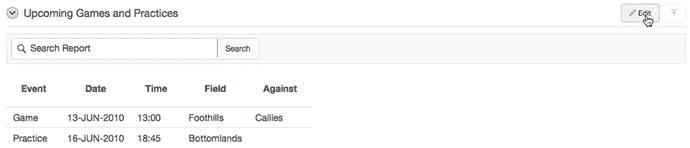
图 11-28. 在数据部分中显示的数据网格

您可以使用“数据网格”下拉菜单导航到维护数据网格数据的上下文（参见图 11-29）。您可以直接从菜单导航到单个数据网格，也可以从“查看全部”报表中单击其链接。

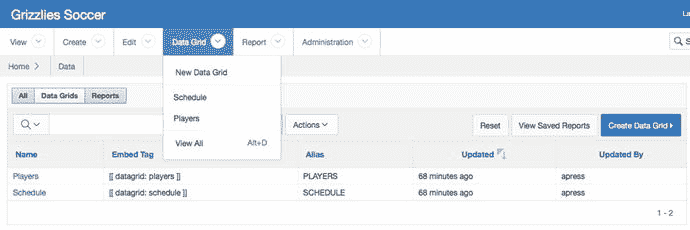
图 11-29. 导航到数据网格的数据录入上下文

图 11-30 显示了“日程”数据网格。搜索文本框、“执行”按钮、“报表”下拉列表和“操作”下拉菜单都是前面讨论过的标准交互式报表功能。

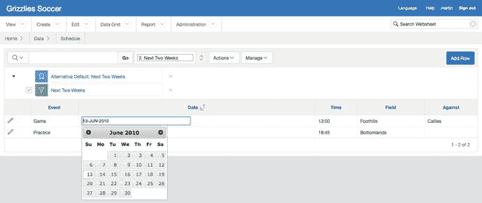
图 11-30. 在数据网格中编辑数据

然而，与传统的交互式报表不同，您可以在这里直接在数据网格中更改数据。当您单击某个单元格时，该单元格会变成可编辑项，您可以直接在其中键入数据。如果将某列配置为日期类型，则会自动弹出日历以帮助准确输入日期。您还可以将某列配置为具有值列表；定义此配置后，该单元格将包含一个下拉列表。此外，您可以使用网格左侧的铅笔图标链接到用于编辑单个行的表单页面（参见图 11-31）。当数据网格包含许多列并且对于您的计算机屏幕来说太宽时，这很方便。

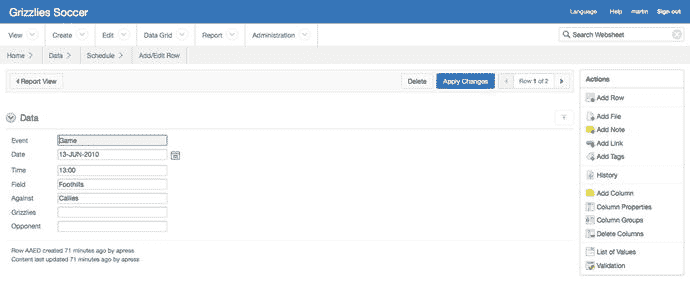
图 11-31. 在表单页面上编辑一行数据

您通过从“管理”下拉菜单中选择选项来管理数据网格的结构。图 11-32 和图 11-33 显示了所有的数据网格配置选项。

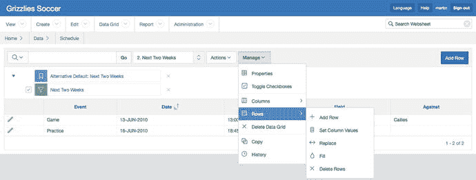
图 11-33. 数据网格管理，行选项已展开

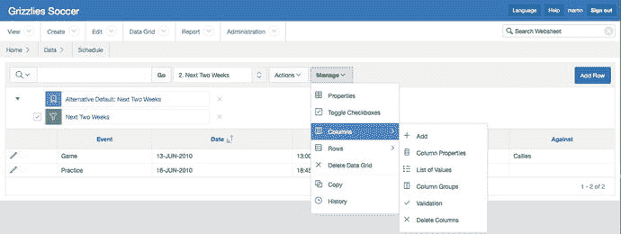
图 11-32. 数据网格管理，列选项已展开

当您选择“管理”菜单选项之一时，将显示一个交互式编辑部分，它以模态对话框的形式呈现。如图 11-34 所示。所有编辑部分都包含自己的“取消”和“应用”按钮。您必须单击“应用”按钮才能保存更改。

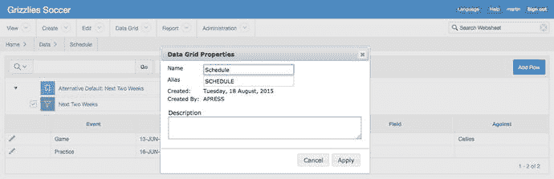
图 11-34. 数据网格管理，“数据网格属性”菜单选项

“管理”下拉菜单为您提供了一组丰富的选项，使您可以将数据网格用作简单友好的类电子表格应用程序。大多数选项都易于使用；第 12 章中会更深入地说明这些选项。“管理”菜单选项总结如下：

*   属性：编辑数据网格的整体属性。
*   切换复选框：打开或关闭行选择复选框。行选择复选框用于对选定行执行批量更新。
*   列：
    *   添加：向数据网格添加新列。
    *   列属性：更改已创建列的属性。
    *   值列表：创建命名的值列表。一个命名的值列表可以在多个数据网格中使用。
    *   列组：创建列组。
    *   验证：添加数据录入验证。验证是从预定义的业务规则列表中选择的。您可以同时使用多个验证来实现一个结果。例如，为确保数字大于零，您可以将“指定列不为零”验证与“指定列表达式中不包含的任何字符”验证结合使用，并在“验证表达式”文本区域中输入减号字符。最后一点说明了一个事实：数据网格中的所有底层数据都是文本，有时您需要使用多个验证规则才能实现一个结果。
    *   删除列：删除一列或多列。
*   行：
    *   添加行：显示数据录入页面，您可以在其中输入新数据。
    *   设置列值：在单个列中为多行输入数据。可以为“所有行”、“选定行”或“空行”设置值。
    *   替换：类似于文本编辑器和文字处理器中的查找和替换功能。可应用于“所有行”或“选定行”。
    *   填充：用其上方的值填充列中的空单元格。
    *   删除行：从数据网格中删除行。可以针对“所有行”、“选定行”或“具有空列的行”执行此操作。
*   删除数据网格：从网络表格中删除数据网格。
*   复制：制作数据网格的副本。
*   历史记录：数据的审核跟踪。

#### 报表：设置

在贡献者能够使用报表功能以及相关的 SQL 标签功能之前，管理员需要进行少量设置。通过导航到 APEX 应用程序构建器并编辑网络表格的属性来开始设置过程。在 SQL 和 PL/SQL 部分（参见图 11-35），将“允许 SQL 和 PL/SQL”设置为 `Yes`。执行此操作后，单击“添加对象”按钮以显示图 11-36 所示的页面。此页面使您可以创建建议对象列表。建议对象列表是一个可选的便利功能，可自动创建包含有用注释的数据库对象下拉列表。

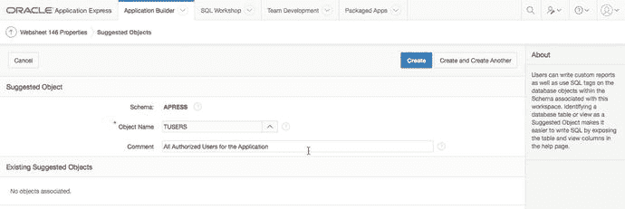
图 11-36. 创建建议的数据库对象列表

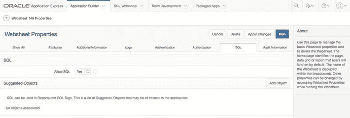
图 11-35. 网络表格报表和 SQL 标签设置
注意

当您将“允许 SQL 和 PL/SQL”设置为 `Yes` 时，您就授予了贡献者访问网络表格默认模式中所有数据库对象的权限。这可能是一个严重的安全问题。在使用此功能之前，务必与您的 Oracle 数据库管理员（DBA）沟通，确保敏感数据不会被意外暴露。

### 报表：创建

在应用程序构建器中设置好“允许 SQL 和 PL/SQL”功能后，请返回到您的 WebSheet。您可以通过从`报表菜单`中选择“新建报表”（见图 11-37），或通过点击“查看所有报表”页面上的`创建报表按钮`来创建报表。

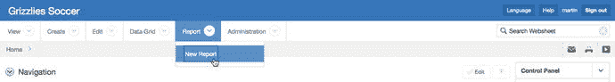
图 11-37. 选择“新建报表”选项

`创建报表页面`会提示您选择两种报表源之一（见图 11-38）。`表报表源`会创建一个包含所选表或视图中所有列的报表。`SQL 查询报表源`（见图 11-39）则基于 SQL 语句创建报表。使用 SQL 语句能让您在根据需求定制报表时拥有极大的灵活性。在两种情况下，请单击“下一步”进入确认页面，在创建报表前检查您的输入。

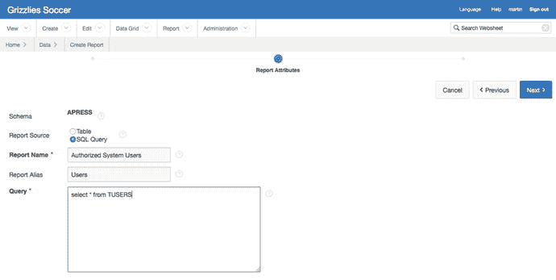
图 11-39. 基于 SQL 语句创建报表

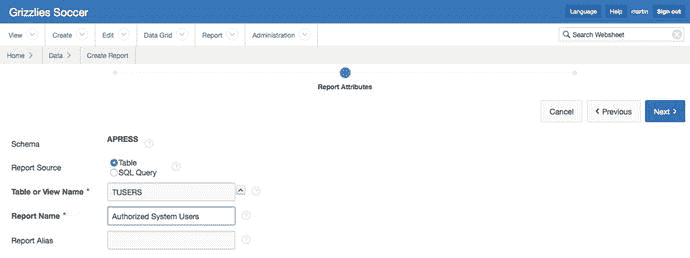
图 11-38. 基于表或视图创建报表

### 报表：访问数据

用户当然希望看到报表数据。报表数据通过三种方式提供：

*   **导航至报表：** 图 11-40 向您展示了在`报表下拉菜单`下找到报表列表的位置。点击菜单中报表的`名称链接`将带您进入`报表数据页面`。图 11-41 展示了本示例中的“授权系统用户”报表。
    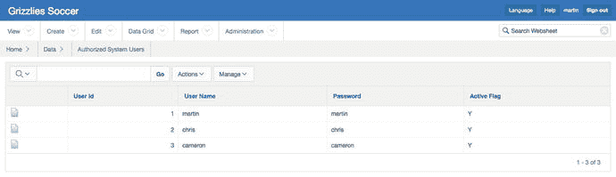
    图 11-41. 报表数据页面
    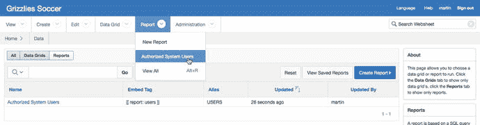
    图 11-40. 导航至报表
*   **在文本区嵌入报表链接：** 图 11-40 中的报表列表包含一个`嵌入标签列`。此列包含用于在文本区中添加指向该报表的链接的标记语法。您只需将该标记语法复制并粘贴到文本区，即可添加一个链接，该链接将带您进入图 11-41 所示的“授权系统用户”报表。
*   **创建数据区：** 基于报表创建数据区非常简单。向导将引导您完成步骤。首先导航到将包含您报表的页面，然后单击下拉菜单或页面右侧`控制面板`中的`新建区链接`之一（见图 11-42）。这将启动`创建区向导`。在第一页选择`数据图标`并单击“下一步”（见图 11-43）。现在，将数据区链接到其数据源（见图 11-44）。在此示例中，您将数据区链接到“授权系统用户”报表。此页面允许您将数据区链接到任何先前创建的数据网格或报表。单击“下一步”，进入确认页面。一旦您点击确认页面上的`创建按钮`，您将返回到内容页面，并且您的报表会显示在新的数据区中（见图 11-45）。
    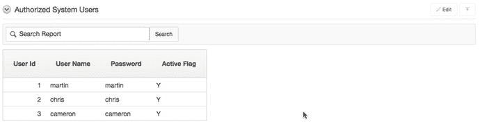
    图 11-45. 包含报表的数据区
    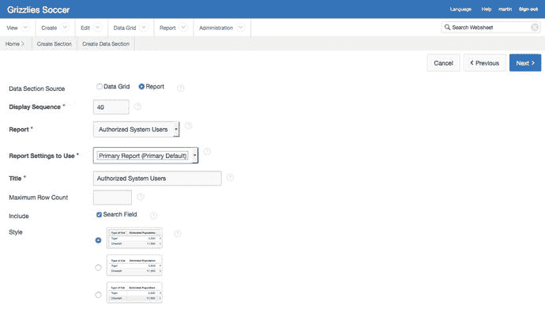
    图 11-44. 新建区向导：数据源
    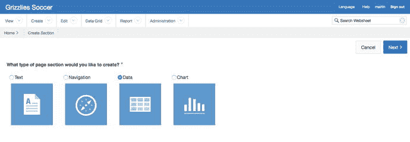
    图 11-43. 新建区向导：选择区类型
    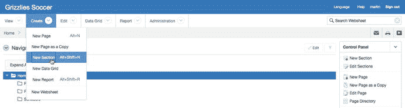
    图 11-42. 新建区链接

### 图表区

图表区是向内容添加图形的简便方法。首先，您必须创建一个包含至少一个数值列的报表或数据网格。其次，运行`创建图表向导`。该向导将报表或数据网格链接到图表，并设置轴标签。这个简单过程的细节和视觉效果将在第 12 章中介绍。

### 注释

注释用于向您的页面或数据网格中的单独行添加额外内容。有四种类型的注释：

*   **文件：** 两种类型的文件可以上传到您的 WebSheet 中。图像文件显示在文本区内。其他文件格式（如 PDF）可以上传到 WebSheet，然后下载到最终用户的计算机上。在这两种情况下，您都使用标记语法来实现结果。
*   **标签：** 标签是附加到内容上的自由格式文本词，用于增强 WebSheet 的搜索功能。
*   **笔记：** 笔记就像便利贴。当您添加笔记时，它会出现在页面右侧的一个区域中。
*   **链接：** 链接允许用户导航到任何有效的 URL。注释链接与数据网格中的行相关联；它们不能与页面相关联。要向页面添加链接，您应使用标记语法，而不是注释。

图 11-46 显示了 WebSheet 页面上的`注释区`。点击各种链接可以添加、更改和删除注释。

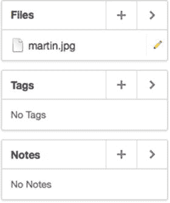
图 11-46. 页面右下角的注释区

### 管理

像任何博客或 Wiki 一样，WebSheet 应定期由被授予管理员角色的审核员进行审查。这使得审核员能够查看`仪表板`和`监控活动页面`（见图 11-47）。这些页面及其底层报表为审核员提供了工具，用以了解哪些页面最受欢迎和最不受欢迎、渲染页面需要多长时间、谁在使用 WebSheet，以及许多其他有助于审核员确保 WebSheet 以最佳状态运行的参数。

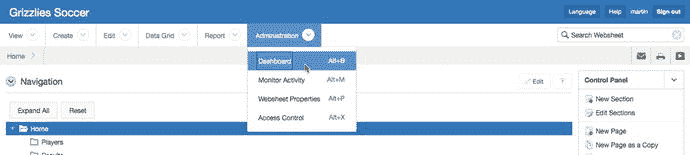
图 11-47. 导航到仪表板和监控活动页面

在您学习第 12 章时，请注意标有`历史记录`的链接。这些`历史记录链接`遍布于 WebSheet 的结构导航区域。它们将您带到上下文相关的报表页面，这些页面包含 WebSheet 更改的全面审计跟踪。贡献者知道他们的更改会被审核，就会努力保持其贡献的高标准。

### 总结

本章带您详细了解了 WebSheet，以便您能够以创新和创造性的方式使用它们。第 12 章将通过循序渐进地指导您从头开始构建一个 WebSheet，作为对本章内容的补充。

