# 12. 网页表格示例

电子补充材料 本章的在线版本（doi:[10.1007/978-1-4842-0466-5_12](http://dx.doi.org/10.1007/978-1-4842-0466-5_12)）包含补充材料，可供授权用户使用。

前一章涵盖了网页表格的许多不同功能。在本章中，你将使用这些功能从头开始构建一个应用程序。

示例应用程序管理一个公司足球队。目前，球员名单和日程安排维护在电子表格中。当日程更新时，电子表格会通过电子邮件发送给所有球员。正如你所能想象的，以这种方式管理球队会非常令人沮丧。

网页表格是管理足球队的好方法，因为构建网页表格只需要最少的开发人员或数据库管理员协助。所有文件以及最终应用程序的副本，都可以在本书引言中描述的示例下载中找到。

## 设置

为了突出网页表格与数据库中的对象交互的能力，让我们创建一些在本章中会引用的数据库对象。这些对象模拟了你组织中现有的用户表和登录函数：

在 SQL*Plus 中或直接在 APEX 的 SQL Workshop 中运行以下代码，该代码包含在示例下载中，文件名为 `ch12_database_objects.sql`：
```sql
-- Create Users Table
CREATE TABLE tusers (
   user_id       NUMBER (5, 0) PRIMARY KEY,
   user_name     VARCHAR2 (10) NOT NULL UNIQUE,
   password      VARCHAR2 (10) NOT NULL,
   active_flag   VARCHAR2 (1) NOT NULL
);
-- Create sequence for IDs
CREATE SEQUENCE sn_users;
-- Create Users
-- Note: You should not store passwords in clear text.
-- This was done for demonstration purposes.
INSERT INTO tusers ( user_id, user_name, password, active_flag)
     VALUES (sn_users.NEXTVAL, 'martin', 'martin', 'Y');
INSERT INTO tusers ( user_id, user_name, password, active_flag)
     VALUES (sn_users.NEXTVAL, 'chris', 'chris', 'Y');
INSERT INTO tusers ( user_id, user_name, password, active_flag)
     VALUES (sn_users.NEXTVAL, 'cameron', 'cameron', 'Y');
-- Authentication Function
CREATE OR REPLACE FUNCTION f_login (p_username IN VARCHAR2, p_password IN VARCHAR2)
  RETURN BOOLEAN
AS
  v_count   PLS_INTEGER;
BEGIN
  SELECT COUNT (user_id)
    INTO v_count
    FROM tusers
   WHERE LOWER (user_name) = LOWER (p_username)
     AND password = p_password
     AND active_flag = 'Y';
  IF v_count = 1 THEN
    RETURN TRUE;
  END IF;
  RETURN FALSE;
END f_login;
/
COMMIT;
```

## 创建和配置网页表格应用程序

要创建网页表格应用程序，你需要有权访问 APEX Builder。登录后，按照以下步骤创建网页表格应用程序：

1.  导航到应用程序生成器。
2.  单击“创建”按钮。
3.  为应用程序类型选择“网页表格”，如图 12-1 所示，然后单击“下一步”。

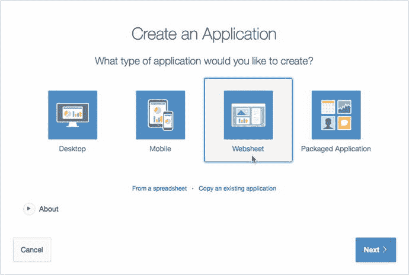
图 12-1. 创建网页表格应用程序

4.  在下一个屏幕上，为“名称”输入 `灰熊队足球`，并使用网页表格的默认 ID。取消选中“包含入门指南”复选框。
5.  单击“创建网页表格”按钮。

你现在应该会看到一个成功页面，其中包含运行网页表格的选项（参见图 12-2）。

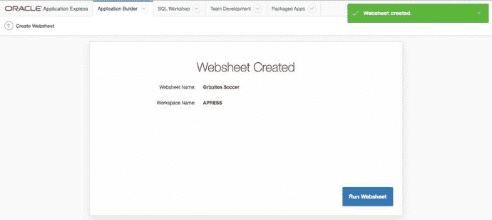
图 12-2. 网页表格创建成功页面

灰熊队是你的公司足球队，因此你希望用户能够使用他们当前的公司账户登录。要使用公司认证，你需要配置应用程序并修改授权方案。

由于你尚未定义认证方案，因此你需要访问 APEX Builder 来修改应用程序属性。这是需要 APEX Builder 访问权限的最后一个步骤。以下步骤描述了如何修改应用程序属性：

1.  单击页面顶部的“应用程序生成器”选项卡，以返回应用程序生成器主页。
2.  通过单击名称或图标来编辑你创建的新应用程序（`灰熊队足球`）。
3.  修改以下部分中的项目：
    -   **属性**：为“应用程序日期格式”输入 `DD-MON-YYYY`，如图 12-3 所示。
        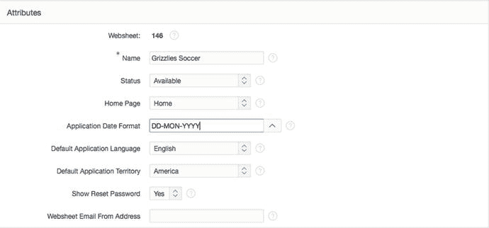
        图 12-3. 应用程序日期格式
    -   **认证**：选择“自定义”作为认证类型，并在“认证函数”字段中将 `- BUILTIN -` 替换为语句 `return f_login`，如图 12-4 所示。将所有其他输入保留为默认值。（`f_login` 指的是你在本章“设置”部分创建的函数。）
        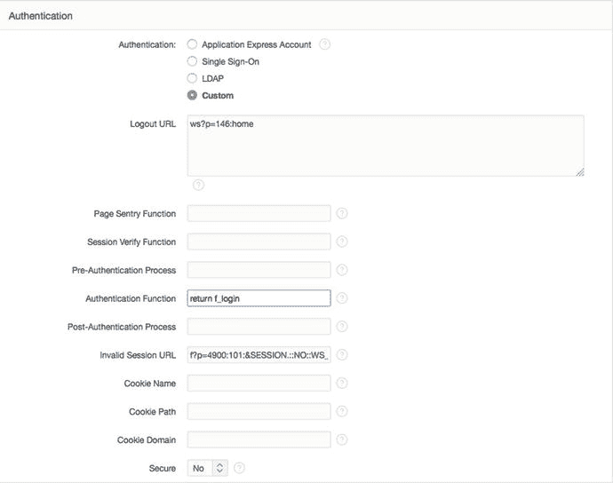
        图 12-4. 自定义认证
    -   **SQL**：为“允许 SQL”选择“是”。这允许你引用底层模式中的表和视图。选择“是”后，会出现一个“添加对象”按钮。单击“添加对象”并为“对象名称”输入 `TUSERS`，如图 12-5 所示。这将允许用户在创建报表时快速选择 `TUSERS` 表。单击“创建”按钮，这将带你返回应用程序属性页面。
        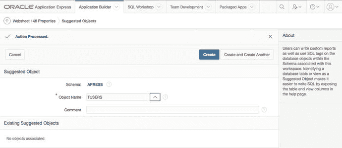
        图 12-5. 添加对象
    -   **授权**：在使用自定义认证方案之前，你需要为应用程序定义一个管理员。为此，单击“编辑访问控制列表”按钮。在新页面上，单击“创建条目”按钮。在“用户名”字段中输入 `martin`，并为“权限”选择“管理员”，如图 12-6 所示。单击“创建”以将 `martin` 注册为管理员。你将被带回到“访问控制列表”页面。单击“取消”按钮返回应用程序属性页面。单击“应用更改”按钮保存你的更改。
        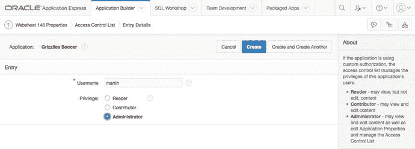
        图 12-6. 访问控制列表：添加管理员

## 向网页表格添加内容

在上一节中，你创建并配置了一个网页表格应用程序来管理你的公司足球队。在本节中，你将创建数据网格并向应用程序添加内容。

运行网页表格应用程序并以 `martin`/`martin`（站点管理员）身份登录。登录后，页面应如图 12-7 所示。现在你已准备好创建你的第一个数据网格。

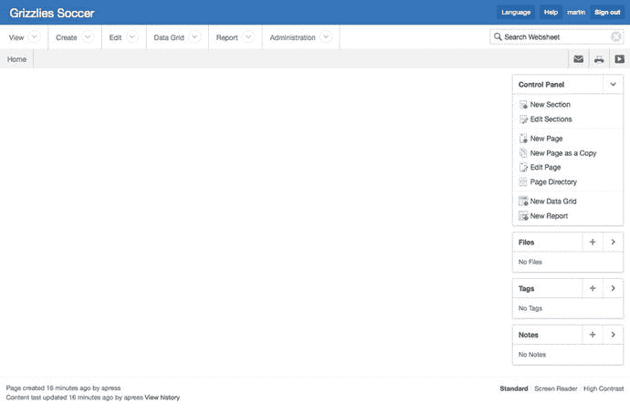
图 12-7. 初始网页表格应用程序

注意：运行网页表格应用程序的 URL 是 `<apex_url>/ws?p=<web_sheet_id>`。例如：[`http://www.example.com/apex/ws?p=103`](http://www.example.com/apex/ws?p=103)，其中 `103` 是网页表格应用程序 ID。


## 创建数据网格

首先要做的是创建一些称为数据网格的自定义表。提醒一下：数据网格仅存在于 websheet 应用程序的上下文中。它们并不作为表存在于数据库模式中。创建数据网格有两种方法：通过粘贴来自电子表格的现有数据，或通过手动定义每个列从头开始创建。在本节中，你将使用这两种方法创建数据网格。

你目前将比赛和训练日程保存在电子表格中。你可以使用复制和粘贴来导入数据并同时创建数据网格。请遵循以下过程：
1.  单击应用程序顶部的 `Data Grid` 选项卡。
2.  在下拉菜单中单击 `New Data Grid` 选项。
3.  选择 `Copy and Paste` 作为输入方法，然后单击 `Next`。
4.  在 `Name` 和 `Alias` 字段中输入 `Schedule`。
5.  在 Microsoft Excel 中打开可在本章示例代码中找到的 `Grizzlies_Schedule.csv`，并选择所有字段，包括标题。复制这些值并将其粘贴到 `Paste Spreadsheet Data` 文本区域中。
6.  确保 `First Row Contains Column Headings` 复选框被勾选，然后单击 `Upload` 按钮。

你现在应该看到交互式报表中的数据，如图 12-8 所示。

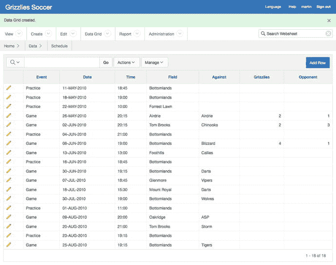
图 12-8. 数据网格结果

你还需要创建一个数据网格来跟踪每个球员的进球数。你没有任何现成的电子表格数据可供复制和粘贴，因此这次手动创建数据网格是合理的。请遵循以下步骤：
1.  单击应用程序顶部的 `Data Grid` 选项卡。
2.  单击 `New Data Grid` 菜单选项。
3.  选择 `From Scratch` 作为输入方法，然后单击 `Next`。
4.  填写数据网格定义，如图 12-9 所示，然后单击 `Create Data Grid` 按钮以完成数据网格的创建。

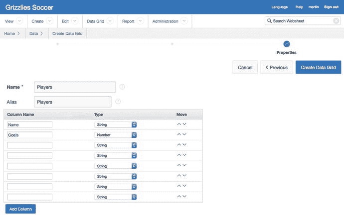
图 12-9. 从头开始创建数据网格

## 应用约束

现在你已经有了数据网格，需要向它们添加一些约束。因为数据网格不是数据库对象，你必须使用 websheet 界面来应用约束。

在 `Players` 数据网格中，你需要确保所有字段都包含数据，并且 `Goals` 列的默认值为 `0`。要应用这些约束，请遵循以下步骤：
1.  单击 `Data Grid` 选项卡。
2.  在下拉菜单中单击 `Players`。
3.  单击 `Manage` 按钮，然后选择 `Columns` ➤ `Column Properties`，如图 12-10 所示。

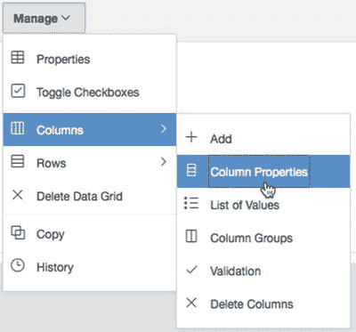
图 12-10. 数据网格列属性
4.  在 `Column Name` 选择列表中选择 `Name`。
5.  将 `Value Required` 选择为 `Yes`。
6.  在修改另一个列之前，必须显式保存你的更改。单击底部的 `Apply` 按钮。
7.  再次打开 `Column Properties` 部分（重复步骤 3）。
8.  在 `Column Name` 选择列表中选择 `Goals`。
9.  将 `Value Required` 选择为 `Yes`。
10. 在 `Default Text` 字段中，输入 `0`。
11. 单击 `Apply`。

现在，当你创建球员时，`Name` 和 `Goals` 都是必填值。`Goals` 默认值为 `0`。

## 添加球员

要将球员添加到 `Players` 数据网格，请单击 `Add Row` 按钮。对于本例，添加如图 12-11 所示的球员及其进球数。

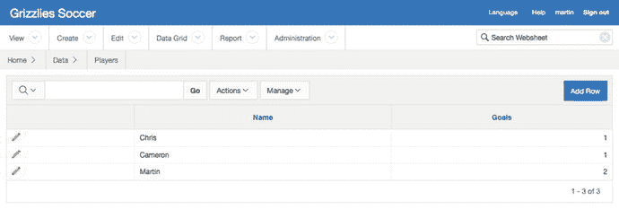
图 12-11. 球员数据

## 创建替代默认报告

现在数据网格中已有数据，你可以创建替代默认报告，在创建区域时可以引用它们。数据网格允许你保存报告，就像交互式报告一样。替代默认报告是已保存的数据网格报告，可以在整个 websheet 应用程序中显示。

注意：你将创建的一些报告对日期敏感。通常，你会使用 `SYSDATE` 作为参考点。但在这里，你将使用静态日期 `10-Jun-2010` 来模拟常见的 `SYSDATE`。这确保你将看到与本书中显示的数据相同。

第一个替代报告突出显示未来两周的比赛和训练。要创建此报告，请遵循以下步骤：
1.  使用 `Data Grid` 选项卡导航到 `Schedule` 数据网格。
2.  单击 `Actions` 按钮，然后选择 `Filter`。
3.  将 `Filter Type` 选择为 `Row`。
4.  为 `Name` 输入 `Next Two Weeks`。
5.  为 `Filter Expression` 输入以下内容：
    `B >= to_date('10-jun-2010', 'dd-mon-yyyy') and B < to_date('10-jun-2010', 'dd-mon-yyyy') + 14`
6.  单击 `Apply` 按钮。
7.  通过单击 `Date` 列标题并选择 `Ascending` 排序图标，将 `Date` 列按升序排列。
8.  隐藏 `Grizzlies` 和 `Opponents` 列，因为你没有未来比赛的分数。为此，从 `Actions` 菜单中选择 `Select Columns` 选项。
9.  选择 `Actions` ➤ `Save Report`。
10. 在 `Save` 选择列表中选择 `As Default Report Settings`。
11. 将 `Default Report Type` 选择为 `Alternate`，并为 `Name` 输入 `Next Two Weeks`。
12. 单击 `Apply`。

该报告现在应如图 12-12 所示。

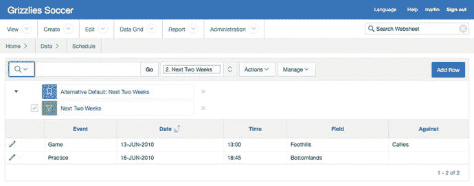
图 12-12. 未来两周

因为你已经学会了如何操作和创建已保存的交互式报告，请为 `Schedule` 数据网格创建以下替代默认报告：

*   **剩余比赛**：此报告列出了赛季中剩余的所有比赛。
*   **剩余训练**：此报告列出了赛季中剩余的所有训练。
*   **比赛结果**：此报告列出了所有已完成的比赛及其比分。


### 创建页面章节

在本节中，你将修改现有页面并创建新的章节。你将了解可以添加到网页中的几种不同类型的内容。

首先，你将通过创建几个章节来修改主页，以帮助玩家立即获取最重要的信息。请按照以下步骤修改“欢迎”章节，以包含重要新闻：

点击顶部的 `查看` 选项卡。在下拉列表中选择 `主页`。在页面右侧的 `控制面板` 中，点击 `新建章节`。选择 `文本` 作为 `章节类型`，然后点击 `下一步`。在 `标题` 中输入 `重要新闻`。在 `内容` 部分输入以下内容：
```
费用：请不要忘记在下一场比赛（6 月 13 日）之前支付费用，否则您将无法参赛！
我们赢了上一场比赛，现在战绩是 2 胜 1 负。请查看[[ 结果 | 结果 ]]页面。
```
这个涉及方括号的特殊符号会创建一个指向 `结果` 页面的链接，你将在本章后面创建该页面。点击 `创建章节` 按钮。

现在，主页应该如图 12-13 所示。

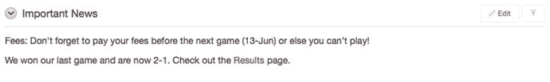

图 12-13. 重要新闻

> 注意：请注意，指向 `结果` 页面的链接显示为红色。这是因为你创建了一个无效链接。一旦创建了 `结果` 页面，该链接将变为灰色。

接下来，你将在主页上创建一个新章节，以突出显示即将到来的比赛和训练。此章节引用了你之前创建的其中一个备用默认保存报告。请按照以下步骤创建该章节：

在查看 `主页` 时，点击右侧 `控制面板` 区域中的 `新建章节` 链接。选择 `数据` 作为 `章节类型`，然后点击 `下一步`。选择 `日程` 作为 `数据网格`，并选择 `接下来两周（备用默认）` 作为 `要使用的报告设置`。将 `标题` 改为 `即将到来的比赛和训练`。选择一个样式（本例中所有章节均使用 `2`），然后点击 `下一步`。在确认页面上，点击 `创建章节` 按钮。

新章节应该如图 12-14 所示。

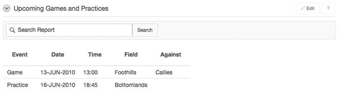

图 12-14. 即将到来的比赛和训练

每周，教练都喜欢突出显示一名本周最佳球员。教练希望在这个章节中包含图片和一些文字。本周，Martin 是“本周最佳球员”奖的幸运获得者。请按照以下步骤创建“本周最佳球员”章节：

首先，你需要上传球员的图片。在右侧的 `文件` 区域，点击 `加号` 链接，如图 12-15 所示。

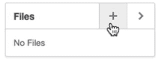

图 12-15. 添加文件

点击 `浏览/选择文件` 按钮，并从本章关联的文件中选择 `martin.jpg`。点击 `添加文件` 按钮。你将被带回主页。点击 `新建章节` 链接。选择 `文本` 作为 `章节类型`，然后点击 `下一步`。在 `标题` 中输入 `本周最佳球员`。在 `内容` 文本区域输入以下内容：
```
Martin 打进了 2 个球！
[[image: martin.jpg ]]
```
点击 `创建章节`。

“本周最佳球员”章节现在应该包含一张图片，如图 12-16 所示。每周，教练都可以轻松上传新图片并修改此章节。


图 12-16. 本周最佳球员章节

你还需要一个页面来显示球员列表，并包含一个图表以显示队内得分最高的球员。请按照以下步骤创建和修改球员页面：

点击右侧的 `新建页面` 链接。在 `名称` 字段中，输入 `球员`。对于 `页面别名`，输入 `PLAYERS`。选择 `主页` 作为 `父页面`。点击 `创建页面` 按钮。添加一个名为 `球员` 的新章节，这是一个 `图表` 章节，引用 `球员` 数据网格。要添加图表，点击 `新建章节` 链接。选择 `图表` 作为 `章节类型`，然后点击 `下一步`。选择 `柱形图` 作为 `图表类型`，然后点击 `下一步`。选择 `球员` 作为 `数据网格`，选择 `主要报告（主要默认）` 作为 `要使用的报告设置`，并在 `章节标题` 中输入 `进球数`。点击 `下一步`。如图 12-17 所示修改图表章节，然后点击 `下一步`。

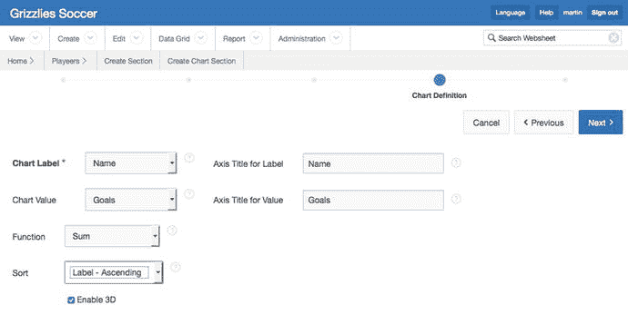

图 12-17. 图表定义

在确认屏幕上，点击 `创建章节` 按钮。

新的图表区域应该如图 12-18 所示。

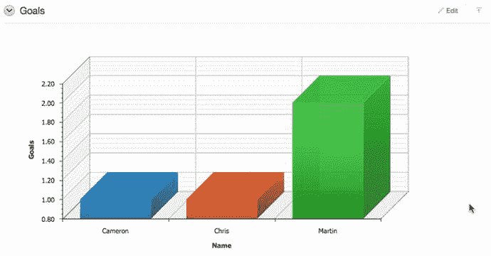

图 12-18. 进球数图表

你需要对 `球员` 页面进行的最后一项修改是添加一个导航章节。这允许用户快速跳转到页面上的每个章节，而不必滚动整个页面。请按照以下步骤添加导航章节：

点击 `新建章节` 链接。选择 `导航` 作为 `章节类型`，然后点击 `下一步`。选择 `章节导航` 作为 `导航类型`，然后点击 `下一步`。在 `顺序` 中输入 `1`。将顺序设置为 `1` 使其成为页面上的第一个章节。点击 `创建章节` 按钮。

当有人查看该页面时，他们可以通过导航章节快速导航到每个章节。

现在你应该能够熟练地创建和修改页面了。在创建最后一个章节之前，请创建以下页面，它们是主页的子页面：

*   `结果`：此页面显示 `结果` 保存报告。`结果` 页面应如图 12-19 所示。

    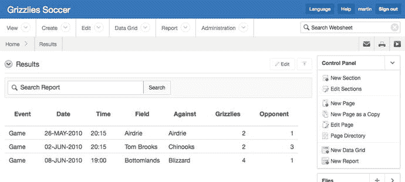

    图 12-19. 结果页面

*   `日程`：此页面包含两个章节。第一个章节显示 `剩余比赛` 保存报告，另一个章节显示你之前创建的 `剩余训练` 保存报告。`日程` 页面应如图 12-20 所示。

    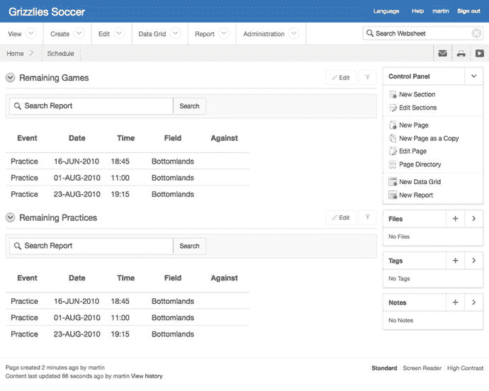

    图 12-20. 日程页面

你将创建的下一个章节提供所有页面的列表及其链接。请按照以下步骤创建此导航章节：

转到 `主页`。点击 `新建章节` 链接。选择 `导航` 作为 `章节类型`，然后点击 `下一步`。选择 `页面导航` 作为 `导航类型`，然后点击 `下一步`。如果需要，可以修改 `标题` 并将 `顺序` 设置为 `1`，然后点击 `创建章节` 按钮。

新章节应该如图 12-21 所示。

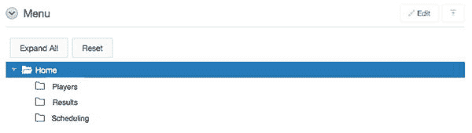

图 12-21. 页面导航


