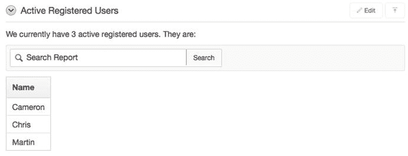

# SQL 标签

Websheets 允许管理员和贡献者查询 schema 中的表和视图。他们可以创建类似于数据网格的报告，但这些报告是只读的。他们还可以直接在部分中包含称为 SQL 标签的查询结果。

在 Players 页面上，我们添加一个部分来显示有权访问该应用程序的已注册用户数量，并在该部分中包含一个 SQL 标签。要创建该部分，请按照以下步骤操作：

转到 Players 页面。
点击 `新建部分` 链接。
为 `部分类型` 选择 `文本`，然后点击 `下一步`。
将 `顺序` 设置为 `5`，将 `标题` 设置为 `活跃的注册用户`。
在 `内容` 部分输入以下文本，然后点击 `创建部分` 按钮：
`我们目前有[[sqlvalue: select count(*) from tusers where active_flag = 'Y' ]]名活跃的注册用户。他们是：[[sql: select initcap(user_name) "Name" from tusers order by user_name ]]`

新部分应如图 12-22 所示。请注意前面代码中第一行的 `select count` 查询。该查询生成了图中显示的活跃用户数 3。同样，前面代码中的第二个 `select` 语句生成了玩家名称列表。

**图 12-22.** 包含 SQL 标签的部分

使用 SQL 标签时，您需要明确定义查询是返回单个值还是多行多列。定义为 `sqlvalue:` 的 SQL 标签意味着将返回一个单值，并将其嵌入到句子中，使得该单值作为句子中的一个词出现。使用 `sql:` 则意味着将返回多行多列。当查询返回多行时，其结果显示为类似电子表格的格式，如图 12-22 所示。

图 12-22 中的搜索框是第二个查询返回多行的结果。每当查询结果显示为类似电子表格的网格时，该网格前面都会有一个搜索框，您可以使用它快速找到特定的结果行。

## 访问控制

您需要为应用程序做的最后一件事是让团队中的其他玩家也能访问它。您在创建应用程序时已经授予了 Martin 访问权限。您需要授予其他玩家 Chris 和 Cameron 查看该应用程序的权限。为此，请按照以下步骤操作：

点击屏幕顶部的 `管理` 选项卡。
点击下拉菜单中的 `访问控制` 选项。
点击 `创建条目` 按钮。
为 `用户名` 输入 `Chris`，并为 `权限` 选择 `读者`。点击 `创建并继续创建另一个` 按钮。
为 `用户名` 输入 `Cameron`，并为 `权限` 选择 `读者`。点击 `创建`。

现在，Chris 和 Cameron 可以登录该应用程序。但是，他们不能修改任何部分或数据网格。如果您需要授予某人修改应用程序的权限，可以在“访问控制”部分为他们授予 `贡献者` 角色。

## 总结

最后两章介绍了 websheets 及其功能。从这里开始，您可以继续制作复杂的 websheet 应用程序，而无需对数据库或 SQL 有太多了解。既然您已经掌握了 websheets 的基础知识，安装并分析 websheet 示例应用程序将是理解 websheet 功能的下一步。

