# 13. 扩展开发人员工具

在前面章节中开发示例应用程序时，您已经看到了 APEX 开发工具的许多功能。本章将重点介绍 APEX 中未在之前章节涵盖的高级开发功能。当您在企业环境中开发大型应用程序时，这些功能或工具可能会有所帮助。

> **注意**
> 本章假设您对 APEX 比较熟悉并且理解其基础知识。如果您对开发 APEX 应用程序还不太熟练，我们强烈建议您重新学习从第 5 章到第 9 章的示例，以便更熟练地使用 APEX 及其开发环境。

## 页面锁定

在较大团队中进行开发时，可能会发生开发冲突。开发冲突是指两个开发人员同时处理同一个对象并相互覆盖对方的更改。

> **注意**
> 在本章的剩余部分中，提到的 APEX 对象指的是页面项、区域、列表、页面等。

传统的 Web 开发工具，如 ASP、PHP 和 JSP，包含多个文件，每个文件代表 Web 应用程序中的一个页面或一组功能。使用这些工具开发时，通常的做法是使用 Subversion 等源代码控制工具来管理所有更改。源代码控制工具可以轻松管理多个开发人员之间的开发冲突，因为冲突被隔离在单个文件中。

APEX 与刚刚提到的脚本语言不同，因为开发人员不处理文件。所有信息都存储在数据库中的表中。当您导出应用程序时，会得到一个 SQL 文件，该文件将应用程序的元数据加载到这些表中。由于 APEX 将其内容存储在数据库中，因此在多人团队开发时，您不能使用传统的源代码控制工具来管理冲突。

### APEX 冲突

为了演示 APEX 中的开发冲突，想象您有两个开发人员 Mina 和 Natalie，她们正在同一应用程序页面上工作。如果她们同时添加和修改页面组件，该页面对她们两人来说可能都无法按预期运行。

APEX 通过执行乐观锁定来防止开发人员同时修改同一对象。表 13-1 显示了两位开发人员编辑同一对象时发生的事件序列。您可以在最后看到 APEX 如何阻止 Natalie 覆盖 Mina 所做的更改。

**表 13-1.** 乐观锁定场景

| 步骤 | Mina | Natalie |
| --- | --- | --- |
| 1 | 编辑 `P1_EMPNO` | -- |
| 2 | -- | 编辑 `P1_EMPNO` |
| 3 | 将帮助文本编辑为：“Mina’s Help” | -- |
| 4 | -- | 将帮助文本编辑为：“Natalie’s Help” |
| 5 | 应用更改 | -- |
| 6 | -- | 应用更改 |
| 7 | -- | 收到错误消息：`自用户启动更新流程以来，数据库中的数据当前版本已更改。当前行版本标识符 = "A08A505E601932E33BC1074BEA1A3B4C" 应用程序行版本标识符 = "AECE767E4BDDC737A7823083A31D564F"`。`请联系您的应用程序管理员。` |

乐观锁定仅在开发人员修改同一对象时有效。当多个开发人员同时修改同一页面上的不同对象时，问题就会出现。修改一个对象可能会影响整个页面的流程，而其他开发人员可能并未意识到这一点。悲观锁定有助于防止这种情况下的麻烦。下一节将讨论如何进行悲观锁定。


### 锁定 APEX 页面

在开发由多名开发人员参与的应用程序时，防止问题发生的最简单方法是在处理某个页面之前将其锁定。锁定页面可以防止其他开发人员在您处理该页面时对其进行修改。页面锁定期间，其他开发人员仍可以查看页面及其组件；他们只是无法对页面进行任何修改。

锁定页面的过程如下：

在页面设计器中，单击页面设计器工具栏中的“锁定”图标，如图 13-1 所示。


图 13-1。

锁定页面。您将看到一个弹出对话框，允许您输入评论或锁定页面的原因。为“注释”输入一个值（所有页面锁定都需要注释）并单击“锁定”。对话框将被关闭，锁定图标将变为实心绿色并带有一个闭合的锁。

输入有意义的页面锁定注释很重要，因为系统会维护页面锁定的历史记录。如果您使用案例管理工具，在锁定页面时引用您正在处理的案例编号是明智的。

如果另一位开发人员查看一个已锁定的页面，他们会看到锁定图标显示为实心红色并带有一个闭合的锁。单击锁定图标将打开一个弹出对话框，显示谁锁定了页面以及他们当时输入的注释。图 13-2 显示了一个已锁定页面和弹出对话框的示例。

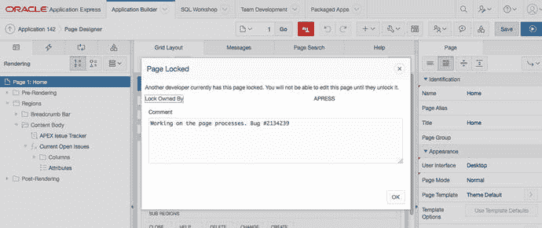

图 13-2。

已锁定页面

### 解锁页面

只有 APEX 管理员、工作区管理员以及锁定页面的开发人员才能解锁它。如果您是锁定页面的开发人员，以下过程演示了如何解锁它：

转到锁定的页面（前一个示例中的页面 1），然后单击页面设计器工具栏中的“锁定”图标。您将看到显示当前锁定注释的弹出对话框。从这里，您可以更改注释并保存更改，也可以单击“解锁”按钮来解锁页面。

### 管理页面锁定

开发人员可能希望查看所有已锁定的页面，或者可能希望同时锁定/解锁多个页面。APEX 提供了处理多个页面锁定请求的工具。要查看“页面锁定”报告，请在页面设计器工具栏中转到“实用程序” ➤ “跨页面实用程序”，然后选择“页面锁定”，如图 13-3 所示。

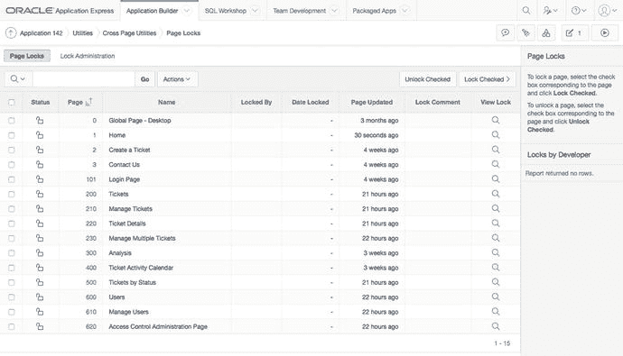

图 13-3。

页面锁定报告

从“页面锁定”报告中，您可以查看所有已锁定和已解锁的页面。您可以从此报告中锁定和解锁多个页面。工作区管理员可以解锁任何页面，但开发人员只能解锁他们自己锁定的页面。开发人员还可以通过单击“查看锁定”图标（看起来像一个放大镜）来查看每个页面的锁定历史记录。

注意

当应用程序被复制或导出时，页面锁定不会在新版本中保留。这意味着任何页面锁定和注释历史记录仅与工作区中的特定应用程序相关。如果您将应用程序复制到另一个工作区，新副本中没有任何页面被锁定。

## 应用程序和页面组

开发大型 APEX 应用程序可能需要您对应用程序和页面进行分组。APEX 允许您以声明方式对应用程序以及应用程序中的页面进行分组。对页面和应用程序进行分组可以帮助您避免采用严格的应用程序和页面命名及编号方案。

### 应用程序组

当工作区中有多个应用程序时，您可能希望将相关的应用程序分组，以帮助开发人员直观地了解哪些应用程序是相关的。例如，假设您开发了一个由三个模块组成的大型 CRM 系统：市场营销、服务和销售。出于各种原因，您可能希望将每个模块创建为其自己的应用程序，并有一个链接这些应用程序的公共管理模块。

如果您的工作区包含其他成套的应用程序，开发人员可能会对他们正在处理的套件感到困惑。要解决此问题，您可以创建应用程序组。以下是创建应用程序组的过程：

导航到应用程序构建器。单击工作区实用程序图标。从工作区实用程序菜单中单击“应用程序组”选项。单击“创建”按钮。为组输入“名称”和“描述”值。在此示例中，使用 `CRM`。单击“创建”。

以下步骤演示了如何将各个应用程序添加到应用程序组：

在“应用程序组”页面上，单击“任务”区域右侧的“管理未分配”链接。在“新建组”选择列表中选择组，然后通过选中复选框来选择应用程序。单击“分配已勾选项目”按钮，如图 13-4 所示。

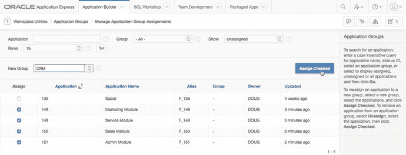

图 13-4。

分配应用程序组。转到应用程序构建器主页，以报告格式查看应用程序。您可以使用“操作”菜单将“组”列添加到报告中。这使您可以查看应用程序列表及其应用程序组，如图 13-5 所示。

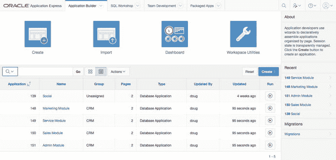

图 13-5。

应用程序报告

### 页面组

页面组与应用程序组类似，不同之处在于它们将页面分组在一起。它们特定于应用程序，这意味着页面组仅对特定应用程序有效。页面组对于帮助对应用程序中的常见页面进行分组非常有用。

使用页面组的另一种方法是使用编号方案将页面分组在一起。然而，页面编号方法可能并不总是有效，因为您可能会用完编号。例如，假设您将逻辑页面按 10 个一组进行分组。当一个组中有 11 个页面时会发生什么？当然，解决方法是为每个逻辑页面组创建较大的间隔，但即便如此，您也可能会遇到页面不符合您的编号标准的情况。

注意

您还可以将页面组用于开发环境以外的目的。假设您将所有管理页面分组到一个“管理”页面组中。如果您有一个希望仅在管理页面上显示的“全局页面”区域，则可以添加一个条件来检查当前页面是否与“管理”页面组相关联。

要创建和管理页面组，请从 APEX 中的“应用程序”页面转到“实用程序” ➤ “页面特定实用程序” ➤ “页面组”。在“页面组”页面上，您可以以类似于上一节创建应用程序组的方式创建和分配页面组。

## APEX 视图和 APEX 字典

在传统的 Web 开发工具中，如果您需要搜索所有代码，必须梳理多个文本文件。APEX 则不同，因为它将代码存储在数据库中。因此，您可以运行查询来搜索代码。

## APEX 模式

关于 APEX 的一个常见误解是，它是一个需要额外安装的软件。实际上，AEX 是一个存储在数据库**模式**中的框架。从很高的层面来看，每次你请求一个页面时，APEX 都会查询其模式中的表，并多次调用 `HTP.P` 过程来生成发送到浏览器的 HTML。

每次你在 APEX 中创建一个对象，它都会被存储在 APEX 模式的一个表中。例如，当你创建一个页面项时，它会被存储在 `APEX_050000.WWV_FLOW_STEP_ITEMS` 表中。

**注意**

如第 1 章所述，APEX 最初被称为 FLOWS，而页面最初被称为 STEPS，这就是为什么一些表名中包含这些引用。

将代码存储在数据库中有优点也有缺点。优点是你可以查询数据库，以有组织的方式快速找到所需内容。例如，你可以轻松地在所有报表中搜索某个特定的表或列引用。缺点是同时搜索 APEX 应用程序中的所有对象会更困难。据最近统计，`APEX_050000` 模式拥有超过 450 张表。在基于文件的 Web 应用程序中搜索整个应用程序会更容易，因为你可以进行简单的文本搜索。

## APEX 视图

APEX 视图让开发者能够查看构成当前工作区中应用程序的元数据。有几种方法可以访问这些视图中的数据。本节将讨论如何在 APEX 开发环境中使用这些视图进行搜索。

要在开发环境中访问 APEX 视图，请导航到应用程序构建器主页，然后转到 **工作区实用程序 ➤ Application Express 视图**。如果你是 APEX 新手，我们建议你将默认视图模式更改为**视图报表**，它会提供每个报表的详细描述（见图 13-6）。

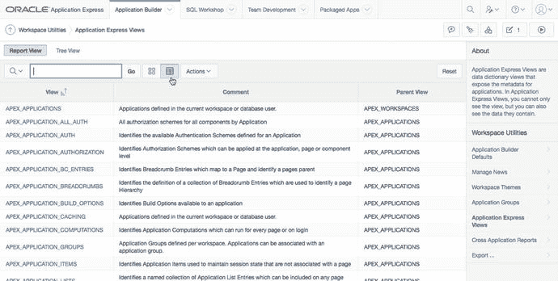

图 13-6. APEX 视图

以下示例演示了 APEX 视图如何帮助你。假设你需要比较引用 `PRODUCT_ID` 的项的帮助文本。请按以下步骤操作：

1.  转到 **工作区实用程序 ➤ Application Express 视图**。
2.  点击 `APEX_APPLICATION_PAGE_ITEMS` 视图。你可能需要在交互式报表中搜索此视图，或导航到下一页。
3.  在“选择列”屏幕上，将 `ITEM_NAME` 和 `ITEM_HELP_TEXT` 添加到“选定列”中，然后点击“筛选器”按钮，如图 13-7 所示。

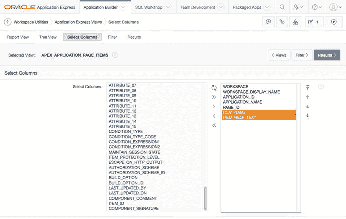

图 13-7. 选择列视图

4.  在“筛选器”页面上，为“列”选择 `ITEM_NAME`，为“条件”选择 `LIKE`，为“值”输入 `'%TICKET_ID%'`，然后点击“结果”按钮，如图 13-8 所示。重要的是要像在 SQL 查询中一样，在你的搜索值周围包含单引号字符。

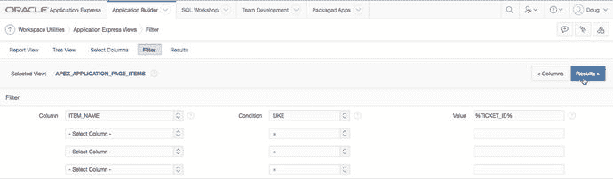

图 13-8. 筛选器视图

5.  你现在应该能看到工作区中所有项名包含 `TICKET_ID` 的页面项列表。根据这些结果，你可以修改需要更改的项。因为报表显示的是工作区中的所有应用程序，你可能希望为特定应用程序应用额外的筛选器。

或者，你可以通过点击图 13-9 所示的“树视图”选项卡，以树状结构查看 APEX 视图列表。树视图提供了一种极好的方法来理解视图之间的关系。点击你想要的视图后，你可以继续按照上述过程来显示结果。

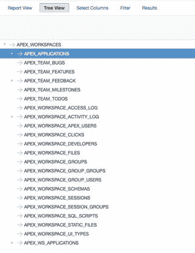

图 13-9. 树视图

## APEX 字典

因为所有数据都驻留在数据库中，你可以在 SQL 查询中引用 APEX 视图。随着你对 APEX 视图越来越熟悉，你可能更喜欢使用 SQL 来查询它们，因为你可以快速应用谓词，并且不需要使用 Web 浏览器来运行报表。

APEX 提供了一个名为 `APEX_DICTIONARY` 的视图，它列出了所有 APEX 视图。APEX 字典包含了开发者 GUI 中可用的所有信息以及每个列的描述。以下查询列出了所有 APEX 视图：

```sql
SELECT *
  FROM apex_dictionary
 WHERE column_id = 0
```

在 SQL 中查询 APEX 视图与在 GUI 中查询略有不同。当你使用开发者 GUI 时，只有驻留在工作区中的应用程序会出现在结果中。当你通过 SQL 查询时，只有解析模式与你连接模式相同的应用程序会出现在结果中。如果你以 `SYS`、`SYSTEM` 或被授予了 `APEX_ADMINISTRATOR_ROLE` 的用户身份连接，你可以查看所有应用程序，无论其解析模式如何。

在上一节中，示例描述了如何查看名称中包含 `TICKET_ID` 的项的所有帮助文本。你可以通过运行以下查询来查看相同的结果集：

```sql
SELECT workspace,
       application_id,
       application_name,
       page_id,
       page_name,
       item_name,
       item_help_text
  FROM apex_application_page_items
 WHERE item_name LIKE '%TICKET_ID%'
```

搜索并不是 APEX 视图的唯一用途。当你创建插件或向应用程序添加高级功能时，也可能需要使用 APEX 视图。

## 在 APEX 中搜索

上一节探讨了如何使用 APEX 视图在应用程序中搜索项。在本节中，你将学习在应用程序中搜索的其他方法。

### APEX 查找器

APEX 在应用程序中提供了一个工具，该工具包含一些针对常见 APEX 对象使用 APEX 视图的报表。要访问 APEX 查找器，请导航到任何应用程序的主编辑页面（即 APEX 显示应用程序中所有页面列表的页面）。在此页面上，点击“查找”图标（看起来像一个手电筒，位于右上角），如图 13-10 所示。


图 13-10. 查找图标

点击“查找”图标会打开一个弹出窗口，其中包含针对以下对象类型的交互式报表：

*   应用程序和页面项
*   页面
*   报表区域的 SQL 查询
*   解析模式中的数据库表
*   解析模式中的 PL/SQL 包、函数和过程
*   图像，包括标准图像、工作区图像、应用程序图像和 Font Awesome 图标
*   调试日志条目列表
*   当前会话中的应用程序项、页面项、集合及其值
*   此应用程序中在区域和页面级别发生过的错误列表

APEX 查找器很有帮助，因为它允许你在使用应用程序构建器时快速搜索内容，而无需离开当前页面。如果你需要更复杂的搜索或筛选器，我们建议你查询 APEX 视图。

### 搜索应用程序

如果你确切知道自己要在对象类型中查找什么，那么 **APEX 视图实用程序**（用于查询 APEX 视图）和 **APEX 查找器**都是不错的工具。例如，如果你想查看某个特定表是否在某个查询中被引用，你可以搜索 `APEX_APPLICATION_PAGE_REGIONS` 视图中 `REGION_SOURCE` 列里是否包含该表名。

但如果你想搜索整个应用程序，以查看它是否引用了某个特定的表呢？假设，例如，你将 `TICKETS` 表重命名为 `ISSUES`。如何轻松地在整个应用程序中搜索所有对 `TICKETS` 的引用？答案是使用一个名为 **搜索应用程序** 的功能，它会在整个应用程序中进行搜索。

要搜索整个应用程序，请在“搜索应用程序”字段中输入你的搜索条件，方法是单击**放大镜**图标（位于右上角——参见图 13-10）。图 13-11 显示了应用程序中所有出现 `TICKETS` 的详细结果。每个结果都提供了一个指向结果确切位置的链接。使用“搜索应用程序”功能，你可以轻松找到所有对 `TICKETS` 表的引用，并将其替换为 `ISSUES`。

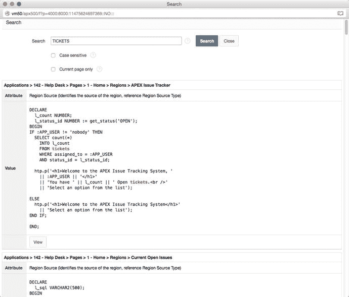
图 13-11. APEX 搜索应用程序结果

图 13-11 中结果的问题在于，它们包含了所有包含 `TICKETS` 的文本的结果。这包括标签、HTML 等。虽然这看起来可能不是问题，但试想一下搜索 `EMP` 表的情况。你的结果可能包含诸如 template、employee、empno 等内容。由于你只想查找与 SQL 查询和 PL/SQL 块相关的表引用，你可能希望排除那些前一个或后一个字符是字母数字的搜索结果。

正则表达式（APEX 搜索应用程序工具支持）可以用来实现这一点。搜索条件必须加上 `regexp:` 前缀才能使用正则表达式。图 13-12 展示了当使用正则表达式过滤掉其前一个或后一个字符是字母数字的 `emp` 出现时的“搜索应用程序”。要了解更多关于正则表达式以及 Oracle 对其实现的信息，请参阅 Oracle 数据库文档，特别是 SQL 参考手册。

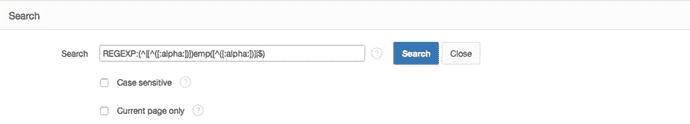
图 13-12. 使用正则表达式的 APEX 搜索

### 监控你的 APEX 应用程序

APEX 可以记录每一次页面访问和登录尝试。启用日志记录是一个极好的功能，因为它允许你监控应用程序，并提供了一种帮助减少错误和提高性能的方法。本节将向你展示如何启用日志记录、活动日志的一些用途以及如何查看所有登录尝试。

### 启用日志记录

默认情况下，创建应用程序时会启用日志记录。要验证你的应用程序是否启用了日志记录，请转到“共享组件”，然后单击左上角“应用程序逻辑”区域中的“应用程序定义属性”链接。在“属性”部分有一个“日志记录”选项，如图 13-13 所示。确保它显示为“是”，然后单击“应用更改”按钮。

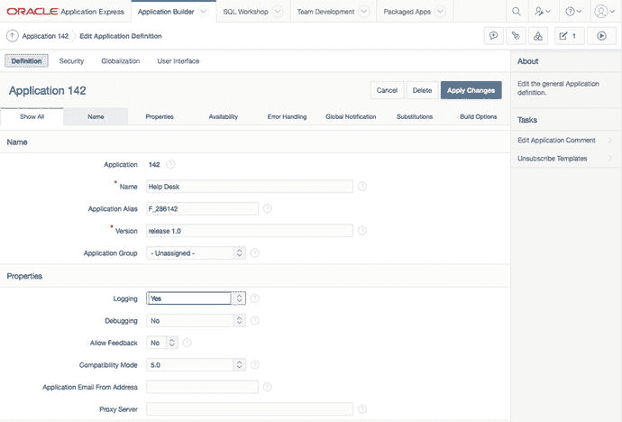
图 13-13. 启用日志记录

对于一个拥有大量页面访问量的应用程序，你可能希望禁用日志记录，因为它会降低应用程序的速度。大多数应用程序没有这个问题，但重要的是要知道这个问题可能会发生。

> 注意
> 日志存储在底层的 APEX 所有者表中，并会定期清除。默认情况下，日志在清除前会保留 14 天，但实例管理员可以将此值增加到 180 天。建议，如果你希望将这些数据保留更长时间，请设置一个夜间作业将其复制到你自己的模式中。在博文 [`www.talkapex.com/2009/05/apex-logs-storing-log-data.html`](http://www.talkapex.com/2009/05/apex-logs-storing-log-data.html) 中展示了一个存储本地永久日志历史的示例。

### 使用活动日志

每次页面被访问时，都会存储一条日志条目。你可以从 `APEX_WORKSPACE_ACTIVITY_LOG` 视图中引用它。挖掘活动日志的一个好例子是搜索应用程序中的错误。无论你多么努力，未处理的错误还是会发生。与其等待用户报告这些错误（假设他们确实会报告错误），你可以采取主动的方法。以下查询可识别在页面或区域级别发生的错误：

```sql
SELECT *
  FROM apex_workspace_activity_log
 WHERE error_message IS NOT NULL
```

一旦应用程序运行了一段时间，你可能会注意到某些页面比其他页面访问得更频繁，并且某些页面的性能不如预期。以下查询可识别这两种情况：

```sql
-- 查找访问量最大的页面
  SELECT application_id,
         application_name,
         page_id,
         page_name,
         SUM (page_id) AS page_hit_count
    FROM apex_workspace_activity_log
GROUP BY application_id,
         application_name,
         page_id,
         page_name
ORDER BY SUM (page_id) DESC
```

```sql
-- 查找加载最慢的页面
-- 注意：这取决于你如何定义“慢”
  SELECT application_id,
         application_name,
         page_id,
         page_name,
         ROUND (AVG (elapsed_time), 5) AS avg_elapsed_time,
         SUM (page_id) AS page_hit_count,
         MEDIAN (elapsed_time) AS median_elapsed_time
    FROM apex_workspace_activity_log
GROUP BY application_id,
         application_name,
         page_id,
         page_name
ORDER BY 5 DESC
```

通过识别访问量最大的页面，你可以集中精力尝试加速它们。加载慢的页面可能需要调优，但如果它们访问频率不高，你可能不需要在上面花费太多时间。

以下是活动日志的其他一些用途示例：

*   **热门浏览器**：如果你的应用程序设计为支持 Firefox 和 IE，然后发现一半的用户在使用 Chrome，你可能需要投入一些时间确保你的应用程序支持 Chrome。
*   **用户使用应用程序的时间段**：这让你了解进行维护和升级的最佳时间。你还可以推导出使用的高峰时段。
*   **交互式报表中的搜索条件**：如果存在一致的搜索模式，也许你需要一个更好的报表或预设过滤器。

### 登录尝试

`APEX_WORKSPACE_ACCESS_LOG` 存储了所有登录你 APEX 应用程序的尝试记录。当你在调试用户认证问题时，访问日志会非常有用。

利用访问日志的一个例子是监控无效的登录尝试。当用户使用无效凭证尝试登录时，不建议显示其登录失败的确切原因。你不希望告诉用户确切的原因，因为它可能泄露有价值的信息，例如用户是否存在。对于你的运维团队来说，了解用户无法登录的原因可能仍然很重要，以防他们需要解决问题。由于所有登录尝试都存储在访问日志中，对于失败的登录尝试，你可以准确地看到用户无法登录的原因。

> 注意
> 如果你创建了自己的认证过程，你应该使用 `APEX_UTIL.SET_AUTHENTICATION_RESULT` 和 `APEX_UTIL.SET_CUSTOM_AUTH_STATUS` 过程，以确保你在访问日志中填充有意义的消息。有关这些认证过程的更多信息，请阅读 APEX API 文档。

