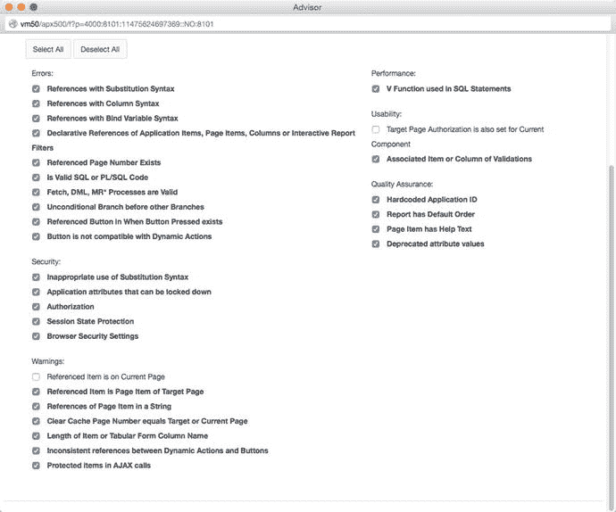

# APEX Advisor

APEX Advisor 是一款针对应用程序执行预定义检查的工具。这些验证有助于在您的应用程序进行测试或投入生产前减少错误。

**注意**

在 APEX 4 之前，APEX Advisor 是由 Patrick Wolf 开发的一个开源项目。在 APEX 4.0 开发期间，Patrick 加入了 Oracle 的 APEX 团队，并将 Advisor 作为一个内置工具包含进来。APEX Advisor 的开源版本可在 [`http://essentials.oracleapex.info/`](http://essentials.oracleapex.info/) 获取。

要使用 Advisor，请编辑一个应用程序，并从主应用程序菜单进入 `工具` ➤ `Advisor`。图 13-14 显示了您可以执行的所有检查。将鼠标悬停在每个验证上会显示其简要描述。您可以选择限制 Advisor 审核的页面，方法是在页面底部的 `检查页面` 区域中定义一个逗号分隔的页面列表进行搜索。选择要执行的检查后，点击 `执行检查` 按钮。结果页面会提供 Advisor 发现的所有详细问题列表，并附有指向每个对象的链接。

图 13-14. APEX Advisor 选项

Advisor 是一个出色的工具，可帮助您在应用程序部署给最终用户之前检测问题。但制定开发标准和发布流程来帮助预防问题仍然很重要。您应注意，Advisor 可能会针对您组织中的某些业务规则产生误报，因此在修复每个建议前都应进行分析。

