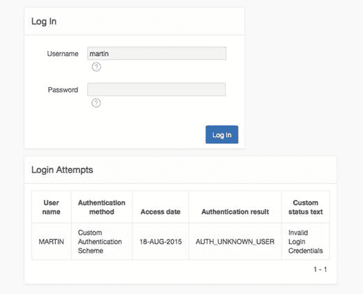
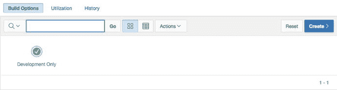
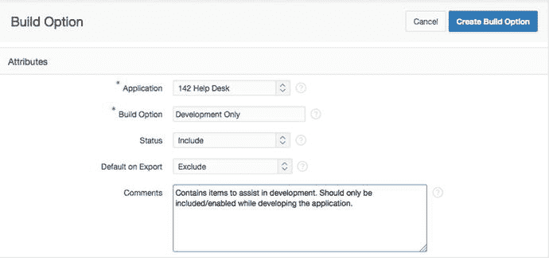
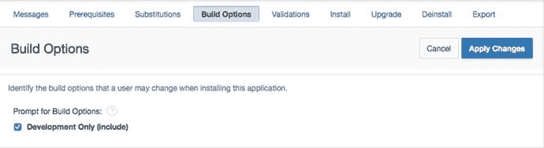
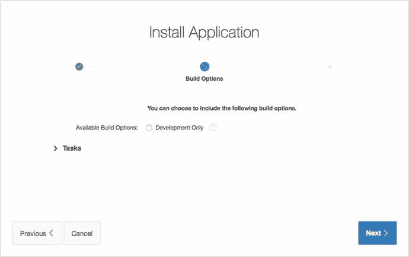
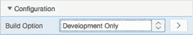
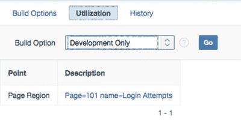
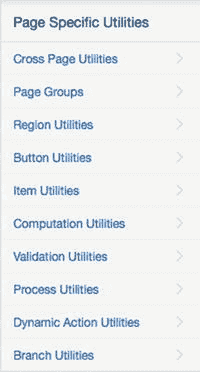
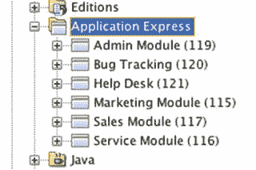
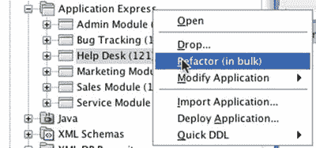

# 构建选项

构建选项允许开发人员在运行时有条件地包含或排除应用程序的某些功能。构建选项对整个应用程序是启用或禁用的，并且只能在应用程序构建器中更改。这意味着它们不是运行时配置选项。

## 理解需求

假设您正在开发一个自定义的身份验证方案，并且您想验证在活动日志中，针对无效登录尝试是否正确填充了相应的身份验证结果和自定义状态消息。每次尝试登录时，您都可以切换程序并查询 `APEX_WORKSPACE_ACCESS_LOG`。这个过程可能会变得繁琐，因为您需要在两个应用程序之间切换。另一种解决方案是在登录页面上创建一个报表来显示最近的登录尝试。每次登录失败后，您可以返回登录页面，查看更新后的 `登录尝试` 报表。

要在登录页面（第 101 页）上构建此报表，请创建一个包含以下查询的报表：

```sql
SELECT user_name,
       authentication_method,
       access_date,
       authentication_result,
       custom_status_text
  FROM apex_workspace_access_log
 WHERE application_id = :app_id
ORDER BY access_date DESC
```

登录页面现在如图 13-15 所示。该报表允许您在测试登录过程时快速查看身份验证结果。



图 13-15. 带有关联的登录尝试报表的登录页面

一旦您确认自定义的身份验证方案正常工作，通常会删除额外的报表区域，因为它只是为了调试目的而存在的。然而，删除该区域可能适得其反，因为将来修改身份验证方案时您可能还需要它。

## 创建构建选项

与其删除区域，不如将其标记为 `仅开发` 对象，使其仅在开发应用程序时可用，而在生产环境中不可用。请按照以下步骤创建一个构建选项来支持此需求：

1.  在“服务台”应用程序的应用程序构建器中，转到 `共享组件` ➤ `构建选项`（位于安全下），并点击 `创建` 按钮。
2.  按照图 13-16 所示填写每个部分，然后点击 `创建构建选项` 按钮。

您现在应该能看到一个 `仅开发` 构建选项，如图 13-17 所示。



图 13-17. 仅开发构建选项



图 13-16. 创建构建选项

## 配置构建选项

在继续本示例之前，回顾一下图 13-16 中看到的一些选项非常重要。`包含` 和 `排除` 状态值可能会引起误解。构建选项不影响应用程序中包含的内容，只影响在运行时执行或显示的内容。对状态选项更好的描述应该是启用/禁用或开/关。

`导出时默认` 选项设置了应用程序导出后再导入时构建选项的默认配置。对于本示例，由于您使用构建选项来处理仅开发功能，因此始终排除该构建选项并要求开发人员显式包含它是合理的。

在某些情况下，没有明确的默认选项，因此安装应用程序的人员必须选择适当的构建选项状态。您可以将必需的选择配置为应用程序安装脚本的一部分。

## 提示构建选项状态

要将应用程序配置为在安装过程中提示构建选项状态，请在应用程序构建器中转到 `支持对象` ➤ `构建选项`。在 `提示构建选项` 下选择 `仅开发（包含）`，以便在安装过程中提示该构建选项（见图 13-18），然后点击 `应用更改` 按钮。



图 13-18. 构建选项安装配置

安装应用程序时，用户将可以选择包含该构建选项，如图 13-19 所示。同样，“包含”是一个容易误解的术语，因为构建选项将被包含但默认是禁用的，除非您在安装应用程序时特别选择包含它。



图 13-19. 构建选项提示

## 应用构建选项

现在您已经创建并配置了 `仅开发` 构建选项，需要将其应用于相关区域——第 101 页上的 `登录尝试` 区域：

1.  编辑 `登录尝试` 区域。
2.  在属性编辑器中，向下滚动到 `配置` 部分。
3.  在 `构建选项` 列表中选择 `仅开发`（参见图 13-20），然后点击 `应用更改` 按钮。



图 13-20. 应用构建选项

**注意**

应用构建选项时，您可以通过选择 `{非...}` 选项来获得相反的结果。这有助于避免创建两个始终互为反向的构建选项。

现在，`访问日志` 区域仅在 `仅开发` 构建选项状态设置为 `包含` 时才会运行。您可以使用相同的过程将构建选项应用于其他 APEX 对象。


### 报告构建选项使用情况

构建选项可以应用于大多数 APEX 对象，包括页面、区域、页面项、标签等。在应用程序中跟踪哪些对象使用了哪些构建选项可能会变得困难。构建选项使用情况报告使您可以轻松查看哪些对象正在使用特定的构建选项。当您试图了解构建选项对应用程序的影响时，此报告非常有用。

要查看此使用情况报告，请转到“共享组件” ➤ “构建选项”。单击“使用情况”选项卡并选择“仅开发”构建选项，如图 13-21 所示。描述列中的链接会将您带到使用该构建选项的具体对象。



图 13-21. 构建选项使用情况报告

## 页面特定工具

页面特定工具允许开发人员对应用程序中的 APEX 对象执行批量操作。要访问页面特定工具，请从“应用程序编辑”页面转到“工具”。位于右侧的“页面特定工具”区域包含所有可用的页面特定工具（参见图 13-22）。



图 13-22. 页面特定工具

每个工具都提供与对象类型相关的工具。本书不涵盖每个工具，但我们鼓励您探索可用的功能。

## APEX 和 Oracle SQL Developer

Oracle SQL Developer 是一个免费的数据库开发 GUI。有关 SQL Developer 的更多信息，请访问 [`http://www.oracle.com/technetwork/developer-tools/sql-developer`](http://www.oracle.com/technetwork/developer-tools/sql-developer)。

### 集成

APEX 与 SQL Developer 集成。在 SQL Developer 中，您可以看到所有解析模式与您连接模式相同的 APEX 应用程序（参见图 13-23）。



图 13-23. SQL Developer 中的 APEX

在 SQL Developer 中，您可以查看对象信息并执行基本的应用程序级任务，例如导入和导出应用程序、更改应用程序别名以及重命名应用程序。

### 重构支持

APEX 允许使用匿名 PL/SQL 块。我们强烈建议此类块引用已编译的代码（包、函数和过程）。将代码存储在包中有助于将业务逻辑与显示层分离，并可能带来一些性能优势。

在某些情况下，您可能直接在应用程序中编写了大量代码块。最终，您应该将这些大块代码移至已编译的 PL/SQL 代码中。SQL Developer 提供了一个工具，可以从 APEX 中的匿名 PL/SQL 块自动生成一个 PL/SQL 包。然后，您可以用对此包的引用来替换您的大块代码。要生成该包，请在 SQL Developer 中右键单击应用程序并选择“（批量）重构”，如图 13-24 所示。



图 13-24. 重构代码

SQL Developer 会打开一个新的工作表，其中包含编译所需的代码。新工作表还提供了有关需要更改 APEX 应用程序的哪些部分以及用什么代码替换它们的说明。与 APEX Advisor 类似，这些建议仅供参考；您应遵循您组织的开发标准等。

## 总结

APEX 中的许多工具使您作为开发人员的生活更轻松。花些时间了解这里介绍的工具和实用程序，您无疑可以加快完成工作的速度。虽然任何 PL/SQL GUI 都可以帮助您编辑和管理数据库对象，但到现在应该清楚，Oracle 的 SQL Developer 具有特殊钩子，使得使用 APEX 进行管理、开发和调试要简单得多。

