# 14. 管理工作区

一旦您开始开发 APEX 应用程序并在团队环境中工作，您就需要花一些时间管理工作区。本章将介绍可用于管理工作区的各种工具和资源。

注意

管理工作区涵盖许多不同领域。本章并未详细讨论所有领域；一些已在其他章节中提及，另一些则因篇幅限制未被包括在内。本章假设登录用户是工作区管理员。

## 了解您的环境

当您以工作区管理员身份登录 APEX 并使用页面右上角的“管理”下拉菜单导航到“管理”主页时，您会看到每个主要部分的图标（参见图 14-1）。本章将介绍这些部分及其相关的子部分。

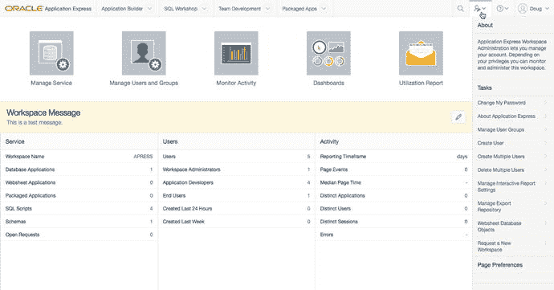

图 14-1. 管理主页

### 查看实例信息

在管理主页的右侧，“任务”区域中，第二个链接是“关于 Application Express”。单击此链接会转到一个显示有关您当前 APEX 实例信息的页面（参见图 14-2）。

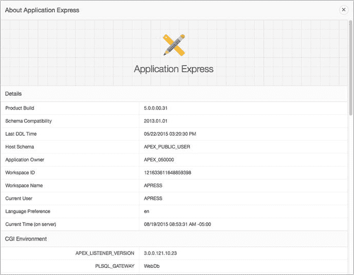

图 14-2. 关于 Application Express 页面

此页面上的信息在开发和调试 APEX 应用程序时非常有用。事实上，“关于”页面是一个很好的位置，可以快速获取您特定 APEX 实例的概览。因为 APEX 存储在数据库中，所以图中的所有值也可以通过查询获得。例如，您可以从以下查询中找到数据库版本：

```
SELECT *
FROM v$version
```

图 14-2 中的 CGI 变量列表仅对工作区管理员可用。如果开发人员需要查看 CGI 变量及其值的完整列表，他们可以创建一个 PL/SQL 区域并使用 `OWA_UTIL.PRINT_CGI_ENV` 作为区域源。

注意

您只能从 Web 界面获取 CGI 变量，因为它们是基于 Web 的变量。如果开发人员尝试在 SQL*Plus 或 SQL Developer 中查询它们，他们将不会得到任何结果。以下文章包含有关 CGI 变量的更多信息：[`http://en.wikipedia.org/wiki/Common_Gateway_Interface`](http://en.wikipedia.org/wiki/Common_Gateway_Interface)。

### 检查 APEX 版本

关于 Application Express 页面显示当前 APEX 版本。您也可以使用以下查询获取版本信息：

```
SELECT *
FROM apex_release
```

从查询中获取 APEX 版本对于 DBA 在升级应用程序时可能很重要。此外，开发人员有时会编写依赖于当前 APEX 版本的代码。

## 管理服务

单击“管理服务”图标可更改影响 APEX 服务操作的首选项和其他设置。您可以在图 14-1 所示的管理主页上找到“管理服务”图标。

图 14-3 显示了主要的“管理服务”页面。

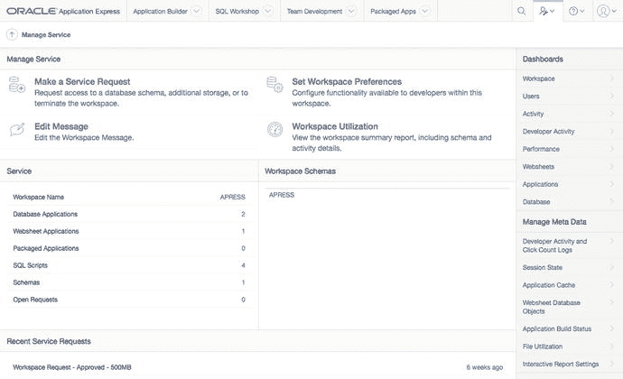

图 14-3. 管理服务页面


### 消息

消息功能允许工作区管理员创建对 APEX 开发人员可见的消息。这些消息会显示在 APEX 开发环境的关键区域中，但不会显示在您的 APEX 应用程序中。

要创建消息，请单击“编辑消息”菜单项（参见图 14-3）。输入消息后单击“应用更改”按钮，如图 14-5 所示。消息将出现在公告区域，如图 14-6 所示。

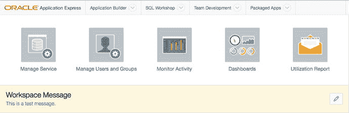
图 14-6. 工作区公告

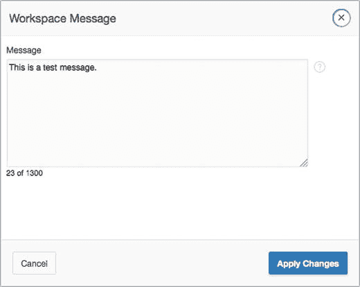
图 14-5. 编辑工作区公告

## 管理元数据

在“管理服务”页面的右侧，有一个名为“管理元数据”的区域（参见图 14-7）。以下各小节将介绍如何使用此区域中的菜单选项。

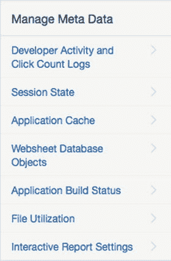
图 14-7. 管理元数据菜单

### 开发人员活动与点击计数日志

“开发人员活动与点击计数日志”菜单选项允许清除两种类型的日志。一种记录开发人员在工作区中进行的更改。另一种跟踪用户在 APEX 应用程序外页面链接上的点击。

#### 开发人员活动日志

应用程序构建器会记录开发人员所做的所有更改。这些日志在应用程序构建器和“管理”部分的各个位置被引用。您可以通过“监控活动”部分查看这些日志，方法是单击图 14-1 中显示的“监控活动”图标。您也可以通过以下查询获取开发人员活动日志：

```
SELECT *
FROM apex_developer_activity_log
```

与前一章提到的日志类似，开发人员活动日志最多保留一个月的数据。您可以通过单击图 14-8 中显示的“清除开发人员日志”按钮来清除开发人员活动日志。

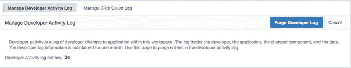
图 14-8. 清除开发人员日志按钮

#### 点击计数日志

创建列表时（应用程序构建器 ➤ 共享组件 ➤ 列表），您可以选择跟踪外部链接的点击。这些点击记录在 `APEX_WORKSPACE_CLICKS` 日志中。您也可以在“监控活动”部分查看点击计数日志（参见图 14-1 中的“监控活动”图标）。

与开发人员活动日志类似，您可以通过选择“管理点击计数日志”并单击图 14-9 中显示的“清除点击日志”按钮来清除点击日志。

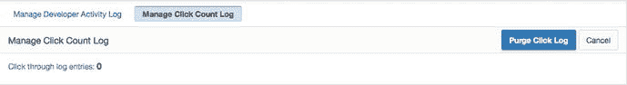
图 14-9. 清除点击日志按钮

### 会话状态

从图 14-5 的菜单中选择“会话状态”，将带您进入一个可以管理会话状态和首选项的页面。首选项与会话状态略有不同，因为它们链接到用户而不是当前会话。这意味着对首选项的更改会影响该用户的所有当前和将来的会话。

#### 管理会话状态

您可以从“管理会话状态”区域中的各种报告中查看所有会话值、清除这些值以及结束会话。每次用户登录 APEX 时都会自动创建一个会话。由于 APEX 构建器本身就是一个 APEX 应用程序，因此会为开发人员和最终用户创建会话。

在开发中，清除会话状态或终止会话可能有助于模拟不同的情况。如果您在有实际用户的生产环境中执行此操作，应格外谨慎。

### 应用程序缓存

“应用程序缓存”部分提供了基于不同条件清除页面和区域缓存的工具。在 APEX 中，您可以为所有用户或按每个单独用户缓存页面和区域。缓存有助于提高性能，因为 APEX 无需为给定区域重新生成 HTML 代码。

### Websheet 数据库对象

“Websheet 数据库对象”部分允许您创建或删除 websheet 所需的表，并验证其状态。与 APEX 应用程序不同，websheet 数据存储在每个模式中的表中，而不是由 `APEX_050000` 模式拥有的表中。这些表以 `APEX$_WS` 为前缀，通常大约有十个。

首次创建工作区时，不会创建 websheet 对象。要创建它们，请转到“Websheet 数据库对象”部分，单击图 14-10 中显示的“创建 Websheet 数据库对象”链接。按照向导创建 websheet 对象。创建 websheet 对象后，您就可以创建 websheet 应用程序了。

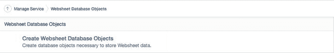
图 14-10. 创建 Websheet 数据库对象链接

创建对象后，“Websheet 数据库对象”页面如图 14-11 所示。在此屏幕中，您可以删除与 websheet 相关的数据库对象，或确保这些对象有效。

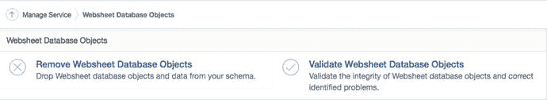
图 14-11. Websheet 数据库对象页面

### 应用程序构建状态

通过“应用程序构建状态”部分，您可以快速管理工作区中所有应用程序的“应用程序状态”和“构建状态”。“应用程序状态”控制应用程序的可用性。要获取每个应用程序状态的完整说明，请参考 APEX 文档。

“构建状态”决定应用程序是否可以被开发人员修改，还是只能运行。在生产环境中，您可能希望将构建状态设置为“仅运行应用程序”以防止任何更改。

注意：应用程序和构建状态也可以从每个应用程序的“应用程序属性”页面设置。

### 文件使用情况

“文件使用情况”页面提供了工作区中所有文件类型及其总大小的概览，如图 14-12 所示。作为 APEX 应用程序的一部分，文件可以存储在各种位置。随着时间的推移，这些文件会占用不必要的空间。

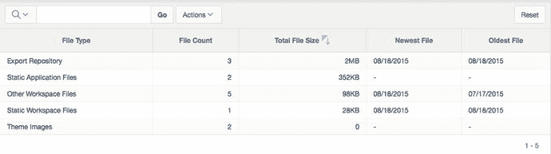
图 14-12. 文件使用情况信息

在文件使用情况页面列出的所有文件中，导出存储库往往占用最多空间。当您将应用程序导入工作区时，原始文件会存储在导出存储库中。导出存储库这个名称可能会引起误解，因为它包含的是导入到工作区的原始应用程序文件。一旦应用程序成功导入并安装，您就不需要在存储库中保留该文件，因此可以将其删除。

以下步骤说明如何清理导出存储库：

1.  从“管理”主页，单击位于右侧“任务”区域中的“管理导出存储库”链接。
2.  选择您不再需要的文件，然后单击“删除选中项”按钮，如图 14-13 所示。

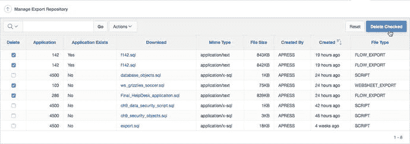
图 14-13. 删除选中项按钮


### 交互式报表设置

交互式报表设置页面允许工作区管理员管理已保存的报表和报表订阅。只有工作区管理员可以删除已保存的报表和报表订阅。修改报表配置的唯一方式是以该用户身份登录。

#### 已保存的报表

“已保存的报表”部分允许您删除某些已保存的交互式报表。交互式报表有四种不同类型的已保存报表（参见图 14-14）。**主默认报表**是开发人员创建时的默认报表设置，所有用户均可访问。**备选默认报表**同样由开发人员保存，所有用户也可访问。这使开发人员能够预先创建同一报表的多个版本。

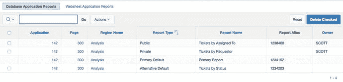

图 14-14. 管理已保存的交互式报表页面

**私有交互式报表**是自定义的交互式报表，仅对创建它们的用户可见。**公共交互式报表**是由特权终端用户保存并设为公共的报表，因此任何其他用户都可以查看。

在“已保存的报表”页面上，您可以通过选择报表并单击“删除已勾选项”按钮来删除除“主默认报表”外的任何报表。主默认报表无法从此界面删除，只能通过直接编辑报表区域进行更改。

#### 订阅

与“已保存的报表”部分类似，您可以从“订阅”部分删除交互式报表订阅。订阅允许用户按照他们定义的时间表接收通过电子邮件发送的报表。订阅是 APEX 4.0 中的一项新功能，必须由开发人员显式启用。

在“管理订阅”页面上，工作区管理员可以删除特定订阅或所有订阅，如图 14-15 所示。与已保存的报表一样，您无法修改任何订阅属性。

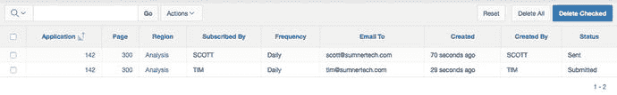

图 14-15. 管理订阅页面

### 管理用户和组

本节将介绍在图 14-1 所示的“管理”主页上单击“管理用户和组”图标时可用的大部分功能。所有参考内容均假设您从图 14-16 所示的“管理用户和组”页面开始。

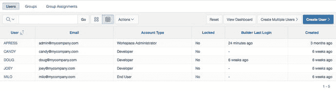

图 14-16. 管理用户和组页面

主页面包含所有终端用户、开发人员和工作区管理员的列表。您可以通过单击用户名来修改用户。终端用户无法访问开发环境，并且仅当身份验证方案为默认的“Application Express”时，他们才能访问应用程序。

#### 创建单个用户

要创建单个用户，请单击图 14-16 中所示的“创建用户”按钮。如果只创建开发人员，则无需担心填写某些非必填字段，例如名字和姓氏，因为您通常通过用户名来识别用户。您还可以授予对特定模块的访问权限。例如，如果您为项目经理创建账户，可能只想授予他们对“团队开发”模块的访问权限，如图 14-17 所示。

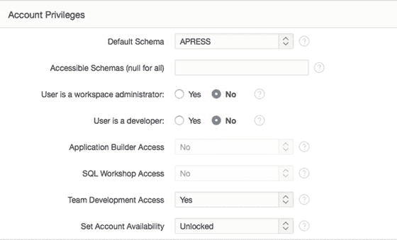

图 14-17. 账户权限

#### 创建多个用户

使用“创建用户”页面一次创建一个用户可能会变得缓慢且令人沮丧。APEX 提供了一个用于创建多个用户的界面。首先单击“创建多个用户”按钮，如图 14-16 所示。

在“创建多个用户”页面上，您需要为每个用户提供一个电子邮件地址。电子邮件地址可以用逗号、分号或换行符分隔。APEX 会根据您输入的电子邮件地址生成用户名。例如，电子邮件地址 `doug@mycompany.com` 生成的用户名可以是 `doug@mycompany.com`，也可以只是简单的 `doug`。您可以指定是希望每个电子邮件地址直接转换为用户名，还是希望用户名排除 `@domain` 后缀。图 14-18 显示了后一种选项的单选按钮设置。

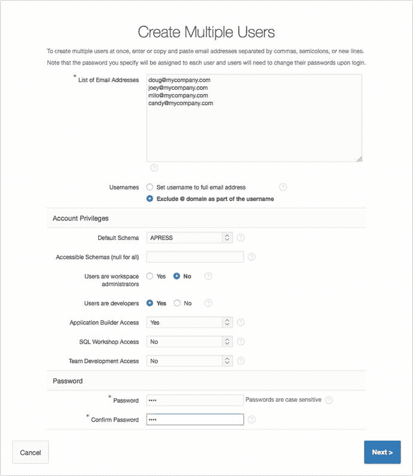

图 14-18. 创建多个用户页面

如果您的用户名与公司电子邮件地址不对应，您可以输入带有无效域的电子邮件地址，并选择省略后缀的选项。例如，当您只想要一个名为 `jonathan` 的用户时，输入电子邮件地址 `jonathan@example.com`。然后选择排除电子邮件地址的 `@domain` 部分。

您输入的密码对所有用户都是相同的。当他们登录工作区时，系统将要求他们更改密码。

在“创建多个用户”页面上输入所有信息后，单击“下一步”按钮转到如图 14-19 所示的确认页面。如果所有信息正确，请单击“创建有效用户”按钮。

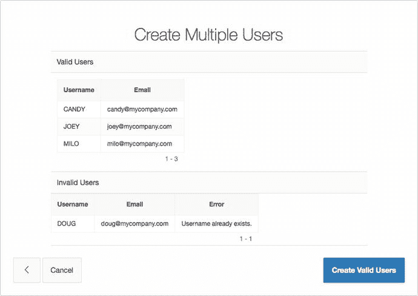

图 14-19. 创建多个用户确认页面

#### 将用户组织到组中

您可以将一个 APEX 用户关联到多个组。这些组可用于授权方案中，以授予或拒绝访问应用程序的各个部分。由于组与 APEX 用户关联，因此仅当您的身份验证方案设置为默认的“Application Express”方案时才能使用组。

需要注意的是，组与单个工作区相关联。如果您拥有包含开发、测试和生产环境的典型设置，则需要在每个工作区中创建相同的组。

#### 创建组

要创建用户组，请单击“任务”区域中的“管理用户组”链接（如图 14-20 所示），然后单击“创建用户组”按钮。输入唯一的组名和描述，如图 14-24 所示。组可以嵌套，即包含其他组。当一个组包含其他组时，它们成为父组，因此“继承”其他组的成员身份。

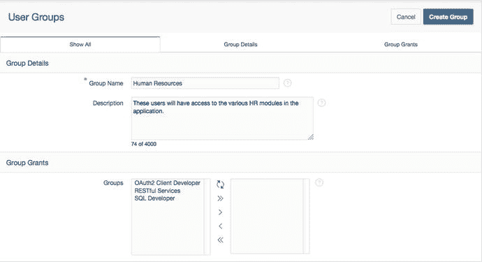

图 14-21. 创建用户组

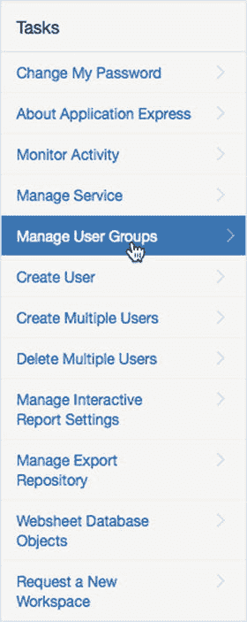

图 14-20. 从“任务”菜单中选择“管理用户组”选项

#### 将用户分配到组

将用户分配到组的操作不是很直观。单击“管理用户组”区域中的“组分配”只会显示所有用户及其组的报告。要将用户分配到组，您需要编辑该用户（用户 ➤ 编辑用户）并向下滚动到如图 14-22 所示的“用户组”区域。

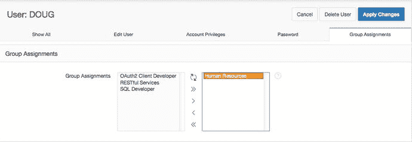

图 14-22. 将用户分配到组

### 查看使用情况报告和仪表板

图 14-1 中的“监控活动”和“仪表板”部分提供了许多关于您 APEX 工作区的详细报告和汇总报告。这些报告包含有关开发人员活动和终端用户活动的信息。我们鼓励您探索这些部分的每一个，以查看所有可用的报告。

## 概要

APEX 提供了多种工具来帮助您管理工作区，并提供有关工作区的统计报告。某些工具可能影响终端用户，因此应谨慎使用。然而，切勿因需要谨慎而放弃使用那些能让您的工作更轻松的工具。深入了解这些工具，对您的知识保持信心，行动前稍作思考。这些都是成功的关键。

## 15. 团队开发

团队开发是管理 APEX 软件开发的出色工具。它内置于 APEX 开发环境中，允许您使用团队日常使用的工具（如交互式报告）来管理您的 APEX 项目。这消除了对额外项目管理工具的需求。团队开发简单、可扩展且灵活的架构，非常适合管理任何规模的项目。其简洁性适用于希望最小化项目管理开销的小型项目。其可扩展性良好，允许您通过使用其丰富的属性集构建精细的工作分解结构 (`WBS`) 来管理大型项目。其灵活性让您可以根据组织的软件开发文化进行调整。

APEX 和团队开发都非常适合敏捷软件开发方法。APEX 的快速应用开发 (`RAD`) 架构使团队能够快速向业务测试人员和终端用户交付定期发布的版本。团队开发的反馈机制能高效地将终端用户的问题传递回开发团队，以便将适当的更改纳入后续版本并轻松记录。团队开发让本已高效的开发平台 APEX 变得更加高效。

本章的主要目的是重点介绍团队开发的工作原理。次要目的是说明如何将敏捷软件开发实践与团队开发结合使用，以在满足成本和进度限制的同时交付高质量软件。到本章结束时，您应该对团队开发的内容有很好的理解，并了解一些将其整合到团队开发文化中的想法。

团队开发是在 APEX 4.0 版本中添加的。APEX 团队在开发 APEX 时，甚至在它作为 APEX 模块发布之前，就已经使用了团队开发的一个版本。这种“用工具构建工具”的设计理念是团队开发和 APEX 成为实用且易于使用的工具的关键原因。

## 团队开发概述

团队开发由 `里程碑`、`功能`、`待办事项`、`缺陷` 和 `反馈` 组成。这些模块辅以少量称为 `团队操作` 的实用程序，用于管理团队开发环境。实体关系图 (`ERD`) 说明了主要实体之间的关系（参见图 15-1）。

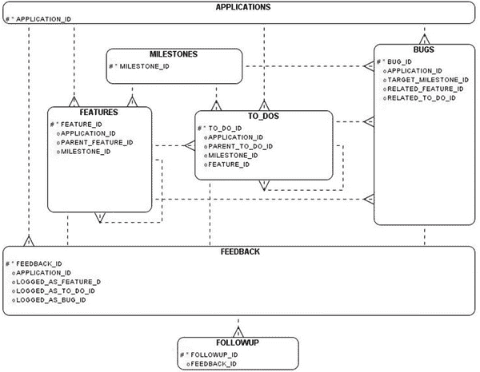
图 15-1. 团队开发的简化实体关系图

团队开发的实体包含在单个工作区内。当您在同一工作区内同时管理多个应用程序时，您和您的团队可以使用该工具的交互式报告轻松筛选团队开发的数据。这样，每个利益相关者只能看到与当前任务直接相关的工作。

`里程碑` 是团队开发中的高级计划组件。它们可用于跟踪应用程序的主要和次要版本。不要将里程碑与 `功能` 和 `待办事项` 的截止日期混淆。例如，里程碑可以是产品发布的预定日期，但包含在该版本中的功能可能在里程碑日期之前很久就到期了。如果您采用敏捷软件开发策略，里程碑非常适合定义时间盒或 `冲刺`。

`功能` 描述了全局概况。在高层次上，它们描述并跟踪客户要求的主要功能块的进度。像 `负责人`、`开始日期`、`截止日期`、`摘要描述`、`优先级`、`状态` 等属性易于跟踪。此外，您可以选择跟踪各个组件的状态，例如 `用户界面`、`测试`、`文档`、`全球化`、`安全` 和 `可访问性`。与功能关联的自连接允许您随着开发的进展和设计的细化，将功能进一步细分为子功能。功能的高层次特性使其成为管理状态报告的理想来源。

`待办事项` 用于向个人或团队分配详细工作。跟踪截止日期、时间估算等。与功能类似，待办事项具有自连接功能，允许您在开发过程中获得更多信息时对其进行细分。当单个待办事项需要多个团队成员共同努力时，这非常方便。

当发现缺陷时，它会作为 `缺陷` 被报告。缺陷有自己的生命周期，包含一组丰富的属性，如 `描述`、`解决方案`、`版本`、`负责人`、`上下文` 和 `日期` 信息。当您发现一个缺陷实际上是设计缺陷时，团队开发允许您将该缺陷链接到多个功能、里程碑和待办事项，因为修复该缺陷可能需要跨越多个产品发布的扩展时间范围。

`反馈` 是团队开发的主要亮点之一。反馈机制可以在几分钟内安装到应用程序中，并为整个团队提供一个高效、优雅的沟通渠道，用于评论、建议、问题、缺陷报告和响应。一旦安装到应用程序中，反馈机制就会随着应用程序从开发环境升级到测试环境，再升级到生产环境。反馈数据及相关响应通过 APEX 导入/导出功能在各种环境之间来回复制。这使得开发人员、测试人员和终端用户能够保持紧密联系。反馈机制的另一个关键特点是，它会自动记录所有终端用户一无所知的关键“幕后”数据。应用程序上下文、环境变量，以及最重要的 `会话状态` 都会被捕获。在诊断问题时，这些数据非常宝贵。

乍一看，团队开发的实体似乎包含大量属性。那么，您是否必须输入所有这些属性才能使用团队开发？不。为了充分利用团队开发，您和您的团队必须规划如何使用它，着眼于以最小的努力有效管理软件开发过程。您可以挑选一小部分适合您软件开发文化的团队开发属性，并仅关注该部分数据。交互式报告可以轻松自定义，只显示对您重要的数据。

## 团队开发界面

团队开发界面与整个 APEX 开发界面保持一致。它广泛使用 `仪表板` 来快速让您了解团队的进展情况。深入查看和更新数据的详细信息相当直接和直观。APEX 开发人员在该工具内导航或自定义交互式报告不会有任何困难。经理、测试人员和业务分析师在经过简短培训后也能使用团队开发。


## APEX 主页

APEX 主页（参见图 15-2）清楚地表明了 `团队开发` 对 APEX 团队的重要性。APEX 团队本可以轻易地将 `团队开发` 放在主页某个次要链接下。相反，`团队开发` 被提升为一个显著的模块，与 `应用程序构建器` 和 `SQL 工作坊` 处于同等重要的地位。

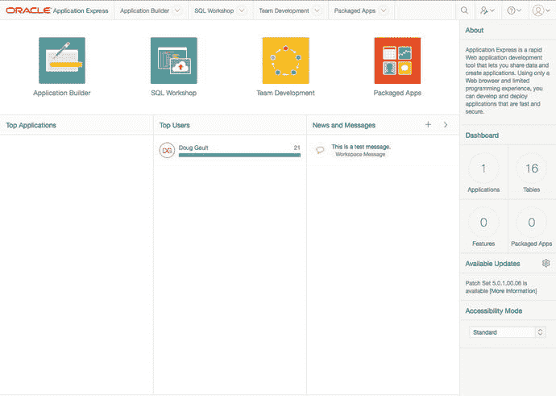
图 15-2.

APEX 主页

APEX 主页突出了其便捷的导航。`新闻与消息` 区域将用于存放工作区级别的消息以及直接来自 `团队开发` 的新闻，其中包含两个链接（`创建新闻项` 和 `编辑新闻项`），使用户能够快速更改该区域内容，而无需深入子页面。在右侧的 `仪表板` 区域中，你会看到其中一个指标是 `特性`。右侧的区域通常包含更多可用信息或开发人员可用的任务列表。在整个 `团队开发` 界面中留意类似的链接；它们非常方便。

## 团队开发主页

`团队开发` 主页（参见图 15-3）有两个用途。首先，它包含指向所有详细实体区域的链接；其次，它为你展示了每个实体的仪表板。你还会看到指向 `实用工具` 的链接，本章末尾的“`团队开发实用工具`”一节将对此进行讨论。

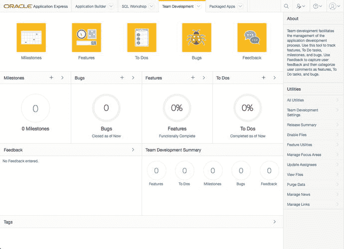
图 15-3.

团队开发主页

主要的 `团队开发` 仪表板页面提供了该模块活动的高层概览。用户可以从此处添加新项目，或直接导航到 `团队开发` 各个领域的详细仪表板。

详细仪表板可以根据 `负责人`、`版本` 和 `应用` 的组合进行筛选，具体取决于领域。这些筛选器使用户可以轻松地根据需求自定义页面。例如，经理可以问：“我们做得怎么样？”，而开发人员可以问：“我需要为这个版本做什么？” 这个高层筛选区域位于与每个 `团队开发` 实体关联的仪表板页面顶部。筛选字段根据每个实体量身定制。仪表板区域链接到其底层实体。每个标题中都有 `添加` 和 `编辑` 图标，以及每个项目类型的饼图；点击其中任何一项，你都会被带到相应项目的适当报告页面、`创建` 页面或 `编辑` 页面。

## 通用设计元素

当你深入各个 `团队开发` 实体时，会发现一些通用的设计元素，这些元素帮助你在实体之间快速、直观地导航。图 15-4 突出了这些设计元素。左上角是一组为每个实体定制的选项卡。其中一些选项卡——`仪表板`、`报告` 和 `日历`——是所有实体通用的。另一些则是特定实体独有的。

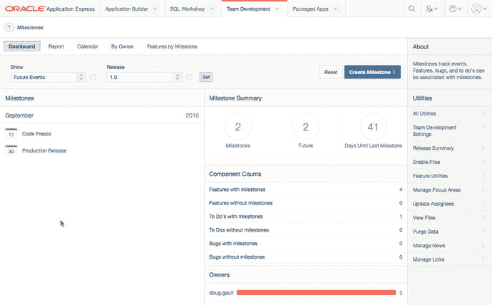
图 15-4.

所有实体通用的 GUI 设计元素

所有的仪表板页面都包含一个为实体量身定制的 `筛选` 区域。筛选器的选择列表只包含 `团队开发` 正在跟踪的实体条目。例如，如果某个 `应用` 没有任何关联的 `特性`，那么该 `应用` 就不会出现在选择列表中。

许多独立的仪表板区域包含链接，这些链接将你带到实体的 `报告` 页面，并自动在 `详情` 页面的 `交互式报告` 上设置筛选器，以便你只能看到与所选仪表板项目相关的实体记录。一旦你习惯了这种导航策略，就会觉得它极其方便。

## 下钻功能

`日历` 选项卡（参见图 15-5）根据实体记录的到期日显示指向单个实体记录的链接。点击条目的链接会直接带你到所选实体记录的 `编辑` 页面。在 `编辑` 页面点击 `取消` 按钮会返回到日历。

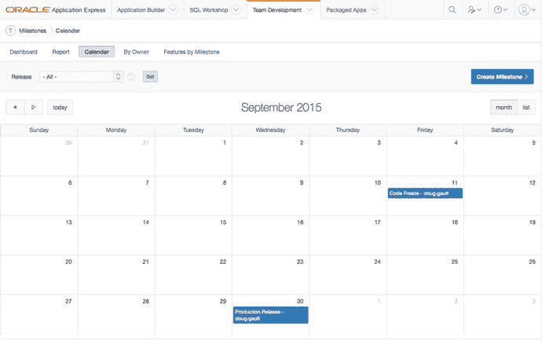
图 15-5.

带有指向编辑页面链接的日历

一些实体选项卡以图形方式显示其数据（参见图 15-6）。点击图表会自动带你进入实体的 `详情` 页面，并将 `交互式报告` 设置为仅显示图表中所选的数据。

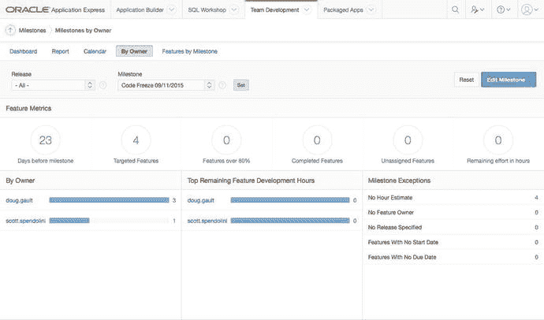
图 15-6.

图形化数据摘要

## 标签

一个名为 `标签` 的强大组织属性与所有实体相关联。标签是一种自由格式的文本输入，使你能够通过关键字对记录进行分组。这很方便，因为有些记录分组并不适合整齐划一的关系数据模型。例如，你可能希望在所有 `应用` 中查找包含“穿梭”项的所有 `特性`。通过为这些 `特性` 添加标签“穿梭”，你可以使用 `交互式报告` 的 `搜索` 字段来查找所有包含“穿梭”标签的记录。所有仪表板页面都包含一个区域，显示其各自实体中定义的标签字符串。这使你能够快速发现并纠正拼写错误，从而保持自由格式标签的准确性。

## 克服最初的不适应

起初，`团队开发` 的组织结构、布局和导航可能看起来有点奇怪且不直观。我最初也确实为此困扰过。我最初的感知可能源于我之前使用项目管理工具的经验，那些工具通常左侧是工作分解结构页面，右侧是甘特图。

最初对 `团队开发` 的不适应感，类似于我初次使用 APEX 时的体验。和许多经验丰富的开发人员一样，我来自这样的开发环境：屏幕小部件列在左侧并拖放到屏幕上，X-Y 坐标与小部件的高度和宽度一起设置，达到像素级的精度。

当我第一次使用 APEX 时，花了一些时间才习惯 APEX 构建页面的方式。尝试几次后，我学会了喜爱这个产品。我相信你对 `团队开发` 也会有同样的感受。经过一些实践后，你会发现 `交互式报告` 实际上是甘特图的一个实用替代方案，尤其是在敏捷软件开发环境中，时间盒很短，`交互式报告` 中的列表也相应较小。


## 里程碑

里程碑用于定义和追踪计划内及一次性事件的日期。表面上看，这是一个简单的概念；然而，它可能是一个令人困惑的领域，因为里程碑的功能与 `发布` 重叠，并且可能与 `功能特性`、`待办事项` 和 `缺陷` 相关联的截止日期混淆。幸运的是，通过一点规划和组织，可以减轻这种困惑。

一种可用于组织 `里程碑` 和 `发布` 的策略是为同一个发布事件各创建一个。`里程碑` 包含与该 `发布` 相关的元数据：日期、类型、所有者、描述和标签。`发布` 被定义为一个可配置的 `值列表`，供所有团队开发实体共享，但它不包含描述性元数据。此外，`发布` 是与 `功能特性`、`待办事项` 和 `缺陷` 相关联的便捷高级筛选器之一。对元数据和高级筛选器的双重需求，正是必须使用 `里程碑` 和 `发布` 来描述同一事件的原因。值得庆幸的是，这样做的额外开销很低。

对于包含多个应用程序的工作空间，另一个建议是使用其关联应用程序的名称或代码作为前缀来命名 `功能特性`、`里程碑`、`发布`、`待办事项` 和 `反馈`。在许多情况下，这并非绝对必要，但它可以使某些仪表板更具可读性，因为它们通常只包含实体的名称，而没有任何支持数据。

当然，`里程碑` 也用于定义和追踪软件开发生命周期中的其他事件。重要会议、工具软件升级和需求交付只是几个例子。

`里程碑` 界面包含多个选项卡。`仪表板` 和 `日历` 选项卡对所有实体通用，并已在前面讨论过。

### 里程碑报告选项卡

图 15-7 中的 `报告` 选项卡显示了一个交互式报告，其中包含 `里程碑` 列表。高级筛选器允许您选择全部或仅未来事件，以及单个 `发布`。交互式报告中的 `编辑` 链接将带您进入该 `里程碑` 的编辑页面，该页面包含直观的项目，并在其标签下有文档说明。

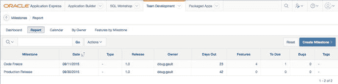

图 15-7. `里程碑` 选项卡

### 按所有者选项卡

`按所有者` 选项卡（参见图 15-8）是一个仪表板，它按所有者分类，汇总了单个 `里程碑` 与其他团队开发实体之间的关系。了解相关 `功能特性`、`待办事项` 和 `缺陷` 的数量与状态，是一种有效的管理工具，对于控制导向一个 `发布` 的冲刺或时间盒非常有用。

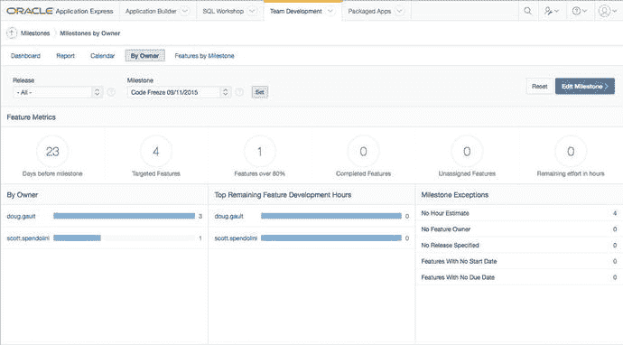

图 15-8. `按所有者的里程碑` 选项卡

### 按里程碑的功能特性选项卡

`按里程碑的功能特性` 选项卡（参见图 15-9）包含一个交互式报告，详细说明了 `里程碑` 与其关联的 `功能特性` 之间的关系。这主要是一份管理报告。

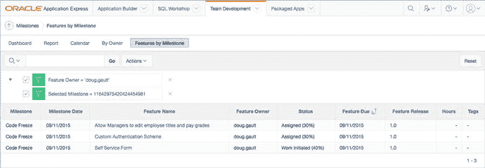

图 15-9. `按里程碑的功能特性` 选项卡

## 功能特性

`功能特性` 从高层视角描述一个应用程序。它们在开发项目开始时使用，以充分定义范围，从而可以估算成本、进度和资源需求的预算。项目获批并开始工作后，会添加子 `功能特性` 以更详细地描述、控制和追踪进度。`功能特性` 是管理状态报告的核心。

`功能特性` 详情页包含多个选项卡。`仪表板`、`日历`、`关注区域` 和 `所有者` 选项卡在此不作讨论，因为它们或其等效项对所有实体通用，其特性已在前面提及。接下来重点介绍 `报告`、`历史记录` 和 `进度日志` 选项卡。

### 功能特性报告选项卡

`报告` 选项卡（参见图 15-10）包含一个交互式报告，该报告进而链接到单个 `功能特性` 记录的编辑页面。由于数据网格是一个交互式报告，每个用户都可以根据自己的需求定制它。您可以从大约 50 个属性中选择列，按喜好排序，甚至可以将相关记录分组在一起。交互式报告在 第 6 章 中有详细讨论。

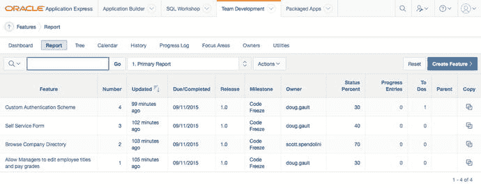

图 15-10. `功能特性` 交互式报告

当您要输入多个相关的 `功能特性` 时，`复制` 链接非常有用。例如，如果您要输入 10 或 20 个属于同一个应用程序的 `功能特性`，您可能预期许多数据属性在每条记录上都会重复。`复制` 链接会创建一个新的 `功能特性`，作为交互式报告中现有记录的精确副本。只有名称会被更改。新 `功能特性` 创建后，您可以快速编辑它，并更改该记录特有的属性。

`编辑` 链接将带您进入 `功能特性` 编辑页面（参见图 15-11）。您可以轻松地自行浏览各个属性；它们的定义通常是自明的，并通过点击属性标签进行记录。然而，`功能特性` 编辑页面上有一些区域需要更多解释：
*   `用户界面`、`测试`、`文档`、`全球化`、`安全` 和 `无障碍性` 区域：这些区域用于追踪与 `功能特性` 相关的子生命周期。例如，如果一个独立团队负责文档，他们的进度可以与主 `功能特性` 分开追踪（参见图 15-12）。如果不需要追踪文档工作，则可以通过在团队开发设置区域中关闭它，将 `文档` 区域从 `功能特性` 编辑页面中排除。请参阅本章后面的“团队开发设置”小节。
    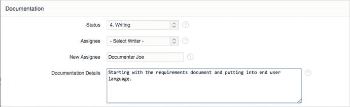
    图 15-12. `功能特性文档` 区域
    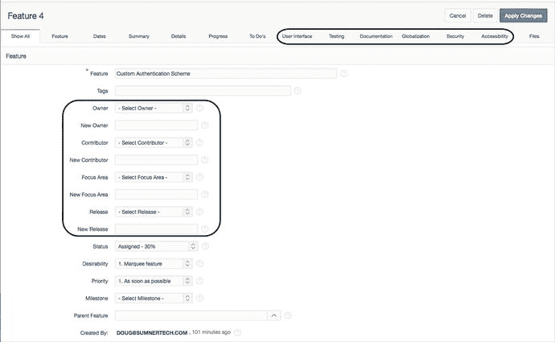
    图 15-11. `功能特性` 编辑页面
*   可配置的值列表 (`LOV`)：有些 `LOV`，如 `状态`，由 APEX 团队控制。其他，如 `所有者`，由开发团队控制。这些列表是在原地维护的，而不是在一个单独的维护区域中维护开发人员可配置的 `LOV`。例如，要添加一个新所有者，您在 `新所有者` 项目中输入适当的名称，然后单击 `应用更改` 按钮，该名称就会被添加到 `LOV` 中。遗憾的是，目前没有简单安全的方法来编辑这些可配置的 `LOV`；我们希望在未来版本的 APEX 中能增加此功能。

### 历史记录选项卡

`历史记录` 选项卡（参见图 15-13）提供了对所有 `功能特性` 所有更改的详细审计跟踪。该选项卡显示了一个交互式报告，包含有关 `功能特性`、列名、旧值、新值、进行更改的用户以及更改时间的信息。您可以出于质量保证目的查看 `历史记录` 选项卡上的报告，或者在发生合同纠纷时作为证据来源。

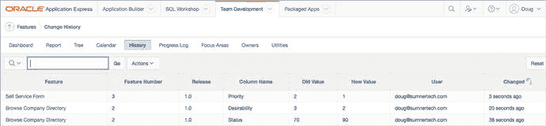

图 15-13. `功能特性历史记录` 选项卡


### 进度日志选项卡

图 15-14 中的“进度日志”选项卡，实际上就是一个日志。相关方可以在“特性编辑”页面，随时在进度日志中输入自由格式的文本。进度日志可作为开发团队的沟通渠道，用于记录新想法、提醒、灵光一现、问题，以及其他任何需要记住的内容。

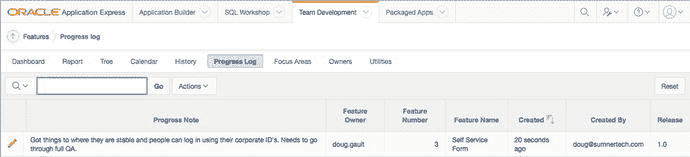

图 15-14. 特性进度日志选项卡

## 待办事项

待办事项是团队开发模块的核心。团队开发将“待办事项”用作名词。一个待办事项是分配给个人或团队并附有截止日期的具体任务。简而言之，一个待办事项描述了任务的内容、负责人和时间。

待办事项可以细分为许多子任务和孙任务。这个分解过程可以一直进行，直到收益递减。一个经验法则是，子任务的层级数量应足以有效地控制手头的任务。多少层级是合适的，当然取决于团队的文化。此外，在敏捷软件开发团队中，由于团队成员之间每日的面对面沟通，子任务层级通常保持得比较浅。

待办事项模块包含四个选项卡：仪表板、待办事项、日历和进度日志。你会发现使用这些选项卡既简单又直观。

一个便捷的导航特性将开发环境直接链接到待办事项模块。当一个待办事项的上下文同时设置为某个应用程序和该应用程序中的特定页码时，一个待办事项计数会出现在“团队开发”下拉菜单中（参见图 15-15）。在下拉菜单中，你可以看到待办事项、缺陷、反馈和特性的计数。当你点击待办事项计数时，该链接会直接带你到待办事项报告页面，该页面的交互式报告过滤器已设置为仅列出与开发页面关联的未完成待办事项（参见图 15-16）。然后，开发者可以快速选择一个待办事项，查看需要做什么，然后返回开发页面完成待办任务。这种高效的导航策略也适用于缺陷和反馈。

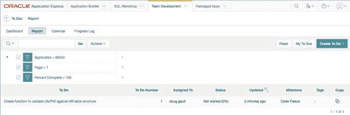

图 15-16. 按应用程序的开发计数链接筛选的待办事项页面

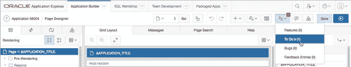

图 15-15. 直接链接到待办事项模块的开发页面

## 缺陷

在软件开发领域，缺陷是生活的一部分。我们都希望缺陷在产品发布给最终用户之前，在单元测试和系统测试周期中被发现并修复。令人高兴的是，这通常是事实，但需注意有少量缺陷会漏进生产环境。团队开发的缺陷模块是一个实用的环境，用于跟踪开发、测试和生产环境中的简单缺陷和疑难缺陷。

简单缺陷通常由编码错误或程序员对需求的误解引起。症状明显，根本原因易于查找，修复也几乎微不足道；例如，将加号改为减号，或在代码中重新组织一个 `IF` 语句。简单缺陷通常在产品开发周期的早期被发现，并且通常由程序员或测试人员捕获。然而，简单缺陷必须被记录和报告，以便改进编码过程；大量的简单缺陷最终可能会带来惊人的成本。

疑难缺陷，顾名思义，很难处理。它们可能由系统中任何地方的设计缺陷、软件系统之间的微妙交互、软件与硬件之间的微妙交互，以及用户与图形用户界面之间不顺畅的交互引起。疑难缺陷可能有它们自己的生命周期，修复过程可能会跨越几个产品版本。团队开发的缺陷和待办事项模块可以一起使用，以跟踪疑难缺陷的解决过程，即使它横跨多个产品版本。

缺陷模块突显了你如何利用团队开发的简洁性、可扩展性和灵活性。简洁性使得跟踪简单缺陷几乎微不足道。发现缺陷后，关于该缺陷的所有信息（包括内容、负责人和时间数据）都记录在团队开发的缺陷模块中。简单缺陷可以独立存在，或者你可以根据团队开发环境的组织方式，将它们与一个待办事项关联起来。

当你处理那些可能需要较长时间修复，并且可能需要多个开发者或团队共同努力的疑难缺陷时，可扩展性和灵活性就发挥作用了。团队开发可以通过将一个疑难缺陷链接到一个待办事项来处理这种情况（参见图 15-17）。然后，链接的待办事项被设置为多个子待办事项的父项，这些子待办事项用于跟踪修复所需的任务。

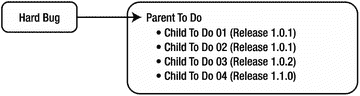

图 15-17. 将疑难缺陷链接到父待办事项

## 反馈

团队开发的反馈模块是 APEX 的一个“亮点”。即使你的团队选择不使用团队开发来管理其软件开发工作，你至少应该考虑使用反馈模块。反馈模块提供了一个高性价比的渠道，最终用户、测试团队成员，甚至开发者本身都可以通过这个渠道直接向业务分析师和开发者发送建议、评论和错误报告。对反馈的回复可以选择性地传达给触发反馈的人员。并且可以从所有三种典型环境获取反馈：生产环境、测试环境和开发环境。

注意

反馈模块之所以如此高性价比，是因为其成本效益比几乎趋近于零。在 APEX 应用程序中设置反馈只需要几分钟，却能给你带来巨大的好处。


### 配置反馈机制

您可以通过在应用中创建一个新页面来开始配置反馈机制。“创建页面”向导包含一个“反馈页面”选项（见图 15-18）。选择此选项，然后单击“下一步”按钮。

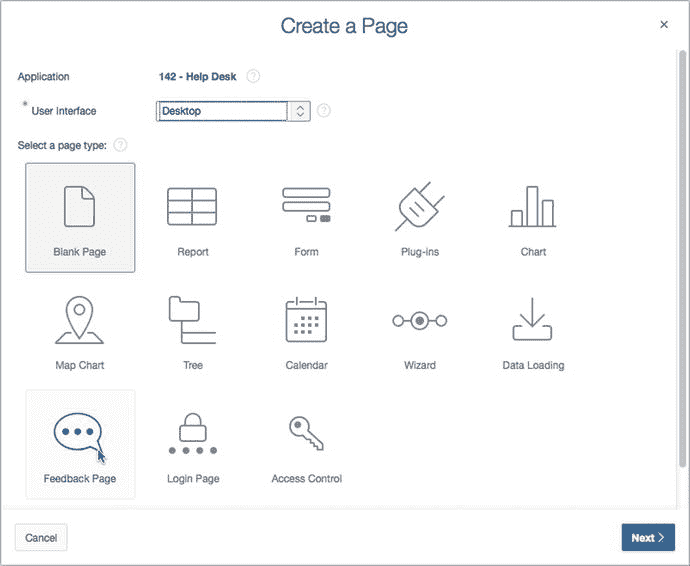
图 15-18. 创建页面向导中的反馈页面选项

向导的下一页用于设置反馈页面的详细信息（见图 15-19）。您需要输入页面编号和页面名称，然后选择一个页面模板、表单区域模板和标签模板。您还可以以声明式方式在应用的全局导航栏上创建一个反馈链接。在大多数情况下，默认设置就能很好地工作。

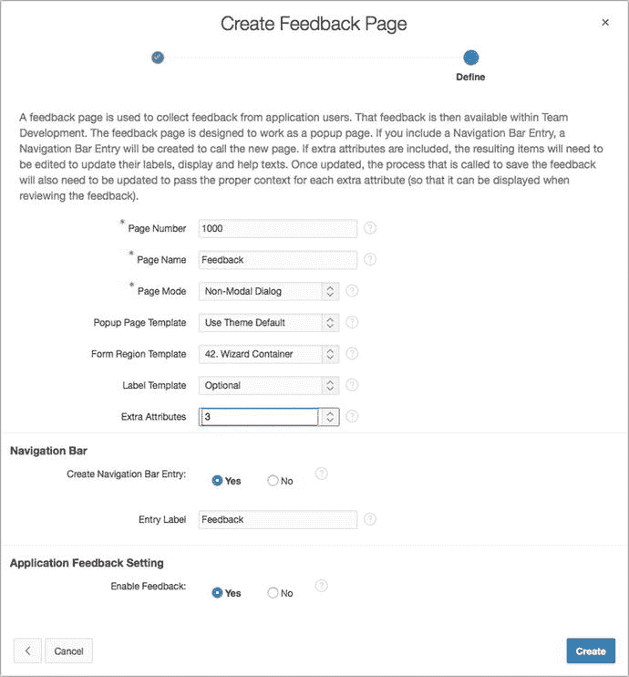
图 15-19. 在创建页面向导中设置反馈页面

然而，有一个属性需要稍作解释，因为其好处并非显而易见。“额外属性”字段允许您向反馈页面添加最多八个自定义字段。这些字段有时被称为弹性字段。这些字段可用于在用户提交反馈时提示最终用户提供额外信息。例如，一个公共的 APEX 网站不需要登录；因此，无法自动捕获用户身份。额外属性可用于捕获用户的姓名和电子邮件，以便将反馈响应发送给他们。

单击“创建”按钮，然后运行该应用。您现在可以在导航栏中看到“反馈”链接（见图 15-20）。如果您的设计中无法使用默认的反馈链接，您可以将其移动到应用中的任意位置。该链接使用标准的 APEX `f?p` 语法。

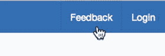
图 15-20. 带有反馈链接的应用

### 完善反馈页面

当您点击反馈链接时，会显示反馈弹出页面（见图 15-21）。如您所见，该页面需要稍作完善。因为这是一个标准的 APEX 页面，您可以通过单击“编辑页面”按钮导航到页面设计器，在一两分钟内完成完善工作。

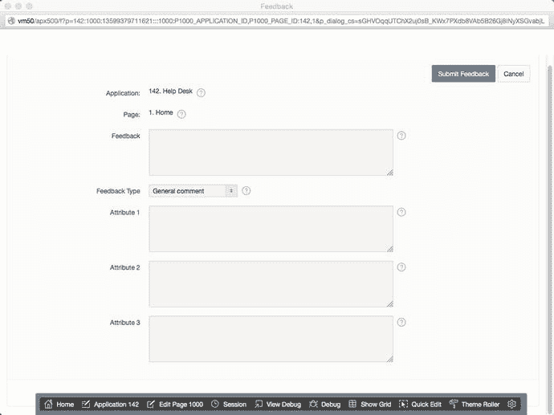
图 15-21. 未经完善的反馈页面

在这个例子中，让我们将 Attribute1、Attribute2 和 Attribute3 更改为姓名、部门和电子邮件。当您在“创建页面”向导的“额外属性”字段中选择`3`时，APEX 会自动将这些项目添加到反馈页面（见图 15-22）。

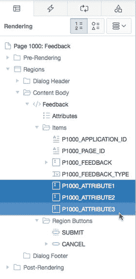
图 15-22. 反馈页面上的额外属性

配置额外属性是一个两步过程。首先，重命名这些项目以描述其数据，将项目类型从`Textarea`更改适合数据的类型，并将标签重命名为对最终用户有意义的名称（见图 15-23）。

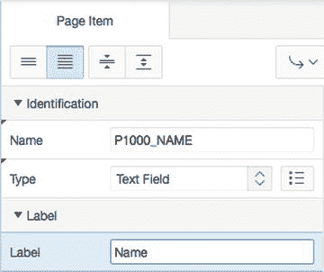
图 15-23. 重新配置额外属性

其次，在树形面板的“页面”选项卡中（见图 15-24），您必须编辑“提交反馈”流程，使 API 调用参数与重命名和重新标记的额外属性相匹配（见图 15-25）。

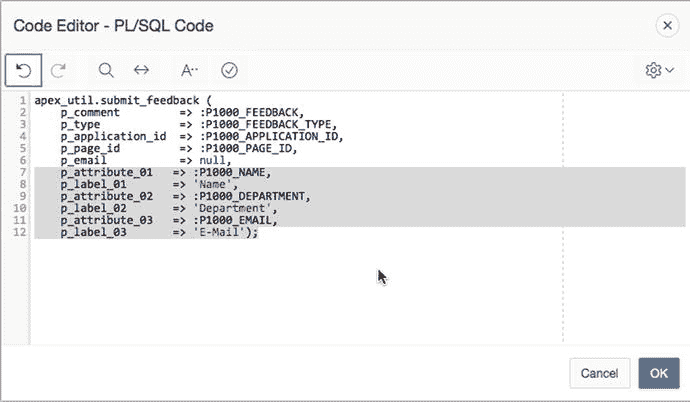
图 15-25. “提交反馈”流程源中的反馈页面处理更改

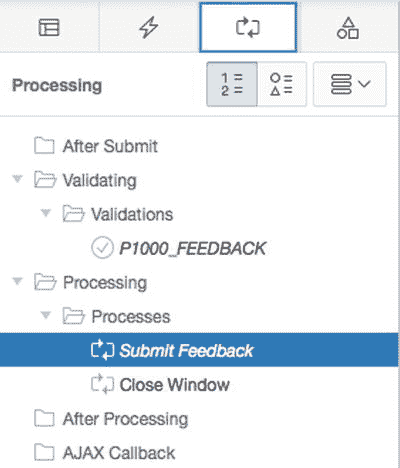
图 15-24. 反馈页面的处理区域

完成更改并重新运行应用后，您将看到最终完成的反馈页面（见图 15-26）。在页面中输入一些反馈内容，然后单击“提交反馈”按钮。接着，继续下一节，学习如何查看您和他人输入的反馈。

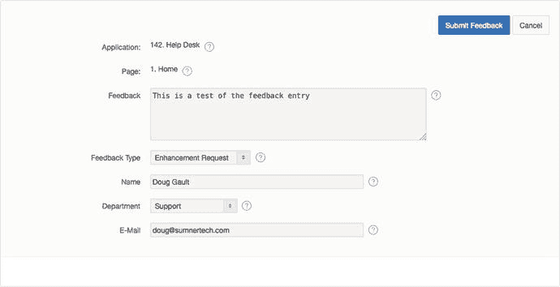
图 15-26. 包含三个额外属性的最终反馈页面

### 查看反馈

您可以从“团队开发”页面查看应用的所有反馈。导航到该页面，然后单击“反馈”选项卡。您应该会看到类似于图 15-27 的结果。

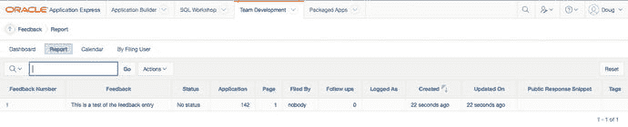
图 15-27. 反馈条目

当您深入查看单个反馈记录时，您会发现大量数据和信息，这些内容可以让您作为开发人员的工作轻松许多。“反馈”区域包含每条反馈记录的只读描述。“处置”区域用于跟踪反馈状态、标签、开发者评论和公开响应。此外，还有三个按钮：“记录为缺陷”、“记录为待办事项”和“记录为功能”。这些按钮会创建一个新的团队开发实体，并将数据从反馈记录复制到新实体，从而节省时间并确保准确性。“跟进”区域就像日记；它是随着时间的推移，在处理反馈过程中添加的备注列表。这在多人需要在采取行动前审阅反馈时非常方便。您添加到反馈页面的额外属性会显示在“附加属性”区域。其余区域显示只读数据，描述应用上下文、运行时环境（浏览器类型和版本）和整个会话状态。如果报告了一个缺陷，开发者就拥有了重现该缺陷所需的所有信息，这是一个宝贵的特性。

### 响应反馈

反馈机制包含一个响应表。原则上，响应应发送给发起反馈的用户。然而，目前没有简单且声明式的机制可以让您向用户发送响应。如果您想向用户发送响应，首先需要解决一些设计问题。例如，您是希望向所有用户广播响应，还是向个别用户发送个别响应？您想使用电子邮件还是创建报表？您希望向团队发送响应吗？您希望基于反馈分类方案来路由响应吗？

在设计好响应策略后，您就可以通过编写一些 PL/SQL 代码并访问公开所有团队开发数据的 APEX 视图，来构建一个满足需求的工具。然而，构建此工具的细节超出了本书的范围。

### 工作区之间的通信

团队开发是工作区的一个属性。许多专业机构会为生产、测试和开发环境维护多个工作区。这意味着，如果最终用户输入了一条反馈记录，该记录将驻留在生产工作区中，而开发者无法看到它。这种情况可以通过使用 APEX 现有的导出/导入功能轻松解决。APEX 4.0 及以上版本已将反馈添加到可导入和导出到工作区或从工作区导出的实体列表中。这使得导出生产反馈并将其导入测试环境成为可能，业务分析师可以在那里对其进行评估。如果需要，反馈可以从测试环境导出并导入到开发环境，开发者可以在那里进行评估，然后将其记录为缺陷、待办事项或功能。


## 团队开发工具

团队开发工具（参见图 15-28）是一组用于帮助您管理团队开发环境的杂项工具集。各个工具的链接位于团队开发主页的右侧。`所有工具`链接会带您到一个页面，该页面提供了所有工具的菜单及每个工具的简短描述。点击各个工具链接可直接进入相应工具。

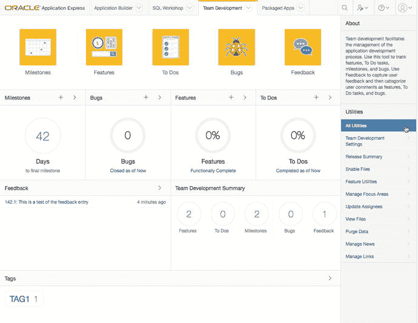

图 15-28. 团队开发工具

### 团队开发设置

一些对整个工作区生效的全局默认设置在团队开发设置页面（参见图 15-29）中进行配置。`启用跟踪属性`区域用于开启/关闭跟踪与用户界面、测试、文档、全球化、安全和辅助功能相关详细工作的功能区域。当您将这些属性设置为`否`时，功能特性详情页面上对应的区域将不会显示。

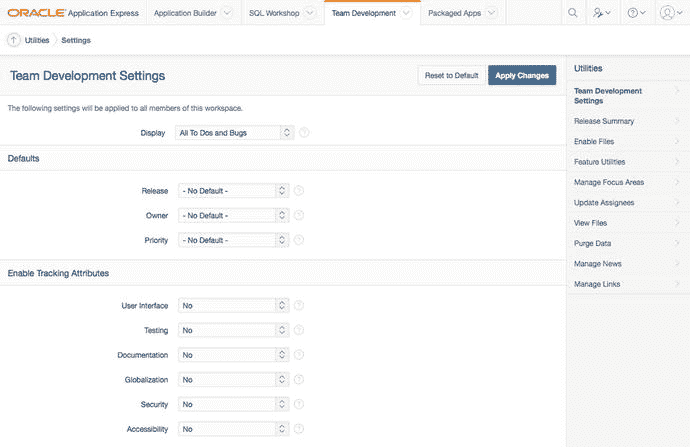

图 15-29. 团队开发设置页面

### 发布摘要

发布摘要页面是一个管理报告。它按发布名称组织，可以按开发者和发布名称进行筛选。图 15-30 展示了这份综合报告的一小部分。

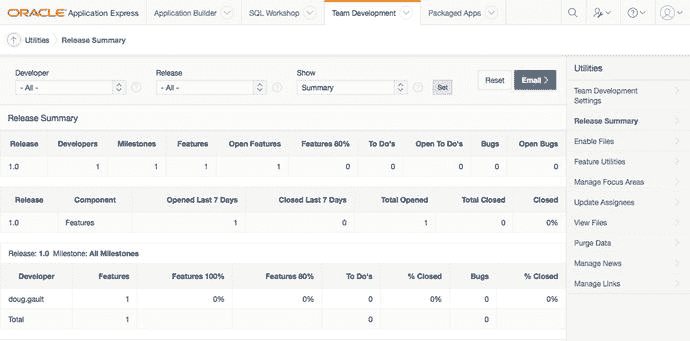

图 15-30. 发布摘要页面

### 启用文件

`启用文件`链接是通向工作区首选项屏幕的快捷方式。在这里，您可以设置`启用文件仓库`的值，该设置指定是否可以向团队开发上传文件。选择`是`将创建一个本地的`APEX$`表来存储文件。此功能仅在`实例管理员`也在实例级别启用它时才可用。

### 功能工具

功能工具（参见图 15-31）用于对团队开发数据进行批量更新。您可以为未分配的功能特性分配里程碑、设置功能特性截止日期、更改里程碑，以及推动开放功能特性的截止日期。在此之前，强烈建议您做好完整的备份。

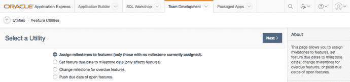

图 15-31. 功能工具

### 管理焦点区域

管理焦点区域工具允许您查看已创建的焦点区域、每个焦点区域的功能特性数量、不同负责人，以及给定焦点区域中功能特性的最后编辑情况。通过编辑，您还可以重命名一个焦点区域。

### 更新负责人

更新负责人工具允许您将各种组件从一个负责人重新分配给另一个负责人。您可以对所有版本或特定版本执行此操作，还可以选择要重新分配的组件。参见图 15-32。

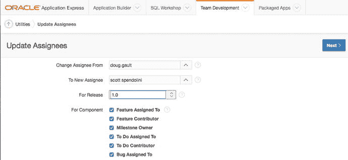

图 15-32. 更新各种组件的负责人

### 查看文件

如果已在工作区级别启用该功能，开发者可以将文件附加到功能特性、待办事项或缺陷。`查看文件`报告将列出所有已上传的文件及其一些元数据。您也可以从此报告下载文件。如果尚未启用此功能，链接将显示为“启用文件”。

### 清除数据

此工具允许您清除选定组件类型的数据。这将删除所选类型的所有条目，且无法恢复。如果您要开始一个全新的开发周期，或者需要从团队开发中清除测试数据，这将非常有用。

### 管理新闻

在 APEX 主页和团队开发主页上都有一个包含新闻消息的区域。您可以通过点击`管理新闻`链接或点击新闻区域中的加号图标来添加新闻项（参见图 15-33）。

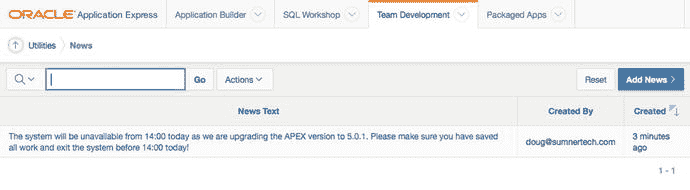

图 15-33. 管理新闻部分

当团队成员不在同一地点时，新闻区域对于广播开发新闻非常方便；例如，一个版本成功或失败地提升到测试环境。坐在一起并有每日状态会议的团队可能不会使用此区域。

### 管理链接

管理链接功能是一个简单的链接列表，链接指向文档、其他系统和网页，您可以轻松地将其定义为任何有效的 URL（参见图 15-34）。这些链接让开发者能够快速导航到开发团队批准的 URL。整个团队因此可以共享共同的文档，例如 SQL 或 PL/SQL 参考，这有助于团队遵循共同的开发风格和标准。这反过来又有助于鼓励一致性，从而极大地改善软件开发过程。

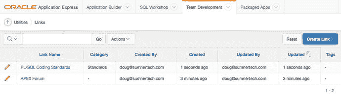

图 15-34. 管理链接功能

## 团队开发的用户角色

团队开发的访问权限对于开发团队内部和外部的利益相关者都很有用。团队负责人和高级开发者应该拥有团队开发的访问权限。初级开发者的访问权限取决于团队文化和信任水平。开发团队外部感兴趣的利益相关者可能包括项目经理、测试团队和业务分析师。

对 APEX 开发环境的访问在 APEX 管理区域的“管理用户和组”菜单下进行控制。此区域维护着 APEX 用户列表，规定每个用户的访问级别（参见图 15-35）。外部利益相关者设置为没有管理员和开发者权限；但是，`团队开发访问`字段设置为`是`。当他们登录 APEX 开发环境时，他们只能看到团队开发区域，看不到其他任何内容。目前此方案只有一个问题：外部利益相关者无法在应用程序下拉列表中看到应用程序。

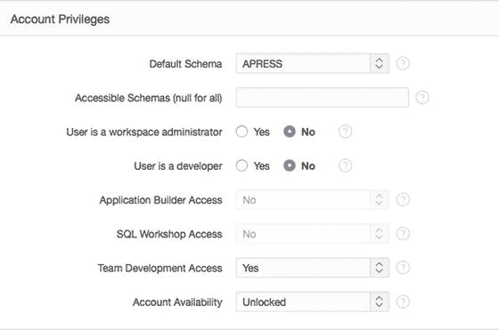

图 15-35. 项目经理、测试人员或业务分析师的账户权限

## 总结

团队开发是一个为在 APEX 开发环境中工作而量身定制的软件开发工具。五个主要实体（里程碑、功能特性、待办事项、缺陷和反馈）在一个简单、可扩展且灵活的框架中协同工作。采用敏捷软件开发方法的团队会发现 APEX 的团队开发工具与其文化非常契合。


