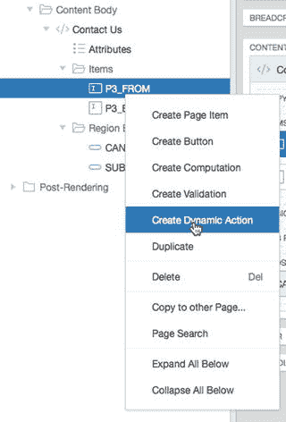
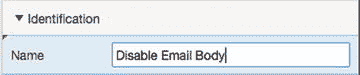
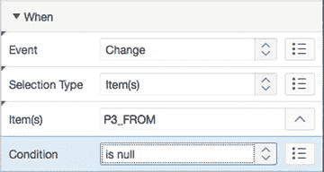
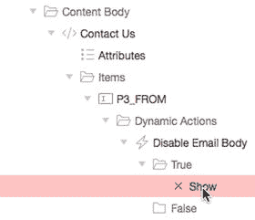
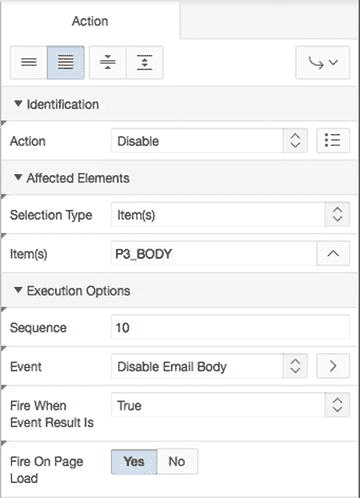
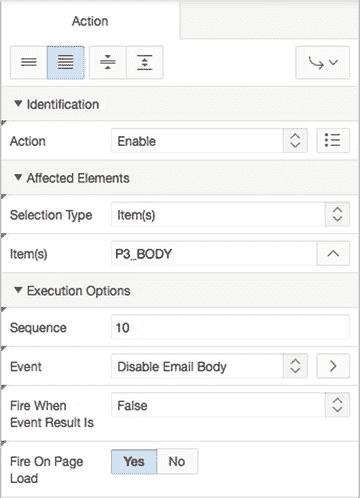

# 16. 动态操作

电子补充材料 本章在线版本（doi:[10.​1007/​978-1-4842-0466-5_​16](http://dx.doi.org/10.1007/978-1-4842-0466-5_16)）包含补充材料，可供授权用户使用。

近年来 APEX 版本引入的最令人兴奋的功能之一是动态操作，它提供了以声明方式定义复杂客户端行为的能力，例如验证、高亮显示、警报、设置页面值等，而无需手工编写大量 JavaScript 代码。

自引入以来，动态操作已得到显著扩展，提供了更强大的声明式灵活性和功能性。这有助于开发者摆脱传统的服务器端脚本模型，通过在浏览器上执行动态操作逻辑，而不是产生到服务器的往返请求。

动态操作与手动编写的 JavaScript 一样是事件驱动的。但 APEX 使用提供的声明式信息来生成所需的 JavaScript 代码，并在运行时实现。本章将研究和实现一系列不同的动态操作，以便您感受它们能实现什么。

## 动态操作的优势

使用声明式动态操作而非手工编码 JavaScript 的一个主要优势是，动态操作能够理解并利用 APEX 核心对象，如区域（regions）和项（items），从而便于引用和操作。使用声明式逻辑的另一个好处是，当您选择升级到 APEX 的下一个版本时，围绕动态操作的框架将确保任何生成的代码都与新版本的 APEX 兼容。

但除了 APEX 声明式本质的基础优势之外，动态操作让您能够编写非常复杂的客户端操作，而无需学习一门全新的技术来实现。事实上，您很可能仅使用动态操作向导、SQL 和 PL/SQL 就能完成超过 80%所需的功能编码。

然而，由于 JavaScript 是编写浏览器交互性的事实标准，您也很可能在某个时候被迫学习一点 JavaScript。学习 JavaScript 超出了本书的范围。毕竟，您购买本书是为了学习 APEX。但如果您确实想了解更多关于 JavaScript 的知识，Apress 有几本关于该主题的优秀书籍。

## 解构动态操作

在最初的形式中，动态操作分为两类：标准（standard）和高级（advanced）。这两类之间的唯一真正区别是相关向导允许您实现什么。在底层，两种动态操作类型是相同的，一旦您离开向导，所有选项都对您开放。较新版本的 APEX（包括 5.0）已经摒弃了这种人为的划分。动态操作的定义可以分解为以下组件：

*   **标识**：定义动态操作的名称及其执行顺序。
*   **时机**：定义操作何时触发。您可以选择事件、将参与触发操作的一个或多个对象，以及适用于该事件的任何条件。
*   **操作**：动态操作可以包含 True 和 False 动作集。如果为所选对象定义的事件发生，并且任何应用的条件评估为`TRUE`，则执行 True 动作集。如果为所选对象定义的事件发生，并且任何应用的条件评估为`FALSE`，则执行 False 动作集。
*   **受影响元素**：识别页面上哪些对象受动态操作影响。

与 APEX 的其他部分一样，动态操作支持条件、授权和构建选项功能。

## Help Desk 应用程序中的动态操作

动态操作的核心在于让您应用程序的用户界面更便于用户使用。在以下练习中，您将实现复杂度递增的动态操作，以使应用程序的界面更加健壮。

### 从简单开始

在第一个练习中，您将编辑 Help Desk 应用程序第 3 页上的“联系我们”表单。虽然该表单目前没有问题，但您被要求在用户输入“发件人”电子邮件地址字段之前，禁止在“正文”文本区域中输入内容。

要创建一个动态操作来实现此目的，请按照以下步骤操作：

编辑应用程序的第 3 页。右键单击`P3_FROM`项，然后从上下文菜单中选择“创建动态操作”。使用图 16-1 所示的菜单是创建动态操作的最直接方式。

图 16-1.
使用鼠标右键快捷方式创建动态操作

如图 16-2 所示，为动态操作的“名称”输入`禁用邮件正文`。与其他组件一样，名称描述性越强，越容易识别。

图 16-2.
为动态操作指定名称

将“事件”保持设置为“更改”，并将“条件”设置为“为空”，如图 16-3 所示。

图 16-3.
设置动态操作的“事件”和“条件”以执行

在左侧的“渲染树”中，在“True”节点下单击“显示”操作（以红色突出显示），如图 16-4 所示。

图 16-4.
选择默认的 True 操作以便编辑

在“属性编辑器”中，为“操作”选择“禁用”，将“项”设置为`P3_BODY`，并将“页面加载时运行”设置为“是”，如图 16-5 所示。

图 16-5.
设置 True 操作的详细信息

在“渲染树”中，右键单击动态操作的“False”节点，然后从上下文菜单中选择“创建 False 操作”。在“属性编辑器”中，为“操作”选择“启用”，将“选择类型”设置为“项”，将“项”设置为`P3_BODY`，并将“页面加载时运行”设置为“是”，如图 16-6 所示。

图 16-6.
设置 False 操作的详细信息

保存并运行该页面。

回顾练习中的步骤，您创建了一个动态操作，该操作在项`P3_FROM`的“更改”事件触发时触发。您设置了条件，使得操作仅在`P3_FROM`为空时触发。操作设置为`禁用`，这会禁用一个项，使用户无法导航到它，并且您选择在页面加载时运行动态操作。这确保受影响的项在开始时是禁用的。您还创建了相反的 False 操作。当“更改”事件被触发且`P3_FROM`不为空时，此操作会启用该项。在 True 和 False 操作中，您都选择`P3_BODY`作为受影响的元素。这表明是`P3_BODY`根据`P3_FROM`项的状态被启用和禁用。

运行第 3 页时，请注意，在您向“发件人”项中输入某些内容并导航离开之前，“正文”项是禁用的。相反，如果您从“发件人”项中删除所有内容，则“正文”项将再次变为禁用状态，但仅在您从`P3_FROM`导航离开后才会发生。这是可以接受的，但如果您在“发件人”项中输入任何内容时“正文”项立即变为启用状态，体验会更好。让我们将触发事件设置为“按键释放”而不是默认的“更改”事件。操作如下：

