# 编辑动态操作

编辑应用程序的第 3 页。由表单元素触发的动态操作可以从两个位置之一进行编辑。首先，您可以在触发元素下的树中查看已定义的动态操作，如图 16-7 所示。但是，您也可以导航到树形窗格中的 `Dynamic Actions` 选项卡（如图 16-8 所示）以查看当前页面的所有动态操作。

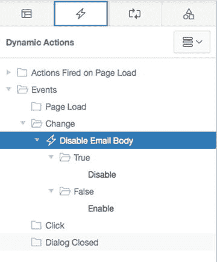

图 16-8. 查看动态操作选项卡

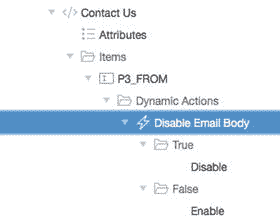

图 16-7. 动态操作在渲染树中的显示方式

无论是在渲染树还是动态操作选项卡中，单击 `Disable Email Body` 动态操作进行编辑。

在如图 16-9 所示的属性编辑器的 `When` 部分，将 `Event` 改为 `Key Release`，然后单击 `Save`。

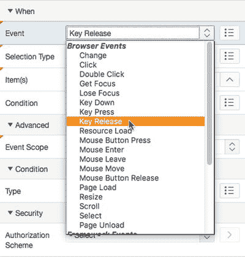

图 16-9. 指定 `Key Release` 作为事件

要测试此更改，请再次运行第 3 页。页面打开后如图 16-10 所示。开始在 `From` 项目中输入地址。一旦输入任何值，`Body` 项目即变为启用状态，如图 16-11 所示。相反，当您从 `From` 项目中删除所有内容时，`Body` 项目会再次变为禁用状态。

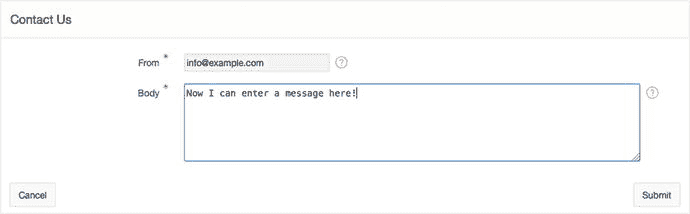

图 16-11. 在 `From` 字段中输入值后

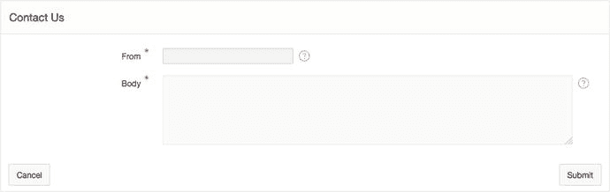

图 16-10. 在 `From` 字段中输入值前

## 使用页面级事件

动态操作让您能够完全控制触发事件和执行的操作。事件可以在多个层级触发，包括页面加载、卸载、调整大小时等。

在下一个练习中，您将使用 `Page Load` 事件弹出一个对话框，提醒用户在输入工单时尽可能详细。请按照以下步骤操作：

1.  编辑应用程序的第 2 页。因为此事件不与单个项目绑定，而是与页面级事件关联，所以您需要相应地创建动态操作。
2.  导航到树形窗格的 `Dynamic Actions` 选项卡。
3.  在树中右键单击 `Page Load` 节点，并从上下文菜单中选择 `Create Dynamic Action`，如图 16-12 所示。

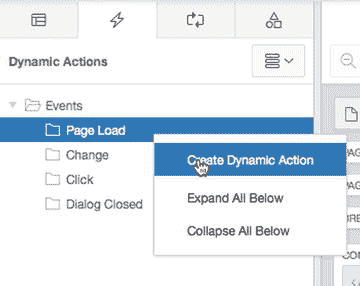

图 16-12. 在页面级创建动态操作

4.  在属性编辑器中，为 `Name` 输入 `Alert User`。
5.  在动态操作树的 `True` 节点下，单击 `Show` 操作（以红色突出显示）以编辑其属性。
6.  为 `Action` 选择 `Alert`，并为 `Text` 输入 `"请输入问题详情时，请务必尽可能完整。"`，如图 16-13 所示。

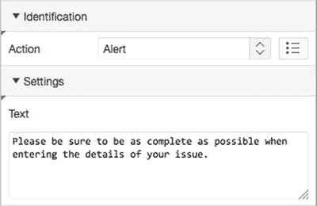

图 16-13. 为动态操作设置 `Action` 和 `Text`

7.  `Save` 并 `Run` 该页面。

现在运行第 2 页，每次加载页面时都会生成一个弹出窗口。图 16-14 显示了在 Mac OS X 上使用 Chrome 浏览器时看到的弹出窗口。

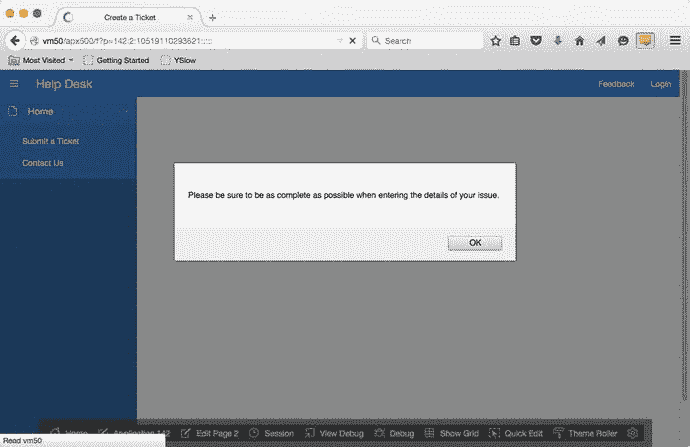

图 16-14. 提醒用户

注意

APEX 中可用的 `Alert` 和 `Confirmation` 操作都利用了最终用户所用浏览器提供的原生对话框。您无法控制这些对话框的外观，而且每个浏览器渲染它们的方式可能不同。如果您需要控制对话框的外观，可能需要考虑使用内置的 APEX 模态对话框，或基于 jQuery 编写自己的对话框。

## 具有多个触发元素的动态操作

动态操作还为您提供了定义多个触发元素的机会。使用此方法，您只需创建一个动态操作即可捕获多个页面项的事件。

您的公共工单录入页面包含多个不应留空的页面项。但是，您的 APEX 验证在用户提交页面之前不会触发。在此练习中，您将创建一个动态操作，当您在表单中导航时检查这些页面项的值是否为空。如果值为空，则使用 `background` 样式元素将项目的背景色设置为粉红色。如果不为空，则将项目的背景设置回白色。请按照以下步骤操作：

1.  编辑应用程序的第 2 页。
2.  导航到树形窗格的 `Dynamic Actions` 选项卡。
3.  在树中右键单击 `Events` 节点，并从上下文菜单中选择 `Create Dynamic Action`。
4.  在属性编辑器中，为 `Name` 输入 `Highlight Null Values`。
5.  将 `Event` 设置为 `Lose Focus`，将 `Selection Type` 设置为 `Item(s)`，并在 `Items` 字段中输入以下内容，如图 16-15 所示：

    ```
    P2_SUBJECT,P2_DESCR,P2_CREATED_BY
    ```

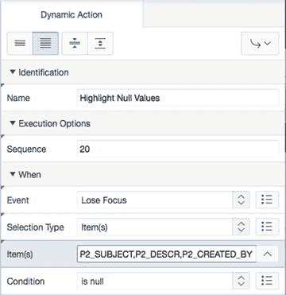

图 16-15. 创建具有多个触发元素的动态操作

6.  将 `Condition` 设置为 `is null`。
7.  在动态操作树的 `True` 节点下，单击 `Show` 操作（以红色突出显示）以编辑其属性。
8.  将 `Action` 设置为 `Set Style`。
9.  在 `Settings` 部分，为 `Style Name` 输入 `background`，为 `Value` 输入 `pink`。
10. 在 `Affected Elements` 部分，将 `Selection Type` 设置为 `Triggering Element`。
11. 将 `Fire On Page Load` 设置为 `No`。
12. 在树形窗格的 `Dynamic Actions` 选项卡中，右键单击 `Highlight Null values` 动态操作的 `False` 节点，然后选择 `Create FALSE action`。
13. 将 `Action` 设置为 `Set Style`。
14. 在 `Settings` 部分，为 `Style Name` 输入 `background`，为 `Value` 输入 `white`。
15. 在 `Affected Elements` 部分，将 `Selection Type` 设置为 `Triggering Element`。
16. 将 `Fire On Page Load` 设置为 `No`。
17. `Save` 并 `Run` 该页面。

通过输入以逗号分隔的页面项列表，您指示 `Lose Focus` 事件应在用户从这些项目中的任何一个移开时触发。当动态操作触发时，它会检查该项目是否为空，并将其设置为适当的颜色。动态操作通过引用受影响元素的触发元素来知道要设置哪个项目的背景颜色。

运行帮助台应用程序的第 2 页，并依次跳过每个字段，全部留空。您应该注意到，当您离开一个空白字段时，它立即变成粉红色。如果您返回并在粉红色字段中输入文本，然后移开，背景将被设置为白色。

注意

根据您使用的浏览器，您可能会看到在关闭弹出消息后，`Subject` 字段变成粉红色。这与某些浏览器赋予 JavaScript 事件的优先级顺序有关。某些浏览器在触发 `PageLoad` 事件之前将光标置于初始页面项中。一旦 `PageLoad` 事件触发，`Subject` 字段失去焦点，`LoseFocus` 事件就会触发。当您在一个页面上有多个动态操作时（您经常会这样做），您需要确保它们不会对彼此产生不利影响。


## 使用 PL/SQL 实现动态操作

动态操作被设计为一个可扩展的框架，赋予开发者完全的控制权，以编写那些在纯声明式环境中可能不可用的复杂操作。本着提升用户界面可用性的精神，你应该帮助用户遵循应用程序的业务规则，同时避免给他们带来不必要的工作。在这个练习中，你将利用 `P2_CREATED_BY` 项需要以大写输入的要求，并使用 SQL 和 PL/SQL 创建一个动态操作，将用户输入的任何内容都转换为大写。步骤如下：

1.  编辑应用程序的第 2 页。
2.  在树形面板中，导航到“页面呈现”选项卡。
3.  右键单击 `P2_CREATED_BY` 项，并从上下文菜单中选择“创建动态操作”。
4.  在“名称”中输入 `Change Case to Upper`。
5.  将“事件”设置为“失去焦点”，将“条件”设置为“不为空”。
6.  在动态操作树的“真”节点下，单击“显示”操作（以红色突出显示）以编辑其属性。
7.  将“操作”设置为“设置值”，在“设置”部分，为“设置类型”选择“PL/SQL 表达式”。
8.  在“PL/SQL 表达式”中输入 `UPPER(:P2_CREATED_BY)`，在“要提交的页面项”中输入 `P2_CREATED_BY`。
9.  在“受影响元素”部分，将“选择类型”设置为“触发元素”。
10. 将“页面加载时触发”设置为“否”。参见图 16-16。

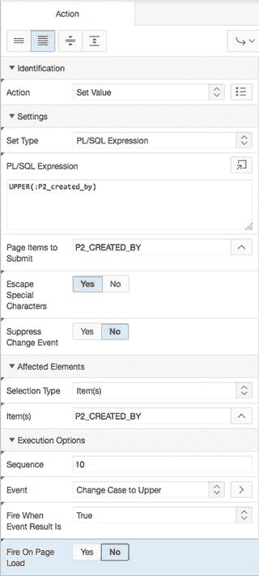

图 16-16. 使用 PL/SQL 表达式作为动态操作的主体

11. 保存并运行该页面。

这里，你使用 PL/SQL `UPPER` 表达式来获取用户输入并将其转换为大写。你通过绑定变量 `:P2_CREATED_BY` 来引用用户输入的值。然而，由于用户输入到 Web 浏览器的值尚未提交到 APEX，该值当前不在会话状态中。这就是为什么你需要将其包含在要提交的页面项列表中。如果你需要引用多个用户输入值，必须将它们全部以逗号分隔的列表形式输入。

现在，当运行第 2 页时，在“创建者”字段中输入的任何文本都会在用户离开该字段时被转换为大写。

> **注意**
>
> 使用 SQL 或 PL/SQL 作为条件或主体的动态操作，实际上会回调数据库服务器来运行相关代码。根据代码的权重和复杂性，这可能会引入性能问题。请将 SQL 和 PL/SQL 的使用保留给那些需要与数据库交互以检索页面内无法直接获取数据的操作。

## 使用 JavaScript 实现动态操作

除了 PL/SQL，你还可以在动态操作中使用 JavaScript。在这个练习中，你将使用 JavaScript 来确定你在第 210 页编辑的工单的屏幕状态。如果用户将状态设置为 `CLOSED`，动态操作将自动把 `关闭日期` 设置为今天的日期：

1.  编辑应用程序的第 210 页。
2.  在树形面板中，导航到“动态操作”选项卡。
3.  通过在树中右键单击“事件”节点并从上下文菜单中选择“创建动态操作”来创建一个新的动态操作。
4.  在“名称”中输入 `AutoFill Closed_On Date`。
5.  确保“事件”设置为“更改”，将“选择类型”设置为“项”，并在“项”中输入 `P210_STATUS_ID`。
6.  将“条件”设置为“JavaScript 表达式”。
7.  找到并打开文件 `ch16_javascript.txt`。该文件可以在你解压本书相关文件的位置找到。

检查用作条件主体的 JavaScript 字符串。起初这可能看起来很晦涩，但分解开来，它相当直接。让我们分段来看：

```
this.triggeringElement.options[this.triggeringElement.selectedIndex].text == 'CLOSED'
```

关键字 `this` 引用最初启动事件链的 JavaScript 事件，`triggeringElement` 引用页面上处于事件根源的项。因此，在本例中，`this.triggeringElement` 指的是 `P210_STATUS_ID`。

这里需要引入一些开发者知识。作为开发者，你知道 `P210_STATUS_ID` 是一个选择列表，该列表有一个或多个用户可以选择的值。在 HTML 中，这些值被称为选项。

由于你以声明方式定义了 `P210_STATUS_ID` 选择列表的方式，一次只能选择一个选项。你可以使用 JavaScript 的 `this.triggeringElement.selectedIndex` 来访问当前在页面上选中的选项。方括号使用该索引来引用 `P210_STATUS_ID` 选择列表中选中的选项。

尽管你可以引用选中选项的 `value`，但那只会给你所选状态的 ID。然后你必须再往返数据库一次来查找文本状态。相反，你可以使用 `.text` JavaScript 方法来获取选择列表向最终用户显示的文本，看看他们选择了什么。

一旦你获取到该文本，就可以将其与你寻找的值 `CLOSED` 进行比较。

8.  将文件内容复制到“值”中，如图 16-17 所示，然后单击“下一步”。

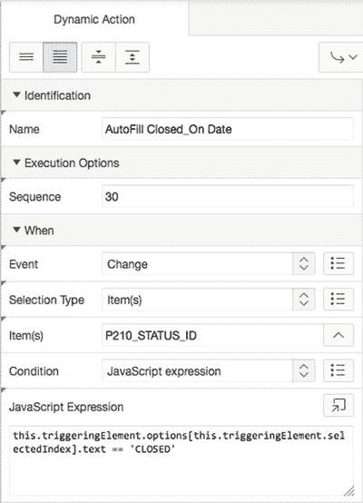

图 16-17. 为动态操作的条件文本使用 JavaScript

9.  在动态操作树的“真”节点下，单击“显示”操作（以红色突出显示）以编辑其属性。
10. 将“操作”设置为“设置值”，将“设置类型”设置为“PL/SQL 表达式”，并在“PL/SQL 表达式”中输入 `SYSDATE`。
11. 在“受影响元素”部分，将“选择类型”设置为“项”，并将“项”设置为 `P210_CLOSED_ON`。
12. 确保“页面加载时触发”设置为“否”。
13. 虽然你希望在选择状态为 `CLOSED` 时设置 `CLOSED_ON` 日期，但如果你选择除 `CLOSED` 外的任何状态，你希望清除当前在 `CLOSED_ON` 日期中输入的任何内容。因此，使用动态操作的“假”操作来实现这一点。
14. 在树形面板的“动态操作”选项卡中，右键单击“自动填充 Closed_On_Date 动态操作”的“假”节点，然后选择“创建 FALSE 操作”。
15. 将“假操作”设置为“设置值”。
16. 将“设置类型”设置为“PL/SQL 表达式”，并在“PL/SQL 表达式”中输入 `NULL`。虽然 `P210_STATUS_ID` 触发动态操作，但受影响元素是 `P210_CLOSED_ON`。
17. 将“选择类型”设置为“项”，并将“项”设置为 `P210_CLOSED_ON`。
18. 确保“页面加载时触发”设置为“否”。
19. 保存并运行你的应用程序。

运行你的应用程序，并使用第 210 页编辑任意工单。将状态更改为 `CLOSED`，然后再改回任何其他状态。你将看到 `关闭日期` 的值会根据你为选择列表选择的值进行设置和清除。

## 总结

动态操作用途广泛且极其灵活。但是，你必须确保同一页面上的多个动态操作不会相互干扰。此外，由于动态操作作为 JavaScript 在浏览器中运行，应尽可能多地以声明方式或使用 JavaScript 来完成，尽量避免使用 SQL 或 PL/SQL。这样可以减少对数据库服务器的调用次数，并避免潜在的性能瓶颈。

为了实现更复杂的结果，你很可能不可避免地需要学习至少一点 JavaScript。JavaScript 语法不难学，它可以作为 Web 应用程序开发者技能中有用的补充。


