# 17. 页面设计器演练与参考

在 `APEX` 5.0 之前的版本中，影响工作效率的一个挑战是：在修改任何属性之前，需要先深入到要编辑的具体项中。这意味着需要学习这些项在 `树形视图`、上下文菜单和实际编辑屏幕中的位置。同时也意味着，在页面上编辑多个项目可能相当繁琐。

`APEX` 5.0 彻底重新设计了构建和编辑页面的流程。作为 `APEX` 4.0 一部分引入的、大家熟悉的 `树形视图` 已被弃用，取而代之的是新的 `页面设计器`。你不再需要深入到单独的页面去编辑各个项目——现在一切都在一个页面上完成。

虽然这可能意味着生产力的巨大飞跃，但起初可能会让人望而生畏，特别是对于我们这些已经花费大量时间熟悉 `APEX` 4.0 方法的人来说。

本节将带你逐个部分地了解新的 `页面设计器`，并介绍本书中用来指代其各个部分和功能的术语。如果你试图记住某个功能的位置，或者想知道某个特定按钮或项目的作用，这里也是一个很好的参考地方。

## 页面设计器概述

虽然新的 `页面设计器` 看起来与之前 `APEX` 版本的处理方式大相径庭，但它实际上是一个经过验证的设计。只需想想 `Visual Studio`、`Eclipse`、`NetBeans` 以及市场上众多的其他 `IDE` 即可。它们都遵循非常相似的设计模式，新的 `APEX 5.0` `页面设计器` 正是以此为模型设计的。

图 A-1 展示了正在编辑 `示例数据库应用` 第 1 页的 `页面设计器`。

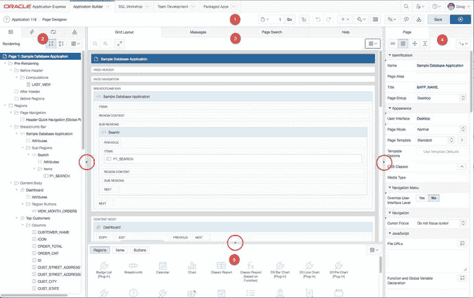
图 A-1. `APEX 5.0` `页面设计器`

`页面设计器` 被划分为五个主要区域，如图 A-1 中的数字所示：

-   `页面设计器工具栏` – 位于 `页面设计器` 顶部，用于访问页面级别的活动。
-   `树形窗格` – 显示一组选项卡，允许访问 `渲染`、`动态操作`、`处理` 和 `共享组件`。
-   `中央窗格` – 提供对布局、消息、页面级搜索和上下文相关帮助的访问。
-   `属性编辑器` – 允许编辑页面上所选项的属性。
-   `组件库` – 提供对 `APEX` 中可用的不同区域、项和按钮类型的访问。

你可能会注意到的一点是，在笔记本电脑等较小的屏幕上，界面可能看起来相当拥挤。你可以通过点击并拖动各区域之间的分隔条来调整各区域的大小，并且可以通过点击图 A-1 中指示的小三角图标来切换区域的可见性。不过，如果你像我一样，可能会希望在有更多空间的显示器上完成大部分工作，以便将窗格拉伸到更舒适、可读性更好的大小。

现在，让我们更深入地探索五个主要部分。

## 页面设计器工具栏

图 A-2 展示了 `页面设计器` 工具栏，它旨在让你能够访问多个页面级别的活动。

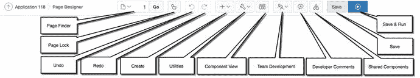
图 A-2. `页面设计器` 工具栏

在左侧，你会看到 `APEX` 面包屑导航，告诉你当前正在编辑哪个应用，并且你当前位于 `页面设计器`。从左到右依次是各个控件。将鼠标悬停在每个控件上会显示一个工具提示，其中包含描述，在某些情况下还包含有关该控件的更多信息。

## 页面查找器

单击下拉菜单会打开“页面查找器”对话框，允许您选择要编辑的页面。您也可以直接输入页码并单击 `Go` 按钮导航到该页。如果您尝试离开当前页面，且存在任何未保存的更改，**APEX** 将询问您是否要放弃这些更改并继续。

## 页面锁定

此处显示的挂锁图标指示当前页面的锁定状态。如果页面已解锁，挂锁图标显示为打开状态；如果已锁定，挂锁图标将显示为关闭状态。单击该图标将切换锁定状态并将当前用户指定为该锁的所有者。锁定页面时，系统将要求您提供锁定注释，该注释将显示给访问该页面的其他用户。

## 撤销

这会回滚对一个或多个项目的最近一次更改。将鼠标悬停在图标上将指示将被回滚的更改。

## 重做

这会重新应用对一个或多个项目的最近一次更改。将鼠标悬停在图标上将指示将被重新应用的更改。

## 创建

此下拉菜单提供对多种 **APEX** 对象的创建访问权限。**Create** 菜单提供以下选项：

### 页面

启动“创建页面”向导。

### 页面副本

启动“复制页面”向导。

### 表单区域

启动“创建表单”向导。

### 报表区域

启动“创建报表区域”向导。

### 页面组件

打开一个帮助对话框，概述在 **APEX 5.0** 中创建页面组件的方式。

### 共享组件

启动“创建应用程序组件”向导。

### 页面组

导航到 **APEX** 中的“创建页面组”页面。

### 开发者注释

打开“开发者注释”对话框。在这里，您可以针对当前页面或一组页面输入和查看注释。

### 团队开发

提供一个子菜单，允许在团队开发工具中创建功能、错误和待办事项。

## 实用工具

此下拉菜单提供对多个页面相关实用工具的访问。**Utilities** 菜单提供以下选项：

### 删除页面

允许您删除当前页面。选择此选项后显示的对话框允许您确认删除，并决定是否要级联删除到任何相关的列表条目，同时显示您将删除的页面内容。

### 顾问

打开一个新浏览器窗口，显示 **APEX Advisor** 并选择当前页面进行处理。从这里，您可以对应用程序或特定页面执行检查，包括查找错误、安全问题、质量保证问题和其他最佳实践。

### 缓存

导航到当前页面的缓存仪表板。从这里您可以管理当前页面的页面和区域缓存。

### 属性字典

导航到当前页面的属性字典仪表板。从这里您可以从属性字典更新当前页面，或使用当前页面更新属性字典。

### 历史记录

导航到针对当前页面和应用程序所做的历史更改报告。该报告显示所做的更改以及进行更改的开发者。

### 导出

启动“导出页面”向导，允许在进行更改之前将应用程序的单个页面导出为备份，或在实例之间传输。

### 跨页面实用工具

导航到一组可在多个页面中使用的页面。

### 应用程序实用工具

导航到一组应用程序级别的实用工具。

### 页面组

导航到“页面组”管理和分配页面。

### 升级应用程序

导航到“应用程序升级”报告和向导。在这里，您可以查看应用程序的哪些元素可能从升级到 **APEX 5.0** 提供的最新功能中受益。

## 组件视图

从“页面设计器视图”切换到“组件视图”，该视图自早期 **APEX** 版本起就已可用。

## 团队开发

此下拉菜单提供对“团队开发”模块功能的访问权限，并且仅当工作区内启用了团队开发时才会显示。**Team Development** 菜单提供以下选项：

### 功能

导航到“团队开发”模块并显示一个报告，该报告经过筛选以显示当前页面的未完成功能。

### 待办事项

导航到“团队开发”模块并显示一个报告，该报告经过筛选以显示当前页面的未完成待办事项。

### 错误

导航到“团队开发”模块并显示一个报告，该报告经过筛选以显示当前页面的未完成错误。

### 反馈

导航到“团队开发”模块并显示一个报告，该报告经过筛选以显示当前页面的未处理反馈。

## 开发者注释

启动一个对话框，可以在其中针对当前页面创建开发者注释、错误或待办事项。

## 共享组件

导航到 **APEX** 的“共享组件”页面，提供对所有应用程序级别共享组件的访问权限。

## 保存

保存当前页面上任何未保存的更改。

## 保存并运行

保存当前页面上任何未保存的更改，然后运行该页面。

## 树形窗格

页面设计器左侧的树形窗格，通过四个选项卡——**渲染**、**动态操作**、**处理**和**页面共享组件**，提供了对当前页面所有组件的访问。图 A-3 展示了树形窗格的顶部区域并指出了其通用功能。

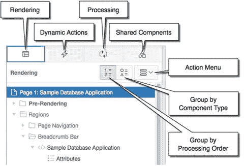

图 A-3.
页面设计器的树形窗格

点击顶部的四个选项卡之一，将根据上下文改变窗格主体中显示的树形数据：

*   `Rendering` 选项卡将树形数据更改为显示与页面渲染相关的组件，包括区域、项目、按钮、逻辑等。
*   `Dynamic Actions` 选项卡将树形数据更改为显示当前页面上定义的所有动态操作，无论它们如何触发。
*   `Processing` 选项卡将树形数据更改为显示与页面处理相关的所有应用逻辑，包括计算、验证、过程和分支。
*   `Page Shared Components` 选项卡将树形数据更改为显示与此页面关联的应用级共享组件。

注意

在 `Rendering` 和 `Dynamic Actions` 选项卡之间存在一些重叠，因为 `Rendering` 选项卡会显示任何触发元素是已渲染组件的动态操作。请不要因此误以为它们是单独的动态操作。它们是相同的，只是为了方便而在两个位置显示。

当 `Rendering` 或 `Processing` 选项卡处于活动状态时，会显示两个额外的按钮（如图 A-3 所示），允许您按处理顺序分组（默认）或按组件类型分组。

`Dynamic Action` 和 `Page Shared Component` 选项卡分别按事件和组件类型分组，然后按用户分配的顺序排序。

最后一个控件是操作菜单，它是一个上下文相关的菜单，镜像了您在树中右键单击组件时看到的上下文菜单。根据当前哪个选项卡处于活动状态以及在树中选择了哪个节点，两种菜单类型都提供了多种功能。

例如，如果您当前位于 `Rendering` 选项卡并在树中选择了一个区域，单击操作菜单或在树中右键单击区域名称将生成一个可用选项的上下文菜单。

将鼠标悬停在树中的任何节点上，无论您位于哪个选项卡，都会显示一个包含该组件基本信息的工具提示。

您还可以使用树通过拖放来重新排序组件。重新排序表单中的项目就像单击并将项目拖动到您想要的顺序一样简单。在拖动项目时，树中会出现一个黄色的辅助节点，指示合法的放置位置。但请注意，这只会更改它们的顺序，而不会影响任何项目的布局属性。

## 中央窗格

中央窗格被分为四个单独的选项卡，如图 A-4 所示：**网格布局**、**消息**、**页面搜索**和**帮助**。每个选项卡都值得详细解释。

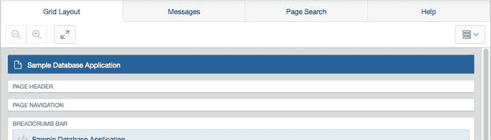

图 A-4.
中央窗格的选项卡

### 网格布局

如图 A-5 所示，`Grid Layout` 选项卡提供了将在页面上显示的组件的可视化表示。虽然这绝不是最终渲染的完整 WYSIWYG 表示，但它在帮助开发人员理解组件将如何在屏幕上呈现方面做得非常好。

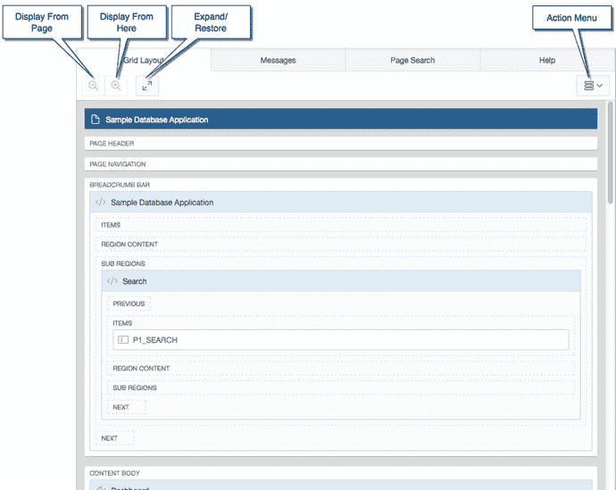

图 A-5.
网格布局和相关控件

如前所述，您可以使用区域分隔条来调整屏幕上每个面板所占的空间量，或者您可以通过单击分隔条上的箭头来完全隐藏一个区域。然而，有时您可能希望将 `Grid Layout` 扩展到占据整个画布。单击 `Expand/Restore` 按钮将最初展开然后恢复网格布局。

或者，在特别大或繁忙的页面上，您可能希望专注于特定区域的布局。在 `Grid Layout` 中单击某个区域，然后单击 `Display From Here` 按钮，将隐藏选定区域之外页面上的所有其他区域。单击 `Display From Page` 按钮将把 `Grid Layout` 恢复为其默认视图，显示整个页面的可见组件。

可以通过拖放移动页面上的可见组件。也可以通过从图库中将新组件拖放到网格布局画布上来将它们添加到页面（参见图 A-6）。在拖动项目定位时，可以放置对象的区域将具有黄色背景。当您将鼠标悬停在放置区域上时，黄色背景内会出现一个灰色框（如图 A-6 所示），指示对象将被放置的位置。

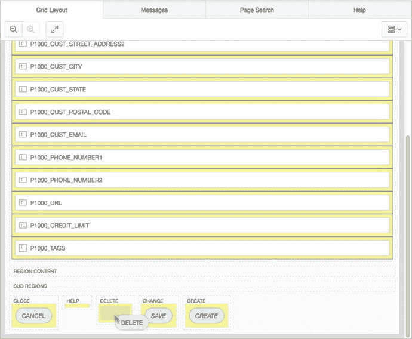

图 A-6.
使用拖放放置按钮

与树形窗格一样，`Grid Layout` 包含一个操作菜单和所有组件可用的上下文菜单。通过在网格布局中选择组件并右键单击或单击操作菜单，您将看到该组件的可用操作。

在 `Grid Layout` 的操作菜单和上下文菜单中有一组选项控制网格布局中显示的内容：

*   `Hide Empty Legacy Positions`：当选择此选项时（默认），空的模板位置（被认为是“旧版的”）将从网格布局中隐藏。旧版位置被认为是那些与较旧主题相关的位置，虽然未被弃用，但不鼓励继续使用。即使选择了此选项，如果位置包含组件，它仍会显示在网格布局中。
*   `Hide Empty Positions`：当选择此选项时，任何不包含组件的位置将被隐藏。这允许开发人员仅关注那些当前包含项目的位置。
*   `Hide Global Page Components`：当选择此选项时（默认），网格布局会隐藏放置在当前界面全局页面上的任何组件。这允许开发人员仅关注在当前页面上定义的组件。
*   `Hide Buttons`：当选择此选项时，所有被认为是按钮容器的区域以及任何已分配的按钮都将被隐藏。这允许开发人员专注于区域内项目的放置。
*   `Hide Items`：当选择此选项时，所有被认为是项目容器的区域以及任何已分配的项目都将被隐藏。这允许开发人员专注于区域内按钮的放置。

同样，与树形窗格类似，`Grid Layout` 中也提供了工具提示，提供有关您鼠标悬停组件的基本信息。

注意

隐藏的项目不会显示在网格布局中，但会出现在树形窗格的 `Rendering` 部分中。

### 消息

在通过放置组件并编辑其属性来开发页面时，您不可避免地会看到某个组件以红色或黄色高亮显示，并且“消息”选项卡会显示徽章，指示可用消息的数量，如图 A-7 所示。

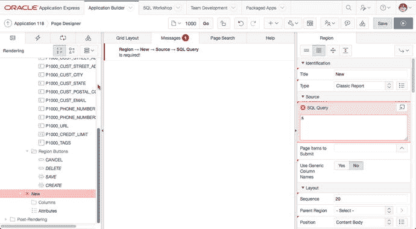
*图 A-7. “消息”选项卡显示消息及其关联的组件和属性*

消息分为两种类型：

-   **错误**：以红色指示，这些消息必须在保存页面前得到处理。点击“消息”选项卡中的错误文本，将在属性窗格中显示与该错误关联的属性。
-   **警告**：以黄色指示，这些消息用于提示您潜在的问题。您仍可以在未处理警告的情况下保存页面，但页面可能无法正常运行，直到警告被完全解决。点击“消息”选项卡中的警告文本，将在属性窗格中显示与该警告关联的属性。

### 页面搜索

图 A-8 展示了“页面搜索”选项卡，它允许您搜索所有页面组件的元数据。

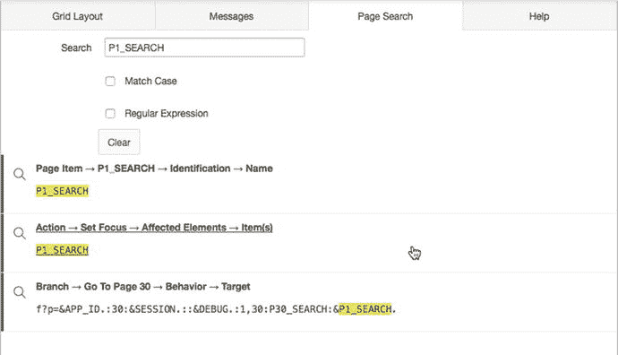
*图 A-8. 显示搜索结果的“页面搜索”选项卡*

在搜索字段中输入任意文本并按下 `回车键`，将在应用程序的元数据中搜索输入的搜索词，并显示找到的所有匹配项，同时高亮显示您的搜索词。点击搜索到的任何项目，将导航到页面设计器中的对应组件。

使用“区分大小写”选项将要求搜索与输入的搜索词完全匹配大小写。使用“正则表达式”选项会将搜索词视为正则表达式字符串处理。

“清除”按钮将清除整个“页面搜索”表单以及其下方列出的所有结果。

### 帮助

属性编辑器中的每个属性都有相关的帮助信息可供开发人员使用。要查看帮助，请在树状窗格或网格布局中选择一个组件，然后选择一个属性。此时，切换到“帮助”选项卡将显示所选属性的帮助信息。图 A-9 显示了 `P1_SEARCH` 文本字段的 `子类型` 属性的可用帮助文本。

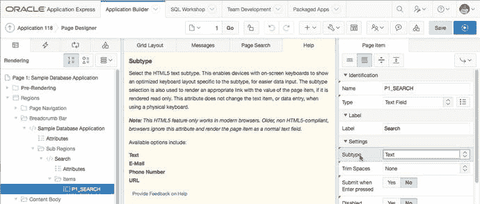
*图 A-9. 查看 `P1_SEARCH` 子类型属性的帮助*

这种上下文相关的帮助将帮助开发人员快速掌握 APEX 5.0 中引入的许多新属性。

每个帮助部分的底部都有一个“提供关于帮助的反馈”链接。点击该链接将打开一个新的浏览器窗口，并导航到一个 APEX 应用程序，允许您就当前上下文中的属性帮助文本提供反馈。Oracle APEX 开发团队将利用此反馈在未来的版本中优化帮助文本。

### 属性编辑器

页面设计器右侧的“属性编辑器”显示了在树状窗格或中央窗格中当前选定的组件的所有属性。图 A-10 显示了“属性编辑器”窗格并概述了相关控件。

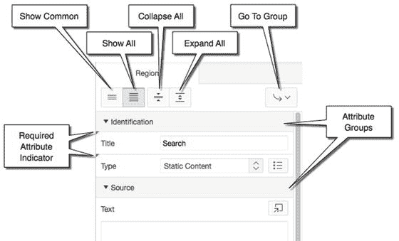
*图 A-10. 页面设计器的“属性编辑器”窗格*

当您在树状窗格或网格布局中选择组件时，“属性编辑器”将更新以显示当前选定组件的属性。属性按“属性组”组织，可以通过点击组名旁边的三角形图标进行展开和折叠。“必需属性指示器”在属性标签附近的左上角以红色三角形的形式显示。

“属性编辑器”中显示的信息量和类型可以通过窗格顶部的控件进行控制：

-   **显示常用**：当只选择一个组件时，选择此选项将仅显示值与默认值不同的属性。如果选择了多个组件，此选项还将显示所选组件间被共同编辑过的属性。
-   **显示全部**：当只选择一个组件时，选择此选项将显示所选组件的所有属性。如果选择了多个组件，此选项还将显示所选组件的所有公共属性。
-   **全部折叠**：折叠所有“属性组”，仅显示标题。
-   **全部展开**：展开所有“属性组”，以便显示所有适用的属性（由“显示常用”和“显示全部”控制）。
-   **转到组**：将焦点置于从下拉菜单中选择的组的第一个属性上。

当您编辑 APEX 组件的各种属性时，您可能会对大部分呈现的控件感到熟悉和得心应手。在接下来的章节中，我们将介绍一些功能可能不会立即明了的控件类型。

#### 快速选择

“快速选择”控件出现在属性选择列表的左侧，如图 A-11 所示。点击“快速选择”图标将生成一个简短的列表，其中包含被认为是完整选择列表中“最常用”的选项。

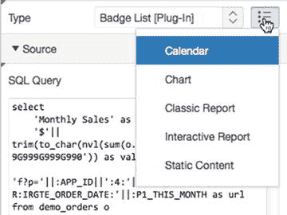
*图 A-11. 为选择列表点击“快速选择”图标*

#### 转到

“转到”控件会在一个属性引用页面上另一个组件时出现。通过点击图 A-12 中所示的图标，页面设计器的焦点将设置到该属性所指示的组件。这提供了一种快速导航到被引用组件的方法。

*图 A-12. 与文本字段的“区域”属性关联的“转到”图标*

#### 选项对话框按钮

有许多属性需要更复杂的弹出对话框来设置其值。在这些情况下，APEX 提供了一个“选项对话框按钮”，如图 A-13 中的“模板选项”和“目标页面”所示。点击包含文本的灰色框会生成一个对话框，为相关属性提供选项。图 A-14 是按钮的“模板选项”对话框示例。

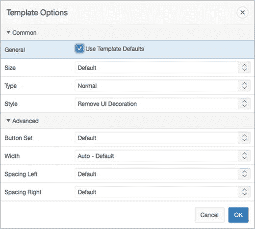
*图 A-14. 按钮的“模板选项”对话框示例*

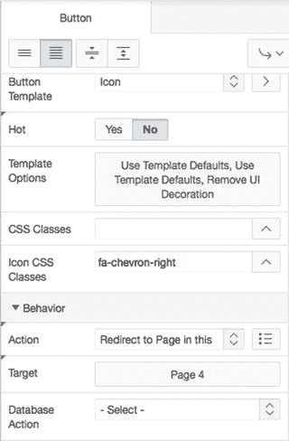
*图 A-13. 带有“选项对话框按钮”的“模板选项”和“目标”属性*

## 代码编辑器

对于需要 SQL、PL/SQL 或大量静态文本的属性，APEX 提供了代码编辑器控件。如图 A-15 所示，该控件在一个相对较小的文本区域中显示代码，但提供了一个按钮可将文本区域展开为完整的代码编辑器，如图 A-16 所示。

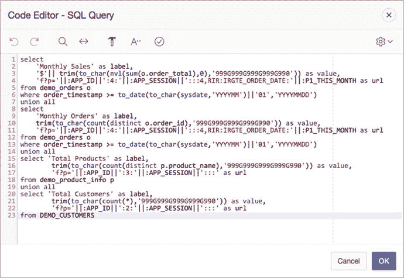
*图 A-16. 代码编辑器对话框示例*

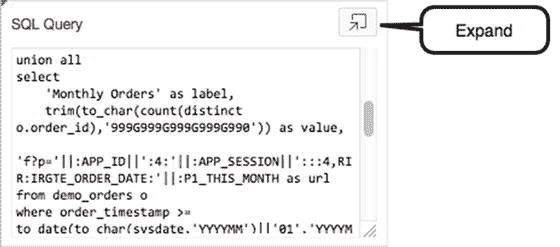
*图 A-15. 报表的 SQL 查询属性，右上角显示代码编辑器按钮*

代码编辑器在对话框顶部包含一个工具栏。图 A-17 展示了该工具栏并说明了每个图标的功能。

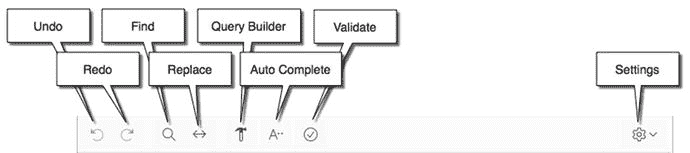
*图 A-17. 带图标说明的代码编辑器工具栏*

大多数图标都相当直观，但为完整起见，其功能列举如下：

*   `Undo`: 撤销对代码编辑器对话框中文本的最后一组更改。
*   `Redo`: 重新应用使用`Undo`按钮撤销的最后一次更改。
*   `Find`: 在工具栏下方显示一个区域，允许开发人员搜索代码编辑器对话框的内容。搜索选项包括`Match Case`（区分大小写）和`Regular Expression`（正则表达式）。
*   `Replace`: 在工具栏下方显示一个区域，允许开发人员搜索代码编辑器的内容，并用另一个字符串替换找到的搜索字符串。搜索选项包括`Match Case`和`Regular Expression`。替换选项包括`Replace`（替换）、`Replace All`（全部替换）和`Skip`（跳过）。
*   `Query Builder`: 打开一个新窗口，其中包含拖放查询生成器（参见第 4 章）。它仅对需要 SQL 查询的代码编辑器对话框显示。
*   `Auto Complete`: 在编辑代码编辑器中的文本时提供上下文相关的自动完成功能。在编辑 SQL 或 PL/SQL 时，`Auto Complete`为当前“解析为”模式中的数据库对象以及 Oracle 定义的函数和保留字提供自动补全。在编辑 HTML 文本时，`Auto Complete`提供 HTML 标签方面的辅助。
*   `Validate`: 在编辑 SQL 或 PL/SQL 时，`Validate`将解析提供的代码以查找语法错误。如果遇到语法错误，错误将通过错误消息在错误行之前的代码行内联指示。如果未发现错误，则在对话框顶部显示“验证成功”消息。
*   `Settings`: 提供一组特定于对话框的设置，这些设置将在每个特定用户的多个用户会话中被记住：
    *   `Use Plain Text Editor`: 从语法高亮编辑器切换到纯文本编辑器。
    *   `Tab Inserts Spaces`: 选中并按下`Tab`键时，编辑器将放置固定数量的空格而不是制表符。取消选中时，将使用制表符。
    *   `Tab Size`: 当启用上一个选项时，用于替换制表符的空格数。
    *   `Indent Size`: 为支持自动缩进的语言（如 JavaScript）设置自动缩进大小。
    *   `Themes`: 将多种不同视觉主题中的一种应用于代码编辑器。新主题在设置被确认且再次选择代码编辑器后才会可见。
    *   `Show Line Numbers`: 选中时，代码左侧将添加一个带行号的边栏。
    *   `Show Ruler`: 选中时，代码编辑器内会在第 80 个字符标记处出现一条虚线。

## 画廊

画廊窗格直接显示在中央窗格下方，提供了一个可用于在网格布局中构建页面的组件和控件面板。该窗格具有三种类型的组件，可通过左上角的按钮进行选择，如图 A-18 所示。

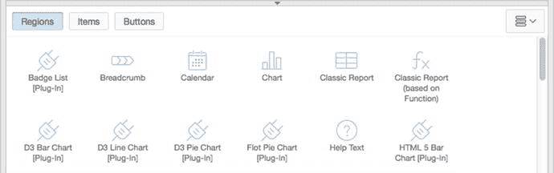
*图 A-18. 显示部分可用区域类型的画廊窗格*

默认情况下，仅显示当前用户界面支持的控件和组件。单击右上角的`操作菜单`，您可以选择显示不受支持的组件，使用这些组件需“自担风险”。其中一些组件被视为实验性的，并非在所有浏览器中都能工作。

每个组件都可以通过简单地拖放到适当区域来放置到网格布局中。将项目拖入位置时，黄色背景将指示可以放置对象的区域。当您将鼠标悬停在放置区域上时，黄色背景内会出现一个灰色框（参见图 A-6），指示对象将被放置的位置。

您也可以右键单击组件并使用上下文菜单来放置项目。“添加到”上下文菜单选项允许您使用页面结构的分层菜单表示来选择放置项目的位置。

## 键盘快捷键

新页面设计器的另一个好处是引入了一组用于执行常见任务的键盘快捷键。表 A-1 显示了 PC/Linux 和 Macintosh 系统的键盘快捷键。

*表 A-1. 页面设计器中可用键盘快捷键列表*

| 功能 | PC/Linux | Macintosh |
| --- | --- | --- |
| 保存 | Ctrl+Alt+S | Ctrl+Option+S |
| 保存并运行页面 | Ctrl+Alt+R | Ctrl+Option+R |
| 撤销 | Ctrl+Z | Ctrl+Z |
| 重做 | Ctrl+Y | Ctrl+Y |
| 转到渲染 | Alt+1 | Option+1 |
| 转到动态操作 | Alt+2 | Option+2 |
| 转到处理 | Alt+3 | Option+3 |
| 转到页面共享组件 | Alt+4 | Option+4 |
| 转到网格布局 | Alt+5 | Option+5 |
| 转到属性编辑器 | Alt+6 | Option+6 |
| 转到画廊区域 | Alt+7 | Option+7 |
| 转到画廊项 | Alt+8 | Option+8 |
| 转到画廊按钮 | Alt+9 | Option+9 |
| 从此处显示 | Ctrl+Alt+D | Ctrl+Option+D |
| 从此页面显示 | Ctrl+Alt+T | Ctrl+Option+T |
| 还原/展开 | Alt+F11 | Option+F11 |
| 切换隐藏空位置 | Ctrl+Alt+E | Ctrl+Option+E |
| 转到帮助 | Alt+F1 | Option+F1 |
| 转到消息 | Ctrl+F1 | Ctrl+F1 |
| 页面搜索 | Ctrl+Alt+F | Ctrl+Option+F |
| 键盘快捷键 | Alt+Shift+F1 | Option+Shift+F1 |

注意
某些平台（尤其是 Mac）可能已经存在键盘映射，可能会干扰本表中概述的组合键功能。如果任何功能未按预期工作，请检查操作系统级别是否存在任何冲突的快捷键。

## 总结

尽管关于新的页面设计器有很多需要学习的内容，但我相信在花些时间熟悉其布局和功能后，开发 APEX 应用程序将成为一项更加高效的事业。我强烈建议您在深入阅读本书的开发章节之前，花些时间熟悉本附录的内容。请记住，如果您以后遇到困难，随时可以回到本附录进行参考。

## 索引

A, B

APEX 2.2 (2006)
APEX 3.0 (2007)
APEX 3.1 (2008)
APEX 3.2 (2009)
APEX 4.0 (2010)
APEX 4.1 (2011)
APEX 4.2 (2012)
APEX 5.0

访问权限
声明式工具
未来
历史
模块
请参阅(`模块, APEX 5.0`)
页面设计器
PL/SQL 程序单元
快速应用开发工具与平台
SQL 开发人员
网页浏览器

工作区
应用程序
层级结构
开发人员
终端用户
实例管理员
逻辑构成
一对多模式
一对多用户
SaaS 模式、应用程序和工作区
工作区管理员
零到多个应用程序

APEX 应用程序导出
构建状态覆盖
调试
开发者注释
导出应用程序
页面导出选项
导出支持对象定义
导出翻译
文件格式
所有者覆盖
翻译
UNDO_RETENTION

APEX 日历创建
面包屑条目
拖放选项
页面向导
报表
补充信息
属性
表名指定
表所有者指定
标签页指定
工单活动变更
工单活动日历
查看/编辑链接属性

页面渲染
区域类型
APEX 图表创建
导航属性
页码、页面名称、区域名称属性
工单状态图表筛选
数据默认设置
名称和标签设置
选择列表项
Flash 和 HTML5 版本
查询
渲染选项卡

APEX 帮助
帮助文本区域
植入帮助文本

APEX 项
`APP_ALIAS`
`APP_ID`
`APP_PAGE_ID`
`APP_SESSION`
`APP_USER`
绑定变量
页面项与应用程序项

APEX URL 语法
应用程序捆绑与部署
组件标识
APEX 应用程序导出
请参阅(`APEX 应用程序导出`)

基于 APEX 的文件
外部文件
组
交互式报表订阅
数据库对象
请参阅(`数据库对象`)
私有交互式报表
公共交互式报表
导入
支持对象
构建选项定义
卸载
导出
主页
安装
消息页面
前提条件
脚本向导
替换
标签式定义屏幕
升级
验证

应用程序快速帐户

应用程序级属性
身份验证方法
全球化选项
标签页选项

应用程序向导

APEX 主页
面包屑条目
面包屑区域
应用程序构建器
上下文菜单
复制操作
目标页面
迁移
页面渲染层级
冗余区域
创建按钮
全局页面
应用程序页面列表
桌面导航
动态列表
维护屏幕
父列表条目
处理第二个列表条目
静态列表
目标定义
值列表
动态列表
静态列表
导航栏类型
应用程序构建器
条件图标
登录和注销按钮
设置
共享组件屏幕
公共页面
示例和打包应用程序

管理页面
仪表板
库主页
类型
空白应用程序
属性
请参阅(`应用程序级属性`)
创建过程
布局页面
登录提示
多个页面
名称选择
过程完成
生成页面
共享组件
主题选择
电子表格应用程序

静态内容区域
属性
内容主体区域
主页图标视图
页面设计器
报表视图
标题和文本

Websheet 应用程序
身份验证
授权方案

