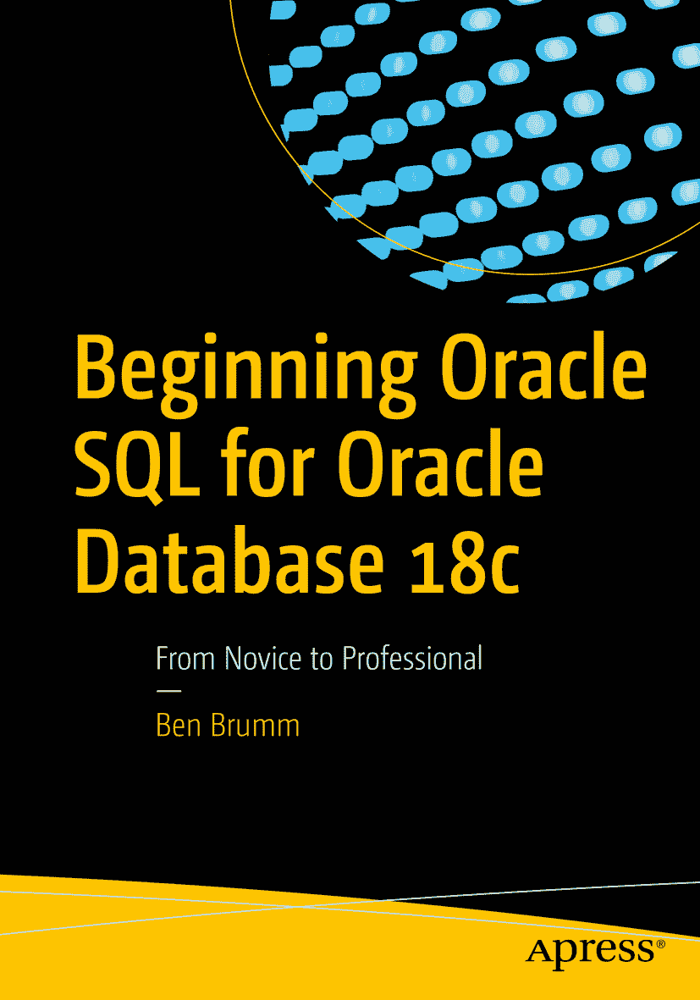

# Oracle Database 18c SQL 入门

ISBN 978-1-4842-4429-6
e-ISBN 978-1-4842-4430-2
[`doi.org/10.1007/978-1-4842-4430-2`](https://doi.org/10.1007/978-1-4842-4430-2)
© Ben Brumm 2019
本作品受版权保护。出版者保留所有权利，无论涉及材料的全部或部分，特别是翻译、转载、插图再利用、朗诵、广播、缩微胶片或其他任何物理方式进行的复制，以及信息存储与检索、电子改编、计算机软件，或目前已有或未来开发的类似或不同方法。本书中可能出现商标名称、标识和图像。我们并非在每次出现商标名称、标识或图像时都使用商标符号，而是仅以编辑方式并为了商标所有者的利益使用这些名称、标识和图像，无侵权意图。本书中使用的商品名称、商标、服务标识和类似术语，即使未明确标识，也不应被视为表达意见，即它们是否受专有权约束。尽管本书中的建议和信息在出版时被认为是真实和准确的，但作者、编辑或出版商均不对可能存在的任何错误或遗漏承担任何法律责任。出版商对本出版物所含材料不作任何明示或暗示的保证。本书通过 Springer Science+Business Media New York 在全球图书贸易中发行，地址：233 Spring Street, 6th Floor, New York, NY 10013。电话：1-800-SPRINGER，传真：(201) 348-4505，电子邮件：orders-ny@springer-sbm.com，或访问 www.springeronline.com。Apress Media, LLC 是一家在加利福尼亚州成立的有限责任公司，其唯一成员（所有者）是 Springer Science + Business Media Finance Inc (SSBM Finance Inc)。SSBM Finance Inc 是一家在特拉华州注册的公司。

## 前言

欢迎阅读《Oracle Database 18c SQL 入门》！感谢您选择本书。可以说您对学习 Oracle 数据库感兴趣，因为这正是本书的主题。为什么是 Oracle 数据库？为什么是这本书？

Oracle Database 是世界上最受欢迎的数据库管理系统之一。根据多个因素对数据库流行度进行排名的网站 `db-engines.com` 在 2018 年底的数据显示，Oracle 位居第一。它被许多大型组织使用，其主要竞争对手是微软的 SQL Server。学习 Oracle `SQL` 将使您在寻找任何使用 Oracle 数据库的公司职位时处于有利位置。

为什么是这本书？本书将帮助您开始在 Oracle 数据库的最新版本 18c 上学习 `SQL`。18c 版本由 Oracle 在 2017 年底宣布，并于 2018 年中后期发布给开发者社区。学习使用 Oracle 的最新版本对您的职业生涯将非常有帮助，因为当组织将其 Oracle 版本升级到 18c 时，您将知道如何使用它。

本书也面向初学者。您将从学习什么是数据库、如何安装所需工具以及 `SQL`（结构化查询语言）的所有命令开始，从而能够使用 Oracle 数据库。完全不需要数据库经验。如果您曾使用过其他数据库，如 `SQL Server` 或 `MySQL`，您可能会更容易理解这些概念，因为它们有一些共通之处。

## 您将学到什么

本书分为几个不同的部分和许多章节。以下是您将学习内容的概要。

