# 第一部分：环境设置

## 1. 什么是数据库？

软件的一个主要特性是它能让您以特定方式与数据进行交互。这可以是一个购物清单应用，让您在手机上添加购物物品；一个让您可以撰写和发布文章的网站；或者是一个存储客户信息的客户关系管理程序。

所有这些程序都让您能以某种方式查看信息、编辑信息，然后将其存储在某处。如果无法存储这些信息，软件的效用就会大打折扣。想象一个购物清单应用，但当您输入需要购买的物品后，应用却不保存，一旦关闭应用清单就会消失。这样的应用就没什么用了！

软件需要一个地方来存储数据。最常见的存储方式就是使用数据库。数据库是文件和信息的结构化定义，它使用户和软件能够高效地存储、检索和更新数据。

购物清单应用、文章发布网站、客户关系管理系统以及许多其他类型的软件都会使用数据库。存储在数据库中的数据以多种方式被软件使用，并允许用户在软件中查看、保存和编辑信息。

例如，一个购物清单应用可能会在数据库中存储以下信息：
*   购物清单上每个物品的名称（您需要从商店购买的物品）
*   物品类别的列表（例如，蔬菜、乳制品、调味品）
*   您想购买的每个物品的数量（例如，3 个苹果，2 杯面粉）

那么，除了存储信息，为什么还要使用数据库呢？

首先，它很高效。数据在数据库中的存储方式使得用户和软件易于读取数据、添加新数据、更新或删除现有数据。

数据库还允许您在不影响所有其他数据的情况下，对一小部分数据进行更新（如果需要）。例如，您可以向购物清单中添加一个新物品，而无需更改数据库中的每个其他物品。

使用数据库存储数据的一个考虑是，它们需要一个“数据库管理系统”。这是一种允许用户或应用程序与文件交互的软件。它使您可以轻松输入命令，而数据库管理系统则负责处理数据的更改及其中涉及的所有复杂性。另一个优势是能够处理多个用户查看或编辑数据的情况。

### 数据库的替代方案

数据库并不是存储数据的唯一方式。数据也可以直接存储在文件中。一个例子就是文本文件。如果您打开记事本并新建一个文档，输入一些文本并保存，那么一个文件就被保存到了您的计算机上。这个例子中没有创建数据库。文件只是保存到了您的计算机上。

将数据存储在文本文件中比使用数据库更简单，如果您是唯一处理该文件的人，这也没问题。

然而，当软件开始被多人使用或随着时间的推移变得庞大时，将数据存储在文件中可能会出现问题，例如确保不同用户的更改不会被覆盖、确保数据能够快速保存和检索，以及只更新文件的部分内容。如果使用数据库，这些问题都能得到解决。

我想解释几个与数据库相关的术语，以帮助您理解什么是数据库以及如何与之交互。

### 表

表是数据库中存储相关数据的逻辑结构。数据库中的大部分数据都存储在表内。数据库通常有多个表，我们将在本书中频繁提及表。

如果您之前使用过电子表格程序，例如 Microsoft Excel，那么可以将表想象成一个工作表。信息在表中的存储方式与在工作表中的存储方式类似。您有被划分为列的多行数据。


### 行

一行代表表中单条信息记录。例如，在客户关系管理系统中，一行可以代表一个客户，或者在杂货清单应用中代表一个产品。数据库中的一行类似于电子表格文件中的一行。纯粹主义者可能不赞同我这样类比，但这个比喻是有用的。

### 列

列是一种表示表中记录或行特定信息的方式。它是每一行的一个属性或值。

例如，客户的“名”可以是一个列，然后可以为各行记录一个值。客户的“姓”可以是另一个列，可以单独记录，并且很可能与每个客户的“名”不同。

在脑海中想象电子表格文件中的列可能会有所帮助。例如：

```
First Name     Last Name
Jacinda        Ardern
Malcolm        Turnbull
Theresa        May
```

在这个例子中，每一行代表一位总理。因此，这个表将是一个总理表。表中的每一行具体代表一位总理。然后，每一列描述了一个属性——比如名和姓——这些是你期望一位总理拥有的属性。

### 查询

你已经了解到数据存储在数据库中，并且可以被添加、更新或检索。软件通过数据库管理系统以几种不同的方式与这个数据库交互：

*   从数据库中检索数据
*   更改数据库中的值
*   向数据库添加一些新数据
*   从数据库中删除一些现有数据

这些类型的命令被称为查询，它们是使用某种特定类型代码的特定命令，让软件通过数据库管理系统与数据库交互。这些查询易于阅读，我们将在本书中学习如何读写它们。

### SQL

SQL 代表结构化查询语言。它是用于在数据库上编写查询的语言或代码类型。这就是我们将在本书中学习的语言。

这个缩写可以发音为“ess cue ell”。然而，它也可以发音为“see kwel”，就好像这个词是“sequel”。无论哪种方式，SQL 都是我们将使用的语言。

### 索引

之前我们解释了什么是表。表是数据库中的一种对象。表用于存储数据。索引是数据库中的另一种对象，用于使查找表中存储的数据更容易。

索引是一个提高查询效率的对象。它有点像书本后面的索引。如果你正在查找关于特定主题的信息，你不会浏览每一页直到找到它。你会在索引中查找该主题，它会告诉你去哪一页。

### 供应商

SQL 语言和相关数据库功能遵循一个标准：ISO SQL 标准。该标准规定了语言的工作方式。

对于许多编程语言，例如 Java，只有一个供应商。然而，对于 SQL，有许多供应商。这些供应商创建了他们自己版本的使用 SQL 的数据库管理系统。

其中一些供应商实现包括：

*   Oracle Database
*   Microsoft SQL Server
*   Oracle MySQL
*   PostgreSQL

所有这些供应商实现的相似之处在于，它们都实现了 SQL 标准。标准中定义的相同代码在每个供应商的数据库中将以相同的方式工作。至少，这是希望。

然而，每个供应商都增加了额外的功能和特性，这些在不同平台上工作方式并不相同。例如，Oracle 实现了对其数据库平台有效的 SQL 扩展，但在 PostgreSQL 等中找不到。所有供应商都做同样的事情，因此在实践中，编写完美兼容所有供应商实现的 SQL 可能很困难。

有时供应商特定的改动很小，例如特定函数的名称或数据类型的名称。有时改动较大，例如新的对象类型或构建数据库的方式。

这对你意味着什么？如果你学习适用于一个供应商数据库的 SQL，那么大部分知识可以转移到其他供应商。你应该能够将你从一个数据库供应商那里学到的大部分知识应用到另一个数据库供应商。

在本书中，你将学习 Oracle SQL。这意味着你将学习使用 SQL 语言的 Oracle 数据库管理系统上的所有基本命令。如果你去尝试使用 Microsoft SQL Server 数据库，在了解差异之后，你应该能够很快掌握 Microsoft 的实现。

### 总结

数据库是应用程序使用的一种数据存储方法。数据库中的数据存储在表中，表有用于每条记录的行和用于需要存储的每种数据类型的列。

查询是在数据库上运行的以检索、添加或更新数据的命令。这些查询是用一种称为 SQL 的语言编写的，SQL 代表结构化查询语言。

几个供应商提供他们自己版本的使用 SQL 的数据库管理系统。其中一些供应商是 Oracle、Microsoft SQL Server、MySQL 和 PostgreSQL。我们将在本书中学习 Oracle。

## 2. 设置环境

本章向你介绍我们将在本书中使用的不同工具，并向你展示如何下载和设置它们。你还将创建一个表并设置一些示例数据。

### 我们需要什么工具？

我们将在本书中使用两种不同的工具来教授 Oracle SQL：Oracle Express 和 Oracle SQL Developer。Oracle Express 是 Oracle 企业级数据库的一个精简版本。快速版（Express Edition）或 Oracle Express 是免费且易于设置的。它在学习 Oracle SQL 以及在家创建自己的项目的人群中很受欢迎。

Oracle SQL Developer 是 Oracle 开发的一个程序，它让你能够连接到数据库并在数据库上运行 SQL。它也是免费且易于设置的。

最后，Oracle 提供了另一个名为 LiveSQL 的工具。它是一个包含示例数据集的网站，让你可以连接到数据库，上传自己的数据，并在其上运行 SQL 查询。你不需要安装 Oracle Express 或 Oracle SQL Developer 来使用 LiveSQL。

虽然 LiveSQL 是一个用于学习和使用 Oracle SQL 的方便工具，但本书的重点将放在 Oracle SQL Developer 和 Oracle Express 上。这是因为本书不仅教你如何使用 SQL 语言，还将教你如何使用 Oracle SQL Developer——这是处理 Oracle 数据库最广泛使用的工具之一。这种对 SQL Developer 的关注让你为 SQL 的实际应用做好更充分的准备，因为公司会使用 Oracle SQL Developer（或类似工具）来处理数据库，而不是 LiveSQL。


### 版本

本书中的示例主要围绕以下版本的 Oracle 快捷版（Express Edition）和 SQL Developer 构建。不过，SQL 是一门成熟且稳定的语言。本书开头的内容应该也适用于任何较近期的数据库版本。

*   Oracle 快捷版 18c。此版本于 2018 年初发布，其快捷版则在 2018 年末发布。
*   Oracle SQL Developer 18.2。此版本于 2018 年 7 月发布。

Oracle 的版本号历史从 2 开始，一直到 2017 年的 12c 版本。大约每 2 或 3 年会发布一个新的主版本，“12c”中的“c”代表“cloud（云）”，这是该版本的重点（之前的版本使用其他字母，如代表网格计算的“g”和代表互联网的“i”）。尽管“c”代表云，但 12c 版本既可用于本地安装，也可在云上使用。

Oracle 公司在 2017 年宣布，他们的版本发布将改为年度发布，因此版本号将改为反映发布年份。这就解释了 18c 版本的由来。Oracle 没有发布 13 到 17 的版本号，而是直接跳到了 18c。

同样的概念也应用于 Oracle SQL Developer。最新版本是 18，而之前的版本是版本 4。

现在我们已经解释了将要使用的工具，接下来让我们看看如何设置它们。

### 下载 Oracle 快捷版

Oracle 快捷版（或 Oracle Database XE）是我们将使用的数据库管理系统。它具备我们所需的所有数据库功能。它的限制主要与数据库大小以及在商业产品中的使用有关，但对于学习来说非常合适。

下载 Oracle 快捷版的步骤：

1.  访问 Oracle 网站： [`www.oracle.com`](http://www.oracle.com)。
2.  导航到菜单 ➤ 产品 ➤ 数据库 ➤ 应用开发。这可以通过将鼠标悬停在每个部分上并点击 Oracle 快捷版来完成，如图 2-1 所示。

    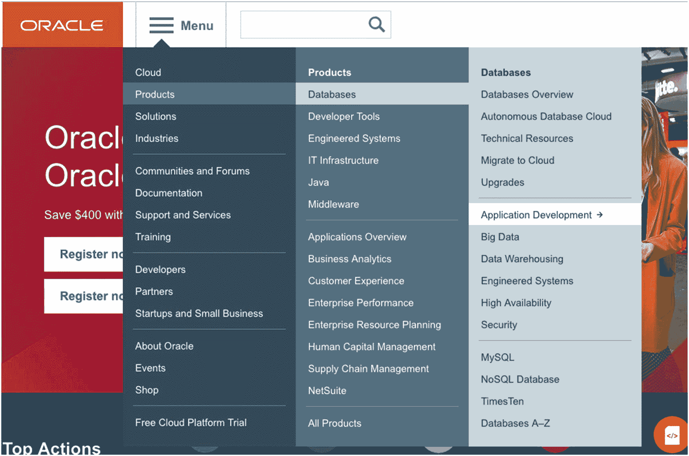
    图 2-1
    选择“应用开发”的菜单选项

3.  向下滚动页面并点击 Database Express Edition（如图 2-2 所示）。

    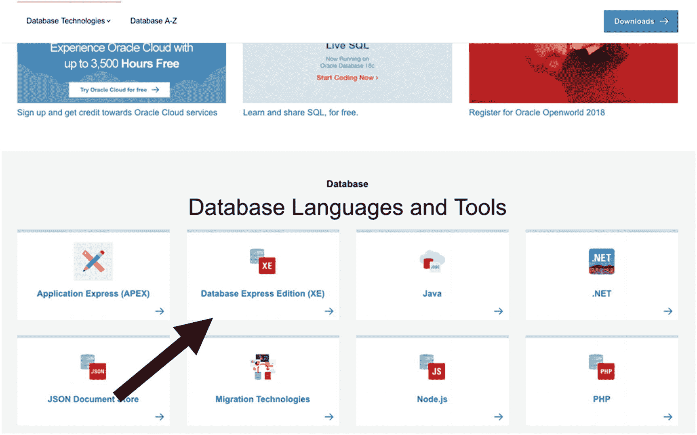
    图 2-2
    “数据库语言和工具”部分

4.  向下滚动，在“资源”部分下点击 Download Oracle Database XE（图 2-3）。

    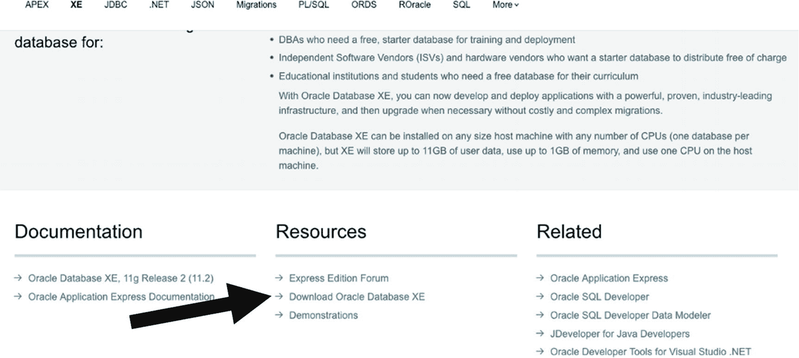
    图 2-3
    Oracle Database XE 页面的底部

加载的页面将显示有关 Oracle 快捷版的信息（图 2-4）。

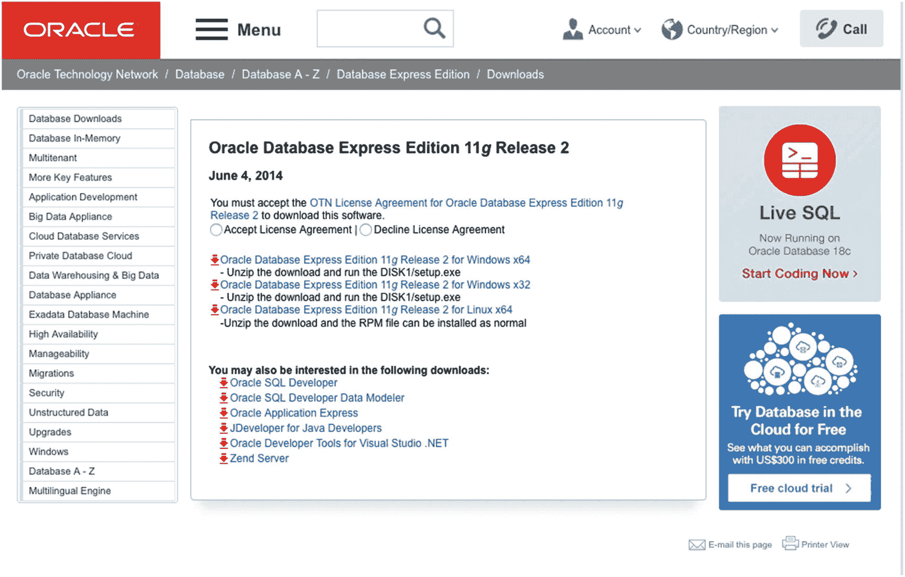
图 2-4
Oracle 快捷版下载页面

#### 注意

本节中的截图显示的是 Oracle 快捷版 11g。在撰写本文时，这是 Windows 上发布的最新版本。在您阅读本书时，18c 版本应该已经可用。安装过程是相同的。

1.  阅读并点击“接受许可协议”。然后下载链接将会出现。
2.  选择与您的操作系统相对应的版本并点击链接。如果是 Windows 系统，请根据您运行的 Windows 版本选择 32 位或 64 位。如果不确定，可以选择 32 位版本以获得更顺畅的体验。
    然后您将被要求登录或创建一个 Oracle 账户（图 2-5）。这是必需的，以便您可以下载 Oracle 快捷版（和 Oracle SQL Developer）。创建账户是免费的，您无需是 Oracle 员工。

    
    图 2-5
    登录或创建账户

3.  点击“创建账户”。随后将显示“创建您的 Oracle 账户”屏幕，如图 2-6 所示。

    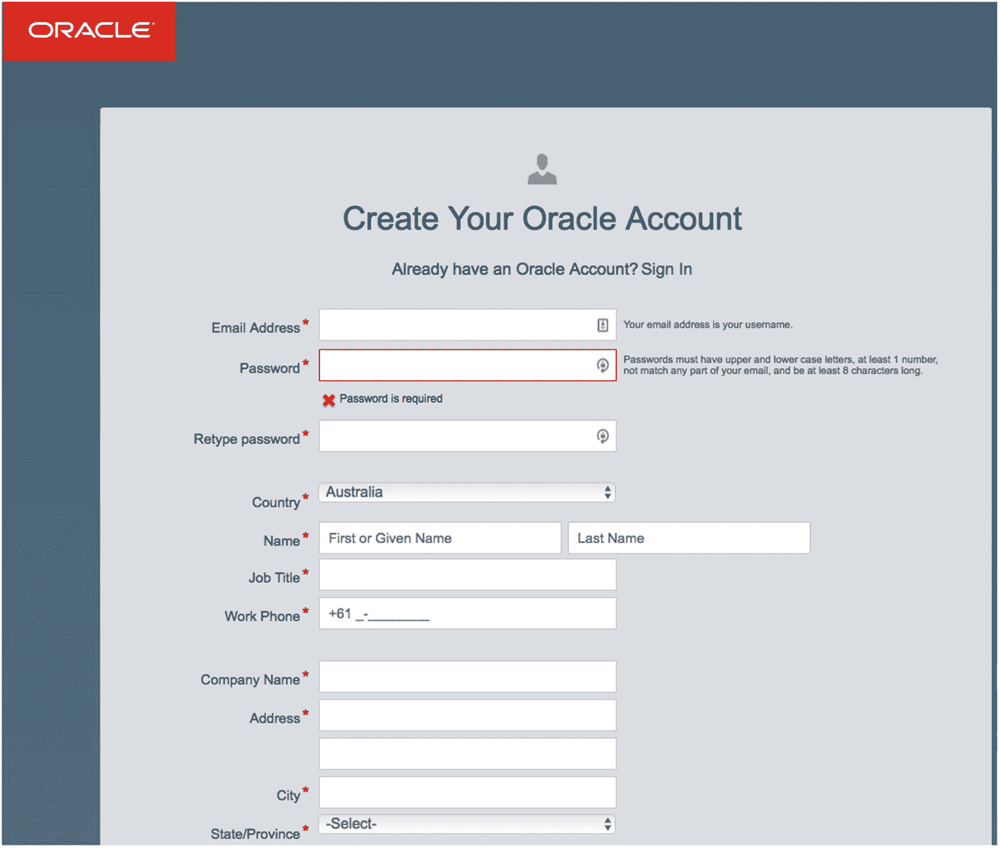
    图 2-6
    “创建您的 Oracle 账户”屏幕

4.  输入您的详细信息并点击“创建账户”。您的账户现在应该已经创建好了。
5.  使用您新创建的账户登录。然后 Oracle 快捷版应该就会开始下载到您的计算机。

根据您的浏览器设置，下载要么会自动开始（在默认的“下载”文件夹中），要么会要求您指定保存位置。

### Windows、Linux 以及 Mac 呢？

您可能已经注意到 Oracle 快捷版有 Windows 和 Linux 版本，但没有 Mac 版本。Oracle 目前不提供 Oracle 快捷版的 Mac 版本下载。但是，如果您使用的是 Mac，仍然可以使用 Oracle 快捷版来学习 Oracle。我自己就使用 Mac，并且能够在其上运行 Oracle 数据库。

Mac 用户有几种选择：

*   设置一个 Windows 虚拟机，这是您计算机上运行 Windows 安装的一个区域，您可以在其中安装 Oracle。这可以使用虚拟机应用程序（如 Parallels 或 VirtualBox）来完成。
*   下载 Oracle 预构建的开发者虚拟机之一。这些是由 Oracle 预制的虚拟机文件，其中包含 Windows（使用名为 VirtualBox 的虚拟机程序）、Oracle 数据库和 SQL Developer。
*   使用 LiveSQL，它不需要安装，但需要互联网连接。

有关设置虚拟机的详细信息，请访问以下页面：
*   Oracle
*   在 Mac 上设置 Oracle： [`www.databasestar.com/oracle-mac/`](http://www.databasestar.com/oracle-mac/)

接下来的说明主要适用于 Windows 和 Linux 用户。如果您使用的是 Mac，那么您关于使用虚拟机还是 LiveSQL 的选择将会影响您需要执行以下哪些活动。例如，Oracle 预构建的虚拟机会预装 Oracle 数据库，而对于您从头创建的虚拟机，您需要自己安装数据库。


### 安装 Oracle Express

既然我们已经下载了 Oracle Express，现在是时候安装它了。接下来的步骤是针对 Windows 安装的，但 Linux 安装过程应该类似。

1.  浏览到下载文件的位置。它通常会在默认的“下载”文件夹中，或者你指定的任何位置。如果你的浏览器还打开着，你应该能点击该文件并选择**在文件夹中显示**（或类似选项）来打开文件保存的位置。

2.  由于该文件是 `ZIP` 格式，需要解压。打开该文件并解压，或者右键单击文件并选择**解压**。

    文件会被解压到一个名为 `DISK1` 的文件夹中。

3.  打开 `DISK1` 文件夹并运行安装程序文件（图 2-7）。

    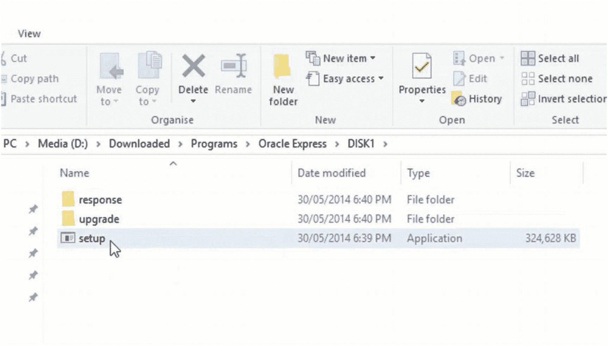

    *图 2-7：`DISK1` 文件夹*

4.  文件将加载并显示介绍屏幕（图 2-8）。点击**下一步**。

    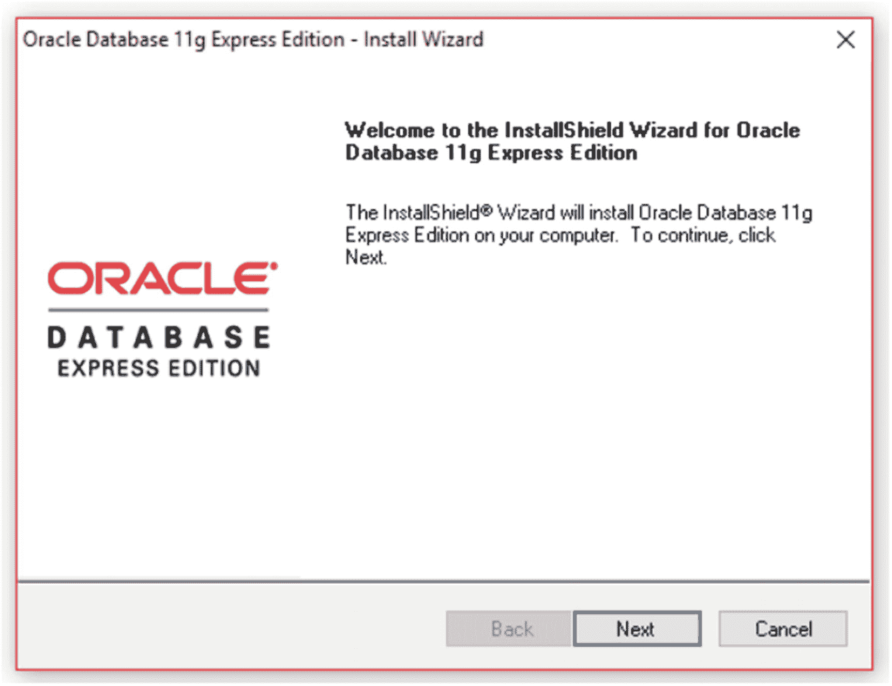

    *图 2-8：介绍屏幕*

5.  阅读条款并点击**我接受**；然后点击**下一步**（图 2-9）。

    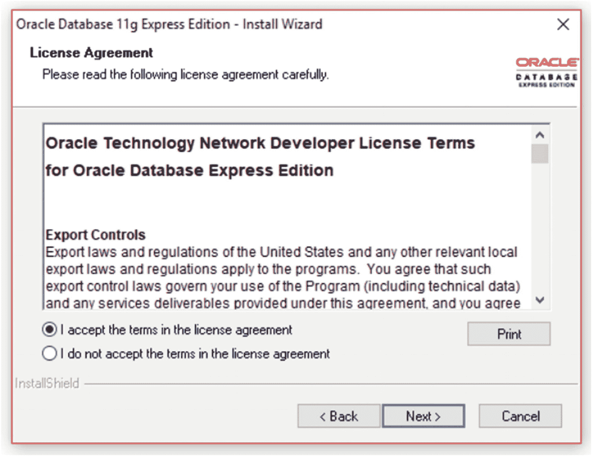

    *图 2-9：许可协议*

6.  在**选择目标位置**屏幕，点击**下一步**。你可以更改想要安装到的位置，但默认位置 (`C:\oraclexe`) 即可。

7.  **指定数据库密码**屏幕将显示，如图 2-10 所示。输入一个你想用于系统管理员账户（称为 `SYS` 和 `SYSTEM`）的密码，然后点击**下一步**。

    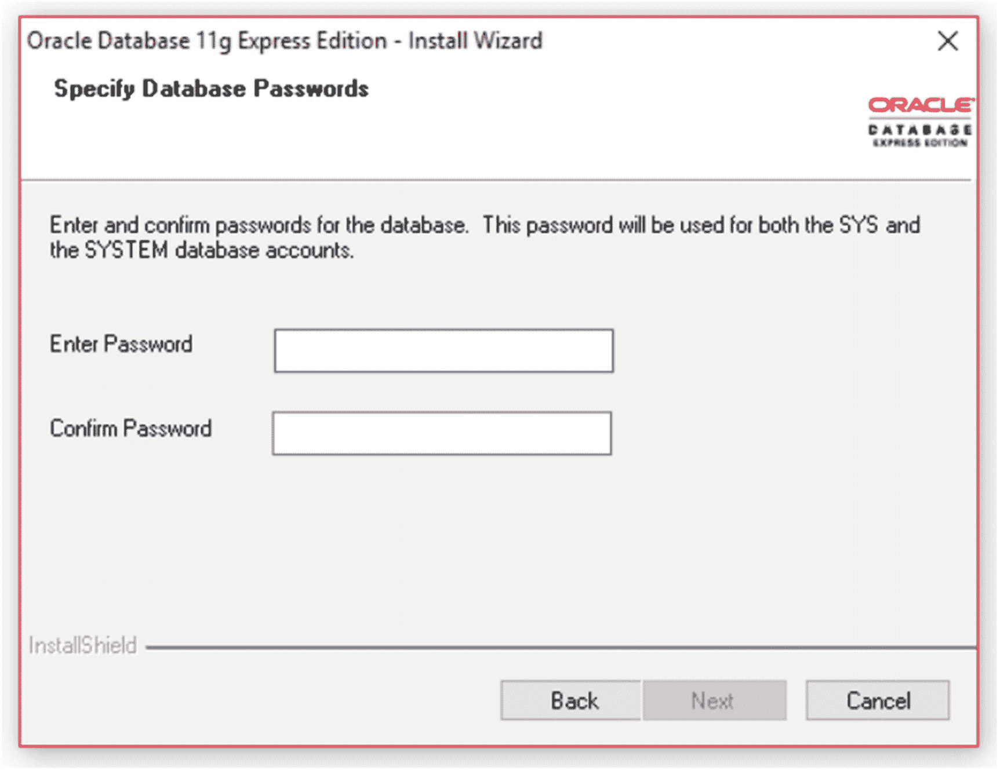

    *图 2-10：数据库密码屏幕*

#### 注意

你需要记住这个密码，因为你稍后将使用它登录数据库，以及在你需要重置其他密码时使用。如果忘记此密码，你可能需要重新安装 Oracle Express。

8.  在“摘要”屏幕，点击**安装**。

    Oracle Express 随后将开始安装。此安装过程通常需要几分钟时间。安装完成后会显示一条消息。

现在你已经安装了 Oracle Express，是时候下载并设置 Oracle SQL Developer，以便你可以使用这个数据库了。

### 下载 Oracle SQL Developer

Oracle SQL Developer 是 Oracle 提供的免费应用程序，用于访问和操作 Oracle 数据库。此应用程序被称为集成开发环境 (`IDE`)。它是一种让开发者处理代码的应用程序。

下载 SQL Developer：

1.  访问 Oracle 网站：[`www.oracle.com`](http://www.oracle.com)。

2.  在菜单下，导航至**产品 ➤ 数据库 ➤ 应用程序开发**。

3.  向下滚动并选择 **SQL Developer**。

4.  点击**下载**按钮，如图 2-11 所示。

    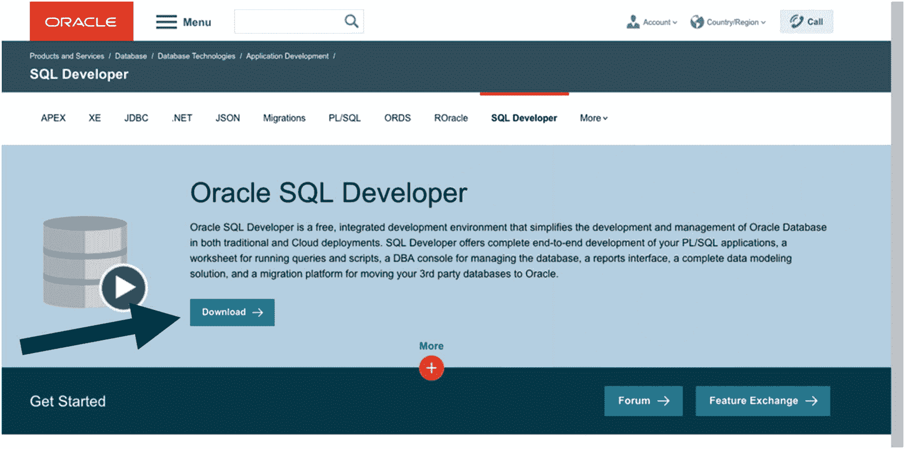

    *图 2-11：Oracle SQL Developer 下载*

    该页面显示了下载 SQL Developer 的许多不同选项（图 2-12）：

    *   Windows 64-bit with JDK included
    *   Windows 32-bit or 64-bit
    *   Mac OSX
    *   Linux
    *   Other

    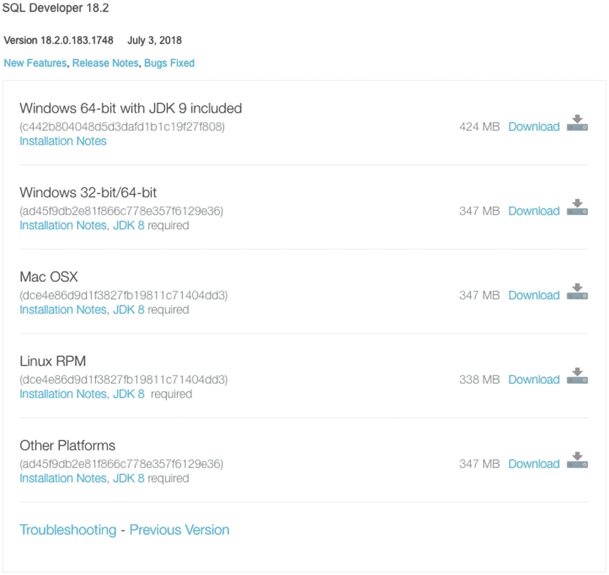

    *图 2-12：Oracle SQL Developer 下载版本*

    你应该选择与你操作系统和之前选择的 Oracle Express 版本（32 位或 64 位）相匹配的 Oracle SQL Developer 版本。最简单的方式是使用“Windows 64-bit with JDK included”。这适用于你运行的是 64 位 Windows 系统。Oracle SQL Developer 运行在 Java 平台上，这是唯一一个附带 `JDK`（Java 开发工具包）的版本。因此，它安装起来更简单，因为它只是一个安装过程。

    然而，如果你运行的不是 Windows 64 位系统，你需要选择其他版本。这些其他版本不包含 `JDK`，所以你需要单独安装它。我们将在本章后面解释如何操作。

5.  点击你希望下载的版本对应的**下载**链接。与 Oracle Express 一样，根据你的浏览器设置，文件将被下载到默认位置，或者你将可以指定位置。

文件下载完成后，就可以进行设置了。

### 运行 Oracle SQL Developer

Oracle SQL Developer 的一个优点是它不需要安装。你下载的文件是一个 `ZIP` 文件。要让 SQL Developer 运行起来：

1.  浏览到你下载 SQL Developer 的位置。

2.  通过双击文件，或右键单击并选择**解压**来解压 `ZIP` 文件。

3.  文件解压后，你可以为该文件创建一个快捷方式以便更容易运行。右键单击 `sqldeveloper.exe` 并选择**发送到桌面快捷方式**。这将在桌面上放置该文件的快捷方式。

4.  运行 `sqldeveloper.exe` 文件。SQL Developer 现在将会打开。

5.  如果你下载的版本没有包含 `JDK`，系统可能会要求你指定 Java 文件的路径。点击**浏览**并找到 `java.exe` 文件。它通常位于 `C:\Program Files\Java\jdk1.8.0_144\bin\`。

随后应该会显示启动页或欢迎屏幕。

### 下载 JDK

如果你下载的 SQL Developer 版本没有附带 `JDK`，你可能需要下载它。如果你的电脑上已经安装了它，可能来自你之前所做的其他开发工作，那么你就不需要再次下载。但是，如果你确实需要下载，方法如下：

1.  访问 [`www.oracle.com`](http://www.oracle.com)。

2.  在菜单下，选择**产品 ➤ 开发者工具 ➤ Java SE SDK**。

3.  点击页面顶部的**下载**选项卡，如图 2-13 所示。

    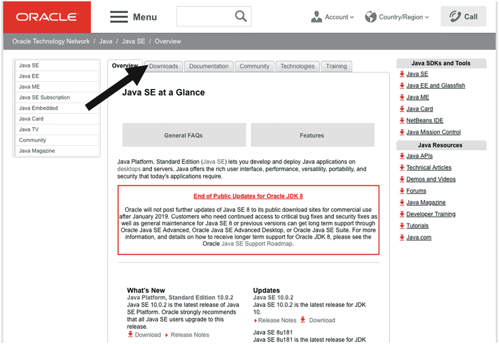

    *图 2-13：Java 下载*

4.  点击 `JDK` 旁边的**下载**按钮，如图 2-14 所示。

    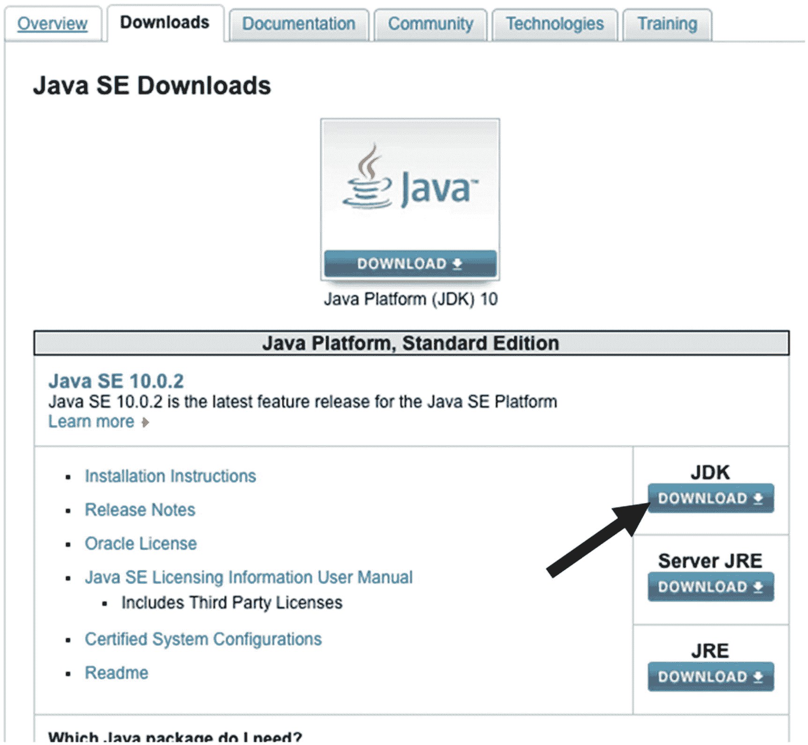

    *图 2-14：Java 下载页面*

5.  点击**接受许可协议**，然后点击代表你操作系统文件的链接，如图 2-15 所示。

    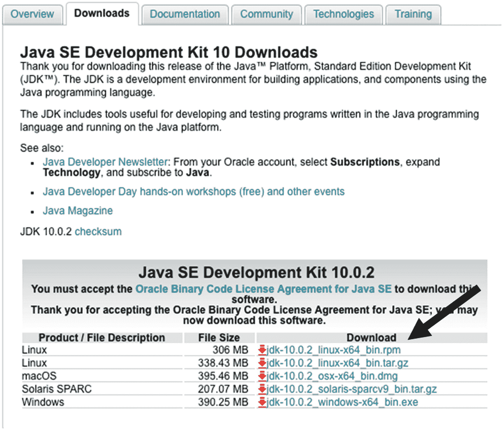

    *图 2-15：Java 下载链接*

文件下载后，你可以安装它。

1.  在浏览器中点击该文件以运行安装文件。或者，你可以浏览到你下载它的位置，然后运行该文件。

2.  在过程的每一步点击**下一步**来跟随安装步骤。无需更改任何默认选项。

`JDK` 安装需要几分钟时间。你现在可以运行 SQL Developer 了。


### 创建连接

打开 SQL Developer 后，你就可以连接到刚刚安装的 Oracle 数据库了。这将允许你通过运行查询与数据库进行交互。我们需要做几件事：

1.  使用管理员账户创建一个新连接。
2.  创建一个新用户。
3.  使用新用户创建一个新连接。

为什么需要创建新用户？我们不能直接使用安装时创建的系统账户吗？我们确实可以使用 `SYSTEM` 账户，但以这种方式使用 `SYSTEM` 账户来创建表和处理数据并不是一个好的做法。这是因为系统管理员账户拥有许多权限，数据库管理员会使用它们执行各种任务。在工作环境中，你通常无法访问系统管理员账户，因此最好使用自己的账户。

要创建新连接：

1.  在 SQL Developer 中，点击屏幕左侧“连接”选项卡中的绿色 + 按钮，如图 2-16 所示。
    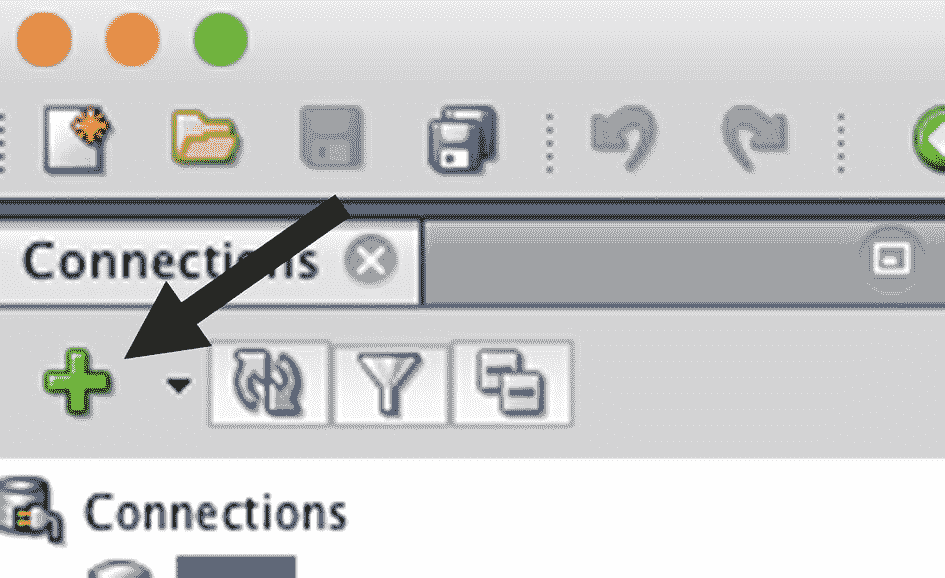
    图 2-16：新建连接按钮。
    如果看不到“连接”选项卡，请点击“视图”菜单，然后点击“连接”。

随后将显示“新建连接”窗口，如图 2-17 所示。现有连接显示在左侧，创建新连接的字段位于右侧。你左侧的连接列表将是空的。
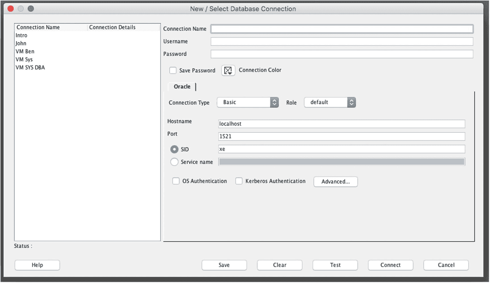
图 2-17：新建连接窗口。

1.  输入一个 `连接名`。这可以是任何你喜欢的名字，用于在所有其他连接的列表中标识此连接。我建议使用“System”，因为这是 `SYSTEM` 账户的连接。将来如果你需要连接多个数据库，在此 `连接名` 字段中同时放入数据库名称和用户名会是个好习惯。
2.  输入“SYSTEM”作为 `用户名`。
3.  在密码字段中，输入你在安装 Oracle Express 时输入的密码。就是你需要记住的那个密码。
4.  勾选 `保存密码` 复选框，这样每次连接时就不需要重新输入密码了。屏幕应如图 2-18 所示。
    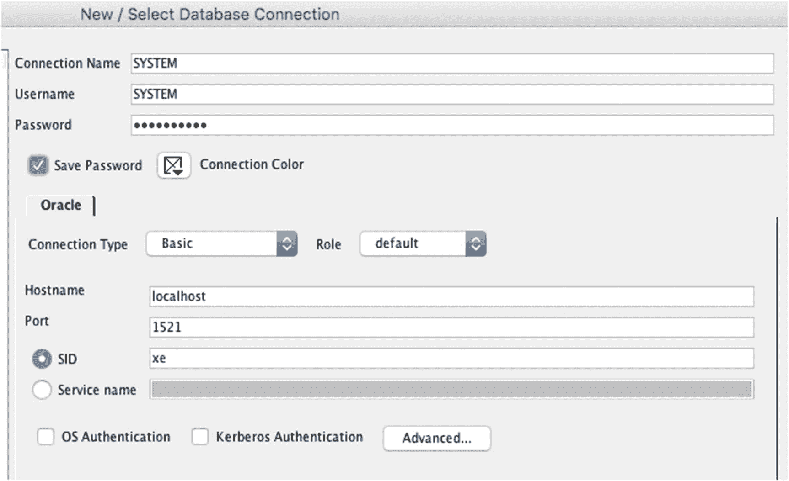
    图 2-18：新建连接窗口中的数据。
5.  关于连接信息，如果你在公司，你的 DBA（数据库管理员）通常会提供如何连接的信息。对于连接到我们的 Oracle Express 数据库，请将 `主机名`、`端口` 和 `SID` 字段保留为它们的默认值。`主机名` 应为“localhost”，`端口` 应为 `1521`，`SID` 应为“xe”。
6.  点击 `测试` 按钮。这将测试你与数据库的连接，并查看你输入的信息是否正确。
    如果测试成功，左下角应显示“状态: 成功”，如图 2-19 所示。
    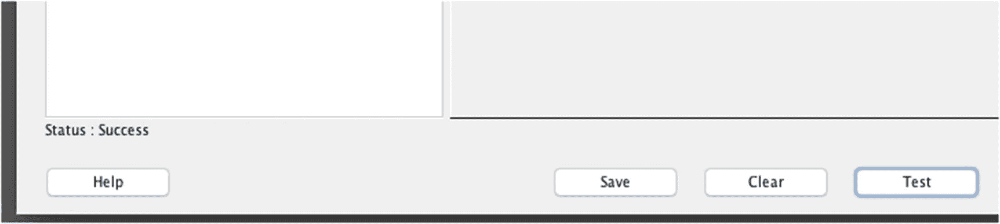
    图 2-19：测试连接成功的消息。
    点击 `保存`。新连接将被保存到左侧的列表中，如图 2-20 所示。
    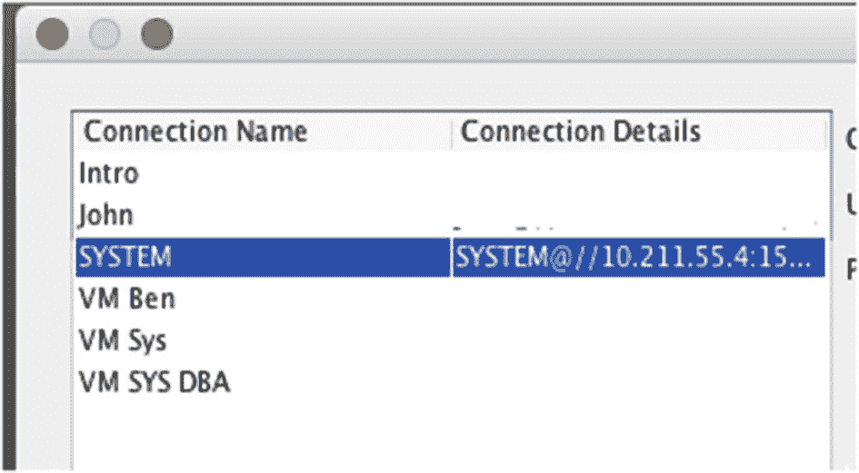
    图 2-20：列表中的新连接。
7.  点击 `连接`。SQL Developer 将使用此连接并连接到数据库。连接成功后，SQL Developer 窗口中会显示一个以你的连接命名的新选项卡。

### 创建新用户

我们可以继续以 `SYSTEM` 账户创建表，但我们要避免以 `SYSTEM` 身份进行操作。我们将创建一个新用户，然后由该用户来创建我们的表。在 SQL Developer 窗口的左侧，你应该能看到 `连接` 字样，其下方是你刚刚创建的连接。找到你的新连接。然后执行以下步骤：

1.  点击连接名称左侧的箭头，展开该连接下的项目。这将显示所有不同类别的对象。
2.  滚动到此列表的底部，右键单击 `其他用户`，然后选择 `创建用户`，如图 2-21 所示。
    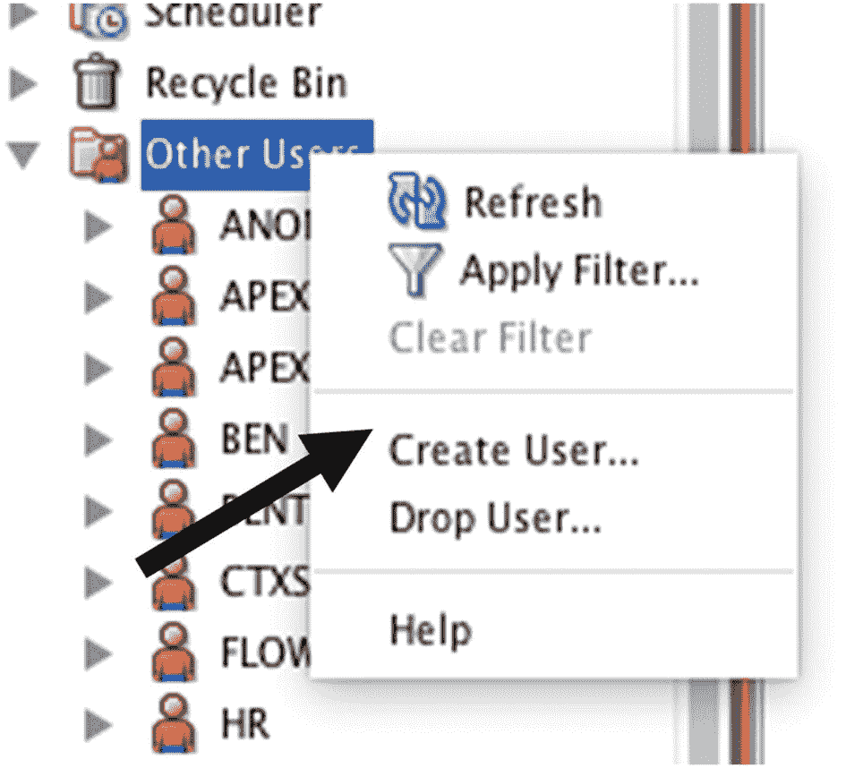
    图 2-21：“创建用户”菜单选项。
3.  在出现的窗口中，输入新用户的名称，如图 2-22 所示。名称不区分大小写，且不应包含特殊字符或“system”等保留字。如果不确定使用什么，可以用你自己的名字或“intro_user”作为用户名。
    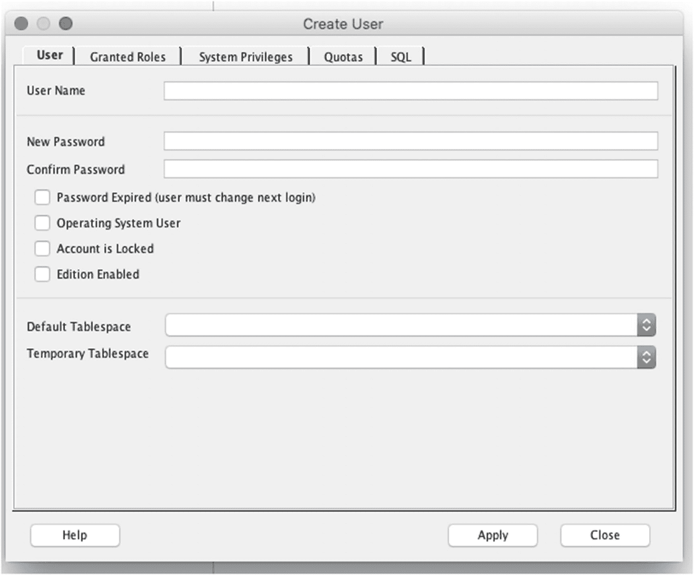
    图 2-22：“创建用户”窗口。
4.  在 `新密码` 和 `确认密码` 框中输入密码。
5.  将所有其他选项留空：复选框和表空间字段。
6.  点击 `已授予的角色` 选项卡。将出现可用角色的列表。
7.  点击 `CONNECT` 角色旁边的 `已授予` 复选框，如图 2-23 所示。此 `CONNECT` 角色允许用户连接到数据库。
    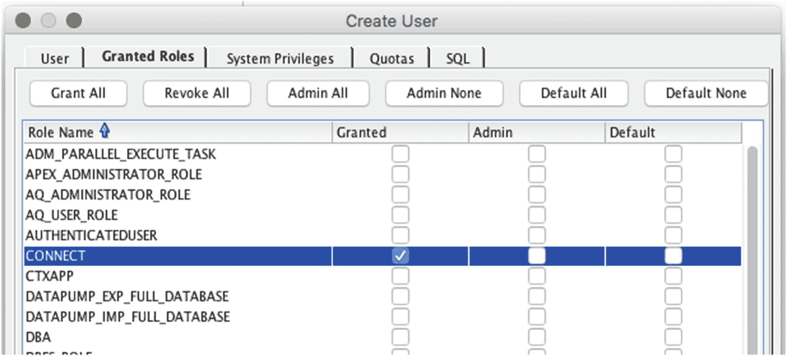
    图 2-23：“已授予的角色”选项卡。
8.  点击 `系统权限` 选项卡。将出现可用权限的列表，如图 2-24 所示。
    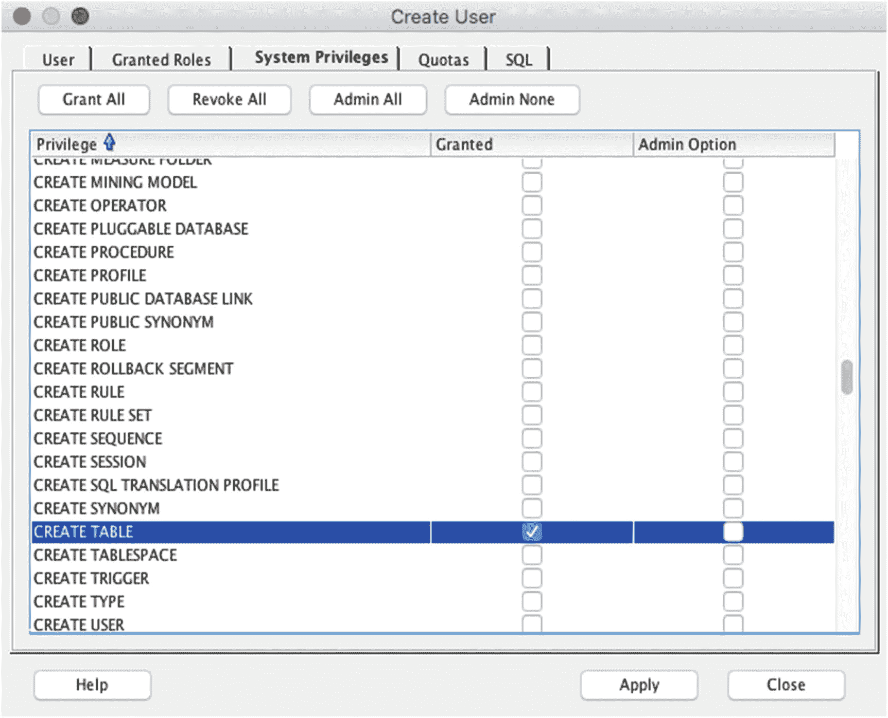
    图 2-24：“系统权限”选项卡。
9.  点击 `CREATE TABLE` 权限旁边的 `已授予` 复选框。这将允许你创建表。
10. 点击 `应用` 按钮。新用户将被创建，并显示一条消息，如图 2-25 所示。
    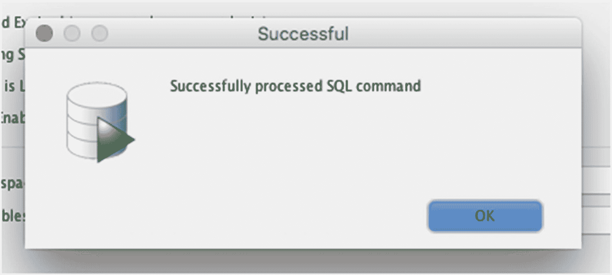
    图 2-25：成功消息。

### 使用新用户创建连接

现在你已经有了一个新用户。让我们用这个用户创建一个新连接，这样你就可以开始以这个新用户（而不是管理员用户）的身份使用数据库。你可以遵循与之前创建连接相同的步骤来创建此连接。

简而言之：

1.  点击 SQL Developer 左侧的绿色加号，显示“创建新连接”窗口。
2.  输入新的连接名，并输入创建用户时使用的用户名和密码。
3.  将其余连接信息保留为默认值。
4.  点击 `保存` 以保存连接。
5.  最后，点击 `连接` 以该用户身份连接。

干得漂亮！你现在已经安装了 Oracle 数据库，打开了 SQL Developer，并创建了一个新用户以及使用该用户的连接。


### 创建表

在开始学习基础 SQL 之前，我们需要做的最后一件事是创建一些示例数据。这将涉及两个步骤：创建一个表，然后向该表中添加数据。

每个步骤都可以用两种方式完成。我们可以使用 SQL Developer 内部的菜单和对话框，也可以运行一些 SQL 代码来完成此操作。到本书结束时，你将学会如何用 SQL 代码完成这两项操作，但现在，我们将使用菜单创建表。当你以新用户身份连接到 `Oracle` 数据库后，就可以准备创建表了。

操作步骤如下：

1.  展开窗口左侧的连接名称，查看所有可用的对象。
2.  右键单击显示为 `Tables (Filtered)` 的选项，并选择 `New Table`。此选项应位于列表顶部，如图 2-26 所示。
    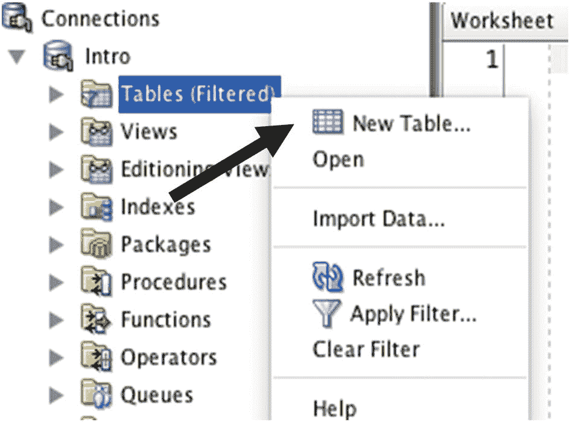
    *图 2-26: `New Table` 菜单选项*
    此时应出现 `Create Table` 窗口。
3.  输入表的名称。对于此表，我们将存储员工数据，因此在 `Name` 字段中输入单词 `employee`，如图 2-27 所示。大写、小写无关紧要。`Oracle` 会以统一大小写存储表名。
    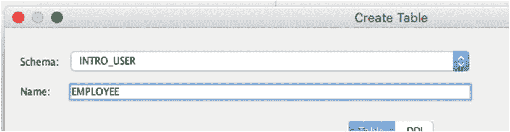
    *图 2-27: 新表的名称*
4.  表需要包含列。在 `Columns` 部分，双击 `Name` 列中的第一个值（当前为 `COLUMN1`），如图 2-28 所示。
    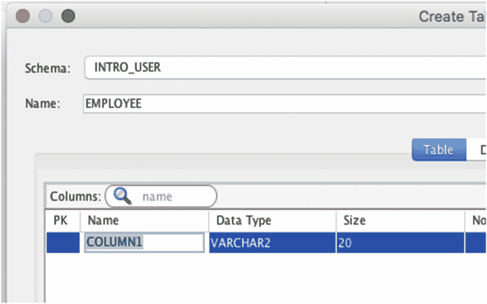
    *图 2-28: 编辑新列的名称*
5.  输入列的新名称。我们将其命名为 `ID`。
6.  选择 `Data Type` 值为 `NUMBER`，如图 2-29 所示。
    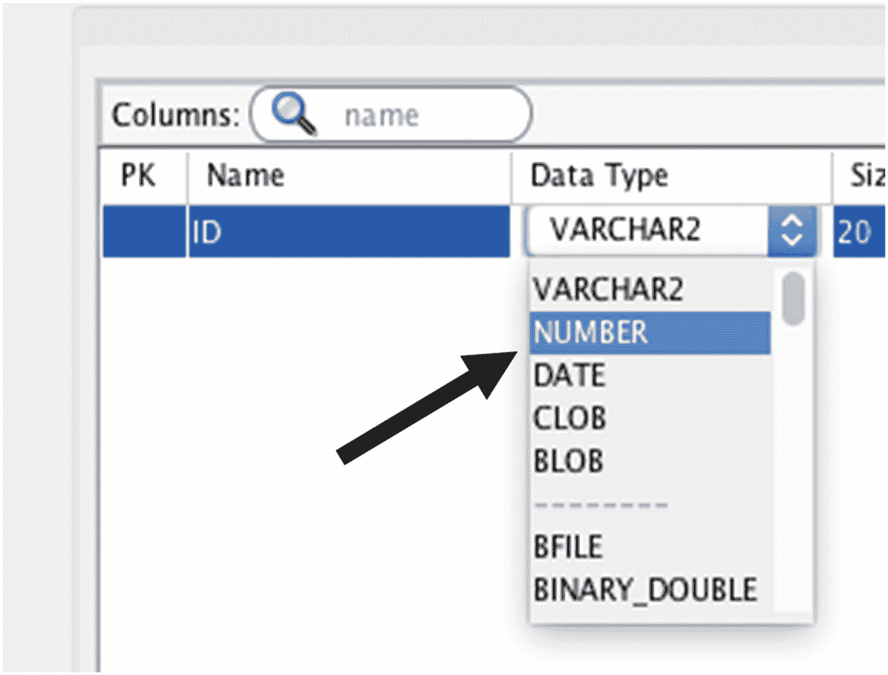
    *图 2-29: 新列的数据类型*
7.  点击右侧的绿色 `+` 符号以添加新条目，如图 2-30 所示。
    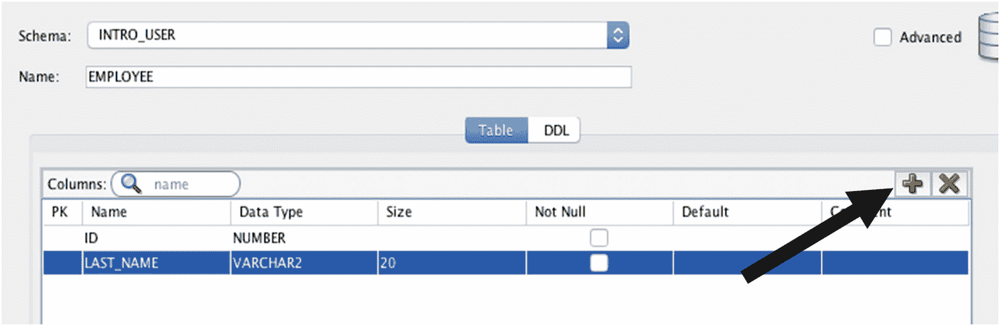
    *图 2-30: 添加新列*
8.  重复相同的步骤，将此列命名为 `LAST_NAME`。将数据类型保留为 `VARCHAR2`。
9.  点击绿色 `+` 符号添加新条目。将此列命名为 `SALARY`，并选择数据类型为 `NUMBER`。

你的窗口应如图 2-31 所示。
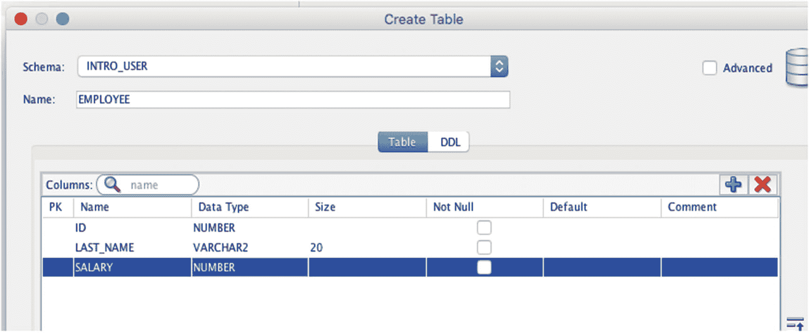
*图 2-31: 添加更多列*
1.  点击 `OK` 按钮。你的表现在将被创建。它也会出现在屏幕右侧 `Tables (Filtered)` 项目下。

恭喜！你现在已经创建了你的第一个表。

### 插入数据

当我们创建一个新表时，它有我们定义的列，但里面没有数据。最后一步是向我们的新表中添加一些数据。

我们可以通过使用 `SQL Developer` 中的菜单选项来完成此操作。

操作步骤如下：

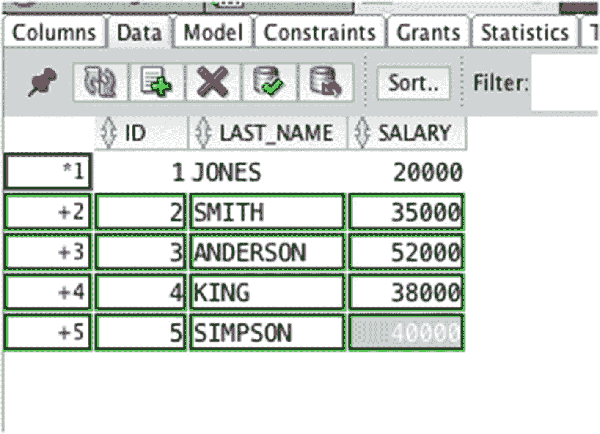
*图 2-36: 添加到表中的更多行*

| ID  | LAST_NAME | SALARY |
| --- | --- | --- |
| 2   | SMITH     | 35000  |
| 3   | KING      | 40000  |
| 4   | SIMPSON   | 52000  |
| 5   | ANDERSON  | 31000  |

1.  展开左侧窗口中的连接名称，然后展开 `Tables (Filtered)` 条目，如图 2-32 所示。
    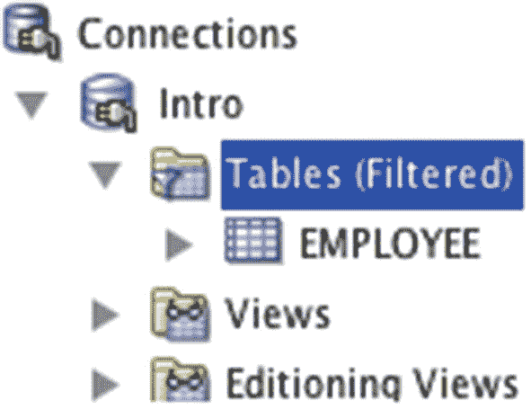
    *图 2-32: 连接下列出的表*
2.  单击 `EMPLOYEE` 表一次。左侧将打开一个新选项卡，显示有关该表的信息，例如创建表时添加的三列，如图 2-33 所示。
    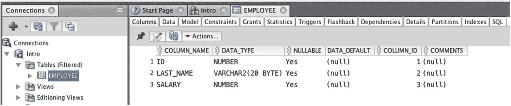
    *图 2-33: Employee 的列*
3.  在第二行选项卡上，单击 `Data` 选项卡。它应该在 `Columns` 的左侧，如图 2-34 所示。
    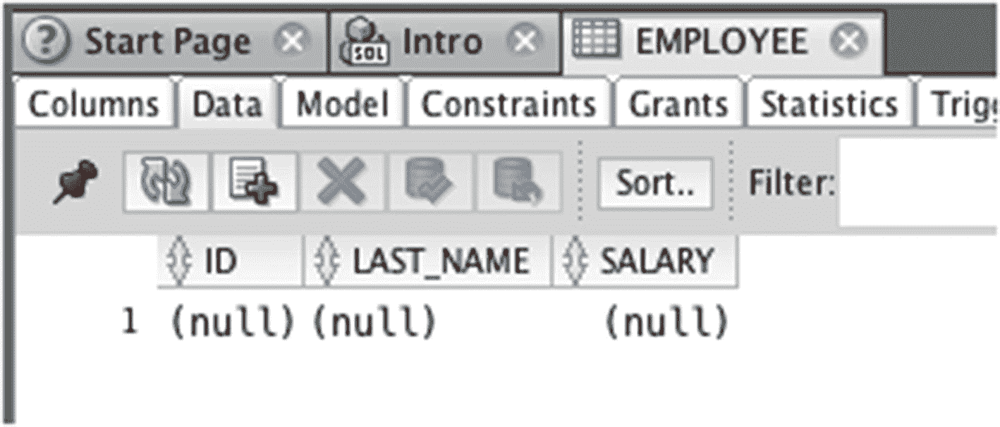
    *图 2-34: Employee 表中的数据*
4.  单击 `Insert Row` 按钮。这是从左数第三个按钮，上面有一个白色方块和一个绿色 `+` 符号。将添加一个新行。
5.  在 `ID` 列中输入值 `1`，在 `LAST_NAME` 列中输入值 `JONES`，在 `SALARY` 列中输入值 `20000`。你不需要输入引号或逗号，只需输入值。你的屏幕应如图 2-35 所示。
    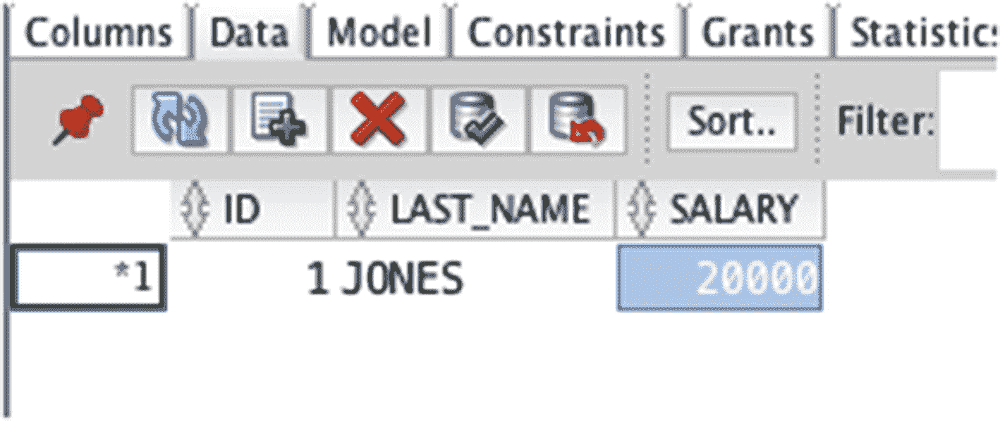
    *图 2-35: 第一行数据*
6.  单击 `Insert Row` 按钮，并在出现的行中输入以下值。重复此操作，直到所有值都进入表中，并且看起来像图 2-36。
7.  单击 `Commit Changes` 按钮。这是一个灰色的框，上面有一个圆柱体和绿色的勾号图标，位于 `Insert New Row` 图标的右侧两个按钮处。

这将把数据保存到数据库中。稍后，更改将被保存。一些消息将出现在屏幕底部的日志中。

现在我们的数据已经在表里了。


### LiveSQL

Oracle 有一个在线数据库名为 LiveSQL，它允许你创建自己的数据并运行自己的查询。这对于测试 SQL 或当你无法访问安装了 Oracle 的计算机时非常有用。

本书中的所有示例代码都可以在 LiveSQL 上运行。不过，你需要先了解如何使用 LiveSQL。要访问 LiveSQL：

1.  在你的网页浏览器中访问 [`https://livesql.oracle.com`](https://livesql.oracle.com)，页面应如图 2-37 所示。

    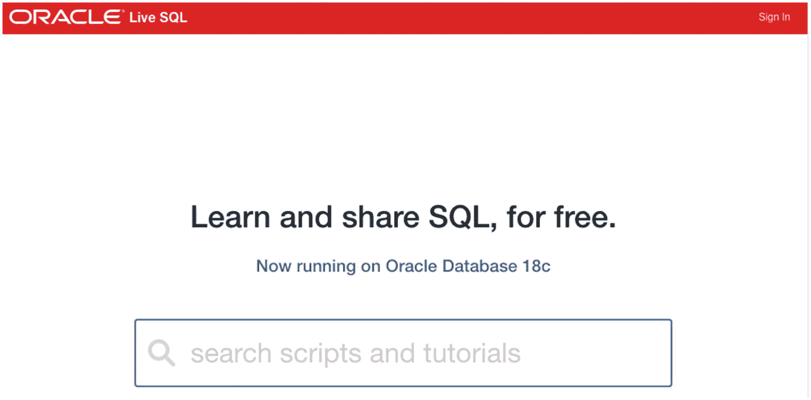
    图 2-37 LiveSQL 主页

2.  点击红色的“立即开始编码”按钮。如果你已有 Oracle 账户，请使用该账户登录。否则，你需要创建一个新账户。账户是免费的，并且你不必是 Oracle 员工。

3.  登录并接受应用程序免责声明后，你将有几个区域可以访问，如图 2-38 所示。你可以查看其他人提供的脚本或代码，也可以从新窗口开始。对于本书，我们将从新窗口开始。

    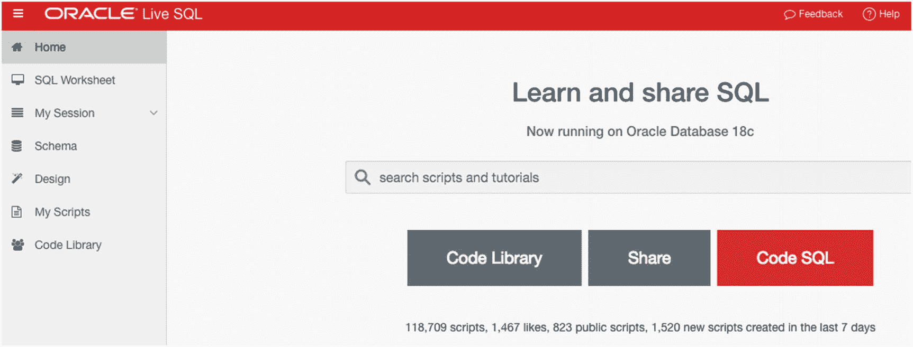
    图 2-38 登录后的 LiveSQL 页面

4.  点击红色的“编写 SQL”按钮或左侧的“SQL 工作表”链接，以打开一个新的 LiveSQL 会话。

    你将看到一个新的查询窗口，如图 2-39 所示。

    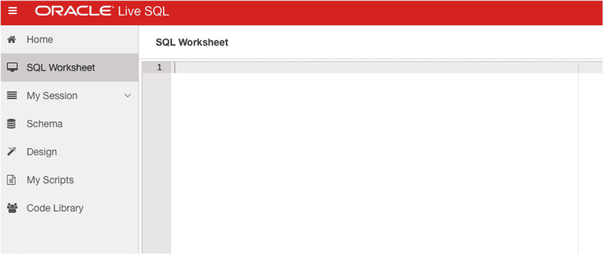
    图 2-39 SQL 工作表

5.  将本书中提到的任何代码输入（或复制粘贴）到此查询窗口中，然后点击“运行”按钮。代码应该会运行，结果将被显示出来。

6.  要使用类似于 SQL Developer 说明的向导创建新表，请点击“概要”并选择“创建数据库对象”。

    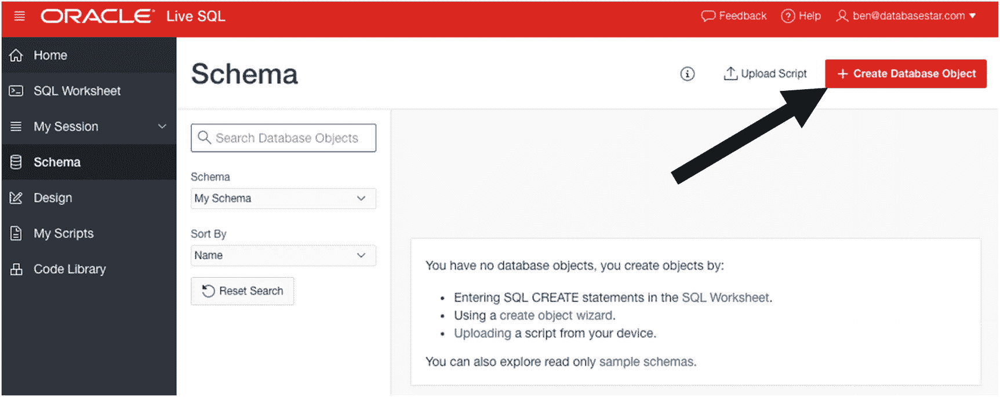
    图 2-40 LiveSQL 概要窗口

7.  在出现的弹出窗口中，选择“表”。

    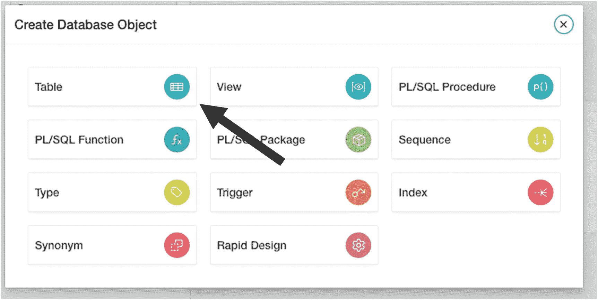
    图 2-41 创建数据库对象窗口

创建表窗口如图 2-42 所示。

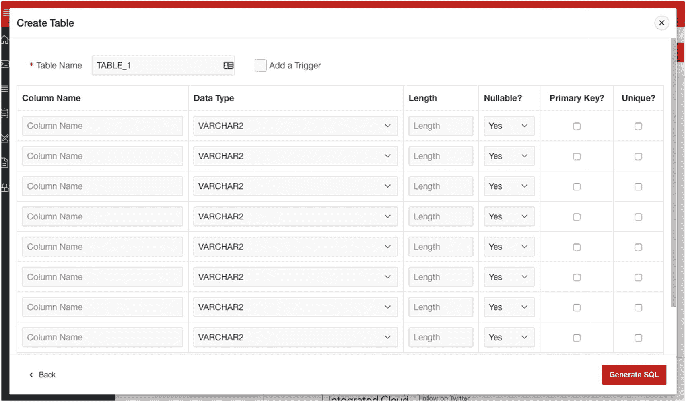
图 2-42 创建表窗口

1.  为你的表输入一个表名。

2.  以与在 Oracle SQL Developer 中相同的方式输入列名并选择数据类型。

    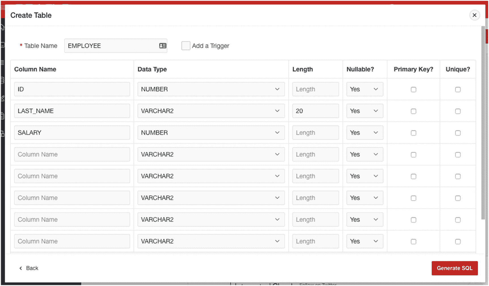
    图 2-43 填写创建表窗口

3.  点击“生成 SQL”。SQL 随后会生成并显示在查询窗口中。LiveSQL 会生成 SQL 代码，而不是自动创建表。你将在本书后面学习如何使用 SQL 代码创建表。

    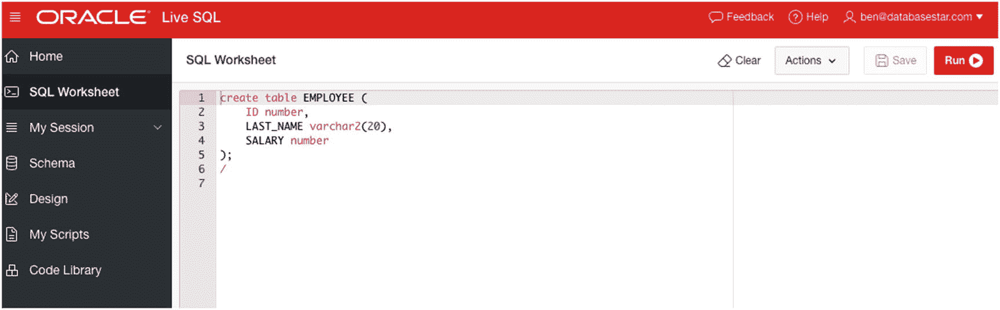
    图 2-44 LiveSQL 中的 CREATE TABLE 查询

4.  点击窗口右上角的“运行”来执行查询。然后，`EMPLOYEE` 表将被创建。

你现在能够在 Oracle 数据库上运行查询并查看结果了。

### 总结

要在自己的计算机上运行 Oracle，我们可以运行 Oracle Express Edition 和 Oracle SQL Developer，它们都是 Oracle 提供的免费工具。

设置这些工具涉及安装 Oracle Express，在 Oracle SQL Developer 中建立新连接，以及创建一个新用户。

然后，我们使用 SQL Developer 中的菜单和屏幕创建了一个表，并向该表添加了一些数据。

在下一章中，我们将研究运行一些基本的 SQL 查询来查看这些数据。

## 第二部分 查看数据

## 3. 检索数据

在本章中，你将学习如何查看数据库中的数据。你将学习你的第一个 SQL 语句——`SELECT` 语句，并在你刚创建的表上看到一些示例。

### 如何查看数据？

在上一章中，你完成了很多工作：

*   你下载并安装了 Oracle Express。
*   你下载并运行了 SQL Developer。
*   你创建了两个新连接和一个新用户。
*   你创建了一个新表并填充了示例数据。

当你创建表并添加示例数据时，你使用的是 SQL Developer 的用户界面——菜单和屏幕上出现的字段。然而，SQL 是一种基于文本的语言。你将学习如何编写 SQL 代码来处理这些数据，因为这种代码可以在其他应用程序中使用，用于开发报表或其他脚本。

SQL 语言中有一个语句或命令允许你查看数据库中的数据。它被称为 `SELECT` 语句。

### 什么是 SELECT 语句？

`SELECT` 语句是 SQL 中的一种语句类型，它允许你从数据库中读取数据。一个 `SELECT` 语句必须按照某种模式编写。这种模式被称为*语法*（syntax），你将学习到的每个语句都有不同的模式或语法。“语法”一词在 SQL 和编程中常用，用于描述代码需要如何编写。

要在 Oracle SQL 中编写 `SELECT` 语句，需要遵循以下语法：

```
SELECT your_columns
FROM your_table;
```

让我们看看这个语句的各个部分。首先，你从 `SELECT` 关键字开始。我之所以称它为*关键字*，是因为它是 SQL 中的一个特殊词汇，有特定的功能（在这个例子中，是检索一些数据）。一个 `SELECT` 语句以 `SELECT` 关键字开头。

然后你有一个空格，接着是占位符 "your_columns"。这个占位符是你列出希望在结果中显示的列的地方。当你编写 `SELECT` 语句时（你很快就会做），你需要用其他内容替换 "your_columns" 部分，通常是一个列名列表。

接下来，是 `FROM` 关键字。`FROM` 关键字是 `SELECT` 语句的一部分。它指定了数据所来源的表。`FROM` 关键字本身不是一个语句，因为一个 SQL 语句不能以 `FROM` 关键字开头。`FROM` 实际上是一个属于其他语句（如 `SELECT`）的关键字。

然后你有一个空格，接着是 "your_table" 这个词。这也是一个占位符，你可以将其替换为表的名称。

最后，你有一个分号 ";"。它指定了语句的结束。写分号是可选的，但养成这个好习惯很有益。当你开始在 SQL 窗口中拥有多个语句或开始编写更多 SQL 代码时，分号将变得很重要。尽早养成在 SQL 语句末尾添加分号的好习惯。


### 需注意的几点

你可能会对 `SELECT` 语句语法中的几处细节感到疑惑，例如大小写和换行。我将部分语法写成了大写字母，部分写成了小写字母：

```
SELECT your_columns
FROM your_table;
```

为什么这样呢？基本上，这是关于格式化的问题。当你编写 SQL 时，坚持使用一致的格式有助于他人阅读，也更易于维护。

我倾向于将 SQL 关键字（如 `SELECT` 和 `FROM`）大写。这样无论你是在 SQL Developer、其他集成开发环境（IDE）、应用程序代码还是脚本中阅读它们，关键字都会很醒目。

其他人则偏好将 SQL 关键字小写，例如 `select` 和 `from`。这取决于个人喜好，网上也不乏文章详细说明为何以及如何将 SQL 写成大写或小写。

幸运的是，SQL 并非大小写敏感的语言。对于 Oracle 数据库而言，你写 `SELECT` 还是 `select` 并不重要。代码仍会运行。

你应该如何编写 SQL 呢？我推荐关键字使用大写。然而，我认为更重要的是与你团队或应用程序的其他部分保持格式一致。如果你的团队偏好小写，那就使用小写。如果你有选择权，比如是为自己学习而非在团队中，那么我建议使用大写。

那么间距呢？为什么我要将 `FROM` 这个词放在新的一行？SQL 并不要求关键字必须换行。

然而，将 `FROM` 关键字（以及许多其他关键字）放在新的一行，将有助于使查询更易于阅读和维护。因此，我推荐你这样编写查询。

### 我们的第一个 SELECT 语句

既然你已经了解了 `SELECT` 语句的语法并解释了一些格式问题，现在让我们来编写你的第一个 `SELECT` 语句。

首先，以 `SELECT` 关键字开始：

```
SELECT
```

然后，添加你想查看的列。在这个例子中，我们将展示此表中所有可用的列。在 SQL 中，要实现这一点，你需要使用星号字符 `*`。在 `SELECT` 关键字后加一个空格，然后添加它。

```
SELECT *
```

这种 `SELECT` 语句的变体通常被称为“全选”或“select star”，因为你选择了所有的列。

接下来，另起一行并添加 `FROM` 这个词。

```
SELECT *
FROM
```

现在你需要指定数据来自哪个表。你可以使用上一章创建的表，即 `employee`。

```
SELECT *
FROM employee
```

最后，加上分号。

```
SELECT *
FROM employee;
```

这就是你的第一个 `SELECT` 语句！

那么行呢？你已经指定了要看所有列，但行呢？

数据库将使用此语句并查找所有符合你提供条件的行。默认情况下，除非你指定了需要检查的条件，否则将返回所有行。你将在本书后面学习如何显示满足特定条件的行，但目前你并未添加任何条件，因此数据库将显示所有行。

你该如何操作呢？你需要使用 SQL 工作表或编辑器在数据库上运行它。

### 在 SQL Developer 中运行语句

要运行你的 `SELECT` 语句，你可以使用 SQL Developer。你可以按照以下步骤操作：

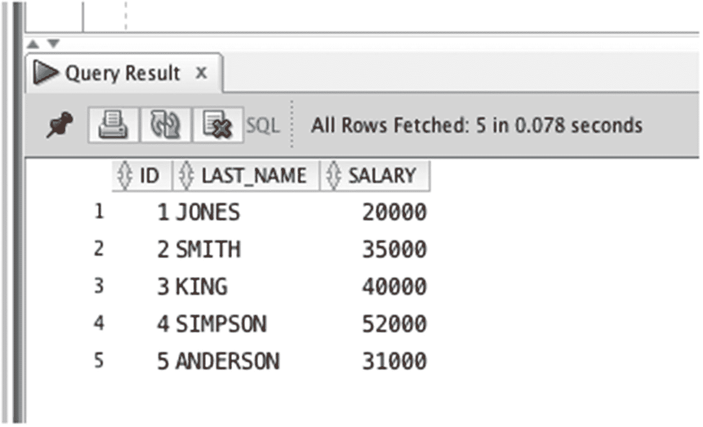
图 3-5 查询结果

1.  打开 `SQL Developer`。它应该在你上一章解压的位置。会出现一个加载屏幕，应用程序会在 5 到 10 秒内加载完成。

2.  在屏幕左侧的 `Connections`（连接）菜单中（图 3-1），应该有两个连接（一个用于 `SYSTEM`，一个用于 `Intro User` 或你创建的用户）。

    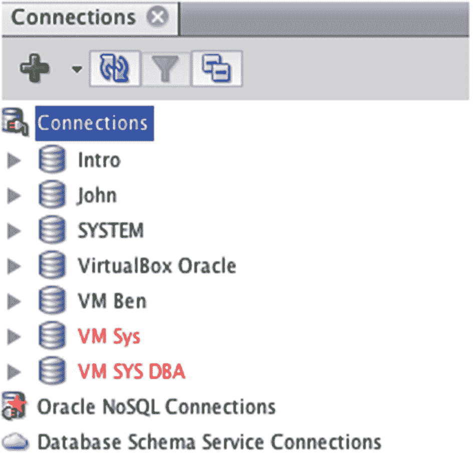
    图 3-1 连接面板

3.  双击你的 `Intro User` 连接（或不是用于 `SYSTEM` 用户的那个连接）。

    一个新的 SQL 工作表将在主屏幕上打开。请注意，右上角的下拉框包含你的连接名称，如图 3-2 所示。

    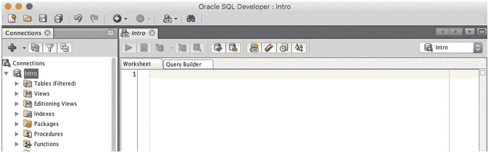
    图 3-2 新的 SQL 工作表

4.  点击新的 SQL 窗口内部，并按如下方式输入你的 SQL 查询：

    ```
    SELECT *
    FROM employee;
    ```

    在你输入时，可能会弹出一些菜单来辅助你的输入。你现在可以忽略它们。你的屏幕应如图 3-3 所示。

    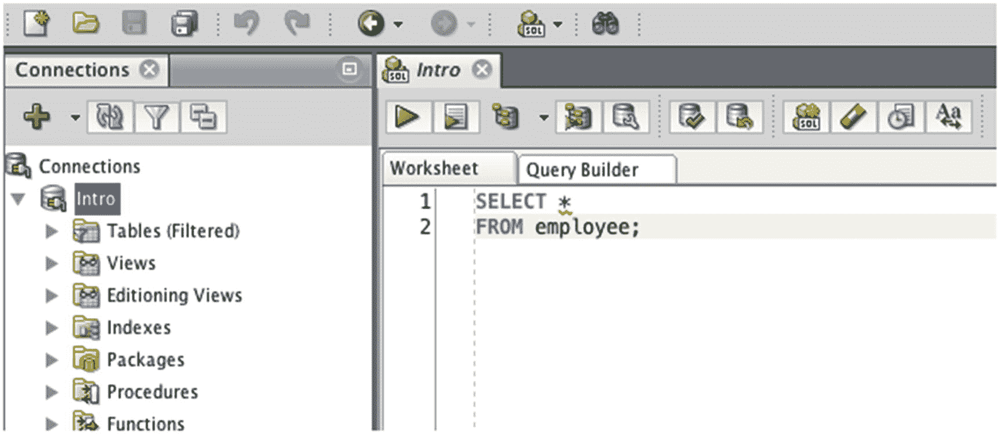
    图 3-3 输入 SQL 查询

    在 SQL 窗口的顶部，就在你刚写的 `SELECT` 语句上方，有一排按钮，如图 3-4 所示。

    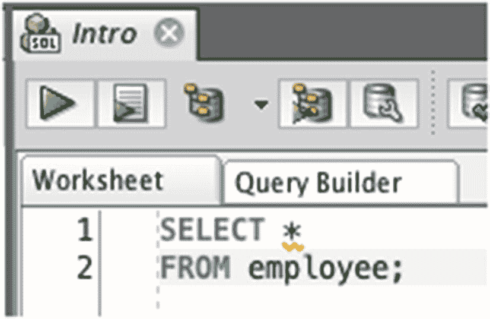
    图 3-4 运行按钮

    第一个按钮，那个大的绿色箭头，是 `Run Statement`（运行语句），第二个是 `Run Script`（运行脚本）。我将向你展示使用这些按钮会发生什么。你可以暂时忽略其他按钮。

5.  点击工具栏上的第一个按钮，即 `Run Statement` 按钮。

    SQL 语句开始运行，片刻之后，一组数据显示在屏幕底部（图 3-5）。

你会注意到数据以行的形式显示，并且有五行。在每行的左边，都有一个数字，如图 3-6 截图所示。这个数字代表你结果的行号。

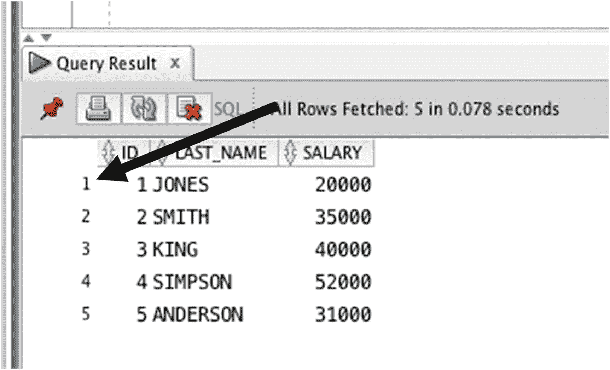
图 3-6 行号

在这个例子中，行号与 `ID` 相同，但那是因为数据显示的顺序就是如此。当你编写没有 `ID` 列或以不同顺序显示数据的查询时，这个行号可以帮助你查看每一行号对应的内容。

### 结果

当 `SELECT` 语句在数据库上运行时，该语句的结果会显示给你。这被称为结果，或你的 `result set`（结果集），因为它是由查询产生的数据集合。

在你之前的例子中，你想查看 `employee` 表中的所有列。当你运行此语句时，屏幕底部会出现一个表格或网格。这个网格就是你的 `result set`，它包含了 `employee` 表中的所有列和行。

这与你上一章输入的数据相同。它显示了 `ID` 列、`last_name` 列和 `salary` 列。它显示了你输入的所有行。


### 运行脚本

另一种运行查询的方法是使用 SQL Developer 中的 **运行脚本** 按钮。此按钮将运行 SQL 窗口中的所有命令（可能不止一个），并且会以基于文本的输出形式显示结果，而不是表格形式。

在 SQL 窗口中写好你的 `SELECT` 查询后，点击 **运行脚本** 按钮。图 3-7 显示了输出的样子。

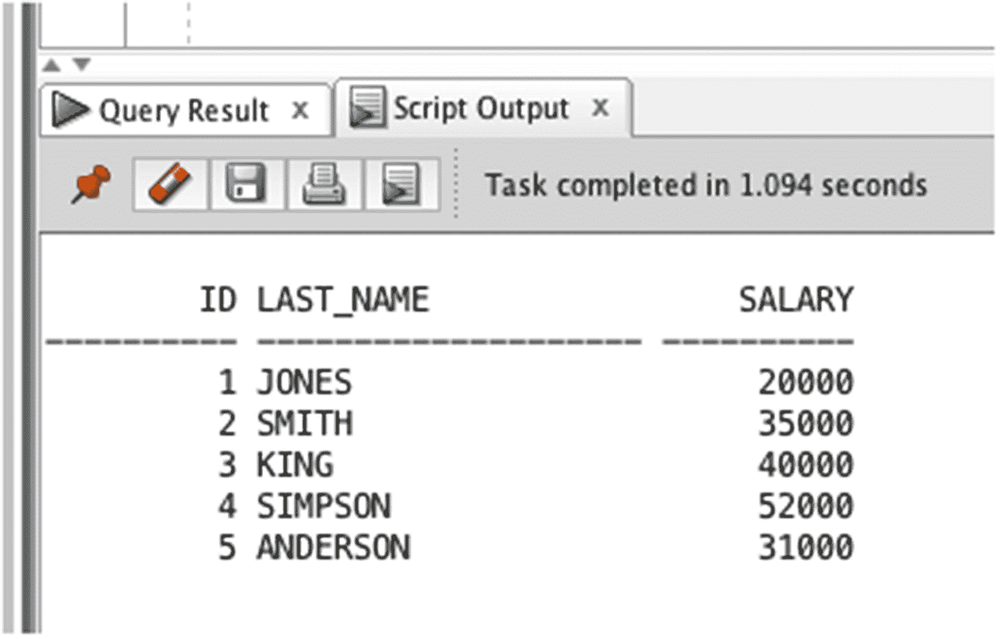

图 3-7

脚本输出

这显示了与 **运行语句** 按钮相同的输出。但是，它以基于文本的格式显示。这使得复制粘贴到文本文件或一次性运行多个语句变得容易。如果你执行多个查询，它们的结果将在此文本输出中依次显示，第一个查询的结果在顶部。

了解如何使用 **运行脚本** 功能及其作用是很有好处的。然而，在本书中，你将主要使用 **运行语句** 按钮。

### SQL 中的错误

运行这些查询看起来相当简单，对吧？运行一条语句，数据就会显示。然而，并非所有 SQL 语句都那么简单，也并非所有语句都会给你想要的结果。

偶尔，你运行一个查询，结果不是从数据库返回结果集，而是一个错误消息。

显示错误消息的原因有很多，例如：

*   你的语句存在语法错误，或者写法不正确（例如，关键字放错了位置）。
*   处理数据时遇到问题（例如，某一行中的某个值无法转换为数字）。
*   发生了与数据库相关的错误（例如，连接问题）。

我不知道有谁能运行 SQL 查询而不遇到错误。我们都会在 SQL 上犯错。即使我做这行有一段时间了，我的查询仍然会出错。

你刚开始时遇到的大多数错误都是第一种：查询写得不正确的语法错误。数据相关的错误有时也会发生。其他与数据库相关的错误很少见，通常超出了你的控制范围。

以下小节描述了你在编写 SQL 时会看到的一些更常见的错误。随着你学习本书的深入，你会了解更多关于可能出错的地方，以及如何发现和纠正语句中的问题。

#### 缺少关键字

我们之前的示例查询如下：

```sql
SELECT *
FROM employee;
```

假设你忘记在查询中添加 `FROM` 关键字，你的查询变成这样：

```sql
SELECT * employee;
```

如果你运行该语句，你会得到这个错误：

```
ORA-00923: FROM keyword not found where expected
00923. 00000 -  "FROM keyword not found where expected"
*Cause:
*Action:
Error at Line: 1 Column: 10
```

所有 Oracle 错误消息都以一个三字母代码开头，后跟一个连字符和五个数字。这是错误代码。大多数错误都有 ORA 错误代码，但有些会有 PLS 代码。

示例中的错误代码是 ORA-00923，消息是 “FROM keyword not found where expected”。

第二行显示了错误描述，但它与错误消息相同。通常，会显示原因和操作。但对于此错误，没有显示原因或操作。最后一行指出了发生错误的行和列：在本例中是第 1 行，第 10 列。

这个错误不言自明：“找不到 FROM 关键字”。如果你查看你的 SQL 语句，你会看到没有 `FROM` 关键字，因此该语句无法运行。

#### 表不存在

有时你会有一个类似下面的查询，并得到一个错误：

```sql
SELECT *
FROM emplyoee;
```

```
ORA-00942: table or view does not exist
00942. 00000 -  "table or view does not exist"
*Cause:
*Action:
Error at Line: 2 Column: 6
```

错误提示是 ORA-00942: table or view does not exist。

你可能会想，“这不可能，表确实存在，我刚刚创建的！” 我也犯过很多次同样的错误。这个查询的问题在于，你指定的表实际上并不存在，但这是因为它被拼写错了。查询中提到的是 “emplyoee” 而不是 “employee”。

如果你拼错了表名，就会得到这个错误。但是，此错误也可能由于角色和安全相关的其他一些原因而出现。

### 总结

在本章中，你了解了 `SELECT` 语句，它允许你查看表中存在的数据。你使用 `SELECT *` 显示了表中的所有列和行，并学习了在编写查询时可能出现的错误类型。

在下一章中，你将学习如何指定要显示表中的哪些列。

## 4. 选择特定列

在本章中，你将学习如何显示表中的特定列。像我们在第 3 章中所做的那样返回所有列并不总是必要或可取的。回想一下，我们在该章执行了以下查询：

```sql
SELECT *
FROM employee;
```

图 4-1 显示了结果，即来自 `employee` 表的所有列和行。幸运的是，在这个例子中列数不多，所以结果不至于让人不知所措。

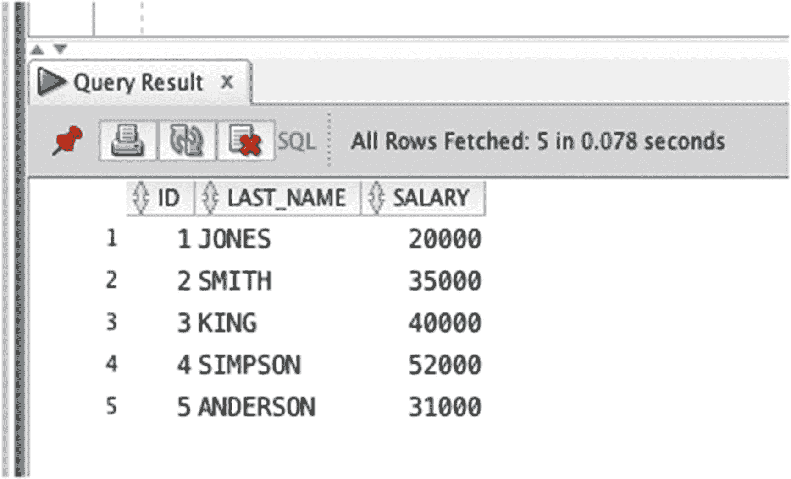

图 4-1

对 employee 表查询的结果

试想一下，当一个表有几十列甚至可能上百列时！有时我们不希望在查询结果中看到所有列。这可能是因为我们在应用程序的某个特定部分使用查询，而该部分只希望显示部分数据，而不是表中的所有数据。

在 SQL 中我们如何做到这一点？我们在 `SELECT` 子句中指定每一列。这种查询的语法如下：

```sql
SELECT column_name, column_name...
FROM table_name;
```

这个语法看起来与第 3 章中的非常相似。但是，我们不是指定 `*` 字符（表示所有列），而是指定我们要显示的每一列。我们用逗号分隔每个列名。语法末尾的三个点 “...” 仅表示列名语法可以重复。

还有一件事：我用到了一个我们尚未涵盖的术语，即 *子句（clause）*。子句是一行以关键字开头的 SQL 代码，并包含与该关键字相关的所有内容。

到目前为止，我们已经见过两个子句：

*   SELECT 子句，包含 `SELECT` 关键字及其后跟随的列。
*   FROM 子句，包含 `FROM` 关键字及其后跟随的任何内容，例如表名。

在本书中，我们将经常使用“子句”这个术语来指代查询的不同部分。


### 选择单列

我们的示例表 `employee` 包含三列：

*   `id`
*   `last_name`
*   `salary`

假设我们只想在结果中显示 `last_name` 列。我们可以通过在 `SELECT` 子句中指定 `last_name` 来实现：

```sql
SELECT last_name
FROM employee;
```

这意味着查询将仅在结果中显示 `last_name` 列，而不显示 `ID` 或 `salary` 列。这样的查询可用于应用程序中需要显示员工姓氏的部分。让我们在数据库上运行这个查询。

首先，如果尚未打开，请打开 `SQL Developer`。然后，通过双击你在前面章节创建的新用户连接来连接到你的数据库。这不是 `system` 用户：它是你创建的另一个用户。在图 4-2 中，这个连接被称为 `Intro`。

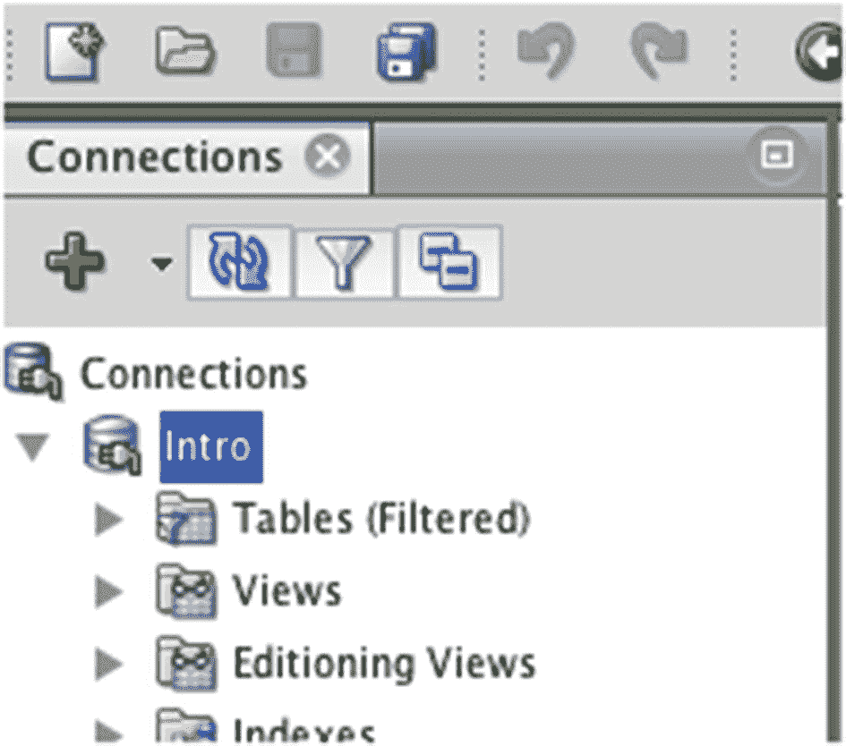

图 4-2 `SQL Developer` 中的连接

双击列表中的连接将使 `SQL Developer` 连接到数据库。屏幕上还会显示一个新的 `SQL worksheet` 窗口。

如果没有显示 `SQL worksheet` 怎么办？或者你把它关掉了？你可以很容易地打开一个新的。

具体操作如下：

1.  点击工具栏中间图标中的 `新建 SQL 工作表` 按钮。


图 4-3 新建 `SQL 工作表` 图标

2.  `选择连接` 窗口将如图 4-4 所示弹出。

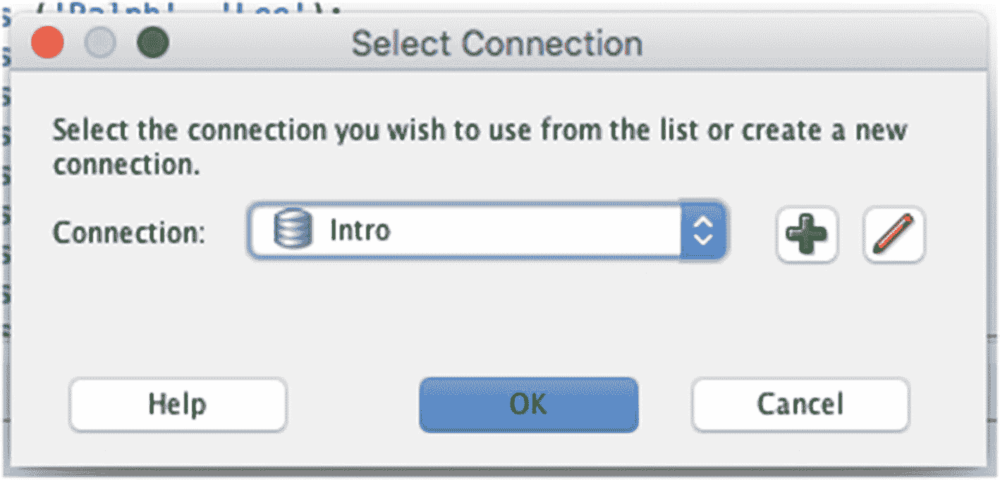

图 4-4 `选择连接` 窗口

3.  选择你想要使用的连接，例如 “Intro”，然后点击 `确定`。

将创建一个新的 `SQL 工作表`，它作为新选项卡显示在 `SQL Developer` 中，如图 4-5 所示。

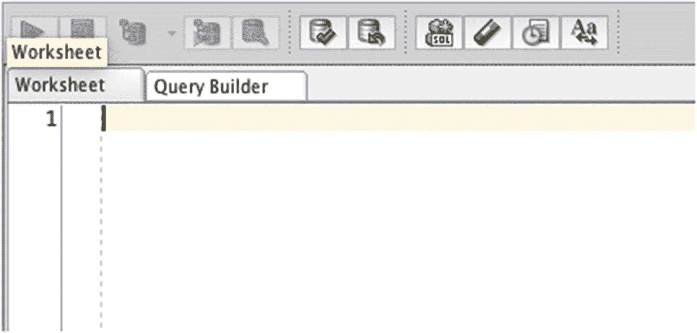

图 4-5 新工作表

一旦新文件作为新选项卡显示在屏幕上，你就可以输入你的查询了。让我们将前面示例中使用的查询输入到新窗口中，如图 4-6 所示。

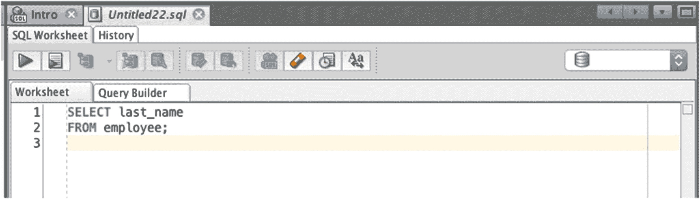

图 4-6 在 `SQL Developer` 中编写的查询

在运行查询之前，请注意窗口右上角的下拉框（如图 4-7 所示）。

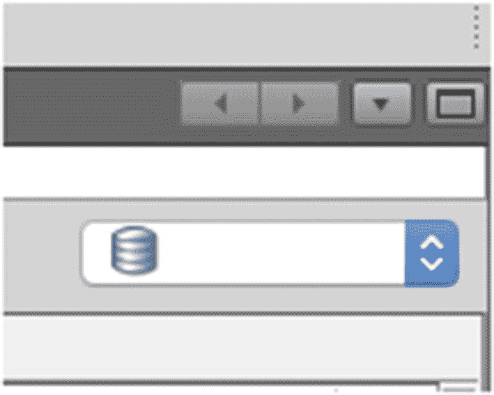

图 4-7 `SQL` 窗口的连接

这是用于此文件的连接。`SQL developer` 中的每个选项卡或文件都需要一个到数据库的连接才能运行代码。好处是，如果你正在处理多个用户或数据库，可以为每个选项卡设置一个独立的连接。

然而，这意味着我们必须在运行查询之前选择连接。这个框就是我们进行选择的地方。如果你忘记了这一步，当你第一次为此工作表点击 `运行语句` 时，`SQL Developer` 会提示你选择一个连接。

从列表中选择代表你新用户的连接。你的屏幕现在应如图 4-8 所示。

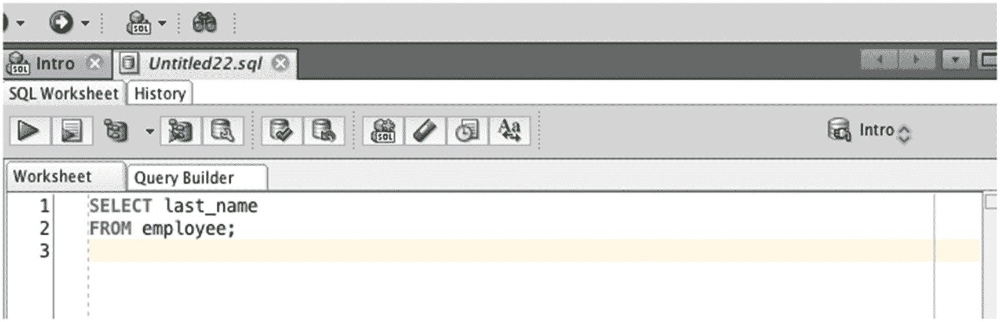

图 4-8 选择连接后的 `SQL` 查询

现在我们可以运行查询了。点击 `运行查询` 在数据库上执行它并查看结果（图 4-9）。

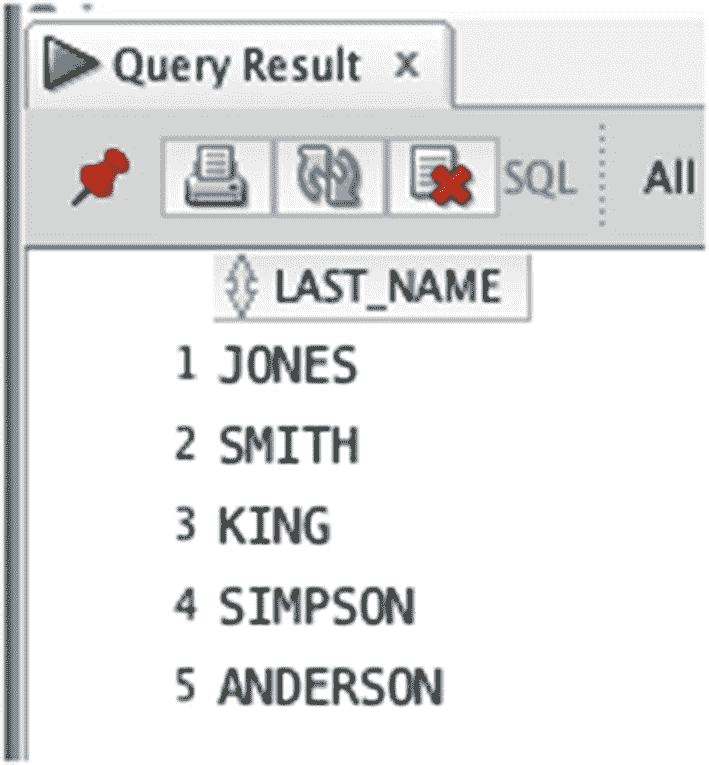

图 4-9 我们的查询结果

这里的结果只显示了 `employee` 表中的 `last_name`。它没有显示 `ID` 或 `salary` 列，因为我们没有在查询的 `SELECT` 子句中指定它们。

### 选择多列

在 `SQL` 中，你可以在 `SELECT` 子句中指定多个列。你可以通过指定多个用逗号分隔的列名来实现，正如我们在本章开头看到的：

```sql
SELECT column1, column2, column_n...
FROM your_table;
```

如果我们想同时显示 `ID` 和 `last_name` 列，我们的查询可以这样写：

```sql
SELECT id, last_name
FROM employee;
```

你可能会注意到逗号和下一个列名之间有一个空格。这个空格不是必需的。即使缺少空格，语句仍然会运行。例如，下面的写法可读性较差，但执行效果相同：

```sql
SELECT id,last_name
FROM employee;
```

不过，我认为有空格更容易阅读：

```sql
SELECT id, last_name
FROM employee;
```

这个查询将显示 `employee` 表中每条记录的 `id` 和 `last_name`。你可以在 `SQL Developer` 中以与前面示例相同的方式运行此查询。将其输入到 `SQL Developer` 中并点击 `运行语句` 按钮。运行查询前，你的屏幕应如图 4-10 所示；运行查询后应如图 4-11 所示。

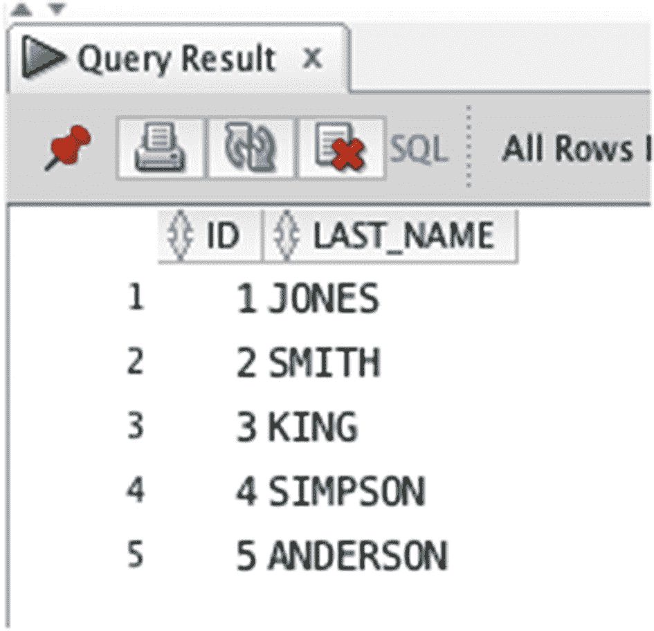

图 4-11 运行查询后

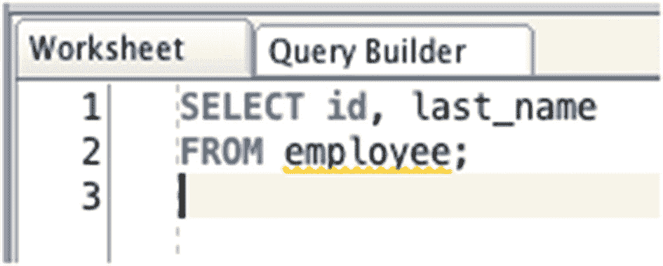

图 4-10 运行查询前

结果也可以这样表示：

| ID | LAST_NAME |
| --- | --- |
| 1 | JONES |
| 2 | SMITH |
| 3 | KING |
| 4 | SIMPSON |
| 5 | ANDERSON |

屏幕底部的结果将显示所有同时包含 `ID` 和 `last_name` 列的记录。

### 选择所有列

你可以使用相同的方法来显示表中的所有列。你可以选择编写 `SELECT *`，或者逐一列出所有列名。

本书前面介绍的 `SELECT *` 方法如下所示：

```sql
SELECT *
FROM employee;
```

例如，如果你想显示所有员工的 `ID`、`last name` 和 `salary`，你的查询可以这样写：

```sql
SELECT id, last_name, salary
FROM employee;
```

指定了三列，它们的名字用逗号分隔。两种方法将显示相同的结果：使用 `*` 选择所有列或单独选择所有列。

你可以在 `SQL Developer` 中输入此语句，如图 4-12 所示。

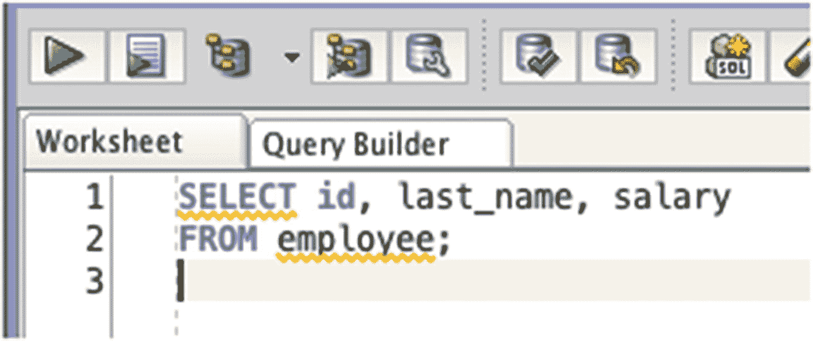

图 4-12 选择所有列

当你运行查询时，你将看到所有 `employee` 记录的 `id`、`last_name` 和 `salary`，如图 4-13 所示。

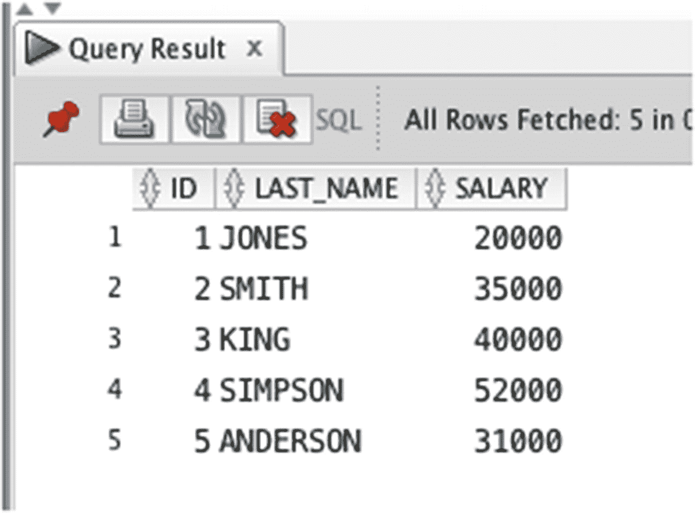

图 4-13 所有列的结果


### 选择特定列还是选择所有列？

如果你想显示表中的所有列，有两种方法可以实现：

*   使用 `SELECT *`

*   使用 `SELECT` 并单独指定每一列

哪种方法更好？你应该用哪一种？我推荐单独指定每一列。这意味着你的查询应该像这样：

```sql
SELECT id, last_name, salary
FROM employee;
```

而不是像这样：

```sql
SELECT *
FROM employee;
```

我为什么这么推荐？你可能在想，如果 `SELECT *` 更容易输入而且效果一样，为什么我不推荐它。这有几个原因。

首先，只显示你感兴趣或想要查看的列是个好习惯。仅仅因为你“可以”显示所有列，或者仅仅因为它更容易输入，并不是一个好习惯。单独输入列名只需要几秒钟（如果你使用像 `SQL Developer` 这样的程序，速度会更快）。显示所有列可能会导致查询运行变慢，也会使任何使用此查询的应用程序运行变慢，因为需要处理更多的数据。

其次，如果列名发生变化，或者增加了新列，使用 `SELECT *` 会影响查询和结果。具体指定列名则可以减少这个问题。

所以，请尽量单独指定列，而不要使用 `SELECT *`。

### 总结

你可以使用 SQL 从表中选择特定的列。你可以选择一列、多列或表中的每一列。推荐单独指定列，而不是使用 `SELECT *`，因为它更易于维护，并能减轻应用程序和数据库的负载。

## 5. 限制结果

我们刚刚学习了如何显示表中的特定列。在本章中，我们将探讨如何显示表中的特定行。

### 为什么要限制数据？

在之前的例子中，我们查看了表中的所有列，以及表中的一列或两列。其中一个查询是这样的：

```sql
SELECT id, last_name, salary
FROM employee;
```

此查询将显示表中所有员工的 `id`、`last_name` 和 `salary` 列。如果你不想看到表中的所有员工呢？在我们的示例表中，有五条记录。但如果表中有一百条或一千条记录呢？在你可能遇到的工作场所的真实数据库中，拥有超过一百万条记录的表并不罕见。

那么，为什么你只想显示部分记录呢？本质上，如果你有一个需求，只想显示符合特定条件的记录，那么你只需要在数据库中找到这些记录。

一些例子可能是：

*   查找特定员工的所有信息。

*   查找客户的所有订单。

*   查找特定年份的所有学生注册信息。

你可能会想：“我们不能直接获取表中的所有记录，然后让应用程序自己找出需要的吗？”我们可以这样做，但这会非常慢。从表中找出所有数据，将其从数据库发送到应用程序，然后由应用程序丢弃它不需要的记录，这将花费大量的时间和内存。它还会影响网络流量，因为将所有数据发送到应用程序通常会产生大量网络流量，并且比数据库在发送回数据之前检查行要慢得多。

更好的方法是只查找我们想要的数据，这样能更好地利用数据库和时间。幸运的是，在 SQL 中，我们可以使用 `WHERE` 子句轻松做到这一点。

### 什么是 WHERE 子句？

`WHERE` 子句是一个子句，它让你能够过滤查询的数据，只显示符合你指定条件的记录。正如我们在前面章节提到的，子句是 SQL 关键字及其后所有相关内容的组合。

`WHERE` 子句看起来像这样：

```sql
WHERE criteria
```

这个子句看似简单，但功能强大。你将 `WHERE` 子句放入 `SELECT` 查询中，紧跟在 `FROM` 子句之后。例如：

```sql
SELECT columns
FROM table
WHERE criteria;
```

分号被移到了语句的最后，在 `WHERE` 子句之后。

### 使用文本值的示例

让我们看一些例子。我们将从文本值开始。这是我们在上一章运行的查询，显示员工表中的所有记录。

```sql
SELECT id, last_name, salary
FROM employee;
```

我们的结果看起来像这样：

```sql
ID   LAST_NAME   SALARY
1    JONES       20000
2    SMITH       35000
3    KING        40000
4    SIMPSON     52000
5    ANDERSON    31000
```

假设你想查找 `last_name` 为 `SMITH` 的员工的所有列（或字段）。

你可以这样写查询：

```sql
SELECT id, last_name, salary
FROM employee
WHERE last_name = 'SMITH';
```

这个查询有几个新的组成部分：

*   首先，你添加了 `WHERE` 关键字。

*   然后，你指定了 `last_name` 列。这是因为你想将 `last_name` 列的值与另一个值进行比较。

*   接着，你添加了一个等号 "`=`"。

*   最后，你添加了 `'SMITH'`。这是因为你想查看所有 `last_name` 为 `SMITH` 的记录。

`SMITH` 被放在单引号内，因为这是你要查找的特定值。`SMITH` 这个值被称为“字符串”，这是软件开发中表示文本值的术语。`SMITH` 的值用单引号括起来，是因为你想让数据库知道你希望它被视为文本值，而不是列名。如果你没有使用单引号，你的查询看起来会是这样：

```sql
SELECT id, last_name, salary
FROM employee
WHERE last_name = SMITH;
```

然后，Oracle 数据库会查找一个名为 `SMITH` 的列，并会显示错误，因为该列不存在。所以，任何时候你要查找文本值，请确保它用单引号括起来：

```sql
SELECT id, last_name, salary
FROM employee
WHERE last_name = 'SMITH';
```

这个查询是如何工作的？Oracle 数据库将运行此查询，并检查员工表中的每一行，看该行的 `last_name` 是否等于 `'SMITH'`。如果是，则该行将包含在显示给你的结果中。如果不是，则不显示。如果你运行这个查询，你的输出将是：

`ID LAST_NAME SALARY`
`2  SMITH 35000`

只显示了一条记录，因为只有一条记录的 `last_name` 值是 `SMITH`。当你使用带有文本值的 `WHERE` 子句时，**值是区分大小写的**。本书前面提到，SQL 不是区分大小写的语言，这意味着 `SELECT` 和 `select` 的功能是相同的。

但是，在处理文本值时，例如 `'SMITH'`，这种检查是区分大小写的。这意味着查找 `'Smith'` 不会显示与查找 `'SMITH'` 相同的结果。

```sql
SELECT id, last_name, salary
FROM employee
WHERE last_name = 'Smith';
```

```sql
No results found.
```

这是因为表中的值等于 `'SMITH`，这与 `'Smith'` 不同。

#### 注意

文本值（那些在单引号内的）在 SQL 中是区分大小写的。所以，`'SMITH'` 不等于 `'Smith'`。

注意等号周围的空格。它们不是必需的，但没有它们，查询会更难阅读。例如：

```sql
SELECT id, last_name, salary
FROM employee
WHERE last_name="Smith";
```

这个查询可以执行，但我建议在像等号这样的运算符周围加上空格，以提高可读性。良好地使用空格可以使查询更容易被下一个需要维护它的程序员阅读。


### 数值示例

你并不总是需要按文本值进行筛选。你也可以按数值进行筛选。比如说，你想找出所有薪资为 52000 的员工。你的查询会像这样：

```sql
SELECT id, last_name, salary
FROM employee
WHERE salary = 52000;
```

这个查询与之前的查询有几个不同之处：

*   我们希望查看具有特定薪资的记录，因此我们指定了 `WHERE salary`。

*   我们不关心 `last_name` 的值是什么，所以我们从 `WHERE` 子句中移除了针对该列的任何条件。

*   我们还使用了等号，然后指定了一个数字：52000。这样做将显示所有薪资为 52000 的记录。

你可能会想，“美元符号怎么办？我能添加逗号作为千位分隔符吗？”你可能正尝试运行这样的查询：

```sql
SELECT id, last_name, salary
FROM employee
WHERE salary = $52000;
```

或者像这样：

```sql
SELECT id, last_name, salary
FROM employee
WHERE salary = 52,000;
```

好消息是，你不需要输入逗号和美元符号。良好数据库设计的因素之一是每列都具有合适的数据类型。虽然 `last_name` 列存储为文本值，但 `salary` 是存储为数字。

你不能在薪资列中存储货币符号（`$` 或 `€`），因为这意味着该字段不再是数字。然而，你可以将薪资存储为不含货币符号的数字，任何使用此薪资值的应用程序都可以决定如何显示该值（例如，添加货币符号）。

你也不需要存储任何逗号或其他字符作为千位分隔符。这些应该仅用于在报告或应用程序中显示数据，因此显示薪资的位置将决定是否需要任何千位分隔符。在数据库中，我们只存储数字值。你也可以在从数据库 `SELECT` 该列时添加它。

与 SQL 中的文本值不同，你不应将数值括在单引号中。指定 `salary = 52000` 将有效。

总结一下，我们的查询看起来像这样：

```sql
SELECT id, last_name, salary
FROM employee
WHERE salary = 52000;
```

如果你运行查询，结果将如下所示：

```
ID   LAST_NAME   SALARY
4    SIMPSON     52000
```

此结果显示了一条符合你条件的记录：`salary` 等于 52000。没有其他记录具有相同的 `salary` 值。

### 查找不等于某个值的行

到目前为止，你一直在查看精确匹配某些条件的记录。如果你想找到所有不匹配某些条件的记录怎么办？

在 SQL 中，你可以使用一个稍有不同的符号来查找不匹配某些条件的记录，该符号代表“不等于”。“不等于”操作由 `<>` 表示。这个符号是两个尖括号紧挨在一起。

让我们看一个查找不匹配特定条件的记录的示例，你想查看所有 `last_name` 不是 SMITH 的员工。

你的查询会像这样：

```sql
SELECT id, last_name, salary
FROM employee
WHERE last_name <> 'SMITH';
```

这个查询看起来与之前查找所有名为 SMITH 的员工的查询完全相同，只是我们使用了 `<>` 而不是 `=`。因此，我们新版本的查询将显示所有 `last_name` 不等于 SMITH 的记录。

```
ID   LAST_NAME   SALARY
1    JONES       20000
3    KING        40000
4    SIMPSON     52000
5    ANDERSON    31000
```

最后，还有另一个符号可用于表示不等于：`!=`。感叹号和等号也指定“不等于”。这意味着你的查询也可以这样写：

```sql
SELECT id, last_name, salary
FROM employee
WHERE last_name != 'SMITH';
```

结果将是相同的：

```
ID   LAST_NAME   SALARY
1    JONES       20000
3    KING        40000
4    SIMPSON     52000
5    ANDERSON    31000
```

如果有两个符号做同样的事情，你该使用哪一个？我建议使用两个尖括号 `<>`，因为它们是 SQL 标准的一部分，而 `!=` 不是。这使他人更容易理解，也便于未来的代码更改。

### 大于

我们已经看了等于和不等于。你还可以使用“大于”检查来查找记录，这意味着你可以找到某列大于特定值的所有记录。大于符号是 `>`，一个指向右边的单尖括号。

假设你想找到所有 `salary` 大于 35000 的 `employee` 记录。你的查询会像这样：

```sql
SELECT id, last_name, salary
FROM employee
WHERE salary > 35000;
```

就像查找等于某个数字的值一样，你不应将数字括在单引号中。这适用于你处理数字的所有工作。

这个查询将查看每条记录，确定 `salary` 是否大于 `35000`，如果是，则该记录将显示在结果中。如果不是，该记录将不会被显示。大于符号不包括与你指定的值匹配的值。因此，35000 的值不会被返回，但 35001 的值会被返回。

我们的结果将如下所示：

```
ID   LAST_NAME   SALARY
3    KING        40000
4    SIMPSON     52000
```

结果显示了 `salary` 大于 `35000` 的两条记录。它没有包括 `employee 'SMITH'`，因为他们的 `salary` 正好是 `35000`，并不大于 `35000`。

### 大于等于

如果你想包含那条 `'SMITH'` 记录怎么办？你可以将查询改为 `> 34999`。另一种方法是使用“大于等于”。可以使用 `>=` 符号来包含 `'SMITH'` 记录，该符号是大于符号和等号的组合。

如果你想编写一个查询，显示所有 `salary` 大于等于 `35000` 的 `employees`，它会像这样：

```sql
SELECT id, last_name, salary
FROM employee
WHERE salary >= 35000;
```

这个查询将显示以下结果：

```
ID   LAST_NAME   SALARY
2    SMITH       35000
3    KING        40000
4    SIMPSON     52000
```

它显示了 `'KING'` 和 `'SIMPSON'`，因为他们超过 35000，也显示了 `'SMITH'`，因为 35000 满足“大于等于 35000”的条件。它没有显示 `'JONES'` 或 `'ANDERSON'`，因为他们的 `salary` 值小于 35000。

### 小于

就像“大于”条件一样，你可以使用“小于”符号来查找小于某个值的记录。这个符号是 `<`。它的用法与大于符号相同。如果你想编写一个查询来显示所有 `salary` 小于 40000 的 `employees`，它会像这样：

```sql
SELECT id, last_name, salary
FROM employee
WHERE salary < 40000;
```

你的结果将是：

```
ID   LAST_NAME   SALARY
1    JONES       20000
2    SMITH       35000
5    ANDERSON    31000
```

表中的五条记录里，`'KING'` (40000) 和 `'SIMPSON'` (52000) 没有被显示，因为他们的 `salary` 值不小于 40000。`'KING'` 的 `salary` 值等于 40000，这并不小于 40000。


### 小于等于

SQL 支持“小于等于”检查，其方式与“大于等于”检查类似。它使用小于符号和等于符号的组合，即“`<=`”。要查看所有 `salary` 小于或等于 40000 的员工，可以使用如下查询：

```sql
SELECT id, last_name, salary
FROM employee
WHERE salary <= 40000;
```

该查询的结果如下：

```sql
ID   LAST_NAME   SALARY
1    JONES       20000
2    SMITH       35000
3    KING        40000
5    ANDERSON    31000
```

结果显示了 `'JONES'`、`'SMITH'` 和 `'ANDERSON'`，因为他们的 `salary` 都小于 40000。结果显示了 `'KING'`，因为他们的 `salary` 等于 40000。总之，可以使用的不同符号如表 5-1 所示。

**表 5-1 可用的比较运算符**

| 含义 | 符号 |
| --- | --- |
| 等于 | `=` |
| 不等于 | `<>` 或 `!=` |
| 大于 | `>` |
| 大于等于 | `>=` |
| 小于 | `<` |
| 小于等于 | `<=` |

### 最佳实践

SQL 中的 `WHERE` 子句非常灵活，正如你在本章所见，整个 SQL 语言也是如此。你的查询的格式和结构可以与其他人编写显示相同结果的查询方式不同。

对于改进你对 `WHERE` 子句及整个查询的使用，我可以提供一些“最佳实践”或提示。这将确保你的查询易于阅读，并且易于你自己和他人将来理解。

#### 将列名放在左侧

在编写 `WHERE` 子句时，你应该将列名放在左侧，将值或其他列放在每个比较语句的右侧。这使代码保持一致且更易于阅读。这意味着你的查询应该这样写：

```sql
WHERE last_name = 'SMITH'
```

而不是：

```sql
WHERE 'SMITH' = last_name
```

两个 `WHERE` 子句的作用相同，但第一个遵循了更常见的格式，我认为更具可读性。大多数有 SQL 经验的程序员都期望列名在左侧，字面值在右侧。

#### 只选择你需要的

在 `WHERE` 子句中提到的列不必在 `SELECT` 子句中列出。你可以在不需要将数据发送回应用程序的情况下，基于某个值进行筛选。

例如，假设你想查看所有 `salary` 小于 40000 的员工 `ID`。你可以在 `SELECT` 和 `WHERE` 子句中都列出 `salary`：

```sql
SELECT id, salary
FROM employee
WHERE salary < 40000;
```

然而，通过在 `SELECT` 子句中列出 `salary` 列，当应用程序不需要这些值时，你仍然会导致所有 `salary` 值通过网络发送，或者可能暴露需要保护且保密的数据。

一个更高效的查询版本如下：

```sql
SELECT id
FROM employee
WHERE salary < 40000;
```

数据库引擎仍然可以基于 `salary` 列筛选结果。但是，只有 `ID` 值会通过网络发送到应用程序。网络流量减少了，你的应用程序用户也不会等待不需要的数据被发送，或者不会将 `salary` 数据显示给不应看到的人。

### 总结

你可以使用 `WHERE` 子句来筛选结果，它涉及 `WHERE` 关键字和一些条件。这意味着你可以只显示你感兴趣的记录。使用 `WHERE` 子句筛选数据可以通过多种方式完成，使用诸如等于、不等于、大于和小于等符号。

## 6. 比较数据

你刚刚学习了如何限制要显示的行，使用了多种方法，例如等于或大于。这些方法中的每一种都将一个列与另一个值进行比较。这个另一个值是通过“精确匹配”来检查的。检查时使用的是你指定的确切值。

例如，考虑这个 `WHERE` 子句：

```sql
WHERE last_name = 'SMITH'
```

这个 `WHERE` 子句将返回所有 `last_name` 等于 `'SMITH'` 的行。它不会返回 `last_name` 是以下任何值的记录：

*   Smith
*   SMITHERS
*   SMITHSONIAN
*   Naismith
*   SMIT

这就是精确匹配的作用。但如果你想匹配部分值呢？

### 什么是部分匹配？

在之前的例子中，你查找了所有 `last_name` 为 `'SMITH'` 的 `employee` 记录。如果你想查找所有 `last_name` 以字母 S 开头的 `employee` 记录呢？

你可以编写一个如下查询：

```sql
SELECT id, last_name, salary
FROM employee
WHERE last_name = 'S';
```

如果你运行这个查询，会得到以下结果：

```sql
No results found.
```

你没有得到任何结果，因为没有任何 `last_name` 值等于 `'S'`。“等于”和“以...开头”在 SQL 及一般的编程中是不同的概念。能够找到“以”某个值“开头”的记录的能力被称为*部分匹配*。

部分匹配是能够匹配部分值的能力。它不是检查一个值是否完全等于另一个值，而是通过部分匹配我们可以检查：

*   以某个值开头
*   以某个值结尾
*   包含某个值
*   其他值的组合

你可以通过在 SQL 中使用 `LIKE` 关键字来执行部分匹配。

### LIKE 的语法

`LIKE` 关键字可以在 `WHERE` 子句中代替等号使用：

```sql
WHERE column LIKE compare_string
```

你从像之前见过的 `WHERE` 子句开始，然后指定你想要查找的列。接着使用 `LIKE` 关键字并指定一个 `compare_string`，即你要查找的值。

如何编写这个比较字符串？你需要使用所谓的*通配符字符*。通配符字符是用来代表任何其他字符的字符。通过一个例子可以更好地解释这一点。

### 百分号通配符

在前面的例子中，您想查找所有以 “S” 开头的 `last_name`。为此，您可以使用百分号通配符，即 “%”。它代表“零个或多个字符”，即任何字母、数字或符号。

您可以使用这样的 `WHERE` 子句：

```sql
WHERE last_name LIKE 'S%'
```

这将查找 `last_name` 值以 “S” 作为第一个字符，然后后面是零个或多个字符的记录，无论这些字符是什么。

这将显示如下值：

*   SMITHERS
*   Smith
*   SIMPSON
*   Stanley
*   Sum
*   So

您能看出规律吗？所有这些值都以 “S” 开头，后面有零个或多个字符。实际跟随的字符无关紧要，只需有一个或多个即可。

您可以编写查询来显示此数据：

```sql
SELECT id, last_name, salary
FROM employee
WHERE last_name LIKE 'S%';
```

您的结果将是：

```sql
ID   LAST_NAME   SALARY
2    SMITH       35000
4    SIMPSON     52000
```

您可以看到两个结果，一个是 `'SMITH'`，一个是 `'SIMPSON'`。两者都以 “S” 开头。另外有两个记录也包含 “S”（`'ANDERSON'` 和 `'JONES'`），但它们没有被显示，因为您的条件是 “S%”，意味着 `last_name` 需要以单个 S 开头，后面是其他字符。值 `'ANDERSON'` 和 `'JONES'` 不以 S 开头。

如果您想显示那些记录呢？如果您想查找所有 `last_name` 中包含 “S” 的记录呢？您可以通过在 S 前面和后面都放置 % 符号来实现：

```sql
SELECT id, last_name, salary
FROM employee
WHERE last_name LIKE '%S%';
```

您的结果将如下所示：

```sql
ID   LAST_NAME   SALARY
1    JONES       20000
2    SMITH       35000
4    SIMPSON     52000
5    ANDERSON    31000
```

显示这些值是因为它们在 `last_name` 值的任何位置都包含一个 S。它可能在开头、中间或结尾。

您也可以查找以 S 结尾的值，通过在比较字符串的开头放置一个 “%” 符号但不在结尾放置。您的查询将如下所示：

```sql
SELECT id, last_name, salary
FROM employee
WHERE last_name LIKE '%S';
```

我们的结果将如下所示：

```sql
ID   LAST_NAME   SALARY
1    JONES       20000
```

如前所示，百分号通配符对于在字符串的任何位置查找一个或一组字符很有帮助。

### 下划线通配符

Oracle SQL 中可用的另一个通配符是下划线字符 “_”。下划线字符用于表示零个或一个任意类型的字符。它与百分号字符类似，后者表示零个或多个字符，区别在于下划线在使用通配符的位置最多允许一个字符。

假设您有这样的 `WHERE` 子句：

```sql
WHERE last_name LIKE 'SA_'
```

您的结果将包括：

*   SAM
*   SAL
*   SAr
*   SA

然而，您的结果**不会**包括：

*   SALL
*   SANDERS
*   SAWS
*   Sam

这是因为下划线的位置最多只允许一个字符，而第二组例子有两个或更多字符（或者不是以 “SA” 开头）。

假设您想查找每个 `last_name` 是单个字符后跟 `'ING'`。您的查询将如下所示：

```sql
SELECT id, last_name, salary
FROM employee
WHERE last_name LIKE '_ING';
```

结果将是：

```sql
ID   LAST_NAME   SALARY
3    KING        40000
```

此结果显示 `'KING'` 的值，因为它包含一个单个字符，后跟字符 `'ING'`。如果表中有 `last_name` 值为 `'BING'` 或 `'LING'` 的记录，它们也会被显示。

您也可以混合使用百分号和下划线字符，或任意数量的这两种字符来查找您想要的记录。假设您想查找所有 `last_name` 中包含 ‘SO’ 但后面只有一个字符的记录。您的查询将是：

```sql
SELECT id, last_name, salary
FROM employee
WHERE last_name LIKE '%SO_';
```

`WHERE` 子句将 `last_name` 与 `'%SO_'` 进行比较，这代表任意数量的字符，然后是字符 SO，然后是零个或一个字符。您的结果将是：

```sql
ID   LAST_NAME   SALARY
4    SIMPSON     52000
5    ANDERSON    31000
```

`'SIMPSON'` 和 `'ANDERSON'` 都被显示，因为它们包含字符 `'SO'` 并且后面有一个字符。

假设您想查找所有 `last_name` 包含字母 I 作为第二个字符并且在那之后任何位置包含字母 N 的记录。您的查询将是：

```sql
SELECT id, last_name, salary
FROM employee
WHERE last_name LIKE '_I%N%';
```

这个比较字符串 `'_I%N%'` 可以解释为：

*   一个下划线，代表任意单个字符
*   一个 I，位于第二个位置
*   一个 %，代表零个或多个任意字符
*   一个 N，需要在 I 之后但在任何位置
*   一个 %，代表 N 之后的零个或多个任意字符

此查询的结果将是：

```sql
ID   LAST_NAME   SALARY
3    KING        40000
4    SIMPSON     52000
```

`'KING'` 和 `'SIMPSON'` 都符合 `WHERE` 子句条件。`'KING'` 中的 N 紧跟在 I 之后，`'SIMPSON'` 中的 N 在值的末尾。


### 搜索通配符字符

在本章中，你已经学习了如何使用通配符字符 `%` 和 `_` 来查找部分匹配某个值的记录。这些 `%` 和 `_` 字符在查询运行时会被其他字符替代。但是，如果列中的值实际包含 `%` 字符或 `_` 字符怎么办？

假设你的 `employee` 表中存在一个包含下划线的值。这条记录可能是由应用程序在开发过程中放置在那里的，你需要了解更多相关信息。该记录看起来像这样：

```
ID   LAST_NAME            SALARY
11   confirmation_needed  (null)
```

“confirmation_needed” 这个 `last_name` 并不是一个有效的 `last_name`。你想编写一个查询来查找所有 `last_name` 中包含下划线字符的 `employees`。你可以这样写查询：

```
SELECT id, last_name, salary
FROM employee
WHERE last_name LIKE '%_%';
```

当你运行这个查询时，会得到以下结果：

```
ID   LAST_NAME           SALARY
1    JONES               20000
2    SMITH               35000
3    KING                40000
4    SIMPSON             52000
5    ANDERSON            31000
11   confirmation_needed 0
```

这显示了表中的所有记录。查询正在搜索 ‘%_%’，这意味着“所有字符，后跟一个字符，再后跟所有字符”。如何搜索包含下划线的所有字符呢？你需要指定下划线应被视为一个值，而不是通配符字符。这需要对字符进行*转义*。

转义字符意味着你希望该字符被视为列值的一部分，而不是一个特殊符号（例如通配符）。在包括 SQL 在内的许多编程语言中都可以对字符进行转义。要在 SQL 中转义一个字符，你需要做两件事：

*   在要转义的字符前立即指定一个字符
*   在你的 `WHERE` 子句中指定这个转义字符是什么

常用的转义字符是反斜杠字符 ‘\’，因为它很少在你的数据中使用。如果确实使用了，你可以选择另一个字符。

要在查询中使用转义字符，你需要这样编写查询：

```
SELECT id, last_name, salary
FROM employee
WHERE last_name LIKE '%\_%' ESCAPE '\';
```

这个查询与前一个查询相比有两个变化。首先，在 `LIKE` 关键字后的字符串中有一个 \ 字符。这个字符表示后续字符（下划线）被“转义”。其次，在 `WHERE` 子句末尾添加了一个关键字：`ESCAPE` ‘\’。这意味着转义字符被定义为 ‘\’ 字符。如果没有添加这个 `ESCAPE` 关键字，Oracle 将不会知道 `LIKE` 字符串中的 ‘\’ 是什么意思。

这个更新后的查询结果是：

```
ID   LAST_NAME           SALARY
11   confirmation_needed 0
```

如你所见，更新后的查询将只显示 `last_name` 值包含下划线的记录。

### 性能

关于 `LIKE` 关键字需要了解的另一点是，使用该关键字的查询性能通常不是很好。

如果你使用精确匹配，Oracle 通常可以扫描列中的所有值并找到匹配的值。然而，使用带有 `LIKE` 关键字的部分匹配需要更长时间，因为 Oracle 需要查看每个值并应用你的条件。

我们不会在本书中过多讨论 Oracle SQL 的性能，但我想指出，`LIKE` 关键字的性能表现并不好。如果确实需要，你应该使用它；如果可以用其他方法（例如“等于”）实现，就使用其他方法。

### 总结

`=` 符号和其他符号用于执行精确匹配或完全匹配指定值。在 SQL 中，另一种选择是部分匹配，它匹配值的一部分。这些值的部分可以通过 `LIKE` 关键字和使用通配符 `%` 和 `_` 来指定。

## 应用多个过滤器

在前面的章节中，你已经学习了如何限制你想查看的记录。你研究了使用诸如“等于”和“大于”之类的符号。你还学习了如何使用 `LIKE` 关键字和通配符字符进行部分匹配。

这些概念很有用。然而，你可能已经注意到，我们在每个查询中只按一个条件进行了过滤。我们基于特定的 `last_name` 值或特定的 `salary` 值进行过滤。如果我们想基于两个或更多条件进行过滤呢？

### 为什么使用多个过滤器？

为什么要在 SQL 查询中使用多个过滤器？这完全取决于查询的类型或你想要的结果。对于我们正在使用的示例，使用 `WHERE` 子句执行单个过滤可能没问题，但当你处理更多数据或想要显示不同的结果时，你就需要学习如何使用多个过滤器。

一些例子可能是：

*   查找特定客户在某个日期范围内的所有订单
*   查找所有活跃且处于特定状态的学生
*   查找所有在线订购且订单金额超过特定数额的客户

每种这样的查询都在查看两个或更多条件。你将学习如何使用你的示例数据来实现这一点。

### AND 关键字

SQL 允许你在 `WHERE` 子句中使用多个条件，以将数据限制为你想要查看的记录。有两种方法可以做到这一点。第一种方法是使用 `AND` 关键字。

`AND` 关键字让你可以在 `WHERE` 子句中指定两个条件。如果一条记录满足这两个条件，它就会被显示。如果一条记录满足零个或一个条件，那么它就不会被显示。如果你想检查查询中的多个条件，并且两个条件都需要匹配某一行，那么 `AND` 关键字非常有用。

使用 `AND` 关键字如下所示：

```
WHERE condition
AND condition
```

这可以分解为：

*   以 `WHERE` 关键字开头，表示 `WHERE` 子句的开始。
*   `condition`：一行要被显示所必须满足的条件（例如，`last_name = 'SMITH'`）
*   `AND`：表示一行还必须满足第二个条件。
*   `condition`：如前所述，一行要被显示所必须满足的条件

让我们看一些使用 `AND` 关键字的多条件示例。

#### 查找匹配姓氏和薪资的记录

假设你想查找 `last_name` 包含字母 “S” 且 `salary` 大于 32000 的记录。你的查询将如下所示：

```
SELECT id, last_name, salary
FROM employee
WHERE last_name LIKE '%S%'
AND salary > 32000;
```

在这个查询中，`AND` 被写在新行上以使其更易于阅读。即使你将 `AND` 与 `WHERE` 放在同一行，查询仍然会运行（你可能更喜欢那样写）。这个查询的结果将是：

```
ID   LAST_NAME   SALARY
2    SMITH       35000
4    SIMPSON     52000
```

此查询显示了 `'SMITH'` 和 `'SIMPSON'` 的记录，因为它们的 `salary` 都大于 32000 且 `last_name` 中都包含 “S”。`'JONES'` 和 `'ANDERSON'` 的记录在 `last_name` 中都有 “S”，但他们的 `salary` 小于 32000。`'KING'` 的记录 `salary` 大于 32000，但 `last_name` 中没有 “S”。因此，只显示了 `'SMITH'` 和 `'SIMPSON'`。


#### 使用 AND 关键词对两列进行大于和小于查询以查找记录

使用 `AND` 关键词的另一个例子是使用除等于和 `LIKE` 之外的其他比较运算符。假设你想查找 `ID` 大于或等于 3 且 `salary`（工资）小于 40000 的记录。你的查询语句会是这样的：

```sql
SELECT id, last_name, salary
FROM employee
WHERE id >= 3
AND salary < 40000;
```

结果会是这样：

```
ID   LAST_NAME   SALARY
5    ANDERSON    31000
```

这是唯一显示的记录，因为尽管 `KING` 和 `SIMPSON` 的 `ID` 大于或等于 3，但他们的 `salary` 并不小于 40000。

### OR 关键词

在查询中使用多个筛选条件的第二种方法是使用 `OR` 关键词。`OR` 关键词的使用方式与 `AND` 关键词相同。然而，区别在于 `OR` 表示两个条件中至少有一个需要满足，而不像 `AND` 关键词那样需要两个条件都满足。

使用 `OR` 关键词的语法如下：

```sql
WHERE condition
OR condition
```

`OR` 关键词的工作方式与 `AND` 关键词相同。它用在 `WHERE` 子句中，你可以用它来指定第二个要检查的条件。如果对于某一行，两个条件中的任何一个（或两个）为真，那么该行就会包含在结果中。`OR` 关键词对于检查多个条件并查看至少有一个条件为真的结果非常有用。

#### 使用 OR 关键词按姓氏或工资查找记录

让我们看看之前使用 `OR` 而不是 `AND` 重写的例子。你想查找 `last_name`（姓氏）包含字母“S”，或者 `salary` 大于 32000 的记录。你的查询语句会是这样的：

```sql
SELECT id, last_name, salary
FROM employee
WHERE last_name LIKE '%S%'
OR salary > 32000;
```

你的结果会是这样：

```
ID   LAST_NAME   SALARY
1    JONES       20000
2    SMITH       35000
3    KING        40000
4    SIMPSON     52000
5    ANDERSON    31000
```

结果显示了表中的每一条记录。`last_name` 为 `'JONES'`、`'SMITH'`、`'SIMPSON'` 和 `'ANDERSON'` 的记录被显示，因为它们 `last_name` 中都包含“S”。`'KING'` 的记录被显示是因为他们的 `salary` 大于 32000。有些记录只满足两个条件中的一个（`last_name` 中包含“S” 或 `salary` 大于 32000），但这没关系；它们仍然被包含在结果中。

#### 使用 OR 关键词对两列进行大于或小于查询以查找记录

让我们看另一个使用 `OR` 的例子。你可能想查看所有 `ID` 大于或等于 4，或者 `salary` 小于 40000 的记录。

```sql
SELECT id, last_name, salary
FROM employee
WHERE id >= 4
OR salary < 40000;
```

结果会是这样：

```
ID   LAST_NAME   SALARY
1    JONES       20000
2    SMITH       35000
4    SIMPSON     52000
5    ANDERSON    31000
```

我们可以解释表中每条记录的处理方式：

*   `JONES`：显示是因为 `salary` 小于 40000。
*   `SMITH`：同样显示是因为 `salary` 小于 40000。
*   `KING`：未显示，因为 `salary` 不小于 40000 且 `ID` 不大于或等于 4。
*   `SIMPSON`：显示是因为 `ID` 大于或等于 4。
*   `ANDERSON`：显示是因为 `ID` 大于或等于 4 且 `salary` 小于 40000。

### 超过两个条件

你已经看到几个关于 `AND` 和 `OR` 带有两个条件的例子。如果你想使用超过两个条件怎么办？你可以在 SQL 中使用 `AND` 和 `OR` 来做到这一点。你只需在 `WHERE` 子句末尾添加另一个 `AND` 或 `OR`：

```sql
WHERE condition
[{AND|OR} condition]
[{AND|OR} condition]
```

当你阅读 SQL 文档时，会看到类似的语法。方括号 `[` 和 `]` 表示其中的部分是可选的。花括号 `{` 和 `}` 表示其中的部分是必需的。最后，竖线 `|` 表示必须选择其中一个选项。

因此，这个语法意味着你需要有一个 `WHERE` 条件，然后你可以有一个 `AND` 或 `OR` 条件。如果你确实有一个 `AND` 或 `OR` 条件，你需要写成 `AND condition` 或 `OR condition`。

你可以在查询中添加更多 `AND` 或 `OR` 条件。你还可以在查询中使用 `AND` 和 `OR` 的不同组合。

#### 多个 AND 条件

让我们看一些例子。你可能想查看所有 `last_name` 包含“S”且 `salary` 大于 30000 并小于 40000 的 `employees`（员工）。你的查询语句会是这样的：

```sql
SELECT id, last_name, salary
FROM employee
WHERE last_name LIKE '%S%'
AND salary > 30000
AND salary < 40000;
```

你的结果会是这样：

```
ID   LAST_NAME   SALARY
2    SMITH       35000
5    ANDERSON    31000
```

这显示了 `'SMITH'` 和 `'ANDERSON'`，因为他们满足查询中的所有三个条件：

*   `last_name` 包含“S”。
*   `salary` 大于 30000。
*   `salary` 小于 40000。

#### 多个 OR 条件

让我们看一个使用多个 `OR` 关键词的例子。假设你想查看所有 `salary` 小于 25000，或 `salary` 大于 50000，或 `last_name` 包含“G”的 `employee` 记录。你的查询语句会是这样的：

```sql
SELECT id, last_name, salary
FROM employee
WHERE salary < 25000
OR salary > 50000
OR last_name LIKE '%G%';
```

此查询的结果将是：

```
ID   LAST_NAME   SALARY
1    JONES       20000
3    KING        40000
4    SIMPSON     52000
```

`'JONES'` 的记录显示是因为 `salary` 小于 25000。`'KING'` 的记录显示是因为 `last_name` 包含 G，`'SIMPSON'` 显示是因为 `salary` 大于 50000。对于一行要显示，只需要其中一个条件为真。

#### 组合多个 AND 和 OR 条件

如果你想混合使用这些关键字，在一个查询中同时放入 `AND` 和 `OR` 呢？你可以这样做。假设你有这个查询：

```sql
SELECT id, last_name, salary
FROM employee
WHERE last_name LIKE '%S%'
AND salary > 30000
OR salary < 40000;
```

你有 `condition1 AND condition2 OR condition3`。这些结果会是什么样子呢？它会是这样：

```
ID   LAST_NAME   SALARY
1    JONES       20000
2    SMITH       35000
4    SIMPSON     52000
5    ANDERSON    31000
```

如何得到这个结果？`AND` 和 `OR` 关键字按照特定的顺序进行求值。这被称为*运算顺序*（order of operations）。这个概念适用于 SQL 的多个领域，你可能在数学课上也记得它，当时一些运算比其他运算具有更高的优先级。

`AND` 和 `OR` 都具有相同的优先级。它们按顺序使用。因此，对于这个查询，逻辑是显示满足以下条件的记录：

*   `last_name` 包含 S 且 `salary` 大于 30000
*   或者，`salary` 小于 40000

现在这是两个独立的条件。`'SMITH'`、`'SIMPSON'` 和 `'ANDERSON'` 的记录被显示，因为它们满足第一个标准：`last_name` 包含 S 且 `salary` 大于 30000。`'JONES'` 被显示是因为它的 `salary` 小于 40000。`'KING'` 未被显示。


### 使用多个条件指定顺序

如果你想按特定顺序检查条件怎么办？你可以使用括号：“(” 和 “)”。在查询中添加括号将强制查询以某种方式运行。括号内的操作先运行，然后再与括号外的操作组合。让我们看这个例子：

```sql
SELECT id, last_name, salary
FROM employee
WHERE last_name LIKE '%N%'
AND salary > 50000
OR last_name LIKE '%T%';
```

这将显示符合以下条件的记录：

*   `last_name` 包含 “N” 且 `salary` 大于 50000
*   或者，`last_name` 包含 “T”。

这将显示以下结果：

```sql
ID   LAST_NAME   SALARY
2    SMITH       35000
4    SIMPSON     52000
```

如果你想显示一组不同的记录，你会这样编写查询：

```sql
SELECT id, last_name, salary
FROM employee
WHERE last_name LIKE '%N%'
AND (salary > 50000
OR last_name LIKE '%T%');
```

注意括号围绕着两个条件和 `OR` 关键字。这意味着这些条件先运行，然后与第一个条件组合。这将显示符合以下条件的记录：

*   `salary` 大于 50000 或 `last_name` 包含 “T”
*   并且 `last_name` 包含 “N”。

此查询的结果将是：

```sql
ID   LAST_NAME   SALARY
4    SIMPSON     52000
```

每条记录都满足这些条件。如果在 `WHERE` 子句中没有括号，结果就会不同。`'SMITH'` 的记录在第一个结果中显示而不在第二个中显示的原因在于，第一个查询显示了所有 `last_name` 包含 “T” 的记录，而第二个查询只显示了 `last_name` 包含 “T” 且 `salary` 大于 50000 的记录。

### 总结

你可以通过组合使用 `AND` 和 `OR` 关键字在 SQL 查询中使用多个筛选器。`AND` 关键字将检查记录是否满足指定的所有条件，而 `OR` 关键字将检查记录是否满足指定的至少一个条件。查询中可以添加许多 `AND` 和 `OR` 关键字，它们按书写顺序运行。如果你想确保它们按特定顺序运行，可以将条件和关键字用括号括起来。

## 8. 处理 Null 值

在本章中，你将学习 SQL 和数据库中称为“null”的概念。在你一直使用的示例表中，每条记录的每个列都有一个值。然而，在处理真实数据库时，情况并非总是如此。“null”这个概念用于数据未知的情况。

### 缺失数据

在真实数据库中，可能会出现数据缺失的情况。这可能是故意的（我们不知道值是什么），或者是某种错误（本应有值却没有）。数据库中的表不要求你在每一行每一列都存储一个值。

到目前为止，我们在本书中一直使用一个名为 `employee` 的示例表。该表如下所示：

```sql
ID   LAST_NAME   SALARY
1    JONES       20000
2    SMITH       35000
3    KING        40000
4    SIMPSON     52000
5    ANDERSON    31000
```

该表有五行和三列。每行的每个列都有一个值。然而，情况并非总是如此。值可能会缺失。如果某个 `employee` 的 `salary` 未知怎么办？或者我们表中还有其他列，例如 `date of birth`，而某些 `employee` 的这些信息未知？

这是处理数据库时的一种有效场景。问题是：我们如何存储它？假设你有一个新 `employee`，但你目前不知道他们的 `salary` 是多少。可以这样表示：

```sql
ID   LAST_NAME   SALARY
1    JONES       20000
2    SMITH       35000
3    KING        40000
4    SIMPSON     52000
5    ANDERSON    31000
6    COOPER      Unknown
```

在这个例子中，我们使用了一个文本值 “Unknown”，来指明我们不知道新 `employee` 的 `salary` 值。但这并不是一个好主意。

首先，`salary` 列是一个数字列，这意味着它只存储数字而不是文本值。在这个数字列中使用文本值 “Unknown” 会在尝试添加时导致错误。

你不应该为了允许出现这个 “Unknown” 值而将 `salary` 列的类型更改为文本值。嗯，你可以这样做，但那样你可以对数据库中的每个字段都这样做，这将意味着数据类型完全失去作用。

如果你使用 “n/a” 的值呢？出于同样的原因，这也不行。将文本值添加到数字列是不可能的。而且，有什么理由说 “n/a” 的值在这个字段或其他字段中不是合法值呢？它可能对 `salary` 无效，但如果有一个名为 `commission` 的列存储员工的佣金金额呢？“n/a” 的值可能意味着佣金不适用于该特定员工。

如果你使用 0 呢？你可以使用 0，但 0 值表示“`salary` 是零”。你想捕捉的事实是 `salary` 未知，而未知与 0 是不同的。如果你使用 0，你将不得不调整所有查看 `salary` 列的查询，忽略那些 `salary` 为 0 的记录，因为它会扭曲任何总计或平均值。

如果你使用一个空格字符 “ ” 呢？这是一个选项，但它面临着与 “Unknown” 和 “n/a” 相同的问题，因为它是一个试图添加到数字字段的文本值。

使用空字符串怎么样，这意味着引号内没有任何内容：‘ ’？你可以试试这个，但空字符串在 SQL 中的处理方式不同。它仍然是一个文本值，这意味着在尝试用于数字或日期字段时会有问题。

所以，你不能使用像 “n/a”、或 0、或 “ ”、或空字符串这样的文本值。你能用什么？你可以使用 `NULL` 值。

### 什么是 NULL？

`NULL` 这个词是一个关键字，意思是“一个未知值”。它用于表示数据库表中的未知或缺失值。提供这个关键字是因为未知值不同于空字符串、空格、零或其他可能有含义（如 “n/a” 或 “FALSE”）的文本值。

`NULL` 值在数据库中使用相当频繁，因为无法保证所有字段总是有数据。在数据库中使用 `NULL` 值（相对于零或空字符串）有什么优势？

*   `NULL` 适用于任何列类型：文本、数字、日期。你不需要为了使用它而更改列的类型。
*   `NULL` 有自己的一套用于执行逻辑的关键字，因为它是一个特殊值。
*   有一系列函数可以与 `NULL` 一起使用。
*   它不占用存储空间，这对于小表来说可能不是问题，但对于大表可能有帮助。

### 应该如何处理 NULL？

`NULL` 值需要特殊的处理方式，这可能是它们唯一的缺点。在本书中，你将学习如何处理 `NULL` 值，但你将结合目前所学查看一些与 `NULL` 值相关的例子和处理方式。

你刚刚学习了如何使用等于和大于等符号检查列值是否与其他值匹配。这对于文本、数字和日期值都适用。但是，它不适用于 `NULL` 值。一个值不能“等于” `NULL`，因为 `NULL` 是一个未知值。要检查一个值是否是 `NULL`，我们使用关键字 `IS NULL`。你的 `WHERE` 子句应该像这样：

```sql
WHERE salary IS NULL;
```

如果你使用等号来写，它不会找到任何内容：

```sql
WHERE salary = NULL;
```

让我们看一些例子来解释这一点。

### 处理 NULL 的示例

你将看到一些在数据库中处理 `NULL` 值的例子。首先，你需要在表中添加一些 `NULL` 值，以便可以编写处理它们的 `SELECT` 查询。


### 添加更多数据

你的表格当前如下所示：

```
ID   LAST_NAME   SALARY
1    JONES       20000
2    SMITH       35000
3    KING        40000
4    SIMPSON     52000
5    ANDERSON    31000
```

你应该向表格中添加一个新行，该行的 `salary` 列具有 `NULL` 值，以及另一个新行，该行的 `last_name` 和 `salary` 列都具有 `NULL` 值。

```
ID   LAST_NAME   SALARY
1    JONES       20000
2    SMITH       35000
3    KING        40000
4    SIMPSON     52000
5    ANDERSON    31000
6    COOPER      NULL
7    NULL        NULL
```

让我们将这些数据添加到我们的表中。

1.  打开 SQL Developer 并连接到数据库（如果尚未连接，请按照前面章节所示的步骤操作）。
2.  点击连接名称旁边的箭头，然后点击“Tables (Filtered)”旁边的箭头将其展开，并点击 `EMPLOYEE`，如图 8-1 所示。

    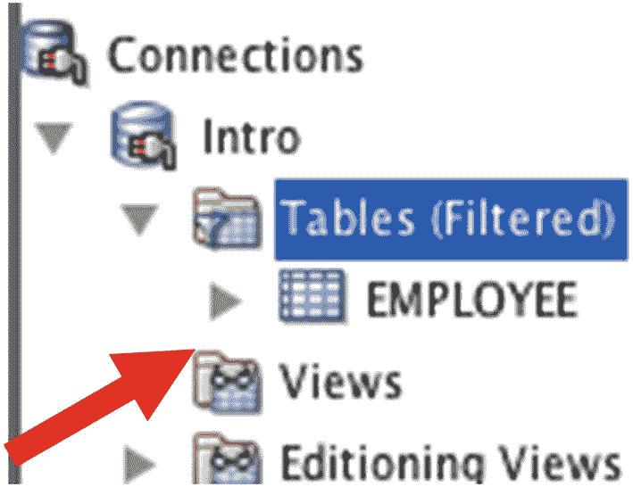

    图 8-1：包含表名的连接列表

3.  在屏幕主区域出现的窗口上，点击 `Data` 选项卡，如图 8-2 所示。

    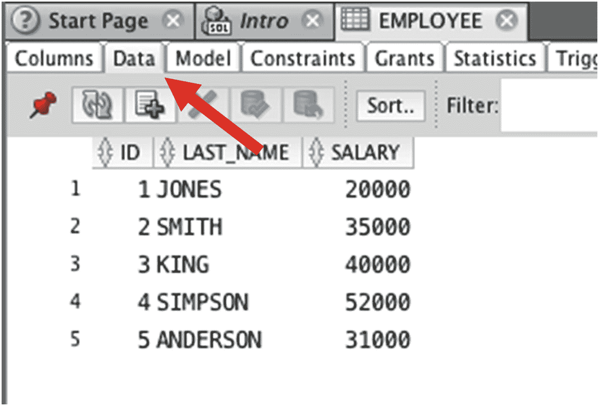

    图 8-2：员工表数据

4.  点击工具栏上的 `Insert Row` 按钮。它应该是从左数第三个按钮。将出现一个新行，如图 8-3 所示。

    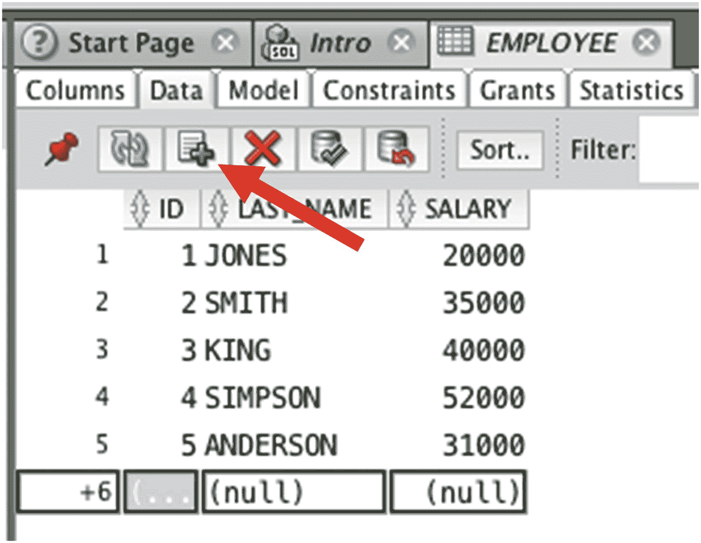

    图 8-3：表中的新行

5.  在新行中，输入 `ID` 为 6，`last_name` 为 `COOPER`。将 `salary` 值保留为 `(null)`，如图 8-4 所示。

    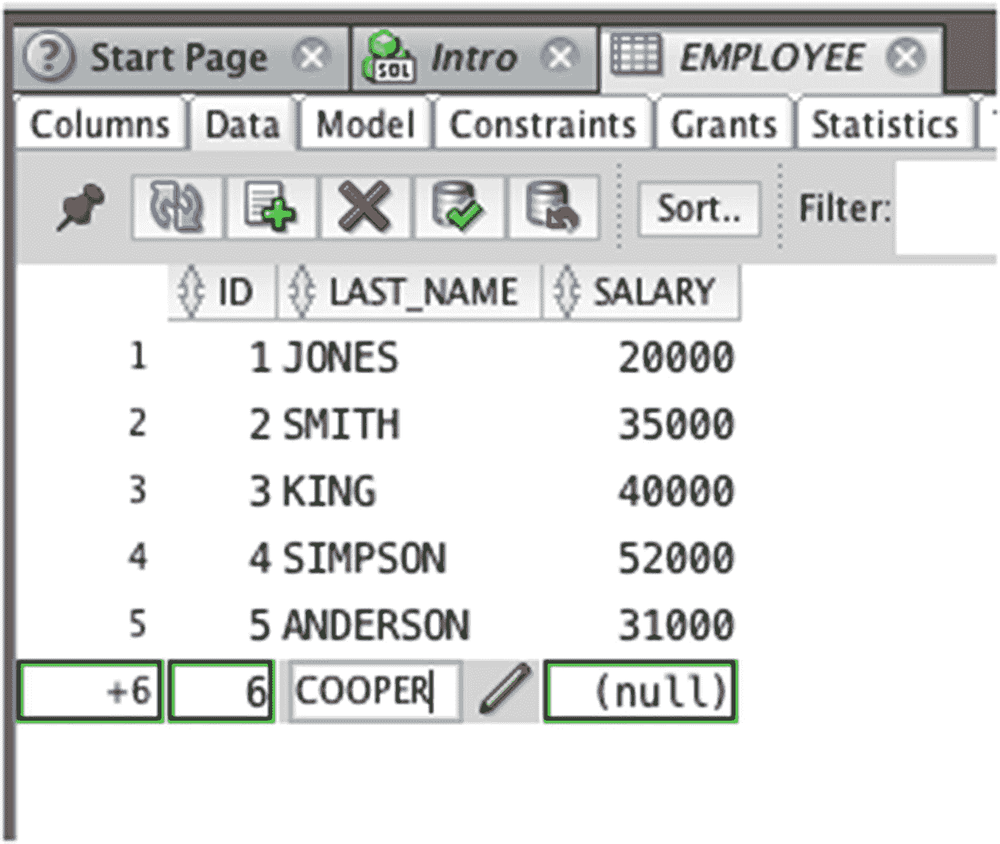

    图 8-4：输入数据

6.  再次点击 `Insert Row` 按钮，以插入一个新行。
7.  为新行输入 `ID` 为 7，并将 `last_name` 和 `salary` 列保留为 `(null)`，如图 8-5 所示。

    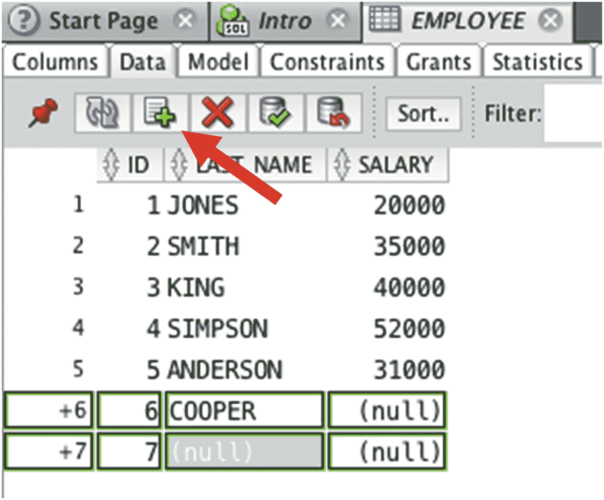

    图 8-5：表中的两个新行

8.  点击 `Commit Changes` 按钮将此数据保存到数据库。`Commit Changes` 按钮是灰色带绿色勾的形状，位于红色叉的右侧，如图 8-6 所示。

    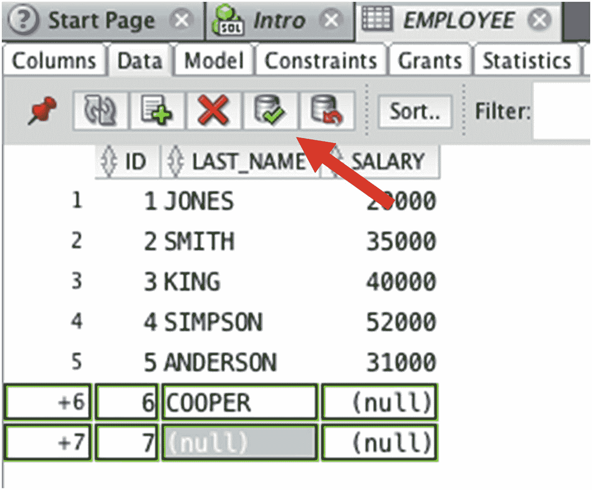

    图 8-6：提交更改按钮

你的屏幕应如图 8-7 所示。

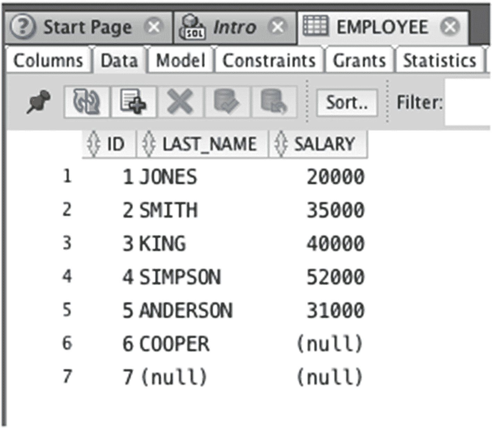

图 8-7：保存更改

### 选择记录

你可以通过运行一个 `SELECT` 语句来检查新数据是否已在表中，就像你在前面章节中所做的那样。具体步骤如下：

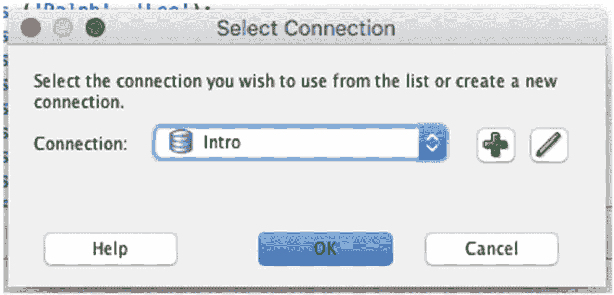

图 8-8：选择连接窗口

1.  打开一个新的 SQL 文件或使用你已打开的现有文件。在之前的章节中我们已经介绍过如何操作，现在将再次演示。如果你已经打开了一个窗口，可以跳过接下来的几个步骤。
2.  要打开一个新的 SQL 文件，请点击 `New Worksheet` 按钮。
3.  选择一个连接，如图 8-8 所示。

将显示一个新的 SQL 工作表。

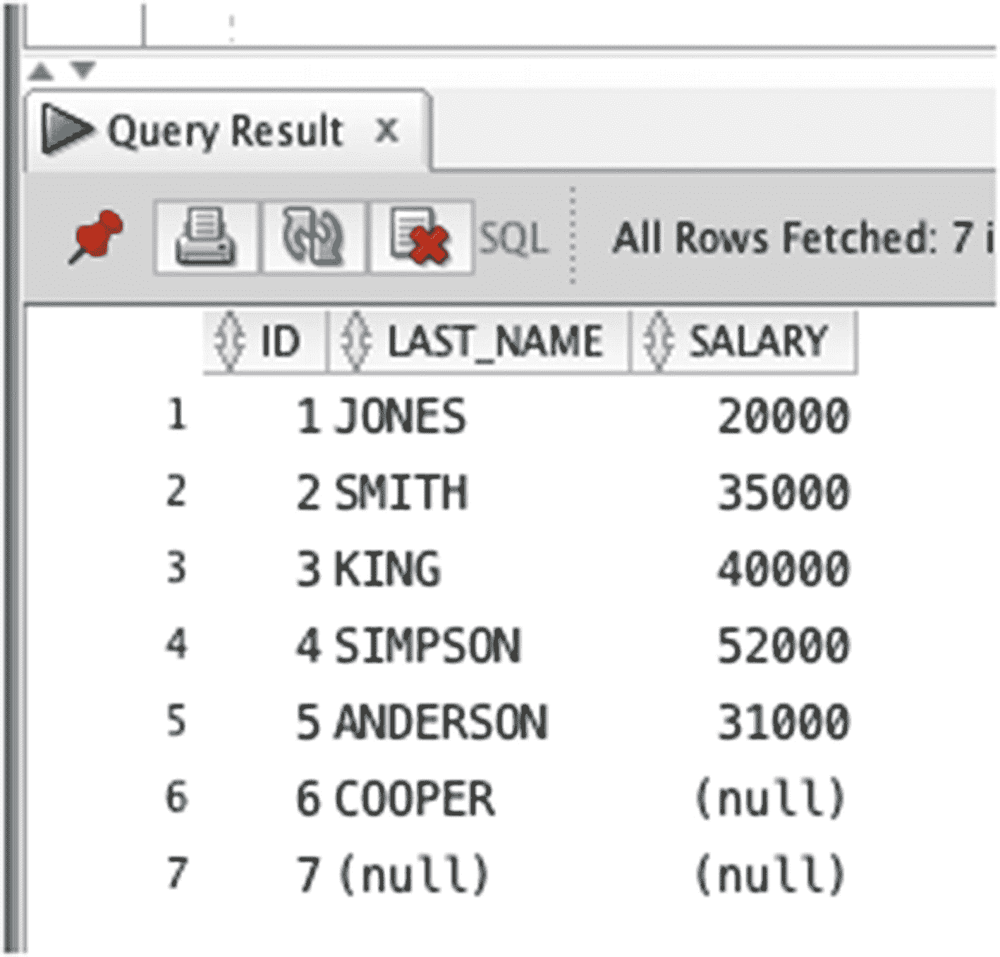

图 8-9：在员工表上运行 SELECT 查询

1.  运行以下查询：

    ```
    SELECT id, last_name, salary
    FROM employee;
    ```

    结果应如图 8-9 所示。

如你所见，此表中显示了 `NULL` 值。在 SQL Developer 中，它们显示为 `(null)`，以便我们知道它们是 `NULL` 值。但是，如果此查询的结果在应用程序中使用，它们将是 `NULL`，需要相应地处理。

### 限制 NULL 值

你可以在表中看到 `NULL` 值。如果你想从结果中排除它们该怎么办？之前提到过，不能使用“等于”号。让我们看看如果这样使用会发生什么。你可以运行此查询：

```
SELECT id, last_name, salary
FROM employee
WHERE salary = NULL;
No results found.
```

SQL Developer 将不显示任何结果，如图 8-10 所示。

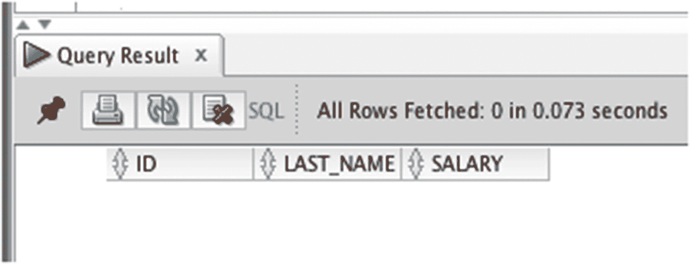

图 8-10：未找到结果

你需要使用 `IS NULL` 关键字。为此，你可以调整查询使其如下所示：

```
SELECT id, last_name, salary
FROM employee
WHERE salary IS NULL;
```

你的结果将如下所示：

```
ID   LAST_NAME   SALARY
6    COOPER      NULL
7    NULL        NULL
```

它只显示 `salary` 值为 `NULL` 的行。你可以对 `last_name` 列尝试相同的操作：

```
SELECT id, last_name, salary
FROM employee
WHERE last_name IS NULL;
```

结果是：

```
ID   LAST_NAME   SALARY
7    NULL        NULL
```

这将只显示 `last_name` 列为 `NULL` 的记录。

### 隐藏空值

你刚刚看到了如何在结果中显示包含 `NULL` 值的记录。如果你想忽略它们该怎么办？你可以使用一个类似的关键词。就像不能使用“等于”来查找 `NULL` 值一样，也不能使用“不等于”来忽略 `NULL` 值。

要使用的关键词是 `NOT`。`NOT` 是 SQL 中的一个关键字，用于执行与它所修饰的关键字相反的操作。它在 SQL 的多个地方使用，你将在本书中学习到。目前，它可以用来忽略 `NULL` 值。你的查询将如下所示：

```
SELECT id, last_name, salary
FROM employee
WHERE salary IS NOT NULL;
```

注意你在 `IS` 后面添加了 `NOT`，所以是 `IS NOT NULL`。这意味着将显示所有 `salary` 不是 `NULL` 的记录。你的结果是：

```
ID   LAST_NAME   SALARY
1    JONES       20000
2    SMITH       35000
3    KING        40000
4    SIMPSON     52000
5    ANDERSON    31000
```

这些结果不包括那些 `salary` 为 `NULL` 的记录。你可以对 `last_name` 列执行相同的操作：

```
SELECT id, last_name, salary
FROM employee
WHERE last_name IS NOT NULL;
```

结果将是：

```
ID   LAST_NAME   SALARY
1    JONES       20000
2    SMITH       35000
3    KING        40000
4    SIMPSON     52000
5    ANDERSON    31000
6    COOPER      NULL
```

你可以看到 `ID` 7 没有被显示，因为它的 `last_name` 是 `NULL`。`ID` 为 6 的记录被显示了，因为 `last_name` 有值。虽然 `salary` 是 `NULL`，但你的查询没有提到 `salary`。

你可以使用 `AND` 关键字来排除这两个列中任一列为 `NULL` 的记录。

```
SELECT id, last_name, salary
FROM employee
WHERE last_name IS NOT NULL
AND salary IS NOT NULL;
```

此查询的结果是：

```
ID   LAST_NAME   SALARY
1    JONES       20000
2    SMITH       35000
3    KING        40000
4    SIMPSON     52000
5    ANDERSON    31000
```

你可以看到，两个包含 `NULL` 值的记录没有显示出来。


### 在一个 SQL 窗口中运行多个查询

在本章及前面的章节中，你对相同的数据运行了多个 SQL 查询。你可能是通过删除窗口中已有的所有 SQL 代码并输入新代码来运行查询的。

然而，SQL Developer（以及许多其他程序）使得编写多个查询并仅运行你想要的那一个变得更容易。这也是我们在本书前面提到的分号字符 `";"` 发挥作用的地方。

你可以在一个 SQL 窗口中编写许多不同的 SQL 语句。如果它们用分号分隔，就会被视为独立的查询，并且可以单独运行。

例如，你的窗口可能如图 8-11 所示。

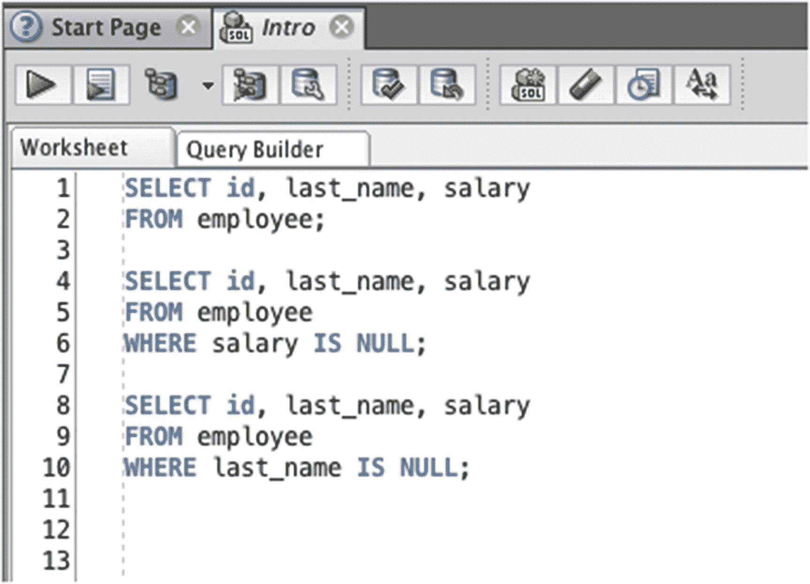

图 8-11

一个窗口中的多个查询

这包括三个 SQL 查询。它们用空行分隔以便于阅读。更重要的是，每个查询都以分号结尾，以指示语句的结束位置。

你可以在 SQL Developer 中通过在查询内（分号之前）的任何位置单击，然后单击绿色的“运行语句”按钮来运行单个查询。这将仅运行光标所在的查询，如图 8-12 所示。

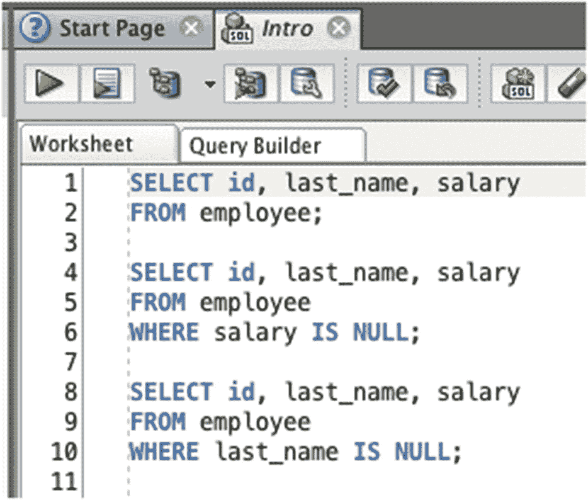

图 8-12

运行单个查询

你也可以在任何其他查询内单击并运行该查询。这意味着你可以在一个文件中编写任意多的查询，并且只运行你想要的那个。这对本书中的练习非常有帮助，因为你可以将一组代码写在另一组之后，并返回运行任何先前的查询。

### 总结

SQL 中的缺失值被捕获为 `NULL` 值，表示未知值。这与空字符串或零不同。SQL 查询可以使用关键字 `IS NULL` 来检查一个值是否为 `NULL`。它们也可以使用 `IS NOT NULL` 来查找非 `NULL` 的值。

## 9. 移除重复结果

当你将数据存储在表中时，正如你目前所学，你可以直接输入值并保存。然后数据就被保存到表中。只要你输入的值与列的类型匹配，就应该可以工作。例如，这意味着你不能将文本值输入到数字列中。

到目前为止，你的示例数据如下所示：

```
ID   LAST_NAME   SALARY
1    JONES       20000
2    SMITH       35000
3    KING        40000
4    SIMPSON     52000
5    ANDERSON    31000
6    COOPER      NULL
7    NULL        NULL
```

观察这个表，你可能会做几个假设：

*   `ID` 号是连续的，从 1 开始递增。
*   `last_name` 值都是大写的。
*   `salary` 有某种最小值和最大值。
*   所有 `last_name` 值都是不同的。

你还没有在表上定义任何东西来使这些陈述成为事实。目前它们只是假设。这意味着这些假设中的每一个都可能是错误的。`ID` 号可能不是连续的。`last_name` 值可能不是大写的。`salary` 可能没有最小和最大范围。所有 `last_name` 值可能并非不同。

### 添加新记录

在这个例子中，让我们向表中添加一些新值。你可以遵循本书前面相同的步骤。

1.  打开 SQL Developer 并展开窗口左侧的连接。
2.  展开“Tables (Filtered)”并单击 EMPLOYEE 表。
3.  在出现的 SQL 窗口中，单击“数据”选项卡，如图 9-1 所示。

    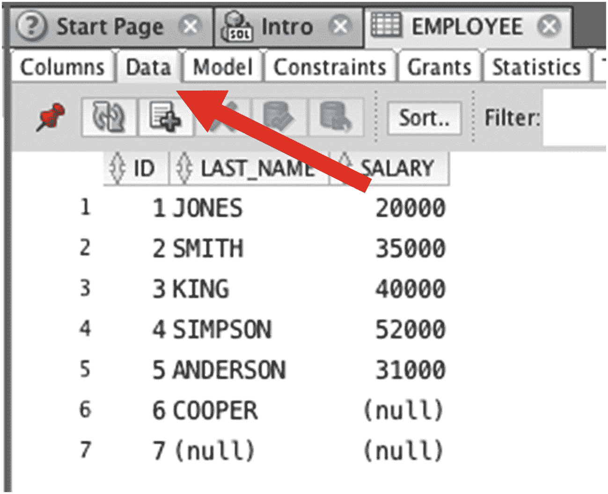

    图 9-1

    Employee 表中的数据

4.  单击“添加行”按钮。
5.  在表中输入一个新行，`ID` 为 8，`last_name` 为 SMITH，`salary` 为 62000。
6.  再次单击“添加行”按钮，在表中输入一个新行，`ID` 为 9，`last_name` 为 PATRICK，`salary` 为 40000。你的屏幕应如图 9-2 所示。

    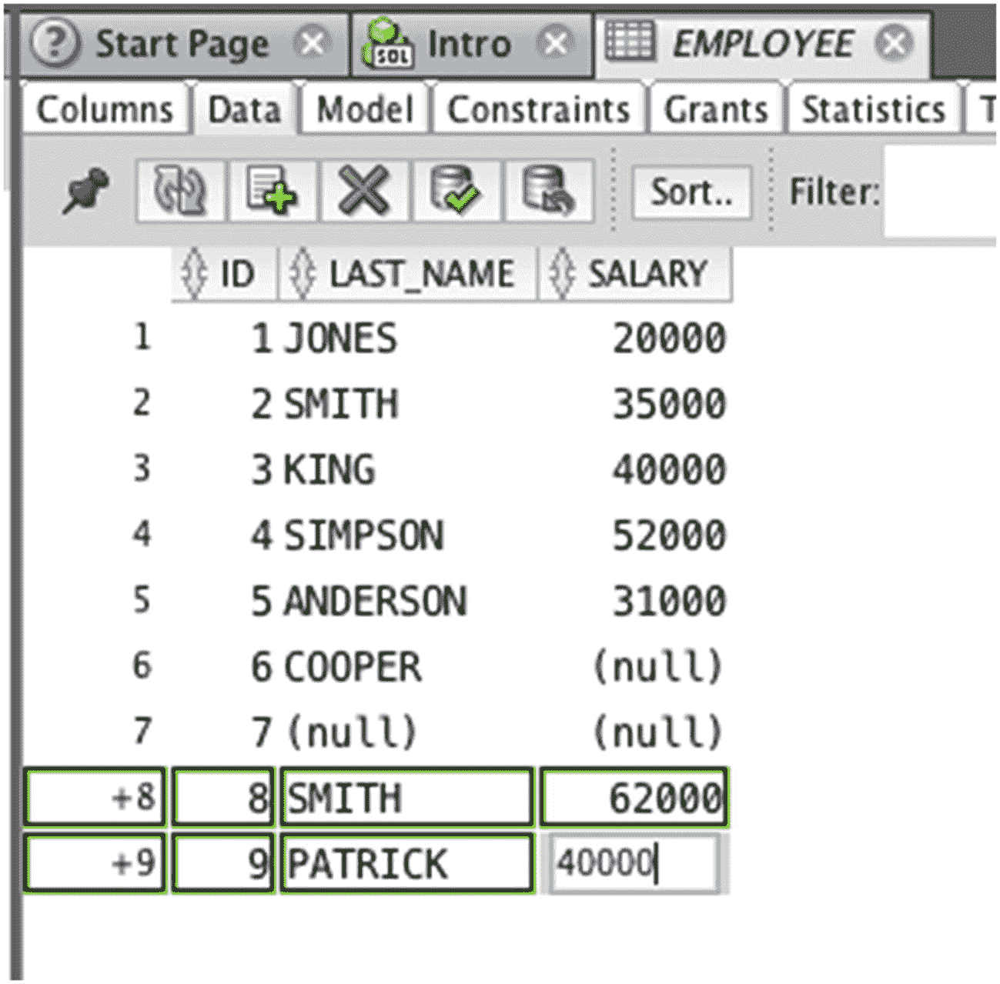

    图 9-2

    Employee 表中的新数据

7.  单击“提交”。

你现在已经将新数据添加到了 `employee` 表中。这些新记录将用于演示 Oracle 如何处理重复数据。

### 选择数据

现在数据已经在表中了，让我们看看它的样子。打开一个新的或现有的 SQL 窗口并运行以下查询，该查询显示表中的所有列和行：

```
SELECT id, last_name, salary
FROM employee;
```

结果应该如下所示：

```
ID   LAST_NAME   SALARY
1    JONES       20000
2    SMITH       35000
3    KING        40000
4    SIMPSON     52000
5    ANDERSON    31000
6    COOPER      NULL
7    NULL        NULL
8    SMITH       62000
9    PATRICK     40000
```

观察这些数据，你可能会注意到 `last_name` 为 `'SMITH'` 出现了两次。这可能是可以的，因为可能有两名名为 `'SMITH'` 的员工。假设你被要求找出数据库中所有员工的不同姓名。你可以运行这样的查询：

```
SELECT last_name
FROM employee;
```

结果将是：

```
LAST_NAME
JONES
SMITH
KING
SIMPSON
ANDERSON
COOPER
(null)
SMITH
PATRICK
```

一旦你把这个结果给你的经理或团队看，他们可能会问：“为什么 SMITH 出现了两次？我只需要看到每个姓名一次。”你可能想知道如何做到这一点。你是删除记录吗？还是忽略第 8 条记录，也就是第二个 `'SMITH'` 值？你不能删除数据，因为它可能是有效的。你可以尝试忽略第 8 条记录：

```
SELECT last_name
FROM employee
WHERE id <> 8;
```

```
LAST_NAME
JONES
SMITH
KING
SIMPSON
ANDERSON
COOPER
(null)
SMITH
PATRICK
```

在你刚刚运行的查询中，你知道哪个 `ID` 是重复的以及如何删除它。如果有许多记录存在这个问题，或者有数百条、数千条记录呢？你不可能知道所有这些记录的 `ID` 值。有一个更好的方法可以做到这一点。

### 什么是 DISTINCT？

SQL 中有一个名为 `DISTINCT` 的关键字，它允许你从结果中删除重复的行。`DISTINCT` 关键字不会从数据库中删除数据。它只是在运行 `SELECT` 查询时识别任何相同的记录，并从你的结果中删除任何重复的行。`DISTINCT` 关键字放在 `SELECT` 关键字之后：

```
SELECT DISTINCT columns
FROM table...
```

这个 `DISTINCT` 关键字将应用于整个查询。你不能为每个列指定 `DISTINCT`，因为它删除的是结果中的重复记录，而不是每个列中的重复值。这是一个重要的区别，你很快就会看到一些这样的例子。

#### 注意

`DISTINCT` 关键字从你的结果中删除重复的行，而不是每个列中的重复值。

### 查找唯一的 Last Name 值

你可以使用前面的例子来查找所有唯一的 `last_name` 值，而不需要在 `WHERE` 子句中使用 `ID`。你的查询将如下所示：

```
SELECT DISTINCT last_name
FROM employee;
```

结果将如下所示：

```
LAST_NAME
JONES
SMITH
KING
SIMPSON
ANDERSON
COOPER
(null)
PATRICK
```

你可以看到重复的记录（第二个 `last_name` 为 SMITH）没有显示。这就是 `DISTINCT` 关键字的作用。


### 查找唯一的薪资值

我们来看另一个例子。假设你需要找出表中所有唯一的 `salary` 值。这将展示 `DISTINCT` 关键字不仅对文本值有效，也适用于数值。你的查询可能一开始是这样的：

```sql
SELECT salary
FROM employee;
```

这个查询的结果是：

```
SALARY

(null)
(null)
```

这向你展示了两件事。首先，这一列中有两个 `NULL` 值。其次，薪资为 40000 的值重复了，因为有两名 `employee` 的薪资相同。你可以用 `DISTINCT` 来解决这个问题。

```sql
SELECT DISTINCT salary
FROM employee;
```

这个查询的结果是：

```
SALARY

(null)
```

使用 `DISTINCT` 消除了一条 `NULL` 记录和一条 40000 的记录。如果你不想包含 `NULL` 值该怎么办？你可以将 `DISTINCT` 关键字与上一章学过的 `WHERE` 子句结合使用。

```sql
SELECT DISTINCT salary
FROM employee
WHERE salary IS NOT NULL;
```

你的结果会像这样：

```
SALARY
```

这显示了所有唯一的 `salary` 值，但排除了 `NULL` 值。

### 查找唯一的值组合

让我们看另一个例子。假设你被要求找出此表中所有唯一的 `last_name` 和 `salary` 值组合。你的查询会是这样的：

```sql
SELECT DISTINCT last_name, salary
FROM employee;
```

注意 `DISTINCT` 关键字只出现了一次。你为整个查询定义了它，而不需要为每一列都定义一次。如果你运行这个查询，结果如下：

```
LAST_NAME   SALARY
JONES       20000
SMITH       35000
KING        40000
SIMPSON     52000
ANDERSON    31000
COOPER      (null)
(null)      (null)
SMITH       62000
PATRICK     40000
```

你可能会疑惑为什么 `'SMITH'` 出现了两次。还有为什么 `salary` 为 40000 的值也出现了两次？这是因为它们可能是重复的值，但它们不是重复的行。薪资为 35000 的 `'SMITH'` 行与薪资为 62000 的 `'SMITH'` 行是不同的行，因此该行保留在结果中。

薪资为 40000 的 `'KING'` 行和薪资为 40000 的 `'PATRICK'` 行也是如此。尽管 `salary` 相同，但 `last_name` 不同，所以行也不同。

`DISTINCT` 的设计目的不是为了从不同行的不同列中删除重复值。如果它这样做，那么每行中的数据就会被混淆，从而变得不正确。如果你需要通过消除重复项来在查询中查找唯一结果，那么 `DISTINCT` 就是实现这一目标的方法。

如何区分两个 `'SMITH'` 员工是不同的人？你可以查看 `ID` 列。或者，你可以添加一个新列来定义更多关于他们的信息，这将在后面的章节中学习。

### 总结

SQL 不会自动从你的结果中消除重复记录。你可以在查询中通过在 `SELECT` 关键字后添加 `DISTINCT` 关键字来实现这一点。它移除的是重复的记录，而不是重复的列，这两个概念截然不同。

## 10. 对值列表和范围应用过滤器

在前面的章节中，你学习了 `WHERE` 子句以及如何使用它来限制你看到的结果。你可以使用各种符号（称为 `运算符`）来实现这一点，例如“等于”和“小于”。你还可以使用 `AND`/`OR` 关键字来指定多个条件。

处理值列表带来了一个有趣的挑战：一个很长的列表可能导致查询中出现大量的 `AND` 和 `OR` 关键字。本章介绍了一些在处理大型列表时很有帮助的语法。你还将学习一些用于范围的语法。

### 连词过多

在 `WHERE` 子句中编写包含一长串相等条件的查询会变得很繁琐。让我们通过一个例子来说明，这将为你接下来要学习的语法做铺垫。

首先，到目前为止，我们的示例数据如下：

```
ID  LAST_NAME SALARY
1   JONES     20000
2   SMITH     35000
3   KING      40000
4   SIMPSON   52000
5   ANDERSON  31000
6   COOPER    (null)
7   (null)    (null)
8   SMITH     62000
9   PATRICK   40000
```

如果你想找出所有 `salary` 等于 5,000 或 10,000 倍数的记录，你可能会有这样的查询：

```sql
SELECT id, last_name, salary
FROM employee
WHERE salary = 20000
OR salary = 35000
OR salary = 40000;
```

如果你运行这个查询，得到的结果是：

```
ID   LAST_NAME   SALARY
1    JONES       20000
2    SMITH       35000
3    KING        40000
9    PATRICK     40000
```

我们忽略了薪资为 52000、31000 和其他值的记录。你得到了想要的结果，但我们的 `WHERE` 子句包含了针对同一列的三个检查：

```sql
WHERE salary = 20000
OR salary = 35000
OR salary = 40000;
```

如果你的表中有更多值，并且想检查五到十个不同的值怎么办？你可以使用更多 `OR` 关键字，但这会让查询看起来有点乱：

```sql
WHERE salary = 20000
OR salary = 35000
OR salary = 40000
OR salary = 45000
OR salary = 50000
OR salary = 55000
OR salary = 60000
OR salary = 65000;
```

有一种方法可以改进这种重复使用大量 `OR` 关键字的情况：使用 `IN` 关键字。

### IN 关键字

`IN` 关键字允许你在单个比较中指定多个值。这个关键字的工作方式与使用多个 `OR` 关键字相同。`IN` 子句看起来像这样：

```sql
WHERE column IN (value1, value2... value_n)
```

使用 `IN` 关键字来代替“等于”运算符。然后你指定一个左括号 "("，并在括号内包含所有你想要检查的值，每个值之间用逗号分隔。最后，你关闭括号。

#### 使用 IN 的示例

你可以在 `IN` 关键字内指定一个很长的值列表（实际上最多可达 1,000 个）。这种指定列表的能力对于你正在查看的示例非常有用。与其使用像这样的查询：

```sql
SELECT id, last_name, salary
FROM employee
WHERE salary = 20000
OR salary = 35000
OR salary = 40000;
```

你可以使用这样的查询：

```sql
SELECT id, last_name, salary
FROM employee
WHERE salary IN (20000, 35000, 40000);
```

第二个版本看起来更整洁，更易于阅读，因为所有关于薪资的条件都集中在一起。这个查询的结果是：

```
ID   LAST_NAME   SALARY
1    JONES       20000
2    SMITH       35000
3    KING        40000
9    PATRICK     40000
```

这些结果与使用单独 `OR` 语句的查询结果相同。

#### 更长的值列表

你之前的例子在 `IN` 子句中包含了三个值。如果你想包含更多呢？使用几个 `OR` 语句，你的查询可能像这样：

```sql
SELECT id, last_name, salary
FROM employee
WHERE salary = 10000
OR salary = 20000
OR salary = 30000
OR salary = 40000
OR salary = 50000
OR salary = 60000
OR salary = 70000
OR salary = 80000
OR salary = 90000
OR salary = 100000;
```

这个查询检查薪资值是否以 10,000 为增量。每个值都有单独的 `OR` 关键字。这个查询显示以下结果：

```
ID   LAST_NAME   SALARY
1    JONES       20000
3    KING        40000
9    PATRICK     40000
```

查询结果只显示了三条记录，因为只有三个 `salary` 值与提供的列表中的值匹配。尽管列表中有十个值，但许多值没有对应的行，所以只返回了三行。

你可以使用 `IN` 子句重写查询：

```sql
SELECT id, last_name, salary
FROM employee
WHERE salary IN (
10000, 20000, 30000, 40000, 50000,
60000, 70000, 80000, 90000, 100000);
```

同样，`IN` 子句看起来比单独的 `OR` 关键字整洁得多，也更容易阅读。这个查询的结果也是一样的：

```
ID   LAST_NAME   SALARY
1    JONES       20000
3    KING        40000
9    PATRICK     40000
```


### 使用 `IN` 处理文本值

`IN` 关键字也可以与文本值一起使用。假设你有一个需要筛选的姓名列表。使用 `OR` 关键字的查询可能如下所示：

```sql
SELECT id, last_name, salary
FROM employee
WHERE last_name = 'SIMPSON'
OR last_name = 'COOPER'
OR last_name = 'ANDERSON';
```

这个查询可以改用 `IN` 关键字来写：

```sql
SELECT id, last_name, salary
FROM employee
WHERE last_name IN ('SIMPSON', 'COOPER', 'ANDERSON');
```

每个文本值都需要用单引号括起来，就像你在其他 `WHERE` 子句中看到的一样。这些文本值也都放在括号内，用逗号分隔，就像处理薪资值的查询一样。

这个查询的结果是：

```sql
ID   LAST_NAME   SALARY
4    SIMPSON     52000
5    ANDERSON    31000
6    COOPER      NULL
```

你可以看到结果显示了你指定的 `last_name` 值的记录。无论你在 `IN` 关键字内指定多少个值，这种类型的查询都有效，并且比单独的 `OR` 语句更容易输入和阅读。

### 将 `IN` 与其他子句结合使用

你已经见过一些在单个 `WHERE` 子句中查找列中几个不同值的查询。你也可以将这种方法与其他条件相结合，例如另一个 `AND` 或 `OR` 子句。

假设你想找到所有 `salary` 为 20000、25000、30000、35000 或 40000，并且 `last_name` 为 SMITH 的员工。你的查询可能如下所示：

```sql
SELECT id, last_name, salary
FROM employee
WHERE salary IN (20000, 25000, 30000, 35000, 40000)
AND last_name = 'SMITH';
```

这个查询使用 `IN` 关键字来查找 `salary` 值，并使用相等比较来检查 `last_name` 值。这种将 `IN` 关键字与其他子句结合的技术是完全有效的 SQL。运行此查询时，结果应为：

```sql
ID   LAST_NAME   SALARY
2    SMITH       35000
```

结果显示了一条记录，因为表中只有一条记录匹配指定的 `salary` 值并具有给定的 `last_name` 值。

### `IN` 与 `AND`？

你已经了解到，在 `IN` 子句中指定值等同于写出多个 `OR` 子句。为什么 `IN` 子句不等同于多个 `AND` 子句呢？当你有多个 `AND` 子句时会发生什么？

这是之前使用 `OR` 的查询：

```sql
SELECT id, last_name, salary
FROM employee
WHERE salary = 20000
OR salary = 35000
OR salary = 40000;
```

现在，考虑将所有的 OR 关键字替换为 AND，因为一个常见的错误是认为“我对 20000、35000 和 40000 的薪资值感兴趣”。很容易犯这样的错误：从英语思维中抓住“和”，并将其转换为查询中的 AND 关键字。例如：

```sql
SELECT id, last_name, salary
FROM employee
WHERE salary = 20000
AND salary = 35000
AND salary = 40000;
```

然而，这个查询不会得到你想要的结果。它本质上是在说：“显示 `salary` 等于 20000 且等于 35000 且等于 40000 的记录”。

一个列不能同时等于多个值。如果一个 `salary` 值等于 20000，它就不可能同时等于 35000。这个查询将返回零行。这就是为什么 `IN` 关键字等同于 `OR` 关键字，而不是 `AND` 关键字。

### `IN` 与 `LIKE`？

在之前的章节中，你学习了如何使用 `LIKE` 关键字执行部分匹配。例如，要找到所有 `last_name` 以“S”开头的记录，我们的查询将是：

```sql
SELECT id, last_name, salary
FROM employee
WHERE last_name LIKE 'S%';
```

如果你想找到所有 `last_name` 以“S”或“P”开头的记录呢？你能为此使用 `IN` 关键字吗？你能写成这样吗？

```sql
SELECT id, last_name, salary
FROM employee
WHERE last_name IN ('S%', 'P%');
```

不幸的是，`IN` 的这种用法不会给你所需的结果。`IN` 子句对括号内的所有值进行“等于”判断，而不是 `LIKE`。因此，`IN` 子句无法对列表中的值执行部分匹配。它将返回 `last_name` 精确匹配字符“S%”或“P%”的记录，而这样的记录一条也没有。

当你有多个 `LIKE` 条件时，可以使用 `OR` 关键字将它们组合起来。例如：

```sql
SELECT id, last_name, salary
FROM employee
WHERE last_name LIKE 'S%'
OR last_name LIKE 'P%';
```

这个查询将显示以下结果：

```sql
ID   LAST_NAME   SALARY
2    SMITH       35000
4    SIMPSON     52000
8    SMITH       62000
9    PATRICK     40000
```

### 过滤值的范围

你已经学习了如何使用“等于”和“大于”等运算符通过 `WHERE` 子句过滤数据。有时你可能需要查找落在特定值范围内的数据。有一种比使用大于和小于运算符组合更好的方法来过滤值范围。

可以使用你的员工表来完成值范围的过滤。你可能需要过滤薪资值的范围。员工表如下所示：

```sql
ID   LAST_NAME   SALARY
1    JONES       20000
2    SMITH       35000
3    KING        40000
4    SIMPSON     52000
5    ANDERSON    31000
6    COOPER      NULL
7    NULL        NULL
8    SMITH       62000
9    PATRICK     40000
```

假设你的经理想知道谁的薪资在某个范围内。你被要求提供所有薪资在 20,000 到 40,000 之间（含）的员工的详细信息。

你会怎么做？你可以使用一个 `WHERE` 子句，其中包含：

*   一个大于或等于符号，用于薪资 20,000
*   一个小于或等于符号，用于薪资 40,000
*   `AND` 关键字以确保记录同时满足这两个条件

你的查询可能如下所示：

```sql
SELECT id, last_name, salary
FROM employee
WHERE salary >= 20000
AND salary <= 40000;
```

这个查询将找到 `salary` 大于或等于 20000 且 `salary` 小于或等于 40000 的记录。你的结果将如下所示：

```sql
ID   LAST_NAME   SALARY
1    JONES       20000
2    SMITH       35000
3    KING        40000
5    ANDERSON    31000
9    PATRICK     40000
```

这些结果显示了 `salary` 等于 20000、40000 以及介于两者之间的所有值的记录。有另一种方法可以将相同的逻辑写入查询：使用一个称为 `BETWEEN` 的运算符。

### `BETWEEN` 运算符

在 SQL 中，`BETWEEN` 是一个运算符，它允许你为特定列指定上限和下限，行必须满足该条件才会被包含。`BETWEEN` 等同于使用“大于或等于”和“小于或等于”。使用 `BETWEEN` 的语法如下：

```sql
WHERE column BETWEEN low_value AND high_value
```

这意味着：

*   它以 `WHERE` 列开头，这是你想要查找的列。
*   然后你指定 `BETWEEN` 运算符。
*   接着是 `low_value`，即范围中的下限值。
*   然后你有 `AND` 关键字。
*   最后你有 `high_value`，即范围中的上限值。

#### 使用 Between 处理两个薪资值

你可以将前面的例子重写为一个使用 `BETWEEN` 的查询。

第一个例子是这个查询：

```sql
SELECT id, last_name, salary
FROM employee
WHERE salary >= 20000
AND salary <= 40000;
```

你可以使用 `BETWEEN` 关键字将其重写如下：

```sql
SELECT id, last_name, salary
FROM employee
WHERE salary BETWEEN 20000 AND 40000;
```

这个查询输入量稍少，并且可以说更容易阅读。结果是相同的：

```sql
ID   LAST_NAME   SALARY
1    JONES       20000
2    SMITH       35000
3    KING        40000
5    ANDERSON    31000
9    PATRICK     40000
```


