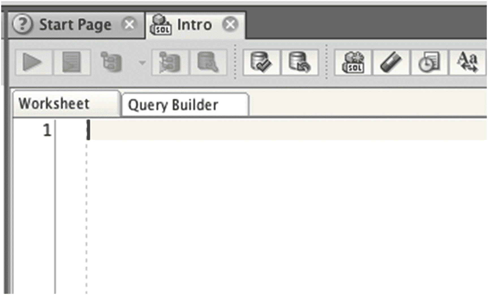
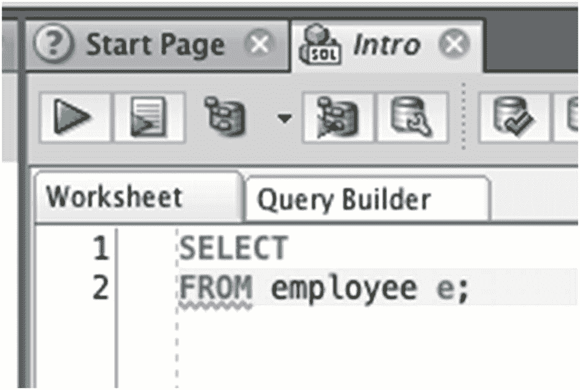
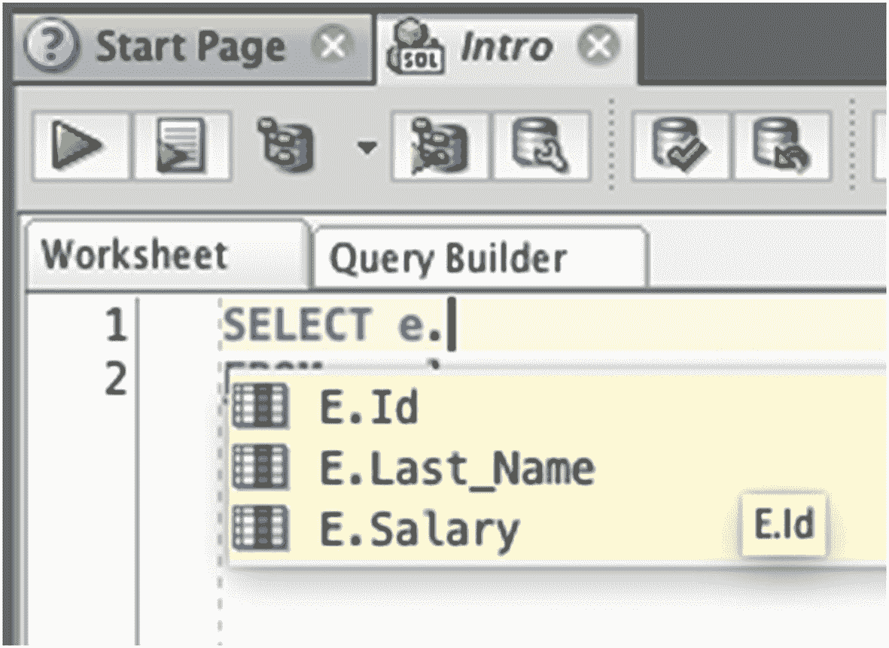

# 第十二章：数据排序

在本章中，您将学习如何按特定顺序对结果进行排序。在 SQL 中，从表中选择的数据不能保证以特定顺序显示。如果您想以特定顺序显示它，有一个命令可以使用。

## 12.1 结果无序

当您在表上运行 `SELECT` 查询时，表中的数据会被显示出来供您查看。例如，如果您运行一个 `SELECT` 查询来获取所有行，您会看到所有的行。

```sql
SELECT id, last_name, salary
FROM employee;
```
```
ID   LAST_NAME   SALARY
1    JONES       20000
2    SMITH       35000
3    KING        40000
4    SIMPSON     52000
5    ANDERSON    31000
6    COOPER      (null)
7    (null)      (null)
8    SMITH       62000
9    PATRICK     40000
```

如果您查看结果，您会看到它们是按 `ID` 字段升序（从低到高）排序的。但这种排序并不是您查询的一部分。当您运行查询时，Oracle 不会以特定方式对您的结果进行排序，这意味着您无法保证数据会以这种方式排序。

上一个示例中数据按 ID 号排序的原因是，数据通常按照您添加到数据库的顺序排列。然而，有许多因素可以改变这种行为，例如：

*   从表中删除数据
*   向表中添加新数据
*   更新表中的现有数据
*   其他数据库管理任务
*   并行数据访问（如在高性能系统中）

因此，如果 Oracle 无法保证您的数据会以某种特定方式排序，您该怎么办？您可以在编写查询时指定数据出现的顺序。

### 12.1.1 警告！

开发人员有时会争辩特定情况，说数据库引擎绝不可能返回无序的行。忽略这样的论点。它们总是错的，并且会在最糟糕的时候出错，比如凌晨 2 点您最不想被召回办公室解决问题的时候。

## 12.2 使用 ORDER BY 对结果排序

SQL 中有一个子句叫做 `ORDER BY`。它允许您指定结果集中行的出现顺序。`ORDER BY` 子句如下所示：

```sql
ORDER BY expression [ASC|DESC]
```

这个语法包括：

*   `ORDER BY` 关键字，用于指示正在执行的操作。
*   一个表达式，指定您希望如何对结果进行排序。
*   `ASC` 或 `DESC`，它们是可选的，指定是按升序还是降序对数据进行排序。

您也可以按多个列排序：

```sql
ORDER BY expression [ASC|DESC], expression [ASC|DESC], expression [ASC|DESC]...
```

您可以不断在子句末尾添加表达式，用逗号分隔。您将在本章后面看到这样做的示例。

表达式可以是以下任何一种：

*   列名或包含该列的表达式
*   代表 `SELECT` 子句中列位置的数字
*   列别名（您将在本书后面学到）

本章中也会有这些示例。

## 12.3 ORDER BY 示例

让我们看一些对数据进行排序的例子。您可以在 SQL 查询中看到 `ORDER BY` 子句的实际效果，并了解它如何影响结果。


#### 按文本值排序

首先，你将按 `last_name` 对数据排序，以便按字母顺序查看所有记录。为此，需要在 `SELECT` 查询中添加 `ORDER BY`。例如：

```
SELECT id, last_name, salary
FROM employee
ORDER BY last_name;
```

你刚刚添加了 `ORDER BY` 和 `last_name` 列。你可以指定 `ASC`（升序）或 `DESC`（降序），但这是可选的，默认值是 `ASC`。

结果如下所示：

```
ID   LAST_NAME   SALARY
5   ANDERSON     31000
6   COOPER       (null)
1   JONES        20000
3   KING         40000
9   PATRICK      40000
4   SIMPSON      52000
2   SMITH        35000
8   SMITH        62000
7   (null)       (null)
```

这些结果按 `last_name` 升序排列。`NULL` 值出现在底部。如果你想明确排序方式，可以在查询中指定关键字 `ASC`：

```
SELECT id, last_name, salary
FROM employee
ORDER BY last_name ASC;
```

结果将是相同的：

```
ID   LAST_NAME   SALARY
5   ANDERSON     31000
6   COOPER       (null)
1   JONES        20000
3   KING         40000
9   PATRICK      40000
4   SIMPSON      52000
2   SMITH        35000
8   SMITH        62000
7   (null)       (null)
```

所以，如果结果相同，是否应该添加 `ASC` 关键字？我认为应该，因为它明确说明了数据的排序方式。编写 SQL 时，通常最好避免任何歧义，并明确指定需要执行的操作。不过，省略 `ASC` 很常见，因此要做好在别人代码中遇到省略 `ASC` 的查询的准备，因为它是默认值。

#### 按数字值排序

让我们看一个关于 `salary` 列的例子。你可以根据最高和最低的 `salary` 值对结果进行排序。

首先，让我们根据最低的 `salary` 值对数据排序。我们的查询如下所示：

```
SELECT id, last_name, salary
FROM employee
ORDER BY salary ASC;
```

此查询将按 `salary` 列升序对员工记录排序。结果如下所示：

```
ID  LAST_NAME   SALARY
1   JONES       20000
5   ANDERSON    31000
2   SMITH       35000
3   KING        40000
9   PATRICK     40000
4   SIMPSON     52000
8   SMITH       62000
6   COOPER      (null)
7   (null)      (null)
```

如你所见，最低的 `salary` 在顶部，最高的在底部。你也可以对任何列（例如 `salary`）进行降序排序。可以通过将 `ASC` 改为 `DESC` 来实现：

```
SELECT id, last_name, salary
FROM employee
ORDER BY salary DESC;
```

结果现在将按相反顺序排序：

```
ID  LAST_NAME   SALARY
6   COOPER      (null)
7   (null)      (null)
8   SMITH       62000
4   SIMPSON     52000
3   KING        40000
9   PATRICK     40000
2   SMITH       35000
5   ANDERSON    31000
1   JONES       20000
```

你可以看到最高的工资出现在列表的顶部。

#### 按不在 SELECT 子句中的列排序

当你按一列排序时，不必在 `SELECT` 子句中指定该列。这意味着你不需要看到该列也能按它排序。

你可以使用前面示例中的查询，并将其修改为从 `SELECT` 子句中移除 `salary` 列。它仍然在 `ORDER BY` 子句中。

```
SELECT id, last_name
FROM employee
ORDER BY salary DESC;
```

结果显示为：

```
ID  LAST_NAME
6   COOPER
7   (null)
8   SMITH
4   SIMPSON
3   KING
9   PATRICK
2   SMITH
5   ANDERSON
1   JONES
```

如你所见，`salary` 列没有显示。但是，结果的顺序与前面按 `salary` 降序排列的示例相同。

#### 按数字排序

另一种对结果排序的方法是指定一个数字，而不是列名。你指定的数字是 `SELECT` 子句中列的序号。

你可能有一个如下所示的查询：

```
SELECT id, last_name, salary
FROM employee;
```

要按 `id` 列排序，你可以指定一个 `ORDER BY` 子句：

```
ORDER BY 1 ASC;
```

这将按 `ID` 列排序，因为数字 1 表示 `SELECT` 子句中的第一列，即 `ID`。

```
SELECT id, last_name, salary
FROM employee
ORDER BY 1 ASC;
```

```
ID  LAST_NAME   SALARY
1   JONES       20000
2   SMITH       35000
3   KING        40000
4   SIMPSON     52000
5   ANDERSON    31000
6   COOPER      (null)
7   (null)      (null)
8   SMITH       62000
9   PATRICK     40000
```

数据按 `ID` 列排序。要改为按 `last_name` 列排序，可以将数字 1 改为 2。

```
SELECT id, last_name, salary
FROM employee
ORDER BY 2 ASC;
```

```
ID  LAST_NAME   SALARY
5   ANDERSON    31000
6   COOPER      (null)
1   JONES       20000
3   KING        40000
9   PATRICK     40000
4   SIMPSON     52000
2   SMITH       35000
8   SMITH       62000
7   (null)      (null)
```

列号的工作方式与指定列名相同。那么为什么要使用数字而不是名称呢？列号更容易输入，可用于你编写的临时 SQL 脚本。但是，我建议在编写将被其他人或应用程序使用的代码时使用完整的列名，因为它更容易理解正在排序的是哪一列，并且不易因数据库更改而出错。

#### ORDER BY 与 NULL 值

你可能已经注意到前面的示例中出现了一些 `NULL` 值。默认情况下，当按升序排序时，`NULL` 值出现在结果的底部；当按降序排序时，出现在结果的顶部。

在 Oracle SQL 中，你可以根据需要为查询更改此行为。你可以在 `ORDER BY` 子句的末尾指定两个可选关键字之一，以指示你希望如何处理 `NULL` 值：

*   `NULLS FIRST`：`NULL` 值显示在列表的**顶部**，无论排序方式如何。
*   `NULLS LAST`：`NULL` 值显示在列表的**底部**，无论排序方式如何。

例如，如果你想按 `salary` 降序排序，但希望 `NULL` 值显示在底部而不是顶部，你的查询如下所示：

```
SELECT id, last_name, salary
FROM employee
ORDER BY salary DESC NULLS LAST;
```

```
ID  LAST_NAME   SALARY
8   SMITH       62000
4   SIMPSON     52000
3   KING        40000
9   PATRICK     40000
2   SMITH       35000
5   ANDERSON    31000
1   JONES       20000
7   (null)      (null)
6   COOPER      (null)
```

`salary` 值按降序排序，`NULL` 值显示在末尾。要让 `NULL` 值显示在顶部：

```
SELECT id, last_name, salary
FROM employee
ORDER BY salary DESC NULLS FIRST;
```

结果是：

```
ID  LAST_NAME   SALARY
6   COOPER      (null)
7   (null)      (null)
8   SMITH       62000
4   SIMPSON     52000
3   KING        40000
9   PATRICK     40000
2   SMITH       35000
5   ANDERSON    31000
1   JONES       20000
```


#### 按多列排序

在之前的示例中，你已经看到了如何按单列排序。如果想按两列或更多列排序该怎么办？SQL 中可以做到。要按多个列排序，只需添加一个逗号，然后是列名或列号，接着是排序方向（`ASC` 表示升序，`DESC` 表示降序）。

例如，要按 `last_name` 列排序，然后再按 `salary` 列排序：

```sql
SELECT id, last_name, salary
FROM employee
ORDER BY last_name ASC, salary DESC;
```

```
ID  LAST_NAME   SALARY
5   ANDERSON    31000
6   COOPER      (null)
1   JONES       20000
3   KING        40000
9   PATRICK     40000
4   SIMPSON     52000
8   SMITH       62000
2   SMITH       35000
7   (null)      (null)
```

结果首先按 `last_name` 升序排序，然后对于 `last_name` 相同的行，再按 `salary` 降序排序。

在这个查询中，你按两列进行了排序。并且，这两列的排序方式不同：一列升序，一列降序。没有规则规定它们必须采用相同的顺序。你可以使用类似的语法按三列排序：

```sql
SELECT id, last_name, salary
FROM employee
ORDER BY last_name ASC, salary ASC, id ASC;
```

```
ID  LAST_NAME   SALARY
5   ANDERSON    31000
6   COOPER      (null)
1   JONES       20000
3   KING        40000
9   PATRICK     40000
4   SIMPSON     52000
2   SMITH       35000
8   SMITH       62000
7   (null)      (null)
```

数据将按你指定的方式排序。对于这么小的表格，可能不太容易看出数据的排序方式，但如果是大表，效果会更明显。

你不必让所有列都按相同方式排序。例如，可以让一列升序排序，另一列降序排序：

```sql
SELECT id, last_name, salary
FROM employee
ORDER BY last_name ASC, salary DESC;
```

结果是：

```
ID  LAST_NAME   SALARY
5   ANDERSON    31000
6   COOPER      (null)
1   JONES       20000
3   KING        40000
9   PATRICK     40000
4   SIMPSON     52000
8   SMITH       62000
2   SMITH       35000
7   (null)      (null)
```

你会注意到在 `last_name` 为 `SMITH` 的行上存在差异。数据仍然首先按 `last_name` 升序排序，但当 `last_name` 相同时，`salary` 按降序排序。`SMITH` 的行被排序为薪资 62000 的排在薪资 35000 的前面。

### 你真的需要对数据进行排序吗？

你已经看到了如何对查询结果进行排序。这样做可以更方便地查看数据并理解表中的内容。

然而，并非总是需要对数据进行排序。使用 `ORDER BY` 子句可能是一个相当耗费资源的操作。对于一个包含十条记录的表来说，影响可能不大，但当你处理成百上千条结果时，使用 `ORDER BY` 子句会减慢查询速度。

如果你确实需要以特定顺序显示结果，那么请随意使用 `ORDER BY` 子句。因为你的需要就是需要，数据库引擎就是为你工作的。但是，如果结果的顺序对你或应用程序来说无关紧要，那就不要排序。

一些可能需要对结果排序的查询示例有：

*   特定客户的所有订单，按订单日期排序，以便客户查看列表
*   某个类别中的所有产品，按名称排序，以便在你的网站上展示

一些可能不需要对结果排序的查询示例有：

*   选修某门课程的学生列表，因为你可能想让用户自行决定排序方式，或者根本不想排序
*   将在页面下拉框中使用的唯一状态值列表。

### 小结

使用 `ORDER BY` 子句，可以按特定顺序显示查询结果。你可以指定列名或其在 `SELECT` 子句中出现的位置。结果可以按某列升序或降序排序。你可以指定多个列来对结果进行排序，并且每个列都可以指定升序或降序。

## 12. 应用表与列别名

到目前为止的所有章节中，你已经学习了如何查看数据库表中的数据。你学习了如何使用多种不同方法来选择要显示的列和行。

在第二部分的最后一章，我们将探讨两种可用于改进 SQL 查询的技术，使它们更易于编写且结果更易于理解。第一种技术称为 `表别名`。

### 什么是表别名？

`表别名` 是你在 SQL 查询中可以赋予表的一个替代名称。此别名仅适用于你的查询，不会对数据库进行永久性更改。

为什么你想在查询中使用表别名？

*   它可以使你在查询中引用列时更轻松、更快速。
*   在处理涉及两个或更多表的查询时更容易（你将在本书后面学习到）。
*   某些类型的查询需要使用表别名，你将在本书后面学习到。

表别名是什么样子的？它是在 `FROM` 子句中表名之后的一个简短名称：

```sql
SELECT columns
FROM table_name alias_name;
```

`alias_name` 是你提供的名称。你先写表名，然后一个空格，接着是 `alias_name`。`alias_name` 可以随心所欲地短或长。你可以写一个短的别名，比如单个字母，或者一个长的别名。

一旦完成此操作，你就可以在查询中引用任何列时，将该别名用作前缀。

让我们看一个这方面的例子。

### 表别名示例

我们将从之前章节中看到的对 `employee` 表的查询开始。我们的查询是：

```sql
SELECT id, last_name, salary
FROM employee;
```

你可以在表名后添加一个空格和一个名称来为此查询添加表别名：

```sql
SELECT id, last_name, salary
FROM employee e;
```

在这个例子中，我使用了别名 `e`。这很有帮助，因为：

*   它易于输入，因为它是单个字符。
*   它比完整的表名 `employee` 更短。
*   它以相同的字母开头，因此当你阅读查询时，可以看出 `e` 是 `employee` 的缩写。

设置了表别名后，我们现在可以更新 `SELECT` 子句以使用此表别名。这样做有几个原因，我们在本章前面已经提到过（输入更快，对多表查询有帮助）。其中一个更快的方式是使用一个称为“智能感知”或“自动完成”的功能。


### 智能感知或自动完成

智能感知，或常被称为自动完成，是许多软件开发工具中的一项功能，它能让你更快地编写代码。它在 `SQL Developer` 中可用，并且当你使用表别名时很容易触发。让我们看一个示例。

1.  打开 `SQL Developer` 并连接到你的数据库，方式与前面章节相同。你的屏幕应显示一个新的 SQL 窗口，如图 12-1 所示。

    

    图 12-1：新的 SQL 窗口

2.  输入查询的一部分：

    ```sql
    SELECT
    FROM employee e;
    ```

3.  你的屏幕应如图 12-2 所示。如果出现红色下划线，目前可以忽略。它只是提醒你查询不完整，因为你尚未指定任何列。

    

    图 12-2：SQL Developer 中的查询

4.  现在，将光标放在 `SELECT` 单词后面，按空格，然后输入你的别名 "e"，接着输入一个句点字符 " . "。你的 `SELECT` 子句应看起来像 `SELECT e.` （如图 12-3 所示）。

    

    图 12-3：自动完成选项

5.  弹出的窗口显示了 `employee` 表中所有可用的列。你可以通过按上下箭头键、输入部分列名或在列表中点击名称来选择一个列。
6.  重复这些步骤，直到你输入了查询中想要显示的所有列。

这个出现的弹出窗口被称为智能感知或自动完成。当使用表别名时很容易触发它。只需输入别名和一个句点即可触发。此功能使你可以轻松地从表中选择列包含在查询中，节省时间并防止因列名输入错误而导致的错误。

如果你运行带有表别名的查询，结果将与不带表别名时相同：

```sql
SELECT e.id, e.last_name
FROM employee e;
```

```
ID   LAST_NAME
1    JONES
2    SMITH
3    KING
4    SIMPSON
5    ANDERSON
6    COOPER
7    (null)
8    SMITH
9    PATRICK
```

### 更长的表别名

你不必为表别名使用单个字母。许多网上的 `SQL` 代码示例使用单个字母，而另一些则使用更多字母。使用单个字母的缺点是，当查询中有多个表可能以相同字母开头时，它无法立即明确它指的是哪个表。

例如，假设你的数据库有一个名为 `product` 的表，用于存储其销售产品的详细信息。你可能还有一个名为 `pay_rate` 的表，其中包含员工的不同工资率。如果你有一个查询使用表别名 "p"，你能否轻易分辨它指的是 `product` 表而不是 `pay_rate` 表？

在某些情况下，尤其是较长的查询中，你可能希望使用较长的表别名名称。名称越长，输入就越困难，因此你需要在名称太短缺乏信息量和太长无法成为有效别名之间取得平衡。

我通常尝试将我的别名最多保持在四到五个字符。你可以使用别名 "emp" 为 `employee` 表制作一个更具描述性的别名。

```sql
SELECT emp.id, emp.last_name, emp.salary
FROM employee emp;
```

这足够短，易于输入，也足够长以描述该表是什么。

### 如果我不使用表别名会怎样？

所有这些为表（这只是表的另一个名称）添加别名以使输入更容易的努力？如果你不想使用表别名呢？

你不必使用。在我编写的许多查询中，我不使用别名。它是一个可选功能，在较小的查询中并不常用。但了解这个功能的存在是好的，无论是在 `SQL` 中还是在 `SQL Developer` 软件中。

### 什么是列别名？

`SQL` 的另一个有助于编写查询的功能是 `列别名`。`列别名` 是你赋予结果中显示的列的名称。

使用 `列别名` 有几个原因：

*   使输出的标题更便于用户阅读
*   使输出的标题更便于应用程序使用
*   使该列可在查询的其他部分使用

就像表别名一样，`列别名` 是一个可选功能。与表别名不同，`SQL Developer` 中没有内置任何专门利用 `列别名` 的功能。

要使用 `列别名`，你在查询中的列名后添加一个名称：

```sql
SELECT column_name [AS] column_alias
FROM table;
```

中间有一个关键字 `AS`，用于定义 `列别名`。然而，它是一个可选关键字：`列别名` 在有或没有它的情况下都能工作。

让我们看一个例子。

### 列别名示例

我们可以从本章前面的查询开始：

```sql
SELECT id, last_name, salary
FROM employee;
```

如果你运行此查询，你会得到以下输出：

```
ID   LAST_NAME   SALARY
1    JONES       20000
2    SMITH       35000
3    KING        40000
4    SIMPSON     52000
5    ANDERSON    31000
6    COOPER      (null)
7    (null)      (null)
8    SMITH       62000
9    PATRICK     40000
```

`SQL Developer` 和许多其他集成开发环境 (IDE) 会将 `SELECT` 子句中的列名显示为这里的列标题。

如果你想为标题使用不同的名称怎么办？你可以调整你的表，但这意味着所有其他使用此表的查询都需要更新，否则它们将无法再工作。

更好的方法是使用 `列别名`。假设你希望将 `last_name` 列显示为 "surname"。你可以调整你的查询：

```sql
SELECT id, last_name AS surname, salary
FROM employee;
```

如果你运行查询，你的结果将如下所示：

```
ID   SURNAME     SALARY
1    JONES       20000
2    SMITH       35000
3    KING        40000
4    SIMPSON     52000
5    ANDERSON    31000
6    COOPER      (null)
7    (null)      (null)
8    SMITH       62000
9    PATRICK     40000
```

列标题现在叫做 `surname`。`employee` 表没有做任何更改（只有你的查询），因此数据库或应用程序的其他部分不会受到影响。如果你不想包含 `AS` 关键字，因为它是可选的，你的查询将如下所示：

```sql
SELECT id, last_name surname, salary
FROM employee;
```

此查询的结果将是相同的。

```
ID   SURNAME     SALARY
1    JONES       20000
2    SMITH       35000
3    KING        40000
4    SIMPSON     52000
5    ANDERSON    31000
6    COOPER      (null)
7    (null)      (null)
8    SMITH       62000
9    PATRICK     40000
```


### AS 关键字

如果列别名的 `AS` 关键字是可选的，你应该使用它吗？当然，输入得越少越好？我建议你在使用列别名时总是包含 `AS` 关键字。原因如下。

假设你有一个像前面那样的查询：

```sql
SELECT id, last_name surname, salary
FROM employee;
```

仔细看这个查询，它包含三列，`last_name` 列有一个别名 `surname`。然而，`surname` 看起来可能像一个额外的列。仅通过查看这个查询，你如何知道 `surname` 是列别名，还是写查询的人忘了在 `last_name` 列后加逗号，而 `surname` 实际上是另一列？

区分起来并不容易。在这个例子中，查询会运行，就像之前那样。然而，假设你有一个像这样的查询：

```sql
SELECT id, last_name salary
FROM employee;
```

这看起来像是你想选择三列：`id`、`last_name` 和 `salary`。这在本书中我们已经见过很多次了。然而，当你运行查询时，你会看到这样的结果：

```sql
ID   SALARY
1    JONES
2    SMITH
3    KING
4    SIMPSON
5    ANDERSON
6    COOPER
7    (null)
8    SMITH
9    PATRICK
```

为什么 `last_name` 列被命名为 `salary`？或者为什么 `salary` 列显示的是看起来像名字的文本值？仔细看你的查询，你能发现问题所在：

```sql
SELECT id, last_name salary
FROM employee;
```

在 `last_name` 列的结尾和 `salary` 列的开始之间缺少一个逗号。Oracle 数据库不知道你的意图；它只知道被告知的内容，所以它看着 `last_name` 列并称其为“salary”。

如果你为每一个使用的列别名都指定 `AS` 关键字，就能立即清楚地表明这应该是一个列别名，而不是一个缺少逗号的列。在 SQL 中，有时使用稍长的语句版本以使读者更清楚，比使用短版本节省时间但导致后续更多问题要好。

> **注意：**
> 在指定列别名时使用 `AS` 关键字，有助于你和其它开发人员知道后面的单词应该是一个列别名，而不是输入错误的查询。

### 数学运算与列别名

SQL 的另一个特性是能够对列执行*数学运算*。这包括加、减、乘、除这些基本操作。它们使用以下符号完成：

*   `+` 表示加法
*   `-` 表示减法
*   `*` 表示乘法
*   `/` 表示除法

要执行其中一种操作，输入一个列或值，然后是其中一个符号，接着是另一个列或值。

#### 加法

例如，我们的 `salary` 列表示每位员工的年薪。要显示如果将其增加 10000 后的值，我们的查询将是：

```sql
SELECT id, last_name, salary + 10000
FROM employee;
```

结果将是：

```sql
ID   LAST_NAME   SALARY+10000
1    JONES       30000
2    SMITH       45000
3    KING        50000
4    SIMPSON     62000
5    ANDERSON    41000
6    COOPER      (null)
7    (null)      (null)
8    SMITH       72000
9    PATRICK     50000
```

显示的数值比原始的 `salary` 值多 10000。你怎么确定呢？你怎么知道之前的 `salary` 值是多少？

你可以把它加入查询中。没有规则说不能多次选择同一个列。要同时查看旧的 `salary` 值，你可以运行这个查询：

```sql
SELECT id, last_name, salary, salary + 10000
FROM employee;
```

结果将是：

```sql
ID   LAST_NAME  SALARY    SALARY+10000
1    JONES      20000     30000
2    SMITH      35000     45000
3    KING       40000     50000
4    SIMPSON    52000     62000
5    ANDERSON   31000     41000
6    COOPER     (null)    (null)
7    (null)     (null)    (null)
8    SMITH      62000     72000
9    PATRICK    40000     50000
```

你可以看到旧值和新值。所有 `salary` 值都增加了 10000，除了那些 `salary` 为 `NULL` 的记录。这是因为 `NULL` 表示未知，而给一个未知值加上 10000 仍然是一个未知值。

这与列别名有什么关系？如果你看结果，可以看到“`salary plus 10000`”这一列的列标题是“`SALARY+10000`”。默认情况下，Oracle 会像这样标记你的列标题，通过合并任何运算符并删除空格。这对你或任何使用此值的应用程序来说都不太易读，所以我们可以给它一个列别名。

假设你想将新列命名为 `new_salary`。我们的查询将是：

```sql
SELECT id, last_name, salary, salary + 10000 AS new_salary
FROM employee;
```

你的结果将如下所示：

```sql
ID   LAST_NAME   SALARY    NEW_SALARY
1    JONES       20000     30000
2    SMITH       35000     45000
3    KING        40000     50000
4    SIMPSON     52000     62000
5    ANDERSON    31000     41000
6    COOPER      (null)    (null)
7    (null)      (null)    (null)
8    SMITH       62000     72000
9    PATRICK     40000     50000
```

这个列标题 `NEW_SALARY` 比 `SALARY+10000` 更容易阅读，也更容易被应用程序处理。

#### 减法

你可以在 SQL 代码中以与执行加法相同的方式执行减法。例如，从工资值中减去 5000，你的查询如下所示：

```sql
SELECT id, last_name, salary, salary - 5000
FROM employee;
```

这个查询的结果是：

```sql
ID   LAST_NAME   SALARY   SALARY-5000
1    JONES       20000    15000
2    SMITH       35000    30000
3    KING        40000    35000
4    SIMPSON     52000    47000
5    ANDERSON    31000    26000
6    COOPER      (null)   (null)
7    (null)      (null)   (null)
8    SMITH       62000    57000
9    PATRICK     40000    35000
```

你可以给这个新列一个列别名：

```sql
SELECT id, last_name, salary, salary - 5000 AS low_salary
FROM employee;
```

这个查询的结果是：

```sql
ID   LAST_NAME   SALARY   LOW_SALARY
1    JONES       20000    15000
2    SMITH       35000    30000
3    KING        40000    35000
4    SIMPSON     52000    47000
5    ANDERSON    31000    26000
6    COOPER      (null)   (null)
7    (null)      (null)   (null)
8    SMITH       62000    57000
9    PATRICK     40000    35000
```

这显示了 `salary` 值减去 5000，并带有标签 `LOW_SALARY`。


#### 乘法

你可以像加法和减法一样，使用 "`*`" 符号将一个值乘以另一个值。假设你想将 `salary` 值乘以 5，以查看 5 年的工资总成本。我们的查询将如下所示：

```sql
SELECT id, last_name, salary, salary * 5
FROM employee;
```

这个查询的结果是：

```
ID   LAST_NAME   SALARY   SALARY*5
1    JONES       20000    100000
2    SMITH       35000    175000
3    KING        40000    200000
4    SIMPSON     52000    260000
5    ANDERSON    31000    155000
6    COOPER      (null)   (null)
7    (null)      (null)   (null)
8    SMITH       62000    310000
9    PATRICK     40000    200000
```

你可以看到 `salary` 已被乘以 5 以显示新值。也可以为这个值应用列别名，使其更具可读性：

```sql
SELECT id, last_name, salary, salary * 5 AS five_year_salary
FROM employee;
```

这个查询的结果是：

```
ID   LAST_NAME   SALARY   FIVE_YEAR_SALARY
1    JONES       20000    100000
2    SMITH       35000    175000
3    KING        40000    200000
4    SIMPSON     52000    260000
5    ANDERSON    31000    155000
6    COOPER      (null)   (null)
7    (null)      (null)   (null)
8    SMITH       62000    310000
9    PATRICK     40000    200000
```

在这个例子中，别名是 `FIVE_YEAR_SALARY`。这可能看起来有点奇怪，因为它比 `SALARY` 列名长，但它比 `SALARY*5` 更易读，也更容易被应用程序使用。

#### 除法

最后，你可以使用 "`/`" 符号在 SQL 中对值进行除法运算。它的工作方式与其他符号相同。假设你想查看每位员工的月薪。你可以将现有的年薪 `salary` 除以 12 来得到月薪。

```sql
SELECT id, last_name, salary, salary / 12
FROM employee;
```

这个查询的结果是：

```
ID   LAST_NAME   SALARY   SALARY/12
1    JONES       20000    1666.666667
2    SMITH       35000    2916.666667
3    KING        40000    3333.333333
4    SIMPSON     52000    4333.333333
5    ANDERSON    31000    2583.333333
6    COOPER      (null)   (null)
7    (null)      (null)   (null)
8    SMITH       62000    5166.666667
9    PATRICK     40000    3333.333333
```

现在显示的所有值都是小数，因为没有一个值能被 12 整除。你将在后面的章节中学习如何对这些数字进行四舍五入。

如果你想给你的列起一个别名，也可以这样做：

```sql
SELECT id, last_name, salary, salary / 12 AS monthly_salary
FROM employee;
```

这个查询的结果是：

```
ID   LAST_NAME   SALARY   MONTHLY_SALARY
1    JONES       20000    1666.666667
2    SMITH       35000    2916.666667
3    KING        40000    3333.333333
4    SIMPSON     52000    4333.333333
5    ANDERSON    31000    2583.333333
6    COOPER      (null)   (null)
7    (null)      (null)   (null)
8    SMITH       62000    5166.666667
9    PATRICK     40000    3333.333333
```

在这些结果中，该列现在有了一个新的标题。正如你所见，使用列别名在处理数学运算时特别有用。

### 列别名与表别名

在本章中，你已经分别在不同的查询中学习了列别名和表别名。它们实际上可以在同一个查询中使用，以使你的查询更具可读性。

你可以使用本章前面查找月薪的查询。

```sql
SELECT id,
last_name,
salary,
salary / 12 AS monthly_salary
FROM employee;
```

这个查询使用列别名将 `salary / 12` 重命名为 `monthly_salary`。你可以将表别名与此查询一起使用：

```sql
SELECT e.id,
e.last_name,
e.salary,
e.salary / 12 AS monthly_salary
FROM employee e;
```

在这个查询中，每次我们引用 `employee` 表中的列时，我们都使用了表别名 "`e`"。正如我们之前提到的，对于像这样简单的查询，这可能看起来工作量太大，但这是学习使用更复杂查询时的一个重要技巧。

### 总结

表别名和列别名都是 SQL 中的可选功能，可以在你的查询中使用。表别名允许你为表在查询中指定另一个名称，这通常比真实名称短。当你处理更复杂的查询时，它们很有帮助，并且它们允许你使用 IDE 的智能感知或自动完成功能。

列别名允许你为输出中的列指定另一个名称或标签，使其更易于用户阅读，也更容易被其他应用程序处理。

数学运算允许你在 SQL 中对值进行加、减、乘、除，这些是使用列别名的常见目标。最后，你可以在单个查询中同时使用列别名和表别名。当你转向更复杂的查询时，你会发现这些功能更有用。

