# 第 13 章 理解数据类型

在本章中，你将学习什么是数据类型、为什么需要它们，以及 Oracle 数据库如何处理不同的数据类型。

### 什么是数据类型？

`数据类型`是信息在数据库中存储的格式。表中的每个列都有一个数据类型，这是在创建表并指定列名时定义的。

如果你以前做过任何编程，比如 .Net 或 Java，你会知道这些语言中有不同的数据类型可用。数据库开发和 SQL 也不例外。有可用的数据类型来指定数据的存储方式。

你还记得本书前面创建 `employee` 表的时候吗？我们要求你为 `ID`、`last_name` 和 `salary` 列选择数据类型（图 13-1）。

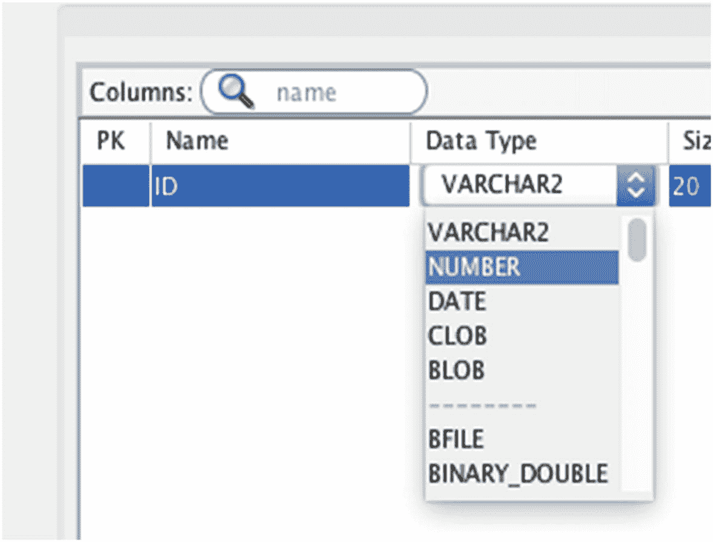

图 13-1. 向表中添加列时选择数据类型

这一步就是指定每个列的数据类型的地方。你指定了：

*   `ID` 列是某种数字。
*   `last_name` 列是文本值。
*   `salary` 列也是数字。


### 我们为什么需要不同的数据类型？

当你创建一张表时，你指定了列名。这应该就是你需要做的全部事情了，对吧？那我们为什么要关心数据类型呢？存在不同数据类型的原因有几个。

首先，它使得数据库能够更高效地存储数据。如果你将每张表的每一列都定义为最多 10,000 个字符的文本值，那么数据库就需要为这些情况预留那么多存储空间，无论你想存储 10,000 个字符的情况有多么罕见。为你的每一列定义合适的数据类型将意味着数据库可以高效地存储数据。

这也意味着你的查询会更快。将本应是数字的值存储为“数字”数据类型，意味着数据库可以更容易地搜索特定值（因为它知道字段的限制，例如是数字而不是字母）。如果值应该存储为数字而不是文本，这也意味着数学计算可以更容易、更快速地执行。

使用合适的数据类型还可以防止无效数据。使用数据库存储数据的主要好处之一，就是你可以对数据存储施加限制。例如，存储一个“订单日期”可以存储为文本值，但这可能意味着你会得到像这样的值：
*   30/01/2018
*   01/30/2018
*   30-Jan 2018
*   40 Jan 2018
*   124/Abc/1000

其中一些值是没问题的，但另一些则不是。然而，如果我们将这个“订单日期”存储为日期值，那么我们就可以使用数据库内置的验证来检查无效日期。Oracle 数据库会知道“40 Jan 2018”不是一个有效的日期，因此它不会存储这个值。这确保了你的数据保持高质量并防止错误。

所以，总而言之，数据类型用于高效地存储数据、提高查询性能以及防止无效数据。

### 有哪些不同的数据类型？

我们已经介绍了什么是数据类型以及为什么使用它们。那么存在哪些类型的数据类型，你如何使用它们呢？

Oracle 数据库（以及许多其他数据库和编程语言）中的数据类型可以分为三组：文本、数字和日期。每一组都有一系列可以用于你的列的数据类型。

#### 文本数据类型

Oracle 中的文本数据类型用于存储文本值。它们可以用来存储字母字符、数字以及许多特殊字符。

Oracle 提供了许多不同的数据类型来存储文本值，每种都有其特定的用途。让我们逐一了解一下。

##### CHAR

Oracle 有一种名为`CHAR`的数据类型，它是“character”（字符）的缩写。它存储字符串，这是一个编程术语，意思是“文本值”。这种数据类型以固定长度存储数据，这意味着无论实际存储的值是什么，该值占用的空间量都是相同的。

当你指定一个`CHAR`列时，你需要指定一个长度值。这表示要在字段中存储的字符数，必须在 1 到 2000 之间。只要长度等于或短于这个数字，你可以在这个列中存储任何文本值。例如，一个长度为 10 的`CHAR`列可以存储“Car”和“Fast Car”的值，但不能存储“Red Sports Car”，因为“Red Sports Car”长于 10 个字符。

关于`CHAR`主要要记住的是：小于你定义的长度的值，其右侧会被添加空格字符以满足该长度。这意味着如果你在一个长度为 10 的`CHAR`列中存储一个“Fast Car”的值，实际存储的值是“Fast Car  ”。末尾添加了两个空格以使长度达到 10。

要将一个列定义为带有长度的`CHAR`，你使用单词`CHAR`，然后在括号内指定长度：

```sql
CHAR(10)
```

你可以更改括号内的数字为你想使用的长度。对于一个长度为 150 的`CHAR`值，使用此代码：

```sql
CHAR(150)
```

**注意**：添加到`CHAR`列的值会在其右侧添加空格字符，以使值的长度达到`CHAR`列定义的长度。

##### VARCHAR2

Oracle 中的`VARCHAR2`数据类型也存储字符串或文本值，与`CHAR`数据类型类似。`VARCHAR2`是“variable character”（可变字符）的缩写。在定义`VARCHAR2`列时需要指定一个最大长度，该长度必须在 1 到 4000 之间，表示字符数。然而，这个长度是可变的。这意味着你存储的值不会在末尾添加空格字符来满足你定义的长度。

例如，如果你声明一个长度为 10 字节的`VARCHAR2`列，那么你可以存储“Car”或“Fast Car”的值。当你存储这些值时，不会添加空格，所以“Fast Car”的值会按你输入的方式精确存储。

根据我的经验，`VARCHAR2`是最常见的数据类型之一，所以你会经常用到它。

为什么它叫`VARCHAR2`而不是`VARCHAR`？这是因为`VARCHAR`是一个 SQL 标准数据类型，未在 Oracle SQL 中使用。当 Oracle 想要实现自己的`VARCHAR`版本时，他们创建了`VARCHAR2`，而不是改变`VARCHAR`的工作方式。这也意味着他们可以在未来的某个时间点实现`VARCHAR`标准。

定义一个`VARCHAR2`与`CHAR`类似，你在括号内指定长度：

```sql
VARCHAR2(20)
```

这意味着定义了一个最大长度为 20 字节的`VARCHAR2`数据类型。字节和字符之间的区别细微但重要。一个字符存储为字节，在许多情况下，一个字节就是一个字符。然而，有些字符需要多个字节来存储。

##### NCHAR

`NCHAR`数据类型是“Unicode character”（Unicode 字符）的缩写。它与`CHAR`数据类型非常相似，因为它存储固定长度的字符数据，并为较短的值添加空格以使其达到你指定的长度。

但是，它用于存储包含 Unicode 字符的文本值。Unicode 字符是软件中可以使用的一组特殊字符。它们在 Oracle 中有自己的数据类型，因为存储这些字符通常需要多于一个字节。Unicode 字符的一些例子是：
*   数学字符，例如表示“求和”的希腊符号：Σ
*   许多带重音的字符：例如，â

我们习惯的标准字符，例如字母表和键盘上可见的符号，每个字符可以存储在一个字节的数据中。这使得它们可以存储在`CHAR`数据类型中，因为一个字节等于一个字符。

对于 Unicode 字符，一个字符可能需要存储在多个字节中，因此需要一个特殊的数据类型。这意味着，如果你想存储这些特殊的 Unicode 字符，并且需要将它们存储在固定长度中，请使用`NCHAR`而不是`CHAR`。

要定义一个`NCHAR`数据类型，像`CHAR`数据类型一样，在括号内以字节为单位指定长度。

```sql
NCHAR(30)
```

这定义了一个长度为 30 字节的`NCHAR`数据类型。


##### NVARCHAR2

`NVARCHAR2` 是 `VARCHAR2` 的 Unicode 版本。就像 `NCHAR` 数据类型一样，它允许存储 Unicode 字符，但它采用了 `VARCHAR2` 的可变长度概念，这意味着您可以存储所需的值，而无需为其添加额外的空格字符。

要定义 `NVARCHAR2` 数据类型，请在括号内指定长度，就像 `VARCHAR2` 数据类型一样。

```
NVARCHAR2(200)
```

这定义了一个长度为 200 字节的 `NVARCHAR2` 数据类型。

下表总结了我们刚刚介绍的不同数据类型。

|     | 定长（用空格填充） | 变长（最大长度） |
| --- | --- | --- |
| 标准字符 | `CHAR` | `VARCHAR2` |
| Unicode 字符 | `NCHAR` | `NVARCHAR2` |

如果您想知道应该使用哪种数据类型，我将在本章后面解释一些建议。

##### LONG

`LONG` 数据类型可用于存储长度高达 2GB 的文本值。`VARCHAR2` 的最大长度为 4000 字节，即 4KB。`LONG` 比这要大得多。

但是，我不建议创建带有 `LONG` 数据类型的列，因为它已被 Oracle 弃用。这意味着 Oracle 已确定在未来版本中不会支持它，并且仅在最近的版本中包含它，以确保使用带有 `LONG` 数据类型的旧代码的客户的数据库不会崩溃。

如果您想在单个字段中存储大量数据，建议使用 `LOB` 数据类型，例如 `CLOB` 或 `BLOB`。我将在本章后面解释这些。

##### RAW

`RAW` 数据类型类似于 `VARCHAR2`，因为它存储可变长度字符串。但是，它以原始格式存储数据，这意味着在导出到另一种类型的数据库时不会进行转换。

这不是我推荐使用的数据类型。如果您在系统之间进行大量转换，那么也许可以使用它，但还有其他更合适的文本数据类型。

##### LONG RAW

`LONG RAW` 数据类型是 `LONG` 数据类型和 `RAW` 数据类型的混合体。它允许存储大量数据（如 `LONG` 数据类型），并确保在导出数据到其他系统时字符不会被转换。

然而，与 `LONG` 数据类型一样，`LONG RAW` 数据类型已被弃用，因此您不应使用它。应使用 `BLOB` 数据类型代替。

#### 数字数据类型

在 Oracle 中，有许多数据类型可用于存储数字值。虽然您可以将数字存储在基于文本的数据类型（如 `VARCHAR2`）中，但如果只存储数字，最好使用数字数据类型，因为：

*   您可以对它们执行算术运算（例如，将年薪除以 12）。
*   您可以将它们四舍五入到不同的小数位数。
*   您可以使用 sum、average 和其他功能对它们进行聚合。

让我们看看数字数据类型。

##### NUMBER

Oracle 中的 `NUMBER` 数据类型用于存储数字。它可以存储整数或小数、正数或负数。存储为 `NUMBER` 数据类型的值范围是从 -9 × 10¹²⁵ 到 9 × 10¹²⁵，这意味着数字大约有 125 位，可正可负。

当您定义 `NUMBER` 数据类型时，可以定义两件事：精度和小数位数。

*   精度是数字中的总位数。
*   小数位数是小数点右边的位数。

使用精度和小数位数的不同值组合，您可以存储正负小数以及整数。

您可以通过在括号内指定精度和小数位数（`p` 代表精度，`s` 代表小数位数）来定义 `NUMBER` 数据类型：

```
NUMBER(p, s)
```

例如，要定义一个总位数为十位、小数位数为三位的数字，您可以这样写：

```
NUMBER(10, 3)
```

这意味着小数点左边有七位数字，右边有三位数字（例如，1234567.123）。

##### INTEGER

`INTEGER` 数据类型是 SQL 标准数据类型，这意味着它存在于所有 SQL 数据库中。然而，在 Oracle 中，它等同于定义 `NUMBER(38)` 数据类型，即一个具有 38 位数字和 0 位小数位数的 `NUMBER`。

因为 `INTEGER` 数据类型实际上被转换为 `NUMBER(38)` 数据类型，所以最好使用 `NUMBER`。如果您不想要 38 位数字，它允许您在值的大小上有更多的自由。它也更清楚地表示了它的含义。

##### FLOAT

Oracle 包含一个 `FLOAT` 数据类型，这是一个 ANSI 标准数据类型（意味着它在所有类型的 SQL 中都可用）。然而，就像 `INTEGER` 一样，`FLOAT` 数据类型在 Oracle 数据库内部被转换为 `NUMBER`。

因此，与其使用被转换为 `NUMBER` 的 `FLOAT` 数据类型，我建议直接使用 `NUMBER`。

##### DECIMAL

与 `FLOAT` 数据类型一样，Oracle 包含一个也是 ANSI 标准数据类型的 `DECIMAL` 数据类型。它也被 Oracle 数据库转换为 `NUMBER` 数据类型。因此，我建议使用 `NUMBER` 数据类型而不是 `DECIMAL`。

##### BINARY_FLOAT

`BINARY_FLOAT` 数据类型用于存储浮点数，即包含小数位的数字。它类似于其他编程语言中的“float”数据类型。

`BINARY_FLOAT` 与 `NUMBER` 数据类型有几个区别：

*   `BINARY_FLOAT` 通常比 `NUMBER` 更快地执行算术计算。
*   `BINARY_FLOAT` 通常比 `NUMBER` 占用更少的存储空间。
*   `BINARY_FLOAT` 是近似定义，而 `NUMBER` 是精确定义。

当存储 `BINARY_FLOAT` 值时，存储的是一个近似值。如果您对这个数字进行大量计算，这可能会导致舍入问题。然而，它适用于存储大的小数或浮点数。

##### BINARY_DOUBLE

`BINARY_DOUBLE` 数据类型与 `BINARY_FLOAT` 数据类型非常相似：

*   它们都存储浮点数。
*   它们都以近似的方式存储数字，而不是 `NUMBER` 那样的精确方式。

然而，`BINARY_FLOAT` 是 32 位精度值，而 `BINARY_DOUBLE` 是 64 位精度值。这意味着它可以比 `BINARY_FLOAT` 存储更多的小数位。如果您需要存储一个大的小数，并且 `BINARY_FLOAT` 无法处理，那么 `BINARY_DOUBLE` 可能是一个不错的选择。

#### 日期数据类型

最后一个主要的数据类型类别是日期数据类型。这些数据类型用于存储与日期和时间相关的任何内容。

##### DATE

`DATE` 数据类型允许您存储日期和时间值。是的，尽管它被称为 `DATE`，但它存储日期和时间。它存储年、月、日、小时、分钟和秒。Oracle SQL 中没有 `DATETIME` 数据类型。

如果您想存储日期和时间值，并且不需要存储时区或秒的小数部分（其他日期数据类型可以做到），则此数据类型很有用。

关于 `DATE` 数据类型需要记住的一点是，该数据类型的默认显示格式仅显示日期（年、月、日），而不显示时间。这可能看起来令人困惑，因为值只显示日期，并且数据类型被称为 `DATE`，但它确实包含时间。我们将在本书后面看到一些这方面的例子。

##### TIMESTAMP

Oracle 中的 `TIMESTAMP` 数据类型类似于 `DATE` 数据类型，但您可以存储秒的小数部分。您可以存储高达 9 的精度，这意味着一秒内有 9 位小数。

`TIMESTAMP` 允许比 `DATE` 数据类型更精细地记录时间。例如，如果您正在记录日志文件中的数据以查看某些事件发生的确切时间，那么秒的小数部分对您来说可能很重要。


##### 带时区的时间戳 (TIMESTAMP WITH TIME ZONE)

`TIMESTAMP WITH TIME ZONE` 数据类型与 `TIMESTAMP` 数据类型类似，但它还包含时区信息。这意味着它包括年、月、日、时、分、秒、小数秒和时区。

一个 `TIMESTAMP WITH TIME ZONE` 值的例子是：“2018-04-21 07:41:03.152 -7:00”。这表示 2018 年 4 月 21 日，上午 7:41:03.152。它还表明该值与 GMT/UTC 相差-7 小时。

在数据库和软件中处理时区可能很困难。使用这种数据类型有助于以正确的方式存储数据。

##### 带本地时区的时间戳 (TIMESTAMP WITH LOCAL TIME ZONE)

`TIMESTAMP WITH LOCAL TIME ZONE` 与 `TIMESTAMP WITH TIME ZONE` 相似，因为它也存储日期、时间和时区。然而，当你从这种类型的列中 `SELECT` 一个值时，该值会以用户的时区显示，而不是像 `TIMESTAMP WITH TIME ZONE` 数据类型那样以数据库的时区显示。

这使得根据查看数据的用户，将数据转换到不同的时区变得更加容易。这看起来可能是一个非常特殊的情况，但如果你正在开发一个全球使用的系统，那么这种数据类型会非常有用。

##### 年月间隔 (INTERVAL YEAR TO MONTH)

到目前为止，我们看到的日期数据类型用于存储一个“时间点”：一个特定的日期和时间。然而，有时需要存储一个“时间段”，例如“4 年”或“2 个月”。有几种方法可以做到这一点。

你可以将其存储在 `NUMBER` 数据类型中，它代表要存储的月数。但是，如果你还想存储年份或天数呢？你可以创建几个不同的列来存储每个值（例如，一个年列和一个月列）。这意味着需要很多额外的列。这也意味着你可能存储一些无效的数据。

这就是 `INTERVAL` 数据类型的用途。它们用于存储一个时间段。

`INTERVAL YEAR TO MONTH` 数据类型用于存储年和月的数量。值之间用短横线分隔，所以“03-06”这个值表示 3 年 6 个月。

使用这种数据类型的优势是：
*   你可以将数据存储在一个列中，而不是两个列中，从而节省查询时间并节省数据库空间。
*   它确保只允许有效的值。

因此，如果你需要存储一个涉及年和月的时间段，这种数据类型很有用。

##### 日秒间隔 (INTERVAL DAY TO SECOND)

`INTERVAL DAY TO SECOND` 是另一种用于存储“时间段”的数据类型。它允许你存储天、小时、分钟和秒。

例如，213 天，14 小时，28 分钟和 17 秒的值显示为“213 14:28:17”。

就像 `INTERVAL YEAR TO MONTH` 数据类型一样，它允许你将所有信息存储在一个列中。它也确保你只存储有效的数据。

#### 其他数据类型

还有一些其他数据类型不属于文本/数字/日期数据类型。两个更常见的数据类型是 `BLOB` 和 `CLOB`。

##### 二进制大对象 (BLOB)

`BLOB` 数据类型代表“二进制大对象”。它用于存储非结构化的二进制对象。

这意味着它对于存储无法保存在文本列中的图像或音频文件很有用。它存储单个文件的数据，但不能存储字符数据。其最大大小为 4GB。

##### 字符大对象 (CLOB)

`CLOB` 数据类型代表“字符大对象”。它与 `BLOB` 类似，但与 `BLOB` 不同，它存储字符数据而非二进制数据。

它的最大大小也是 4GB。它对于存储大的字符值很有用，但如果你想存储图像、音频或其他文件，则应使用 `BLOB`。

### 数据类型建议

你已经了解了 Oracle SQL 中所有主要的数据类型。你如何知道应该使用哪些，尤其是对于那些相似的数据类型？

以下是一些针对不同数据类型的建议：
*   不要使用 `LONG` 或 `LONG RAW`，因为它们已弃用。应改用 `BLOB` 或 `CLOB`。
*   `VARCHAR2` 可以替代 `CHAR`。我不知道有什么理由需要使用 `CHAR` 而不是 `VARCHAR2`。
*   应该使用 `NUMBER` 而不是 `INTEGER`、`FLOAT` 或 `DECIMAL`。
*   考虑二进制数字类型的优缺点，以决定使用 `BINARY_FLOAT` 还是 `NUMBER`。
*   始终指定大小或精度。大多数数据类型允许你指定这个，但有默认值。最好明确指定你想要的大小，而不是依赖默认值。

在接下来的几章中，你将看到一些使用这些数据类型的例子。

### 总结

Oracle SQL 中有许多不同的数据类型，允许你存储不同种类的值。数据类型的三个主要组是文本、数字和日期。这些组中有很多数据类型，它们都用于特定的原因，并有各自的优缺点。

## 14. 创建表

在本书前面，你创建了一个名为 `employee` 的新表并向其中添加了数据。你是使用 SQL Developer 中的菜单选项完成此操作的。还有另一种创建表的方法，我们将在本章中学习。

### 使用 SQL 代码创建表

使用菜单选项创建表的替代方法是使用 SQL 代码。到目前为止，你学到的 SQL 代码允许你使用 `SELECT` 语句从现有表中读取数据。有一系列不同的 SQL 语句可以使用，其中一种就是用于创建表。

为什么你会使用 SQL 代码而不是菜单选项来创建表呢？有几个原因。

你可能无法访问 SQL Developer。虽然它是一个简单的下载和设置程序，但如果你在公司处理他们的数据库，你可能无法访问此程序。创建表的唯一方法将是运行一条 SQL 语句。

另一个原因是，如果创建表是一个更大流程中的一个步骤。可以一个接一个地运行多条 SQL 语句，而无需你为每条语句都按“运行”按钮。这在你作为数据库开发人员或数据库管理员工作时很常见。使用 SQL 代码创建表允许你做到这一点。

你可能也在使用不同的程序来运行 SQL。我最近调查了有多少种不同的 IDE 可以用于 Oracle 数据库，发现有超过三十种！其中有一小部分是公司更常用的，而菜单选项可能并非在每个 IDE 中都可用。使用 SQL 语句创建表在所有这些程序中都是被接受的。

那么，如何使用 SQL 语句创建表呢？你使用 `CREATE TABLE` 语句。

### CREATE TABLE 语句

SQL 有一个名为 `CREATE TABLE` 的语句，它允许你在数据库上创建一个新表。与许多 SQL 语句一样，它用于创建基本表时很简单，但它有很多你将来可能想使用的高级选项。在本章中，我们将重点介绍如何创建一个基本表。

`CREATE TABLE` 语句如下所示：

```
CREATE TABLE tablename (
column_1 data_type,
column_2 data_type,
...
column_n  data_type
);
```

你可能已经注意到它看起来与 `SELECT` 语句大不相同。关于 `CREATE TABLE` 语句有几点需要注意：
*   它以 `CREATE TABLE` 开头。可以用小写书写，但为了遵循代码标准，我建议将 SQL 关键字大写。
*   然后你指定表名。表名长度最多为 30 个字符。
*   然后是一个左括号。
*   在左括号内是你指定表中要有的列的地方。
*   对于每一列，你指定一个名称和一个数据类型。使用逗号分隔每个列定义。
*   添加完所有列后，以右括号和分号结束。

一旦你编写了这样一条语句，你运行它，表就会在数据库上创建。我们将看几个这条语句的例子。


### 我们的员工表

在前面的章节中，我们创建了一个名为 `employee` 的新表。我们使用了 SQL Developer 内部的菜单选项来完成此操作，如图 14-1 所示。

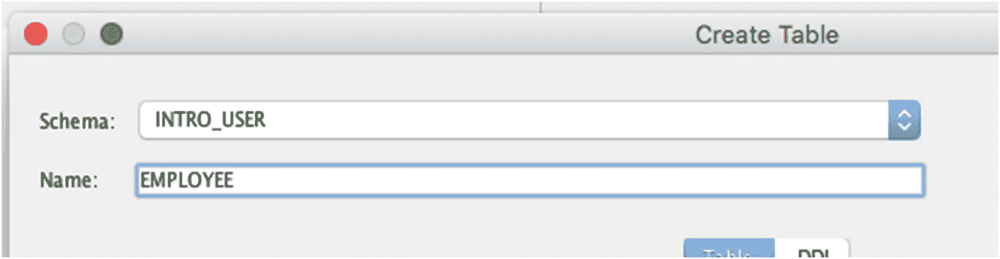

图 14-1 员工表

如果用 `CREATE TABLE` 语句来表示，会是什么样子呢？如果我们想使用 `CREATE TABLE` 语句来创建这个员工表，它将是这样的：

```sql
CREATE TABLE employee (
    id NUMBER,
    last_name VARCHAR2(20),
    salary NUMBER
);
```

该表被命名为 `employee`。我用小写书写，因为这是我倾向于遵循的标准（用小写书写表名）。Oracle 实际上是以大写形式存储表名的，因此根据数据库，无论你写 `employee` 还是 `EMPLOYEE`，结果都是一样的。

显示的第一个列是 `id`。我也倾向于用小写书写列名。它的数据类型是 `NUMBER`，后面加了一个逗号，因为我们想向这个表添加另一个列。

第二列是 `last_name`。它的数据类型是 `VARCHAR2`，这是我们在上一章介绍过的一种文本数据类型。这个 `VARCHAR2` 后面括号里有一个 20。这是你为许多数据类型指定长度、大小或精度的方式，对于 `VARCHAR2` 数据类型，这个数字表示该列允许的最大字符数。所以，对于这个表中的 `last_name`，你最多可以存储 20 个字节。

最后，我们有 `salary` 列，它也是一个数字。你可以看到 `id` 和 `salary` 列都只写了 `NUMBER`，括号里没有值。通过不包含一个值，就会使用一个默认值，这意味着值会按你输入的方式存储。`NUMBER` 数据类型的默认大小是 38。通常最好为每个变量指定一个大小，这样可以明确你期望它有多大。

这个例子是基于我们已经创建的一个表。如果我们尝试在 SQL Developer 中运行这个语句，会得到一个错误，提示表已存在。这是因为我们不能有两个同名的表。

让我们看另一个不同名字的例子。

### 存储办公室详细信息

假设我们想扩展我们的数据库以存储更多信息。我们想存储关于公司不同办公室的数据，它们位于哪里，以及哪些员工在里面工作。为此，我们将创建一个新表。

为什么我们不能把这些信息存储在 `employee` 表中呢？让我们试试看会发生什么。

在 SQL 中，你可以修改现有的表来添加新列，我们将在后面的章节中学习。假设我们已经在 `employee` 表中添加了一个名为 `office` 的新列，如下所示：

| ID | LAST_NAME | SALARY | OFFICE |
| --- | --- | --- | --- |
| 1 | JONES | 20000 |   |
| 2 | SMITH | 35000 |   |
| 3 | KING | 40000 |   |
| 4 | SIMPSON | 52000 |   |
| 5 | ANDERSON | 31000 |   |
| 6 | COOPER | (null) |   |
| 7 | (null) | (null) |   |
| 8 | SMITH | 62000 |   |
| 9 | PATRICK | 40000 |   |

现在，你可以尝试通过向这个 `office` 列添加信息来向此表添加数据。

| ID | LAST_NAME | SALARY | OFFICE |
| --- | --- | --- | --- |
| 1 | JONES | 20000 | 123 Main Street |
| 2 | SMITH | 35000 | 45 Smith Street |
| 3 | KING | 40000 | Level 2, 10 Clark Street |
| 4 | SIMPSON | 52000 | 205 Capital Road |
| 5 | ANDERSON | 31000 | 123 Main Street |
| 6 | COOPER | (null) | 12 Main Street |
| 7 | (null) | (null) | Level 2, 10 Clark Street |
| 8 | SMITH | 62000 | Level 1, 10 Clark Street |
| 9 | PATRICK | 40000 | 123 Main St |

这看起来可能没问题。我们将地址，有时是建筑物楼层，存储在这个列中。我们可以看到一些员工与其他员工在同一个办公室工作。

然而，看看 ID 为 5、6 和 9 的记录。

| ID | LAST_NAME | SALARY | OFFICE |
| --- | --- | --- | --- |
| 5 | ANDERSON | 31000 | 123 Main Street |
| 6 | COOPER | (null) | 12 Main Street |
| 9 | PATRICK | 40000 | 123 Main St |

`office` 的值看起来很相似。它们是相同的吗？COOPER 的办公室 12 Main Street 和 ANDERSON 的办公室 123 Main Street 是同一个吗？只是街道号码打错了？PATRICK 的办公室和 ANDERSON 的办公室是同一个，只是把 Street 缩写成了 St？在这种设置下很容易混淆。

另一个问题可能出现在我们更新数据时。假设我们将 SMITH 的 `office` 从 45 Smith Street 更新为 123 Main Street。

| ID | LAST_NAME | SALARY | OFFICE |
| --- | --- | --- | --- |
| 1 | JONES | 20000 | 123 Main Street |
| 2 | SMITH | 35000 | 123 Main Street |
| 3 | KING | 40000 | Level 2, 10 Clark Street |
| 4 | SIMPSON | 52000 | 205 Capital Road |
| 5 | ANDERSON | 31000 | 123 Main Street |
| 6 | COOPER | (null) | 12 Main Street |
| 7 | (null) | (null) | Level 2, 10 Clark Street |
| 8 | SMITH | 62000 | Level 1, 10 Clark Street |
| 9 | PATRICK | 40000 | 123 Main St |

这意味着什么？这是否意味着 SMITH 已从 45 Smith Street 的办公室搬到了 123 Main Street 的办公室？如果是这样，45 Street Street 的办公室在公司还存在吗？根据这个表，它不存在了，因为它没有被列在那一列中。

这被称为 `删除异常`，是设计数据库时应避免的问题。`删除异常` 是指你更新一行以引用不同的值，而关于先前值存在的所有记录都丢失了。这是我们想要避免的。

另一个可能出现的问题称为 `更新异常`。假设我们将 ANDERSON 的办公室从 123 Main Street 更改为 123 Main Street South。

| ID | LAST_NAME | SALARY | OFFICE |
| --- | --- | --- | --- |
| 1 | JONES | 20000 | 123 Main Street |
| 2 | SMITH | 35000 | 123 Main Street |
| 3 | KING | 40000 | Level 2, 10 Clark Street |
| 4 | SIMPSON | 52000 | 205 Capital Road |
| 5 | ANDERSON | 31000 | 123 Main Street South |
| 6 | COOPER | (null) | 12 Main Street |
| 7 | (null) | (null) | Level 2, 10 Clark Street |
| 8 | SMITH | 62000 | Level 1, 10 Clark Street |
| 9 | PATRICK | 40000 | 123 Main St |

这是否意味着 ANDERSON 已经搬到了 123 Main Street South 的新办公室？或者，这是否意味着 123 Main Street 的办公室不复存在，已搬迁至 123 Main Street South？或者，这是否意味着市议会已将 Main Street 更名为 Main Street South，但实际上对于公司来说是同一个办公室和位置？

我们可以看到还有其他几位员工使用 123 Main Street 办公室，这可能正确也可能不正确。如果你打算更新此办公室的所有出现位置，但有些被遗漏了，那么就可能出现问题。这被称为 `更新异常`，应该避免。

有一个称为 `数据库设计` 或 `关系数据库设计` 的软件开发领域，它引入了一个称为 `规范化` 的过程。遵循此过程是为了确保你的数据库结构高效，以避免这些错误。

对于我们的例子，如果我们把办公室的详细信息存储在一个单独的表中，就可以避免所有这些问题。这是因为我们实际上想要存储两件不同的事情：

*   公司所有办公室的列表
*   哪些员工在哪些办公室工作的记录

这些信息以两种不同的方式捕获。


### 办公室表

让我们来创建 `office` 表。我们希望 `office` 表包含一个 `ID` 和一个 `address`。

我们的 `CREATE TABLE()` 语句将如下所示：

```sql
CREATE TABLE office (
id,
address
);
```

在创建此表之前，我们需要指定数据类型和大小。对于 `ID` 列，这将是一个整数。我们可以使用 `NUMBER` 数据类型，在我们的示例中可以使用大小为 5。这将能处理从 0 到 99999 的数字，这对我们来说应该足够了。

对于 `address` 字段，这将是一个文本字段，因为我们希望存储街道号码和街道名称。在我们的示例中可以使用 200 个字符，我们将使用 `VARCHAR2`。

我们的 `CREATE TABLE()` 语句看起来将是这样的：

```sql
CREATE TABLE office (
id NUMBER(5),
address VARCHAR2(200)
);
```

要运行此语句：

1.  打开 SQL Developer 并创建一个新的 SQL 文件（或使用一个已打开的文件），就像你在前面章节中所做的那样。
2.  将前面所示的 `CREATE TABLE()` 语句输入到 SQL 窗口中，如图 14-2 所示。
    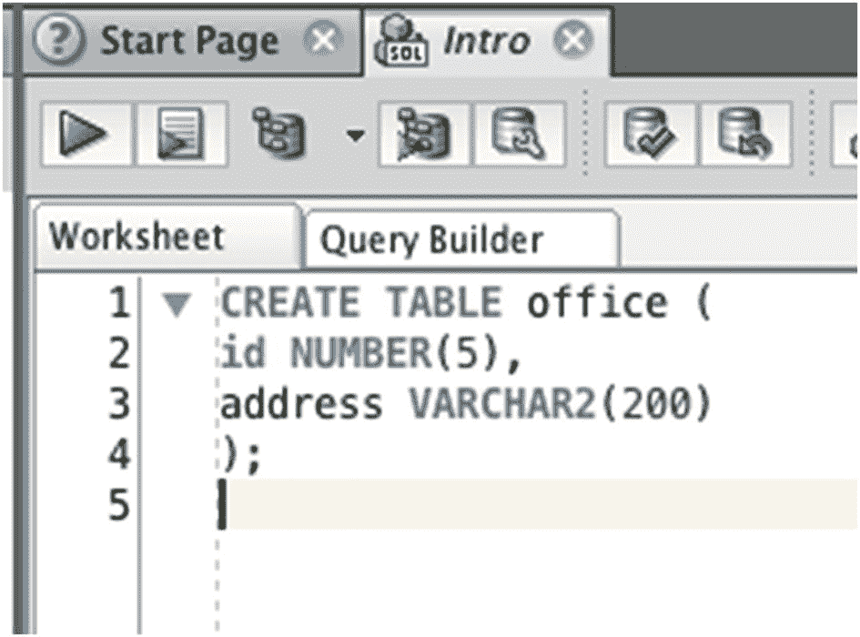
    图 14-2：SQL Developer 中的 `CREATE TABLE()` 语句
3.  点击工具栏上的“运行语句”按钮（那个大的绿色三角形），就像你之前运行语句时所做的那样。运行 `CREATE TABLE()` 语句与运行 `SELECT()` 语句的方式相同。

语句运行后，屏幕底部会出现一条消息，告诉你表已成功创建，如图 14-3 所示。

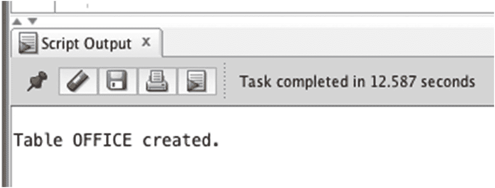
图 14-3：表创建成功

如果出现错误消息，可能有几个原因：
*   表名已被另一个表使用。表名在数据库中必须是唯一的，因此如果你已经创建了这个表，就不能再次创建它。你将在本书后面学习如何删除表。
*   确保在 `id NUMBER(5)` 语句后面有一个逗号，因为这会让数据库知道你要指定第二个列。如果没有逗号，你会得到一个错误。
*   确保空格的位置与所示的一致，例如在 `CREATE` 和 `TABLE` 之间，在列名（`id` 或 `address`）和数据类型（`NUMBER` 或 `VARCHAR2`）之间。
*   确保 `VARCHAR2` 中没有空格。它是一个单词。

你现在已经成功在数据库中创建了第二个表！让我们再创建一个使用不同数据类型的第三个表。

### 销售会议表

除了存储员工和办公室的信息，我们还想存储员工参加的销售会议信息。这些会议将与特定公司举行，并在某个日期和时间发生。我们想要存储的列有：
*   参加会议的员工
*   会议是与哪家公司举行的
*   会议的日期和时间

对于列的长度，公司名称可以是 200 个字符。日期和时间值不需要长度，因为它是标准格式。我们的员工姓名将与 `employee` 表相同，为 20 个字符。

我们的 `CREATE TABLE()` 语句将如下所示：

```sql
CREATE TABLE sales_meeting (
id NUMBER(5),
employee VARCHAR2(200),
company VARCHAR2(200),
meeting_date DATE
);
```

在我们运行这个语句之前，有几个你应该了解的概念。

### 主键

你可能已经注意到，到目前为止我们创建的所有表都包含一个名为 `id` 的列，并且该列的数据类型是 `NUMBER`。使用这个字段的原因是为了让你在查询中能够识别记录。

这是什么意思？好吧，让我们看看我们的 `employee` 表。

| ID | 姓氏 | 工资 |
| --- | --- | --- |
| 1 | JONES | 20000 |
| 2 | SMITH | 35000 |
| 3 | KING | 40000 |
| 4 | SIMPSON | 52000 |
| 5 | ANDERSON | 31000 |
| 6 | COOPER | (null) |
| 7 | (null) | (null) |
| 8 | SMITH | 62000 |
| 9 | PATRICK | 40000 |

它有一个 `id` 列和一个 `last_name` 列。假设你想查找员工 JONES 的所有信息。这很简单，因为你只需查找 `last_name` 为 JONES 的表记录。

但是，如果你需要查找 SMITH 的信息呢？你可以查找 `last_name` 是 SMITH 的记录，但有两条记录的姓氏是 SMITH。你会用哪一条？他们有相同的 `last_name` 但不同的 `salary` 值。他们也可能有不同的 `offices`。需要有一种方法能唯一标识此表中的记录。

这就是 `id` 列的用途。它是一个存储表中 `employee` 记录的唯一编号的列。每当数据库或系统需要找到特定记录时，都可以使用这个 `ID`。

同样的概念可以在许多不同的系统中找到：
*   你的纳税识别号，例如社会安全号码（在美国）或税务档案号（在澳大利亚）
*   你的电子邮件地址
*   你登录系统时使用的任何用户名
*   保险、电话或互联网公司的会员号或账号

使用这种 ID 或唯一标识符很有帮助，因为：
*   如果你知道这个 ID，总有办法找到你想要的记录。
*   记录上的任何其他信息都可以更改，只要 ID 相同。例如，人们可以改名，但记录仍然是同一条记录。
*   易于搜索和关联其他记录（我们将在本书后面详细介绍）。

表中每条记录都有唯一标识符的概念称为 *主键*。表上的主键不仅仅是添加一个 ID 字段。Oracle（以及许多其他数据库）允许你将一个或多个列指定为主键。这意味着：
*   数据库确保值是唯一的。如果你尝试输入一个已被其他记录使用的值，你会得到一个错误。
*   数据库将使基于此字段的搜索更容易，我们将在本书后面介绍。

确保表具有主键是良好的数据库设计实践。它可以提高数据质量，防止重复行，并提高表的性能。

当我们编写 `sales_meeting` 表的 `CREATE TABLE()` 语句时，我们要求你先不要运行该语句。这是因为我们想向这个表添加“主键”。现在就让我们来添加吧。

要向表添加主键，你可以在列名和数据类型后添加 `PRIMARY KEY` 这几个词。如下面的语句所示，它位于数据类型之后，逗号之前。在你运行这个创建表的语句之前，还有一个概念需要解释，以及需要对这个语句做的另一个更改。

```sql
CREATE TABLE sales_meeting (
id NUMBER(5) PRIMARY KEY,
employee VARCHAR2(200),
company VARCHAR2(200),
meeting_date DATE
);
```


### 再次记录员工信息

我们的 `sales_meeting` 表有一个名为 `employee` 的列，用于存储参与 `sales_meeting` 的员工的 `last_name`。假设我们的 `sales_meeting` 表看起来像这样：

```
ID   EMPLOYEE   COMPANY            MEETING_DATE
1    ANDERSON   ABC Construction   10 August 2018
2    SMITH      BW Signage         21 August 2018
```

你可以看到第一条记录是与 ANDERSON 和 ABC Construction 公司的会议。然而，第二条记录是与 SMITH。是哪一个 SMITH 员工？我们有两个叫 SMITH 的员工。

如果你尝试在表中存储员工的姓名，这可能会导致几个问题：

*   如果有两条同名记录，你无法确定它具体关联到哪位员工。
*   如果你在 `employee` 表中更改了员工的姓氏，你也必须在这里更改。如果你忘记了，那么此表中的记录将与 `employee` 表不匹配。
*   如果你在此表中添加一个员工姓名，那么你需要确保 `employee` 表中也有相应的记录，否则你对参与销售会议的员工将一无所知。

这个问题有一个解决方案。这个解决方案的概念称为“外键”。

### 外键

当你创建 `sales_meeting` 表时，你需要存储会议所涉及的员工信息。然而，你并不一定需要存储员工的姓名。你只需要知道是哪位员工即可。这可以通过引用 `employee` 表中的记录来实现。

这是我们的 `employee` 表：

```
ID  LAST_NAME   SALARY
1   JONES       20000
2   SMITH       35000
3   KING        40000
4   SIMPSON     52000
5   ANDERSON    31000
6   COOPER      (null)
7   (null)      (null)
8   SMITH       62000
9   PATRICK     40000
```

这是我们的 `sales_meeting` 表：

```
ID  EMPLOYEE   COMPANY            MEETING_DATE
1   ANDERSON   ABC Construction   10 August 2018
2   SMITH      BW Signage         21 August 2018
```

与其在 `employee` 列中存储员工的姓氏（例如 ANDERSON, SMITH），你可以存储员工的 ID 号，即主键。这意味着：

*   我们的 `sales_meeting` 记录将只关联到一位员工，从而避免了两位员工同姓的问题。
*   总是存在对应的员工记录。你无法存储 ID 为 10 的值，因为没有 ID 为 10 的员工。
*   如果你更改了 `last_name`，你只需要在一个地方更改。`sales_meeting` 表中的相关记录不包含 `last_name`，因此它们不需要知道这个更改。

因此，与其在 `sales_meeting` 表中存储 ANDERSON 和 SMITH，不如存储他们的 ID 号：

```
ID   EMPLOYEE   COMPANY            MEETING_DATE
1    5          ABC Construction   10 August 2018
2    2          BW Signage         21 August 2018
```

这样你可以看到第一条记录的 `employee` 值为 5，它指向 `employee` 表中 `ID` 为 5 的员工。你还可以看到第二条记录的 `employee` 值为 2，它指向 `employee` 表中一条 `last_name` 为 SMITH 的记录。这样就清楚它指向的是两条 SMITH 记录中的哪一条。

使用数据库列来存储另一个表的主键的概念称为 `foreign key`。在此示例中，`sales_meeting` 表中的 `employee` 列就是一个外键。

就像使用主键一样，外键是一种良好的数据库设计技术，可以避免前面提到的所有问题。我们如何在创建表时指定外键呢？

目前，我们的 `sales_meeting` 表的 `CREATE TABLE` 语句如下：

```
CREATE TABLE sales_meeting (
id NUMBER(5) PRIMARY KEY,
employee VARCHAR2(200),
company VARCHAR2(200),
meeting_date DATE
);
```

首先，你需要将 `employee` 列的数据类型从 `VARCHAR2` 改为 `NUMBER` 类型，以匹配 `employee` 表中的 `ID`。你也可以将列名从 `employee` 改为 `employee_id`，以明确表示它指向 `employee` 表的 `id`。

```
CREATE TABLE sales_meeting (
id NUMBER(5) PRIMARY KEY,
employee_id NUMBER(5),
company VARCHAR2(200),
meeting_date DATE
);
```

现在，你需要添加一些代码来指定外键。你可以保持语句原样，这样就可以向此表添加 `employee ID`。但是，你想要添加一种称为 `foreign key constraint` 的东西，以明确指定它是一个外键，并利用数据库的一些优势。

`constraint` 是你可以添加到表中的东西，用于指定可添加数据的规则。这意味着你将无法向 `employee_id` 列添加在 `employee` 表中没有对应记录的数字，从而提高了数据质量。

我们将在后面的章节中探讨如何添加外键约束，因为每个外键都需要一个对应的主键，而我们尚未向 `employee` 表添加主键。

创建 `sales_meeting` 表的最终代码如下：

```
CREATE TABLE sales_meeting (
id NUMBER(5) PRIMARY KEY,
employee_id NUMBER(5),
company VARCHAR2(200),
meeting_date DATE
);
```

你现在可以在 SQL Developer 中运行此查询。表应该会像创建 `office` 表一样被创建。在后面的章节中，我们将学习如何从两个表中获取数据。

### 总结

在 SQL 中创建表可以使用名为 `CREATE TABLE` 的 SQL 命令完成。当你无法访问 SQL Developer，或者将此语句作为更大集合的一部分运行时，使用 SQL 命令很有帮助。

主键是你可以应用于列的数据库功能，它确保列值是唯一的并标识表中的行。外键是另一个应用于列的数据库功能，它存储另一个表的主键，并防止重复存储相同的数据。

## 15. 向表中添加数据

到目前为止，我们一直在使用的数据库有三个表：`employee`、`office` 和 `sales_meeting`。其中只有一个表包含数据：`employee` 表。向表中添加数据是创建表之后的一个独立步骤。

在本书前面，当你向 `employee` 表添加数据时，你使用了 SQL Developer 中的菜单选项。你在设置表时和向表中添加更多数据时都这样做过。然而，正如我们了解到创建表可以使用语句一样，添加数据也可以使用 SQL 语句。

使用 SQL 语句向表添加数据的原因与使用 `CREATE TABLE` 语句创建表的原因相同：

*   当你使用不同的 IDE 或无法访问 SQL Developer 时，可以使用它。
*   它更快。
*   它可以作为更大步骤集合的一部分使用。

在 Oracle SQL 中，你可以使用 `INSERT` 语句向表中添加数据。


### INSERT 语句

`INSERT` 语句是一条 SQL 语句，可让你向表中添加数据。你需要指定表、列以及要添加的值，运行该语句后，数据即被添加到表中。`INSERT` 语句格式如下：

```sql
INSERT INTO tablename (columns) VALUES (values_to_insert);
```

它以 `INSERT INTO` 开头，这些是 SQL 关键字，表明你要插入数据。然后你指定 `tablename`，即数据要插入到的目标表。接下来，你指定列名，也就是你想添加数据的具体列。之后是关键字 `VALUES`，其后括号内是你要插入到表中的值。

在向表中插入数据时指定列的原因，并非每一列都需要填值。你可能希望某些列留空。这样做也便于数据库知道哪个值对应哪一列。

当你编写 `INSERT` 语句时，它通常包含多个列：

```sql
INSERT INTO tablename (col1, col2, col3) VALUES (val1, val2, val3);
```

你需要确保从表中指定的列数（第一组括号）与 `VALUES` 部分（第二组括号）的值数量相同。在此示例中，`val1` 将被添加到 `col1` 列，`val2` 被添加到 `col2` 列，`val3` 被添加到 `col3` 列。

让我们看一个例子。假设你想向 `office` 表添加一条新记录。`office` 表有 `id` 和 `address` 两列。我们的 `INSERT` 语句开头如下：

```sql
INSERT INTO office (id, address) VALUES (
```

接下来，你需要指定要插入的值。我们想插入第一条记录，所以 ID 为 `1`，地址为 `'123 Smith Street'`。我们的语句如下：

```sql
INSERT INTO office (id, address) VALUES (1, '123 Smith Street');
```

我们有两列和两个值。值之间用逗号分隔。第一个值代表 `id`，第二个值代表 `address`。`id` 值是一个数字，因此不需要用单引号括起来。`address` 值是一个文本值，因此需要放在单引号内。

### 运行 INSERT 语句

你可以像运行任何其他 SQL 语句一样运行此语句。

1.  打开 SQL Developer 并新建一个 SQL 文件。
2.  将前面提到的 `INSERT` 语句输入到代码区域，如图 15-1 所示。

    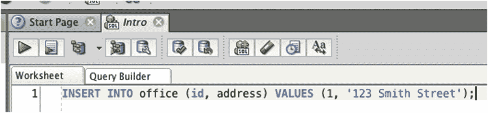

    图 15-1

    SQL Developer 中的 `INSERT` 语句

3.  点击运行按钮。

语句运行后，你将在屏幕底部看到其输出，如图 15-2 所示。

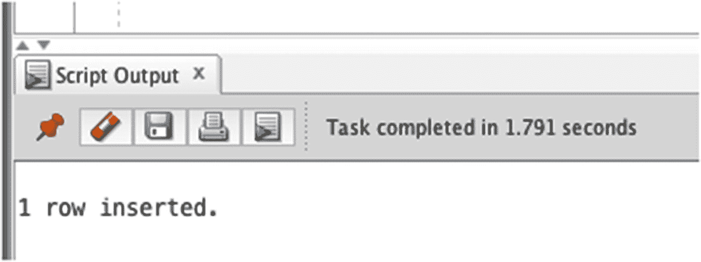

图 15-2

`INSERT` 语句的输出

它将显示“1 row inserted。”这表示记录已插入。它不会向你显示记录的具体内容；要查看内容，你需要对该表运行一条 `SELECT` 语句。

如果你看到错误信息，应检查你的 `INSERT` 语句中的几点：

*   表名拼写正确吗？表名必须在数据库中已存在，我遇到过很多错误都是因为表名拼写稍有差错。
*   你指定的列数与值的数量相同吗？如果列数不同，你会得到一个错误。
*   值是否引用了正确的列？如果数据类型不同（例如，你试图将地址输入到 `id` 列），你会得到一个错误。
*   文本值是否用单引号括起来了？如果没有，它们会被当作 SQL 代码处理，并可能导致错误。

一旦你的语句成功运行，我们可以验证数据是否存在于表中。为此，对表运行一条 `SELECT` 语句：

```sql
SELECT *
FROM office;
```

因为我们只是检查数据是否存在，使用 `SELECT *` 是可以的。如果你运行这条语句，将得到以下结果：

```
ID   ADDRESS
1    123 Smith Street
```

你可以看到数据已成功插入到表中。

### 插入更多数据

我们可以向此表中插入更多数据，以便有更多数据可供操作。让我们再插入两条记录：

*   45 Main Street，ID 为 2
*   10 Collins Road，ID 为 3

`INSERT` 语句如下：

```sql
INSERT INTO office (id, address) VALUES (2, '45 Main Street');
INSERT INTO office (id, address) VALUES (3, '10 Collins Road');
```

我们可以在 SQL Developer 中运行这两条语句。不必分开运行，你可以将它们连续运行。

1.  将这两条语句添加到你的 SQL Developer 窗口中，如图 15-3 所示。

    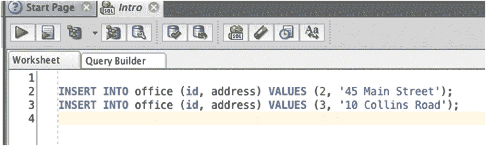

    图 15-3

    两条 `INSERT` 语句

2.  选中这两条语句使其高亮显示，如图 15-4 所示。

    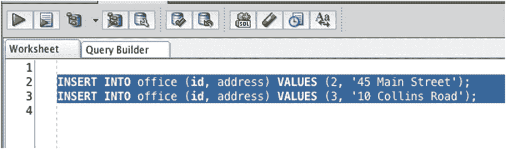

    图 15-4

    选中两条 `INSERT` 语句

3.  点击运行按钮。两条语句将被依次运行。

屏幕底部的输出应显示两行独立的“1 row inserted”，如图 15-5 所示。

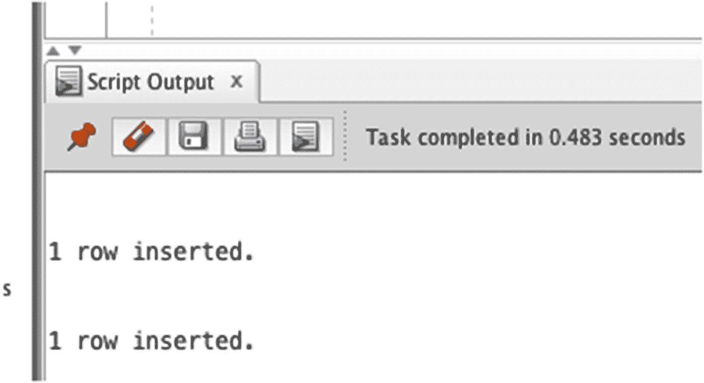

图 15-5

两条 `INSERT` 语句的输出

让我们再次从 `office` 表中查询数据。

```sql
SELECT *
FROM office;
```

结果如下：

```
ID   ADDRESS
1    123 Smith Street
2    45 Main Street
3    10 Collins Road
```

你可以看到所有三条记录都出现在表中。下面我们来看一些插入日期值的例子。

### 插入日期值

向表中添加日期值需要特殊处理，因为世界各地的默认日期格式可能不同。

Oracle 数据库在安装时（Oracle Express）确定所有日期的日期格式。这很重要，因为它决定了我们如何向数据库添加日期值。

让我们向 `sales_meeting` 表添加一些数据。如果你还记得前面创建该表的章节，它有几列：

*   `id`
*   `employee_id`
*   `company`
*   `meeting_date`

`id` 和 `employee_id` 列是数字。`company` 列是文本值，`meeting_date` 是日期。我们的 `INSERT` 语句如下：

```sql
INSERT INTO sales_meeting (id, employee_id, company, meeting_date) VALUES (1, 5, 'ABC Construction', 'Aug 10 2018');
```

这将插入一条记录，其 `id` 为 1，`employee_id` 为 5，`company` 为 `'ABC Construction'`，`meeting_date` 为 `'Aug 10 2018'`。

但是，如果你尝试在 SQL Developer 中运行此语句，很可能会出错，如图 15-6 所示。

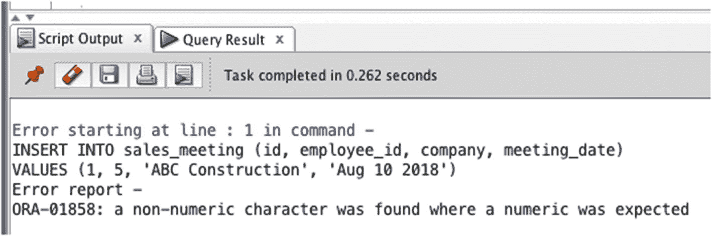

图 15-6

插入日期时的错误信息

此错误发生的原因是数据库不认为“Aug 10 2018”是有效日期。对你我而言它似乎是有效的，但对数据库来说并非如此。数据库需要特定格式的日期，具体取决于你所在的地区。

不过，有一种符合 ANSI 标准的方法可以向数据库插入日期。你可以使用日期字面值，它是一个关键字（即“`DATE`”），以“`YYYY-MM-DD`”的特定格式指定日期。这意味着：

*   四位数字表示年份，后接一个短横线
*   然后是两位数字表示月份，后接一个短横线
*   然后是两位数字表示日

因此，要将“Aug 10 2018”写成此格式，需要写为 `DATE '2018-08-10'`。


#### 注意

默认日期格式是在安装 Oracle 数据库时设置的，根据您所在的地理位置，格式可能有所不同。

让我们再次尝试使用这个新格式的 `INSERT` 语句：

```
INSERT INTO sales_meeting (id, employee_id, company, meeting_date) VALUES (1, 5, 'ABC Construction', DATE '2018-08-10');
```

如果您在 `SQL Developer` 中运行此语句，您将看到成功的消息“1 row inserted.”。

您可以通过运行 `SELECT` 语句查看此表中的数据：

```
SELECT *
FROM sales_meeting;
```

输出结果如下所示。

| ID | EMPLOYEE | COMPANY | MEETING_DATE |
| --- | --- | --- | --- |
| 1 | 5 | ABC Construction | 10/AUG/2018 |

此处的 `meeting_date` 列是 `DATE` 数据类型。Oracle 会根据您所在的地区和数据库设置，以不同的格式显示此日期。上面显示的格式是“DD/MON/YYYY”，但您的格式也可能是“DD-MON-YYYY”或“MM/DD/YYYY”。

让我们向此表插入第二条记录，此表在上一章中使用过：

```
INSERT INTO sales_meeting (id, employee_id, company, meeting_date) VALUES (2, 2, 'BW Signage', DATE '2018-08-21');
```

一旦您运行此语句，该记录就进入表中。您可以再次运行 `SELECT` 查询以查看表中的结果：

| ID | EMPLOYEE | COMPANY | MEETING_DATE |
| --- | --- | --- | --- |
| 1 | 5 | ABC Construction | 10/AUG/2018 |
| 2 | 2 | BW Signage | 21/AUG/2018 |

```
SELECT *
FROM sales_meeting;
```

### 保存和撤销更改

在更改数据时，有一个相关且有用的数据库概念需要了解。当您在计算机上使用程序时，您对文件进行更改并看到这些更改。然而，在您保存文件之前，这些更改不会永久存储在文件中。如果您不想保存更改，可以在不保存的情况下退出程序。

Oracle 数据库有一个类似的概念，称为 `COMMIT` 和 `ROLLBACK`。这是 Oracle SQL 中的两个关键字：

*   `COMMIT` 将您所做的任何更改永久保存到数据库中。这类似于在文字处理器中按下保存按钮。
*   `ROLLBACK` 将撤销对数据库所做的所有更改。这类似于关闭文字处理器而不保存更改。

这两个语句适用于自您连接到 Oracle 数据库或自您上次运行这些语句之一以来插入、更新或删除的数据。

为什么需要知道这个？因为除非您运行这两个命令之一，否则您刚刚使用 `INSERT` 语句插入的数据不会保存在数据库中。如果您退出 `SQL Developer`，会收到一个关于提交更改的警告，但能够在 `SQL Developer` 中提交是很好的习惯。

您可以在 `SQL Developer` 中以两种方式执行 `COMMIT` 或 `ROLLBACK`：通过运行语句或单击 `SQL Developer` 中的按钮。要运行语句，请将命令 `COMMIT;` 输入到 `SQL Developer` 中，如图 15-7 所示。

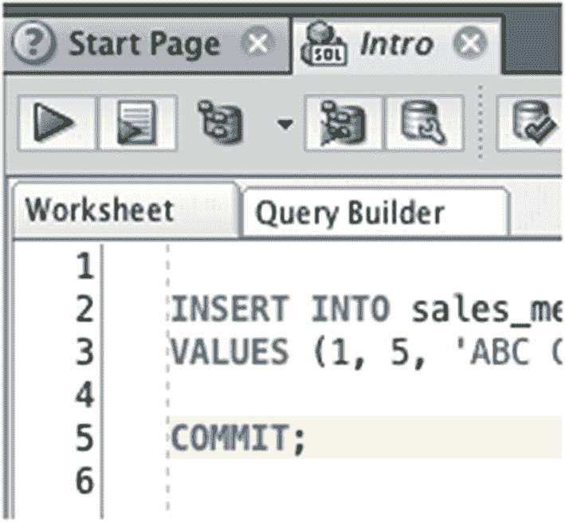
*图 15-7. COMMIT 命令*

然后，单击运行按钮。输出面板应显示“Commit completed.”。

如果您想执行 `ROLLBACK`，请输入命令 `ROLLBACK` 并单击运行按钮。不过目前，您只需要执行 `COMMIT`，而不需要 `ROLLBACK`。

或者，您可以使用 `SQL Developer` 中的按钮来提交。此按钮是一个带有绿色对勾的灰色圆柱体，在 SQL 窗口中可用，如图 15-8 所示。`ROLLBACK` 按钮在其旁边。

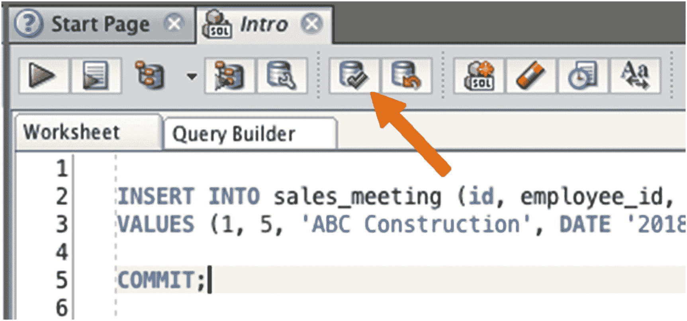
*图 15-8. SQL Developer 中的 COMMIT 按钮*

因此，一旦您完成向数据库表中插入数据，最好提交数据。如果您退出 `SQL Developer`，会收到询问，但自己提交数据是一个应该养成的好习惯。

### 插入数据的最佳实践

在本章中，您学习了如何向 Oracle 数据库插入数据。在执行此操作时，我可以提供一些“最佳实践”或技巧。

指定您要插入的列。`INSERT` 语句允许您指定要向其中添加数据的表的列。这是第一组括号内的部分：

```
INSERT INTO table (col1, col2, col3) VALUES (val1, val2, val3)
```

在 SQL 中，此部分是可选的。您实际上不需要指定列即可运行 `INSERT` 语句。如果您不指定它们，值将按照数据库中列定义的顺序插入。这是有风险的，因为不能保证列的顺序保持不变。如果您不指定列，那么您的 `INSERT` 语句将来可能会失败。在运行 `INSERT` 语句时始终指定列是一个好主意。

将文本和日期用引号括起来，但数字不需要。您可能会忍不住将所有值都放在引号内，因为文本和日期值需要引号。但是，您不需要将数字放在引号内，最好在指定数字时不加引号，以避免数据库可能进行的任何额外处理。

记住完成后要 `COMMIT`。这是我们看到的第一个要求您在语句运行后提交数据的语句。如果您运行 `INSERT` 语句后想知道为什么应用程序或其他用户看不到数据，那很可能是因为它尚未提交。

### 小结

Oracle SQL 中的 `INSERT` 语句允许您向表中添加数据。您可以指定表名、列和要添加的值。文本和日期值需要放在单引号内，但数字不需要。

插入数据后，要使其永久保存到数据库，需要使用 `COMMIT` 命令进行提交。如果您决定不想提交数据，可以运行 `ROLLBACK` 命令来撤销这些更改。

## 16. 更新和删除数据

在上一章中，您学习了如何向表中添加数据。SQL 允许您更改表中已有的数据，我们将在本章中学习如何操作。

为什么要在数据添加后更新它？也许您在运行 `INSERT` 语句时数据出错了，比如名字拼写错误或日期添加错误。或者也许应用程序的一部分进行了更改并需要更新数据。或者应用程序的用户更改了一些数据并希望保存它。这些都将涉及更新数据库中的数据。

好消息是，您不必删除记录并将其作为新记录插入。SQL 提供了一条命令，允许您对现有数据进行更改。


### UPDATE 语句

SQL 中有一种叫做 `UPDATE` 的语句，它允许你更改表中已有的数据。`UPDATE` 语句的工作方式与 `SELECT` 和 `INSERT` 语句类似，你需要指定一些关键字和数据，然后运行该语句。

`UPDATE` 语句的格式如下所示：

```sql
UPDATE tablename
SET col1 = val1 [, col2 = val2…]
[WHERE condition];
```

该语句包含几个部分：

*   首先，我们以 `UPDATE` 关键字开头，这告诉数据库你正在运行什么语句。
*   然后，我们指定包含要更新数据的表名。在 Oracle SQL 中，一次只能更新一个表。
*   接着是 `SET` 关键字，你在这里指定要更改的内容。
*   在 `SET` 关键字之后，我们指定列和值的组合。这包括列名、一个等号以及你想要应用于该列的新值。如果你想在同一张表中更新多个列，可以指定多个列和值的组合。
*   最后，我们有一个 `WHERE` 子句，它让你能够筛选表，只更新你想要的行。

方括号代表语句的可选部分。对于 `UPDATE` 语句，要更新的额外列是可选的。`WHERE` 子句也是可选的。这意味着有可能更新表中的每条记录——无论是有意还是无意的！

#### 注意

在 `UPDATE` 语句中，`WHERE` 子句是可选的。如果你不想更新表中的每条记录，请确保添加 `WHERE` 子句。

让我们看一些 `UPDATE` 语句的示例。

### 更新为新值

在我们的第一个示例中，我们将更新 `employee` 表。该表目前如下所示：

```sql
ID   LAST_NAME   SALARY
1    JONES       20000
2    SMITH       35000
3    KING        40000
4    SIMPSON     52000
5    ANDERSON    31000
6    COOPER      (null)
7    (null)      (null)
8    SMITH       62000
9    PATRICK     40000
```

假设员工 `KING`（`id` 为 3）获得了晋升，需要更新其 `salary`。他们当前的薪水是 40000，新薪水是 45000。

我们的 `UPDATE` 语句开头如下：

```sql
UPDATE employee
```

我们正在更新 `employee` 表，因此在此处指定了它。然后我们需要指定要更新的列和值：

```sql
UPDATE employee
SET salary = 45000
```

现在，数据库如何知道我们正在更新哪个 `salary`？我们需要指定一个 `WHERE` 子句。这将包含识别该记录的条件。我们可以通过两种方式实现：

*   匹配 `id = 3`
*   匹配 `last_name = 'KING'`

正如我们在前面章节中学到的，某些数据可能会重复（例如两个员工有相同的 `last_name`）。因此，在更新单个记录时，最好使用 `id` 或主键列。在这个例子中，两个条件都会找到相同的记录，但我们将使用 `id` 列来养成好习惯。所以，将此添加到你的查询中：

```sql
UPDATE employee
SET salary = 45000
WHERE id = 3;
```

我们的 `UPDATE` 语句完成了。要运行它，就像我们到目前为止学到的其他语句一样，将其输入到 SQL Developer 窗口中，然后单击“运行”按钮。你不会看到对表所做的更改，但会在屏幕底部看到一条输出，显示“1 row(s) updated.”，这意味着更新成功。

如果你在这里出错，请确保你的表名和列名拼写正确。很多时候，我在 SQL 中遇到的错误都是由于我将表名打错造成的，例如将“employee”打成“emplyoee”。

你可以通过从 `employee` 表中选择数据来查看所做的更改：

```sql
SELECT *
FROM employee;
```

显示的结果如下：

```sql
ID   LAST_NAME   SALARY
1    JONES       20000
2    SMITH       35000
3    KING        45000
4    SIMPSON     52000
5    ANDERSON    31000
6    COOPER      (null)
7    (null)      (null)
8    SMITH       62000
9    PATRICK     40000
```

### 在运行前检查更新语句

当你运行 `UPDATE` 语句时，在更改发生之前无法看到哪些数据将被更新。如果你使用 `id` 字段更新单个记录，可能很容易弄清楚，但如果你的 `WHERE` 子句更复杂呢？

你可以通过在运行 `UPDATE` 语句之前，使用相同的表和 `WHERE` 子句运行一个 `SELECT` 语句，来查看 `UPDATE` 语句将更新哪些数据。

看前面运行过的例子：

```sql
UPDATE employee
SET salary = 45000
WHERE id = 3;
```

你可以通过从 `employee` 表中选择所有列，并使用相同的 `WHERE` 子句，将其转换为 `SELECT` 查询：

```sql
SELECT *
FROM employee
WHERE id = 3;
```

如果你在运行 `UPDATE` 语句之前运行 `SELECT` 语句，你就可以看到将被 `UPDATE` 语句影响的确切记录。在运行 `UPDATE` 语句之前运行 `SELECT` 语句不是必须的，但如果你想确保更新的是正确的记录，这是个好主意。

### 更新 NULL 值

更新表的另一个原因是在之前存在 `NULL` 值的地方添加一个值。在我们的 `employee` 表中，有一条 `id` 为 7 的记录没有 `last_name`。你可以运行一条 `UPDATE` 语句来为该记录添加 `last_name`。不过，这次不是基于 `id` 查找该值，而是基于 `last_name` 为 `NULL` 来查找。

假设我们的 `last_name` 值应为“ADAMS”。你可以用这条语句更新 `employee` 表：

```sql
UPDATE employee
SET last_name = 'ADAMS'
WHERE last_name IS NULL;
```

在 `WHERE` 子句中，你使用 `IS NULL` 来检查 `last_name` 具有 `NULL` 值的记录。在 SQL 中，使用 `=` 号检查 `NULL` 值是无效的。`WHERE` 子句也在数据更新前运行，所以这条语句查找 `NULL` 值并将其更新为其他值没有问题。

这张表只有一条记录的 `last_name` 为 `NULL`。如果有不止一条记录具有 `NULL` 值，那么这个查询将更新所有这些记录。这可能不是你想要的操作，所以在运行查询前确认你的 `WHERE` 子句是个好习惯。

如果你运行这条语句，应该会收到一条消息“1 row(s) updated.”。你现在可以从此表中选择数据来检查是否已更新：

```sql
SELECT *
FROM employee;
```

该查询的结果是：

```sql
ID   LAST_NAME   SALARY
1    JONES       20000
2    SMITH       35000
3    KING        45000
4    SIMPSON     52000
5    ANDERSON    31000
6    COOPER      (null)
7    ADAMS       (null)
8    SMITH       62000
9    PATRICK     40000
```

你可以看到，`last_name` 为 `NULL` 的员工已被更新为“ADAMS”。


### 基于现有值更新

有时，您可能希望根据表中已有的数据来更新数据。我们将看一个例子：将薪水增加一定数额。

假设员工 JONES（`id = 1`）表现出色，获得了 10000 的加薪。我们可以通过两种方式来更新此数据：

*   运行一个查询来查找当前薪水，编写一个查询将当前薪水更新为比现有值多 10000，然后运行该查询。
*   或者，编写一个查询，将当前薪水更新为增加 10000，并运行该查询。

第二种方法更可取。我们不需要运行两个单独的查询。我们可以运行一个查询来完成此操作。我们的 `UPDATE` 查询如下所示：

```
UPDATE employee
SET salary = salary + 10000
WHERE id = 1;
```

此查询与之前的查询类似。然而，在 `SET` 子句中，它写着 `SET salary = salary + 10000`。这意味着“将薪水设置为当前薪水值加上 10000。” 它允许您在不知道现有值的情况下增加该值。

如果您运行此查询，您将看到熟悉的“1 row(s) updated.”消息。您可以从表中 `SELECT` 来查看数据现在的样子。

```
SELECT *
FROM employee;
```

此查询的结果是：

```
ID   LAST_NAME   SALARY
1    JONES       30000
2    SMITH       35000
3    KING        45000
4    SIMPSON     52000
5    ANDERSON    31000
6    COOPER      (null)
7    ADAMS       (null)
8    SMITH       62000
9    PATRICK     40000
```

您可以看到 JONES 的 `salary` 现在是 30000，比原来的 20000 多了 10000。

### 更新日期值

使用日期值编写和运行 `UPDATE` 语句类似于更新文本或数值。您应该使用我们在上一章关于插入数据中学到的日期字面量。

这是前一章中的 `sales_meeting` 表：

```
ID   EMPLOYEE_ID   COMPANY           MEETING_DATE
1    5             ABC Construction  10/AUG/2018
2    2             BW Signage        21/AUG/2018
```

假设与 BW Signage 的会议日期需要从 8 月 21 日更新到 8 月 25 日。您可以使用 `UPDATE` 语句来完成此操作：

```
UPDATE sales_meeting
SET meeting_date = DATE '2018-08-25'
WHERE id = 2;
```

在此 `WHERE` 子句中，您可以用几种方式编写：

*   公司 = BW Signage，但可能还有其他我们不希望更改的与同一家公司的会议。
*   会议日期 = 2018 年 8 月 21 日，但也可能有其他会议在同一天。

您应该使用 `id = 2`，因为这是保证这是您想要更新的唯一记录的唯一方法。如果您运行此查询，您将收到关于 1 行被更新的消息。要查看更改，请运行 `SELECT` 语句：

```
SELECT *
FROM sales_meeting;
```

结果是：

```
ID   EMPLOYEE_ID   COMPANY           MEETING_DATE
1    5             ABC Construction  10/AUG/2018
2    2             BW Signage        25/AUG/2018
```

您可以看到数据已使用正确的日期更新。日期格式取决于您的位置，但可以更改。

### 查看和更新日期格式

Oracle 数据库以某种方式显示日期格式，具体取决于安装数据库时指定的位置。您可以通过查看数据库的参数来查看格式设置为什么，以及更改它。这些参数存储在名为 `nls_session_parameters` 的表中：

```
SELECT * FROM nls_session_parameters
WHERE parameter = 'NLS_DATE_FORMAT';
```

您的输出将类似于：

```
PARAMETER         VALUE
NLS_DATE_FORMAT   DD/MON/RRRR
```

`value` 列指定日期的显示格式。在此示例中，“DD” 代表两位数的日，“MON” 是三位数的月，“RRRR” 是四位数的年。如果您运行此查询，可能会得到不同的值，例如 “DD-MON-RRRR” 或 “MM-DD-RRRR。”

您可以通过使用 `ALTER SESSION` 命令将日期格式更新为您喜欢的格式。只需将此命令中的日期格式更改为您喜欢的格式，然后运行它：

```
ALTER SESSION SET NLS_DATE_FORMAT = 'YYYY/MM/DD';
```

这将把格式更新为以年/月/日格式显示日期，例如 2018 年 8 月 25 日显示为 2018/08/25。

### 更新两个列

SQL 中的 `UPDATE` 语句允许您更新多个列。可能会有需要这样做的情形，例如在开发应用程序时，网页上的多个字段可以被更改。

为此，请将您的第二个及后续列添加到 `SET` 子句中，并用逗号分隔。所有更新都将应用于匹配 `WHERE` 子句的行。例如，要更新 `sales_meeting` 表以更改与 BW Signage 会议的员工和日期，您可以运行此查询：

```
UPDATE sales_meeting
SET employee_id = 6, meeting_date = DATE '2018-08-22'
WHERE id = 2;
```

当您运行此语句时，您将看到有一行被更新。它不会告诉您更新了多少列。但是，就像前面的示例一样，您可以运行 `SELECT` 语句来查看更改。

```
SELECT *
FROM sales_meeting;
ID   EMPLOYEE_ID   COMPANY            MEETING_DATE
1    5             ABC Construction   10/AUG/2018
2    6             BW Signage         22/AUG/2018
```

更新已应用于满足 `WHERE` 子句的两列。如果您想根据不同的条件更新不同的列，您必须编写单独的 `UPDATE` 语句。

### 没有 WHERE 子句的更新

在本章前面，我提到 `WHERE` 子句在 `UPDATE` 语句中是可选的。这意味着有可能（无论是有意还是无意）更新表中的每条记录。让我们看看当我们这样做时会发生什么。

首先，通过单击 SQL Developer 中的“提交”按钮或在 SQL 窗口中运行 `COMMIT` 命令来提交您已做的任何更改。这将确保您可以回滚从现在开始运行的任何命令，而不会丢失您在本章中所做的任何工作。

现在，让我们运行一个 `UPDATE` 语句来更新 `employee` 表中的 `salary` 值。我们希望在薪水为 `NULL` 时进行更新，但假设您忘记添加 `WHERE` 子句：

```
UPDATE employee
SET salary = 25000;
```

当您运行此查询时，您将收到 “9 row(s) updated.” 的消息。哦不！九行！您只想更新一两行！您可以对表运行 `SELECT` 查询以查看更改了什么：

| ID | LAST_NAME | SALARY |
| --- | --- | --- |
| 1 | JONES | 25000 |
| 2 | SMITH | 25000 |
| 3 | KING | 25000 |
| 4 | SIMPSON | 25000 |
| 5 | ANDERSON | 25000 |
| 6 | COOPER | 25000 |
| 7 | (null) | 25000 |
| 8 | SMITH | 25000 |
| 9 | PATRICK | 25000 |

```
SELECT *
FROM employee;
```

您可以看到表中的每条记录都被更新为相同的 `salary`。每位员工的 `salary` 信息都已丢失。

如果您不是故意这样做的，没关系。您可以通过运行 `ROLLBACK` 命令或单击 SQL Developer 中的“回滚”按钮来撤消这些更改。应该会出现一条消息，显示“回滚成功。”

然后，您可以再次运行 `SELECT` 命令来查看 `employee` 表中的数据。

| ID | LAST_NAME | SALARY |
| --- | --- | --- |
| 1 | JONES | 30000 |
| 2 | SMITH | 35000 |
| 3 | KING | 45000 |
| 4 | SIMPSON | 52000 |
| 5 | ANDERSON | 31000 |
| 6 | COOPER | (null) |
| 7 | (null) | (null) |
| 8 | SMITH | 62000 |
| 9 | PATRICK | 40000 |

```
SELECT *
FROM employee;
```

因此，请小心您的 `UPDATE` 语句。确保它们上有 `WHERE` 子句，除非您非常确定要更新表中的每条记录！对于像这样较小的表，这可能没问题，但当您处理包含数千或数百万条记录的表时，这可能会带来问题！

