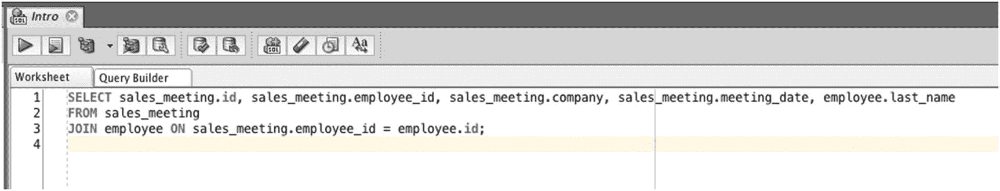
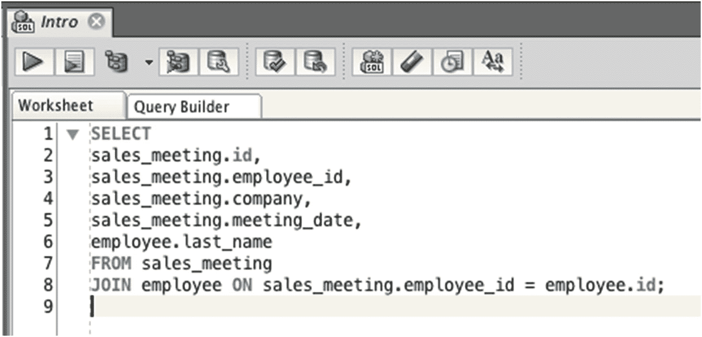
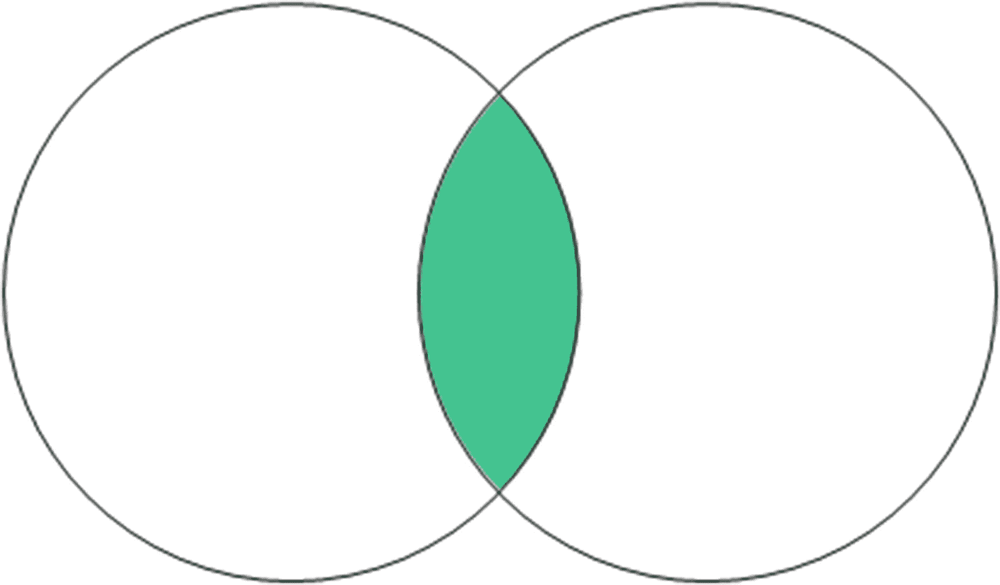
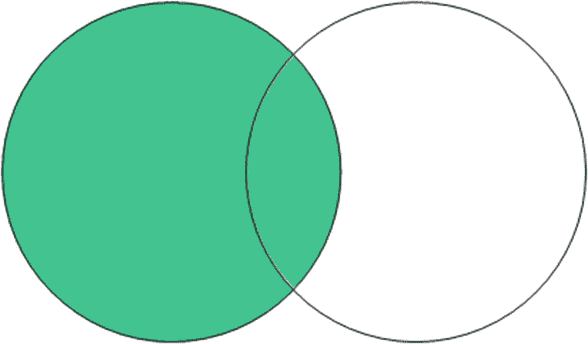
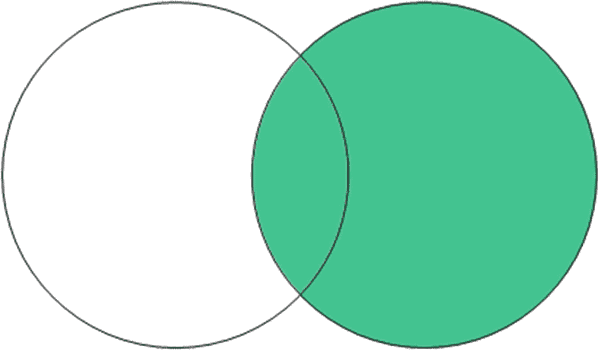
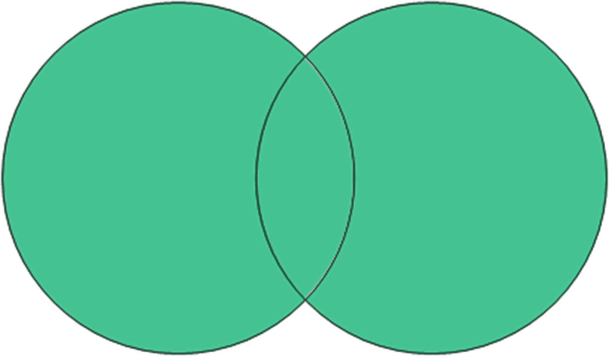
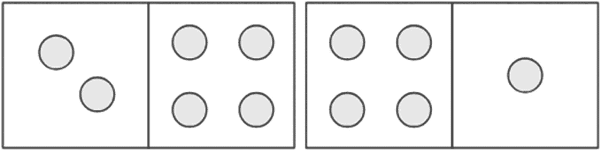
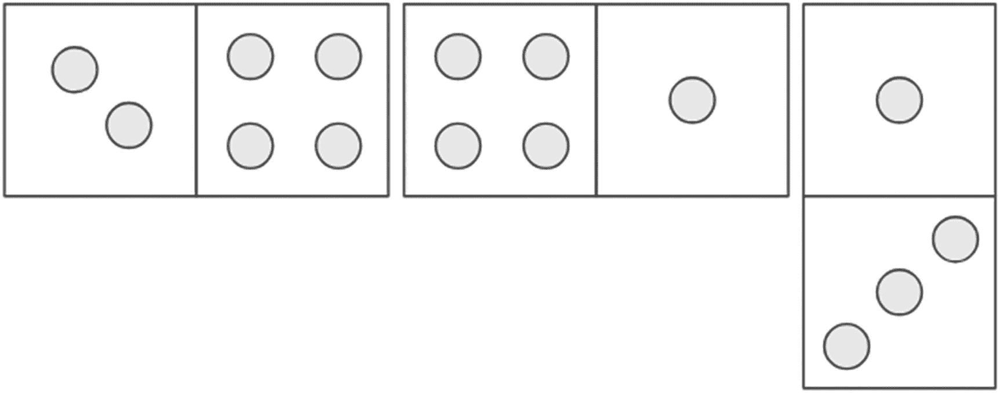

# 第四部分 连接表

## 18. 内连接

在本书前面，我们学习了什么是数据库，以及它相比其他存储数据方式的几个优势。在本章中，我们将学习如何充分利用其中一个优势：能够同时查看来自多个表的数据。

### 多表

在之前的章节中，我们创建了一个 `employee` 表来存储员工信息。随后，我们创建了一个 `office` 表和一个 `sales_meeting` 表。接着，`sales_meeting` 表被重命名为 `customer_meeting`。创建另外这两个表有几个原因：

*   确保数据只存储在一个地方
*   提高我们存储数据的质量
*   在修改数据时节省时间

我们的表如下所示。

这是 `employee` 表：

```
ID   LAST_NAME    SALARY   JOB_TITLE
1    JONES        30000    (null)
2    SMITH        35000    (null)
3    KING         45000    (null)
4    SIMPSON      52000    (null)
5    ANDERSON     31000    (null)
6    COOPER       (null)   (null)
7    (null)       (null)   (null)
8    SMITH        62000    (null)
9    PATRICK      40000    (null)
```

这是 `office` 表：

```
ID   ADDRESS
1    123 Smith Street
2    45 Main Street
3    10 Collins Road
```

这是 `customer_meeting` 表：

```
ID   EMPLOYEE_ID    COMPANY             MEETING_DATE
1    5              ABC Construction    10/Aug/2018
2    2              BW Signage          21/Aug/2018
```

你见过一些 `SELECT` 查询，它们展示 `employee` 表中的所有记录，或 `office` 表中的所有记录，或 `customer_meeting` 表中的所有记录。如果你想查看一个 `employees` 列表以及与之相关的 `customer_meeting` 记录呢？你可以编写单独的查询来获取这些数据，并使用你的应用程序代码将数据链接在一起。

然而，让应用程序代码匹配相关记录效率不高，并且可能导致相当多的代码。数据库和 SQL 语言的一个优势是能够处理来自多个表的数据。SQL 中允许你这样做的特性称为 *连接*。

### 什么是连接？

连接是 SQL 的一个特性，允许你在单个查询中查看来自两个或更多表的列。数据库中的数据存储在单独的表中，每个表存储某种特定类型的信息。连接允许你编写一个从两个或多个表获取信息的查询，并在单个结果集中查看这些列。连接常写在 `SELECT` 查询中，但也可以在其他查询（如 `UPDATE`）中完成。

在 SQL 中，你可以通过在查询中指定一个关键字来添加连接。有几种不同类型的连接，每种都有自己的关键字。我们将在本书后面学习这些连接类型。现在，我们从一个简单的连接开始。

SQL 中的连接涉及几个部分：

*   两个表
*   一个 JOIN 关键字
*   指定两个表如何连接的条件

SQL 如下所示：

```sql
SELECT columns
FROM table1
JOIN table2 ON criteria;
```

两个表是 `table1` 和 `table2`，你可以将其替换为要在查询中使用的两个表。`JOIN` 关键字指定你正在为查询连接这两个表。`ON` 关键字让你指定连接条件，即表如何连接。

### 连接示例

让我们看一个例子。假设你需要展示 `customer_meeting` 数据，例如会议日期和公司名称，以及参加会议的每个员工的姓名。

员工姓名在 `employee` 表中，销售会议数据在 `customer_meeting` 表中。你需要编写一个查询来展示来自两个表的数据。

首先，可以从列开始。让我们展示 `customer_meeting` 表中的所有列：

```sql
SELECT id, employee_id, company, meeting_date
FROM customer_meeting;
```

你还想看到员工的姓名。让我们添加这一列：

```sql
SELECT id, employee_id, company, meeting_date, last_name
FROM customer_meeting;
```

如果你现在运行这个查询，会得到一个错误。你会得到错误，因为 `customer_meeting` 表中没有 `last_name` 列。你需要将 `employee` 表包含在查询中，这通过连接来完成。

```sql
SELECT id, employee_id, company, meeting_date, last_name
FROM customer_meeting
JOIN employee
```

在查询中仅仅指定 `JOIN employee` 是不够的。关键字 `JOIN` 表示我们想要从 `customer_meeting` 和 `employee` 表获取数据。但是 Oracle 数据库如何知道哪个 `employee` 与哪个 `customer_meeting` 相关？*你* 又如何知道呢？

这就是外键的作用。在前面的章节中，我们解释了什么是外键并将它们添加到我们的表中。外键是一个表中的列，它引用另一个表中的主键。外键主要用于定义两个表之间的关系，这正是我们现在需要知道的。

在 `customer_meeting` 表中，有一个名为 `employee_id` 的列。该列引用 `employee` 表中的 `id`。引用 `employee_id` 列中的数据是我们连接两个表的方式。查询需要说明，如果 `customer_meeting` 的 `employee_id` 列与 `employee` 的 `id` 列匹配，则记录相关。

你可以更新查询以包含此条件：

```sql
SELECT id, employee_id, company, meeting_date, last_name
FROM customer_meeting
JOIN employee ON customer_meeting.employee_id = employee.id;
```

“如果 `customer_meeting` 的 `employee_id` 列与 `employee` 的 `id` 列匹配，则记录相关”的条件被写作 `ON customer_meeting.employee_id = employee.id`。包含 `JOIN` 关键字的那一行被称为 *连接子句*，连接条件总是用一个操作符（如 “=”）在中间指定两个列。

这个查询将展示 `customer_meeting` 信息，以及 `employee` 的 `last_name` 列，在同一个结果集中。让我们运行查询。

```sql
ORA-00918: column ambiguously defined
00918. 00000 -  "column ambiguously defined"
*Cause:
*Action:
Error at Line: 1 Column: 8
```

如果你运行这个查询，你会得到一个关于“列定义不明确”的错误。这是什么意思？它意味着 `SELECT` 子句中提到的 `id` 列可能来自 `customer_meeting` 表或 `employee` 表，数据库不知道你想要哪一个，因此显示错误。需要哪个列是不明确的，或者说模糊的。

你可以通过指定列来自哪个表来解决这个错误。你可以在列名前添加表名和一个点：

```sql
SELECT customer_meeting.id, employee_id, company, meeting_date, last_name
FROM customer_meeting
JOIN employee ON customer_meeting.employee_id = employee.id;
```

如果你现在运行查询，应该会得到一些结果：

```
ID   EMPLOYEE_ID    COMPANY            MEETING_DATE   LAST_NAME
1    5              ABC Construction   10/Aug/2018    ANDERSON
2    2              BW Signage         21/Aug/2018    SMITH
```

恭喜！你刚刚编写并运行了第一个连接两个表的 SQL 查询！


### 连接、格式化与表别名

在之前的例子中，我们将 `customer_meeting` 表名添加到 `id` 列，以便在 `SELECT` 子句中明确我们所指的列。这意味着只有一列指定了表名，而其他列没有。查询可以运行，但查看查询本身时，可能不容易知道每列来自哪个表。

```sql
SELECT customer_meeting.id, employee_id, company, meeting_date, last_name
FROM customer_meeting
JOIN employee ON customer_meeting.employee_id = employee.id;
```

有一种方法可以改进这个查询。你可以同时指定每个表的名称和列名。添加表名会多写不少代码，但这些额外的代码能清楚地表明每列来自哪个表。例如：

```sql
SELECT customer_meeting.id, customer_meeting.employee_id, customer_meeting.company, customer_meeting.meeting_date, employee.last_name
FROM customer_meeting
JOIN employee ON customer_meeting.employee_id = employee.id;
```

另一个需要注意的方面是格式。在书中阅读这个查询可能很容易。但是，如果我们在 `SQL Developer` 等 IDE 中编写查询，`SELECT` 子句会向右延伸得很长，如图 18-1 所示。


图 18-1. 一个行长很长的查询

查询向右延伸很长会使查询难以阅读，你可能需要向右滚动才能看到查询的其余部分。好消息是，`SQL` 不会区别对待空白字符，例如换行符和空格。这意味着通常更推荐将 `SELECT` 子句中的每个列放在单独的行上，如下所示：

```sql
SELECT
customer_meeting.id,
customer_meeting.employee_id,
customer_meeting.company,
customer_meeting.meeting_date,
employee.last_name
FROM customer_meeting
JOIN employee ON customer_meeting.employee_id = employee.id;
```

这样写查询会比正常情况占用更多行。然而，它使包含的列列表更易于阅读，也更易于维护，因为你可以更轻松地添加和删除列。你也不需要在 `SQL Developer` 中左右滚动了。图 18-2 显示了查询如何更合适地适应窗口。


图 18-2. 相同查询分行显示

我们的查询还有一个可以改进的地方。在本书前面，我们学习了表别名，即你可以在查询中给表起的名字。在涉及连接的查询中使用它们是一个很好的地方。

你可以将表别名同时应用于 `customer_meeting` 表和 `employee` 表。例如，你可以给 `customer_meeting` 表一个别名 "s"，给 `employee` 表一个别名 "e"。以下查询版本展示了如何按照我刚才描述的方式为表名起别名：

```sql
SELECT
customer_meeting.id,
customer_meeting.employee_id,
customer_meeting.company,
customer_meeting.meeting_date,
employee.last_name
FROM customer_meeting s
JOIN employee e ON customer_meeting.employee_id = employee.id;
```

下一步是用别名替换每个列旁边提到的完整表名。你可以在连接条件和 `SELECT` 子句中都进行替换。所以，不是 `customer_meeting.id`，而是 `c.id`。不是 `employee.last_name`，而是 `e.last_name`。例如：

```sql
SELECT
c.id,
c.employee_id,
c.company,
c.meeting_date,
e.last_name
FROM customer_meeting c
JOIN employee e ON c.employee_id = e.id;
```

这个查询比之前的查询更小，更容易编写。而且每列来自哪个表也很清楚，因为你可以看到 `c` 表是 `customer_meeting`，`e` 表是 `employee`。它也避免了我们之前看到的列名不明确的错误。

如果你在 `SQL Developer` 中运行这个查询，会得到如下结果：

```
ID   EMPLOYEE_ID    COMPANY            MEETING_DATE   LAST_NAME
1    5              ABC Construction   10/Aug/2018    ANDERSON
2    2              BW Signage         21/Aug/2018    SMITH
```

你看到的结果与之前相同，但查询却更容易阅读和编写了。

总结一下，在编写带有连接的查询后，最好：
*   在 `SELECT` 子句中将列指定在单独的行上
*   添加表别名，并在 `JOIN` 条件和 `SELECT` 子句中引用这些别名

### 内连接 (INNER JOIN)

`SQL` 中有几种不同类型的连接。我们刚刚看到的连接类型是 `内连接 (inner join)`。这意味着我们编写的查询只返回两个表中相关联的结果。结果不包括：
*   任何没有员工记录的 `customer_meetings`（反正表里没有）
*   任何没有销售会议的员工

`内连接 (inner join)` 只返回两个表中都匹配的结果。你的 `SELECT` 查询也可以使用 `INNER JOIN` 关键字而不是 `JOIN` 关键字。以下是相同的查询，因为在 `Oracle SQL` 中，`JOIN` 等同于 `INNER JOIN`。

```sql
SELECT
c.id,
c.employee_id,
c.company,
c.meeting_date,
e.last_name
FROM customer_meeting c
INNER JOIN employee e ON c.employee_id = e.id;
```

那么，如果 `INNER` 是一个可选的关键字，你是否应该指定它呢？我建议你指定，因为它能明确表示你要求的是一个 `INNER JOIN`，而不是我们将在后面章节介绍的其他连接类型之一。但这取决于你，因为即使不使用 `INNER` 关键字，查询仍然会运行。

让我们在 `customer_meeting` 表中添加一条没有员工的新记录，以确认 `INNER JOIN` 的行为。

```sql
INSERT INTO customer_meeting (id, employee_id, company, meeting_date) VALUES (3, NULL, 'WXC Services', DATE'2018-08-23');
```

运行此查询后，`customer_meeting` 表将如下所示：

```
ID   EMPLOYEE_ID      COMPANY            MEETING_DATE
1    5                ABC Construction   10/Aug/2018
2    2                BW Signage         21/Aug/2018
3    (null)           WXC Services       23/Aug/2018
```

新记录没有关联的员工。现在，运行本章前面带有连接的 `SELECT` 查询。

```sql
SELECT
c.id,
c.employee_id,
c.company,
c.meeting_date,
e.last_name
FROM customer_meeting c
INNER JOIN employee e ON c.employee_id = e.id;
```

结果是：

```
ID   EMPLOYEE_ID    COMPANY            MEETING_DATE   LAST_NAME
1    5              ABC Construction   10/Aug/2018    ANDERSON
2    2              BW Signage         21/Aug/2018    SMITH
```

你可以看到，`id` 为 3 的 `customer_meeting` 记录没有显示出来。这是因为 `employee` 表中没有相关的记录，并且由于使用了 `INNER JOIN`，该记录不会显示。还有其他连接类型可以让你看到这些数据，我们将在后面的章节中学习。

### 总结

连接是 `SQL` 中的一个功能，它允许你在单个查询内部将两个或多个表关联起来，从而无需使用其他编程语言即可显示这些表中的数据。需要一个连接条件来指定两个表如何关联。

将 `SELECT` 列显示在单独的行上并使用表别名是一个好习惯，这样可以使查询更易于阅读和编辑。

我们研究的基本连接类型是 `内连接 (INNER JOIN)`，它显示两个表中都匹配的记录。还有其他连接类型，我们将在接下来的几章中探讨。

## 19. 外连接

在上一章中，我们学习了如何使用 `JOIN` 关键字将表连接在一起。这是一种称为 `外连接 (outer join)` 的连接类型，它显示被连接的两个表中都存在的记录。另一种连接类型是 `外连接 (outer join)`。


### 什么是外连接？

外连接是将两个表连接在一起，但如果其中一个表中没有相关记录，仍然会显示来自另一个表的数据。

使用我们的示例数据，将 `employee` 表连接到 `customer_meeting` 表时，你看到了 `customer_meeting` 和 `employee` 的记录。你没有看到任何没有对应 `employees` 的 `customer_meetings`，也没有看到任何没有对应 `customer_meetings` 的 `employees`。这正是内连接所做的。

另一方面，外连接会显示一个表中的所有数据以及另一个表中的匹配数据，或者是 `NULL` 值。它会显示所有的 `customer_meeting` 记录，以及与之相关的员工，如果某个员工没有关联，则显示 `NULL` 值。

外连接在你希望显示一个表中的所有记录，而不因为另一个表中没有对应记录就排除它们时非常有用。

有三种不同类型的外连接：
*   左外连接
*   右外连接
*   全外连接

在本章中，我们将逐一介绍它们。

### 编写左外连接

当你编写一个使用 `JOIN` 的 `SELECT` 查询时，将涉及的两个表想象成一个在左，一个在右会很有帮助。首先提到的表就是左边的表。

我们可以用维恩图来图形化地表示左外连接，每个圆圈代表一个表，阴影区域代表找到的记录。图 19-1 展示了这个维恩图。


图 19-1: 一个内连接，table1 在左，table2 在右

我们上一章的示例查询使用了 `INNER JOIN`：
```sql
SELECT
s.id,
s.employee_id,
s.company,
s.meeting_date,
e.last_name
FROM customer_meeting s
INNER JOIN employee e ON s.employee_id = e.id;
```

在此示例中，`customer_meeting` 表在左边，`employee` 表在右边。

对于 `LEFT OUTER JOIN`，左边表中的所有记录都会被显示。如果右边表中有匹配项，则显示该匹配项；否则，显示 `NULL` 值。

在此示例中，如果你使用 `LEFT OUTER JOIN`，查询将显示所有的 `customer_meeting` 记录。如果找到匹配项，它会显示 `employee last_name` 值，否则显示 `NULL`。

你可以用与 `INNER JOIN` 相同的方式编写 `LEFT OUTER JOIN`。你只需要将关键字从 `JOIN` 或 `INNER JOIN` 改为 `LEFT JOIN` 或 `LEFT OUTER JOIN`。关键字 `OUTER` 是可选的，所以是否添加它取决于你。

一个使用 `LEFT OUTER JOIN` 的查询如下所示：
```sql
SELECT columns
FROM table1
LEFT [OUTER] JOIN table2 ON condition;
```

你可以调整前面的示例查询，将其视为一个 `LEFT JOIN`：
```sql
SELECT
s.id,
s.employee_id,
s.company,
s.meeting_date,
e.last_name
FROM customer_meeting s
LEFT JOIN employee e ON s.employee_id = e.id;
```

连接条件仍然是必需的。你仍然需要指定两个表中的数据是如何关联的，在这个例子中，`customer_meeting` 的 `employee_id` 与 `employee` 的 `id` 列相关。

我们的 `LEFT JOIN` 查询将显示以下结果：
```
ID   EMPLOYEE_ID    COMPANY            MEETING_DATE   LAST_NAME
1    5              ABC Construction   10/Aug/2018    ANDERSON
2    2              BW Signage         21/Aug/2018    SMITH
3    (null)         WXC Services       23/Aug/2018    (null)
```

这些结果显示了 `customer_meeting` 表中的所有记录。结果显示了前两位员工的 `ANDERSON` 和 `SMITH`，因为 `customer_meeting` 记录中的 `employee_id` 字段提到了员工 5 和 2。第三条记录有一个 `NULL employee_id`，因此来自 `employee` 表的 `last_name` 也是 `NULL`。它仍然被显示出来，因为我们使用的是 `LEFT JOIN` 而不是 `INNER JOIN`。

左连接的图形化表示如图 19-2 所示。

图 19-2: 一个左外连接，table1 在左，table2 在右

### 使用左外连接显示所有员工

另一个例子是这个问题：如果我们想查看所有员工，以及他们（如果有的话）参加的 `customer_meetings` 怎么办？我们也可以使用 `LEFT OUTER JOIN` 来实现。

假设我们想要查看员工的 `id`、`last_name` 和 `salary`，以及 `customer_meeting` 的 `id`、`company` 和 `meeting_date`。我们的查询可能如下所示：
```sql
SELECT
e.id,
e.last_name,
e.salary,
s.id,
s.company,
s.meeting_date
FROM employee e
INNER JOIN customer_meeting s ON e.id = s.employee_id;
```

这个查询使用了 `INNER JOIN`，将显示以下信息：
```
ID   LAST_NAME    SALARY  ID   COMPANY           MEETING_DATE
2    SMITH        35000   2    BW Signage        21/Aug/2018
5    ANDERSON     31000   1    ABC Construction  10/Aug/2018
```

它只显示了那些有 `customer_meeting` 记录的员工。我们想查看所有员工，无论他们是否有客户会议记录。

我们可以将查询改为使用 `LEFT JOIN` 而不是 `INNER JOIN`，并包含一个 `ORDER BY`：
```sql
SELECT
e.id,
e.last_name,
e.salary,
s.id,
s.company,
s.meeting_date
FROM employee e
LEFT JOIN customer_meeting s ON e.id = s.employee_id
ORDER BY e.id;
```

这将显示以下结果：
```
ID  LAST_NAME   SALARY  ID      COMPANY           MEETING_DATE
1   JONES       30000   (null)  (null)            (null)
2   SMITH       35000   2       BW Signage        21/Aug/2018
3   KING        45000   (null)  (null)            (null)
4   SIMPSON     52000   (null)  (null)            (null)
5   ANDERSON    31000   1       ABC Construction  10/Aug/2018
6   COOPER      (null)  (null)  (null)            (null)
7   (null)      (null)  (null)  (null)            (null)
8   SMITH       62000   (null)  (null)            (null)
9   PATRICK     40000   (null)  (null)            (null)
```

它显示了所有的 `employee` 记录，以及任何存在的 `customer_meeting` 值。对于没有 `customer_meeting` 值的员工，会显示 `NULL` 值。


### 编写右外连接

另一种类型的外连接是 *右外连接*。右外连接会显示连接中右侧表的所有记录。如果连接左侧的记录存在，则也会显示；否则，将显示一个 `NULL` 值。

如果你觉得这听起来像左外连接，那你是对的。它与左外连接正好相反。在左外连接中，显示的是左侧表的所有记录。在右外连接中，显示的是右侧表的所有记录。

右外连接也可以用维恩图来展示，如图 19-3 所示。



图 19-3

一个右外连接，table1 在左，table2 在右

我们之前的一个例子展示了所有的 `employee` 记录以及他们对应的 `customer_meeting` 记录。那个例子是用一个带有 `LEFT JOIN` 的查询编写的：

```sql
SELECT
e.id,
e.last_name,
e.salary,
s.id,
s.company,
s.meeting_date
FROM employee e
LEFT JOIN customer_meeting s ON e.id = s.employee_id;
```

同样的查询也可以写成 `RIGHT OUTER JOIN`，只需交换表的顺序并将 `LEFT JOIN` 改为 `RIGHT JOIN`。这是一个例子：

```sql
SELECT
e.id,
e.last_name,
e.salary,
s.id,
s.company,
s.meeting_date
FROM customer_meeting s
RIGHT JOIN employee e ON e.id = s.employee_id;
```

**加粗的部分**是唯一更改的部分。连接条件不需要改变。连接条件出现的顺序无关紧要。

这个查询的结果与之前相同：

```
ID  LAST_NAME  SALARY  ID      COMPANY           MEETING_DATE
1   JONES      30000   (null)  (null)            (null)
2   SMITH      35000   2       BW Signage        21/Aug/2018
3   KING       45000   (null)  (null)            (null)
4   SIMPSON    52000   (null)  (null)            (null)
5   ANDERSON   31000   1       ABC Construction  10/Aug/2018
6   COOPER     (null)  (null)  (null)            (null)
7   (null)     (null)  (null) (null)        (null)
8   SMITH      62000   (null) (null)        (null)
9   PATRICK    40000   (null) (null)        (null)
```

### 何时会使用右外连接？

我几乎没怎么见过使用 `RIGHT OUTER JOIN` 或 `RIGHT JOIN` 的查询，因为这类查询总是可以写成 `LEFT JOIN`。如果可能的话，我更倾向于将查询写成 `LEFT JOIN`，我遇到的大多数 SQL 开发者也是如此。

我认为 `RIGHT JOIN` 可能更有意义的唯一场景是，如果你的输出先显示带有 `NULL` 值的列，然后再显示带有实际值的列。

例如，假设你想要这样的输出：

```
ID      COMPANY            MEETING_DATE  ID  LAST_NAME  SALARY
(null)  (null)             (null)        1   JONES      20000
2       BW Signage         21/Aug/2018   2   SMITH      35000
(null)  (null)             (null)        3   KING       40000
(null)  (null)             (null)        4   SIMPSON    52000
1       ABC Construction   10/Aug/2018   5   ANDERSON   31000
(null)  (null)             (null)        6   COOPER     (null)
(null)  (null)             (null)        7   (null)     (null)
(null)  (null)             (null)        8   SMITH      62000
(null)  (null)             (null)        9   PATRICK    40000
```

这些结果显示了左侧的 `customer_meeting` 列（如果存在的话），然后显示了所有的 `employee` 列。在这个例子中，将查询写成 `RIGHT OUTER JOIN` 可能更有道理，因为输出反映了编写右外连接时表的顺序。

### 编写全外连接

最后一种类型的外连接是 *全外连接*。它的行为类似于左外连接和右外连接。使用全外连接连接两个表将显示：

*   两张表中所有匹配的记录
*   第一张表中不匹配第二张表的所有记录（将显示 NULL 值）
*   第二张表中不匹配第一张表的所有记录（将显示 NULL 值）

全外连接可以用维恩图显示，如图 19-4 所示。



图 19-4

一个全外连接，table1 在左，table2 在右

当你想获取两张表的所有记录并查看哪些记录匹配、哪些不匹配时，全外连接非常有用。全外连接查询如下所示：

```sql
SELECT columns
FROM table1
FULL [OUTER] JOIN table2 ON condition;
```

就像左连接和右连接一样，在编写 `FULL OUTER JOIN` 时，`OUTER` 这个词是可选的。让我们看一个例子。

### 在我们的表上使用全外连接

我们可以编写一个在员工表和 `customer_meeting` 表上使用全外连接的查询。这是一个例子：

```sql
SELECT
e.id,
e.last_name,
e.salary,
s.id,
s.company,
s.meeting_date
FROM employee e
FULL JOIN customer_meeting s ON e.id = s.employee_id
ORDER BY e.id;
```

该查询仍然基于 `employee_id` 列进行连接，就像之前的例子一样。这个查询的输出如下：

```
ID     LAST_NAME  SALARY  ID       COMPANY           MEETING_DATE
1      JONES      30000   (null)   (null)            (null)
2      SMITH      35000   2        BW Signage        21/Aug/2018
3      KING       45000   (null)   (null)            (null)
4      SIMPSON    52000   (null)   (null)            (null)
5      ANDERSON   31000   1        ABC Construction  10/Aug/2018
6      COOPER     (null)  (null)   (null)            (null)
7      (null)     (null)  (null)   (null)            (null)
8      SMITH      62000   (null)   (null)            (null)
9      PATRICK    40000   (null)   (null)            (null)
(null) (null)     (null)  3        WXC Services      23/Aug/2018
```

你可以在这个输出中看到几点：

*   显示了匹配的行，例如员工 SMITH 与他们的 BW Signage 会议，以及员工 ANDERSON 与他们的 ABC Construction 会议。
*   显示了没有会议的员工行，例如 JONES 和 KING。
*   显示了没有对应员工的 customer_meeting 行，例如与 WXC Services 的会议。

这种类型的查询比左连接或右连接显示的信息更多。

### 总结

外连接是一种连接类型，它显示一张表中的所有记录，以及另一张表中如果存在则匹配的记录。如果未找到匹配项，则显示 `NULL` 值。这使你可以查看完整表格以及另一张表中的任何匹配记录。

左外连接将显示连接关键字左侧提到的表中的所有记录，而右外连接将显示连接关键字右侧表中的所有记录。全外连接两者都做。

## 20. 其他连接类型

Oracle SQL 提供了其他几种连接语法类型。这些连接类型不常用，但值得了解它们是什么以及为什么应该或不应该使用它们。


### USING 关键字

在之前的章节中，你已经学习了如何编写使用 `INNER JOIN`（内连接）从两张表中获取数据的查询。在那个过程中，你需要通过指定两个需要匹配值的列来指明两张表是如何关联的。这是你运行过的查询：

```sql
SELECT
s.id,
s.employee_id,
s.company,
s.meeting_date,
e.last_name
FROM customer_meeting s
INNER JOIN employee e ON s.employee_id = e.id;
```

SQL 中还有另一个关键字，能让你更简单地编写 `INNER JOIN` 或 `OUTER JOIN`（外连接）：那就是 `USING` 关键字。这个 `USING` 关键字允许你指定一个列名，数据库会使用两张表中该列名的列作为连接条件。其语法如下：

```sql
SELECT columns
FROM table1
JOIN table2 USING (column_name);
```

在这个语法中，你将 `ON column=column` 替换成了 `USING(column)`。让我们用 `office` 表来演示一下。

### 更新 Office 表

`office` 表目前没有链接到任何表，但设想是每个员工都将使用一个办公室。为了在我们的数据库中存储这一信息，我们需要将 `office` 表中的 `id` 字段添加到 `employee` 表中。

首先，我们运行一个 `ALTER TABLE` 语句：

```sql
ALTER TABLE employee
ADD office_id NUMBER(5);
```

如果你在 SQL Developer 中的数据库上运行这个语句，`employee` 表中将添加一个新列。我将它命名为 `office_id`，以清楚表明该值的用途。它也是一个 `NUMBER` 数据类型，长度为五位数，这与 `office` 表中 `id` 列的大小相同。

当你对 `employee` 表运行 `SELECT` 查询时，这个列是空的：

```sql
SELECT id, last_name, salary, office_id
FROM employee;
ID  LAST_NAME  SALARY  OFFICE_ID
1   JONES      30000   (null)
2   SMITH      35000   (null)
3   KING       45000   (null)
4   SIMPSON    52000   (null)
5   ANDERSON   31000   (null)
6   COOPER     (null)  (null)
7   ADAMS      (null)  (null)
8   SMITH      62000   (null)
9   PATRICK    40000   (null)
```

你可以在这个表上运行 `UPDATE` 语句来更新这些值。需要运行的更新语句如下所示。

```sql
UPDATE employee SET office_id = 1 WHERE id IN (1, 4, 6, 9);
UPDATE employee SET office_id = 2 WHERE id IN (2, 3);
UPDATE employee SET office_id = 3 WHERE id IN (7, 8);
COMMIT;
```

这些查询使用了 `IN` 关键字，允许你通过一次查询更新多行，而无需指定多个 `OR` 语句。

运行完那些 `UPDATE` 语句后，你可以在 `employee` 表上运行相同的 `SELECT` 查询：

```sql
SELECT id, last_name, salary, office_id
FROM employee;
ID  LAST_NAME  SALARY  OFFICE_ID
1   JONES      30000   1
2   SMITH      35000   2
3   KING       45000   2
4   SIMPSON    52000   1
5   ANDERSON   31000   (null)
6   COOPER     (null)  1
7   ADAMS      (null)  3
8   SMITH      62000   3
9   PATRICK    40000   1
```

现在，`employee` 记录有了一个关联的 `office_id`。接下来，让我们用 `USING` 关键字编写一个 `SELECT` 查询。

### 使用 USING 关键字编写查询

你可以对 `employee` 和 `office` 表使用 `USING` 关键字来编写 `SELECT` 查询。

```sql
SELECT id,
last_name,
salary,
address
FROM employee
INNER JOIN office USING (office_id);
```

这个查询在 `office_id` 列上使用了 `USING` 关键字，这意味着它基于 `office_id` 列将两张表连接在一起。让我们看看结果：

```
ORA-00904: "OFFICE"."OFFICE_ID": invalid identifier
```

这出乎意料。为什么没有得到员工和办公室记录的列表？查询中包含了两张表和多个列。

这是因为 `USING` 子句会在两张表中查找指定的列，并且列名必须相同。这个查询试图基于 `employee.office_id` 列与 `office.office_id` 列相匹配来连接两张表。这就遇到了错误，因为 `employee.office_id` 列标识了办公室，但 `office.office_id` 列并不存在。

正确的连接方式应该是匹配 `employee.office_id = office.id`。但这无法使用 `USING` 关键字实现。`USING` 关键字要求两个列名相同。

你可以将 `office` 表中的 `id` 列重命名为 `office_id`，但这并不总是可行，特别是当你在处理现有系统时，因为它可能导致其他查询出错。重命名一个列也可能导致其他使用 `USING` 子句的查询失效！

#### 注意

`USING` 子句要求两张表都包含一个同名的列。如果该列包含的数据不一致，你将得到意想不到的结果。

要求列名相同是我 `不推荐` 使用 `USING` 子句的原因之一。另一个原因是对列的限制。我们将两张表连接在一起，在最近的示例中，我们一直使用表别名来明确每列来自哪张表。之前的查询没有这些别名，所以我们添加上。

```sql
SELECT e.id,
e.last_name,
e.salary,
o.address
FROM employee e
INNER JOIN office o USING (id);
```

如果你运行这个查询，你会得到这条消息：

```
ORA-25154: column part of USING clause cannot have qualifier
25154. 00000 -  "column part of USING clause cannot have qualifier"
*Cause:    Columns that are used for a named-join (either a NATURAL join
or a join with a USING clause) cannot have an explicit qualifier.
*Action:   Remove the qualifier.
Error at Line: 9 Column: 8
```

这意味着 `USING` 子句中的 `id` 列不能在 `SELECT` 子句中带有表别名。这是因为该值在两张表中应该是相同的，因此不需要限定词。让我们调整查询来移除它：

```sql
SELECT id,
e.last_name,
e.salary,
o.address
FROM employee e
INNER JOIN office o USING (id);
```

这个查询将会运行，并显示与之前相同的结果，尽管在这个例子中它们是不正确的。不能用别名引用这个列是个小问题，但当两张表中的列确实相同时，这应该没关系。

编写这个查询的一个更好的方法是使用 `ON` 关键字代替 `USING` 关键字：

```sql
SELECT e.id,
e.last_name,
e.salary,
e.office_id,
o.address
FROM employee e
INNER JOIN office o ON e.office_id = o.id;
```

你也可以在这里加入 `office_id`。这个查询的结果是：

```
ID  LAST_NAME  SALARY  OFFICE_ID  ADDRESS
1   JONES      30000   1          123 Smith Street
2   SMITH      35000   2          45 Main Street
3   KING       45000   2          45 Main Street
4   SIMPSON    52000   1          123 Smith Street
6   COOPER     (null)  1          123 Smith Street
7   ADAMS      (null)  3          10 Collins Road
8   SMITH      62000   3          10 Collins Road
9   PATRICK    40000   1          123 Smith Street
```

使用 `ON` 关键字需要多打一点字，但它让你的查询更灵活，并能防止因列名相同但内容不匹配而引发的问题。

### 什么是自然连接？

自然连接是 Oracle 的另一个简化表连接过程的功能。它是内连接的一种变体，允许你在不指定列名的情况下连接表。

自然连接的语法是：

```sql
SELECT columns
FROM table1
NATURAL JOIN table2;
```

如果你不指定列，Oracle 怎么知道如何将两张表连接起来？使用自然连接时，数据库将根据名称相同的列或列组进行连接。

它的工作方式与 `USING` 关键字类似。如果两张表有一个同名列，连接就基于该列进行。如果有两个同名列，则两列都会被使用。

#### 注意

自然连接会对名称相同的列执行内连接。这非常严格，可能导致结果不正确。

### 使用自然连接编写查询

让我们再次使用`employee`和`office`表来看一个这方面的例子。

```sql
SELECT e.id,
e.last_name,
e.salary,
e.office_id,
o.address
FROM employee e
NATURAL JOIN office o;
```

如果你运行这个查询，会看到这条消息：

```
ORA-25155: column used in NATURAL join cannot have qualifier
25155. 00000 -  "column used in NATURAL join cannot have qualifier"
*Cause:    Columns that are used for a named-join (either a NATURAL join
or a join with a USING clause) cannot have an explicit qualifier.
*Action:   Remove the qualifier.
Error at Line: 49 Column: 8
```

这与`USING`连接的错误相同。你必须从`id`列中移除表别名。我猜是`id`列，因为我知道该列在两个表中是共同的。

```sql
SELECT id,
e.last_name,
e.salary,
e.office_id,
o.address
FROM employee e
NATURAL JOIN office o;
```

如果你运行这个查询，会得到这些结果。

```
ID  LAST_NAME  SALARY  OFFICE_ID  ADDRESS
1   JONES      30000   1          123 Smith Street
2   SMITH      35000   2          45 Main Street
3   KING       45000   3          10 Collins Road
```

这些结果与我们使用`USING`关键字得到的不正确结果相同。这是因为连接是在两个表的`id`列上执行的，而不是在`employee.office_id = office.id`上执行的。令人担忧的是，这并没有显示错误。结果显示了，但它们是不正确的。

因为列名需要匹配，我不推荐使用`NATURAL JOIN`。

不建议使用`NATURAL JOIN`还有几个其他原因：

*   如果存在多个同名列，它们也会被包含在连接条件中，从而在不显示错误的情况下给你带来不正确的结果。
*   如我们之前所见，你不能对这些列使用表别名。
*   这不能用于外连接。它使用的是内连接。

就像`USING`关键字一样，我不推荐自然连接。我建议改用带`ON`关键字的内连接。

### 什么是交叉连接？

*交叉连接*是另一种很少使用但值得了解的连接类型。让我们用一个例子来演示一下。

假设你想查看所有员工及其办公室。你可能会编写这样一个查询：

```sql
SELECT e.id,
e.last_name,
e.salary,
e.office_id,
o.address
FROM employee e,
office o;
```

你运行查询，得到类似这样的结果：

```
ID  LAST_NAME  SALARY  OFFICE_ID  ADDRESS
1   JONES      30000   1          123 Smith Street
2   SMITH      35000   1          123 Smith Street
3   KING       45000   1          123 Smith Street
4   SIMPSON    52000   1          123 Smith Street
5   ANDERSON   31000   1          123 Smith Street
6   COOPER     (null)  1          123 Smith Street
7   ADAMS      (null)  1          123 Smith Street
8   SMITH      62000   1          123 Smith Street
9   PATRICK    40000   1          123 Smith Street
1   JONES      30000   2          45 Main Street
2   SMITH      35000   2          45 Main Street
3   KING       45000   2          45 Main Street
4   SIMPSON    52000   2          45 Main Street
5   ANDERSON   31000   2          45 Main Street
6   COOPER     (null)  2          45 Main Street
7   ADAMS      (null)  2          45 Main Street
8   SMITH      62000   2          45 Main Street
9   PATRICK    40000   2          45 Main Street
1   JONES      30000   3          10 Collins Road
2   SMITH      35000   3          10 Collins Road
3   KING       45000   3          10 Collins Road
4   SIMPSON    52000   3          10 Collins Road
5   ANDERSON   31000   3          10 Collins Road
6   COOPER     (null)  3          10 Collins Road
7   ADAMS      (null)  3          10 Collins Road
8   SMITH      62000   3          10 Collins Road
9   PATRICK    40000   3          10 Collins Road
```

这里发生了什么？你预期有八或九条记录，却发现了 27 条。这种类型的结果被称为*笛卡尔积*，即第一个表中的每一行都与第二个表中的每一行相关联。

如果你仔细查看结果，可以看到它列出了所有员工并显示第一个办公室的地址，然后再次列出所有员工并显示第二个办公室的地址。它对第三个办公室重复此操作，27 条结果来自九名员工乘以三个办公室。如果我们有更多的办公室，我们会得到更多的结果。

为什么会这样？这是因为我们从两个表中选择数据时没有指定连接条件。这是我们的查询：

```sql
SELECT e.id,
e.last_name,
e.salary,
e.office_id,
o.address
FROM employee e,
office o;
```

其中没有`INNER JOIN`或`OUTER JOIN`，也没有提及任何需要匹配的列。这会导致笛卡尔积，而这几乎肯定不是你想要的。运行一个显示 27 条结果而不是八或九条的查询可能还不算太糟，但如果你有成百上千条记录，那么最终可能会得到一个非常大的结果集。

这种情况经常在忘记添加连接条件时意外发生。然而，有一种方法可以明确指定你需要这种类型的连接。

### 使用交叉连接

交叉连接是一种会返回笛卡尔积结果的连接类型。它允许你将一个表中的所有记录与另一个表中的所有记录刻意匹配。

为什么你会想要这样做呢？这是为表或查询生成数据的一种简便方法，这可能是你当前项目需要做的事情。

交叉连接的语法如下所示：

```sql
SELECT columns
FROM table1
CROSS JOIN table2;
```

你可以将其应用于你的员工和办公室查询，如下所示：

```sql
SELECT e.id,
e.last_name,
e.salary,
e.office_id,
o.address
FROM employee e
CROSS JOIN office o;
```

这将显示与之前相同的结果：同样的 27 条记录。

为什么你要写`CROSS JOIN`而不是使用之前的方法？在 SQL 中，有几种方法可以完成相同的任务，有时你会得到一个没有显示错误但不完全符合你想要的结果。使用`CROSS JOIN`的原因是为了明确表示你打算将一个表中的每条记录与另一个表中的每条记录连接起来。根据经验，故意编写`CROSS JOIN`的情况非常罕见。大多数时候，如果你看到之前显示的那种结果，通常是因为你的查询中有错误。如果你使用第一种方法编写查询，并不能清楚地表明你是故意的还是无意的。

### 替代连接语法

到目前为止，你已经学习了使用`JOIN`关键字的各种变体来连接两个表：

*   `JOIN`, `INNER JOIN`
*   `LEFT JOIN`, `LEFT OUTER JOIN`
*   `RIGHT JOIN`, `RIGHT OUTER JOIN`
*   `CROSS JOIN`

这组关键字被称为 ANSI 连接语法，因为它是 SQL ANSI 标准的一部分。还有一种连接表的替代语法，通常称为 Oracle 语法，因为它是 Oracle SQL 特有的。

当你编写一个连接两个表的查询时，你实际上是在说，“显示这些列，其中这个表的列等于那个表的列。” 这听起来很像`WHERE`子句的功能。

替代连接语法做的正是这件事。它使用`WHERE`子句来执行连接。对于处理外连接，有一些 Oracle 特有的额外符号。


#### 内连接

这种替代连接语法是什么样的？它是一个`WHERE`子句：

```sql
SELECT e.id,
e.last_name,
e.salary,
e.office_id,
o.address
FROM employee e, office o
WHERE e.office_id = o.id;
```

以这种方式编写查询涉及将表名放入`FROM`子句，作为逗号分隔的列表。默认情况下，这被视为一个`CROSS JOIN`，其中来自两个表的每条记录都会连接在一起。然后，你使用`WHERE`子句来指定两个表连接所依据的列，从而将结果缩减为有意义的记录。

此查询的结果是：

```sql
ID  LAST_NAME  SALARY  OFFICE_ID  ADDRESS
1   JONES      30000   1          123 Smith Street
2   SMITH      35000   2          45 Main Street
3   KING       45000   2          45 Main Street
4   SIMPSON    52000   1          123 Smith Street
6   COOPER     (null)  1          123 Smith Street
7   ADAMS      (null)  3          10 Collins Road
8   SMITH      62000   3          10 Collins Road
9   PATRICK    40000   1          123 Smith Street
```

这显示了所有有办公室的员工及其办公地址。它与执行一个`INNER JOIN`相同，但表匹配的条件写在`WHERE`子句中，而不是`ON`关键字后面。我们刚刚编写的查询等同于这个：

```sql
SELECT e.id,
e.last_name,
e.salary,
e.office_id,
o.address
FROM employee e
INNER JOIN office o ON e.office_id = o.id;
```

#### 外连接

前面的例子展示了如何使用替代语法（在`WHERE`子句中）编写内连接。如何使用这种语法编写外连接呢？

Oracle 提供了一些符号，你可以用在查询中，在`WHERE`子句中创建外连接。你可以在`WHERE`子句中，将`+`符号放在你预期可能为`NULL`的列旁的括号`()`内。

要编写一个`LEFT OUTER JOIN`（显示左表的记录，右表显示匹配项或`NULL`值），可以使用以下查询：

```sql
SELECT e.id,
e.last_name,
e.salary,
e.office_id,
o.address
FROM employee e, office o
WHERE e.office_id = o.id(+);
```

注意，`(+)`符号出现在`o.id`列之后，分号之前。它是 SQL 语句的一部分，并且与`office.id`列相关联，这意味着该表的记录可能为空。

结果是：

```sql
ID  LAST_NAME  SALARY  OFFICE_ID  ADDRESS
1   JONES      30000   1          123 Smith Street
2   SMITH      35000   2          45 Main Street
3   KING       45000   2          45 Main Street
4   SIMPSON    52000   1          123 Smith Street
6   COOPER     (null)  1          123 Smith Street
7   ADAMS      (null)  3          10 Collins Road
8   SMITH      62000   3          10 Collins Road
9   PATRICK    40000   1          123 Smith Street
5   ANDERSON   31000   (null)     (null)
```

这与`LEFT OUTER JOIN`显示的内容相同。所有`employee`记录都被显示，并且显示了他们的办公信息。对于员工 5，`office_id`和`address`显示为`NULL`值，因为他们没有`office`。

右外连接可以通过将`(+)`放在另一列上来编写：

```sql
SELECT e.id,
e.last_name,
e.salary,
e.office_id,
o.address
FROM employee e, office o
WHERE e.office_id(+) = o.id;
```

```sql
ID  LAST_NAME  SALARY  OFFICE_ID  ADDRESS
1   JONES      30000   1          123 Smith Street
2   SMITH      35000   2          45 Main Street
3   KING       45000   2          45 Main Street
4   SIMPSON    52000   1          123 Smith Street
6   COOPER     (null)  1          123 Smith Street
7   ADAMS      (null)  3          10 Collins Road
8   SMITH      62000   3          10 Collins Road
9   PATRICK    40000   1          123 Smith Street
```

此查询显示了所有`office`记录及其关联的`employee`记录。员工 5 未被显示，因为他们没有`office`。这等同于`RIGHT OUTER JOIN`。

#### 为什么不应使用替代连接语法

现在你已经看到在 Oracle SQL 中有两种执行连接的方法。然而，我建议使用 ANSI 风格（使用`JOIN`关键字）而不是替代风格（使用`WHERE`子句）。原因如下。

**意图**。`WHERE`子句的意图是限制结果集中的数据。使用`WHERE`子句来连接两个表虽然有效，但这并非`WHERE`子句的本意。在连接两个表时，这看起来很简单，但在下一章我们将学习如何连接多个表。一旦开始处理更大、更复杂的查询，它们通常会有包含大量条件的`WHERE`子句，如果过滤行的逻辑与连接表的逻辑分开，会更容易处理。

**减少错误**。使用`JOIN`关键字，发生错误或结果集问题的几率非常低，因为你在查询中包含每个表时，都指定了它们如何连接。如果使用`WHERE`子句，你在`FROM`子句中指定所有表，然后在`WHERE`子句中指定条件。当你连接多个表时，你有可能忘记在`WHERE`子句中添加连接表的条件。这可能导致笛卡尔积（如我们之前所见），并产生不正确的结果。在我的职业生涯中，我犯过无数次这样的错误。

**灵活**。使用`JOIN`关键字可以让你在需要时轻松更改连接类型，并允许你使用其他连接类型，如`FULL OUTER JOIN`。而使用`WHERE`子句中的连接，执行`FULL OUTER JOIN`更困难，并且将符号从一侧更改到另一侧需要更多工作。

因此，每当需要连接表时，我建议使用`JOIN`关键字而不是`WHERE`子句。如果你遇到在`WHERE`子句中连接数据的代码，你将能够理解它的作用，并有机会更改它。

### 总结

`USING`关键字允许你在两个表中列名相同的列上连接它们。它更容易输入，但它依赖于你的列名匹配，而这并不总是可行。

自然连接是一种内连接，其中 Oracle 数据库基于所有名称相同的列来连接两个表。这容易出问题，就像`USING`关键字一样，因为它依赖于列名匹配。

交叉连接是一种将一张表中的所有记录与另一张表中的所有记录相关联的连接类型。这会导致笛卡尔积，如果你不指定连接类型，也会发生这种情况。这通常是一个意外，但在某些情况下你可能想要交叉连接，Oracle 提供了`CROSS JOIN`关键字来实现这一点。

最后，还有一种替代连接语法，或称为 Oracle 连接语法，它允许你使用`WHERE`子句和一些符号来执行内连接和外连接。这是一种较旧的语法风格，不推荐使用，因为它违背了`WHERE`子句的意图，并且容易出错。

## 21. 连接多个表

在本章中，我们将学习如何使用 SQL 在查询中连接许多表。到目前为止，我们已经了解了不少关于连接的知识：

*   什么是连接（一种在查询中关联两个表的方式）
*   什么是内连接和外连接
*   不同类型的外连接（左、右、全）
*   一些可用的其他连接类型（交叉连接）或不推荐使用的类型（自然连接）
*   替代连接语法（`WHERE`子句）

到目前为止的所有主题都只涉及一次操作两个表：要么是`employee`和`office`表，要么是`employee`和`sales_meeting`表。如果我们想同时从三个表中获取数据该怎么办？


### 连接三个表

在 SQL 中，可以在单个查询中将三个或更多的表连接在一起。事实上，这正是数据库的优势所在。你可以将数据存储在不同的表中，并将它们关联起来，以你需要的方式查看。

到目前为止，你的数据库中有三个表：

*   `employee`
*   `office`
*   `sales_meeting`

如果你需要显示来自所有三个表的数据，例如员工姓名、其办公室地址，以及会议的公司和日期，该怎么办呢？你可以通过将这三个表连接在一起来实现。

连接多个表的工作方式类似于多米诺骨牌游戏。你知道在多米诺骨牌中，有一套小骨牌，每端有一个符号，这些符号是 1 到 6 的骰子点数吗？我不常玩多米诺骨牌，但我记得一条规则，你只能将一张骨牌放在具有相同点数的骨牌旁边。如果一张骨牌的一端是 4，那么你只能将一张也有 4 的骨牌放在第一张骨牌旁边，如图 21-1 所示。



图 21-1：两张多米诺骨牌类似于两个表的连接

那么，如果你想添加第三张骨牌，你需要找到一张匹配的骨牌并将其添加到末尾，如图 21-2 所示。



图 21-2：三张多米诺骨牌类似于三个表的连接

你可以一直这样做，直到用完所有骨牌。这就像 SQL 中连接的工作原理。骨牌块就是表，上面的数字就是列。只要能在表之间识别出共同的关联，你就可以将许多不同的表连接在一起。你只需在语句末尾添加一个新表并指定连接条件，它就被包含了。

一个连接两个表的查询可能如下所示：

```sql
SELECT columns
FROM table1
INNER JOIN table2 ON condition;
```

一个连接三个表的查询可能如下所示：

```sql
SELECT columns
FROM table1
INNER JOIN table2 ON condition
INNER JOIN table3 ON condition;
```

这个查询将三个表连接在一起，可以显示和处理来自所有三个表的数据。

### 连接我们的表

让我们看一个例子。你有你的三个表（`employee`、`office` 和 `sales_meeting`），并且你想查看来自这三个表的数据。你的查询将如下所示：

```sql
SELECT e.id,
e.last_name,
o.address,
s.company,
s.meeting_date
FROM employee e
INNER JOIN office o ON e.office_id = o.id
INNER JOIN sales_meeting s ON e.id = s.employee_id;
```

这个查询结合了你目前学到的一些技术，并连接了三个表。你从 `employee` 表中选择，该表被赋予了一个别名 "e"。我们使用了与前面章节相同的 `INNER JOIN`，通过相关的 ID（`employee.office_id` 和 `office.id`）将其连接到 `office` 表。

然后，你可以添加一个 `INNER JOIN` 到 `sales_meeting` 表，别名为 "s"。你需要根据某个条件将其连接到你的其他表。你可以将其连接到在其上面指定的表中的任何列，即 `office` 或 `employee` 表中的任何列。在这个例子中，你将其连接到 `employee.id` 列，因为这是我们的数据设置方式。

#### 注意

当你开始向查询中添加更多表时，表别名非常有用。

如果你运行这个查询，你会得到这个结果。

| ID | LAST_NAME | ADDRESS | COMPANY | MEETING_DATE |
| --- | --- | --- | --- | --- |
| 2 | SMITH | 45 Main Street | BW Signage | 21/Aug/2018 |

这是唯一显示的结果，因为它是唯一同时拥有 `office` 记录和 `sales_meeting` 记录的员工：

*   员工 4、6、7、8 和 9 被排除，因为他们没有 `office` 和 `sales_meeting` 记录。
*   员工 1 和 3 被排除，因为他们没有 `sales_meeting` 记录。
*   员工 5 被排除，因为他没有 `office` 记录。

然而，对于显示的记录，你可以从 `employee` 表看到 `last_name`，从 `office` 表看到 `address`，从 `sales_meeting` 表看到 `company` 和 `meeting_date`。这是因为你将三个不同的表连接在了一起。

### 使用外连接类型

在之前的例子中，你将三个表连接在一起，但只看到一个结果，因为这是所有三个表共有的记录。如果你想看到一些匹配的记录，对于那些不匹配的则显示 `NULL`，就像一个外连接那样，该怎么办？你可以对多个表进行这样的操作。

假设你想查看 `employee` 记录以及他们的 `sales_meeting` 和 `office` 记录（如果存在的话），否则显示 `NULL`。你可以通过调整我们之前的查询来实现，使用 `LEFT JOIN` 代替 `INNER JOIN`。

```sql
SELECT e.id,
e.last_name,
o.address,
s.company,
s.meeting_date
FROM employee e
LEFT JOIN office o ON e.office_id = o.id
LEFT JOIN sales_meeting s ON e.id = s.employee_id;
```

你的结果将显示：

```
ID  LAST_NAME  ADDRESS           COMPANY           MEETING_DATE
1   JONES      123 Smith Street  (null)            (null)
2   SMITH      45 Main Street    BW Signage        21/Aug/2018
3   KING       45 Main Street    (null)            (null)
4   SIMPSON    123 Smith Street  (null)            (null)
6   COOPER     123 Smith Street  (null)            (null)
7   ADAMS      10 Collins Road   (null)            (null)
8   SMITH      10 Collins Road   (null)            (null)
9   PATRICK    123 Smith Street  (null)            (null)
5   ANDERSON   (null)            ABC Construction  10/Aug/2018
```

这个结果显示了更多的记录。你可以看到所有的 `employee` 记录，他们的 `offices`（如果有的话，否则为 `NULL`），以及他们的 `sales_meetings`（如果有的话，否则为 `NULL`）。

这个查询与之前的例子相同，只是使用了 `LEFT JOIN` 而不是 `INNER JOIN`。这是一种很好的方式，可以查看你的主记录在其他表中存在哪些数据（如果有的话）。

你可以为 `sales_meetings` 编写一个类似的查询，在那里你可以看到所有的 `sales_meeting` 记录，他们的 `employees`（如果有的话），以及他们的 `offices`（如果有的话）。

```sql
SELECT
s.id AS sales_meeting_id,
s.company,
s.meeting_date,
e.id AS employee_id,
e.last_name,
o.address
FROM sales_meeting s
LEFT JOIN employee e ON e.id = s.employee_id
LEFT JOIN office o ON e.office_id = o.id;
```

结果是：

```
SALES_MEETING_ID  COMPANY           MEETING_DATE  EMPLOYEE_ID   LAST_NAME  ADDRESS
1                 ABC Construction  10/Aug/18     5             ANDERSON   (null)
2                 BW Signage        21/Aug/18     2             SMITH      45 Main Street
3                 WXC Services      23/Aug/18     (null)        (null)     (null)
```

这显示了我们的预期结果。重点是 `sales_meeting`，因为其他表正在被“左连接”到它上面。


