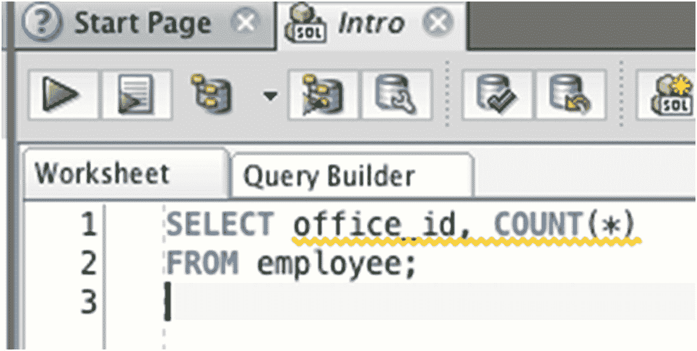
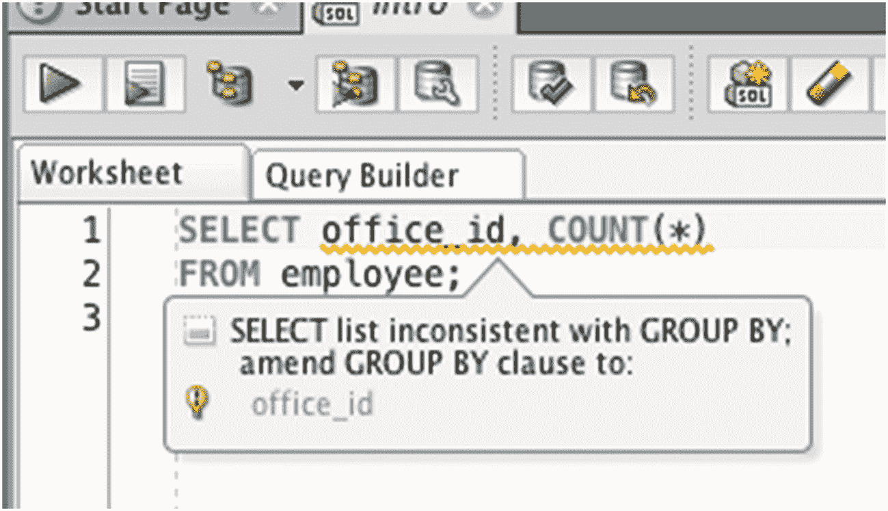

# SQL 聚合函数：SUM 与 COUNT 详解

## 一、SUM 函数示例

让我们通过`employee`表中`salary`值的一些例子来看看`SUM`函数。该表如下所示：

| ID | LAST_NAME | SALARY |
| --- | --- | --- |
| 1 | JONES | 30000 |
| 2 | SMITH | 35000 |
| 3 | KING | 45000 |
| 4 | SIMPSON | 52000 |
| 5 | ANDERSON | 31000 |
| 6 | COOPER | (null) |
| 7 | ADAMS | (null) |
| 8 | SMITH | 62000 |
| 9 | PATRICK | 40000 |
| 10 | Jones | 42000 |

```sql
SELECT id,
last_name,
salary
FROM employee;
```

要找到`salary`值的`SUM`总和，你可以编写如下查询：

```sql
SELECT SUM(salary)
FROM employee;
```

这将显示所有薪水值的总和。

| SUM(SALARY) |
| --- |
| 337000 |

`NULL`值在`SUM`计算中被忽略，`salary`值的总和是 337,000。请注意，即使`employee`表中有十行数据，也只返回了一行。这是因为`SUM`函数是一个**聚合函数**。无论基础表中有多少行，它都只返回一行。

### 1.1 SUM 与 WHERE 子句

当你将其与`WHERE`子句一起使用时，`SUM`函数也能工作。数据库会先执行`WHERE`子句，然后对那些符合`WHERE`子句条件的值执行`SUM`。

假设你想找出除 SIMPSON 外所有`employee`的`salary`值总和。查询如下：

```sql
SELECT SUM(salary)
FROM employee
WHERE last_name <> 'SIMPSON';
```

此查询的结果是：

| SUM(SALARY) |
| --- |
| 285000 |

这与之前的薪水总和相同，但减去了 SIMPSON 的 52000 薪水。

### 1.2 SUM 与表达式

你可以在`SUM`函数中使用已经过其他函数处理或计算的值。假设你想找出如果所有`salary`值都增加 20%后的总额。这意味着`salary`值将乘以 1.2，然后相加。

```sql
SELECT SUM(salary * 1.2)
FROM employee;
```

结果如下：

| SUM(SALARY) |
| --- |
| 404400 |

任何可以转换为数字的东西都可以用作`SUM`函数的参数。

### 1.3 SUM 与 DISTINCT

让我们看看`DISTINCT`关键字在`SUM`函数内部使用时的作用。这将找出列中的唯一或不同的值，并对它们求和。

```sql
SELECT SUM(DISTINCT salary)
FROM employee;
```

结果如下：

| SUM(SALARY) |
| --- |
| 337000 |

它显示 337,000，因为它计算了所有唯一`salary`值的总和。

## 二、COUNT 函数

Oracle SQL 中另一个可用的函数是`COUNT`函数。此函数用于计算表中或结果集中的记录数。它的工作方式与`SUM`函数类似：

```sql
COUNT( [DISTINCT] expression)
```

该函数的两个参数与`SUM`函数相同：

*   `expression`：这是要计数的表达式，可以是表中的某个列，也可以是数字值的其他表示。
*   `DISTINCT`：这是一个可选参数，指定`COUNT`函数应只计算表达式中不同的或唯一的值。

让我们看一些例子。

### 2.1 统计所有记录

`COUNT`函数的一个常见用途是统计表中的所有记录。这可以通过使用`*`作为参数来完成：

```sql
SELECT COUNT(*)
FROM employee;
```

这将统计表中的所有记录并显示一个数字。

| COUNT(*) |
| --- |
| 10 |

与`SUM`函数一样，`COUNT`函数也是一个聚合函数，因此它将多行聚合成一行。这是查看表中记录数量的简单方法。你可以在任何表上运行它：

| COUNT(*) |
| --- |
| 3 |

```sql
SELECT COUNT(*)
FROM office;
```

`office`表中有三条记录，所以这个`COUNT`显示值为 3。

### 2.2 统计特定列

使用`COUNT`函数的另一种方法是统计特定列中的值的数量。这与`COUNT(*)`略有不同，因为统计特定列会忽略任何`NULL`值，而`COUNT(*)`会包含带有`NULL`值的行。

如果你对`id`列执行`COUNT`，它将计算非`NULL`的值并显示结果。在这种情况下，所有值都已填充。你可以通过从员工表中选择一些列来确认这一点。

| ID | LAST_NAME | SALARY |
| --- | --- | --- |
| 1 | JONES | 30000 |
| 2 | SMITH | 35000 |
| 3 | KING | 45000 |
| 4 | SIMPSON | 52000 |
| 5 | ANDERSON | 31000 |
| 6 | COOPER | (null) |
| 7 | ADAMS | (null) |
| 8 | SMITH | 62000 |
| 9 | PATRICK | 40000 |
| 10 | Jones | 42000 |

```sql
SELECT id, last_name, salary
FROM employee;
```

你可以在`id`列上使用`COUNT`函数：

| COUNT(ID) |
| --- |
| 10 |

```sql
SELECT COUNT(id)
FROM employee;
```

但是，如果你统计`last_name`列，值将会不同，因为有一个`NULL`值：

| COUNT(LAST_NAME) |
| --- |
| 9 |

```sql
SELECT COUNT(last_name)
FROM employee;
```

你也可以统计`salary`列，这将显示另一个不同的值：

| COUNT(SALARY) |
| --- |
| 8 |

```sql
SELECT COUNT(salary)
FROM employee;
```

如你所见，如果该列中有`NULL`值，对不同列执行`COUNT`将显示不同的结果。

### 2.3 COUNT 与 DISTINCT

有时你需要找出列中不同或唯一值的数量，例如“状态”列或员工`last_name`值。你可以使用`SELECT DISTINCT`来查看这些值是什么，但如果你只想看看有多少个，你可以使用带有`DISTINCT`的`COUNT`。

执行此操作的查询如下：

```sql
SELECT COUNT(DISTINCT last_name)
FROM employee;
```

注意`DISTINCT`在括号内部，因为我们正在统计不同的`last_name`值。此查询的结果是：

| COUNT(DISTINCT LAST_NAME) |
| --- |
| 9 |

此结果显示为 9，因为表中有 10 行，包括 SMITH 这个值被提到了两次，它在计数中被排除。这表明有 9 个不同的`last_name`值。我们可以通过运行`SELECT`查询来看看实际值是什么：

| LAST_NAME |
| --- |
| JONES |
| SMITH |
| KING |
| SIMPSON |
| ANDERSON |
| ADAMS |
| COOPER |
| PATRICK |
| Jones |

```sql
SELECT DISTINCT last_name
FROM employee;
```

“JONES”和“Jones”被视为不同的值，因为`DISTINCT`关键字是区分大小写的。

如果我们将`DISTINCT`放在`COUNT`函数之外会怎样？这是我以前做过，也看到别人做过的事情。为了计算不同记录的数量，一个查询可能如下所示：

```sql
SELECT DISTINCT COUNT(last_name)
FROM employee;
```

如果你运行这个查询，你会得到这个结果：

| COUNT(LAST_NAME) |
| --- |
| 10 |

显示值为 10。这是因为此查询不是在统计不同的`last_name`值；它是在统计所有的`last_name`值，然后对`COUNT`函数的结果执行`DISTINCT`。执行步骤如下：

1.  查看员工表中的`last_name`值。
2.  统计非`NULL`的`last_name`值的数量并返回一个单一值（值为 10）。
3.  显示唯一的结果。只有一行，因此没有找到重复项。

此过程在`DISTINCT`之前执行`COUNT`，因此虽然查询会返回结果，但它并未向你显示不同的`last_name`值的数量。

#### 注意

要计算不同值的数量，`DISTINCT`必须放在`COUNT`函数内部，而不是外部。


#### 结合 WHERE 进行计数

使用 `COUNT` 函数的另一种方式是在 `SELECT` 查询中结合 `WHERE` 子句。前面的例子都涉及计算表中的所有记录，但有时你可能需要计算满足特定条件的记录。这和之前所做的那样，在 `SELECT` 查询中添加一个 `WHERE` 子句一样简单。

假设你需要找出 `salary` 小于或等于 40000 的 `employees` 数量。一个可以实现此目的的查询是：

```sql
SELECT COUNT(*)
FROM employee
WHERE salary <= 40000;
```

这个查询使用了 `COUNT(*)` 函数以及一个 `WHERE` 子句，仅统计我们想要计数的员工。结果是：

| COUNT(*) |
| --- |
| 4 |

这个查询确定了有 4 名员工符合该标准。

### AVG 函数

Oracle 包含一个名为 `AVG` 的函数，是“平均值（average）”的缩写。此函数用于查找一组数值的平均值。平均值是通过将所有非 `NULL` 值相加，再除以非 `NULL` 值的数量来计算的。该函数的语法与 `SUM` 和 `COUNT` 函数相似：

```sql
AVG ( [DISTINCT] expression)
```

此函数的参数与 `COUNT` 函数相同：

*   `expression`：这是要计算平均值的表达式，可以是表中的某个列或其他数值的表示。
*   `DISTINCT`：这是一个可选参数，指定 `AVG` 函数应仅计算表达式中不同或唯一的值的平均值。

让我们看一些例子。

#### 所有值的平均值

使用 `AVG` 函数的一种方法是找出某列所有值的平均值。这只适用于数值，因此在本例中，你需要找出所有员工的平均 `salary`：

```sql
SELECT AVG(salary)
FROM employee;
```

与之前的 `COUNT` 和 `SUM` 函数类似，你在括号内指定列名。数据库将查看该列中所有非 `NULL` 的值，计算它们的平均值，并将结果显示给你。此查询的结果是：

| AVG(SALARY) |
| --- |
| 42125 |

这显示了平均工资是 42,125。你可以通过选择这些值来检查表中有哪些 `salary` 值：

| ID | SALARY |
| --- | --- |
| 1 | 30000 |
| 2 | 35000 |
| 3 | 45000 |
| 4 | 52000 |
| 5 | 31000 |
| 6 | (null) |
| 7 | (null) |
| 8 | 62000 |
| 9 | 40000 |
| 10 | 42000 |

```sql
SELECT id, salary
FROM employee;
```

#### 使用 DISTINCT 计算平均值

你也可以使用 `AVG` 函数来计算唯一或不同值的平均值。它的工作方式与 `COUNT` 函数相同，即消除列中的重复值，然后对剩余值计算平均值。查询可能如下所示：

```sql
SELECT AVG(DISTINCT salary)
FROM employee;
```

| AVG(DISTINCTSALARY) |
| --- |
| 42125 |

这个查询找到了不同值的平均值。

#### 结合 WHERE 计算平均值

最后，就像 `SUM` 和 `COUNT` 函数一样，你可以在带有 `WHERE` 子句的查询中使用 `AVG`。你可以将 `WHERE` 子句单独添加到查询中，与 `AVG` 函数分开。

假设你需要找出办公室编号为 2 的 `employees` 的平均 `salary`。为此，你的查询可以是：

```sql
SELECT AVG(salary)
FROM employee
WHERE office_id = 2;
```

结果是：

| AVG(SALARY) |
| --- |
| 40666.66666 |

这个查询将找到所有 `office_id` 为 2 的 `employees`，然后计算这些员工的平均 `salary`。你可以运行一个 `SELECT` 查询来查看它使用了哪些记录：

| ID | LAST_NAME | SALARY |
| --- | --- | --- |
| 2 | SMITH | 35000 |
| 3 | KING | 45000 |
| 10 | Jones | 42000 |

```sql
SELECT id, last_name, salary
FROM employee
WHERE office_id = 2;
```

这三条记录被用于 `AVG` 函数，其 `salary` 值的平均值为 40,666。

### MIN 函数

`MIN` 是另一个聚合函数，用于在值列表中查找最小值或最低值。它与 `AVG` 和 `SUM` 一样，用于数值，并且会忽略任何 `NULL` 值。

要使用 `MIN` 函数，请遵循以下语法：

```sql
MIN (expression)
```

这里的 `expression` 指的是用于计算最小值的值。最常见的，这将是表中的一个列。让我们看一些 `MIN` 函数的例子。

#### 所有记录的最小值

你可以编写一个简单的查询，使用 `MIN` 来查找所有记录的最小值。例如，要找到最小的 `salary`，你的查询可能如下所示：

```sql
SELECT MIN(salary)
FROM employee;
```

这个查询的结果是：

| MIN(SALARY) |
| --- |
| 30000 |

这显示了最小或最低的 `salary` 是 30000。通过查看表中的所有 `salary` 值，你可以确认这一点。

| ID | SALARY |
| --- | --- |
| 1 | 30000 |
| 2 | 35000 |
| 3 | 45000 |
| 4 | 52000 |
| 5 | 31000 |
| 6 | (null) |
| 7 | (null) |
| 8 | 62000 |
| 9 | 40000 |
| 10 | 42000 |

```sql
SELECT id, salary
FROM employee;
```

你可以通过 `salary` 列对这个查询进行排序，以便更容易地找到最低值。

| ID | SALARY |
| --- | --- |
| 1 | 30000 |
| 5 | 31000 |
| 2 | 35000 |
| 9 | 40000 |
| 10 | 42000 |
| 3 | 45000 |
| 4 | 52000 |
| 8 | 62000 |
| 6 | (null) |
| 7 | (null) |

```sql
SELECT id, salary
FROM employee
ORDER BY salary ASC;
```

现在你可以看到最低的 `salary` 是 30000。`NULL` 值被忽略，因为它们代表未知的值，这与零不同。

#### 结合 WHERE 计算最小值

就像之前的函数一样，你可以在带有 `WHERE` 子句的查询中使用 `MIN` 函数。假设你想找出所有在 `office_id` 为 3 的 `employees` 中的最低 `salary`。为此，你的查询如下所示：

```sql
SELECT MIN(salary)
FROM employee
WHERE office_id = 3;
```

结果是：

| MIN(SALARY) |
| --- |
| 62000 |

这是最小值，因为只有两个员工的 `office_id` 是 3，而其中一个的 `salary` 值是 `NULL`。

### MAX 函数

你将学到的最后一个聚合函数是 `MAX` 函数。此函数将找出一组值中的最大值或最高值。它与 `MIN` 函数相反。要使用此函数，请遵循以下语法：

```sql
MAX (expression)
```

这里的 `expression` 指的是用于计算最大值的值。最常见的，这将是表中的一个列。让我们看一些 `MAX` 函数的例子。

#### 所有记录的最大值

你可以使用 `MAX` 函数来查找表中某列的最高值，就像使用 `MIN` 函数查找最小值一样。一个实现此目的的查询如下所示：

```sql
SELECT MAX(salary)
FROM employee;
```

这将显示以下结果：

| MAX(SALARY) |
| --- |
| 62000 |

这显示了表中最高的 `salary`，即 62,000。你可以通过从表中选择所有 `salary` 值并按 `salary` 降序排列来确认这一点：

| ID | SALARY |
| --- | --- |
| 8 | 62000 |
| 4 | 52000 |
| 10 | 42000 |
| 3 | 45000 |
| 9 | 40000 |
| 2 | 35000 |
| 5 | 31000 |
| 1 | 30000 |
| 6 | (null) |
| 7 | (null) |

```sql
SELECT id, salary
FROM employee
ORDER BY salary DESC NULLS LAST;
```

与本章中所有其他函数一样，`NULL` 值被忽略。

#### 结合 WHERE 计算最大值

你也可以在查询中使用 `WHERE` 子句时使用 `MAX` 函数。`MAX` 函数将应用于匹配 `WHERE` 子句的所有行中的值。

例如，要找出办公室 1 或 2 中所有 `employees` 的最高 `salary`，可以使用以下查询：

```sql
SELECT MAX(salary)
FROM employee
WHERE office_id IN (1, 2);
```

结果是：

| MAX(SALARY) |
| --- |
| 52000 |

这是办公室 1 或 2 中员工的最高 `salary`。


### 概要

聚合函数是用于查看一行或多行数据，并将这些数据聚合为单一结果的函数。最常用的五个函数分别是 `SUM`（用于累加值）、`COUNT`（用于计数）、`AVG`（用于计算平均值）、`MAX`（用于求最大值）和 `MIN`（用于求最小值）。它们都会忽略 `NULL` 值，并且可以与 `WHERE` 子句一同使用。

## 25. 对结果进行分组

在上一章中，你学习了聚合函数。这些函数计算列中值的某个汇总值（例如总和或计数），并向你显示单行结果。在本章中，你将学习如何编写查询以对结果进行分组。这是什么意思？

### 分组数据

为了理解分组数据的概念，让我们来看一下员工表。

| ID | LAST_NAME | SALARY | OFFICE_ID |
| --- | --- | --- | --- |
| 1 | JONES | 30000 | 1 |
| 2 | SMITH | 35000 | 2 |
| 3 | KING | 45000 | 2 |
| 4 | SIMPSON | 52000 | 1 |
| 5 | ANDERSON | 31000 | (null) |
| 6 | COOPER | (null) | 1 |
| 7 | ADAMS | (null) | 3 |
| 8 | SMITH | 62000 | 3 |
| 9 | PATRICK | 40000 | 1 |
| 10 | Jones | 42000 | 2 |

```sql
SELECT id, last_name, salary, office_id
FROM employee;
```

在上一章中，你学习了如何使用 `SUM` 计算所有薪资值的总和，以及如何使用 `COUNT` 计算记录数。这些函数查看表中的所有值，并向你返回一个汇总值。它们可以帮助你找到如下问题的答案：

*   计算所有薪资值的总和
*   计算办公室 ID 为 1 的员工的薪资总和
*   计算员工总数
*   计算办公室 ID 为 2 的员工数量

如果你想找出每个办公室的员工数量怎么办？你可以编写如下查询：

```sql
SELECT COUNT(*)
FROM employee
WHERE office_id = 1;
```

这将显示 `office_id` 值为 1 的员工数量。然后你必须为下一个 `office_id` 值运行另一个查询：

```sql
SELECT COUNT(*)
FROM employee
WHERE office_id = 2;
```

然后你需要不断运行这类查询，直到获得所有 `office_id` 值的 `COUNT` 结果。这样做有几个缺点：

*   你必须为每个不同的 `office_id` 值单独编写查询，这非常耗时。
*   在编写查询之前，你需要知道每个 `office_id` 值具体是什么。
*   你必须手动合并所有这些单独查询的结果。

不过，有一种更好的方法：分组。Oracle SQL 允许你在使用聚合函数时对数据进行分组。这让你无需运行单独的查询，就能找到诸如“计算每个办公室 ID 的员工数量”之类问题的答案。对于此示例，这正是我们想要的结果。

| OFFICE_ID | COUNT(*) |
| --- | --- |
| 1 | 4 |
| 2 | 3 |
| 3 | 2 |
| (null) | 1 |

如何用 SQL 实现这一点呢？有一个名为 `GROUP BY` 的关键字可以与 `SELECT` 语句一起使用。

### GROUP BY 关键字

在 SQL 中，`GROUP BY` 关键字允许你在运行 `SELECT` 查询时对数据进行分组。要使用 `GROUP BY`，你需要具备：

*   一个聚合函数，例如 `SUM` 或 `COUNT`
*   用于对数据进行分组的列

在我们的示例中，你想计算每个办公室 ID 的员工数量。这意味着你想要分组的列是 `office_id`，因为描述是“在每个办公室 ID 中”。你还需要查看员工数量，这是使用 `COUNT` 完成的。

要开始 `SELECT` 查询，你先指定要显示的列，然后是聚合函数 `COUNT`：

```sql
SELECT office_id, COUNT(*)
```

这将显示 `office_id` 列，然后是一个 `COUNT` 列。接着你添加表名：

```sql
SELECT office_id, COUNT(*)
FROM employee
```

现在你添加 `GROUP BY` 关键字。这定义了你希望如何对数据进行分组，或者说 `COUNT` 函数应如何进行计算。你想为 `office_id` 的每个不同值计算 `COUNT`，因此你的 `GROUP BY` 子句将如下所示：

```sql
SELECT office_id, COUNT(*)
FROM employee
GROUP BY office_id;
```

记住这一点的一个简单方法是：`SELECT` 子句中任何不是聚合函数的列，都应该出现在 `GROUP BY` 子句中。在此查询中，`office_id` 位于 `SELECT` 子句中，也位于 `GROUP BY` 子句中。`COUNT(*)` 函数不在 `GROUP BY` 子句中，因为它是一个聚合函数。现在让我们运行这个查询。

| OFFICE_ID | COUNT(*) |
| --- | --- |
| 1 | 4 |
| 2 | 3 |
| 3 | 2 |
| (null) | 1 |

这正好显示了你想要的结果。这个简单的查询让你无需知道 `office_id` 具体有哪些值，也无需编写多个查询，就能找出每个办公室的员工数量。

如果你不使用 `GROUP BY` 子句会怎样？

```sql
SELECT office_id, COUNT(*)
FROM employee;
```

如果你运行此查询，你可能期望看到相同的结果。然而，你看到的会是：

```
ORA-00937: not a single-group group function
00937. 00000 -  "not a single-group group function"
*Cause:
*Action:
Error at Line: 1 Column: 8
```

此错误意味着你在一个包含聚合函数的查询中使用了普通列，但没有使用 `GROUP BY` 子句。这个 SQL 语句是无效的，因为它缺少 `GROUP BY` 子句。这是编写 SQL 时常见的错误，但幸运的是它很容易修复。

如果你忘记添加 `GROUP BY`，SQL Developer 还会在你的 `SELECT` 列下显示彩色下划线：



图 25-1

彩色下划线提示

如果将鼠标悬停在其上，它将显示警告消息。



图 25-2

缺少 GROUP BY 的警告消息

这样，你就可以在运行查询之前发现问题。

### 与连接（JOIN）一起使用的 GROUP BY

你可以将 `GROUP BY` 子句与任何 `SELECT` 查询一起使用，例如那些需要与其他表连接的查询。假设你想查看每个办公室的员工数量，但希望显示办公室的 `address` 而不是 ID。`address` 字段在办公室表中。你的查询将如下所示：

```sql
SELECT o.address,
COUNT(*)
FROM employee e
INNER JOIN office o ON e.office_id = o.id
GROUP BY o.address
ORDER BY o.address;
```

此查询包含几个部分。它使用了表别名，“o” 代表办公室表，“e” 代表员工表。查询按办公室表中的 `address` 字段分组。同时，它还将两个表连接在一起。

此查询的结果是：

| ADDRESS | COUNT(*) |
| --- | --- |
| 10 Collins Road | 2 |
| 123 Smith Street | 4 |
| 45 Main Street | 3 |

这将显示每个办公室的 `addresses`，以及查询为每个 `address` 找到的员工记录数。

### GROUP BY 与 SUM

你可以将 `GROUP BY` 子句与任何聚合函数一起使用。前面的示例使用了 `COUNT`，但如果需要，你也可以使用 `SUM`。要计算每个办公室的薪资总和，你的查询可能如下所示：

```sql
SELECT office_id,
SUM(salary)
FROM employee
GROUP BY office_id;
```

它与使用 `COUNT` 的查询非常相似，但你是在 `salary` 列上使用 `SUM` 函数。你的结果将如下所示：

| OFFICE_ID | SUM(SALARY) |
| --- | --- |
| 1 | 122000 |
| 2 | 122000 |
| 3 | 62000 |
| (null) | 31000 |

这显示了每个 `office_id` 值，以及具有该 `office_id` 的所有员工的薪资值总和。你可以手动将它们相加，但使用此函数和 `GROUP BY` 子句会自动完成计算。


### 使用 WHERE 子句的 GROUP BY

就像其他任何 `SELECT` 查询一样，如果你在使用 `GROUP BY` 子句，你也可以使用 `WHERE` 子句来过滤你的结果。`WHERE` 子句会过滤掉所有不符合你条件的记录，然后 `GROUP BY` 子句和聚合函数将在剩下的记录上执行。

假设你想找出每个办公室的工资总额，但要排除员工 SIMPSON。你的查询可能如下所示：

```sql
SELECT office_id,
SUM(salary)
FROM employee
WHERE last_name <> 'SIMPSON'
GROUP BY office_id;
```

`WHERE` 子句位于 `GROUP BY` 子句之前。如果顺序反过来，你会得到一个错误。

这个查询的结果是：

| OFFICE_ID | SUM(SALARY) |
| --- | --- |
| 1 | 70000 |
| 2 | 122000 |
| 3 | 62000 |
| (null) | 31000 |

结果与之前的查询几乎相同，只是 `office_id` 为 1 的工资总和降低了。降低了 52,000，因为 SIMPSON 被排除在外，而他的 `office_id` 是 1。在这个例子中，查询执行了以下步骤：

1.  查看了所有员工记录
2.  排除了 `last_name` 是 SIMPSON 的记录
3.  从这些结果中显示了每个唯一的 `office_id` 值
4.  针对这些结果中的每个 `office_id` 值计算了 `SUM`

在 SQL 中，结合使用 `WHERE`、聚合函数和 `GROUP BY` 可以轻松获得你想要的聚合结果。

### 分组后限制结果

查询中的 `WHERE` 子句允许你在执行聚合函数和分组之前限制结果。在前面的例子中，你通过办公室排除了员工 SIMPSON 的 `salary` 总和。

让我们尝试另一个例子，来看看 SQL 的另一个特性。假设你想找出每个办公室的员工数量，但只要那些员工数量超过两人的办公室。

你可以先列出 `office_id` 值和员工计数：

```sql
SELECT office_id, COUNT(*)
FROM employee
GROUP BY office_id;
```

结果会是这样：

| OFFICE_ID | COUNT(*) |
| --- | --- |
| 1 | 4 |
| 2 | 3 |
| 3 | 2 |
| (null) | 1 |

这显示了每个办公室的员工数量。现在，下一步是只显示员工数量超过两人的办公室。要做到这一点，你可以排除 `office_id` 为 3 的记录，但更好的方法是根据你的条件来排除记录。根据你发现的 `id` 值来排除数据，需要你事先知道这些 `id` 值。所以，让我们排除员工数为 2 或更少的记录：

```sql
SELECT office_id, COUNT(*)
FROM employee
WHERE COUNT(*) > 2
GROUP BY office_id;
```

这应该只显示 `COUNT` 函数返回值大于 2 的记录。让我们运行这个查询，看看会发生什么：

```
ORA-00934: group function is not allowed here
00934. 00000 -  "group function is not allowed here"
*Cause:
*Action:
Error at Line: 3 Column: 7
```

你得到了一个错误。为什么会这样？这个错误的发生是因为 SQL 语句的处理方式及其背后的规则。SQL 中的一条规则是，你不能在 `WHERE` 子句中使用任何由 `GROUP BY` 子句产生的值（例如聚合函数的结果）。这是因为 SQL 语句中的子句是按照与书写顺序不同的顺序处理的：

1.  `FROM`
2.  `WHERE`
3.  `GROUP BY`
4.  `SELECT`
5.  `ORDER BY`

这意味着当 `WHERE` 子句被处理时，它只知道你正在从中选择的列和表。它不知道每个组的 `COUNT` 函数的结果，因为那是 `GROUP BY` 子句的工作。

如何得到你需要的结果呢？你可以使用一个叫做 `HAVING` 的子句。

### HAVING 子句

在 SQL 中，有一个叫做 `HAVING` 的子句。`HAVING` 子句将在 `GROUP BY` 应用之后，对你的结果集中的行进行限制。`HAVING` 子句看起来像这样：

```sql
HAVING criteria
```

它的工作方式类似于 `WHERE` 子句，因为你需要指定条件。然而，这里的条件应该是你 `SELECT` 查询中使用的聚合函数。

在之前的例子中，你试图找出员工数量超过两人的办公室及其员工数量。为此，你需要只显示 `COUNT(*)` 大于 2 的记录。因为这是一个聚合函数，你需要为此使用 `HAVING` 子句：

```sql
SELECT office_id,
COUNT(*)
FROM employee
GROUP BY office_id
HAVING COUNT(*) > 2;
```

`HAVING` 子句看起来与 `WHERE` 子句相同，只是关键字不同。此外，`HAVING` 子句位于 `GROUP BY` 子句之后，而不是 `FROM` 子句之后。

如果你运行这个查询，你会得到这个结果：

| OFFICE_ID | COUNT(*) |
| --- | --- |
| 1 | 4 |
| 2 | 3 |

前两个 `office_id` 都显示了，因为它们分别有 4 名和 3 名员工。`office_id` 为 3 的记录没有显示，因为它只有两名员工。你可以通过查询 `employee` 表并按 `office_id` 排序来查看底层数据，这样更容易看清楚：

```sql
SELECT id,
last_name,
office_id
FROM employee
ORDER BY office_id ASC;
```

| ID | LAST_NAME | OFFICE_ID |
| --- | --- | --- |
| 1 | JONES | 1 |
| 4 | SIMPSON | 1 |
| 6 | COOPER | 1 |
| 9 | PATRICK | 1 |
| 2 | SMITH | 2 |
| 3 | KING | 2 |
| 10 | Jones | 2 |
| 7 | ADAMS | 3 |
| 8 | SMITH | 3 |
| 5 | ANDERSON | (null) |

通过查看这个结果，你可以看到员工数量。

### GROUP BY、HAVING 和 SUM

你可以将 `HAVING` 子句与任何聚合函数一起使用。前面的例子使用了 `COUNT` 函数，但它也可以与 `SUM`、`MAX`、`MIN` 或 `AVG` 等其他函数一起使用。

假设你需要找出每个办公室的员工数量和总 `salary`，但只要总 `salary` 大于 100,000 的办公室。这可以通过扩展之前例子的查询来完成：

```sql
SELECT office_id,
COUNT(*),
SUM(salary)
FROM employee
GROUP BY office_id
HAVING SUM(salary) > 100000;
```

这个查询有几个不同之处。它有两个聚合函数：`COUNT` 和 `SUM`。这在 SQL 中是允许的。它还有一个 `HAVING` 子句，只显示 `salary` 的 `SUM` 大于 100,000 的记录。这个查询的结果是：

| OFFICE_ID | COUNT(*) | SUM(SALARY) |
| --- | --- | --- |
| 1 | 4 | 122000 |
| 2 | 3 | 122000 |

它显示了办公室 1 和 2，因为它们的总 `salary` 大于 100000。`office_id` 为 3 的记录被排除，因为总 `salary` 小于 100000。

这个例子表明，你可以在查询中包含两个聚合函数，并且只对其中一个使用 `HAVING` 子句。


### 查找重复记录

你在本章将学习的最后一个示例是如何查找重复记录。在你的数据表中，很容易存储与现有记录相同的数据。你可以使用数据库和应用程序代码中的功能来防止这种情况；然而，这些功能并不总是被使用。

让我们再看一下 `employee` 表：

```
SELECT id,
last_name,
salary,
office_id
FROM employee;
```

结果是：

| ID | LAST_NAME | SALARY | OFFICE_ID |
| --- | --- | --- | --- |
| 1 | JONES | 30000 | 1 |
| 2 | SMITH | 35000 | 2 |
| 3 | KING | 45000 | 2 |
| 4 | SIMPSON | 52000 | 1 |
| 5 | ANDERSON | 31000 | (null) |
| 6 | COOPER | (null) | 1 |
| 7 | ADAMS | (null) | 3 |
| 8 | SMITH | 62000 | 3 |
| 9 | PATRICK | 40000 | 1 |
| 10 | Jones | 42000 | 2 |

你可以看到有十名员工。一些 `last_name` 的值是相同的，即使 `salary` 不同。如果你想在这个表中查找重复记录，你可能想从重复出现的 `last_name` 值开始。仅仅因为记录有相同的 `last_name` 并不意味着它们是重复的，但这是一个很好的起点。你也可能只想知道哪些 `last_name` 值被使用了不止一次。

你想编写的查询将向你显示 `last_name` 以及每个 `last_name` 的员工数量，条件是该姓氏对应有多于一名员工。这个查询看起来像这样：

```
SELECT UPPER(last_name),
COUNT(*) AS empcount
FROM employee
GROUP BY UPPER(last_name)
HAVING COUNT(*) > 1
ORDER BY empcount DESC;
```

这个查询中包含几个部分。我们选择了 `last_name` 的大写版本和每个 `last_name` 的 `COUNT` 数，并给 `COUNT` 列起了一个别名 "empcount"。我们按 `last_name` 列进行分组，并使用 `HAVING` 子句来排除员工数小于或等于 1 的 `last_name` 记录。最后，我们按 `empcount` 列排序。

为什么我们在 `HAVING` 子句中使用 `COUNT(*)` 函数，却在 `ORDER BY` 中使用 `empcount` 别名？这是由于查询在 Oracle 中的处理方式决定的，这意味着 `ORDER BY` 子句可以引用列别名，但 `GROUP BY` 和 `HAVING` 不可以。使用 `ORDER BY COUNT(*) DESC` 也可以达到相同的结果，但在本例中，我使用了列别名。

让我们看看结果：

| LAST_NAME | EMPCOUNT |
| --- | --- |
| JONES | 2 |
| SMITH | 2 |

结果显示 JONES 和 SMITH 各有 2 名员工。JONES 的 `last_name` 显示为 2，是因为我们将 `last_name` 转换为了大写，因此它包含了 "Jones" 这条记录。所有其他 `last_name` 值未显示在此处，因为它们只对应一名员工。

因此，通过组合使用聚合函数、分组和排序，你可以找出哪些记录可能是重复的，并可以进一步调查你的数据。

### 总结

对数据进行分组意味着对特定列中每个不同的值执行聚合函数。如果你在查询中同时使用了聚合函数和非聚合函数列，你需要按所有非聚合列进行分组，以避免错误。你可以使用 `WHERE` 子句在分组前过滤记录。你也可以使用 `HAVING` 子句在分组操作应用后对记录进行过滤，这是基于所使用的聚合函数进行的。

结合使用 `GROUP BY` 和 `HAVING` 可以让你轻松获得所需的结果。

## 26. 什么是索引？

索引是 SQL 中一个值得了解的功能。它们对于提升查询性能非常有用，并且随着你在 SQL 方面经验的增长，你需要了解如何创建它们以及为什么需要它们。

### 什么是索引？

一个 `索引` 是数据库中的一个对象，它可以提升性能，或减少你的 SQL 查询的运行时间。我喜欢把它想象成教科书后面的索引。

你是否曾经为了查找某个特定主题而翻阅教科书？例如，你正在看一本关于人类文明史的教科书，想了解更多关于尤利乌斯·凯撒的信息。你知道这是罗马时代的一部分，所以你可能会猜它在书中间的某个位置。你会翻到书中间的某处，浏览页面寻找关于尤利乌斯·凯撒的内容。或者，你可以从第一页开始，逐页查找关于尤利乌斯·凯撒的信息，直到找到当前年份。

这两种方法都会花费不少时间，而且效率不高。当你从头到尾阅读每一页直到找到所需信息时，这正是 Oracle 在你的表中查找数据的方式。当你查找 `last_name` 是 SIMPSON 的 `employee` 记录时，Oracle 会查看每一行来找到你需要的记录。如果表很大，这也可能需要一些时间。

有一个更好的方法。教科书通常在书的末尾有一个索引。这个索引会列出书中所有的关键主题以及它们被引用的页码。要找到关于尤利乌斯·凯撒的信息，你只需在索引中查找，它就会显示书中提到他的所有页码：

*尤利乌斯·凯撒... 第 43, 210, 548-570 页*

然后你可以翻到那些页面找到你需要的信息。

Oracle 中的 `索引` 工作原理相同。你可以创建一个 `索引`，它包含如何在表中找到记录的信息。当你运行一个使用该信息查找数据的 SQL 语句时，Oracle 将使用 `索引` 来找到你需要的记录。这通常比在没有 `索引` 的情况下遍历整个表要快得多。

那么，为什么你需要了解索引呢？了解索引是很有好处的，因为它们能极大地影响查询的性能。在“现实世界”的数据库中，表上存在索引也是非常普遍的。了解它们是什么、有什么作用以及如何创建它们，是你职业生涯中一项有用的技能。

### 如何创建索引

一个 `索引` 是数据库中的一个对象，就像 `表` 一样。要创建 `索引`，我们使用 `CREATE` 语句。这个语句的语法是：

```
CREATE INDEX index_name
ON table_name (columns);
```

你以 `CREATE INDEX` 开始。然后你需要为 `索引` 提供一个名称。`索引` 名在数据库中必须是唯一的。接下来是关键字 `ON`，然后是 `表名`，后面跟着你想要在其上创建索引的列（或多列）。

一个 `索引` 是创建在单个 `表` 和一个或多个列上的。`索引` 将存储你指定的列的信息，使数据库更容易基于这些列查找记录。让我们看一些例子。


### 创建索引示例

假设你想在 `employee` 表的 `last_name` 列上创建一个索引，以便任何查询该列的操作都能运行得更快。为此，你的语句会是这样的：

```
CREATE INDEX idx_emp_lname
ON employee (last_name);
```

这是一个简短的语句，但有几点需要注意。首先，索引名称是 `idx_emp_lname`。你可以起任何喜欢的名称，只要符合 Oracle 的命名规则（例如，必须以字母开头，长度不能超过 30 个字符）。为什么我要把这个索引命名为 `idx_emp_lname` 呢？

如果你做过编程，可能了解某些编码标准或规范。这些并非编程语言强制执行的规则，而是团队或社区设定的标准。这些标准可能涉及空格、换行、字符和对象命名。你可能已经注意到我在本书的 SQL 代码中已经使用了一些：

*   SQL 关键字全部大写，例如 `SELECT` 和 `FROM`

*   列名和表名使用小写，例如 `employee` 和 `salary`

*   `SELECT` 语句中的每个关键字都另起一行。

这个索引被命名为 `idx_emp_lname` 是因为这是我喜欢提倡的一个标准。它分为三个部分：

*   `idx` 是索引（index）的缩写，表示此对象是一个索引。

*   `emp` 是 `employee` 的缩写，表示该索引所应用的表。

*   `lname` 是 `last_name` 的缩写，表示该索引所应用的列。

为什么这个名字有帮助？因为它能让你通过名称快速判断它是什么。有两个地方你经常会看到索引或其他数据库对象的名称。第一个是错误消息，因为错误消息通常包含对象名称，能够看到一个错误与 `idx_emp_lname` 相关，就能让你很好地了解其原因。第二个是使用一种称为执行计划的数据库功能，它包含了 Oracle 执行查询的计划步骤。当你看到名称 `idx_emp_lname` 时，你就知道它是 `employee` 表上 `last_name` 列的索引，而无需去查证。

让我们再看一下那个语句：

```
CREATE INDEX idx_emp_lname
ON employee (last_name);
```

索引名为 `idx_emp_lname`。然后是 `ON` 关键字，接着指定 `employee` 表。在括号内，是 `last_name` 列。这意味着将在数据库中创建一个索引，该索引包含所有不同的 `last_name` 值及其在 `employee` 表中存储位置的信息。这意味着当你在这个表上运行某些查询时，它们会运行得更快，因为数据库知道这些 `last_name` 值存储在哪里。

使用与运行 `SELECT` 查询相同的过程在数据库上执行该语句。如果你使用的是 SQL Developer 或 Live SQL（基于 Web 的 SQL 工具），这都适用。输出应显示：

```
Index IDX_EMP_LNAME created.
```

与表不同，你不能在索引上运行查询。你不能运行像 `SELECT * FROM idx_emp_lname` 这样的查询。这是因为索引将其所有信息在数据库后台存储。你需要做的只是创建它。

现在，让我们看一些使用索引的例子。还记得之前在书后索引中查找值的例子吗？Oracle 中的索引工作方式相同。但是，你需要编写一个实际在表中查找值的查询，才能使用索引。最简单的方法之一是使用 `WHERE` 子句。假设你有如下查询：

```
SELECT id,
last_name,
salary
FROM employee;
```

这个查询会显示所有 `employees` 的 `last_name`，但它不会使用索引。如果我们用之前的教科书例子来比喻，这就等同于“给我看这本书的每一页”。如果你想显示所有内容，使用书后的索引就没有帮助。

| ID | LAST_NAME | SALARY |
| --- | --- | --- |
| 1 | JONES | 30000 |
| 2 | SMITH | 35000 |
| 3 | KING | 45000 |
| 4 | SIMPSON | 52000 |
| 5 | ANDERSON | 31000 |
| 6 | COOPER | (null) |
| 7 | ADAMS | (null) |
| 8 | SMITH | 62000 |
| 9 | PATRICK | 40000 |
| 10 | Jones | 42000 |

假设你想查找一个名为 `COOPER` 的特定 `employee`。你的查询会是这样的：

```
SELECT id,
last_name,
salary
FROM employee
WHERE last_name = 'COOPER';
```

在创建索引之前，Oracle 必须：

1.  查看表中的每一行
2.  检查该行是否匹配 `last_name` 为 `COOPER`
3.  如果匹配，则将该行显示给你

对于十行数据来说，这看起来工作量不大，但一旦数据量增加到成千上万甚至数十万行，就会产生巨大的差异。

现在，你在这个表和这个列上有了索引，Oracle 将会：

1.  在索引中查找 `COOPER` 的条目，该条目显示了具有该值的行
2.  将这些行显示给你

在更大的表中，这将快得多。

如果你现在运行查询，你会得到这个结果：

| ID | LAST_NAME | SALARY |
| --- | --- | --- |
| 6 | COOPER | (null) |

索引不会改变显示的内容。它只是改变了显示的速度。

### 为什么性能很重要？

SQL 查询的性能很重要，因为快速的查询比慢速查询能提供更好的用户体验。有几种情况可能适用这一点。

#### Web 应用程序

一个例子是你正在开发一个供人们使用的应用程序。该应用程序会访问数据库来添加新数据、更新现有数据和查看现有数据。通常，当用户加载一个页面时，会在数据库上运行一个查询来向用户显示数据。在查询运行期间，用户必须等待，或者看着空白屏幕，或者看着加载屏幕，直到数据显示出来。如果数据能立即或在几秒钟内显示，对用户来说可能是一次良好的体验。这是他们期望的事情。然而，如果由于一个需要运行这么长时间的 `SELECT` 查询，导致页面 20 到 30 秒或更长时间无法显示，用户会不高兴。

在大多数情况下，他们期望在显示数据的应用程序中能有更快的加载时间。一个在几秒钟内显示数据的查询可能与一个需要运行 30 秒的查询只有细微差别，但对用户来说，其性能和体验却有天壤之别。


#### 夜间批处理作业

查询性能重要的另一个例子是夜间批处理作业。在许多组织中，用户操作的应用程序会存储数据。这些用户还需要对这些数据运行报告，以了解他们每月的销售额或注册客户数量。报告数据的系统通常与捕获数据的系统是分开的，因为生成报告可能会影响在线应用程序的性能。

为了让报告系统和在线应用程序高效运行，应用程序中的数据会被转移到一个报告系统中。这个报告系统针对查看数据进行了优化，它使用一个称为抽取、转换、加载 (`ETL`) 的流程。这个流程包含许多不同的 SQL 查询，例如填充表格以显示每日和每月的总销售额。

这个过程以及这些查询通常在夜间执行，这样应用程序的用户不会受到影响，并且报告系统也能为第二天做好准备。这些步骤大约有 12 小时的运行窗口。听起来时间很长，对吧？但是，这些查询可能非常复杂，可能需要相当长的时间才能运行完成。目标是让这些查询在午夜的某个时候完成，这样数据就能为第二天做好准备。然而，如果查询性能不佳，它们可能到早上 9 点还在运行，这意味着报告系统尚未准备好使用，而且运行它的服务器仍然处于负载之下。

这类查询的某个特定步骤花费 20 分钟或更长时间是很常见的。如果一个查询花了 3 个小时而不是 20 分钟，就可能导致流程的其余部分被延迟。在这种情况下，SQL 查询的性能非常重要。

#### 报告系统

查询性能重要的最后一个例子是在报告系统中。如前所述，生成报告的系统通常与捕获数据的系统不同。公司里所有人都会使用报告系统，根据不同系统中捕获的数据来查看不同的信息。

每次生成报告时，都会运行一个查询从数据库中 `SELECT` 数据。这些报告的生成可能需要一点时间。例如，如果报告在 30 秒内生成，用户可能会感到满意。然而，如果报告开始需要几分钟才能生成，用户就会感到沮丧，对该系统的体验也会很差。

以上就是一些例子，说明查询的性能和运行时间如何影响用户体验。

### 使用连接（Join）的索引

索引有用的一种常见情况是针对用作连接（join）一部分的列。看下面这个查询示例：

```sql
SELECT
e.id,
e.last_name,
e.salary,
o.address
FROM employee e
INNER JOIN office o ON e.office_id = o.id;
```

此查询将显示以下结果。

| ID | LAST_NAME | SALARY | ADDRESS |
| --- | --- | --- | --- |
| 1 | JONES | 30000 | 123 Smith Street |
| 2 | SMITH | 35000 | 45 Main Street |
| 3 | KING | 45000 | 45 Main Street |
| 4 | SIMPSON | 52000 | 123 Smith Street |
| 6 | COOPER | (null) | 123 Smith Street |
| 7 | ADAMS | (null) | 10 Collins Road |
| 8 | SMITH | 62000 | 10 Collins Road |
| 9 | PATRICK | 40000 | 123 Smith Street |
| 10 | Jones | 42000 | 45 Main Street |

此查询从两个表（`employee` 和 `office` 表）获取数据，并基于 `office` 表的 `id` 值将它们连接起来。当 Oracle 数据库处理此查询时，它大致会执行以下操作：

1.  查找 `employee` 表中的所有数据
2.  查看每个 `employee` 的 `office_id` 值
3.  使用该 `office_id` 值，查找 `office` 表中所有匹配 `id` 值的行
4.  从匹配的行中获取 `address`，并将其用于该 `employee`
5.  对每个 `employee` 记录重复步骤 2-4

在上面的列表中，步骤 3 是两个表之间关联被使用的地方。如果没有索引，就会为每个 `employee` 扫描 `office` 表的每一行以查找对应的 `office_id`。例如，`id` 为 1 (`JONES`) 的 `employee` 的 `office_id` 是 1。然后数据库会查找 `office` 表中 `id` 为 1 的行，并使用该行的 `address`。接着对 `id` 为 2 (`SMITH`) 的 `employee` 重复此过程，依此类推。

当 `office` 表中只有三行时，这可能没问题。但当有成百上千行时，它会严重影响性能。

#### 创建索引

我们刚才看到的查询示例使用了 `office` 表的主键和 `employee` 表的外键之间的连接（join）：

```sql
SELECT
e.id,
e.last_name,
e.salary,
o.address
FROM employee e
INNER JOIN office o ON e.office_id = o.id;
```

`office` 表上的主键是 `id`，`employee` 表上的外键是 `office_id`。在 Oracle 数据库中，当你为表定义主键时，会自动在该列上创建一个索引。因此 `office.id` 列上会存在一个索引。但是，在创建外键时，不会自动创建索引。

在外键列上创建索引是提高查询性能的好方法。外键列（如 `employee.office_id`）通常用于在另一个表中查找值。

#### 注意

在 Oracle 中，主键会自动创建索引。外键则 `不会` 自动创建索引。

要创建 `employee.office_id` 列上的索引，可以运行以下语句：

```sql
CREATE INDEX idx_emp_officeid
ON employee (office_id);
```

再次说明，我使用了命名约定来命名这个索引。它被称为 `idx_emp_officeid`，意思是这是 `employee` 表上 `office_id` 列的一个索引。运行此语句后，索引就在数据库中创建了。

```text
Index IDX_EMP_OFFICEID created.
```

索引创建后，Oracle 数据库运行查询的方式将使得可以使用索引，从而加快查询运行速度。

### 索引的缺点

创建索引是提高查询性能的好方法。然而，它们并不是实现良好 SQL 性能的“万能解药”。它们并不是一个单一的、神奇的解决方案。索引也有一些缺点。

首先，每个索引都需要数据库中的一些空间。根据相关表中的记录数量，这可能是大量的空间。你创建的索引越多，占用的空间就越多。你的 IT 部门可能为数据库设置了最大大小限制，所以这一点需要注意。

另一个缺点是保持索引更新。表上的索引提高了 `SELECT` 查询的性能，但会降低 `INSERT`、`UPDATE` 和 `DELETE` 查询的性能。这是因为每次运行 `INSERT`、`UPDATE` 或 `DELETE` 查询时，索引需要与表一起更新。这会减慢查询速度。如果一个表上有多个索引（这是可能的），那么这些 `INSERT`/`UPDATE`/`DELETE` 查询可能需要更长的时间。对于简单的查询，这可能看起来没什么，但对于更复杂的查询，运行时间很容易就会延长。

因此，在创建过多索引和创建不足索引之间存在一个权衡。你如何知道应该创建哪些索引呢？


### 创建索引的最佳实践

关于何时以及如何创建索引，有几点最佳实践我推荐参考：

*   考虑为查询的 `WHERE` 子句中使用的列创建索引（例如，`WHERE` last_name = ‘SMITH’）。这将有助于对该列的查找。
*   考虑为 `JOIN` 中使用的列创建索引，这同样会帮助提升该列的查找性能。
*   不要为表中的每个列都创建索引，因为这可能会减慢对该表的 `INSERT`、`UPDATE` 和 `DELETE` 查询速度。
*   考虑为那些具有大量不同唯一值的列创建索引。

本书未涵盖几种不同类型的索引。如果你正在对数据库进行性能调优并考虑索引，了解其他类型的索引会很有用，这样你可以确定什么对你的查询最合适。

了解何时创建索引的一个重要部分是了解你的数据库运行的查询类型，以及表中存储的数据。这通常需要通过与团队成员甚至数据库管理员沟通获得，他们负责数据库服务器的管理，并且通常对数据库性能有深入的了解。

### 总结

数据库中的索引是一种用于提升查询性能的对象。它们在表上创建，并包含一个或多个列。良好的查询性能至关重要，因为它能改善用户体验，无论是在应用程序、夜间批处理作业还是报表系统中。

在用于查询 `WHERE` 子句的列上，或在 `JOIN` 子句中的字段上创建索引是有益的。然而，索引会减慢 `INSERT`、`UPDATE` 和 `DELETE` 查询的速度，因此不建议为表中的每一列都创建索引。

