# 第六部分 命令行

## 27. 使用命令行

到目前为止，我们一直使用一个名为 `SQL Developer` 的应用程序来运行我们的 SQL 查询。在本书开头，你从 Oracle 网站下载了这个软件并用它来运行查询。

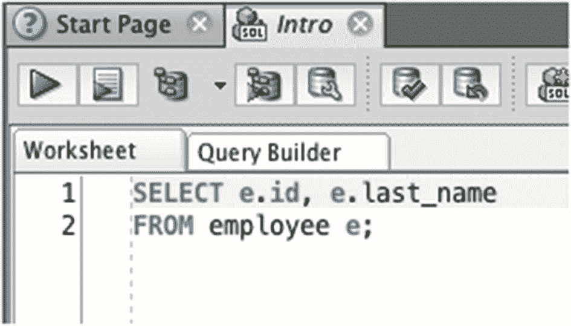

图 27-1 Oracle SQL Developer

另一种运行这些查询的方法是使用 `LiveSQL`，这是 Oracle 基于网页的 SQL 编辑器。你可以使用在 Oracle 网站上为此工具创建的账户来创建表和运行查询。但是，这仅适用于你在 `LiveSQL` 中创建的表，无法用它来连接你自己计算机上的数据库。

还有第三种运行 SQL 的方法，那就是使用 `命令行`。`命令行` 是指每个操作系统上都有的一个工具，它允许你仅使用文本来运行命令。

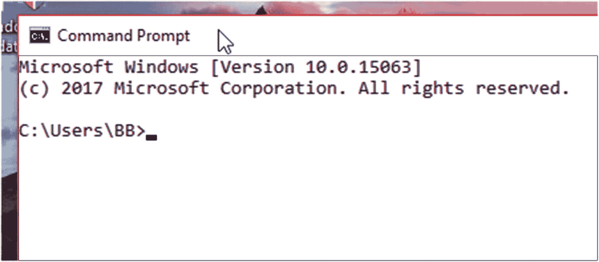

图 27-2 Windows 上的命令行

### 什么是 `SQL*Plus` 以及为何要使用它？

`SQL*Plus` 是 Oracle 提供的一个命令行工具。它随 Oracle 快捷版（即你在本书前面下载的版本）以及 Oracle 完整版一起提供。`SQL*Plus` 允许你连接到 Oracle 数据库并运行查询。

如果它是一个基于文本的工具，为什么你想使用它而不是像 `SQL Developer` 这样完整的用户界面呢？有几个原因。

**它速度快**

`SQL*Plus` 工具相当快。它是一个小巧但功能强大的工具。与 `SQL Developer` 等 IDE 相比，它的加载和运行速度更快。当然，它的功能较少，也不能点击按钮，但它启动非常快，非常适合运行查询。

和许多软件工具一样，你用得越多，使用效率就越高。过一段时间后，你会开始更熟练地使用 `SQL*Plus`。许多软件开发人员在开发工作中更喜欢使用 `vim` 和 `emacs` 这样的基于文本的编辑器，原因就是：速度快。

**易于运行脚本**

脚本是包含一组 SQL 语句的文件。在 `SQL*Plus` 中运行它们非常容易。在 `SQL Developer` 中，你需要浏览计算机上的目录来打开文件。而在 `SQL*Plus` 中，你可以复制粘贴或输入文件路径来运行它。

**每个 Oracle 数据库都可用**

`SQL*Plus` 的另一个优点是它随每个 Oracle 数据库一起提供。无论你运行的是 Oracle 快捷版还是完整版，你都可以使用 `SQL*Plus` 并用它来执行 SQL 命令。

**你并非总能访问 `SQL Developer`**

虽然 `SQL Developer` 是一个免费应用程序且无需安装过程，但在你的工作场所你可能无法使用它。在我进入这个行业的第一份工作中，我们使用一个名为“PL/SQL Developer”的工具，这是一个与 `SQL Developer` 类似的付费应用程序。这意味着我们没有使用 `SQL Developer` 来运行查询，因此我和我的团队所养成的任何与 `SQL Developer` 相关的习惯或技巧都无法使用。

你可能无法访问 `SQL Developer` 的另一种情况是在客户现场。有些人的工作需要经常拜访不同的客户，无法在客户的站点安装软件。这意味着他们将不得不使用 `SQL*Plus`，而不是 `SQL Developer`。

### 如何启动 `SQL*Plus`

要启动 `SQL*Plus`，你需要打开一个命令窗口。这些步骤将假设你在 Windows 上运行 Oracle，但对于其他操作系统，步骤也类似。`SQL*Plus` 随你在本书开头安装的 Oracle Express 一起提供。

1.  点击“开始”菜单，输入“`cmd`”，打开命令提示符。

    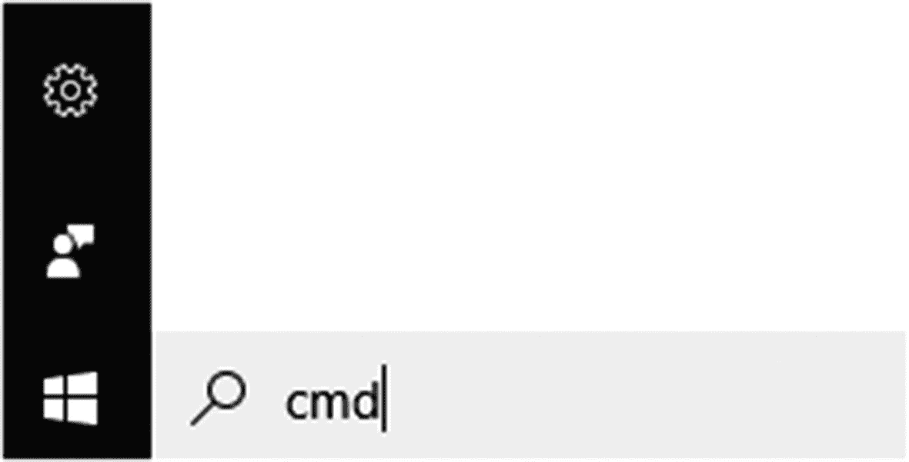

    图 27-3 运行 `cmd` 命令

    如果你使用的是旧版 Windows，可能需要点击“开始”，然后点击“运行”，再输入“`cmd`”。

2.  按回车键。命令窗口现已打开。

    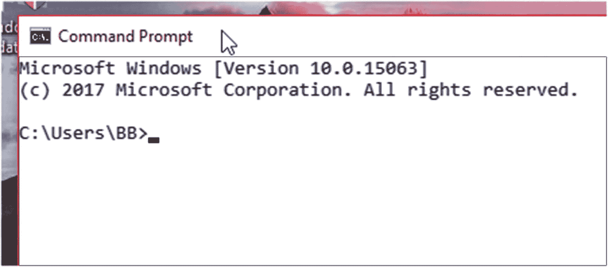

    图 27-4 Windows 命令窗口

3.  输入命令 `sqlplus` 并按回车键。

    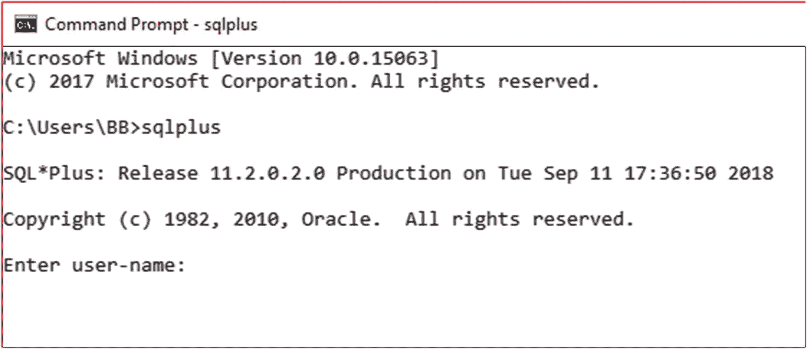

    图 27-5 运行 `sqlplus`

4.  输入你的 `用户名` 并按回车键。这可以是 `system` 用户名，或者是你在本书前面设置的 `用户名`。
5.  输入你的 `密码` 并按回车键。如果你使用的是 `system` 账户，这就是你在安装 Oracle Express 时以及在本书前面设置 `SQL Developer` 连接时输入的同一个 `密码`。如果你使用的是你创建的用户，则在此输入他们的 `密码`。

    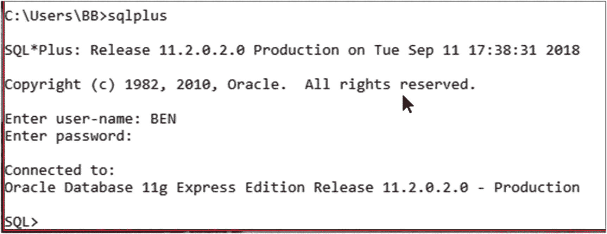

    图 27-6 登录到 `SQL*Plus`

你现在已登录到 `SQL*Plus` 和你的数据库。

**注意**

你的输出将包含 Oracle 18c 版本（与此处截图中提到的 11 版不同）。

### 其他登录语法

在登录 `SQL*Plus` 时，还有其他方式可以输入你的 `用户名` 和 `密码`。这些方法用于个人偏好或作为更快的登录方式。要使用这些其他方法：

**两步登录法**

你可以分两步登录到你的数据库：在启动 `sqlplus` 时将 `用户名` 作为参数指定，然后单独输入 `密码`。

1.  按照前面步骤所述打开命令窗口。
2.  输入 `sqlplus 用户名`，其中 `用户名` 是你要登录的用户的名字，然后按回车键。

    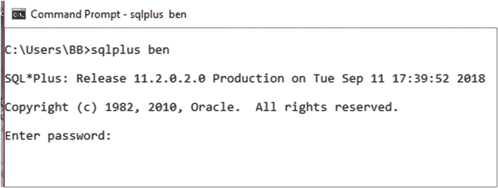

    图 27-7 以不同方式登录 `SQL*Plus`
3.  输入此用户的 `密码`，然后按回车键。

你现在已登录到你的数据库。


### 一步登录

你也可以一步登录到你的数据库，即将用户名和密码作为参数指定给 `sqlplus` 命令。

1.  如前面的步骤所述，打开命令窗口。
2.  输入 `sqlplus username password`，其中 `username` 是你想登录的用户名，`password` 是该账户的密码，然后按回车键。

    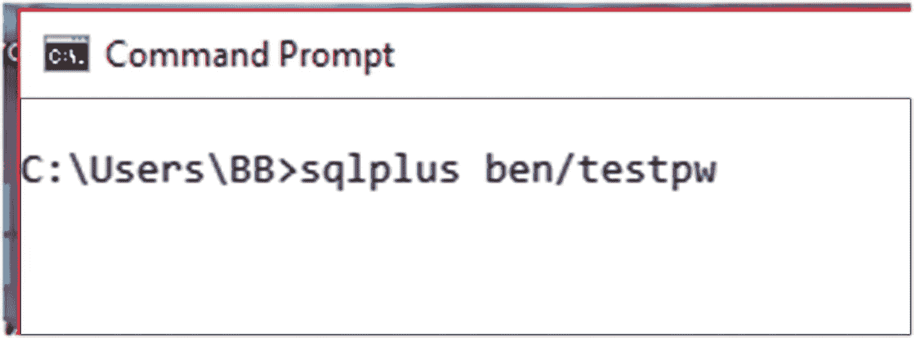

    图 27-8

    以不同方式登录 SQL*Plus

现在你已经登录到你的数据库了。

### 在 SQL*Plus 中运行查询

要在 SQL*Plus 中运行查询，只需在登录后于提示符后键入查询。例如，要从 `employee` 表中选择所有记录，请输入此查询：

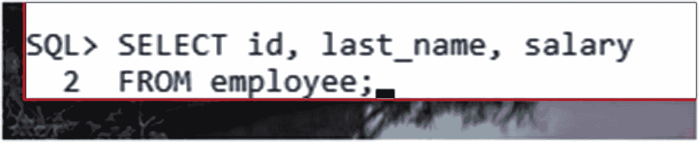

图 27-9

SQL*Plus 中的一个 SELECT 查询

```sql
SELECT id, last_name, salary
FROM employee;
```

在编写查询时，你可以按回车键换行。只有当你输入分号并按回车键时，查询才会运行。这意味着你可以随时添加新行，例如为每个 SQL 关键字或每列单独一行。

在此查询后输入分号，然后按回车键。查询的结果就会显示出来。

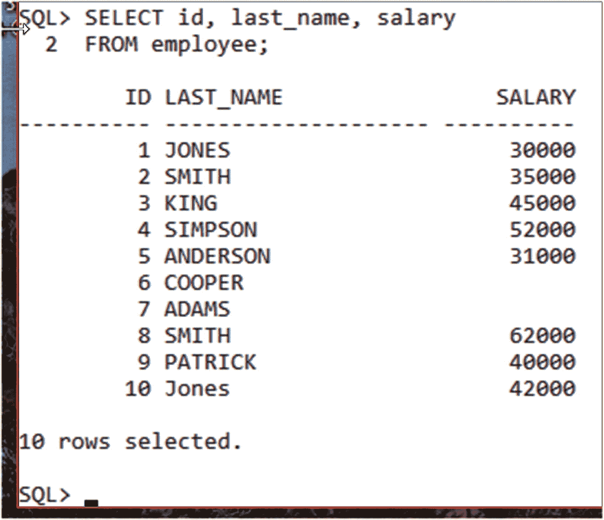

图 27-10

运行 SELECT 查询

你可以在提示符处按向上和向下箭头键来循环查看之前的查询。这使得查看最近的查询并对其更改变得容易。如果在空提示符处按向上箭头，它将显示最后一个查询。

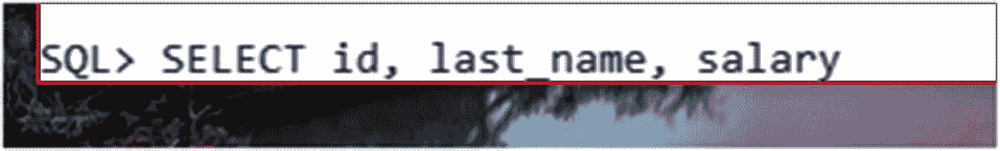

图 27-11

最近的 SQL 语句

SQL*Plus 还为你的查询提供了一个光标。你可以使用方向键移动光标，并在运行查询前对其进行编辑。例如，你可以通过将光标移动到查询末尾并键入 `ORDER BY last_name ASC;` 来为此查询添加一个 `ORDER BY` 子句。

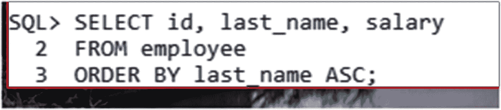

图 27-12

修改 SQL 查询

按回车键运行查询，结果就会显示出来。

### 在 SQL*Plus 中格式化输出

你可能已经注意到在 SQL*Plus 中运行这些查询时，输出看起来不太整洁。这是因为与 SQL Developer 不同，这里的每列宽度是根据该列可能包含的字符数来设定的，而非实际字符数。这意味着你会在列中看到很多空格，并且行会跨多行显示。

例如，在 `employee` 表上运行我们的 `SELECT` 查询看起来像这样：

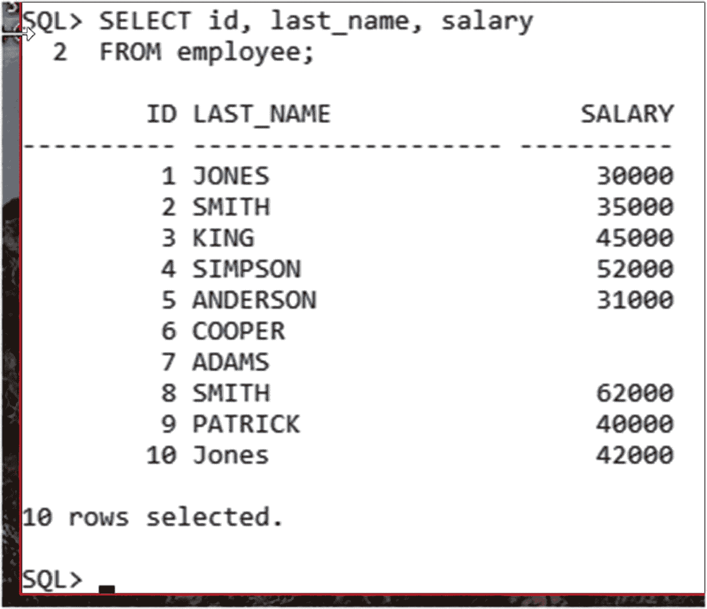

图 27-13

SELECT 查询的输出

```sql
SELECT id, last_name, salary
FROM employee;
```

然而，我们可以清理这个输出，使其更具可读性。我们可以在 SQL*Plus 中运行命令来格式化列。这个命令的语法如下：

```sql
column column_name format value;
```

这个命令的一个例子是：

```sql
column last_name format a10;
```

这指定了 `last_name` 列应格式化为宽度为 10 个字符的字母数字字段。我们在 SQL 查询之前运行此命令。

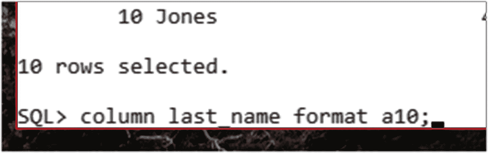

图 27-14

格式化列

然后，你可以再次运行 SQL 查询。按几次向上箭头键重新加载该查询，然后按回车键。

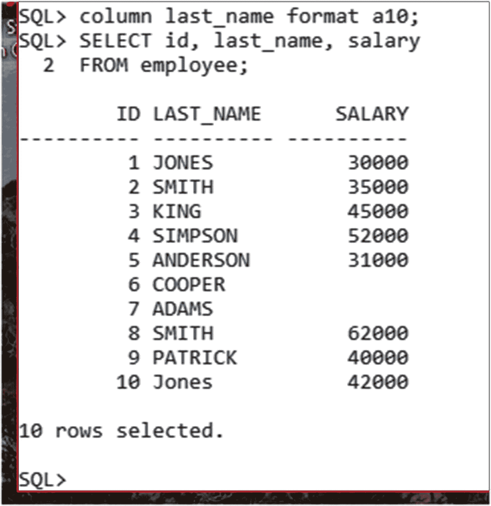

图 27-15

SELECT 语句的格式化输出

现在输出整洁多了。如果仍然太窄，你可以用一个更大的数字重新运行该命令（例如，`column last_name format a40`），然后重新运行 `SELECT` 查询。

### 复制并粘贴到 SQL*Plus 中

SQL*Plus 允许你输入并运行查询。然而，你可能会发现在文本编辑器中编写查询然后复制粘贴到命令行中更容易。这在 SQL*Plus 中是可以做到的。操作如下：

1.  在文本编辑器（如 Notepad++ 或 Sublime Text）中输入你的查询。
2.  从文本编辑器中复制你的查询。
3.  打开 SQL*Plus，在提示符处右键单击，然后选择“粘贴”。查询现在将显示在 SQL*Plus 中。
4.  按回车键运行查询。

查询结果随后将被显示出来。

### 斜杠字符

有时查看 SQL 代码时，你可能会在语句末尾看到斜杠字符 “/”：

```sql
SELECT id, last_name, salary, office_id
FROM employee
/
```

你会在网站上，或者在你当前或未来的雇主使用的脚本中看到这类例子。这意味着什么？如果已经有了分号，为什么还需要它？

在 SQL*Plus 中，分号字符将确保运行最近的语句。斜杠字符将运行缓冲区中的任何内容，这可以包含多个语句。如果你将前面的查询输入到 SQL*Plus 中（末尾是斜杠而不是分号）并运行该查询，你会得到相同的结果。

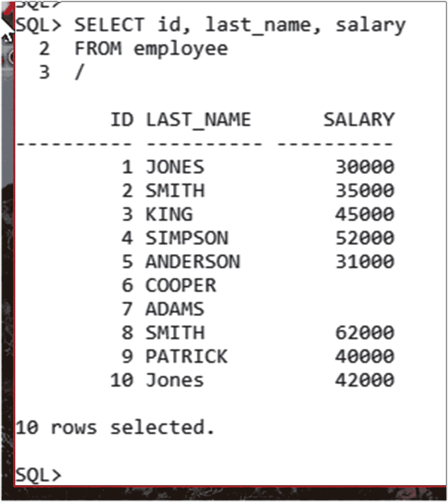

图 27-16

查询结果

你经常会在包含多个语句的脚本中看到斜杠字符。这意味着所有语句同时运行，而不是在语句之间暂停。

### 退出 SQL*Plus

如果你想随时退出 SQL*Plus，可以在 `sqlplus` 提示符下输入命令 `exit`。

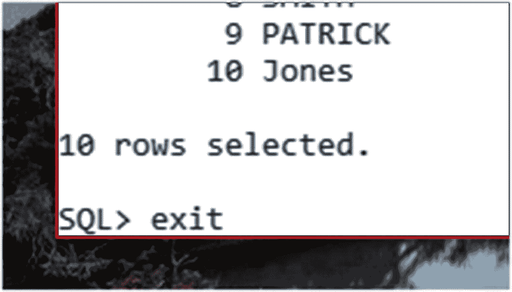

图 27-17

使用 exit 命令离开 SQL*Plus

按回车键，`sqlplus` 将退出。你会返回到命令提示符。

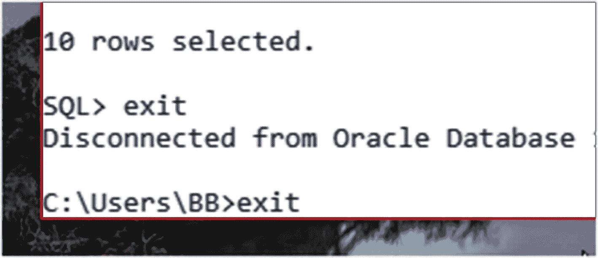

图 27-18

使用 exit 命令离开命令提示符

然后你可以再次输入 `exit` 并按回车键，命令提示符将会退出。

### SQLcl 怎么样？

SQL*Plus 自 20 世纪 80 年代中期就已存在，这在软件世界是很长的时间了。在此期间的大部分时间里，其功能基本保持标准。最近，Oracle 发布了一个新的免费命令行工具，称为“SQLcl”，即 SQL Command Line 的缩写。这是一个命令行工具，操作上与 SQL*Plus 类似，但功能要多得多。SQLcl 允许你：

*   与数据库交互（运行 SQL 查询）
*   运行批处理脚本
*   编辑 SQL 代码
*   语句补全
*   以及更多功能

然而，与 SQL*Plus 不同，SQLcl 不会随 Oracle 数据库自动安装。不过，你可以轻松地从 Oracle 网站下载它。


### 如何下载与运行 SQLcl

您可以从 Oracle 网站下载 SQLcl。具体步骤如下：

1.  访问 Oracle 网站并导航至 **开发者工具 ➤ SQLcl**。您可以从 [`www.oracle.com`](http://www.oracle.com) 进行操作，或直接访问页面：[`www.oracle.com/technetwork/developer-tools/sqlcl/downloads/index.html`](http://www.oracle.com/technetwork/developer-tools/sqlcl/downloads/index.html)。

    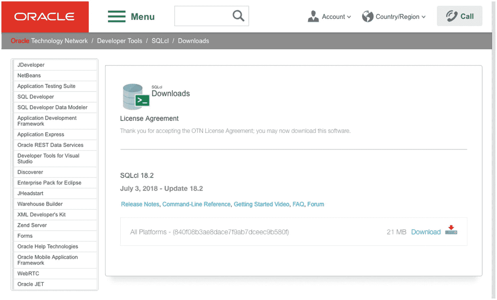

    图 27-19 SQLcl 下载页面

2.  接受许可协议。
3.  点击下载按钮。这是一个适用于所有操作系统的单一下载文件。
4.  下载 ZIP 文件后，将其解压缩到计算机上的某个位置。
5.  打开命令窗口（**开始 ➤ `cmd`**）。
6.  浏览到您解压缩文件的位置。例如，可以使用命令 `cd c:\oraclexe\sqlcl\` 完成此操作。

    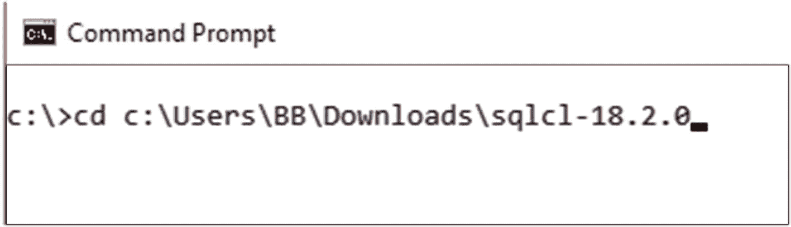

    图 27-20 切换到新目录

7.  浏览到 bin 文件夹：`cd bin`

    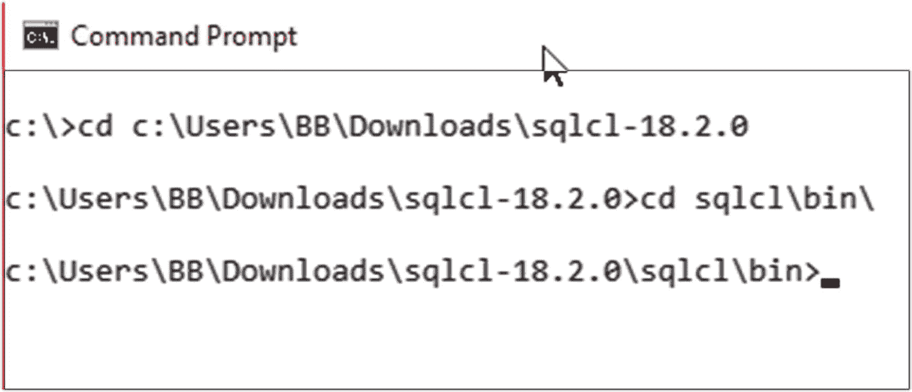

    图 27-21 切换到 bin 目录

8.  运行 `sql` 命令。SQLcl 随即启动。

    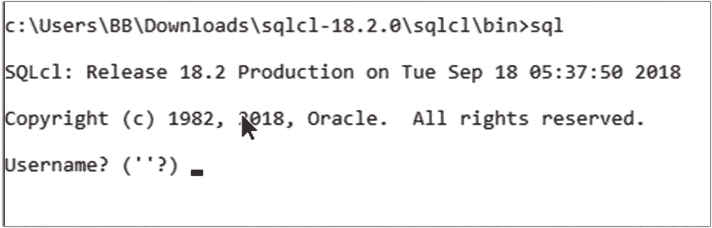

    图 27-22 运行 SQLcl

9.  SQLcl 启动后，您需要连接到数据库。您可以在输入 `sqlcl` 后出现的提示符处执行此操作。输入您的用户名和密码。
10. 按 Enter 键，即可建立数据库连接。您的屏幕应如下所示：

    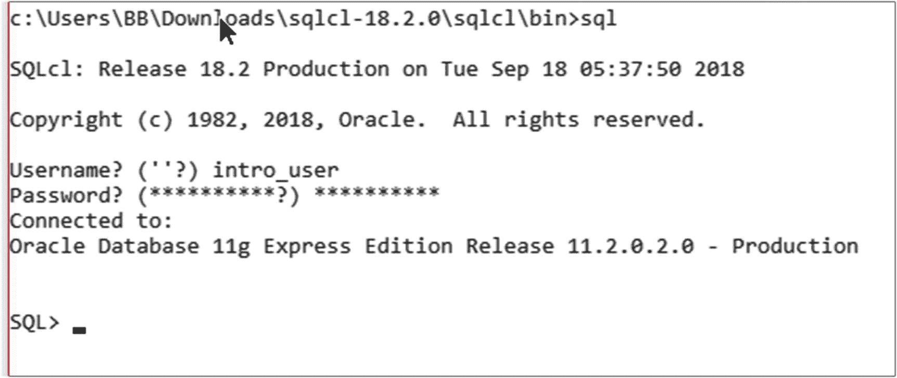

    图 27-23 登录到 SQLcl

然后，您可以像使用 SQL*Plus 一样，使用 SQLcl 来运行 SQL 语句并查看输出。

### 总结

Oracle 提供了命令行工具，可用于在无需 SQL Developer 等图形工具的情况下访问数据库。最常见的工具是 SQL*Plus，它随每个 Oracle 数据库一同提供。另一个命令行工具是 SQLcl，这是一个较新的工具，可以从 Oracle 网站下载。

使用命令行工具而非图形工具有几个原因，例如运行速度更快、您可能并非总能访问 SQL Developer，以及 SQL*Plus 在所有 Oracle 数据库上都可用。

