# 第七部分 附录

## 如何查找和使用 Oracle SQL 参考手册

关于 Oracle SQL，有很多内容需要学习和记忆。我们在本书中学习了许多不同的关键字，例如：

*   `SELECT`
*   `INSERT`
*   `UPDATE`
*   `DELETE`
*   `CREATE TABLE`

我们还学习了一些不同的 SQL 函数，例如 `SUM` 和 `UPPER`。这些命令和函数中的每一个都有特定的语法，即其运行方式和接受的参数。这很容易忘记。

幸运的是，Oracle 为其数据库提供了在线参考或文档。其中包含了关于其所有命令和函数的详细信息，如果您忘记了其工作原理或用法，这是一个查找具体内容的绝佳方式。

### 查找 Oracle SQL 参考手册

要查找 Oracle 参考手册：

1.  访问 [`https://docs.oracle.com`](https://docs.oracle)。
2.  点击左侧的 **数据库**，然后点击 **Oracle Database**。

    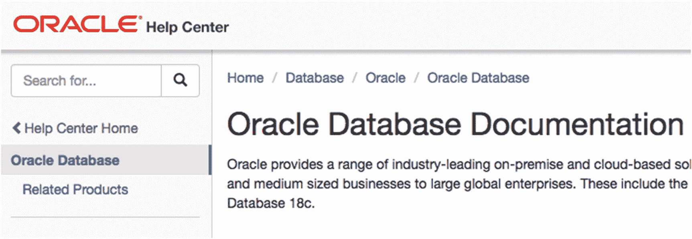

    图 A1-1 Oracle 数据库文档链接

3.  点击 **主题** 下的 **开发**。

    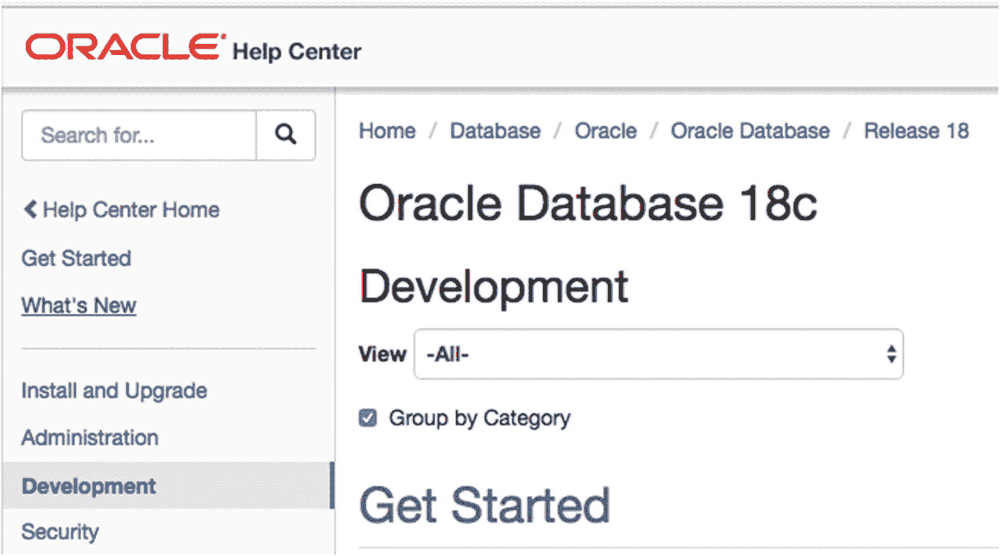

    图 A1-2 **开发** 链接

4.  向下滚动到 **SQL 和 PL/SQL** 部分，然后点击 **SQL 语言参考** 下的 HTML 链接。您也可以点击 PDF 链接来下载 PDF 文件以供离线查看。

    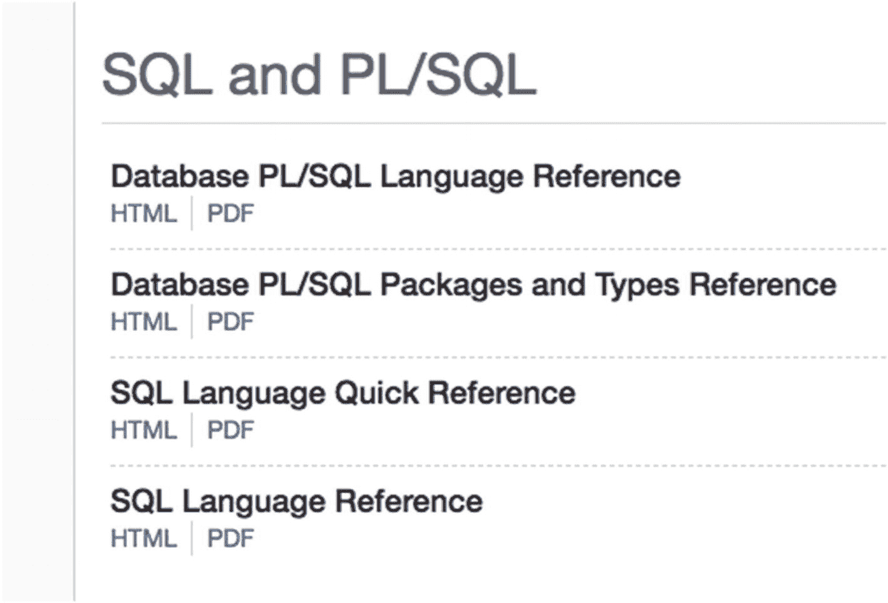

    图 A1-3 SQL 语言参考链接

### Oracle SQL 参考手册概览

Oracle SQL 参考手册如下所示。

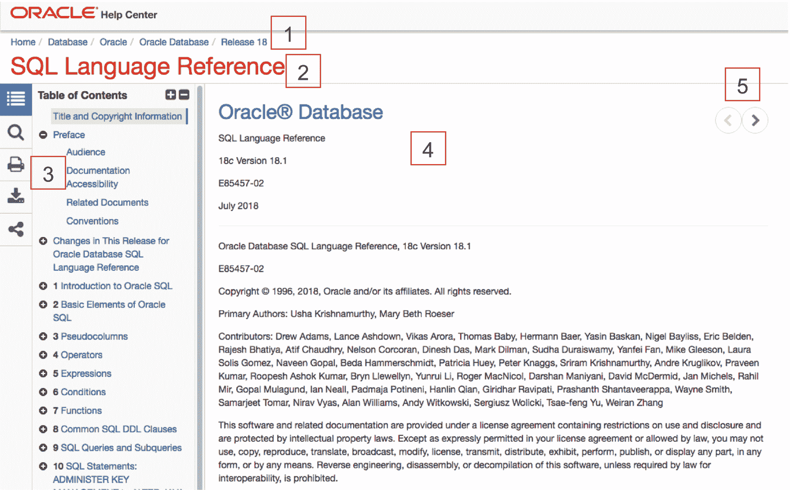

图 A1-4 SQL 语言参考手册

此页面包含几个不同的区域：

1.  **`面包屑导航`**。可用于在页面层次结构中上下导航。它还让您知道当前在文档中的位置，因为它会根据您所在的页面而变化。
2.  **`页面标题`**。这是您当前查看的页面的名称。
3.  **`侧边栏`**。其中包含目录，即指南包含的所有内容。您可以点击标题名称跳转到每个部分，或者点击适用的 + 图标来展开部分。此外，还有用于搜索、打印、下载和分享的按钮。
4.  **`主要内容`**。显示您当前查看页面的内容。
5.  **`导航箭头`**。点击左右箭头将带您进入参考指南的前一页和后一页。

### 使用目录查找所需内容

查找所需内容的一种方法是浏览并展开目录到相应的部分。例如，假设您正在查找有关如何使用 `SUM` 函数的信息。操作如下：

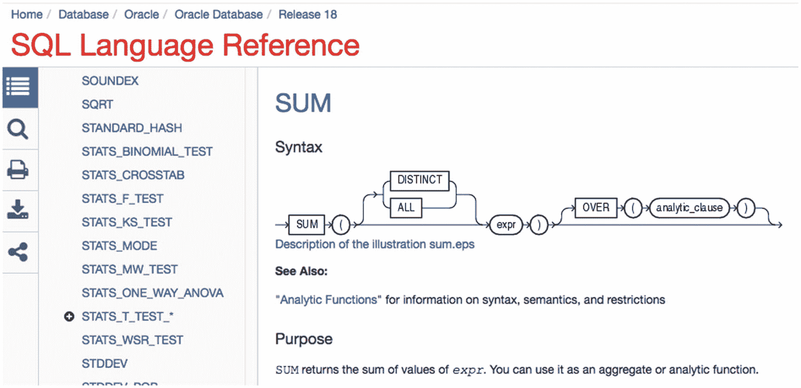

图 A1-8 `SUM` 参考页面

1.  点击目录中的 **函数** 链接。

    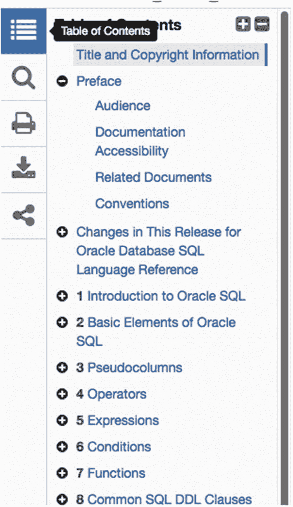

    图 A1-5 目录面板

2.  `SUM` 函数是一个聚合函数，因此点击此页面或目录中的 **聚合函数**。

    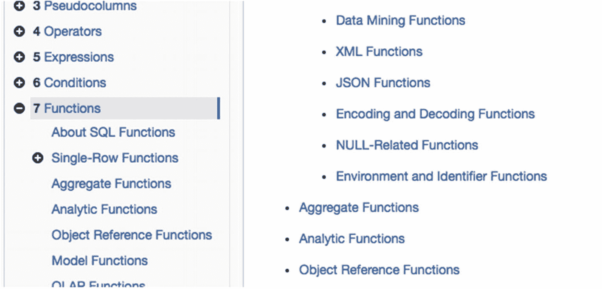

    图 A1-6 包含聚合函数的函数页面

3.  向下滚动并点击 `SUM`。

    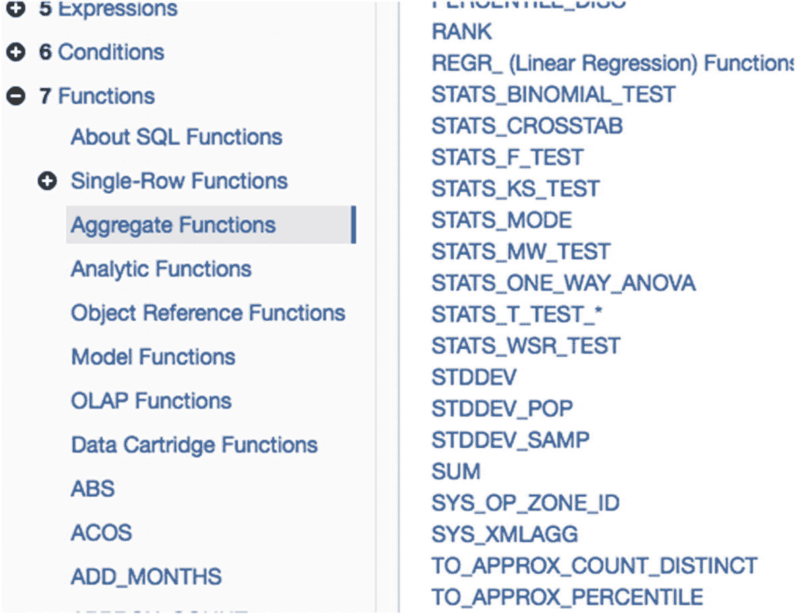

    图 A1-7 聚合函数列表

4.  `SUM` 参考页面如图 A1-8 所示。

### 使用搜索功能查找所需内容

查找所需内容的另一种方法是使用搜索功能。操作如下：

1.  点击侧边栏左侧的搜索图标（放大镜图标）。

    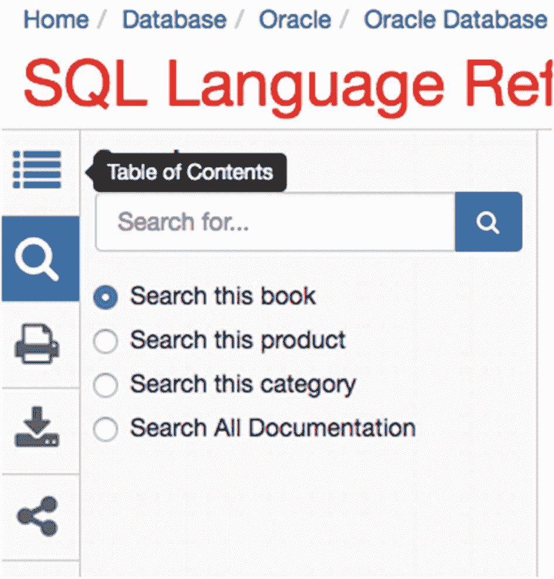

    图 A1-9 左侧边栏中的搜索框

2.  输入搜索词，例如 `SUM`，然后按 Enter 键。

    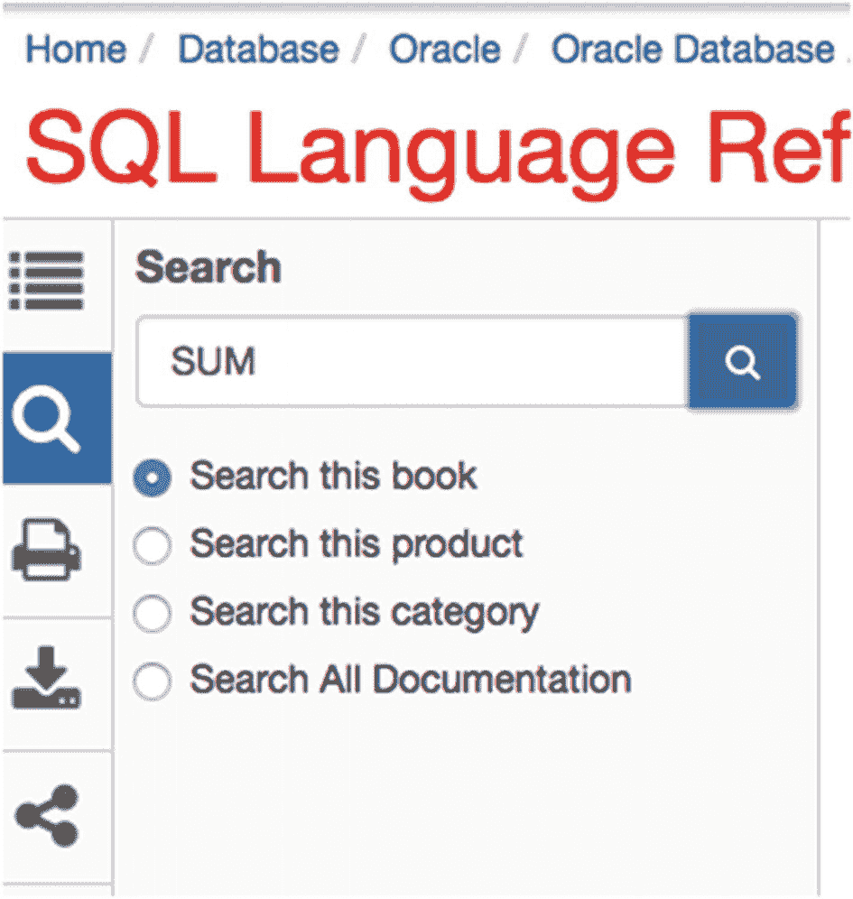

    图 A1-10 搜索 `SUM`

3.  搜索结果显示在新选项卡中，您的搜索词在每个结果中以粗体显示。

    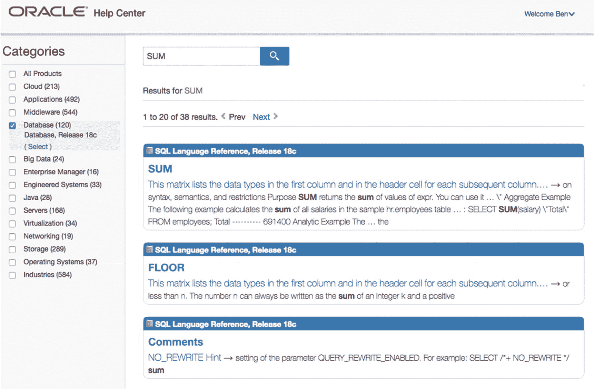

    图 A1-11 搜索结果

4.  点击与您要找的内容匹配的结果。在这种情况下，可能是第一个结果：`SUM` 页面。

### 索引

**A**

`ADD_MONTHS` 函数
聚合函数
`AVG` ( *参见* 平均值 (`AVG`) 函数)
`COUNT` 函数
`列`
`DISTINCT` 参数
`SUM` 函数
`WHERE` 子句
定义
`LOWER` 函数
`MAX` 函数
`records` 语法
`WHERE`
`MIN` 函数
`records` 语法
`WHERE` 子句
`SUM` ( *参见* `SUM` 函数)
任务

**ALTER TABLE** 语句
`CASCADE CONSTRAINTS`
`列`
`约束`
`数据类型`
`DROP TABLE`
`外键`
`主键`
`删除列`
`重命名列`
表结构
`重命名`

**AND** 关键字

**平均值 (`AVG`)** 函数
`所有` 值
`COUNT` 函数
`DISTINCT`
`SUM` 和 `COUNT` 函数
`WHERE` 子句

#### B

`BETWEEN` 运算符不匹配，值大于或等于且小于或等于（包含性和排他性检查语法），文本值，两个值，`BINARY_FLOAT` 数据类型，二进制大对象 (`BLOB`)

#### C

`CASE` 语句，`case_name`，条件，*参见* `DECODE` 函数，`ELSE`，函数表达式，函数，`OR` 关键字，参数，搜索式 `CASE` 语句，`SELECT` 查询，`UPPER` 函数，`WHEN` 子句，`WHERE` 子句，字符大对象 (`CLOB`)，列别名，`AS` 关键字，基础数学运算，加法，除法，乘法，减法，符号，查询与结果，姓氏，列选择，`FROM` 子句，多列，查询结果，`SELECT` 子句，`SELECT *` 的结果，选择单列，连接，下拉框，新工作表，编写的查询，`SELECT` 子句的结果，SQL 查询，工作表图标，语法，命令行查询，SQL*Plus（*参见* `SQL*Plus` 工具），窗口屏幕，`COMMIT` 语句，连接技术，条件逻辑操作，`CASE`（*参见* `CASE` 语句），`DECODE` 函数，函数语法，`IF-THEN-ELSE` 语句，参数，结果，`SIGN` 函数，`IF` 语句，`COUNT` 函数，列，`DISTINCT`，参数，`SUM` 函数，`WHERE` 子句

#### D

数据库，列，索引，查询，行，SQL，存储信息，表，供应商，数据类型，`BINARY_DOUBLE`，`BINARY_FLOAT`，`BLOB`，`CLOB`，`DATE`，`DECIMAL`，`FLOAT`，`INTEGER`，`INTERVAL DAY TO SECOND`，`INTERVAL YEAR TO MONTH`，`NUMBER`，排序数据，建议，选择，存储的数据库，文本（*参见* 文本数据类型），`TIMESTAMP LOCAL TIME ZONE`，`TIME ZONE`，`DECODE` 函数 *对比* `CASE` 语句，`IF-THEN-ELSE` 语句，参数，结果，`SIGN` 函数，语法，`DISTINCT` 关键字，`DROP TABLE` 语句，重复结果，添加新记录，数据，`DISTINCT` 选择，唯一组合，姓氏值，薪水值

#### E

提取、转换、加载 (ETL)

#### F

筛选器，`BETWEEN` 运算符（*参见* `BETWEEN` 运算符），`IN` 关键字（*参见* `IN` 关键字），值范围，`FLOAT` 数据类型，外键，函数，`+` 加法，连接，数据操作，日期，`ADD_MONTHS` 函数，计算，当前日期和时间，`SYSDATE` 函数，`DUAL` 表，数字，`CEILING` 函数，`FLOOR` 函数，`FUNCTIONNAME()`，`MOD` 函数，`ROUND` 函数，数字计算，`/` 除法，`*` 乘法，`-` 减法，符号，过程流，字符串（*参见* 字符串函数），用法

#### G

`GROUP BY` 关键字，`COUNT` 函数，重复记录，分组数据，`HAVING` 子句，连接，`MAX`、`MIN`、`AVG` 和 `SUM` 函数，`office_id`，限制结果，结果，`SELECT` 查询，`SUM`，警告消息，`WHERE` 子句

#### H

`HAVING` 子句

#### I

索引，`CREATE` 语句，`COOPER` 语句，`idx_emp_lname`，`last_name` 列，结果，`SELECT` 查询，SQL 代码，语法，`WHERE` 子句，创建，缺点，连接创建，查询，隔夜批处理作业，报告系统，教科书查询，Web 应用程序，`IN` 关键字，`AND` 子句，`AND/OR` 子句，`LIKE` 关键字，更长的值列表，查询文本值，内连接，`customer_meeting`，数据定义，格式化与表别名，`INNER` 关键字，连接多个表，结果，`SELECT` 查询，`INSERT` 语句，列，日期值，`COMMIT` 和 `ROLLBACK`，数据库 (Oracle Express)，日期格式，错误消息，输出错误消息，查询的输出，选择，`SELECT` 语句，SQL Developer，两条记录，`VALUES` 关键字，窗口，`INTEGER` 数据类型，智能感知/自动完成，自动完成选项，查询 SQL 窗口，表别名

#### J, K

Java 开发工具包 (JDK)，下载，连接，`GROUP BY` 子句，索引创建查询，连接表，四张或更多表，混合连接类型，外连接类型，查询连接，`sales_meeting` 记录，三张表，连接类型，交叉连接，笛卡尔积，员工，查询语法，灵活意图，内连接，连接语法，自然连接，员工和办公室表，消息输出，结果，语法，`USING` 连接，办公室表，外连接，减少错误，`UPDATE` 语句，`USING` 关键字，员工和办公室表，消息输出，`ON` 关键字，结果

#### L

`LIKE` 关键字，性能，LiveSQL，`CREATE TABLE` 查询，数据库对象窗口，数据类型，主页，登录，架构窗口，SQL 工作表，表窗口，`LOWER` 函数

#### M

`MAX` 函数，`MIN` 函数，多个筛选器，`AND` 关键字，超过两个条件，`AND` 条件 *对比* `AND` 和 `OR` 条件，`OR` 条件，特定顺序，`WHERE` 子句，`OR` 关键字，大于/小于，姓氏/薪水，`WHERE` 子句

#### N

空值，数据，更改提交按钮，员工表数据，输入数据，插入行按钮，新行，保存选项，表名定义，隐藏值，缺失数据，多个查询，`ORDER BY`，记录选择，限制数据，单个查询处理，`NUMBER` 数据类型

#### O

运算符，Oracle Express/Oracle Database XE，数据库功能，下载页面，历史记录，安装，语言和工具部分，菜单选项，Oracle 账户屏幕，资源部分，登录/账户创建，Windows 和 Linux 版本，Mac 用户，虚拟机，Oracle SQL，面包屑导航，内容，关键字，导航箭头，页面标题，参考，搜索功能，结果，搜索图标，`SUM`，侧边栏，目录，Oracle SQL Developer，连接创建，新用户创建步骤列表，成功消息窗口，不同选项，下载按钮，插入数据链接，新用户创建，授予的角色选项卡菜单选项，成功消息窗口，系统特权选项卡窗口，创建 `SELECT`（*参见* `SELECT` 语句），表创建，添加条目，列，数据类型，编辑选项，菜单选项，步骤，运行语句，版本，网站，排序数据，多列，`ORDER BY`，列表达式，`NULLs`，数字，数值，`SELECT` 子句，语法，文本值，排序结果，`SELECT` 查询，`OR` 关键字，外连接，完全外连接，基础，`JOIN` 关键字，左外连接，员工查询，图形表示，`ORDER BY` 结果，维恩图，右外连接，员工记录，`NULL` 值，查询输出结果，维恩图，类型

#### P, Q

部分匹配

#### R

报告系统，限制数据，`ROLLBACK` 语句，`ROUND` 函数

#### S

搜索式 `CASE` 语句，`SELECT` 语句，星号字符 (`*`)，错误，缺少关键字，表不存在，`FROM` 关键字，小写函数，模式/语法，结果，运行脚本，SQL Developer，连接面板，查询选项，结果，行号，运行按钮，步骤，工作表，SQLcl，目录，下载页面，功能，已登录，`SQL*Plus` 工具，访问，SQL Developer，`cmd` 命令，命令窗口，复制和粘贴，退出命令，快速工具，格式化输出，正斜杠字符 “/”，登录语法，Oracle 数据库查询，运行，`ORDER BY SELECT` 查询，SQL 语句，运行脚本，SQLcl（*参见* `SQLcl`），`sqlplus` 命令，基于文本的，字符串函数，更改大小写，`LOWER` 函数，匹配检查，字符串值，`SUBSTR` 函数，子字符串，大写和小写，`UPPER` 函数，结构化查询语言 (SQL)，`SUM` 函数，`DISTINCT` 关键字，员工表，表达式，`NULL` 值，参数，`WHERE` 子句，`SYSDATE` 函数

#### T

表别名，`FROM` 子句，较长查询，智能感知/自动完成（*参见* 智能感知/自动完成），用法，表创建，`CREATE TABLE` 语句，数据库设计/关系数据库设计，员工表，外键，规范化，办公室表，`CREATE TABLE` 语句，错误消息，表创建，主键，`sales_meeting` 表，SQL 代码，存储办公室详细信息，文本数据类型，`CHAR`，`LONG`，`LONG RAW`，`NCHAR`，`NVARCHAR2`，`RAW`，Unicode 字符，`VARCHAR2`，`TIMESTAMP WITH LOCAL TIME ZONE` 数据类型，`TIMESTAMP WITH TIME ZONE` 数据类型，`TO_CHAR` 函数

#### U, V

`UPDATE` 语句，`ALTER SESSION` 命令，列，日期值，删除选项，`DELETE` 语句，现有值，`nls_session_parameters`，`NULL` 值，查询，移除数据，运行值，`SELECT` 和 `INSERT` 语句，表结构，表值，`WHERE` 子句，`USING` 关键字

#### W, X, Y, Z

`WHERE` 子句，左侧列，大于，大于/等于，小于，小于/等于，数值，行，不等于，值，`SELECT` 子句，SQL 关键字，文本值，通配符字符，结果，搜索选项，“%” 符号，下划线字符，值，`WHERE` 子句

