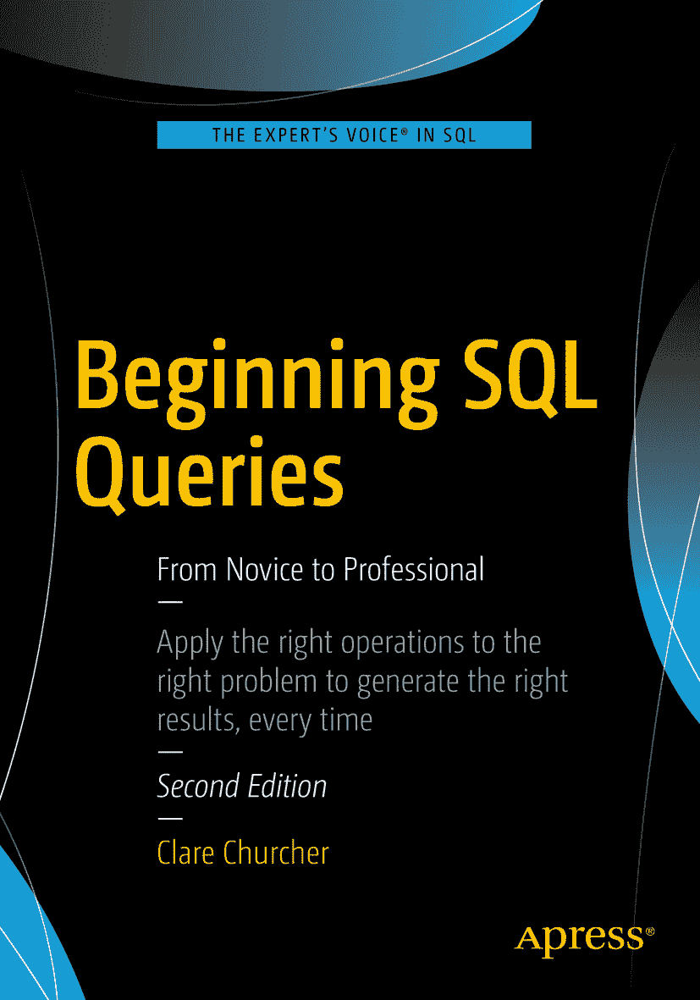

 Clare Churcher SQL 查询入门：从新手到专家 第 2 版. 2016

作者在本书中引用的任何源代码或其他补充材料，读者均可从 [`www.apress.com`](http://www.apress.com) 获取。有关如何查找本书源代码的详细信息，请访问 [`www.apress.com/source-code/`](http://www.apress.com/source-code/).

ISBN 978-1-4842-1954-6
e-ISBN 978-1-4842-1955-3
DOI 10.1007/978-1-4842-1955-3
美国国会图书馆控制号: 2016944320
© Clare Churcher 2016
SQL 查询入门
董事总经理: Welmoed Spahr
主编: Jonathan Gennick
技术审校: George Anderson
编辑委员会: Steve Anglin, Pramila Balen, Louise Corrigan, Jonathan Gennick, Robert Hutchinson, Celestin Suresh John, Nikhil Karkal, James Markham, Susan McDermott, Matthew Moodie, Ben Renow-Clarke, Gwenan Spearing
协调编辑: Jill Balzano
文案编辑: April Rondeau
排版: SPi Global
索引: SPi Global
美术设计: SPi Global

有关翻译事宜，请发送电子邮件至 `rights@apress.com`，或访问 [`www.apress.com`](http://www.apress.com)。

Apress 和 friends of ED 的图书可批量购买用于学术、企业或促销用途。大多数图书也提供电子书版本和许可。更多信息，请参考我们的批量销售-电子书许可网页 [`www.apress.com/bulk-sales`](http://www.apress.com/bulk-sales)。

本书受版权保护。出版者保留所有权利，无论涉及材料的全部或部分，具体包括翻译权、转载权、插图再利用权、朗诵权、广播权、缩微胶片或其他物理方式的复制权，以及信息存储与检索、电子改编、计算机软件方面的传播权，或现今已知或未来开发的任何类似或不同的方法。商标名称、标识和图像可能出现在本书中。我们并非在每次出现商标名称、标识和图像时都使用商标符号，而仅在编辑需要且对商标所有者有利的情况下使用这些名称、标识和图像，并无侵犯商标权的意图。本书中使用的商品名称、商标、服务标识和类似术语，即使未特别标识，也不应被视为表达其是否受专有权约束的意见。尽管本书中的建议和信息在出版时被认为是真实和准确的，但作者、编辑和出版商均不对可能存在的任何错误或遗漏承担任何法律责任。出版商对本出版物所含材料不作任何明示或暗示的保证。

使用无酸纸印刷

本书通过 Springer Science+Business Media New York 发行至全球图书贸易市场，地址：233 Spring Street, 6th Floor, New York, NY 10013。电话 1-800-SPRINGER，传真 (201) 348-4505，电子邮件 orders-ny@springer-sbm.com，或访问 www.springer.com。

Apress Media, LLC 是一家位于加利福尼亚州的有限责任公司，其唯一成员（所有者）是 Springer Science + Business Media Finance Inc (SSBM Finance Inc)。SSBM Finance Inc 是一家特拉华州公司。

献给 Mark 和 Ali

#### 引言

### 概述

SQL 的语法相当容易学习。掌握一些基本思路和少量关键词，你就能应对各种各样的查询。然而，许多用户在面对特定问题时，常常发现自己完全不知所措。如果有人说“我会这样做”，这其实并没有太大帮助。你需要的是多种方法来处理棘手的问题。一旦你开始着手一个查询，就需要能够检查、修改和完善你的解决方案，直到获得所需的结果。

#### 双管齐下的方法

在整本书中，我从两个方向来处理不同类型的查询。这两种方法植根于形式化的关系代数和演算。在正文中，我保持了描述的非数学性，不过附录 2 为那些热衷于理解基础理论的读者介绍了形式化符号。

第一种方法，我称之为**过程导向法**，着眼于为了检索所需的数据子集，需要对表进行哪些操作。你会发现对可对表执行的不同类型操作的解释；例如，连接、交集、选择。书中提供了说明，以帮助你在特定情况下决定哪些操作可能有用。一旦你理解了需要哪些操作，将它们转换成 SQL 就相对直接了。

第二种方法是我在完全想不出哪些操作能得到所需结果时使用的。这种方法，我称之为**结果导向法**，让你描述预期结果行可能是什么样的——即它必须满足什么条件。通过观察数据，出乎意料地容易就能对什么是“正确”的检索行（并由此推及如何识别“错误”的行）形成一个半形式化的描述。将这个半形式化的描述转换成可工作的查询也很直接。

面对一个新问题时，我的学生会选择哪种方法，总是让我感到惊讶。有些人能立即看出需要的操作，而另一些人会觉得结果导向法更直观。方法的选择因查询而异，因人而异，并且（我怀疑）也因时而异。拥有不止一种入门方法意味着你不太可能被一个新问题完全难住。

#### 本书适合谁？

本书适合任何拥有设计良好的关系数据库并需要从中提取信息的人。你可能已经注意到前一句话中的“设计良好”这个前提。这一点我无法过分强调。如果你的数据库设计糟糕，它将无法存储准确和一致的数据，因此你的查询检索到的信息也总会存在不准确的风险。如果你想从头开始设计数据库，你应该阅读我的第一本书 `Beginning Database Design`。¹

本书的最后一章将概述你可能遇到的一些常见设计问题，并就如何减轻影响或纠正问题提供一些建议。

#### 本书目标

在本书中，你将接触到创建 SQL 查询所需的所有主要技术和关键词。你将了解连接、交集、并集、差集、行选择和列投影。你将看到如何使用简单查询和嵌套查询以不同方式实现这些思想，并将接触到多种用于聚合和汇总数据的技术，包括窗口函数的使用。你还将学习如何调查和提高查询的效率。

最重要的是，你将学习处理棘手问题的不同入门方法。表达一个查询几乎总是有几种不同的方式，我的目标是，对于任何特定情况，我都能为你提供一种符合你心理状态（和情绪）的进攻方法（开个玩笑）。

#### 第二版新增内容

我新增了一章专门讲解窗口函数，阐述了这些近期引入的概念如何为数据聚合与汇总提供功能性支持。

此外，本书还包含一个附录，旨在以易于理解的方式介绍形式化关系概念及其表示法。

致谢

首先，我要向我的丈夫内维尔（Neville）表达万分感谢，他通读了每一章节并提供了许多宝贵建议。我要特别感谢我的一位读者斯科特·劳利（Scott Lawley），他给予了我有益的反馈，并建议将“代数”与“演算”这两个术语分别替换为更为友好的“过程导向法”和“结果导向法”。感谢我的编辑乔纳森·詹尼克（Jonathan Gennick）促成了这第二版的出版，同时感谢吉尔·巴尔扎诺（Jill Balzano）出色的协调工作。我也要感谢我的雇主泰普蒂尼理工学院（Tai Poutini Polytechnic）给予的支持。

### 目录

## 第 1 章：关系型数据库概述
- 介绍数据库表 1
- 属性 2
- 主键 3
- 在表中插入和更新行 3
- 设计合适的表 5
- 介绍数据模型 6
- 从数据库中检索信息 9
- 过程式方法 10
- 结果导向式方法 11
- 为何要考虑两种方法 12
- 小结 13

## 第 2 章：单表简单查询
- 行与列的子集 15
- 使用别名 18
- 保存查询 19
- 指定选择行的条件 19
- 比较运算符 19
- 逻辑运算符 21
- 处理空值 23
- 查找空值 24
- 涉及空值的比较 24
- 管理重复行 25
- 对输出进行排序 28
- 执行简单计数 29
- 避免常见错误 29
- 错误使用 WHERE 子句回答包含“both”的问题 30
- 错误使用 WHERE 子句回答包含“not”的问题 32
- 小结 32

## 第 3 章：初识连接
- 连接的过程式方法 33
- 笛卡尔积 33
- 内连接 35
- 连接的结果导向式方法 36
- 扩展连接查询 38
- 一种过程式方法 39
- 操作顺序 41
- 一种结果导向式方法 42
- 通过图形化界面表达连接 43
- 其他类型的连接 44
- 外连接 45
- 小结 48

## 第 4 章：子查询
- IN 关键字 51
- 在子查询中使用 IN 52
- 谨慎使用 NOT 和 <> 54
- EXISTS 关键字 57
- 不同类型的子查询 60
- 返回单个值的内部查询 60
- 返回一组值的内部查询 62
- 检查存在性的内部查询 62
- 使用子查询进行更新 63
- 小结 64
- 不同类型子查询的示例 65
- 子查询不同用途的示例 66

## 第 5 章：自连接
- 自引用关系 67
- 创建自连接 70
- 涉及自连接的查询 71
- 自连接的结果导向式方法 76
- 涉及“both”的问题 79
- 涉及“both”问题的结果导向式方法 80
- 涉及“both”问题的过程式方法 81
- 小结 82
- 自引用关系 82
- 涉及“both”一词的问题 82

## 第 6 章：表间的多重关系
- 相同表之间的两种关系 85
- 从多重关系中提取信息 89
- 过程式方法 90
- 结果导向式方法 93
- 业务规则 94
- 小结 97

## 第 7 章：集合运算
- 基本集合运算概述 99
- 可进行并运算的表 101
- 确保并兼容性 104
- 并集 105
- 选择合适的列 106
- 并集的用途 108
- 并集与全外连接 109
- 交集 111
- 交集的用途 112
- 投影合适列的重要性 115
- 在没有 INTERSECT 关键字时处理交集 116
- 差集 118
- 差集的用途 118
- 在没有 EXCEPT 关键字时处理差集 121
- 除法 122
- 投影合适的列 124
- 用于除法的 SQL 125
- 小结 126
- 并集 127
- 交集 127
- 差集 127
- 除法 128

## 第 8 章：聚合操作
- 简单的聚合函数 129
- COUNT() 函数 129
- AVG() 函数 132
- ROUND() 函数 134
- 其他聚合函数 135
- 分组 135
- 过滤聚合查询的结果 140
- 使用聚合执行除法运算 142
- 嵌套查询与聚合 144
- 小结 146

## 第 9 章：窗口函数
- 简单聚合 147
- 分区 149
- ORDER BY 子句 150
- 累积聚合 150
- 排名 152
- 将排序与分区结合 153
- 窗口框架 156
- 小结 159
- OVER() 159
- OVER(PARTITION BY <…>) 159
- OVER(ORDER BY <…>) 159
- OVER(PARTITION BY <…> ORDER BY <…>) 159
- OVER(ROWS BETWEEN <…> AND <…>) 159

## 第 10 章：效率考量
- 查询会发生什么 161
- 查找记录 163
- 按顺序存储记录 163
- 聚集索引 164
- 非聚集索引 165
- 复合键上的聚集索引 166
- 更新索引 167
- 覆盖索引 168
- 索引的选择性 168
- 连接技术 168
- 嵌套循环 169
- 合并连接 170
- 连接的不同 SQL 表达式 171
- 小结 173
- 主键 173
- 外键 173
- WHERE 条件 173
- ORDER BY、GROUP BY 和 DISTINCT 173
- 使用工具 173

## 第 11 章：如何处理查询
- 理解数据 175
- 确定表之间的关系 175
- 现实世界与实现 178
- 涉及哪些表？ 180
- 查看一些数据值 180
- 宏观方法 181
- 合并表 181
- 找到行的子集 183
- 保留合适的列 183
- 考虑中间视图 184
- 识别问题中的关键词 184
- And、Both、Also 185
- Not、Never 187
- All、Every 188
- 不知从何开始？ 189
- 寻找有用的表 189
- 尝试手动回答问题 189
- 写下检索结果的描述 190
- 有替代方案吗？ 190
- 检查查询 191
- 检查应该返回的行 192
- 检查不应返回的行 192
- 检查边界条件 192
- 检查空值 193
- 小结 193

## 第 12 章：常见问题
- 糟糕的数据库设计 195
- 未规范化的数据 195
- 没有主键的表 198
- 缺少外键的表 199
- 两个表中的相似数据 199
- 不恰当的类型 200
- 数据值问题 201
- 意外的空值 201
- 错误或不一致的拼写 202
- 文本字段中的多余字符 202
- 文本字段中不一致的大小写 203
- 诊断问题 203
- 独立检查嵌套查询的各部分 204
- 理解表是如何组合的 204
- 移除多余的 WHERE 子句 204
- 保留所有列 204
- 检查聚合中的基础查询 205
- 常见症状 205
- 没有返回行 205
- 缺少行 205
- 行数多于预期 207
- 错误的统计信息或聚合 208
- 顺序错误 209
- 常见拼写错误和语法问题 209
- 小结 210

## 附录 1：示例数据库
- 附录 1：示例数据库 211

## 附录 2：关系符号
- 引言 213
- 关系、元组和属性 214
- SQL、代数与演算 216
- 关系代数：指定操作 216
- 选择 217
- 投影 218
- 组合选择与投影 218
- 笛卡尔积 219
- 内连接 220
- 并、差与交 221
- 除法 223
- 关系演算：指定结果 225
- 简单的演算表达式 225
- 自由变量与约束变量 225
- 存在量词与 SQL 226
- 全称量词与 SQL 228
- 一个例子 229
- 代数 229
- 演算 230
- 结论 231

### 速览目录
- 第 1 章：关系型数据库概述 1
- 第 2 章：单表简单查询 15
- 第 3 章：初识连接 33
- 第 4 章：子查询 51
- 第 5 章：自连接 67
- 第 6 章：表间的多重关系 85
- 第 7 章：集合运算 99
- 第 8 章：聚合操作 129
- 第 9 章：窗口函数 147
- 第 10 章：效率考量 161
- 第 11 章：如何处理查询 175
- 第 12 章：常见问题 195
- 附录 1：示例数据库 211
- 附录 2：关系符号 213

### 关于作者
- 关于作者 xv

### 关于技术审阅者
- 关于技术审阅者 xvii

### 致谢
- 致谢 xix

#### 引言
- 引言 xxi

#### 索引
- 索引 233

#### 脚注
- 脚注 1

Clare Churcher，*《数据库设计入门：从新手到专业人士》*（纽约：Apress 出版社，2012 年）。

