# 1. 关系数据库概述

电子补充材料 本章在线版本（doi:[10.1007/978-1-4842-1955-3_1](http://dx.doi.org/10.1007/978-1-4842-1955-3_1)）包含补充材料，可供授权用户使用。

SQL（结构化查询语言）使我们能够创建表、应用约束以及操作数据库中的数据。本书将重点介绍查询，这些查询通过描述我们所需数据的子集，使我们能够从数据库中提取信息。该数据可能是一个单独的数字（如产品价格）、一份订阅逾期的成员姓名列表，或是一个计算结果（如过去 12 个月售出产品的总金额）。在本书中，我们将研究不同的方法来构建查询，以便能用 SQL 正确地表达出来。

在深入探讨如何指定查询的具体细节之前，我们将回顾一些与关系数据库相关的想法和术语。我们还将了解数据模型，这是一种简洁描述特定数据库构建方式的方法，即数据存储在何处以及所有事物是如何相互关联的。

底层数据库的设计必须能够准确地表示它所处理的情况，这一点至关重要。这不仅意味着创建了合适的表，还意味着应用了适当的约束，以确保数据是一致的，并且随着数据库的发展保持一致。即使拥有世界上最精妙的 SQL，如果底层数据库设计有缺陷，你也无法获得准确的查询结果。如果你正在建立一个新数据库，在开始项目之前，应该参考一本设计书籍¹。

### 介绍数据库表

简单来说，关系数据库就是一组表²。在一个设计良好的数据库中，每个表保存关于某一事物的信息，例如客户、销售、团队或锦标赛。在本书中，我们将基于一个高尔夫俱乐部的数据库来构建大部分示例。这些表将随着讲解逐步引入，附录 1 提供了概览。

#### 属性

创建表时，我们需要指定它将保存哪些信息。例如，一个`Member`（成员）表可能包含姓名、地址和联系方式等信息。我们需要决定单个的数据项是什么。例如，我们可以选择将姓名信息分离为头衔、名、姓、首字母缩写和常用名。这种分离使我们能更灵活地使用数据。例如，我们可以将信件寄给 J. A. Stevens 先生，并在消息开头称呼他为 Jim。这些独立的信息片段就是表的属性。

要定义一个属性，我们需要提供一个名称（例如，`FamilyName`（姓氏）、`Handicap`（差点）或`DateOfBirth`（出生日期））以及一个域或类型。域是一组允许的值，它可能非常笼统，也可能相当具体。例如，存储日期的列的域可能是任何有效日期（因此只有在闰年才允许 2 月 29 日），而存储数量的列的域可能是大于 0 的整数值。我们最初可能认为`FamilyName`属性的域可以是任何字符串，但仔细考虑后，我们需要考虑是否允许某些标点符号（可能允许）、是否允许数字（很难说）以及是否应该有最小或最大长度。所有数据库系统都有内置的域或类型，如`text`（文本）、`integer`（整数）或`date`（日期），可以为表中的每个字段选择。更复杂的产品允许用户定义自己的类型，这些类型可以在跨表使用。例如，我们可以定义一个名为`CarRegistration`（车牌号）的类型，它有一个预定义的字母和数字模板。即使不能定义自己的类型，所有优秀的数据库系统都允许设计者在表中为特定属性指定约束。例如，在某个特定表中，我们可能指定出生日期是过去的日期，或者差点在 0 到 40 之间。某些属性可能允许为空，而其他属性则可能要求必须有值。

当我们查看表时，属性的名称是列标题，而域或类型提供了允许的值集合。定义表之后，我们通过为每个实例提供一行来添加数据。例如，如果我们有一个如图 1-1 所示的`Member`表，那么每一行代表一个成员。

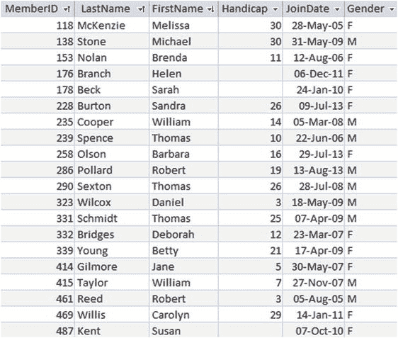

图 1-1.
Member（成员）表

#### 主键

关系数据库表最重要的特性之一是它的每一行都应该是唯一的。表中不应有两行在每个属性上都具有相同的值。如果我们考虑成员数据，就能明白为什么这种唯一性约束如此重要。如果在图 1-1 所示的表中，我们有两行完全相同的记录（比如都是 Brenda Nolan），我们将无法区分它们。我们可能会将一个团队与其中一行关联，而将订阅付款与另一行关联，从而产生各种混淆。

关系数据库通过指定一个`主键`来保持表中行的唯一性。`主键`是一个属性或一组属性，它保证在给定表的每一行中都是不同的。对于像本例中的成员数据这样的数据，我们不能保证所有成员都有不同的姓名或地址（父亲和儿子可能同名同址且都属于俱乐部）。重要的是要有足够的属性来区分表中的行。添加出生日期可以解决上面提到的问题。将大量属性作为主键处理可能变得很繁琐，因此为了帮助区分不同的成员，我们在图 1-1 的表中包含了 ID 号作为属性之一。现在我们可以通过指定 ID 来唯一标识一个成员。这样做还有一个额外优势，即如果成员更改姓名，我们也可以跟踪他们。添加一个标识号（有时称为`代理键`）在数据库表中非常常见。如果`MemberID`被定义为`Member`表的主键，那么数据库系统将确保每一行中`MemberID`的值都是不同的。系统还将确保主键字段始终有值。也就是说，我们永远不能添加一行`MemberID`字段为空的记录。主键字段的这两个要求（唯一性和非空）确保了给定一个`MemberID`值，我们总能找到代表该成员的单一行。我们将在本章后面开始查看表之间的关系时，看到这一点也很重要。

下面的代码显示了创建图 1-1 所示`Member`表的 SQL 代码。每个属性都指定了名称和类型。在 SQL 中，关键字`INT`表示整数或非小数数字，`CHAR(n)`表示长度为`n`的字符串。该代码还指定了`MemberID`将是主键。设计良好的数据库中的每个表都应该有一个主键子句。

```sql
CREATE TABLE Member (
MemberID INT PRIMARY KEY,
LastName CHAR(20),
FirstName CHAR(20),
Handicap INT,
JoinDate DATETIME,
Gender CHAR(1));
```


#### 在表中插入和更新行

本书的重点是从数据库中获取准确信息，但数据首先需要以某种方式进入数据库。大多数数据库应用程序开发人员会提供用户友好的界面，用于将数据插入到各个表中。通常，系统会向用户展示一个表单，用于输入可能最终分散在多个表中的数据。图 1-2 展示了一个简单的 Microsoft^© Access 表单，它允许用户在 `Member` 表中输入和修改数据。

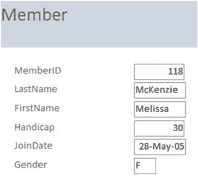

图 1-2.
一个允许在会员表中输入和更新数据的表单

可以构建网页表单或使用机械阅读器（如条形码阅读器）来收集数据并将其插入数据库。数据也可以通过来自文件的批量更新添加，或从其他应用程序导入。在所有这些不同的数据更新机制背后，都会生成 SQL 更新查询。我们将看到用于插入或更改数据的三种查询类型，以便对其有个初步了解。

下面的代码展示了向我们的 `Member` 表插入一整行数据的 SQL。数据项的顺序与创建表时指定的顺序相同。注意，日期和字符串值需要用单引号括起来。

```sql
INSERT INTO Member
VALUES (118, 'McKenzie', 'Melissa', '963270', 30, '05/10/1999', 'F')
```

如果许多数据项是空的，我们可以指定哪些属性会有值。如果我们只有某个会员的 `MemberID` 和 `LastName`，我们可以只插入这两个值，如下所示：

```sql
INSERT INTO Member (MemberID, LastName)
VALUES (258, 'Olson')
```

如上所述添加新行时，我们必须始终为主键提供一个值。

我们还可以使用更新查询来修改数据库中已有的记录。以下查询将找到 ID 为 118 的会员所在的行，然后更新其电话号码：

```sql
UPDATE Member
SET Phone = '875077'
WHERE MemberID = 118
```

该查询指定了要更改哪些行（`WHERE` 子句），同时也指定了要更新的字段（`SET` 子句）。

#### 设计合适的表

即使是一个相当简单的数据库系统也会包含数百个属性：姓名、日期、地址、数量、价格、描述、身份证号码等等。这些都必须以某种方式进入表中，而将它们放入正确的表中对于数据库的整体准确性和可用性至关重要。将属性放在“错误”的表中会引发许多问题。为了简单说明可能出现的问题，我将简要展示与拥有冗余信息相关的问题。

假设我们想在我们为高尔夫俱乐部会员保存的信息中添加团队和练习夜。我们可以将这两个字段添加到 `Member` 表中，如图 1-3 所示。

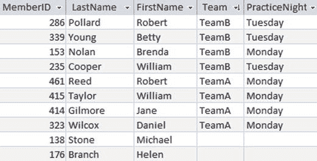

图 1-3.
可能的会员表

立即可以看出，数据输入存在问题，因为 Brenda Nolan 的练习夜与她的其他团队成员不同。每个团队练习夜的信息被存储了多次，因此不可避免地会出现不一致。如果我们制定一个查询来查找 TeamB 的练习夜，我们期望得到什么答案？应该是星期一、星期二，还是两个都是？

这里的问题是（用数据库术语来说）这个表没有正确地进行**规范化**。规范化是一种检查属性是否在正确表中的正式方法。深入研究规范化超出了本书的范围，但我将简要展示如何在此特定情况下避免该问题。

问题在于我们试图在 `Member` 表中保存关于两种不同事物的信息：关于每个会员的信息（ID、姓名等）和关于团队的信息（练习夜）。`PracticeNight` 属性被放在了错误的表中。图 1-4 展示了一个更好的解决方案，使用两张表：一张用于会员信息，另一张用于团队信息。

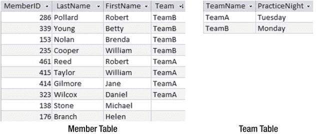

图 1-4.
会员表和团队表

将信息分离到两张表中，防止了我们之前遇到的数据不一致问题。每个团队的练习夜只存储一次。如果我们需要找出 Brenda Nolan 应该在哪天晚上练习，我们现在需要查询两张表：在 `Member` 表中找到她的团队，然后在 `Team` 表中找到该团队的练习夜。本书的大部分内容就是关于如何进行此类数据检索的。


### 介绍数据模型

即使是最简单的数据库也可能包含多个表。**数据模型** 是对底层数据及其相互关系的**概念模型**。我们将使用**统一建模语言（UML）** 中的类图符号来表示我们的数据模型。还有许多其他表示数据结构的方法（例如，实体关系图），对于本书的目的而言，它们同样适用。我们选择使用 UML，因为它拥有庞大的软件应用程序开发图表工具套件，其中不仅包含数据的结构，也包含其行为。在本节中，我们将了解如何解读类图以及如何将其转换为关系数据库中的表和约束。

类（Class）类似于我们想要保存其数据的事物（事件、人物、地点等）的**模板**。例如，我们可能希望保存高尔夫俱乐部会员的姓名和其他详细信息。图 1-5 展示了 `Member`（会员）类的 UML 符号。类名位于顶部面板，下一个面板显示的是**属性**。类图还可以有另一个面板来显示与该类行为相关的**方法**。

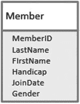

图 1-5. Member 类的 UML 表示法

在关系数据库中，每个类都表示为一个表，属性是列，每个实例（在此例中即为单个俱乐部会员）将是表中的一行。

数据模型还可以描述不同类之间的依赖关系。图 1-6 展示了两个类 `Member` 和 `Team`（团队），以及它们之间的关系。

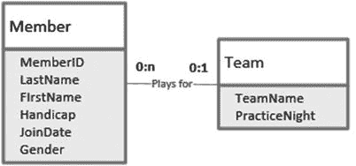

图 1-6. 两个类之间的关系

图 1-6 中 `plays for`（效力于）关系线两端的数字对表示有多少成员为一个特定团队效力，反之亦然。每对数字中的第一个数字是**最小数目**。这个数字通常是 0 或 1，因此有时被称为**可选性**（即，它指示一个会员是否必须关联到一个团队，反之亦然）。第二个数字（称为**基数**）是关联对象的最大数目。它通常是 1 或多个（用 n 或 * 表示），尽管其他数字也是可能的。

关系可以从两个方向解读。图 1-6 中关系的标签暗示我们是从左向右阅读，我们需要思考一个合适的动词来从另一个方向解读该图。“团队拥有成员”可以胜任。从左向右阅读图 1-6，我们看到一个特定的成员不必须为某个团队效力，并且最多只能为一个团队效力（靠近 `Team` 类一端的线上的数字 0 和 1）。从右向左阅读，我们可以说一个特定的团队不需要有任何成员，但可以拥有许多成员（靠近 `Member` 类一端的数字 0 和 n）。像图 1-6 中的这种关系被称为**一对多关系**（一个成员只能属于一个团队，而一个团队可以拥有许多成员）。

你可能会认为一个团队应该正好有四名成员（比如，对于一个俱乐部间的团队）。虽然当团队进行一轮高尔夫比赛时可能是这样，但我们的数据库可能会记录与该团队关联的不同数量的成员，因为我们会在一年中增加和移除球员。数据模型通常使用 0、1 和多个来建模表之间的关系。其他约束（例如团队的最大人数）更常通过业务规则或 UML 用例来表达。

我们可以通过查看关系在“一”端的主键，并在“多”端的表中添加一个相同类型的列来表示一对多关系。对于图 1-6 中的模型，我们会在 `Member` 表中添加一个 `Team` 列，如图 1-7 所示。

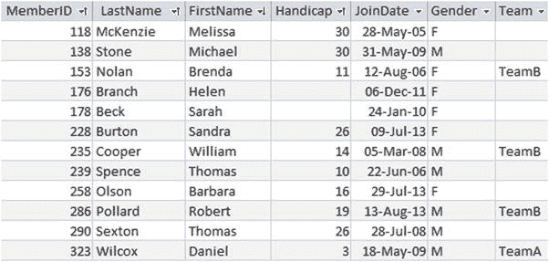

图 1-7. 包含外键列 Team 的 Member 表

`Team` 列被称为**外键**。`Member` 表中该列的任何非空值，都必须是 `Team` 表的主键列中已经存在的值。外键的概念为我们提供了对 `Member` 表的约束，使得我们无法将成员分配给不存在的团队。这个约束被称为**参照完整性**。

创建带有外键的表的 SQL 如下所示：

```sql
CREATE TABLE Member(
MemberID INT PRIMARY KEY,
LastName CHAR(20),
FirstName CHAR(20),
Phone CHAR(20),
Handicap INT,
JoinDate DATETIME,
Gender CHAR(1),
Team CHAR(20) FOREIGN KEY REFERENCES Team);
```

因为我们需要比较 `Member` 表外键列中的值与 `Team` 表主键列中的值，所以这两列必须具有相同的域或数据类型。

大多数数据库产品都有用于设置和显示外键约束的图形界面。图 1-8 展示了 Microsoft^© SQL Server 和 Microsoft^© Access 的界面。这些本质上是数据模型实现的图表，对于理解数据库结构至关重要，从而让我们知道如何提取所需的信息。

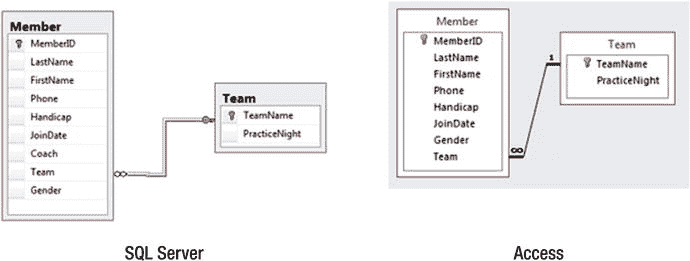

图 1-8. 使用外键实现一对多关系的图表

图 1-4 和图 1-7 中的表设计本质上是相同的。对于图 1-4，我们是通过从 `Member` 表中移除 `PracticeNight` 列并创建一个新的 `Team` 表（一个规范化过程）来得到这个设计的。对于图 1-7，我们首先考虑了一个数据模型，并在 `Member` 表中添加了 `Team` 列，以此表示 `Member` 和 `Team` 之间的关系。无论你采取哪种方式处理这个问题，结果都是一样的。

冒着重复的风险，我确实想提醒大家注意确保数据库设计得当的必要性。图 1-6 中的简单模型即使对于它所包含的极少量数据也几乎肯定是完全不合适的。一个真实的俱乐部可能希望跟踪团队成员资格如何随年份演变。这将需要在团队成员信息中加入有关赛季或年份的信息。如果一些成员在一年内被召入作为替补，他们可能效力于多个团队。这些信息可能需要保留，也可能不需要。设计一个有用的数据库是一项棘手的任务，超出了本书的范围。


### 从数据库检索信息

既然我们已经有了一个设计良好的数据库，它由相互关联的规范化表组成，我们现在可以开始研究如何通过查询来提取信息。当我提到提取或检索信息时，并不是指我们要移除任何数据。可以将查询视为查看数据库一小部分内容的窗口。许多数据库系统会提供图形化界面，这对于简单查询非常有用。图 1-9 展示了从`Member`表中检索高级会员姓名的 Microsoft© Access 界面。勾选标记表示我们要检索的列，`Criteria`（条件）行使我们能够指定返回行需满足的条件。

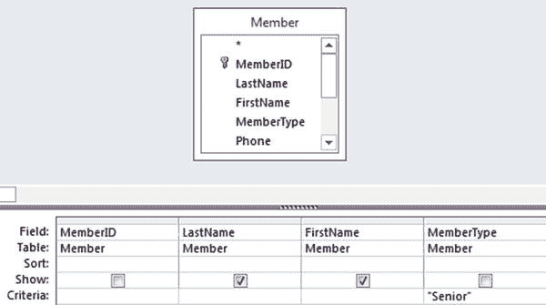
*图 1-9. 用于对 Member 表进行简单查询的 Access 界面*

应用程序将从图形界面获取信息并构建一个 SQL 查询。大多数应用程序会显示生成的 SQL，你可以修改它或自己从头编写。图 1-9 所示查询的 SQL 等价语句是：

```sql
SELECT FirstName, LastName
FROM Member
WHERE MemberType = 'Senior';
```

这个 SQL 查询包含三个子句：`SELECT`指定要返回的列，`FROM`指定信息存放的表，`WHERE`指定返回的行必须满足的条件。我们稍后会更详细地研究 SQL 语句的结构，但现在这个查询的意图已经相当清晰了。

随着我们需要以各种方式连接越来越多的表，图形化界面很快就变得笨拙难用，通常我们需要直接编写 SQL 命令。通常，以一种更抽象的方式来思考查询会更容易。对所需内容有一个清晰的抽象理解后，将这个想法转化为合适的 SQL 语句就变得更为直接了。对关系数据库进行查询有两种不同的方法。

#### 过程方法

处理查询的一种方法是从我们需要对表执行的操作角度来思考。让我们思考一下如何获取在星期一练习的成员姓名列表。我们可以想象首先从`Team`表中检索`PracticeNight`列包含“星期一”的行。然后，我们可能会将这些行与`Member`表连接起来（关于连接，后面会有更多介绍），并从结果中提取姓名。我们将此称为**过程方法**，因为它是一系列按特定顺序执行的步骤。图 1-10 描述了刚才所述的步骤。

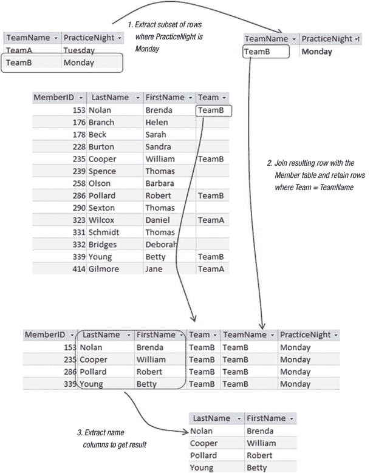
*图 1-10. 过程方法：将查询视为一系列操作*

#### 结果方法

思考上一节中查询的另一种方法是检查`Member`表中的所有行，并仅返回那些满足以下条件的行：该成员所在的团队将星期一作为练习日。图 1-11 描述了这一思路。我们考虑的`Member`表中的行`m`满足关于团队练习日的条件，因此我们应该从该行检索姓名。

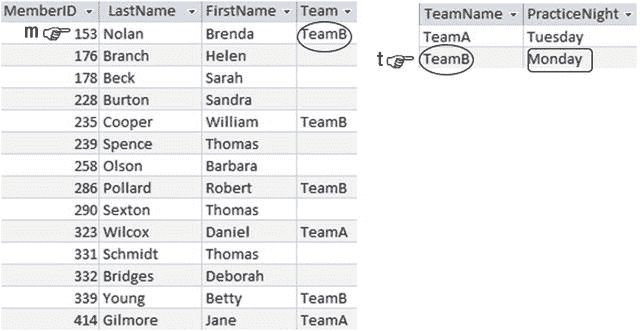
*图 1-11. 判断行 m 是否满足查询条件。*

我们将这种关于查询的思考方式称为**结果方法**，因为我们描述的是我们想要什么，而不是如何得到它。

### 为何考虑两种方法

关系数据库理论起源于集合论。如果我们将表视为行的集合，那么查询就是一个问题，要求我们操作这些集合以检索包含我们所需信息的子集。关系理论有两种指定提取行子集标准的正式方法：**关系代数**和**关系演算**。

对于简单查询，我们不需要这些抽象概念。然而，如果所有查询都很简单，您就不会阅读这本书了。首先，查询通常用日常语言表达，而这种语言常常存在歧义。试试这个简单的表达：“找出所有年龄小于 20 岁或在家住并获得津贴的学生。”根据逗号插入位置的不同，这可以表示不同的意思。例如，“20”后面的逗号表示所有 20 岁以下的人都被包括在内，而“家”后面的逗号则表示他们还必须获得津贴。即使我们理清了自然语言表达的意思，我们仍必须根据数据库中的实际表来思考查询。这意味着我们必须在表达查询的方式上非常具体。关系代数和关系演算都为我们提供了一种准确且具体的方式。

为什么不跳过所有这些抽象的东西，直接去学习 SQL 呢？嗯，SQL 语言同时包含了演算和代数的元素。旧版本的 SQL 纯粹基于关系演算，即你描述想要检索什么，而不是如何检索。现代的 SQL 实现也允许你显式地指定代数操作，例如表的连接、并集和交集。

表达一个 SQL 语句通常有几种等效的方式。有些方式非常基于演算，有些基于代数，有些则两者兼有。在我担任大学讲师期间，我经常在课堂上问学生，对于某个特定的查询，他们觉得演算表达式还是代数表达式更直观。班级通常平分秋色。就我个人而言，我发现有些查询用关系代数思考感觉显而易见，而另一些用关系演算表达则感觉简单得多。一旦我用其中一种方法确定了想法，将其转换为 SQL（或其他查询语言）通常就很简单了。

我们可以在不深入数学细节的情况下，利用关系代数和关系演算的思想。在本书正文中，我将提到**过程方法（代数）**和**结果方法（演算）**。你掌握的工具越多，就越有可能准确地表达复杂的查询。附录 2 中介绍了关系代数和关系演算的正式符号表示法，供希望将其纳入自己武器库的读者参考。


### 总结

本章概述了关系型数据库。我们了解到，关系型数据库由一组表构成，这些表代表了数据的不同方面（例如，成员表和团队表）。描述成员或属性的属性成为表的列，每个列都有一组允许的值（一个域）。每个表都应有一个主键，它是保证每行具有不同值的一个属性或属性集合。

可以通过外键在表之间设置约束。外键是某张表中一个列（或多个列）的值，该值必须已作为另一张表的主键列的值存在。例如，`Member` 表中的 `Team` 值必须是 `Team` 表主键字段中的值之一。

以抽象的方式思考查询通常是有帮助的，有两种方法可以做到这一点。过程式方法要求我们思考可以应用于数据库中表的操作。这是一种描述如何操作表以提取所需信息的方式。结果式方法要求我们思考所需信息必须满足的标准。不同的人会发现，对于不同的查询，其中一种方法感觉更自然。SQL 是一种用于在数据库上指定查询的语言。在 SQL 中指定查询通常有许多等效的方式。有些反映了过程式方法，有些反映了结果式方法 `—` 而有些则两者兼而有之。

脚注 1
例如，你可以参考我的另一本 Apress 图书，*《数据库设计入门：从新手到专业人员》*（纽约：Apress，2012）。

2
更准确地说，它是一组关系。在本书正文中，使用了诸如表、行等常见词汇。在附录 2 中，我们介绍了更正式的词汇和符号。

3
如果你想了解更多关于 UML 的信息，请参阅 Grady Booch, James Rumbaugh, 和 Ivar Jacobsen 的 *《统一建模语言用户指南》*（波士顿，马萨诸塞州：Addison Wesley，2005）。当前标准可以在 [`http://www.uml.org/`](http://www.uml.org/) 找到。

4
Alistair Cockburn, *《编写有效用例》*（波士顿，马萨诸塞州：Addison Wesley，2001）。

5
关于数据库设计的更多信息，请参考我的另一本 Apress 图书，*《数据库设计入门：从新手到专业人员》*（纽约：Apress，2012）。

