# 2. 对单表的简单查询

如果数据库设计得正确，数据将位于几张不同的表中。例如，我们的高尔夫数据库有独立的表来存储关于成员、团队和锦标赛的信息，以及连接这些值的表；例如，哪些成员在哪个团队，参加了哪个锦标赛，等等。为了充分利用我们的数据，我们将需要查看不同表中的值以检索所需的信息。

在本章中，我们将研究如何从单个表中检索信息。该表可能是数据库中的永久表之一，也可能是作为更复杂查询的一部分临时组合而成的虚拟表。

我一直在以一种不太精确的方式谈论“检索”行和“返回”信息。查询产生的行会怎样？实际上，我们并不是从表中移除数据并将其放在别处。查询就像数据库的一扇窗口，我们可以通过它看到我们所需的信息。如果底层数据库中的数据发生变化，那么我们的查询结果也会随之变化。只要认识到它是临时的，将查询得到的信息视为被“检索”到一个“虚拟”表中也无妨。

### 行和列的子集

选择行和/或列的子集是我们在查询中最常执行的操作之一。在接下来的部分中，我们将研究如何从数据库中的原始表之一选择行和列。¹ 同样的思路也适用于从数据经过其他操作产生的虚拟表中检索信息。

要确定从表中检索哪些行，需要指定一个条件，这是一个值为真或假的语句。我们将该条件独立应用于表中的每一行，保留条件为真的行，丢弃其他行。假设我们想找到高尔夫俱乐部中的所有高级会员。我们只需要 `Member` 表中 `MemberType` 字段值为“Senior”的那部分行子集，如图 2-1 所示。

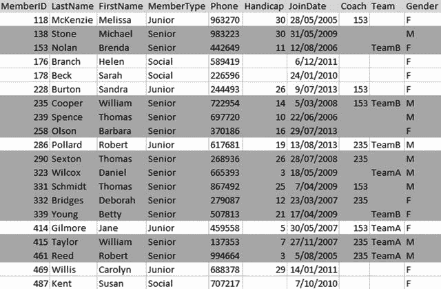
**图 2-1.** 检索高级会员的行子集

用于检索高级会员的 SQL 查询如下：

```sql
SELECT *
FROM Member
WHERE MemberType = 'Senior'
```

这个查询有三个部分，或者说子句：`SELECT` 子句说明要检索哪些列。这里，`*` 表示检索所有列。`FROM` 子句说明查询涉及哪些表，`WHERE` 子句描述了决定特定行是否应包含在结果中的条件。该条件是检查 `MemberType` 字段中的值。在 SQL 中，当我们为字符或文本字段指定实际值时，需要将值用单引号括起来，如 `'Senior'`。

现在让我们看看如何指定我们只想在结果中看到部分列。我通常将选择行子集称为筛选，将投影列子集称为投影。通常，投影列子集是一系列操作的最后一步。我们可以先收集所有需要的数据，最后再请求我们只需要的属性或列。我们将在第 7 章中看到，在应用某些集合操作（如并集和交集）之前，我们有时也需要从原始表或虚拟表中投影类似的列。

如果我们想要一份所有成员的电话列表，则不需要额外的信息，如差点或加入日期。图 2-2 显示了从 `Member` 表中投影出的姓名和电话号码列子集。

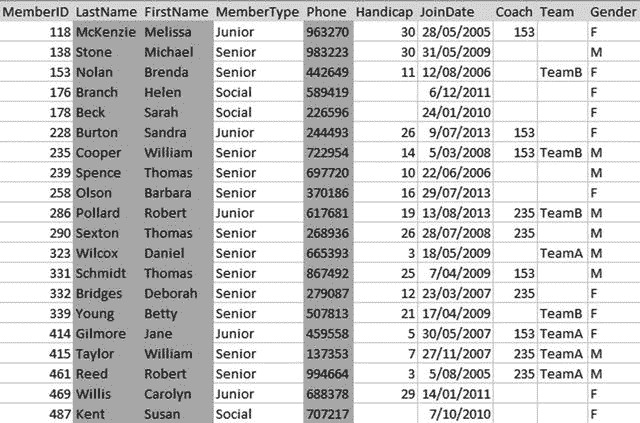
**图 2-2.** 投影列子集以提供电话列表

从 `Member` 表中检索姓名和电话列的 SQL 是：

```sql
SELECT LastName, FirstName, Phone
FROM Member
```

因为我们想看到每一行的这些列值，所以这个查询没有 `WHERE` 子句。

结合行和列子集的检索很简单。如果我们只想获取高级会员的电话列表，就可以这样做，如图 2-3 所示。

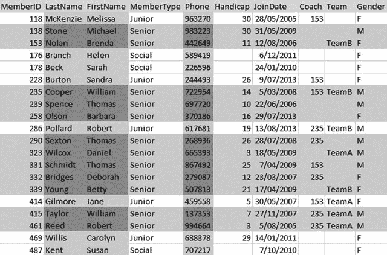
**图 2-3.** 检索行和列的子集以生成高级会员的电话列表

图 2-3 所示查询的 SQL 是：

```sql
SELECT LastName, FirstName, Phone
FROM Member
WHERE MemberType = 'Senior'
```


### 使用别名

随着查询变得越来越复杂，我们会涉及多个不同的表。其中一些表可能具有相同的列名，我们需要将它们区分开来。在 SQL 中，我们可以在查询中为每个属性添加其来源表的名称作为前缀，如下所示：

```sql
SELECT Member.LastName, Member.FirstName, Member.Phone
FROM Member
WHERE Member.MemberType = 'Senior'
```

因为输入整个表名会变得很繁琐，而且在某些查询中我们可能需要比较表中多行的数据，SQL 提供了**别名**的概念。看看下面的查询：

```sql
SELECT m.LastName, m.FirstName, m.Phone
FROM Member m
WHERE m.MemberType = 'Senior'
```

在 `FROM` 子句中，我们为 `Member` 表声明了一个别名或替代名称，在本例中是 `m`。我们可以给别名取任何喜欢的名字或字母；越短越好。然后，在查询的其余部分，当我们需要指定该表的属性时，就可以使用这个别名。养成对查询中涉及的每个表都使用表别名的习惯是个好主意。

### 保存查询

可以将查询的结果保存在一个新的永久表中（有时称为快照），但我们通常不想这样做，因为如果基础数据发生变化，它就会过时。我们通常想做的是保存查询指令，以便日后可以提出相同的问题。以我们的电话列表查询为例。在俱乐部成员名单更新后，我们会定期生成新的电话列表。与其每次都重新构建查询，我们可以将指令保存在一个称为**视图**的对象中。下面的代码展示了如何创建一个可用于提供最新电话列表的视图。我们必须给视图起一个名字（`PhoneList` 看起来很合适），然后提供用于检索相应数据的 SQL 语句：

```sql
CREATE VIEW PhoneList AS
SELECT m.LastName, m.FirstName, m.Phone
FROM Member m
```

你可以将 `PhoneList` 视为创建“虚拟”表的指令，我们可以在其他查询中以与使用真实表相同的方式使用它。我们只需要记住，这个虚拟表是通过运行永久 `Member` 表上的查询动态创建的，并且用完即消失。现在要获取我们的电话列表，我们可以简单地使用 `PhoneList` 视图：

```sql
SELECT * FROM PhoneList
```

### 指定选择行的条件

在前面章节我们查看的查询中，我们使用了非常简单的条件或标准来决定是否将一行包含在查询结果中。在下一节中，我们将更仔细地研究指定更复杂条件的各种方法。

#### 比较运算符

条件是一个为真或为假的语句或表达式，例如 `MemberType = 'Senior'`。这类表达式被称为**布尔表达式**，以 19 世纪研究其性质的英国数学家乔治·布尔命名。我们用来从表中选择行的条件通常涉及将属性的值与某个常量值或其他属性进行比较。例如，我们可以询问某个属性的值是否相同、不同或大于某个值。表 2-1 展示了一些可在查询中使用的比较运算符。

**表 2-1. 比较运算符**

| 运算符 | 含义 | 为真的示例 |
| --- | --- | --- |
| `=` | 等于 | `5=5`, `'Junior' = 'Junior'` |
| `<` | 小于 | `4<5`, `'Ann' < 'Zebedee'` |
| `<=` | 小于或等于 | `4<=5`, `5<=5` |
| `>` | 大于 | `5>4`, `'Zebedee' > 'Ann'` |
| `>=` | 大于或等于 | `5>=4`, `5>=5` |
| `<>` | 不等于 | `5<>4`, `'Junior' <> 'Senior'` |

这里需要快速提醒一下：在表 2-1 中，我们的一些示例比较的是数字，一些比较的是字符。回想第 1 章，当我们创建表时，我们指定了每个字段的类型；例如，`MemberID` 被声明为 `INT`（整数或整数），而 `LastName` 被声明为 `CHAR(20)`（20 个字符的字段）。对于像整数这样的字段，比较是数值型的。对于文本或字符字段，比较是按字母顺序进行的；对于日期和时间字段，比较是按时间顺序进行的（较早的日期在前）。

当我们比较字符属性时，比较是基于字符的 ASCII 或 Unicode 值。正如我们可能预期的那样，“A”（ASCII 值 65）在“Z”（ASCII 90）之前，所以 “A” < “Z”。对于一串字符，如果第一个字母相同，则顺序由第二个字母决定，依此类推。所以 “ANNABEL” < “ANNE”。然而，小写字符的 ASCII 码大于大写字符。这意味着 “a”（ASCII 97） > “Z”（ASCII 90）。如果你按字母顺序对名称列表排序，默认情况下，以小写字母开头的名字会出现在以大写字母开头的名字之后。例如，“van Dyke” 会出现在 “Zebedee” 之后。

如果我们将数字放入字符字段，它们也会按字母顺序排序。这意味着你会得到像 “400” < “5” 这样的比较结果，因为左边文本的第一个字符 “4”（ASCII 52）小于右边文本的第一个字符 “5”（ASCII 53）。因此，请确保如果一个列将包含你想要进行数值比较和排序的数字，必须将其声明为数值类型，否则你的查询会得到一些相当令人惊讶的结果。同样，日期也需要放在声明为日期类型的列中，否则比较和排序可能不是你期望的结果。

使用比较运算符，我们可以创建许多不同的查询。表 2-2 展示了一些布尔表达式的例子，这些表达式可以用作 SQL 语句 `WHERE` 子句中的条件，用于从 `Member` 表中选择行。

**表 2-2. Member 表上的布尔表达式示例**

| 表达式 | 检索的行 |
| --- | --- |
| `MemberType = 'Junior'` | 所有初级会员 |
| `Handicap <= 12` | 所有障碍值为 12 或更低的会员 |
| `JoinDate >= '01/01/2008'` | 所有在 2008 年之后加入的人 |
| `Gender = 'F'` | 所有女性会员 |

一些 SQL 实现在比较文本时区分大小写，而另一些则不区分。区分大小写意味着大写字母被视为与其小写对应形式不同；换句话说，“Junior” 不同于 “junior”，也不同于 “JUNIOR”。我通常会测试我使用的任何新数据库系统，看看它的行为。如果你不关心所考虑属性的大小写（即你乐于检索 `MemberType` 为 “Junior”、“jUnIoR” 或任何其他形式的行），你可以利用 SQL 函数 `UPPER`。该函数会在比较之前将每个文本属性的值转换为大写。然后你可以将其与大写的字面值进行比较，如下所示：

```sql
SELECT *
FROM Member m
WHERE UPPER(m.MemberType) = 'JUNIOR'
```


#### 逻辑运算符

我们可以组合布尔表达式以创建更有趣的条件。例如，我们可以指定在检索特定行之前，两个表达式必须都为真。

假设我们想要查找所有的初级会员女孩。这需要两个条件为真：她们必须是女性，并且她们必须是初级会员。我们可以轻松地独立表达每个条件。之后，我们可以使用逻辑运算符 `AND` 来要求两个条件都为真：

```sql
SELECT *
FROM Member m
WHERE m.MemberType = 'Junior' AND m.Gender = 'F'
```

我们将探讨三种逻辑运算符：`AND`、`OR` 和 `NOT`。我们已经看到了 `AND` 是如何工作的。如果我们在两个表达式之间使用 `OR`，那么只需要其中一个表达式为真即可（但如果两个都为真，也没问题）。`NOT` 用于表达式之前。例如，对于我们的 `Member` 表，我们可能要求满足条件 `NOT (MemberType = 'Social')` 的行。这意味着检查每一行，如果 `MemberType` 的值为 “Social”，那么我们就不想要那一行。表 2-3 提供了更多在条件中使用逻辑运算符的示例。

表 2-3. 逻辑运算符示例

| 表达式 | 数据描述 |
| --- | --- |
| `MemberType = 'Senior' AND Handicap < 12` | 差点数低于 12 的高级会员 |
| `MemberType = 'Senior' OR Handicap < 12` | 所有高级会员以及其他任何差点数良好（低于 12）的会员 |
| `NOT(MemberType = 'Social')` | 除社交会员外的所有会员（就当前数据而言，仅指高级和初级会员） |

图 2-4 展示了表 2-3 中查询的图示表示。每个圆圈代表一组行（即社交会员的行或差点数低于 12 的会员的行）。阴影区域代表操作的结果。

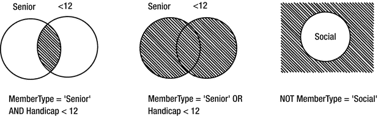

图 2-4. 逻辑运算符的图示表示。

图 2-5 中的真值表有助于理解逻辑运算符的工作原理。阅读方式如下：在图 2-5a 和 2-5b 中，我们有两个表达式，一个在顶部，一个在左侧。每个表达式可以有两个值：真 (`T`) 或假 (`F`)。如果我们将它们与布尔表达式 `AND` 组合，那么图 2-5a 显示，只有当两个组成语句都为真时，整个语句才为真（左上角的方框）。如果我们将它们与 `OR` 语句组合，那么只有当两个组成语句都为假时，整个语句才为假（图 2-5b 的右下角）。图 2-5c 中的表格说明，如果我们原始的语句为真，并在前面加上 `NOT`，则结果为假（左列），反之亦然。

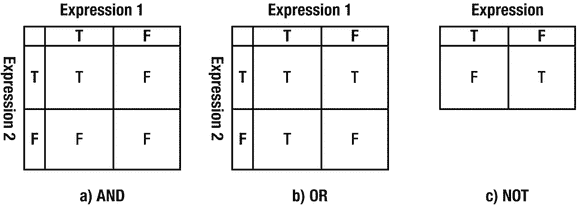

图 2-5. 逻辑运算符的真值表 (`T` = 真，`F` = 假)

有时，将自然语言描述转换为布尔表达式可能有点棘手。如果要求你提供一个包含所有女性和所有初级会员（别问为什么！）的列表，你可能会按字面意思翻译，并写出条件 `MemberType = 'Junior' AND Gender = 'F'`。然而，`AND` 意味着两个条件都必须为真，所以这将只给出初级女性会员。我们的自然语言陈述真正的意思是“我想要任何会员的行，如果他们是女性或初级会员（或两者都是）。”请务必小心。

#### 处理空值

前面图 2-1 中显示的 `Member` 表中的示例数据都是准确且完整的。除了 `Handicap` 字段（它不适用于某些会员），每一行在每个属性上都有值。真实数据通常不那么整洁有序。让我们考虑一些不同的数据，如图 2-6 所示。

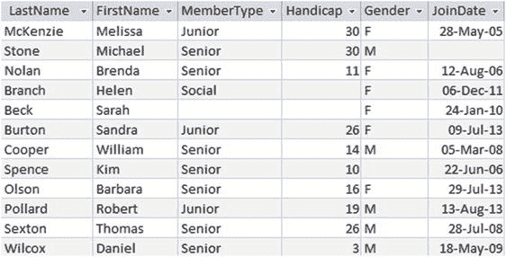

图 2-6. 存在缺失数据的表

当表中的单元格没有值时，称其为空。数据库中的空值可能会带来一些麻烦。考虑执行以下两个查询：一个生成男性会员列表，另一个生成女性会员列表。鉴于高尔夫球手出于比赛目的需要标识为男性或女性，我们可能会认为俱乐部的所有会员都会出现在其中一个列表中。然而，对于图 2-6 中的数据，我们会遗漏 Kim Spence。你可以争辩说数据不应该这样，但我们谈论的是真实的人和真实的俱乐部，数据不那么准确和完整。也许 Kim 忘记（或拒绝）填写申请表中的性别部分。我们可以通过在创建表时坚持特定字段不允许为空来防止这种情况。以下 SQL 语句展示了如何使 `Gender` 成为一个始终需要值的字段：

```sql
CREATE TABLE Member (
MemberID INT PRIMARY KEY,
.....
Gender CHAR(1) NOT NULL,
....)
```

值得注意的是，将字段设为 `NOT NULL` 可能带来的麻烦比解决的更多。如果 Kim Spence 没有填写会员申请表上的所有方框，但已经安排了会费的支付，那么我们希望将他/她记录为会员，稍后再处理完整细节。如果我们把 `Gender` 设为必填字段，那么我们就无法在表中为他/她输入记录——或者我们必须猜测他/她的性别。这两种选择都不是好策略，因此在将字段设为必填时最好谨慎行事。请记住，我们的主键字段（根据定义）始终需要一个值。

并非所有空值都意味着数据存在问题。在我们的 `Member` 表中，某个字段可能为空是因为它不适用于特定会员。Helen 和 Sarah 的差点数可能确实是空的，因为她们没有差点数。然而，可以合理地假设每个会员都应该有一个 `MemberType` 和 `JoinDate` 的值，因此这些列中的空值是因为我们不知道该值。在现实世界中，请预期你的表中会存在缺失数据。

#### 查找空值

鉴于我们的表中可能存在可能给我们带来问题的空值，能够找到它们是很有用的。在将一批新会员输入数据库后，我们可以检查问题。例如，我们可能想要获取所有 `Gender` 字段没有值的会员列表。为此，我们可以使用 SQL 短语 `IS NULL`：

```sql
SELECT *
FROM Member m
WHERE m.Gender IS NULL
```

或者，我们可能只想检索那些在单元格中有值的会员。如果我们只想要那些 `Handicap` 字段有值的会员的姓名和差点数，我们可以使用 `NOT` 运算符创建以下查询：

```sql
SELECT *
FROM Member m
WHERE NOT (m.Handicap IS NULL)
```


#### 涉及空值的比较

既然我们的表中可能出现意外的空值，了解如何处理它们就很重要。下面这两个条件会匹配哪些行？

```
Gender = 'F'
NOT (Gender = 'F')
```

你可能会认为，如果我们执行两个查询——一个获取匹配某个条件的所有行，另一个获取不匹配该条件的所有行——那么我们就得到了整个表。但事实上，我们并没有。Kim 不会被第一个条件包括，因为显然 `Gender` 的值不等于 `'F'`。但是，当我们询问该值是否为 `NOT 'F'` 时，我们无法回答，因为我们不知道该值是什么。如果有值，它可能是 `'F'`。在 SQL 中，当我们将空值与某物进行比较时，我们既不会得到 `True` 也不会得到 `False`，因为我们根本不知道。如果我们考虑残障值，这可能就更说得通了。如果我们查询所有 `Handicap > 12` 的人，以及那些满足 `NOT (Handicap > 12)` 或 `Handicap <=12` 的成员，那么 Sarah 的行永远不会被检索出来。这个问题不适用于她——她没有残障值。

一旦我们考虑了空值，我们的条件表达式实际上可能有三个值之一：真（True）、假（False）或“不知道（Don’t know）”。如果你仔细想想，这差不多就是世界的运作方式。查询中只检索条件为 `True` 的行。如果条件为 `False` 或者我们不知道，那么该行就不会被检索。

如果我们将“不知道”包含在真值表中，它们看起来就像图 2-7 中的那些。对于 `AND` 运算，如果一个表达式为 `False`，那么其他表达式如何就无关紧要了——结果将是 `False`。对于 `OR` 运算，如果一个表达式为 `True`，那么其他表达式如何也无关紧要，所以结果将是 `True`。

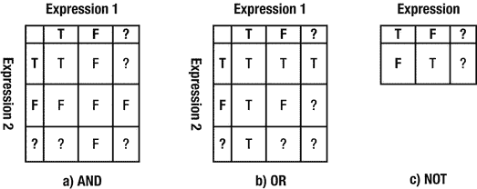

图 2-7. 采用三值逻辑的真值表（T = 真，F = 假，？ = 不知道）

### 管理重复项

如果我们的表设计良好，它们将有一个主键。这确保了每一行都是唯一的。然而，一旦我们从表中检索数据子集，结果可能就没有唯一行了。<sup>3</sup> 让我们看一个例子。

考虑从 `Member` 表中只检索 `FirstName` 列。图 2-8 显示了两种可能的结果。

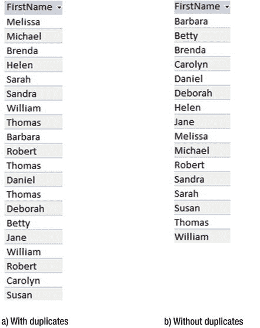

图 2-8. 从 Member 表中投影 FirstName 列

思考一下我们为什么可能执行只检索名字的查询是很有用的。也许这个查询是为了帮助准备一个俱乐部派对的姓名牌。如果是这种情况，那么如果我们使用唯一的输出，两个 Thomas 和一个 William 就会感到被冷落。

你可能会想，有什么大惊小怪的？我们当然想保留所有行。然而，考虑一下只检索包含会员类型的列。图 2-9 显示了包含重复项和移除重复项的输出。

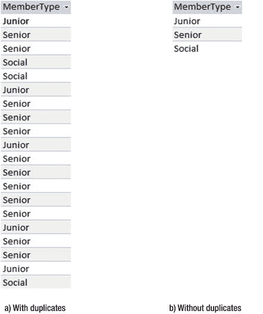

图 2-9. 从 Member 表中投影 MemberType 列

很难想象在什么情况下你会想要图 2-9a 中的重复行。我们考虑过的两种操作在自然语言中听起来很相似。“给我一个名字列表”和“给我一个会员类型列表”听起来像是同一类问题，但它们意味着截然不同的事情。第一个意思是“给我每个会员的一个名字”，另一个意思是“给我一个唯一的会员类型列表”。

SQL 会怎么做？如果我们说 `SELECT MemberType FROM Member`，我们将得到图 2-9a 的输出，其中包含了所有重复项。如果我们不想要重复项，那么我们可以使用关键字 `DISTINCT`：

```
SELECT DISTINCT m.MemberType
FROM Member m
```

是否保留重复项在很大程度上取决于你需要的信息，因此你需要仔细考虑。如果你期望得到图 2-9b 中的行集，却得到了图 2-9a，你很可能会注意到。对于图 2-8 中的两组行，要发现你可能犯了错误就困难得多。养成在所有查询中考虑重复项的习惯。

### 排序输出

我不时提到“行集”而不是表或虚拟表。单词“集”有两层含义。一是没有重复项（我们已经讨论了很多！）。另一层含义是集合中的行没有特定的顺序。理论上，我们没有第一行、最后一行或下一行。如果我们运行一个查询来从表中检索所有行或部分行，那么我们无法保证它们返回的顺序。然而，有时我们可能希望以特定顺序显示结果。我们可以使用关键词 `ORDER BY` 来实现。下面展示了如何按 `LastName` 字母顺序检索会员信息：

```
SELECT *
FROM Member m
ORDER BY m.LastName
```

我们可以按两个或更多值排序。例如，如果我们想按 `LastName` 对 Senior 会员进行排序，对于具有相同 `LastName` 的会员再按其 `FirstName` 的值排序，我们可以将这两个属性（按此顺序）包含在 `ORDER BY` 子句中：

```
SELECT *
FROM Member m
WHERE m.MemberType = 'Senior'
ORDER BY m.LastName, m.FirstName
```

字段的类型决定了值的排序方式。默认情况下，文本字段按字母顺序排序，数字字段按数值排序（最小的在前），日期和时间字段按时间顺序排序（较早的日期和时间在前）。我们还可以使用关键字 `DESC`（表示降序）来指定顺序是反向的。有一个等效的关键字 `ASC`（表示升序），如果两者都未指定，则为默认值。以下将返回会员姓名和残障值，并按降序排序；即，残障值最高的排在前面：

```
SELECT m.Lastname, m.FirstName, m.Handicap
FROM Member m
ORDER BY m.Handicap DESC
```

空值在任何输出中的排序方式取决于具体应用；你需要进行检查。例如，在 SQL Server 和 Microsoft Access 中，空值将出现在升序列表的顶部和降序列表的底部。Oracle 提供了诸如 `NULLS FIRST` 和 `NULLS LAST` 这样的关键字，以便你可以选择空值的位置。在 SQL Server 中，让你的空值出现在升序列表底部的一个小技巧是使用 case 语句：

```
SELECT m.LastName, m.FirstName, m.Handicap
FROM Member m
ORDER BY (CASE
WHEN m.Handicap IS NULL THEN 1
ELSE 0
END), m.Handicap
```

前面的查询在 `ORDER BY` 子句中有两个属性。它首先按括号内的 `case` 语句排序。你可以将 case 语句视为创建了一个虚拟列，为有残障值的行赋予值 0，为没有残障值的行赋予值 1。当我们在 `ORDER BY` 子句中按第一个属性排序时，有残障值的行将排在空值之前。在这些组内，行将再按残障值的升序排序。


### 进行简单计数

除了从表中检索单元行和列子集，我们还可以使用 SQL 查询来提供一些统计数据。SQL 函数允许我们统计记录数量、计算总和或平均值、查找最大值和最小值等。在本节中，我们将看一些用于统计记录的简单查询。我们将在第 8 章回到这个主题。

我们可以使用`COUNT`函数返回`Member`表中的记录数。在下面的查询中，`*`表示统计每一条记录：
```
SELECT COUNT(*) FROM Member
```

我们还可以通过添加`WHERE`子句来指定要包含的行，从而对行的子集进行计数。例如，我们可以使用以下查询来统计资深会员的数量：
```
SELECT COUNT(*) FROM Member m
WHERE m.MemberType = 'Senior'
```

由于我们刚才讨论了空值和重复值，在此简要提及它们如何影响我们的计数是值得的。我们可以将诸如`Handicap`这样的属性放在括号内，而不是使用`*`作为`COUNT`函数的参数来统计所有行。如果我们这样做，只有`Handicap`字段有值的行才会被包括在计数中。
```
SELECT COUNT(Handicap) FROM Member
```

我们还可以指定要统计某个属性的不同值的数量。如果我们想知道`Member`表中出现了多少种不同的`MemberType`值，那么可以使用以下查询：
```
SELECT COUNT(DISTINCT MemberType) FROM Member
```

值得重申的是，不同的数据库软件会支持 SQL 标准语法的不同部分。例如，Microsoft Access 目前不支持前面查询中看到的`COUNT(DISTINCT MemberType)`。通常有方法可以绕过这些差异来找到等效的查询，我们将在第 8 章中探讨如何改写前面的查询以及其他与聚合和汇总相关的问题。

### 避免常见错误

从单个表中检索单元行和列子集是最简单的 SQL 查询。然而，你已经看到仍然需要小心。重要的是要记住你的表中会有空值，并仔细考虑你的选择条件将如何处理它们。你还需要记住，如果你不保留表中的主键字段，就有可能产生重复行，你必须适当地处理它们。

在选择行的子集时，还有其他几个常见的错误。在像`Member`这样的表中，这些错误并不明显，因此我将介绍高尔夫俱乐部数据库中的一些其他表。图 2-10 展示了`Member`表的部分内容以及另外两个表：`Entry`和`Tournament`。`Entry`表中的第一行记录了人员 118（Melissa McKenzie）在 2014 年报名参加了比赛 24（Leeston）。

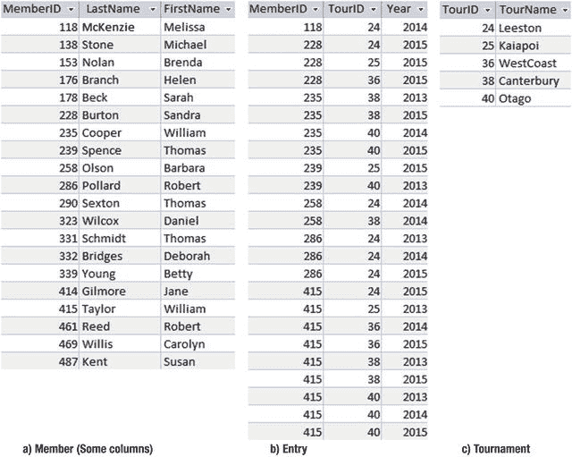
*图 2-10. 介绍 Tournament 和 Entry 表*

我们可以使用一些已经见过的 SQL 操作来处理`Entry`表，以回答诸如人员 258 报名参加了哪些比赛（仅`TourID`编号）、谁（仅`MemberID`编号）曾报名参加比赛 24，或谁在 2015 年报名参加了比赛 36 等问题。以下是最后一个查询的 SQL：
```
SELECT e.MemberID
FROM Entry e
WHERE e.TourID = 36 AND e.Year = 2015
```

#### 错误地使用 WHERE 子句来回答包含“both（两者都）”的问题

在上一节中，我们使用逻辑运算符`AND`在`Entry`表中查找`TourID = 36`和`Year = 2015`都为真的行。

假设我们想找出那些既报名参加了比赛 36 又报名参加了比赛 38 的成员。人们很容易再次使用`AND`运算符，并将查询写成如下形式：
```
SELECT e.MemberID
FROM Entry e
WHERE e.TourID = 36 AND e.TourID= 38
```

你能推断出这个查询将返回什么吗？这时，像图 2-11 那样，用行变量`e`来审视`Entry`表中的每一行会很有帮助。

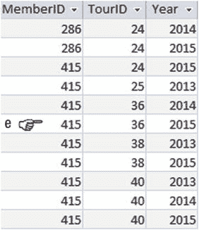
*图 2-11. 行变量 e 独立地调查每一行。*

想象我们的手指正指向图中所示的那一行。这一行（415, 36, 2015）满足条件`e.TourID = 36 AND e.TourID= 38`吗？它满足第一部分，但`AND`运算符要求该行同时满足两个条件。在我们的表中，没有任何一行会在比赛列中同时包含 36 和 38，因为每一行只对应一次报名。我们建议的 SQL 查询永远不会找到任何行；它总是返回一个空表。如果我们将布尔运算符改为`OR`，我们将得到图 2-10 中指出的那一行；然而，我们也会得到任何报名参加了 36 或 38 比赛的人，而不一定是两者都参加了。

这个特定的查询无法用简单的`WHERE`子句解决。根据定义，`WHERE`中的条件独立地应用于每一行。要回答谁同时报名参加了两项比赛的问题，我们需要同时查看`Entry`表中的多行（即用两根手指）。如果我们用两根手指，一根指向图 2-10 所示的那一行，另一根指向下面这一行，那么我们可以推断出 415 报名参加了两项比赛。我们将在第 5 章中学习如何做到这一点。

#### 错误地使用 WHERE 子句来回答包含“not（未）”的问题

现在让我们考虑另一个常见的错误。使用条件`e.TourID = 38`很容易找到报名参加了比赛 38 的人。人们很容易想通过稍微修改条件来检索那些**没有**报名参加比赛 38 的人。你能推断出下面的 SQL 查询将检索哪些行吗？
```
SELECT e.MemberID
FROM Entry e
WHERE e.TourID <> 38
```

图 2-11 中手指指向的那一行呢？它满足`e.TourID <> 38`吗？它当然满足。但这并不意味着 415 没有参加比赛 38（后面一行说他参加了）。这个查询实际上返回了所有报名参加了**某个**不是 38 的比赛的人（这很可能不是你想问的问题！）。

这是另一种无法用查看表中独立行的简单`WHERE`子句来回答的问题。事实上，我们甚至无法用一个只涉及`Entry`表的查询来回答这个问题。成员 138，Michael Stone，没有报名参加比赛 38，但他甚至没有在`Entry`表中被提及，因为他根本没有报名参加过任何比赛。我们将在第 7 章中学习如何处理这类问题。

### 总结

在本章中，我们研究了对单表执行的查询。涵盖的一些要点包括：

*   我们可以通过使用 `WHERE` 子句来返回满足给定条件的行子集。该条件是一个布尔表达式，即一个陈述，其结果要么为真，要么为假。该条件独立地应用于表中的每一行。
*   `SELECT` 子句允许我们指定列的子集。
*   由于查询的结果是一个行集合，我们无法保证行返回的顺序。如果我们希望以特定顺序显示结果，可以使用 `ORDER BY` 子句。
*   可以创建一个视图，它本质上存储一条 SQL 命令，以便你可以随着基表中数据的变化反复运行它。
*   表中很可能存在空值（无论是有意还是无意造成的）。务必检查你的条件将如何应用于空值。
*   当你使用 SQL 命令投影列的子集时，默认会在结果中保留重复行。务必考虑如何处理重复项，如果你需要唯一的行，请使用关键字 `DISTINCT`。
*   `WHERE` 子句一次只考虑一行。不要将其用于需要同时查看多行的查询，例如“谁同时参加了两个比赛”或“谁没有参加这个比赛”。

脚注
1
在关系代数的正式术语中，从表（关系）中检索行（元组）子集被称为选择操作，而检索属性（列）子集被称为投影操作。更多信息请参见附录 2。

2
[`www.asciitable.com/`](http://www.asciitable.com/)

3
形式上，根据关系代数，每个操作的结果都会生成另一个关系或唯一的行集合。更多信息请参见附录 2。

