# 3. 连接初探

在上一章中，我们研究了如何从单个表中检索行和/或列的子集。我们在第 1 章中看到，为了在数据库中准确地保存数据，信息的不同方面需要被分离到规范化的表中。大多数查询将需要来自两个或多个表的信息。根据我们试图提取的信息的性质，我们可以用几种不同的方式组合来自两个表的数据。最常遇到的两表操作就是连接。在第 1 章中，我们还介绍了处理查询的两种不同方法：过程式方法和结果式方法。前者描述我们将如何组合表以获得所需数据，而后者描述检索到的数据必须满足什么标准。

### 连接的过程式方法

连接使我们能够组合来自两个表的相关数据。我们将以一个例子开始，使用 `Member` 和 `Type` 表来查找高尔夫俱乐部每位会员的会员费。执行连接的第一步是一个称为笛卡尔积的操作。

##### 笛卡尔积

笛卡尔积是两表之间最通用的操作，因为它可以应用于任何形状的任何两个表。话虽如此，它本身很少产生特别有用的信息，因此它最主要的作用是作为连接的第一步。

笛卡尔积有点像把两个表并排放在一起。让我们看一下图 3-1 中的两个表：一个简化的 `Member` 表和 `Type` 表。

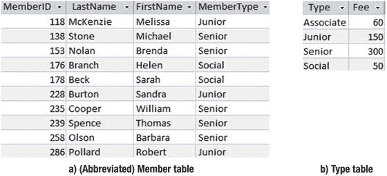
*图 3-1. 数据库中的两个永久表*

由笛卡尔积产生的虚拟表将包含来自两个源表的每一列。结果表中的行由原始表中行的每一种组合构成。图 3-2 显示了笛卡尔积的前几行。

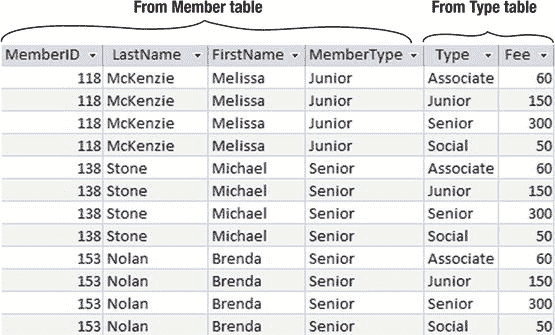
*图 3-2. Member 和 Type 表之间笛卡尔积的前几行*

我们有来自 `Member` 表的四列和来自 `Type` 表的两列，总共六列。来自 `Member` 表的每一行在结果表中与来自 `Type` 表的每一行并排出现。Melissa McKenzie 出现在四行中 —— 分别与 `Type` 表中的四行（Associate、Junior、Senior、Social）各出现一次。总行数将是两个表的行数相乘；换句话说，对于这个简化的 `Member` 表，我们有 10 行乘以 4 行（来自 `Type`），总计 40 行。笛卡尔积可能产生非常、非常大的结果表，这就是为什么它们本身不能给我们提供太多有用信息的原因。

笛卡尔积操作在 SQL 中用 `CROSS JOIN` 表示。用于检索图 3-2 所示数据的 SQL 是：

```sql
SELECT *
FROM Member m CROSS JOIN Type t;
```

并非所有版本的 SQL 都支持相同的关键词和短语（例如，Microsoft Access 2013 不支持 `CROSS JOIN` 关键短语）。1992 年，代表一些关系代数操作（如 `CROSS JOIN`）的关键词被添加到 SQL 标准中¹，此后已经历了多次更新。然而，并非所有供应商都采纳了标准的全部内容，而其他供应商则提供了额外的功能。本章稍后我们将探讨结果式方法，以提供等效的查询表达方式，这些方式在关系代数操作关键词不可用时也能使用。


##### 内连接

如果你查看图 3-2 中的表格，你会发现大多数行都毫无意义。例如，第一、第三和第四行将初级会员 Melissa McKenzie 与助理、高级和社交会员类型的信息放在一起。很难看出这些行有什么用处。然而，第二行——两个表中的会员类型匹配的那一行——是有用的，因为它让我们看到了 Melissa 支付的费用。如果我们只取 `MemberType` 列的值与 `Type` 列的值匹配的那一部分行，那么我们就得到了关于每位会员费用的有用信息。图 3-3 展示了我们想要保留的行。

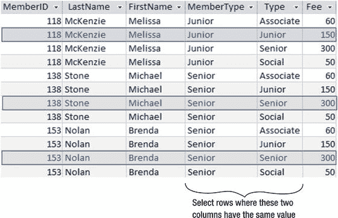

图 3-3.
笛卡尔积之后选择一个行子集

图 3-3 所示的操作（笛卡尔积后选择行的子集）被称为内连接（通常简称为连接）。我们用来选择行的条件称为连接条件。图 3-3 中内连接的 SQL 是：

```sql
SELECT *
FROM Member m INNER JOIN Type t ON m.MemberType = t.Type;
```

使用了关键字 `INNER JOIN`，我们可以在关键字 `ON` 之后看到选择行的条件。再次提醒，你可能会发现某些 SQL 版本不支持 `INNER JOIN` 这个短语；不过，我们将在本章后面看到其他表达此查询的方法。

我们正在比较的两个列（`MemberType` 和 `Type`）必须是连接兼容的。形式上，这意味着它们必须来自同一个域或一组可能的值。实际上，连接兼容性通常意味着两个表中的列具有相同的数据类型。例如，两个列都将是整数或都是日期。不同的数据库产品对连接兼容性的解释可能不同。有些可能允许你连接一个表中的浮点数（带小数点的数字）和另一个表中的整数。有些可能对文本字段是否长度相同很挑剔（例如 `CHAR(10)` 或 `CHAR(15)`），而其他则不然。我建议你不要尝试连接不同类型的字段，除非你非常清楚你的特定产品会怎么做。一如既往，最好的策略是在设计表时仔细思考。那些可能被连接的属性应该具有相同的类型。

### 连接的结果方法

让我们来看一下使用结果方法 的连接。我们不会关注如何组合表，而是关注检索到的行必须满足什么标准。

让我们从笛卡尔积开始：我们想要一组由每个贡献表的行组合而成的行。图 3-4 展示了我们如何设想这一点。我们正在查看两个表，所以需要两根手指来跟踪行。手指 `m` 依次查看 `Member` 表的每一行。目前它指向第 3 行。对于 `Member` 表中的每一行，手指 `t` 将指向 `Type` 表中的每一行。对于笛卡尔积，我们保留行的每一种组合。就图 3-4 而言，笛卡尔积可以用自然语言表达为：

> 我会写出来自行 `m` 的所有属性和来自行 `t` 的所有属性，只要 `m` 来自 `Member` 表且 `t` 来自 `Type` 表。

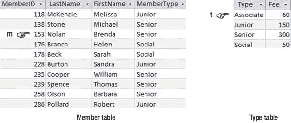

图 3-4.
行变量 m 和 t 分别指向 Member 表和 Types 表中的每一行

图 3-4 所表示的查询的 SQL（其结果如图 3-2 所示）是：

```sql
SELECT *
FROM Member m, Type t;
```

前面的语句将返回与我们之前使用 `CROSS JOIN` 短语的表达式相同的行。

对于连接，我们有一个额外的条件：我们只想检索那些来自每个表的会员类型相同的行组合。我们可以用自然语言表达为：

> 我会写出来自行 `m` 的所有属性和来自行 `t` 的所有属性，只要 `m` 来自 `Member` 表且 t 来自 Type 表，并且 `m.MemberType = t.Type`。

图 3-5 中描绘的一对行满足该条件，因此将被检索。如果 `m` 保持原位而 `t` 向下移动一行，则该条件将不再满足，新的组合将不会被包括。

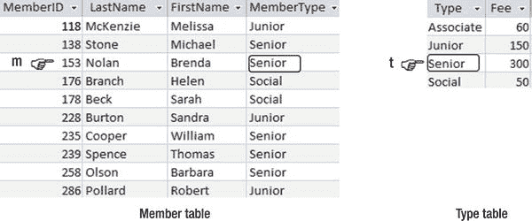

图 3-5.
将在 m.MemberType = t.Type 时检索行

我们可以将图 3-5 描述的查询转化为 SQL 如下：

```sql
SELECT *
FROM Member m, Type t
WHERE m.MemberType = t.Type;
```

如果我们仔细查看前面的语句，可以看到前两行代表笛卡尔积，而最后一行中的 `WHERE` 子句正在选择会员类型相同的行的子集。这正是我们在上一节定义内连接的方式。前面的语句将产生与我们之前用于内连接的语句相同的行，再次展示如下：

```sql
SELECT *
FROM Member m INNER JOIN Type t ON m.MemberType = t.Type;
```

第一个语句说明了要检索的行是什么样子（结果方法），第二个语句表达了我们应该使用什么操作来检索这些行（过程方法）。你用哪一个并不重要——这仅仅取决于你如何思考这个查询。有时，表达查询的方式可能会影响性能，我们将在第 9 章更详细地讨论这一点。实际上，大多数数据库产品在优化或寻找执行查询的最快方式方面都非常智能，无论你如何表达它。例如，在 SQL Server 中，所示连接的两种表达式是以相同方式执行的。事实上，在 SQL Server 2013 中，如果你将第一个语句中的代码输入到用于创建视图的默认界面中，它将被使用 `INNER JOIN` 短语的代码所替换。

### 扩展连接查询

现在我们已将连接添加到我们的操作库中，我们可以执行多种类型的查询。因为连接的结果（与任何操作一样）是另一个表，所以我们可以将该结果连接到第三个表（然后再连接另一个表），然后选择并投影行和列以获得所需的结果。

让我们看一个使用图 3-6 中表的例子。`Entry` 表使用两个外键（`MemberID` 和 `TourID`）来维护哪些会员参加了不同比赛的信息。`Entry` 表的第一行表示会员 118 在 2014 年参加了第 24 场比赛。如果我们需要任何额外的信息（例如会员姓名或比赛名称），我们需要使用外键分别在 `Member` 表和 `Tournament` 表 中找到相应的行。

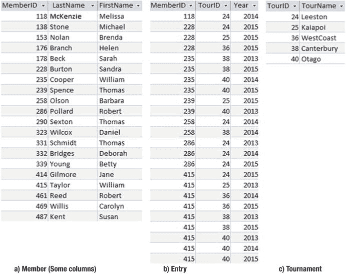

图 3-6.
俱乐部数据库中的永久表

让我们找出 2014 年参加 Leeston 比赛的每个人的姓名。我将描述两种不同的方法，你可能会发现其中一种比另一种更吸引你。


#### 过程方法

我们从三个表开始，因此需要一些能够组合来自多个表数据的操作。我们可以将 `Member` 表连接到 `Entry` 表，再将其结果连接到 `Tournament` 表，如图 3-7 所示。

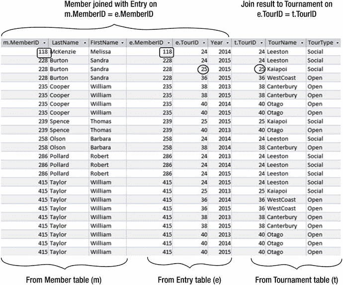

图 3-7.
连接 Member、Entry 和 Tournament 表

`Member` 表和 `Entry` 表之间第一个连接的条件是 `m.MemberID = e.MemberID`，如图 3-7 中的矩形框所示。对于第一次连接的结果与 `Tournament` 表之间的第二个连接，条件是 `e.TourID = t.TourID`，如图中的圆形所示。如果我们选择先连接 `Entry` 和 `Tournament`，然后再将结果连接到 `Member`，结果是一样的。

执行这两个连接的 SQL 是：

```sql
SELECT *
FROM (Member m INNER JOIN Entry e ON m.MemberID = e.MemberID)
INNER JOIN Tournament t ON e.TourID = t.TourID;
```

该查询中两次连接产生的虚拟表包含了回答我们问题所需的所有信息。我们只需通过添加一个 `WHERE` 子句来选择满足年份和锦标赛名称条件的行，然后通过在 `SELECT` 子句中指定姓名属性来投影。用于返回 2014 年 Leeston 锦标赛所有参赛者姓名的完整 SQL 查询是：

```sql
SELECT LastName, FirstName
FROM (Member m INNER JOIN Entry e ON m.MemberID = e.MemberID)
INNER JOIN Tournament t ON e.TourID = t.TourID
WHERE TourName = 'Leeston'
AND Year = 2014;
```

#### 操作顺序

在上一节的描述中，我们首先连接了所有表，然后选择了合适的行和列。连接的结果是一个中间表（如图 3-7 所示），如果会员和锦标赛数量很多，这个表可能会非常大。我们本可以以不同的顺序执行操作。我们可以先从 `Tournament` 表中仅选择 Leeston 锦标赛，并从 `Entry` 表中选择 2014 年的锦标赛，如图 3-8 所示。将这两个较小的表相互连接，然后再将结果与 `Member` 表连接，将产生一个小得多的中间表。

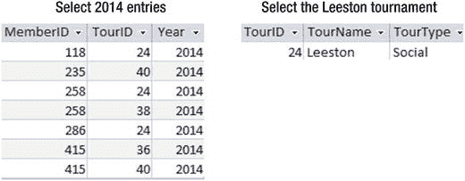

图 3-8.
在连接之前从 Entry 和 Tournament 表中选择行

那么，我们是否应该担心操作的顺序呢？答案是“是的”——操作顺序会产生巨大的差异——但如果你使用的是 SQL，那么这就不是你需要担心的问题。SQL 语句始终是相同的，只是表的顺序可能不同。SQL 语句被发送到你所使用的任何数据库程序的引擎中，查询会被优化。这意味着数据库程序会找出执行操作的最佳顺序。有些产品在这方面做得非常好，有些则不然。许多产品都提供了分析工具，可以让你查看操作的执行顺序。对于许多查询来说，以不同方式编写 SQL 并没有太大区别，但你可以通过为表提供索引来使操作更高效。我们将在第 9 章更仔细地研究这些问题。

#### 结果方法

我们编写 SQL 语句的方式通常不影响查询效率的原因是，SQL 基本上是基于关系演算的，关系演算描述了检索行必须满足的标准。最初的 SQL 标准甚至没有 `INNER JOIN` 这样的关键字。没有这些关键字的 SQL 语句描述了检索行应该是什么样子，因此它们关于如何实现（how）没有任何说明。让我们来看一种结果方法，用于查找 2014 年参加 Leeston 锦标赛的会员姓名。

我们想从 `Member` 表中只检索一些姓名。忘记连接，想一想，如果你被展示了这三个表，并且对数据库、外键、连接等一无所知，你如何知道是否应该检索某个特定的姓名？想象一个手指 `m` 在表中向下追踪，如图 3-9 所示。

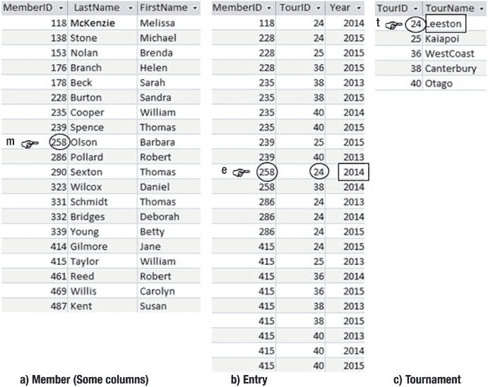

图 3-9.
使用行变量描述满足查询条件的行

我们想写出 Barbara Olson 吗？即手指 `m` 当前指向的姓名。我们怎么知道呢？首先，我们必须在 `Entry` 表中找到一个 2014 年、其 ID（235）与她匹配的行，就像手指 `e` 指向的那行。然后，我们必须在 `Tournament` 表中找到一个具有该锦标赛 ID（24）的行，并检查它是否是 Leeston 锦标赛。观察图 3-9，我们看到三个手指指向的行提供了足够的信息，让我们知道 Barbara Olson 确实在 2014 年参加了 Leeston 锦标赛。这组条件描述了结果表中一行应该是什么样子。

现在让我们把上一段写得更简洁一些。参考图 3-9 中标记的行，阅读以下句子：

> 我会写出来自行 `m` 的姓名，其中 m 来自 `Member` 表，前提是存在一个 `Entry` 表中的行 e，满足 `m.MemberID` 与 `e.MemberID` 相同，且 `e.Year` 为 2014，并且同时存在一个 `Tournament` 表中的行 t，满足 `e.TourID` 与 `t.TourId` 相同，且 `t.TourName` 的值为 “Leeston”。

上述 SQL 反映了前一段的描述。请仔细参考图 3-9 查看以下语句：

```sql
SELECT m.LastName, m.FirstName
FROM Member m, Entry e, Tournament t
WHERE m.MemberID = e.MemberID
AND e.TourID = t.TourID
AND t.TourName = 'Leeston' AND e.Year = 2014;
```

你可以看到 SQL 语句如何描述检索到的行应该是什么样子。如果你仔细观察该语句，也可以找出其中的操作。第二行（`FROM` 子句）是一个大的笛卡尔积，接下来两行是连接条件（这将产生一个类似于图 3-7 的表），最后一行选择具有适当年份和锦标赛名称的行，而 `SELECT` 子句行告诉我们仅投影姓名。

前面的 SQL 语句等同于使用 `INNER JOIN` 关键字的语句。它们都将返回相同的行集：一个反映了底层如何操作（how）的过程，另一个反映了底层是什么结果（what）。

#### 通过图形界面表达连接

本书是关于 SQL 查询的，但大多数数据库产品也提供图形界面来表达查询。为了完整性，我将展示一个典型的图形界面是什么样子，用于检索 2014 年参加 Leeston 锦标赛的会员姓名。

图 3-10 展示了 Microsoft Access 界面，但大多数产品都有非常相似的东西。表由顶部区域的矩形表示，线条显示它们之间的连接。要检索的列在标记为 `Show` 的行中有一个勾选标记 (√)，而选择特定行的条件在标记为 `Criteria` 的行的相关字段中显示。

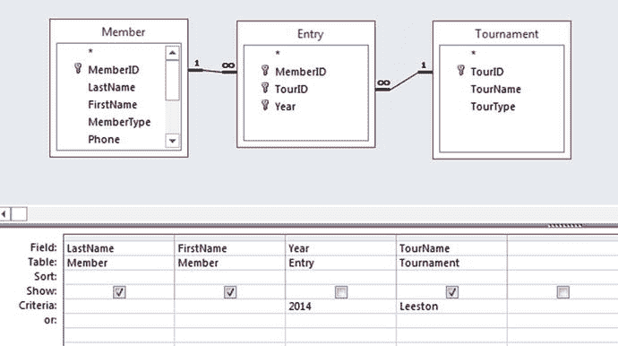

图 3-10.
用于查询 2014 年参加 Leeston 锦标赛会员姓名的 Microsoft Access 图形界面


### 其他类型的连接

本章我们一直在看的连接是等值连接。等值连接是指连接条件中包含等号运算符的连接，例如 `m.MemberID = e.MemberID`。这是最常见的条件类型，但你也可以使用不同的运算符。连接本质上是笛卡尔积运算之后再选择行的子集，而选择条件可以包含不同的比较运算符（例如 `<>` 或 `>`）以及逻辑运算符（例如 `AND` 或 `NOT`）。这类连接并不十分常见。

你可能还会遇到自然连接。自然连接假设你将在两个表中名称相同的列上进行连接。连接条件是这两个同名列的值相等，并且结果中将移除其中一个列。例如：

```sql
SELECT * FROM
Member NATURAL JOIN Entry;
```

这将产生几乎与以下查询相同的输出：

```sql
SELECT * FROM
Member m INNER JOIN Entry e ON m.MemberID = e.MemberID;
```

在自然连接语句中，连接条件被隐式地假定为两个同名属性 `MemberID` 之间的相等。两个查询唯一的区别在于，自然连接只会返回一个 `MemberID` 列。Oracle 支持自然连接，但 SQL Server 和 Access 不支持。

### 外连接

有一种连接你将会大量使用并且理解它非常重要，那就是外连接。理解外连接的最好方法是看它们在哪些场景下有用。请看一下图 3-11 中（修改后的）`Member` 和 `Type` 表。

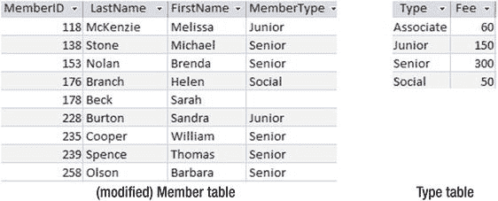

图 3-11. Member 和 Type 表

你可能希望从 `Member` 表生成不同的列表，例如编号和姓名、姓名和会员类型等等。在这些列表中，你期望看到所有会员（对于图 3-11 中的表，应为九行）。然后你可能会想，除了在会员列表中看到编号和姓名外，你还想包括会员费。你连接这两个表（条件为 `MemberType = Type`），结果发现你“丢失”了一位会员——Sarah Beck（见图 3-12）。

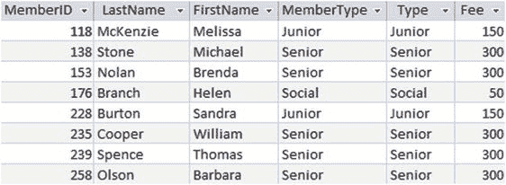

图 3-12. Member 和 Type 表的内连接，我们“丢失”了 Sarah Beck

原因在于，Sarah 在 `Member` 表中的 `MemberType` 字段没有值。让我们看一下笛卡尔积，这是执行连接的第一步。图 3-13 显示了包含 Sarah 的笛卡尔积中的那些行。

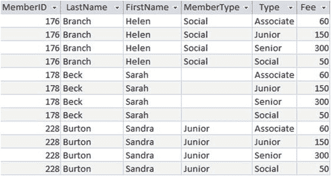

图 3-13. Member 和 Type 表之间笛卡尔积的一部分

完成笛卡尔积后，我们现在需要执行连接操作的最后一步，即应用条件 (`MemberType = Type`)。如图 3-13 所示，没有任何一行 Sarah Beck 的记录满足此条件，因为她的 `MemberType` 是 null 或空值。

考虑以下两个自然语言问题：“获取会员的费用”和“获取包括费用在内的所有会员信息”。第一个问题隐含的意思是“只给我那些有费用的会员”，而第二个问题的感觉更像是“给我所有会员，如果有费用信息就包含进来”。编写查询时最大的困难之一就是试图准确确定你到底想要什么！如果你想理解别人在问什么，那就更难了！

假设我们实际想要的是所有会员的列表，并且在能找到费用信息的地方包含该信息。在这种情况下，我们希望看到 Sarah Beck 包含在结果中，但不显示费用。这就是外连接的作用。外连接有三种类型：左外连接、右外连接和全外连接。左外连接检索左表中的所有行，包括连接字段为 null 的行，如图 3-14 所示。我们看到，除了内连接（图 3-12）中的所有行外，我们还多了一行来自 `Member` 表的 Sarah 的记录，她的连接字段 `MemberType` 为 null。该行中本应来自右侧表（`Type` 和 `Fee`）的字段值为 null。

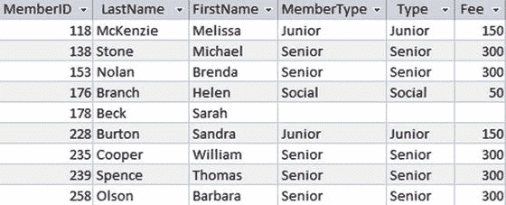

图 3-14. Member 和 Type 表左外连接的结果

图 3-14 所示外连接的 SQL 与内连接类似，但关键短语 `INNER JOIN` 被替换为 `LEFT OUTER JOIN`（或者在一些应用程序中简写为 `LEFT JOIN`）：

```sql
SELECT *
FROM Member m LEFT OUTER JOIN Type t ON m.MemberType = t.Type;
```

你可能会非常合理地指出，如果所有会员的 `MemberType` 字段都有值（他们本应该如此），我们就不需要外连接了。对于这个案例来说，这可能是真的——但请记住我在第 2 章中关于“不应假设本应有数据的字段就一定会有数据”的告诫。在其他情况下，连接字段中的数据可能确实合法地为空。在后面的章节中，我们将看到类似“列出所有会员及其教练姓名——如果有教练的话”这样的查询。因为该用外连接时却使用了内连接而“丢失”行，是一个非常常见的问题，而且有时很难发现。

那么右外连接和全外连接呢？左外连接和右外连接是相同的，只是取决于你在连接语句中放置表的顺序。以下 SQL 语句将返回与图 3-14 所示相同的信息，尽管列的显示顺序可能不同：

```sql
SELECT *
FROM Type t RIGHT OUTER JOIN Member m ON m.MemberType = t.Type;
```

我们只是在连接语句中交换了表的顺序。右表（`Member`）连接字段为 null 的任何行都将被包含进来。

全外连接将保留任一表中连接字段为 null 的行。全外连接的 SQL 如下所示，将产生图 3-15 中的表：

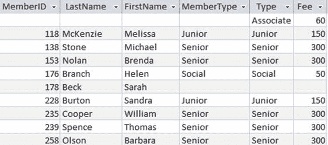

图 3-15. Member 和 Type 表全外连接的结果

```sql
SELECT *
FROM Member m FULL OUTER JOIN Type t ON m.MemberType = t.Type;
```

我们有一行 Sarah Beck 的记录，其来自 `Type` 表的缺失列用 null 值填充。我们还有第一行，显示了关于 Associate 会员类型的信息，尽管 `Member` 表中没有 Associate 会员类型的记录。在该行中，来自 `Member` 表的每个缺失值都被替换为 null。

并非所有 SQL 实现都明确支持全外连接。Access 2013 就不支持。然而，在 SQL 中总有替代方法来检索你需要的信息。在第 7 章，我将向你展示如何通过使用 UNION 运算符在左外连接和右外连接之间进行操作来获得等效于全外连接的结果（我就是这样得到图 3-15 的屏幕截图的！）。

### 概要

笛卡尔积（Cartesian product）用于组合两个表。结果表包含来自两个表的每一列，并且包含来自相关表的每一行组合。体现过程方法（process approach）的笛卡尔积 SQL 如下：

```sql
SELECT *
FROM <table1> CROSS JOIN <table2>;
```

体现结果方法（outcome approach）的内连接（inner join） SQL 如下：

```sql
SELECT *
FROM <table1>, <table2>;
```

内连接从笛卡尔积开始，然后连接条件（join condition）决定将保留来自两个相关表的哪些行组合。

体现过程方法的内连接 SQL 如下：

```sql
SELECT *
FROM <table1> INNER JOIN <table2>
ON <table1.column> = <table2.column>;
```

体现结果方法的内连接 SQL 如下：

```sql
SELECT *...
FROM <table1>, <table2>
WHERE <table1.column> = <table2.column>;
```

如果其中一个（或两个）表在连接条件涉及的字段中包含为空（null）的行，则该行不会出现在内连接的结果中。如果需要该行，可以使用外连接（outer join）。

以下 SQL 将保留左表中的所有行，包括连接字段为 null 的行：

```sql
SELECT *
FROM <table1> LEFT OUTER JOIN <table2>
ON <table1.column> = <table2.column>;
```

类似的表达也适用于右外连接（right outer join）和全外连接（full outer join）。

脚注 1

国际标准化组织（International Organization for Standardization）。信息技术 — 数据库语言 — SQL。ISO, Geneva, Switzerland, 1992。 ISO/IEC 9075:1992。

