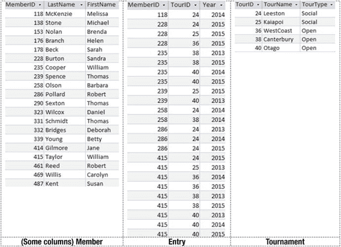
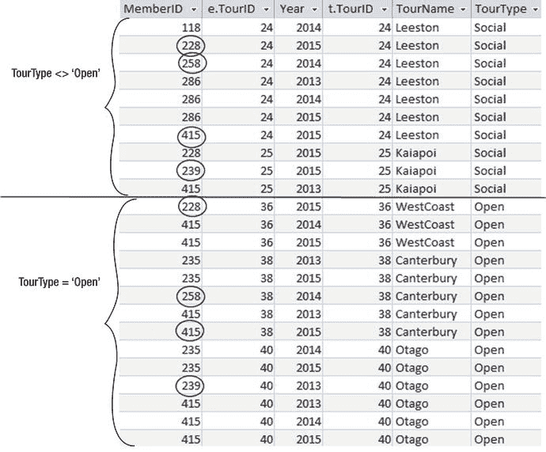
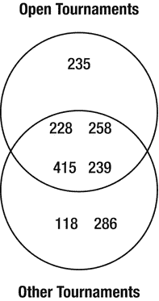
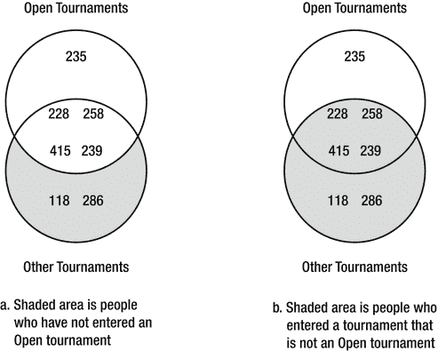
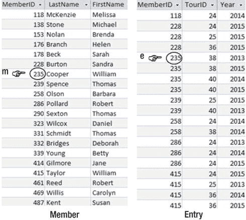
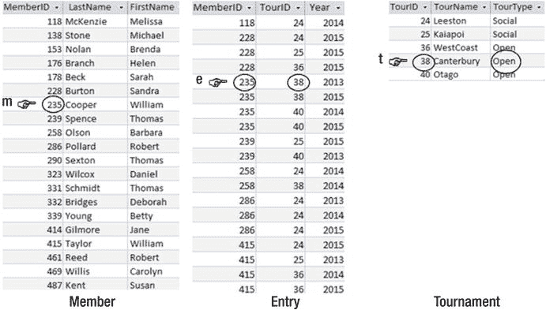
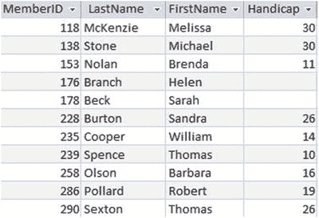
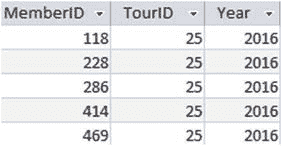

# 4. 子查询

在前面的章节中，我们研究了从单个表中检索部分行和列，也研究了如何使用笛卡尔积和连接从两个或多个表中检索数据。在许多例子中，我们可以构建截然不同的 SQL 查询来产生相同的结果。根据上下文或问题，你可能会发现某种方法感觉更自然。

随着查询变得越来越复杂，我们可能会发现我们可以为查询的某个小部分想到 SQL 表达式，但无法一次性为整个查询想到。我们可以在一个 SQL 语句中返回查询数据，然后用另一个查询引用该数据。这种在查询中嵌套查询的想法非常强大。你会听到这个概念被称为查询和子查询（query and subquery）、内部和外部查询（inner and outer queries）或嵌套查询（nested queries）。

在本章中，我们将研究子查询和两个新的 SQL 关键字：`EXISTS` 和 `IN`。我们将看到如何使用子查询作为处理我们已经做过的某些查询的替代方法，以及嵌套如何开启其他可能性。

### IN 关键字

`IN` 关键字允许我们从表中选择行，其中条件允许一个属性具有多个值之一。例如，如果我们想从 `Entry` 表中检索赛事 ID 为 36、38 或 40 的行中的成员 ID，我们可以使用布尔 `OR` 运算符，如下所示：

```sql
SELECT e.MemberID
FROM Entry e
WHERE e.TourID = 36 OR e.TourID = 38 OR e.TourID = 40;
```

显然，随着可能选项数量的增加，这类语句会变得难以管理。使用 `IN` 关键字，我们可以构建一个更紧凑的语句，将可能的值集合括在括号中并用逗号分隔。在以下查询中，会检查 `Entry` 的每一行，如果 `TourID` 是括号中的值之一，则 `WHERE` 条件为真，并返回该行：

```sql
SELECT e.MemberID
FROM Entry e
WHERE e.TourID IN (36, 38, 40);
```

可以将 `IN` 与逻辑运算符 `NOT` 结合使用。但是，你需要非常小心。考虑以下查询：

```sql
SELECT e.MemberID
FROM Entry e
WHERE e.TourID NOT IN (36, 38, 40);
```

前面的查询将返回参加了任何不在列表中的赛事的成员 ID。但请注意，这些成员也可能参加了列表中的某个赛事。我们将在本章后面研究如何准确回答“谁没有参加这些赛事”之类的问题。

### 与子查询一起使用 IN

`IN` 关键字的真正用处在于我们可以使用另一个 SQL 语句来生成值集合。例如，某人可能对赛事 36、38 和 40 感兴趣的原因可能是因为它们是当前的公开赛（Open tournaments）。我们可以使用另一个 SQL 查询来生成所需的值集合，而不用单独列出公开赛。每次运行查询时都会重建列表，因此随着数据变化，公开赛集合将保持最新。

让我们看一个使用查询为 `IN` 子句生成值集合的具体例子。我在图 4-1 中重现了 `Member` 表的几列以及 `Entry` 和 `Tournament` 表。



图 4-1.

Member、Entry 和 Tournament 表

生成公开赛赛事 ID 集合的查询是：

```sql
SELECT t.TourID
FROM Tournament t
WHERE t.TourType = 'Open';
```

现在我们可以将前面查询中的显式值列表（36, 38, 40）替换为前面的 SQL 语句：

```sql
SELECT e.MemberID
FROM Entry e
WHERE e.TourID IN (
    SELECT t.TourID
    FROM Tournament t
    WHERE t.TourType = 'Open');
```

括号内的 `SELECT` 语句有时被称为子查询（subquery）。为了与 `IN` 关键字正确配合，查询的内部必须返回单个值的列表。我缩进它只是为了更容易阅读（SQL 会忽略添加的空白）。你可以通过“由内而外”地阅读来理解嵌套查询。内部的 `SELECT` 语句从 `Tournament` 表中检索所需的赛事 ID 集合，然后外部的 `SELECT` 从 `Entry` 表中为我们找到所有该集合中的赛事的条目。

为了帮助理解，可以向 SQL 语句添加注释。在以下语句中，以 `--` 开头的行是注释，将被忽略。也可以使用 `/*` 和 `*/` 包围多行代码块。

```sql
SELECT e.MemberID
FROM Entry e
WHERE e.TourID IN (
    -- 子查询返回公开赛的 ID
    SELECT t.TourID
    FROM Tournament t
    WHERE t.TourType = 'Open');
```

再看一下图 4-1 中的表。我们还能如何检索公开赛的条目？我们在前一章使用连接进行了类似的查询。我们可以连接两个表 `Entry` 和 `Tournament`，连接条件是它们的公共字段 `TourID`，只选择公开赛的那些行，然后投影 `MemberID` 列。请看下面：

```sql
SELECT e.MemberID
FROM Entry e INNER JOIN Tournament t ON e.TourID = t.TourID
WHERE t.TourType = 'Open';
```

带子查询和不带子查询的 SQL 语句检索相同的信息。正如我已经说过很多次的，在 SQL 中编写查询通常有几种不同的方法。你熟悉的方法越多，就越有可能找到表达复杂查询的方法。


### 谨慎使用 `NOT` 和 `<>`

除了询问诸如“已参加公开赛的会员 ID 有哪些？”这样的问题外，我们同样可能想知道“未参加公开赛的会员 ID 有哪些？”。两者听起来非常相似，但一旦在问题中使用否定词，我们就必须非常清楚自己真正的意图。在第 7 章中，我们将探讨如何使用集合运算来构造查询，但为了保持本章内容的完整性，我将特别讨论否定词对子查询使用的影响。

在上一节中，我们为检索已参加公开赛的会员的会员 ID 构建了两条 SQL 语句。一条使用了子查询，另一条使用了联结。为了查找谁没有参加公开赛，有人可能会尝试在子查询示例中将 `IN` 改为 `NOT IN`，如下所示：

```sql
SELECT e.MemberID
FROM Entry e
WHERE e.TourID NOT IN
(SELECT t.TourID
FROM Tournament t
WHERE t.TourType = 'Open');
```

在联结示例中，人们倾向于将 `t.TourType = 'Open'` 修改为 `t.TourType <> 'Open'`：

```sql
SELECT e.MemberID
FROM Entry e INNER JOIN Tournament t ON e.TourID = t.TourID
WHERE t.TourType <> 'Open';
```

仔细思考一下这两条查询会返回哪些行。事实上，它们返回的是同一组行，但这组行可能既包括参加了公开赛的会员，也包括未参加的。

图 4-2 中的表格显示了 `Entry` 和 `Tournament` 表内联结的结果。底部的一组行都对应公开赛，这些行会被条件为 `WHERE t.TourType = 'Open'` 的查询检索到。顶部的一组条目对应公开赛以外的比赛，这些行会被条件为 `WHERE t.TourType <> 'Open'` 的查询检索到。



图 4-2. TourType = ‘Open’ 与 TourType <> ‘Open’ 的对比

我们可以看到，一些会员（用圆圈标出）同时出现在两个集合中。图 4-3 是对图 4-2 表格中信息的另一种呈现方式，但它显示的是两组会员而非条目：上面的圆圈代表参加了公开赛的会员，下面的圆圈代表参加了非公开赛的会员。有四名会员同时属于这两个集合。



图 4-3. 参加了公开赛、其他比赛或两者都参加了的会员

现在让我们回到最初的问题。哪些会员没有参加过公开赛？我们必须小心区分图 4-4 所描绘的两个集合。



图 4-4. 谨慎区分这两种情况的 SQL 至关重要

图 4-4a 显示的是从未参加过任何公开赛的人员集合。图 4-4b 显示的是那些参加了非公开赛的会员（但不排除他们可能同时也参加了公开赛）。例如，会员 118 从未参加过公开赛，而会员 228 既参加过公开赛，也参加过其他类型的比赛。

本节开头的两条查询都将检索到图 4-4b 所示的会员集合。会员 228（他参加过公开赛）会被返回（因为他参加过一个非公开赛）。这不是我们想要的结果，并且是一个非常常见的错误。

要判断某人是否参加了公开赛，我们只需要找到一个匹配的条目。要判断某人是否没有参加过公开赛，我们需要检查所有的公开赛条目，以确保该会员没有出现。

就图 4-2 中的联结表而言，查找那些参加了公开赛的人员只需要一个简单的 `WHERE` 子句：`WHERE t.TourType = 'Open'`。请记住，为了确定是否满足 `WHERE` 子句中的条件，会独立检查每一行。然而，要查找没有参加过公开赛的人员，我们需要检查表中的每一行，以确保某个特定会员没有条目。这是一个复杂得多的任务。事实上，我们还需要考虑从未参加过任何比赛的会员。这些会员的 ID 根本不会出现在 `Entry` 表中，因此我们还必须检查 `Member` 表以获取完整的列表。

查找未参加过公开赛的会员可以通过使用第 7 章中的集合运算采用过程式方法实现。但是，我们也可以使用结果导向的方法来构建准确的查询。为此，我们需要首先介绍 `EXISTS` 关键字。


### EXISTS 关键字

让我们从一个简单的问题开始。例如，“所有曾参加过任何锦标赛的成员姓名是什么？”我们可以先从思考`Member`表中哪些行满足问题条件入手。请结合以下句子和图 4-5 一起思考：

> 如果`Entry`表中存在行`e`，使得`m.MemberID = e.MemberID`，我将输出来自行`m`的姓名，其中`m`来自`Member`表。


图 4-5. 威廉·库珀已参加锦标赛，因为在`Entry`表中存在匹配的行

我们可以使用关键字`EXISTS`，将该语句

> 如果`Entry`表中存在行`e`，使得`m.MemberID = e.MemberID`，我将输出来自行`m`的姓名，其中`m`来自`Member`表。

几乎直接转换为 SQL：

```sql
SELECT m.LastName, m.FirstName
FROM Member m
WHERE EXISTS
(SELECT * FROM Entry e WHERE e.MemberID = m.MemberID);
```

这是嵌套查询的另一个例子，其中我们有两个 SQL `SELECT`语句，一个嵌套在另一个内部。这个例子与本章前面看到的较简单的例子略有不同。内部查询中的`WHERE`条件引用了外部查询正在考虑的部分行；即`e.MemberID = m.MemberID`。我发现解释这些嵌套查询最简单的方法是参考像图 4-5 这样的图表。变量`m`正在检查`Member`表中的每一行。内部查询正在`Entry`表中查找一个`MemberID`与当前正在考虑的`Member`表行具有相同值的行。如果存在这样的行（或多个这样的行），那么我们就成功了。

对于那些认为这似乎是获取简单结果的复杂方法的读者，你们是对的（部分）。使用`EXISTS`子句的查询与基于`MemberID`的`Member`和`Entry`之间的内连接所检索到的成员是相同的。

但是，如果我们想要那些没有参加过锦标赛的成员呢？这只需要对我们的新 SQL 查询进行微小的更改。我们现在不是查找在`Entry`中存在匹配行的成员，而是要查找不存在匹配行的成员。在之前的 SQL 语句中加上`NOT`一词就能得到我们需要的结果：

```sql
SELECT m.Lastname, m.FirstName
FROM Member m
WHERE NOT EXISTS
(SELECT * FROM Entry e WHERE e.MemberID = m.MemberID);
```

`NOT EXISTS`结构将遍历`Entry`表中的每一行`e`，检查是否存在与当前`Member`表行的`MemberID`匹配的行。只有在未找到匹配行时，才会检索出该成员的姓名。

现在我们有足够的条件来处理关于未参加过公开赛的成员的查询。查看图 4-6 以决定威廉·库珀是否应包含在结果中。


图 4-6. 威廉·库珀确实存在一条公开赛的参赛记录

图 4-6 中指示的行显示，威廉·库珀确实存在一条参赛记录，因此我们不会将他包含在我们的结果中。

现在，看这个描述图 4-6 的自然语言陈述：

> 我将输出来自行`m`的姓名，其中`m`来自`Member`表，前提是不存在（`Entry`表中的一行`e`满足`m.MemberID = e.MemberID`，同时`Tournament`表中的一行`t`满足`e.TourID = t.TourID and t.TourType = 'Open'`）

反映上述陈述的 SQL 是：

```sql
SELECT m.Lastname, m.FirstName
FROM Member m
WHERE NOT EXISTS
(SELECT * FROM Entry e, Tournament t
WHERE m.MemberID = e.MemberID
AND e.TourID = t.TourID AND t.TourType = 'Open');
```

当我们第 7 章介绍集合操作时，将看看处理此类查询的过程方法。

### 不同类型的子查询

我们在前面的章节中看到了不同类型的子查询。在这里回顾一些选项是有用的。嵌套查询的内部可以返回单个值（例如，芭巴拉的差点）、一组值（例如，公开赛的 ID）或一组行（例如，公开赛的参赛记录）。此外，内部和外部查询可以在某种程度上是独立的，也可以是相关联的。

#### 返回单个值的内部查询

返回单个值的内部查询在简单地检索行子集的情况下通常很有用。让我们考虑我们成员的差点，如图 4-7 所示。


图 4-7. 显示姓名和差点的`Member`表部分

如果我们想找到那些差点小于 16 的成员，那么可以简单地使用以下 SQL 完成：

```sql
SELECT *
FROM Member m
WHERE m.Handicap < 16;
```

如果我们想找到所有差点小于芭巴拉·奥尔森的成员该怎么办？前面的查询可以做到，但前提是芭巴拉 16 的差点不会改变。为了让查询无论芭巴拉当前的差点是多少都能工作，我们可以用内部查询的结果替换单个值 16：

```sql
SELECT *
FROM Member m
WHERE Handicap <
(SELECT Handicap
FROM Member
WHERE LastName = 'Olson' AND FirstName = 'Barbara');
```

我们需要将`Handicap`与单个值进行比较。如果在像这样的情况下，我们的内部查询返回多个值（例如，如果俱乐部里有多个芭巴拉·奥尔森），那么在尝试运行查询时我们会得到错误。

返回单个值的内部查询在我们想要将值与某种聚合进行比较时也很有用。例如，我们可能想找出所有差点低于平均水平的成员。在这种情况下，我们可以使用内部查询返回平均值：

```sql
SELECT *
FROM Member m
WHERE m.Handicap <
(SELECT AVG(Handicap)
FROM Member);
```

如果你慢慢来，可以逐步构建出相当复杂的查询。假设我们想看看是否有任何青少年成员的差点低于成年人的平均水平。内部查询必须返回成年成员的平均差点值，然后我们想选择所有差点低于该值的青少年成员。在下面的 SQL 语句中，内部和外部查询都有额外的`SELECT`条件（内部只检索成年人，外部只检索青少年）：

```sql
SELECT *
FROM Member m
WHERE m.MemberType = 'Junior' AND Handicap < (
SELECT AVG(Handicap)
FROM Member
WHERE MemberType = 'Senior');
```

#### 返回一组值的内部查询

这就是我们本章开始的地方。当我们使用`IN`关键字时，SQL 将期望找到一组单值。例如，我们可能要求`Entry`表中成员 ID`IN`一组值的行。在下面的语句中，内部查询选择所有成年成员的 ID，外部查询返回这些成员的参赛记录：

```sql
SELECT *
FROM Entry e
WHERE e.MemberID IN
(SELECT m.MemberID
FROM Member m
WHERE m.MemberType = 'Senior');
```

此类查询的内部部分必须只返回单个列。`IN`期望一个单值列表（这里是一个`MemberID`列表）。如果内部部分返回多个列（例如，`SELECT * FROM Member`），那么我们将得到错误。

许多像这样的嵌套查询可以用其他方式编写——通常使用本章前面讨论的内连接。有些查询用一种方式感觉更自然，有些则用另一种方式。

#### 检查存在性的内部查询

另一种使用 `EXISTS` 关键字的内部查询。使用 `EXISTS` 的语句仅检查内部查询是否返回了任何行。实际返回的值或行数并不重要。以下查询将返回 `Member` 表中的行，条件是我们能够在 `Entry` 表中找到与该会员对应的行：

```sql
SELECT m.Lastname, m.FirstName
FROM Member m
WHERE EXISTS
(SELECT * FROM Entry e
WHERE e.MemberID = m.MemberID);
```

由于内部查询实际检索的值并不重要，因此内部查询通常采用 `SELECT * FROM` 的形式。

这类查询的另一个特点是内部和外部部分通常是关联的。这意味着内部部分的 `WHERE` 子句引用了外部部分表中的值。在本例中，内部查询检查 `Entry` 表中的当前行是否与外部查询中当前考虑的会员具有相同的 `MemberID`。我发现最直观的理解方式如图 4-5 所示。

很难想象一个有意义的 `EXISTS` 查询，其内部和外部部分的值是不相关联的。思考一下以下查询将返回什么：

```sql
SELECT m.Lastname, m.FirstName
FROM Member m
WHERE EXISTS
(SELECT * FROM Entry e);
```

上面的查询没有任何意义。它的意思是，如果 `Entry` 表中有一行（任何一行！），就写出每个会员的姓名。如果 `Entry` 表是空的，我们将不会得到任何返回；否则，我们将得到所有会员的所有姓名。我想不出为什么你会想这样做。`EXISTS` 查询在我们需要查找其他地方匹配的值时很有用，这就是为什么 `SELECT` 条件需要比较来自内部和外部部分的值。

比较以下两个查询很有趣。它们都返回参加过锦标赛的会员姓名，但结果略有不同。第一个使用 `EXISTS` 子句：

```sql
SELECT m.Lastname
FROM Member m
WHERE EXISTS
(SELECT * FROM Entry e
WHERE e.MemberID = m.MemberID);
```

第二个使用 `INNER JOIN`：

```sql
SELECT m.LastName
FROM Member m INNER JOIN Entry e ON  e.MemberID = m.MemberID;
```

两个查询之间的区别在于返回的行数。

第一个查询检查 `Member` 表中的每一行，如果该会员在 `Entry` 表中至少存在一个条目，则返回其姓氏。任何会员的姓氏只会被写出一次。

第二个查询在两个表之间形成连接，该连接将由 `Member` 和 `Entry` 中具有相同 `MemberID` 的所有行组合构成。特定会员的姓名将被写出的次数等于他或她参加锦标赛的次数。

这是一个微妙但重要的区别，特别是当你想要统计返回的行数时。在第二个示例的 `SELECT` 子句中添加 `DISTINCT` 将使两个查询的结果相同。

### 使用子查询进行更新

本书主要介绍用于检索数据的查询，但许多相同的思想可用于更新数据以及添加或删除记录。在第 1 章中，我们研究了简单的查询，例如更新特定会员的电话号码，如下所示：

```sql
UPDATE Member m
SET m.Phone = '875076'
WHERE m.MemberID = 118;
```

我们还研究了在表中插入和删除行。要插入一行，我们列出要提供值的列，然后是这些值，如下所示：

```sql
INSERT INTO Entry (MemberID, TourID, Year)
VALUES (153, 25, 2016);
```

现在，让我们考虑一种情况：我们想为俱乐部中每位青少年会员添加 2016 年第 25 号锦标赛的一个条目。我们希望向 `Entry` 表添加一组行，如图 4-8 所示，其中左列是每位青少年的会员 ID，接下来的两列是每个条目的特定锦标赛（25）和年份（2016）。



图 4-8. 要添加到 Entry 表中的行

我们可以编写一个 SQL 查询来返回一组类似于图 4-8 的行：

```sql
SELECT m.MemberID, 25, 2016
FROM Member m
WHERE m.MemberType = 'Junior';
```

这个查询与我们之前看到的有些不同，因为它的 `SELECT` 子句中包含常量。它将为每个青少年会员构造一行，包含会员的 ID 以及两个常量 25（代表锦标赛）和 2016（代表年份）。

现在，我们可以将前面的查询作为子查询用于我们的 `INSERT` 查询。我们可以提供子查询产生的一组值，而不是仅使用 `VALUES` 关键字提供一个值。在以下查询中，内部 `SELECT` 将生成图 4-8 中所示的行集，而外部 `INSERT` 会将它们放入 `Entry` 表中：

```sql
INSERT INTO Entry (MemberID, TourID, Year)
-- create an entry in tournament 25, 2016 for each Junior
SELECT MemberID, 25, 2016
FROM Member
WHERE MemberType = 'Junior';
```

使用子查询的同样潜力也适用于其他更新问题。假设，为了找一个例子，在为 2016 年 Kaiapoi 社交锦标赛（锦标赛 25）输入 `Entry` 表数据后，你意识到只允许差点 20 及以上的球员参赛。你可以使用子查询来删除差点小于 20 的会员的条目：

```sql
DELETE FROM Entry
WHERE TourID = 25 AND Year = 2016 AND
MemberID IN
(SELECT MemberID FROM Member WHERE Handicap < 20);
```

### 总结

我们可以在许多情况下将子查询与关键字 `IN` 和 `EXISTS` 结合使用。以下是我们在本章中研究过的情况的总结。

#### 不同类型子查询的示例

许多嵌套查询可以用替代方式编写。在第 9 章中，我们将研究与表达查询的不同方式相关的性能问题，但通常你在设计查询时应该使用你觉得最自然的方式。以下是一些嵌套查询及其替代表达方式的示例。

##### 返回单个值的子查询

查找会员 Cooper 参加的锦标赛：

```sql
SELECT e.TourID, e.Year FROM Entry e WHERE e.MemberID =
(SELECT m.MemberID FROM Member m
WHERE m.LastName = 'Cooper');
```

编写前面查询的另一种方法是使用连接：

```sql
SELECT e.TourID, e.Year
FROM Entry e INNER JOIN Member m ON e.MemberID = m.MemberID
WHERE m.LastName = 'Cooper';
```

##### 返回一组单值的子查询

查找所有公开赛的条目：

```sql
SELECT *
FROM Entry e
WHERE e.TourID IN
(SELECT t.TourID FROM Tournament t
WHERE t.TourType = 'Open');
```

前面的查询可以替换为：

```sql
SELECT e.MemberID, e.TourID, e.Year
FROM Entry e INNER JOIN Tournament t ON e.TourID = t.TourID
WHERE t.TourType = 'Open';
```

##### 检查存在性的子查询

查找参加过任何锦标赛的会员姓名：

```sql
SELECT m.LastName, m.FirstName
FROM Member m
WHERE EXISTS
(SELECT * FROM Entry e
WHERE e.MemberID = m.MemberID);
```

这可以替换为：

```sql
SELECT DISTINCT m.LastName, m.FirstName
FROM Member m INNER JOIN Entry e ON e.MemberID = m.MemberID;
```

#### 子查询不同用途的示例

子查询可用于许多情况，包括以下：

##### 构造带否定的查询

查找未参加锦标赛的会员姓名：

```sql
SELECT * FROM Member m
WHERE NOT EXISTS
(SELECT * FROM Entry e
WHERE e.MemberID = m.MemberID);
```

##### 与聚合结果比较值

查找残疾程度低于平均值的成员姓名：

```sql
SELECT m.LastName, m.FirstName FROM Member m WHERE m.Handicap <
(SELECT AVG(Handicap) FROM Member);
```

##### 更新数据

为 2016 年的 25 号锦标赛中的每位青少年成员在`Entry`表中添加一行：

```sql
INSERT INTO Entry (MemberID, TourID, Year)
SELECT MemberID, 25, 2016
FROM Member WHERE MemberType = 'Junior';
```

