# 5. 自连接

当我们基于 `WHERE` 子句中的条件选择行的子集时，该条件是独立地对每一行进行评估的。一个例子可能是查询查找所有参加了 36 号锦标赛的成员。条件 `TourID = 36` 可以对 `Entry` 表中的每一行进行评估，以获得所需结果。但是，如果我们想查找同时参加了 36 号和 24 号锦标赛的成员，仅通过检查 `Entry` 表的一行是无法做到的。我们需要为同一个成员找到两行（或两个参赛记录）——每个指定锦标赛各一个。一个简单的 `WHERE` 子句无法实现这一点。

在本章中，我们将了解自连接。通过两个表之间的连接，我们首先生成一个笛卡尔积，该积提供了来自每个表的行的组合。在自连接中，我们对同一个表的两个副本做同样的事情。这为我们提供了原始表中成对行的所有组合。这是编写需要来自表中多行信息以满足某些条件的查询的一种方法。它将使我们能够回答涉及“同时”这个词的问题；例如，“哪些成员同时参加了这两个锦标赛？” 自连接还允许我们对涉及自关系的表进行查询。我们先来了解自关系。

#### 自关系

让我们为 `Member` 表添加更多信息。假设一些成员被分配了教练。我们如何在第一章讨论的类图中表示这一点？我们可以采用图[5-1]所示的方法，包含两个类：`Member` 和 `Coach`。回想一下这些线和数字的含义。从左到右，一个教练可能有几个成员要训练（最靠近 `Member` 类的 `0..n`）。从右到左，特定成员可能有一个教练或没有教练（最靠近 `Coach` 类的 `0..1`）。

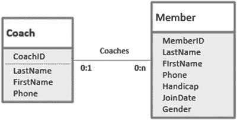

图 5-1.
教练和成员的数据模型（不推荐！）

图[5-1]中模型的问题在于，教练很可能就是俱乐部的成员。当我们使用 `Coach` 表和 `Member` 表来实现此模型时，有些人会在每个表中都有一行记录他们的详细信息。例如，布伦达·诺兰在 `Member` 表中有一行。当她担任教练角色时，我们还需要在 `Coach` 表中有一行关于她的信息。如果布伦达有了新的电话号码，有人必须记得在两个表中都进行更改。极有可能这不会发生，最终我们会在其中一个表中得到旧的号码。

在这个例子中，我们实际上并没有两个独立的成员和教练类。我们只有一个成员类，其中一些成员指导其他成员。这种自关系如图[5-2]所示。

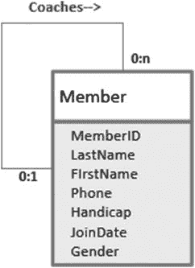

图 5-2.
成员指导其他成员的数据模型

图[5-2]中的关系线可以顺时针方向解读为：特定成员可能指导几个其他成员或没有（`0..n`）。在另一个方向上，我们可以解读为：特定成员可能有一个教练或没有（`0..1`）。

在第一章中，我们展示了如何通过在一端表中添加一个列来表示一对多关系，该列的值来自另一端表的主键。图[5-2]中的模型是完全相同类型的一对多关系，只是我们在两端有相同的表，因此是一个自关系。为了表示这种关系，我们可以在 `Member` 表中添加一个 `Coach` 列，如图[5-3]所示。`Coach` 字段中的值也必须存在于键字段 `MemberID` 中。

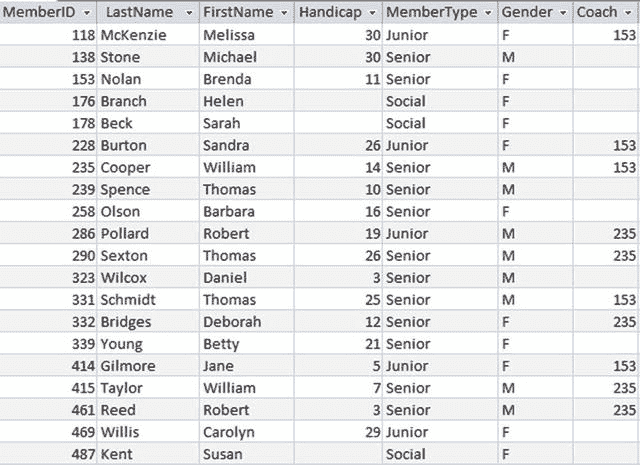

图 5-3.
在 Member 表中添加 Coach 列

图[5-3]表中的第一行告诉我们，梅丽莎由成员 153 指导，从表的第三行可以看到成员 153 是布伦达。我们需要将 `Coach` 字段的值约束为现有的成员之一，这样我们就不会意外地在 `Coach` 列中添加无效的成员编号。我们可以通过将 `Coach` 字段设置为外键来实现这一点。从第一章回忆，外键是一个字段，其中任何非空值必须已经作为另一个表中的主键存在。对于图[5-3]中的表，`MemberType` 是引用 `Type` 表的外键，这意味着 `MemberType` 列中的任何值都必须已经存在于 `Type` 表中。对于 `Coach` 列，“另一个”表是 `Member` 表本身。以下 SQL 语句展示了我们如何使用 `ALTER` 命令添加新的外键列 `Coach`：

```sql
ALTER TABLE Member
ADD Coach INT FOREIGN KEY REFERENCES Member;
```

有了修改后的 `Member` 表，我们现在可以回答几种不同类型的问题。例如：

*   教练的姓名是什么？
*   简·吉尔摩的教练是谁？
*   有没有人被残疾程度更高的人指导？
*   有没有女性被男性指导？

这些问题都无法通过检查表中的单行来回答。我们需要的是对 `Member` 表进行自连接。理解自连接最简单的方法是看看我们如何创建它。

#### 创建自连接

回顾第 3 章中对两个表之间连接的定义：笛卡尔积（两个表中每一行的所有组合）后接对满足某些连接条件的行子集的选取。对于自连接，我们考虑同一个表的两个副本。在图 5-4 中，我们看到了`Member`表两个副本之间笛卡尔积的一部分。为了区分乘积中的不同元素，我为第一个副本起了别名`m`，为第二个副本起了另一个别名`c`（稍后你会明白原因）。在图 5-4 中可见的笛卡尔积的一小部分里，我们看到副本`m`的第一行（Melissa）与副本`c`的每一行进行了配对。一些列标题被截断了，因为表格变得相当宽。

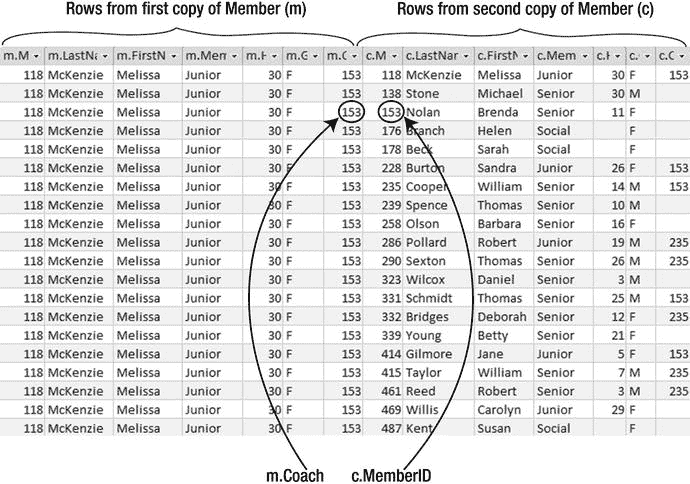
图 5-4. 两个 Member 表副本之间的笛卡尔积

对于关于教练关系的查询，笛卡尔积中令人感兴趣的行是那些来自`m`的`Coach`值与来自`c`的`MemberID`值相同的行。在图 5-4 中，你可以看到第三行包含了关于 Melissa（来自`Member`表的`m`副本）的信息，以及关于她的教练（来自`Member`表的`c`副本）的信息。现在别名的选择变得清晰了：`m`代表与成员相关的列；`c`代表与该成员教练相关的列。选择有用的别名可以使理解自连接变得容易得多。我们希望从笛卡尔积中选取的行是满足`m.Coach = c.MemberID`的行。这是查找成员及其教练信息所需的连接条件。自连接的 SQL 如下：

```sql
SELECT *
FROM Member m INNER JOIN Member c ON m.Coach = c.MemberID;
```

自连接生成的结果表如图 5-5 所示。

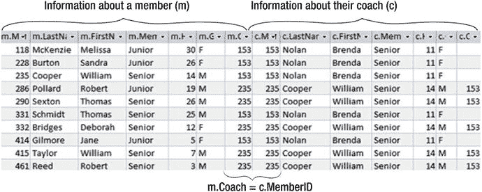
图 5-5. 在 Member 表上执行自连接以检索成员及其教练的信息

现在我们有了自连接的结果，就可以回答上一节中提出的关于教练关系的问题了。其中最棘手的部分是认识到维护成员和教练的信息是一种自关系，并且从一开始就恰当地设计了`Member`表。

#### 涉及自连接的查询

以图 5-5 中的连接表为基础，我们可以通过简单地选取行子集并投影适当的列来回答各种问题。每当我需要执行涉及自连接的查询时，我通常会先进行连接，保留图 5-5 中的所有行和列。有了连接表（或列的快速草图）在面前，接下来的步骤通常相对简单。让我们通过几个问题来看看这是如何工作的。

##### 教练的名字是什么？

观察图 5-5，我们可以看到教练的名字位于来自连接中`c`部分的列中。我们只需要`c.LastName`和`c.FirstName`列中的名字列表，因此这些列可以包含在`SELECT`子句中。我们不希望名字重复，所以使用关键字`DISTINCT`。下面的 SQL 语句将返回两位教练的名字，Brenda Nolan 和 William Cooper。

```sql
SELECT DISTINCT c.FirstName, c.LastName
FROM Member m INNER JOIN Member c ON m.Coach = c.MemberID;
```

##### 谁正在由一个差点杆数更高的人教练？

要找出谁正在由差点杆数更高的人教练，我们需要比较成员的差点杆数（`m.Handicap`）与其教练的差点杆数（`c.Handicap`）。需要在连接子句后添加一个`WHERE`子句，以查找成员的差点杆数小于教练的差点杆数的情况：

```sql
SELECT *
FROM Member m INNER JOIN Member c ON m.Coach = c.MemberID
WHERE m.Handicap < c.Handicap;
```

对于图 5-5 中的数据，这将检索最后四行中的数据。（要成为一名好教练，你不一定要是一个很棒的高尔夫球手！）在完成连接并选择了适当的行之后，我们就可以选择希望在最终结果中出现的列，并将它们列在`SELECT`子句中。

##### 列出所有成员的名字及其教练的名字

列出成员及其教练的名字听起来很简单，但如果我们不小心，可能会出错。第一个想法可能是仅从图 5-5 的连接表中投影包含成员和教练名字的四列。然而，连接表中只有 10 行，而`Member`表中有 20 个成员。这里的问题是并非所有成员都有教练。我们在第 3 章关于外连接的部分讨论过类似的情况。

回顾一下，让我们回到`Member`表两个副本的笛卡尔积，但看看涉及一个没有教练的成员的一些行，如图 5-6 所示。

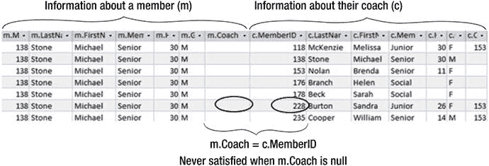
图 5-6. 两个 Member 表副本之间笛卡尔积的一部分

对于`Coach`列中为 null 的成员，连接条件（`m.Coach = c.MemberID`）永远不会满足，因此所有这些成员都将从我们的连接表中缺失。我们只需要小心地理解我们真正想要的是什么。我们是想要所有有教练的成员列表（10 行），还是想要所有成员连同其教练姓名（如果有）的列表（20 行）？如果是后者，我们需要一个外连接。我们需要看到每个成员的名字（来自`Member`表的`m`副本），以及他的教练的名字（如果有）（来自`Member`表的`c`副本）。这个外连接的 SQL 如下：

```sql
SELECT m.LastName AS MemberLast, m.FirstName AS MemberFirst,
c.LastName AS CoachLast, c.FirstName AS CoachFirst
FROM Member m LEFT OUTER JOIN Member c ON m.Coach = c.MemberID;
```

在前面的查询中，我们为每个输出属性指定了一个列别名。列别名临时重命名列以提高输出的可读性。在这种情况下，它有助于读者区分名字属于谁，如图 5-7 所示。如果没有别名，属性将被标记为`m.LastName`和`c.LastName`等，这些就不那么容易理解了。回顾第 3 章，对于左外连接，如果右表中没有匹配的行，那些列将填充为空值。图 5-7 显示了左外连接的输出。

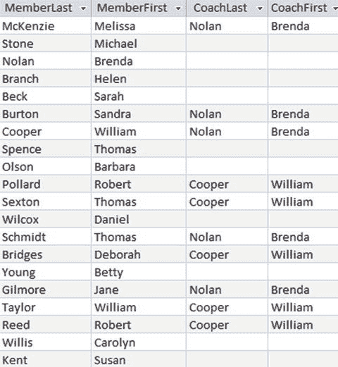
图 5-7. 用于列出所有成员和教练的左外连接


### 谁指导教练，或者说，谁是我的祖母？

两个`Member`表副本之间的**自连接**向我们展示了一个成员和教练的层级。如果我们查看图 5-7 中的行，可以看到托马斯·塞克斯顿（Thomas Sexton）由威廉·库珀（William Cooper）指导，而威廉·库珀又由布伦达·诺兰（Brenda Nolan）指导，布伦达·诺兰没有教练。这个层级对于当前问题来说并不特别有趣，但在许多类似情况下，这种层级关系却相当重要。家谱学就是其中之一。考虑图 5-8 中的数据模型和`Person`表的一部分。为了尽可能简单，我们只考虑关于女性和生母的一小部分信息。

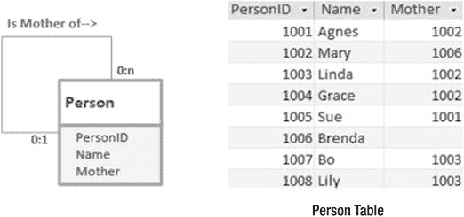

图 5-8.
女性及其生母的数据模型

图 5-8 中的关系可以顺时针解读为“一个人可以是多个人的母亲”，反方向解读为“一个人最多有一位母亲，也可能没有。”然而，在现实生活中，后一种说法听起来不太对——当然每个人都有母亲。但是，与所有数据库一样，这个数据库只是对现实生活复杂性的一种近似，它只能保存可用的数据。除非我们追溯到原始的 slime（此处指远古），否则表中总会有一些我们不知道其母亲的人。布伦达就是其中之一。图 5-8 中的表和模型与我们的成员和教练示例具有完全相同的结构，但像“谁是苏（Sue）的祖母？”这样的问题似乎比“谁指导我的教练？”更有可能出现。

那么，我们如何获取关于个人及其母亲的信息呢？就像上一节一样，我们需要将`Person`表与自身连接。（别忘了将连接设置为**外连接**，这样就不会丢失布伦达的信息。）SQL 如下：

```sql
SELECT *
FROM Person p LEFT OUTER JOIN Person m on p.Mother = m.ID;
```

该连接的 Access 图形界面如图 5-9 所示，同时也显示了结果表。我将表的第一个副本别名为`p`代表人物，第二个副本别名为`m`代表母亲。

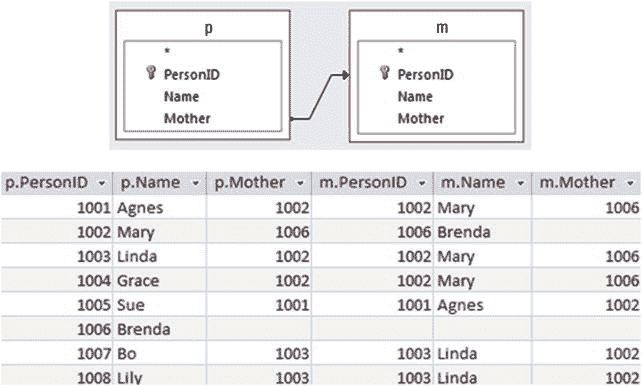

图 5-9.
查找人物及其母亲：**左外连接**的 Access 图示及结果表

那么，如何追溯到上一代呢？为此，我们需要在图 5-9 的结果表和`Person`表的另一个副本（别名为`g`代表祖母）之间执行另一个**左外连接**。两个左外连接的 SQL 如下：

```sql
SELECT *
FROM (Person p LEFT JOIN Person m ON p.Mother = m.ID)
LEFT JOIN Person g ON m.Mother = g.ID;
```

结果表如图 5-10 所示。

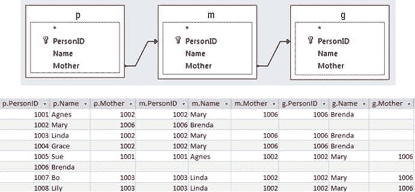

图 5-10.
查找三代人：**左外连接**的 Access 图示及结果表

显然，我们可以继续进行越来越多的自连接，直到没有更多代为止。当我们拥有自引用关系时，这类层次查询很可能会出现。一个需要注意的小问题是，我们必须在每个查询中指定连接的次数。标准 SQL 没有“自动进行自连接直到没有更多代”的概念，例如“查找我所有的女性祖先”；然而，一些数据库实现确实支持这种特性。¹

#### 自连接的结果导向方法

在上一节中，一旦我们意识到需要自连接，问题都很容易回答。这是**过程导向方法**的一个例子——我们需要执行哪些操作？然而，有时候，当你需要时，这种领悟并不总会到来。每当我在面对查询时大脑一片空白，我就会诉诸于**结果导向方法**。

让我们再次查看`Member`表，并提出一个简单的问题：谁是梅丽莎（Melissa）的教练？不要考虑关系或连接，只需从外行人的角度来看数据。在图 5-11 中，你可以看到如何找出答案，即使你从未听说过自连接（大多数人都没听说过）。

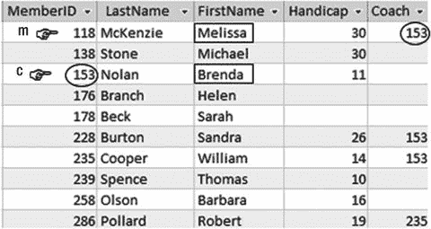

图 5-11.
查找梅丽莎的教练

要找到梅丽莎的教练，我们首先找到梅丽莎所在的行（图 5-11 中的`m`），然后注意到她的教练是成员 153。接着我们找到另一行（`c`代表教练），其`MemberID`值为 153；我们可以看到梅丽莎的教练是布伦达。你不需要了解任何关于自引用关系、外键或连接的知识就能弄清楚这一点。但一旦你将这种逻辑清晰地记在脑海中，就可以用自然语言写下来，然后转换成 SQL 就相当直接了。

让我们描述一下图 5-11：

> 我需要查看`Member`表中的两行（`m`和`c`），我想输出`c.FirstName`，条件是`c.MemberID`的值与`m.Coach`相同，并且`m.FirstName`是‘Melissa’。

对应的 SQL 如下：

```sql
SELECT c.FirstName
FROM Member m, Member c
WHERE c.MemberID = m.Coach AND m.FirstName = 'Melissa';
```

那么，这种结果导向方法如何对应我们之前考虑的过程导向方法呢？正如你所料，前面的 SQL 只是表述相同查询的另一种方式。在前面的 SQL 语句中，中间一行是两个`Member`表副本的笛卡尔积，`WHERE`子句的第一部分是连接条件。语句`FROM Member m, Member c WHERE c.MemberID = m.Coach`只是表达我们在前面章节中使用的自连接的另一种方式。

让我们尝试用结果导向方法解决另一个查询：谁正在被杆差更高的教练指导？我脑海中需要的图像是图 5-12。

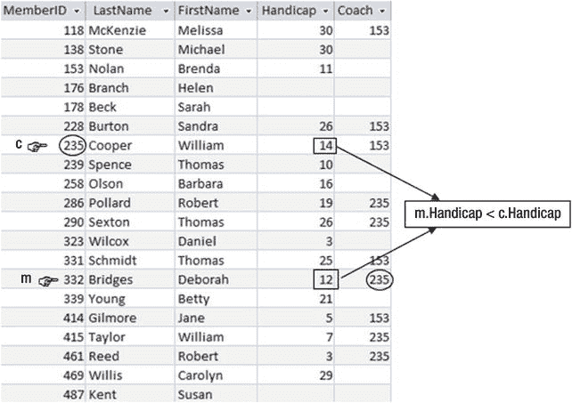

图 5-12.
查找被杆差更高的教练指导的成员

我们可以看到，黛博拉（Deborah）的杆差是 12，她正在被成员 235 指导。成员 235，威廉（William），杆差是 14，因此黛博拉符合我们的标准。以下是代表图 5-12 中逻辑的更通用的陈述：

> 我将查看`Member`表中的每一行（`m`），如果存在`Member`表中的另一行（`c`），使得`c.MemberID`与`m.Coach`相同，并且`m.Handicap`小于`c.Handicap`，我将输出`m.FirstName`和`m.LastName`。

SQL 的生成就很直接了：

```sql
SELECT m.FirstName, m.LastName
FROM Member m, Member c
WHERE c.MemberID = m.Coach AND m.Handicap < c.Handicap;
```

再次，你可以在前面的查询中看到等价的自连接（`FROM Member m, Member c WHERE c.MemberID = m.Coach`）。这种结果导向方法的有用之处在于，你不需要理解什么是自连接，也不必做出需要它的思维跳跃。通过用虚拟的手指和涉及哪些行来帮助你决策的方式思考，你可以勾勒出条件的陈述。SQL 通常就能很容易地从中推导出来。


### 涉及“两者”的问题

在第 2 章的“避免常见错误”一节中，我们研究了类似“哪些成员同时报名了 24 号和 36 号两项赛事？”的问题。为了回顾，我在图 5-13 中重新生成了`Entry`表。

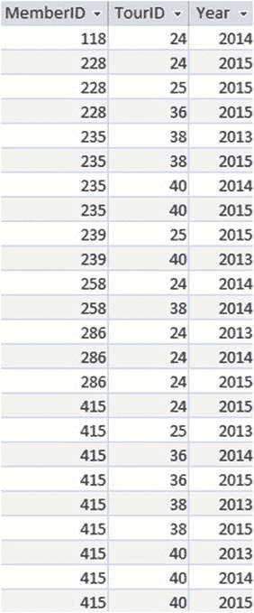

图 5-13. Entry 表

人们初次尝试用 SQL 语句查找同时报名了两项赛事的条目时，通常会写出以下查询：

```
-- Will not produce the desired result
SELECT e.MemberID
FROM Entry e
WHERE e.TourID = 24 AND e.TourID = 36;
```

请记住，`WHERE`条件是针对表中的每一行单独应用的。条件(`e.TourID = 24 AND e.TourID = 36`)对于任何单一行来说都不可能为真，因为每行的`TourID`只有一个值。前面的查询永远不会返回任何行，因为`TourID`的值不可能同时是两个不同的东西（24 和 36）。这类查询可能相当危险，因为用户可能将空结果集误解为“没有成员同时报名了两项赛事”，而实际上查询语句本身是错误的。

要回答这个问题，我们需要查看`Entry`表中的多个行。我发现，对于处理涉及“两者”的问题，**结果导向法**是最自然的。

#### 解决“两者”问题的结果导向法

要回答“哪些成员同时报名了 24 号和 36 号两项赛事？”，我脑海中需要的图景如图 5-14 所示。

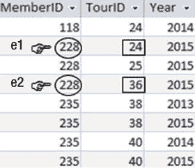

图 5-14. 哪些成员同时报名了 24 号和 36 号两项赛事？

观察图 5-14，可以清楚地看到成员 228 同时报名了两项赛事。我们要寻找的是两行（好比两根手指，分别标记为`e1`和`e2`），它们的`MemberID`值匹配，并且这两行分别具有所需的两个`TourID`值。

图 5-14 所展示逻辑的一个更通用的表述是：

> 我将遍历`Entry`表中的每一行(`e1`)。如果该行的`TourID`值为 24，并且我也能在`Entry`表中找到另一行(`e2`)，其`MemberID`值与当前行相同，且其`TourID`值为 36，那么我就写下当前行的成员 ID。

SQL 语句由此诞生。如果你有困难，可以参考图 5-14。

```
SELECT e1.MemberID
FROM Entry e1, Entry e2
WHERE e1.MemberID = e2.MemberID
AND e1.TourID = 24 AND e2.TourID = 36;
```

#### 解决“两者”问题的过程导向法

一如既往，我们有多种思考查询的方式。看看上一个查询的中间两行。`FROM Entry e1, Entry e2`是一个笛卡尔积（它会给我们所有行对的组合），然后通过(`WHERE e1.MemberID = e2.MemberID`)选择满足条件的行子集。这是一个连接操作。事实上，这是`Entry`表与其自身的**自连接**。`Entry`表两个副本之间的部分连接如图 5-15 所示。

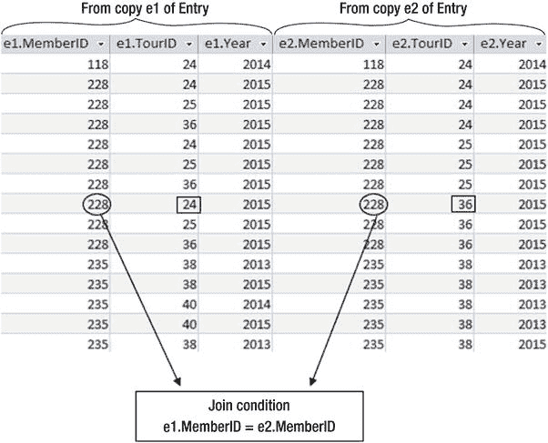

图 5-15. Entry 表两个副本之间的自连接部分

图 5-15 中的自连接展示了来自`Entry`表的、属于同一成员的行的组合。例如，我们可以看到涉及成员 228 的所有行组合。我们可以用这个自连接来回答关于哪些成员同时报名了 24 号和 36 号赛事的问题。我们只需要找到一行，其来自第一个副本的`TourID`是 24，而来自第二个副本的`TourID`是 36（反之亦然）——即 `e1.TourID = 24 AND e2.TourID = 36`。

这个自连接查询，后接`WHERE`子句以选择具有适当`TourID`值的行，如下所示：

```
SELECT e1.MemberID
FROM Entry e1 INNER JOIN Entry e2 ON e1.MemberID = e2.MemberID
WHERE e1.TourID = 24 AND e2.TourID = 36;
```

如果你比较这两个查找同时报名了 24 号和 26 号赛事的查询，你会发现它们非常相似。它们将产生完全相同的结果。你可能会觉得其中一种方式更直观。

### 总结

许多查询需要我们从表的两行中获取信息。这出现在多种情况下。主要的情况包括我们有自关系，或者有涉及“两者”一词的问题。我们研究了处理这些查询的**过程导向法**和**结果导向法**。两者都产生了外观非常相似且返回相同结果的 SQL 语句。拥有这两种不同的方法，在查询语句不那么显而易见时，会非常有帮助。

#### 自关系

当同一类的不同实例相互关联时，我们就有了自关系。在本章的例子中，某些成员是其他成员的教练。

从过程的角度看，关于教练或指导关系的查询需要自连接，它取表的两个副本并将它们连接起来。在下面的例子中，包含成员信息的`Member`表副本别名为`m`，包含教练信息的副本别名为`c`：

```
SELECT m.LastName, m.FirstName, c.LastName, c.FirstName
FROM Member m INNER JOIN Member c ON m.Coach = c.MemberID
```

或者，从输出导向法出发，我们可能会得出这个等价的查询：

```
SELECT m.FirstName, m.LastName, c.LastName, c.FirstName
FROM Member m, Member c
WHERE c.MemberID = m.Coach
```

这两个查询都可以作为回答许多关于指导关系问题的基础。

#### 涉及“两者”一词的问题

带有“两者”一词的问题通常意味着我们需要查看表中的两行。在我们的例子中，我们想找到同时报名了 24 号和 36 号赛事的成员的`MemberID`。

从结果导向法出发，我们需要在`Entry`表中找到同一成员的两行(`e1`和`e2`)。其中一行必须是 24 号赛事，另一行必须是 36 号赛事。下面展示了基于结果的 SQL 查询：

```
SELECT e1.MemberID
FROM Entry e1, Entry e2
WHERE e1.MemberID = e2.MemberID AND e1.TourID = 24 AND e2.TourID = 36;
```

或者，从过程导向法出发，我们可能会认识到需要`Entry`表两个副本之间的自连接，这是通过连接条件`e1.MemberID = e2.MemberID`完成的。之后需要接一个`WHERE`子句来返回具有适当`TourID`值的行。

与上一个查询等价的自连接查询是：

```
SELECT e1.MemberID
FROM Entry e1 INNER JOIN Entry e2 ON e1.MemberID = e2.MemberID
WHERE e1.TourID = 24 AND e2.TourID = 36;
```

脚注 1

某些 SQL 实现确实支持可以遍历自关系的递归查询。请查阅你的文档，寻找诸如`WITH`或`CONNECT BY`之类的关键字。

## 6. 表之间的多重关系

我们研究了表之间简单的一对多关系（例如，每个成员关联一种成员类型），也研究了自关系（例如，成员可能指导其他成员）。另一种经常出现的情况是，同一对表之间存在多个关系。


### 同一表之间的两种关系

现在，我们来思考如何在高尔夫俱乐部数据库中引入“球队”的概念。首先，我们可以从思考关于一支球队需要保存哪些基本信息开始。图 6-1 展示了一个代表简单球队的类，以及代表该类的一个表格中的若干行。

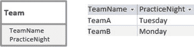

图 6-1.

`Team`类及`Team`表中的一些行

接下来，我们需要考虑新的`Team`类与我们其他类之间的关系。最明显的关系是，会员将为球队效力。图 6-2 展示了代表这种情况的可能类图。

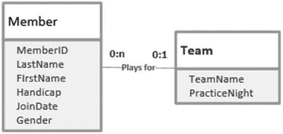

图 6-2.

一名会员可以属于一支球队

从左到右解读图 6-2 的类图：一个特定的会员可能效力于一支球队（靠近`Team`类的`1`），但一个会员也可以不为任何球队效力（靠近`Team`类的`0`）。从右向左解读：一支球队可以有许多会员为其效力（靠近`Member`类的`n`），但也可能没有任何会员（靠近`Member`类的`0`）。最后一点可能听起来有点奇怪，但当我们添加新球队，或者希望在新赛季重新开始时，一支球队可能暂时没有任何会员。

为了表示“一对多”关系，回想第 1 章的内容，我们需要从关系中“一”端的表获取主键，并将其作为外键添加到关系中“多”端的表。图 6-3 展示了一个新的外键字段`Team`，它引用了`Team`表。

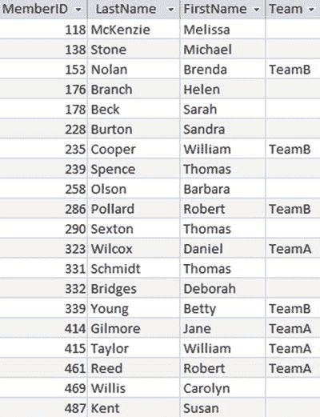

图 6-3.

`Member`表中的外键字段`Team`

`Member`和`Team`之间可能发生的另一种关系是：一名会员可能管理一支球队。图 6-4 在类图中展示了这一额外的关系。

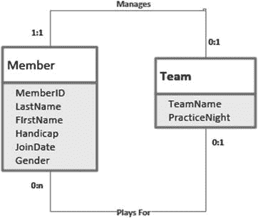

图 6-4.

`Member`和`Team`类之间的两种关系

图 6-4 的顶线可以这样解读：从左到右，一个特定的会员可能管理（至多）一支球队；从右到左，每支球队恰好有一名经理。

这个新关系是一种“一对一”关系。对于“一对多”关系，我们总是从关系的“一”端获取主键，并将其放入另一端的表中。这次，关系两端的基数都是`1`。我们可以在`Member`表中放置一个`Team_I_Manage`（我管理的球队）列，或者在`Team`表中放置一个`Manager`（经理）列。后者更合理，因为强制性的`Manager`属性是关于球队的更重要的信息，而可选的`Team_I_Manage`对于会员而言则不然。通常，在“一对一”关系中，我们从强制端（图 6-4 中图示的 1:1 端）获取主键，并将其作为外键放入另一端。

带有新`Manager`外键列的`Team`表，与`Member`表一起展示在图 6-5 中。

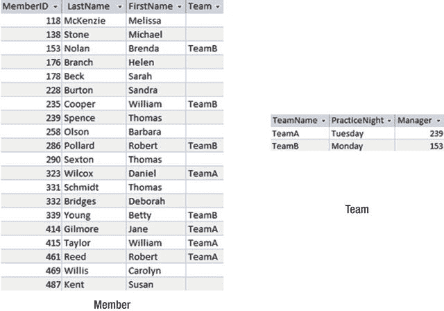

图 6-5.

`Member`表中的外键`Team`和`Team`表中的外键`Manager`，用于表示图 6-4 中的关系

从`Member`表，我们可以看到四人为 TeamB 效力（Brenda Nolan， William Cooper， Robert Pollard 和 Betty Young）；从`Team`表，我们可以看到会员 153（Brenda Nolan）是 TeamB 的经理。你会注意到，数据模型中没有说明经理是否必须是球队的成员。TeamB 的经理是 TeamB 的成员，而 TeamA 的经理 239（Thomas Spence）则不是 TeamA 的成员。外键所隐含的唯一约束是：球队的经理必须存在于`Member`表中，并且一名会员只能属于存在于`Team`表中的球队。

你们中的一些人可能也意识到，将`Manager`设为外键并不能阻止同一个人管理多支球队。外键约束并不妨碍我们将会员 239 同时设为 TeamA 和 TeamB 的经理。我们实际上在`Team`和`Member`之间为`Manages`（管理）关系建立了一种“一对多”关系。如果你想阻止一名会员管理多支球队，可以在`Team`表的`Manager`列上设置一个`UNIQUE`（唯一）约束。这类情况在我的数据库设计书中有更深入的讨论。¹ 以下 SQL 语句将创建一个`Team`表，其中`Manager`是一个引用`Member`表的外键，并且特定会员在表的`Manager`列中只能出现一次：

```sql
CREATE TABLE Team (
    TeamName CHAR(10) PRIMARY KEY,
    PracticeNight CHAR(20),
    Manager INT FOREIGN KEY REFERENCES Member UNIQUE
);
```

#### 从多重关系中提取信息

既然我们已经有了`Team`和`Member`表以及它们的两种关系（`Plays for`（效力于）和`Manages`（管理）），我们就可以开始提取信息了。如果我们一次只考虑一种关系，构建查询就相对简单。如果我们想要一个会员列表，包含效力于某支球队的会员以及他们球队来自`Team`表的基本信息，我们可以简单地根据`Team = TeamName`连接`Member`和`Team`表，如下面的 SQL 查询所示：

```sql
SELECT m.MemberID, m.LastName, m.FirstName, m.Team,
       t.TeamName, t.PracticeNight, t.Manager
FROM Member m INNER JOIN Team t ON m.Team = t.TeamName;
```

图 6-6 展示了上述查询的图形化表示和输出结果。

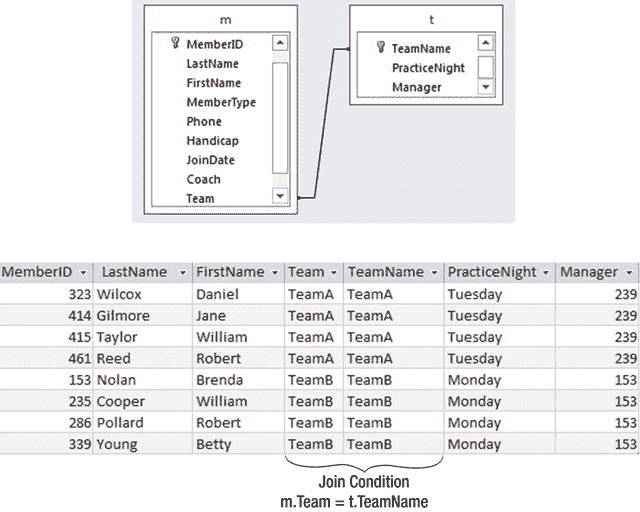

图 6-6.

连接`Member`和`Team`以获取关于会员球队的额外信息

类似地，如果我们想检索关于球队的信息，包括经理的姓名，我们可以根据`Manager = MemberID`连接`Member`和`Team`表：

```sql
SELECT t.TeamName, t.PracticeNight, t.Manager,
       m.MemberID, m.LastName, m.FirstName
FROM Team t INNER JOIN Member m ON t.Manager = m.MemberID;
```

图 6-7 展示了上述查询的图形化表示和输出结果。

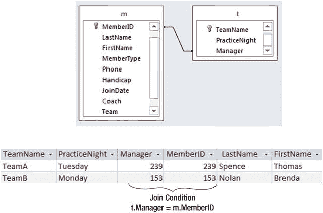

图 6-7.

连接`Member`和`Team`以获取关于球队经理的额外信息

现在，我们将看看如何检索涉及两种关系类型的信息。


#### 过程方法

图 6-6 所示连接所提供的信息并非特别有用。我们有了经理的 ID，但如果能同时显示他们的名字会更有用。我们需要另一个连接。首先，我们来看看如果在查询设计界面上同时添加 `Member` 和 `Team` 表，Access 默认会怎么做。这如图 6-8 所示。

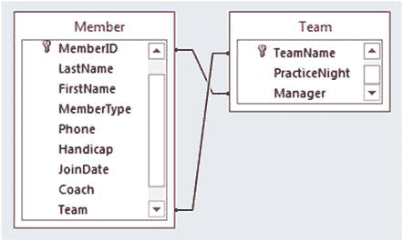
图 6-8. 将 `Member` 和 `Team` 表添加到图示查询界面时 Access 中的默认连接。

查看图 6-8 查询的 SQL，会发现它这样连接表：
```sql
SELECT *
FROM Member m  INNER JOIN Team t
ON t.TeamName = m.Team AND m.MemberID = t.Manager;
```
你能弄清楚这个查询在回答什么问题吗？输出结果如图 6-9 所示。

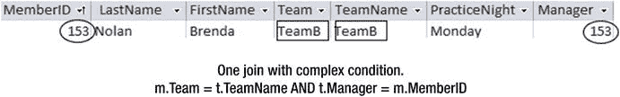
图 6-9. 图 6-8 中默认 Access 连接的输出。

要理解上述连接发生了什么，考虑 `Member` 和 `Team` 的**笛卡尔积**是很有用的。笛卡尔积给出了两个表中每一行的所有组合。连接条件规定只显示 `MemberID` 与 `Manager` 相同，并且 `Team` 与 `TeamName` 也相同的行。用日常语言来说，这相当于“向我显示那些管理他们所在团队的成员”。对于我们的数据，这只是我们在图 6-9 中看到的布伦达·诺兰的那一行。

那么，我们如何构造一个查询来显示成员姓名、他们所在的团队以及团队经理的姓名呢？接下来的查询将提供关于成员、其团队以及经理 ID (`t.Manager`)的信息；但是，它不提供经理的姓名：
```sql
SELECT m.MemberID, m.LastName, m.FirstName, t.TeamName, t.Manager
FROM Member m INNER JOIN Team t ON m.Team = t.TeamName;
```
我们需要做的是，获取上述连接的结果，再将其与 `Member` 表的第二个副本 (`m2`) 连接起来，以检索经理的姓名。我们希望的连接条件是 `t.Manager = m2.MemberID`，这样就能得到经理的姓名。图 6-10 展示了这两个连接的图示表示和输出。

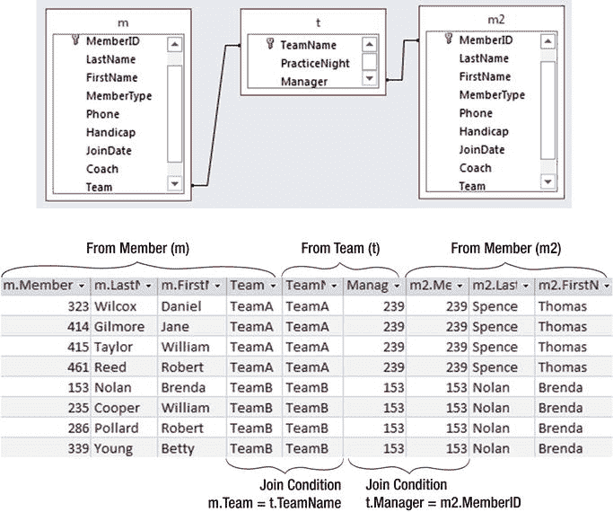
图 6-10. 使用两个连接和 `Member` 表的两个副本来包含团队经理的姓名。

第一个连接从 `Member` 表的第一个副本给我们成员信息，以及该成员在 `Team` 表中的信息；第二个连接从 `Member` 表的第二个副本给我们团队经理的姓名。这两个连接的 SQL 是：
```sql
SELECT *
FROM (Member m INNER JOIN Team t ON m.Team = t.TeamName)
INNER JOIN Member m2 ON t.Manager = m2.MemberID;
```
将这个最新的查询和输出与图 6-8 和 6-9 中涉及 `Member` 和 `Team` 表之间单个连接的查询进行比较，你可能会发现这*很有指导意义*。

我们现在能够生成关于团队及其成员的各种报告。图 6-11 显示了一份基于前述查询及其输出的报告，该输出如图 6-10 所示。

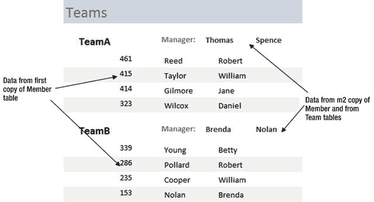
图 6-11. 基于图 6-10 所示查询的报告。

报告已按团队分组，团队和经理信息（来自 `Team` 表和 `Member` 表的 `m2` 副本）位于组页眉。团队的成员（来自 `Member` 表的第一个副本 `m`）位于报告的细节部分。

#### 结果方法

我们现在将研究另一种构建查询的方法，以检索关于一个团队的所有信息（成员姓名、团队名称和经理姓名），用于类似图 6-11 的报告。我觉得两个连接的想法相当直观，但其他人可能更喜欢不同的方法。

我在图 6-12 中复制了这两个表。现在，不考虑连接，让我们看看如何选取一个成员并找出他或她所在的团队以及该团队的经理是谁。

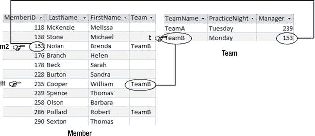
图 6-12. 找到一个团队成员（威廉·库珀）、他团队的名称以及团队经理的姓名。

无需考虑连接，我们就能找到所需的信息。我们需要来自三行的信息。让我们看一个具体案例。`Member` 表中的一行 (`m`) 将给我们一个成员的姓名（图 6-12 中的威廉·库珀）。我们需要找到 `Team` 表中他团队对应的那一行 (`t`) (`m.Team = t.TeamName`)。然后我们需要 `Member` 表中代表团队经理的另一行 (`m2`) (`t.Manager = m2.MemberID`)。

在图 6-12 的帮助下，我们可以构建以下 SQL：
```sql
SELECT m.LastName, m.FirstName, m.Team, m2.LastName, m2.FirstName
FROM Member m, Team t, Member m2
WHERE m.Team = t.TeamName AND t.Manager = m2.MemberID
```
如果我们愿意，可以在上述查询的 `SELECT` 子句中用 `t.TeamName` 替换 `m.Team`。

前面的查询等同于带有两个连接的查询。`FROM` 子句是三个表的笛卡尔积。`WHERE` 子句提供了 `Member` (`m`) 和 `Team` (`t`) 之间基于 `m.Team = t.TeamName` 的连接条件，以及 `Team` 和另一个 `Member` 副本 (`m2`) 之间基于 `t.Manager = m2.MemberID` 的连接条件。


### 业务规则

图 6-4 中的数据模型在下面作为图 6-13 重新展示。

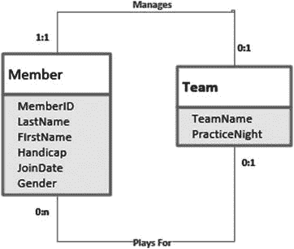

图 6-13. `Member`（成员）和 `Team`（团队）类之间的两种关系。

成员可以属于团队，成员也可以管理团队。当我们用外键实现这些关系时，施加在数据上的约束非常简单：一个成员只能存在于`Team`表中已有的团队里，一个团队也只能由`Member`表中的某个人来管理。

在各种情况下，可能还需要应用其他约束。例如，我们可能有额外的约束，比如一个团队最多只能有四名成员，或者经理必须是该团队的成员（或者不是）。这类约束通常被称为业务规则。图 6-13 中的数据模型可能支撑着两个不同高尔夫俱乐部的数据库。虽然基本的完整性规则将适用于两个俱乐部（例如，成员不能属于不存在的团队），但每个俱乐部对于团队规模以及谁可以管理它们可能有不同的规则。外键约束不足以强制执行此类业务规则。

关系型数据库产品通常会提供某种方式来强制执行业务规则。像 SQL Server 和 Oracle 这样的大型系统提供了触发器。触发器是在指定事件发生时（例如，插入或更新记录时）执行的动作。触发器将拒绝任何不遵守规则的更改。在 Access 和其他产品中，无法将此类约束直接应用于表本身。但是，你可以将宏附加到输入表单上。这些宏会在数据提交到数据库之前检查表单上的数据。这种方法的问题在于，如果用户绕过表单（例如，使用 `SQL` 更新命令）直接向表中输入数据，则不会进行此类检查。

我们不会详细探讨业务规则在不同产品中如何实现，但会看看查询如何帮助找到任何不满足约束的实例。尽管这是在问题发生后才去发现，但这些查询的变体将构成你为强制执行约束而需要编写的任何触发器或宏的基础。

让我们看看如何查找经理不是其团队成员的团队。当我面对这样的查询时，我的大脑常常一片空白，遇到这种情况，我总是采用结果导向的方法。这意味着设想涉及的表，并想象我正在寻找的实例类型。请看图 6-14。

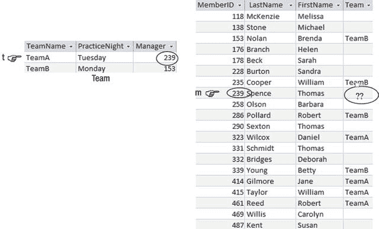

图 6-14. 查找经理不是其团队成员的团队。

在图 6-14 中，我们在 `Team` 表中看到 `TeamA` 的经理是 `239`，并且在 `Member` 表中看到成员 `239` 不属于任何团队。如果我们有一个约束要求经理必须属于该团队，那么 `TeamA` 将不遵守该约束。

要查找所有这样的团队，我们可以这样描述：

> 从 `Team` 表的所有行 (`t`) 中，找出那些在 `Member` 表中对应的经理行 (`m`)（即 `t.Manager = m.MemberID`）的团队 (`m.Team`) 为空或与 `Team` 表中的团队 (`t.TeamName`) 不同（`m.Team <> t.TeamName`）的团队名称。

等价的 `SQL` 如下所示：

```sql
SELECT t.teamname
FROM Member m, Team t
WHERE m.MemberID = t.Manager
AND (m.Team <> t.Teamname OR m.Team IS NULL)
```

中间两行等同于在 `m.MemberID = t.Manager` 上对两个表进行连接，最后一行找出那些在不同团队或根本不在任何团队中的经理。以下查询将产生等效的输出，但使用了内连接表示法：

```sql
SELECT t.teamname
FROM Member m INNER JOIN Team t ON m.MemberID = t.Manager
WHERE m.Team <> t.Teamname OR m.Team IS NULL
```

关于为什么在两个查询中都包含了 `IS NULL` 条件的一个说明：你可能还记得第 2 章的内容，如果我们与 `NULL` 值进行比较，结果既不是真也不是假。如果我们想找出不在任何团队中的经理，我们需要在查询中明确包含这种可能性。如果要求只是经理不能属于*不同*的团队，我们就可以省略对 `NULL` 值的检查，因为没有团队的经理将被视为符合要求。一如既往，清楚地理解你实际想查找的内容是编写查询最重要的部分。

前面的两个查询可以找到有错误经理的团队，但只能在它们被添加到数据库之后。我们如何从一开始就防止它们被添加呢？解决方案取决于数据库的实现。在数据更改最终提交到数据库之前，它们通常会被记录在某种缓冲区中。例如，在 SQL Server 中，正在更新或添加的记录保存在一个名为 `inserted` 的临时表中。如果我们向 `Team` 表添加或更新一些记录，会创建一个与 `Team` 表结构相同的临时表 (`inserted`) 来临时保存新的或更新的记录。我们希望执行一个查询，来检查即将添加到 `Team` 表的任何新记录是否包含不遵守约束的经理。但是，我们不是查看 `Team` 表，而是查看临时 `inserted` 表中的记录，并统计其中有多少是无效的。

以下 `SQL` 查询（与前两个查询非常相似）将统计 `Team` 表的 `inserted` 缓冲区中，有多少行的经理不遵守关于经理必须属于其所管理团队的业务规则：

```sql
SELECT COUNT(*)
FROM Member m INNER JOIN inserted i ON m.MemberID = i.Manager
WHERE m.Team <> i.Teamname OR m.Team IS NULL
```

如果这个计数不为零，则说明即将插入的行中有不遵守规则的行。在这种情况下，我们希望回滚插入操作，以便这些行不会提交到 `Team` 表。以下 `SQL` 语句将包含在 `SQL Server` 的一个触发器中。该触发器需要被设置为在 `Team` 表更新或插入行时运行。

```sql
IF
(SELECT COUNT(*)
FROM Member m INNER JOIN inserted i ON m.MemberID = i.Manager
WHERE m.Team <> i.Teamname OR m.Team IS NULL) <> 0)
BEGIN
Rollback Tran
END
```

这是一个有点粗糙的方法，因为如果有任何新记录不正确，整个批次都会被拒绝。你需要查阅你的数据库产品文档，以了解如何开发高效的触发器，但使用查询来检查新记录有效性的思路是常见的。

在 Access 中，检查是在界面层面完成的，通常在表单上。我们不会像前面的查询那样检查 `inserted` 表，而是创建一个带有类似查询的宏，在将表单上的字段值提交到数据库之前检查这些值。


### 摘要

表之间可能存在多个关系。例如，“一个成员可能属于一个团队”是一种关系，“团队有一个作为经理的俱乐部成员”是另一种关系。查找关于成员团队的信息（包括经理的 ID）需要在 `Member` 和 `Team` 表之间进行连接。如果我们还想找到经理的姓名，就需要将该结果与 `Member` 表的第二个副本连接，像这样：

```sql
SELECT * FROM
(Member m INNER JOIN Team t ON m.Team = t.TeamName)
INNER JOIN Member m2 ON t.Manager = m2.MemberID
```

表之间可能存在相当复杂的业务规则或约束。例如，我们可能要求经理必须是他或她所管理团队的成员，或者经理不应是任何团队的成员，或者一个团队必须少于六名成员。这些通常需要使用触发器。本章讨论的查询类型将有助于制定触发器中所需的代码。

脚注 1

Clare Churcher，《Beginning Database Design: From Novice to Professional》（纽约：Apress，2012）。

