# 7. 集合操作

关系数据库理论的一个巨大优势是表（或更正式地说，关系）由不同的行组成，因此可以被视为一个集合。然后，我们可以使用集合操作来帮助组合和提取特定信息。集合操作有助于解决的问题类型是：“哪些人同时在这两个集合中？”或“哪些人在这个集合中而不在那个集合中？”

在附录 2 中，你可以找到一些有助于管理集合操作的正式符号。在本章中，我们将尽量减少形式化内容，但集合操作的符号是一种有用的简写。表 7-1 展示了我们将研究的四种集合操作及其通用符号和关联的 SQL 关键字（如果有的话）。

表 7-1. 四种集合操作及其符号

| 操作 | 符号 | SQL 关键字 |
| --- | --- | --- |
| 并集 | ∪ | `UNION` |
| 交集 | ∩ | `INTERSECT` |
| 差集 | − | `EXCEPT` |
| 除法 | ÷ |  |

并非所有 SQL 实现都支持表 7-1 中的所有关键字，因此当关键字不可用时，我们将研究实现相同结果的替代方法。

### 基本集合操作概述

我们将依次研究每种集合操作，但为了让你了解方向，我将先快速概述三种最常见的操作：并集、交集和差集。想象我们有两个高尔夫俱乐部的会员表。我们可能想要：

*   确定谁在两个俱乐部中。
*   合并一个包含所有会员的大列表。
*   找出谁在一个俱乐部中而不在另一个俱乐部中。

基本的集合操作允许我们执行所有这些任务。

让我们假设每个俱乐部将其成员姓名存储在一个表中。这两个表具有完全相同的列（更多内容将在下一节中介绍），如图 7-1 所示。（好吧，它们是非常小的俱乐部！）

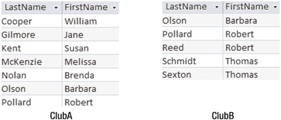
图 7-1. 两个成员姓名表

对这两个表的基本集合操作总结在图 7-2 中。两个俱乐部表的图像已叠加，以便将共有成员叠加在一起。`ClubA` 是每张图片中的顶部表格。对于图 7-2 的每一部分，方框显示了集合操作的结果。

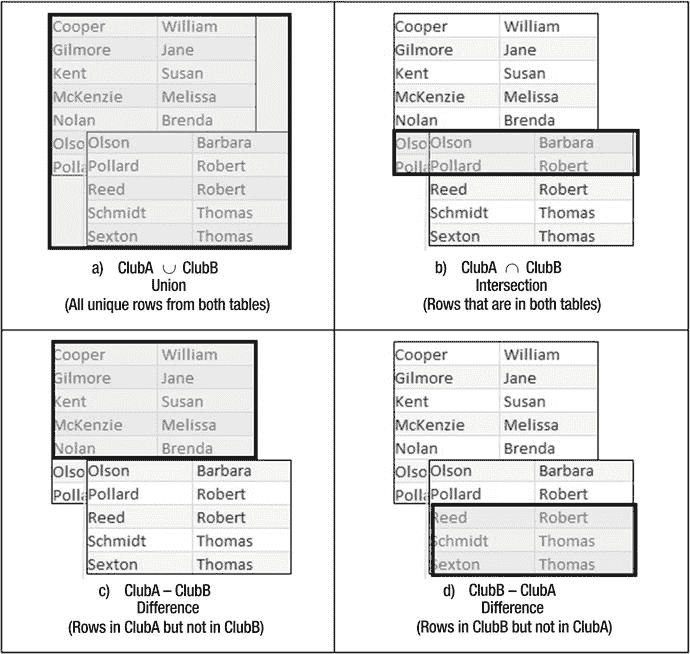
图 7-2. 对两个表 ClubA（上）和 ClubB（下）进行的基本集合操作

并集操作符（图 7-2 左上）显示来自每个表的所有名称（重复项已删除）。交集操作符（右上）返回同时出现在两个表中的两行。差集操作符（下）返回在一个俱乐部中而不在另一个俱乐部中的行。

### 联合兼容表

集合操作并集、交集和差集在两组行之间进行操作。尝试比较结构非常不同的表中的行是没有意义的，例如图 7-3 中的表。

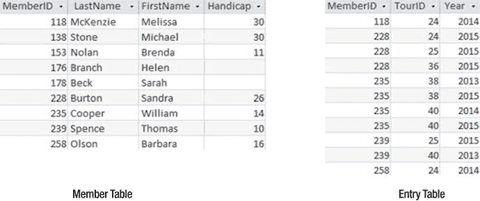
图 7-3. 尝试比较具有不同结构的表中的行是没有意义的

那么，什么决定了两组行是否可以使用集合操作并集、交集和差集进行比较？正式来说，这两组必须具有相同数量的列，并且每列必须具有相同的域。严格来说，域是一组可能的值。然而，在实践中，集合操作的要求是，每组行中对应的列（即从左到右的顺序）具有相同的类型 `—` 都是字符型，都是整型，等等。¹ 列的名称不需要相同。满足这些要求的表被称为联合兼容的，尽管该要求对于交集和差集操作也是必需的。

图 7-4 显示了一对联合兼容的表。即使列的名称不同，它们具有相同数量的列，并且对应的列具有相同的类型。

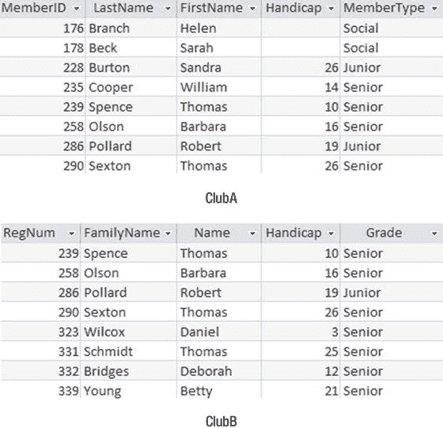
图 7-4. 联合兼容的表，即使列名不同

图 7-5 有两个具有相同列名的表，但它们不是联合兼容的，因为列的顺序使得第四列在上表中是数字类型，在下表中是字符类型，最后一列则相反。

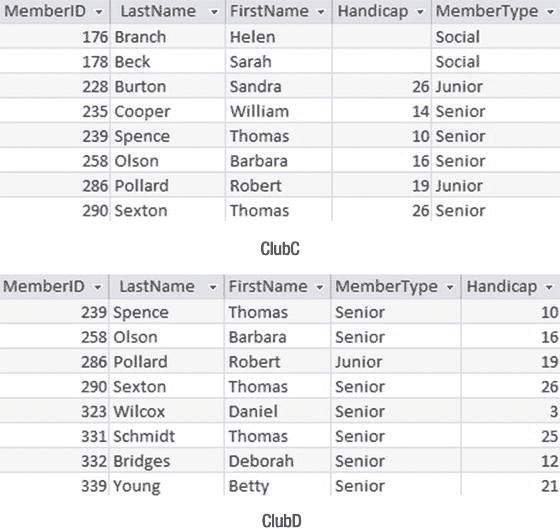
图 7-5. 不联合兼容的表

不同的 SQL 实现可能会以不同的方式解释对域或类型“相同性”的严格要求。严格来说，定义为 `CHAR(10)` 和 `CHAR(12)` 的两个字段具有不同的域，但许多 SQL 实现会允许这些字段在集合操作的目的上被视为相同。一些实现还会将数字转换为字符以执行集合操作。我觉得这特别可怕，不建议让你的应用程序替你做出这种决定。以下各节将演示如何使用 SQL 使你的表联合兼容。


#### 确保并集兼容性

当表不具备并集兼容性时，通常可以通过调整 `SELECT` 子句来弥补这种不兼容性。

对于图 7-5 中的那对表，如果我们只是按如下方式选择列，列的顺序将导致返回的行无法实现并集兼容：

```sql
SELECT * FROM ClubC;
SELECT * FROM ClubD;
```

然而，我们可以在 `SELECT` 子句中指定列的顺序：

```sql
SELECT MemberID, LastName, FirstName, Handicap, MemberType FROM ClubC;
SELECT MemberID, LastName, FirstName, Handicap, MemberType FROM ClubD;
```

现在，由这些查询返回的两组行是并集兼容的。

另一个不兼容性问题发生在原始表设计中将列声明为不同类型时。例如，`ClubC` 表可能将 `Handicap` 字段声明为 `INT` 类型，而 `ClubD` 表可能（不明智地）将 `Handicap` 值存储在 `CHAR` 字段中。（回想第 2 章，如果我们将值存储在字符或文本字段中，它们将按字母顺序排序，并且我们将无法对其执行平均值等函数。）如前所述，SQL 的不同实现会以各种方式处理这些不同类型。许多会尝试将数字转换为文本，反之亦然。你可以通过使用类型转换函数来自己控制这些转换（这可能是个好主意）。

例如，在 SQL Server 中，表达式 `Convert(INT, Handicap)` 会将 `Handicap` 字段中的文本值（如“14”）转换为整数值（14）。（如果 `Handicap` 字段中的值无法转换为整数，则会发生错误。）如果 `ClubD` 表中的 `Handicap` 字段是 `CHAR` 类型，那么我们可以在 `SELECT` 子句中使用转换函数。以下查询返回的两组行现在将是并集兼容的：

```sql
SELECT MemberID, LastName, FirstName, Handicap FROM ClubC;
SELECT MemberID, LastName, FirstName, Convert(INT, Handicap) FROM ClubD;
```

### Union

Union 允许我们生成由两个并集兼容的行集中的所有唯一行组成的输出。要在 SQL 中执行 union 操作，我们需要首先使用两个 `SELECT` 子句检索两组行，然后使用 `UNION` 关键字将两组行合并。以下 SQL 展示了图 7-4 所示的两个并集兼容表（`ClubA` 和 `ClubB`）中所有行的合并。

```sql
SELECT * FROM ClubA
UNION
SELECT * FROM ClubB;
```

结果表将包含来自两个表的所有行，且没有重复项，因此你将看到 Barbara Olson、Robert Pollard 和 Thomas Sexton 各只出现一行，如图 7-6 所示。如果你出于某种原因希望保留重复项，可以使用关键词 `UNION ALL`。

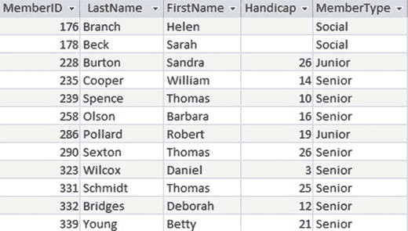

图 7-6. ClubA 和 ClubB 的 Union 结果，无重复行

由于并集兼容的表不需要具有相同的列名，生成的虚拟表中的列名通常来自其中一个表。在图 7-6 的示例中，列名与 union 查询中提到的第一个表相同。

对于 union 操作符而言，以何种顺序指定两个表并不重要。下面的查询将返回与前一个查询相同的行。行的显示顺序可能不同，列的显示名称也可能改变，但数据将是相同的。

```sql
SELECT * FROM ClubB
UNION
SELECT * FROM ClubA;
```

#### 选择合适的列

使用 union 操作符时，你需要仔细考虑你实际想要什么。关于俱乐部的示例相当刻意（你可能已经注意到了）。两个俱乐部拥有具有相同 ID 号和相同会员类型的成员的可能性非常小。更可能的情况是，如果 Barbara Olson 确实属于两个俱乐部，她在每个俱乐部表中的数据会有所不同。在 `ClubA` 表中，她可能是一名资深会员，`MemberID` 值为 258。在 `ClubB` 表中，她可能是一名准会员，`RegNum` 值为 4573。如果我们执行图 7-6 中所示的 union，即从每个表中选择所有列，那么 Barbara 的两行数据将是不同的，因此两者都会出现在结果中，如图 7-7 所示。

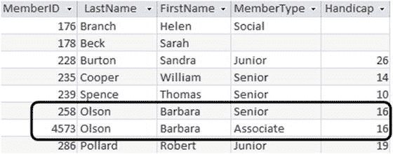

图 7-7. 由于行不同，Union 结果中出现两条 Barbara Olson 的记录

我们需要考虑从这样的 union 中真正想要什么。如果我们需要为两个俱乐部的联合圣诞派对准备一份姓名列表，那么我们不希望每个人都被列出两次。避免重复的方法是在执行 union 之前，仅从每个表中投影（选择）姓名列：

```sql
SELECT FamilyName, Name FROM ClubA
UNION
SELECT LastName, FirstName FROM ClubB;
```

使用此查询，Barbara 的两行数据将变得相同，并且只会在 union 结果中出现一次，如图 7-8 所示。

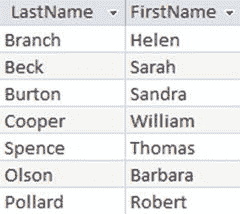

图 7-8. 如果 Union 中只包含姓名列，则 Barbara Olson 只出现一行

当然，最后这个查询存在一个严重问题。可能有两个 Barbara Olson，一个在每个俱乐部，现在只有一张姓名卡会被打印出来给他们俩。可悲的是，真实数据充满了这类问题。幸运的话，可能存在某个通用的国家高尔夫协会号码可以解决这个问题，但如果不行，你就需要保持警惕。下一节讨论的交集操作将生成同时出现在两个俱乐部名单中的姓名，届时可以进行人工合理性检查。


### 联合的用途

`union`的主要用途是将来自两个或多个表的数据合并，正如我们在前面章节中所做的那样。例如，如果不同月份的锦标赛报名数据存储在不同的表中（这可不是一个很好的设计决定！），我们可以使用多个`union`操作来合并全年的数据。

也可以合并来自同一个表的两组行。假设我们想知道图 7-9 中`Entry`表中，有多少人报名参加了 24 号或 36 号锦标赛。

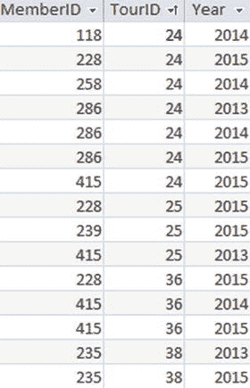
图 7-9. 报名表

我们可以尝试选择报名参加 24 号锦标赛的行和报名参加 36 号锦标赛的行，然后取其联合。如果我们执行以下查询，会得到多少行？

```sql
SELECT * FROM Entry WHERE TourID = 24
UNION
SELECT * FROM Entry WHERE TourID = 36;
```

我们将从这个查询中得到十行，每行对应一个报名了 24 号或 36 号锦标赛的记录。因为我们保留了`TourID`和`Year`列，我们选择的所有行都是不同的，因此都会出现在联合的结果中。该查询实际上返回的是所有报名 24 号和 36 号锦标赛的不同记录，而不是所有报名了这两个锦标赛的不同会员。下面的查询仅对这两个锦标赛的 ID 取联合：

```sql
SELECT MemberID FROM Entry WHERE TourID = 24
UNION
SELECT MemberID FROM Entry WHERE TourID = 36;
```

现在我们将得到五个 ID（118, 228, 258, 286, 415），它们是报名了其中任一锦标赛的会员的唯一 ID。

有一种更简单的方法来检索报名了 24 号或 36 号锦标赛的人。我们可以在`WHERE`子句中直接使用一个`OR`条件：

```sql
SELECT MemberID FROM Tournament
WHERE TourID = 24 OR TourID = 36;
```

上面的查询将返回多少行？同样，它将返回十行——`TourID`列中值为 24 或 36 的每一行。为了得到五个唯一的 ID，我们需要在`SELECT`子句中添加`DISTINCT`关键字。

### 联合与完全外连接

在第 3 章中，我们研究了不同的连接操作：内连接、左外连接和右外连接，以及完全外连接。有些产品（例如 Microsoft Access 2013）不支持`FULL OUTER JOIN`关键字；但是，我们可以使用`UNION`关键字执行一个等效的查询。

为了回顾一下，让我们复习一下可以在图 7-10 所示的`Member`表（只是一个非常小的表！）和`Type`表之间执行的不同类型的连接。

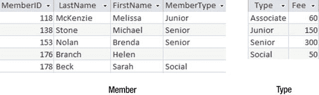
图 7-10. （小）会员表和类型表

图 7-11 显示了两个表之间的内连接，连接条件是`MemberType = Type`。我们没有得到 Helen Branch 的行，因为她的`MemberType`中没有值，因此连接条件对她来说永远不会为真。如果查看图 7-11 中表格的人认为它显示了所有会员，这可能是个问题。

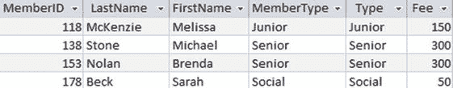
图 7-11. 在 MemberType = Type 条件下 Member 表和 Type 表的内连接

现在我们将看看外连接。左外连接确保我们看到左表（`Member`）的所有行；右外连接给我们右表（`Type`）的所有行；而完全外连接则给我们两个表的所有行。图 7-12 展示了这些外连接，它们的连接条件都是`MemberType = Type`。

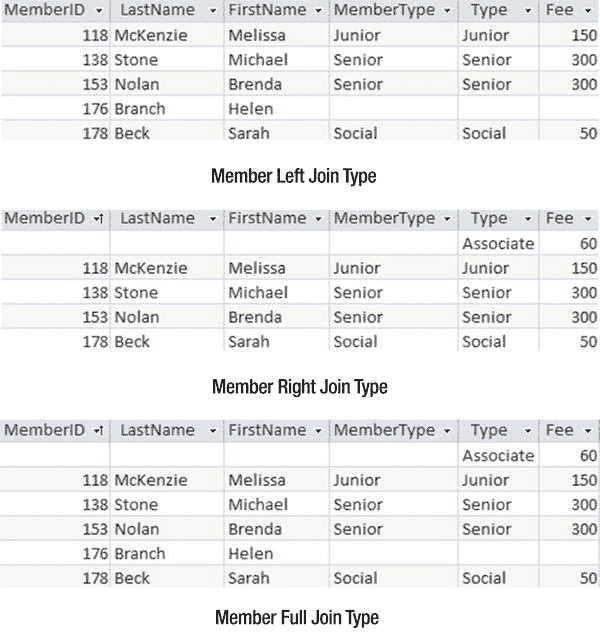
图 7-12. 在 MemberType = Type 条件下 Member 表和 Type 表的三种外连接

图 7-12 显示，在这种情况下，完全外连接由另外两个外连接中的唯一行组成；也就是说，是一个联合。如果你的 SQL 实现不明确支持完全外连接，你总是可以通过以下查询获得相同的结果：

```sql
SELECT * FROM Member LEFT JOIN Type ON MemberType = Type
UNION
SELECT * FROM Member RIGHT JOIN Type ON MemberType = Type;
```

#### 交集

如果你对两个联合兼容的表取交集，你将检索出在两个表中都存在的那些行。图 7-13 复制了来自图 7-4 的两个表`ClubA`和`ClubB`。我们可以看到，在两个表中完全相同的行有四行。

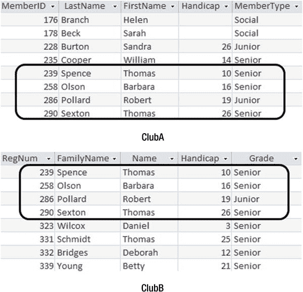
图 7-13. ClubA 表和 ClubB 表的交集中的行

SQL 中交集操作符的关键字是`INTERSECT`。检索两个表共有的四行（即会员 Spence, Olson, Pollard 和 Sexton）的表达式如下：

```sql
SELECT * FROM ClubA
INTERSECT
SELECT * FROM ClubB;
```

与联合操作符一样，两组行必须是联合兼容的；也就是说，它们必须有相同数量的列，并且对应的列必须具有相同的域。这可能意味着需要像本章前面“选择适当的列”一节所描述的那样，从基表中投影出适当的列。在查询中先提到哪个表无关紧要，因为无论表的顺序如何，交集返回的行都是相同的。


#### 交集的用途

交集操作的一个常见用途如图 7-13 所示：在两个具有相似信息的表中查找共同的行。另一个非常常见的交集用途是回答包含“都”这个词的问题。一个典型例子是“哪些成员**同时参加了**第 36 和 38 号锦标赛？” `Entry`（参赛）表如图 7-14 所示。

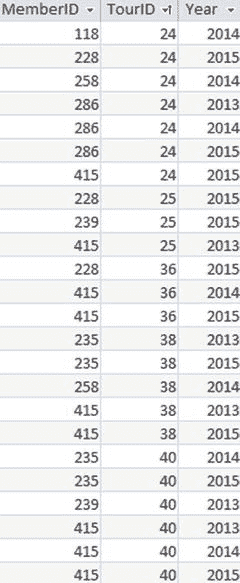

图 7-14. `Entry` 表

如果我们像下面这个查询一样，检索每个锦标赛的行并取其交集，会返回什么结果？

```sql
SELECT * FROM Entry WHERE TourID = 36
INTERSECT
SELECT * FROM Entry WHERE TourID = 38;
```

将不会返回任何行。图 7-15 将帮助你理解原因。

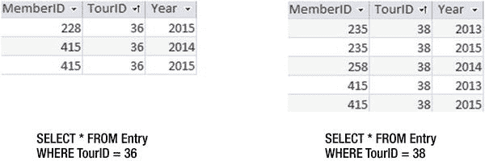

图 7-15. 两个查询没有共同的行，因此交集没有结果

这两个查询永远不会有任何共同的行，因为一个查询的 `TourID` 列值总是 36，而另一个总是 38。本质上，我们试图执行的查询是找出所有**既是**36 号锦标赛参赛记录**也是**38 号锦标赛参赛记录的条目。根据我们管理参赛记录的方式，结果是没有。

要检索图 7-15 中两组行里共同的成员，我们必须在执行交集之前只检索 `MemberID` 列，如下面的查询所示：

```sql
SELECT MemberID FROM Entry WHERE Tourid = 36
INTERSECT
SELECT MemberID FROM Entry WHERE Tourid = 38;
```

此查询如图 7-16 所示。与并集一样，交集操作的结果返回的是唯一行。

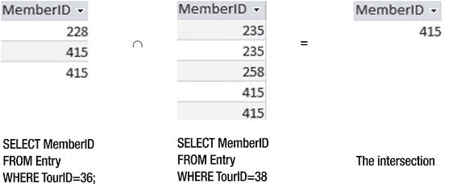

图 7-16. 使用交集查找同时参加了锦标赛 36 和 38 的成员

假设我们现在想找出成员的姓名。从过程的角度来看，我们可以获取交集的结果，并将其与 `Member` 表连接以获得姓名，如图 7-17 所示。

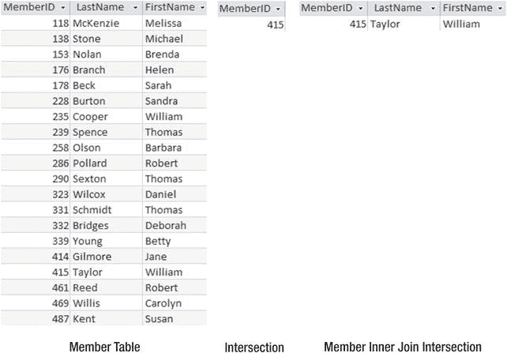

图 7-17. 将交集与 `Member` 表连接以查找姓名

那么，首先执行交集然后与 `Member` 表连接的 SQL 是什么样的？以下是第一次尝试，但不幸的是，它**无法工作**：

```sql
--Will not work
SELECT LastName, FirstName
FROM Member m INNER JOIN
(SELECT e1.MemberID FROM Entry e1 WHERE e1.TourID = 36
INTERSECT
SELECT e2.MemberID FROM Entry e2 WHERE e2.TourID = 38)
ON m.MemberID = e1.MemberID;
```

只出现在内层查询（括号内的部分）中的表不能被外层查询（连接）引用。这可以通过给嵌套的查询部分起一个别名来轻松解决。就像我们在 `FROM` 子句中 `Member` 后面加上 `m` 来给 `Member` 表起别名一样，我们可以在内层查询的最后括号后加上 `NewTable`（例如）来给整个内层查询起一个别名。我们现在可以在连接条件中引用该别名，如下面的查询所示：

```sql
SELECT LastName, FirstName
FROM Member m INNER JOIN
(SELECT e1.MemberID FROM Entry e1 WHERE e1.TourID = 36
INTERSECT
SELECT e2.MemberID FROM Entry e2 WHERE e2.TourID = 38) NewTable
ON m.MemberID = NewTable.MemberID;
```

另一种检索姓名的方法是使用嵌套查询。这里，内层查询检索交集中的 ID，外层查询从 `Member` 表中找到对应的姓名。

```sql
SELECT LastName, FirstName
FROM Member
WHERE MemberID IN
(SELECT MemberID FROM Entry WHERE TourID = 36
INTERSECT
SELECT MemberID FROM Entry WHERE TourID = 38);
```

#### 投影适当列的重要性

仔细考虑交集操作涉及的表中包含哪些列非常重要。我们在上一节看到，以下查询将返回空行：

```sql
SELECT * FROM Entry WHERE TourID = 36
INTERSECT
SELECT * FROM Entry WHERE TourID = 38;
```

第一个查询的行中 `TourID` 的值总是 36，而第二个查询的行中 `TourID` 的值总是 38。永远不会有共同的行。在每个查询中只检索 `MemberID` 解决了这个问题。

更有趣的是，正确地投影不同的列可以回答截然不同的问题。你会如何描述以下查询返回的行？

```sql
SELECT MemberID, Year FROM Entry WHERE TourID = 25
INTERSECT
SELECT MemberID, Year FROM Entry WHERE TourID = 36;
```

该查询如图 7-18 所示。

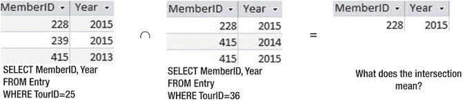

图 7-18. 这个交集表示什么？

在图 7-18 中，我们正在查找所有在**同一年**参加了第 25 和 36 号锦标赛的成员。这就是为什么成员 415 没有出现在交集中：他在 2013 年参加了第 25 号锦标赛，在 2014 年和 2015 年参加了第 36 号锦标赛。虽然他的成员 ID 出现在两个源表中，但对应的行属于不同的年份。没有哪个成员 415 的行在两张表中是完全相同的。

如你所见，为参与交集的表选择投影哪些列，对于交集中将出现什么内容至关重要。这意味着可以非常优雅地回答许多不同的问题，但也意味着如果你没有仔细考虑查询，很容易得到错误的答案。


### 不使用 INTERSECT 关键字进行管理

并非所有 SQL 实现都明确支持交集运算。然而，我们还有其他方法来执行涉及“两者”的查询。交集是一种**过程式方法**——我们是在说明需要对查询中涉及的表执行什么操作。如果这种方法行不通，那么我们可以尝试**结果式方法**。这涉及到通过检查表来找出一些可能的答案，而无需担心诸如交集和连接之类的操作。在图 7-19 中，我们想象有两根手指遍历 `Entry` 表的行。我们需要在 `Entry` 表中找到两行具有相同 `MemberID` 的行：一行 `TourID` = 36，另一行 `TourID` = 38。

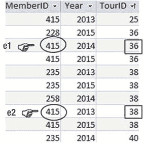
图 7-19. 查找同时参加了锦标赛 36 和 38 的成员

图 7-19 描述的情况可以描述为：

> 从 `Entry` 表的行 `e1`（其中 `TourID=36`）中返回 `MemberID`，前提是 `Entry` 表中存在另一个行 `e2`，它具有相同的 `MemberID` 且 `TourID=38`。

与此描述和图 7-19 等效的 SQL 表达式是：

```sql
SELECT DISTINCT e1.MemberID
FROM Entry e1, Entry e2
WHERE e1.MemberID = e2.MemberID
AND e1.TourID = 36 AND e2.TourID = 38;
```

那么，查找同时出现在 `ClubA` 和 `ClubB` 表中的行的查询呢？俱乐部表在图 7-20 中重新显示。为了找出两个表中相同的行，我们需要检查相应列中的每个值，以确保它们相同。

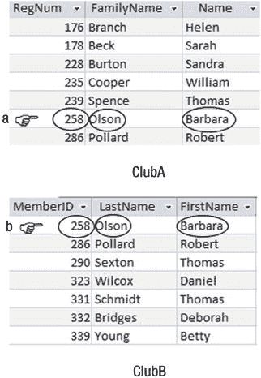
图 7-20. 查找 ClubA 和 ClubB 之间的交集

图 7-20 所描述的情况可以描述为：

> 如果 `ClubB` 中存在一行 `b`，其所有字段的值都与 `a` 相同（即 `a.RegNum = b.MemberID`, `a.FamilyName = b.LastName`, 且 `a.Name = b.FirstName`），则我将返回表 `ClubA` 中的行 `a`。

图 7-20 所示交集的 SQL 是：

```sql
SELECT a.RegNum, a.FamilyName, a.Name
FROM ClubA a, ClubB b
WHERE a.RegNum = b.MemberID
AND a.FamilyName = b.LastName
AND a.Name = b.FirstName;
```

#### 差集

对两个表进行差集运算，可以找出那些在第一个表中但不在第二个表中的行，反之亦然。对于我们这两个小型俱乐部，我在图 7-21 中复制了差集运算符的结果。

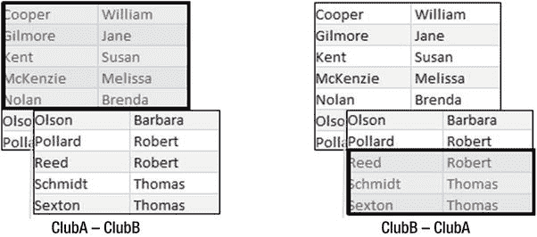
图 7-21. 差集运算符找出存在于一个表中但不出现在另一个表中的行。

标准 SQL 中差集运算符的关键字是 `EXCEPT`。Oracle 与 ISO SQL 标准以及大多数其他数据库系统不同，它使用关键字 `MINUS` 而不是 `EXCEPT`。

与并集和交集运算符一样，参与差集运算的表必须是**并兼容**的。与并集和交集运算符不同的是，表的**顺序**对于差集运算符很重要；`ClubA - ClubB` 的结果与 `ClubB - ClubA` 的结果不同（如图 7-21 所示）。

用于查找在 `ClubA` 表中但不在 `ClubB` 表中的人员姓名的 SQL 是：

```sql
SELECT LastName, FirstName FROM ClubA
EXCEPT
SELECT LastName, FirstName FROM ClubB;
```

#### 差集的用途

每当你的查询中包含“不”这个词时，你应该考虑差集运算符可能有用。例如，我们如何查找未参加锦标赛 25 的成员？回想一下第 5 章，为什么下面的查询不会返回那些未参加锦标赛 25 的成员：

```sql
SELECT MemberID FROM Entry
WHERE TourID <> 25;
```

上面的查询选择了 `Entry` 表中所有不属于锦标赛 25 的行。本质上，它找到了一个参加了除 25 之外任何锦标赛的成员（尽管他们可能也参加了 25）。观察图 7-15，我们看到查询会返回成员 415 参加锦标赛 36（`TourID <> 25`）的标记为 `e1` 的行。然而，在上面两行，我们看到成员 415 也参加了锦标赛 25。很难想象有什么理由你会想使用这个查询。

处理这类查询的过程式方法是使用差集。我们需要检索所有成员 ID 的集合，以及所有参加了锦标赛 25 的成员 ID 的集合。然后我们想要这两个集合的差集；即，存在于前一个集合中但不存在于后一个集合中的 ID。

找出所有参加了锦标赛 25 的成员的集合很简单：

```sql
SELECT MemberID FROM Entry WHERE TourID = 25;
```

我们可能认为类似的查询也能找到所有成员 ID：

```sql
SELECT MemberID FROM Entry;
```

然而，前面的查询只找到了一个**参加过锦标赛**的成员的集合。为了获得所有成员 ID 的集合，我们需要查询 `Member` 表。

图 7-22 说明了如何使用差集运算符来找出我们所需的成员 ID。

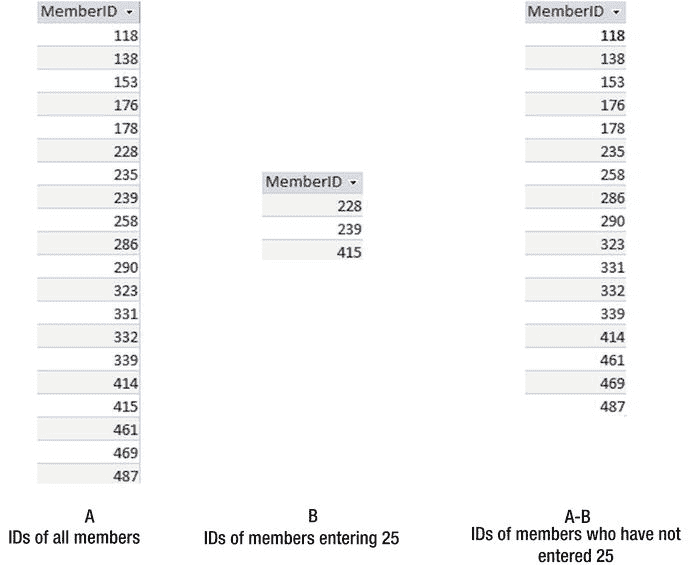
图 7-22. 未参加锦标赛 25 的成员

用于检索未参加锦标赛 25 的成员 ID 的 SQL 表达式如下：

```sql
SELECT MemberID FROM Member
EXCEPT
SELECT MemberID FROM Entry WHERE TourID = 25;
```

与交集和并集运算一样，在我们使用差集运算符之前，**投影**出适当的列是很重要的。在图 7-22 中，我们从 `Member` 和 `Entry` 表中检索了 ID。如果我们想包含成员的姓名，我们可以使用本章前面“交集的用途”一节中解释的方法之一。

然而，在这个差集示例中，在我们移除它们以获得图 7-22 左侧的行集之前，我们已经在 `Member` 表中有了成员的姓名。移除姓名然后在以后再添加回来似乎有点反常。重要的是，参与差集的两个行集是并兼容的；也就是说，对应的列必须具有相同的域。要么两个集合都只有 ID，要么两个集合都有 ID 和姓名。在图 7-22 左侧的操作中，我们采取了第一种选项，从 `Member` 中移除了姓名。我们本可以保留 `Member` 表中的姓名，并通过连接 `Entry` 和 `Member` 表将姓名添加到图 7-22 中间的行中，如图 7-23 所示。然后我们可以取这两个行集之间的差集。

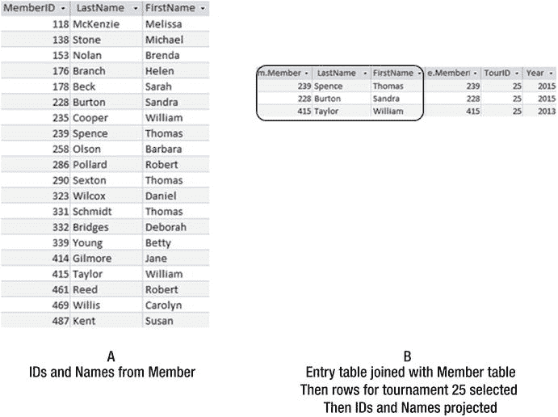
图 7-23. 在取差集之前，在两个行集中都包含成员的姓名

图 7-23 所示操作的 SQL 等效语句如下：

```sql
SELECT MemberID, LastName, FirstName FROM Member
EXCEPT
SELECT m.MemberID, m.LastName, m.FirstName
FROM Entry e inner join Member m on e.MemberID = m.MemberID
WHERE TourID = 25;
```


#### 在没有 EXCEPT 关键字的情况下进行管理

并非所有 SQL 版本都支持 `EXCEPT`（或 `MINUS`）关键字。一如既往，通常总有其他方法来构建查询。在第 4 章中，我们研究了一种用于回答涉及"not"（不/未）一词的问题的**结果方法**。图 7-24 回顾了用于查找未参加锦标赛 25 的成员姓名的思维过程。

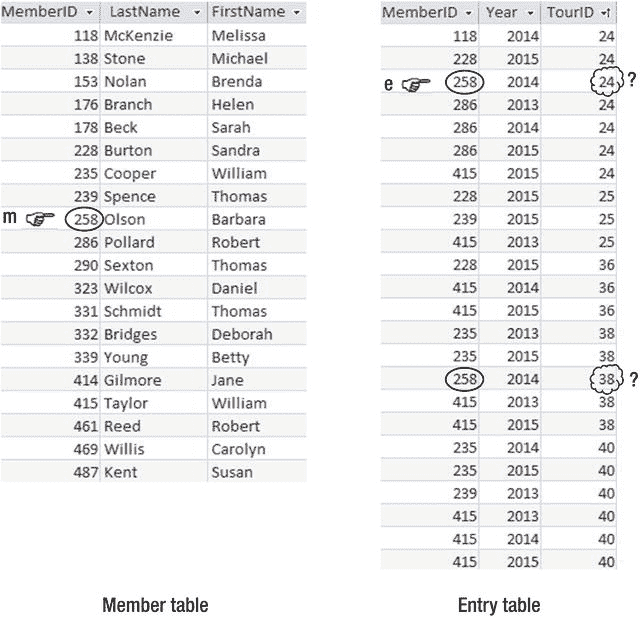
图 7-24. 判定成员 258 未参加锦标赛 25

图 7-24 背后的思维过程是：
> 如果 `Entry` 表中不存在某个成员（即 `m.MemberID = e.MemberID`）且 `TourID=25` 的行 `e`，则写出 `Member` 表中第 `m` 行的姓名。

反映图 7-24 的 SQL 是：
```sql
SELECT m.LastName, m.FirstName
FROM Member m
WHERE NOT EXISTS
(SELECT * FROM Entry e
WHERE e.MemberID = m.MemberID
AND e.TourID = 25);
```

对于涉及"not"一词的问题，你应该使用哪种查询？是使用过程方法和 `EXCEPT` 关键字的那种，还是使用结果方法和 `NOT EXISTS` 或 `NOT IN` 关键字的那种？通常，我会说这并不重要，因为你的数据库引擎可能会足够智能地识别它们是相同的。然而，我当前使用的 SQL Server 版本（2013）执行使用 `NOT EXISTS` 的查询比使用 `EXCEPT` 的相应查询更高效。你必须问自己是否在意！小型数据库上的查询通常非常快，即使运行得稍慢一些也真的无关紧要。但是，如果你有大量数据，那么一切都会改变。查询的效率会变得极其重要，在这种情况下，你还需要考虑数据库设计的其他方面，例如索引。我将在第 9 章中再稍微讨论一下这一点。

#### 除法

本章我们要看的最后一组操作符是除法。除法对于涉及"all"（所有）或"every"（每一个）一词的查询很有用。一个例子是“哪些成员参加了每一项锦标赛？”。标准 SQL 没有用于除法操作的关键字，并且要弄清楚涉及除法的查询的 SQL 可能有点棘手。

在附录 2 中，你将找到执行除法的正式代数表示法，以及如果需要的话，如何使用其他操作符来表示它。在附录 2 的“全称量词和 SQL”一节中，你还将找到使用演算（或结果）表达式执行除法类型查询的替代方法。这两种方法都有助于你构建类似于除法操作符的 SQL 语句。在第 8 章中，我们将研究聚合函数，并看看我认为是编写等效于除法操作符的 SQL 的最简单方法。

现在，我们将看看除法操作符的作用，以及如何使用它来回答涉及"every"和"all"的不同类型问题。

理解除法操作最简单的方法是通过一个例子。如果我们想知道哪些成员参加了每一项锦标赛，我们需要两条信息。首先，我们需要关于成员及其参加的锦标赛的信息，这可以从 `Entry` 表中获得。我们还需要所有锦标赛的列表，这需要来自 `Tournament` 表，因为并非所有锦标赛都可能在 `Entry` 表中体现。

图 7-25 说明了除法是如何工作的。我仅从 `Entry` 表中投影了 `MemberID` 和 `TourID` 列，并从 `Tournament` 表中投影了 `TourID` 列。你投影哪些列很重要，我稍后会再讨论这一点。

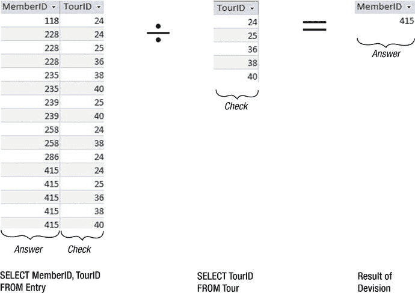
图 7-25. 使用除法查找参加了所有锦标赛的成员

观察图 7-25，中间是一个包含所有 `TourID` 值的表（我将其标记为 Check）。除法操作检查左侧的表，以找到那些拥有对应每一个 `TourID` 的行的 `MemberID` 值。Answer（位于图的右侧）包含了参加了每一项锦标赛的成员的 `MemberID` 值。成员 415 可以在 `Entry` 表中找到与五个锦标赛中的每一个配对，因此出现在除法的结果中。成员 228 没有出现在结果中，因为 `Entry` 表中没有 228 与 38 或 40 配对的行。

确保参与除法操作的两个表中的列正确非常重要。我喜欢这样来设置除法操作：
* 决定我想了解哪个属性。我们称之为 Answer。在这个例子中，我想找出 `MemberID` 的值，所以我们的 Answer 属性是 `MemberID`。
* 在除法操作符的右侧，表中的属性应该是我想用来核对的对象。我们称这个（些）属性为 Check。在这个例子中，Check 属性是 `TourID`。我们可以从 `Tournament` 表中获取所有 `TourID` 的值。
* 在除法的左侧，我想要一个仅包含两组属性 Answer 和 Check 的表，如图 7-25 所示。我们需要 `MemberID` 和 `TourID`（在这个例子中，是哪些成员参加了哪些锦标赛，这些来自 `Entry` 表）。重要的是，这些是左侧表中仅有的两列。如果添加了额外的列，那么我们就是在询问不同的问题，如下一节所述。

顺便提一句，许多人想知道为什么这个操作被称为除法，因为它似乎与“4 除以 2”这样的概念没有特别直接的关系。在普通算术中，除法是乘法的逆运算（或反运算）。对于集合操作，除法就像是笛卡尔积的逆运算。如果你考虑对图 7-25 中间和最右边的两个表进行笛卡尔积运算，你将得到一个表，其列（但不是行）与图 7-25 最左边的表相同。

我们可以通过改变除法操作符右侧的内容来回答许多问题。例如，如果我们想知道谁参加了所有公开赛，我们将把图 7-25 中间的表替换为仅包含公开赛的行：
```sql
SELECT TourID
FROM Tour
WHERE TourType = 'Open';
```

#### 投影适当的列

与交集和差操作一样，在除法操作中投影不同的列会得到针对不同问题的答案。再次说明，例子是理解这一点最简单的方法。在图 7-26 中，从 `Entry` 表中检索了一个额外的列。你能理解这个查询在查找什么吗？

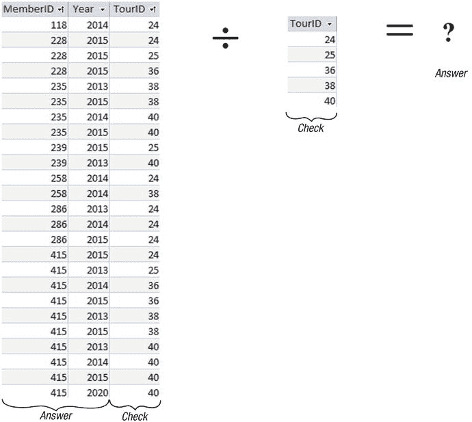
图 7-26. 除法操作在查找什么？

除法在左侧表中查找一组 Answer 属性，这些属性与 `Check` 表中的每一个属性配对。在这个例子中，该操作在左侧表中查找一对 `MemberID` 和 `Year`，这对组合出现在每一个锦标赛中。这个除法例子正在查找那些在同一年参加了所有锦标赛的成员。


#### SQL 中的除法运算

采用输出导向的方法，我们想要的查询可以这样表述：

> 从 `Member` 表的行 `m` 中，写出 `m.LastName`、`m.FirstName` 的值，条件是对于 `Tournament` 表中的每一行 `t`，在 `Entry` 表中都存在一行 `e`，满足 `e.MemberID = m.MemberID` 且 `e.TourID = t.TourID`。

我们有 SQL 关键字 `EXISTS` 来表示“存在”，但没有直接表示“每一个”的关键字。我们可以通过运用以下略费思量的逻辑，来消除前述语句中的“每一个”这个词。短语

> 对于 `Tournament` 表中的每一行 `t`，在 `Entry` 表中都存在一行 `e`…

等价于说

> 在 `Tournament` 表中，不存在这样一行 `t`，使得在 `Entry` 表中不存在一行 `e`…

附录 2 更正式地解释了如何推导这些表达式，但现在，我们将仅使用刚刚讨论的等价关系，重写原始描述（即如何检索已参加所有锦标赛的成员姓名）。

> 从 `Member` 表的行 `m` 中，写出 `m.LastName, m.FirstName` 的值，条件是 **对于每一行** `t` **都不存在**，使得在 `Entry` 表中 **存在一行** `e` 不满足 `e.MemberID = m.MemberID` 且 `e.TourID = t.TourID`。

对应的 SQL 语句是：

```sql
SELECT m.LastName, m.FirstName FROM Member m
WHERE NOT EXISTS
(
SELECT * FROM Tournament t
WHERE NOT EXISTS
(
SELECT * FROM Entry e
WHERE e.MemberID = m.MemberID AND e.TourID = t.TourID
)
);
```

这种双重否定可能有点令人望而生畏，但正如本章开头所言，我保证在下一章会介绍一种概念上更简单的方法来找出参加了每一场锦标赛的成员。

### 小结

由于关系数据库中的表具有唯一的行（如果键设置得当的话），它们可以被视为数学集合。这允许我们使用集合并运算、交运算、差运算和除运算。

并、交、差运算是作用在**并相容**的表之间的运算。这意味着运算符两边的表必须具有相同的列数，且对应的列必须具有相同的域（通常理解为相同的数据类型）。通过合理地投影列，你可以获得并相容的表。

SQL 有关键字来表示并、交、差运算，尽管并非所有实现都支持所有这些运算的关键字。如果你的 SQL 产品不支持交或差运算的关键字，你可以找到其他方式来表达查询。你应该以你觉得最自然的方式来构建查询。当数据量非常大且速度很重要时，你可能需要研究不同查询构建方式的效率。

以下是集合运算及其用 SQL 表示的替代方法的总结。`A` 和 `B` 是两个并相容的表，为简单起见，它们都只有一列，名为 `attribute`。

#### 并集

并集运算返回存在于表 `A` 或表 `B` 中的所有唯一行：

```sql
SELECT attribute FROM A
UNION
SELECT attribute FROM B;
```

#### 交集

交集运算返回同时存在于表 `A` 和表 `B` 中的所有行：

```sql
SELECT attribute FROM A
INTERSECT
SELECT attribute FROM B;
```

表示交集的另一种方式是：

```sql
SELECT A.attribute
FROM A
WHERE EXISTS
(SELECT B.attribute FROM B
WHERE A.attribute = B.attribute);
```

#### 差集

差集运算返回存在于第一个表（`A`）中但不存在于第二个表（`B`）中的所有行。一些实现使用关键字 `MINUS` 代替 `EXCEPT`：

```sql
SELECT attribute FROM A
EXCEPT
SELECT attribute FROM B;
```

表示差集的另一种方式是：

```sql
SELECT A.attribute
FROM A
WHERE NOT EXISTS
(SELECT B.attribute FROM B
WHERE A.attribute = B.attribute);
```

#### 除法

除法运算有助于处理包含“每一个”或“所有”这类词语的查询。当前版本的 SQL 不直接支持除法。有关如何表达涉及除法的查询的详细信息，请参阅附录 2 中的“除法”和“全称量词与 SQL”部分。

为完整起见，我们重复以下查询，该查询返回已参加每一场锦标赛的成员的 `MemberID` 值：

```sql
SELECT m.LastName, m.FirstName FROM Member m
WHERE NOT EXISTS
(
SELECT * FROM Tournament t
WHERE NOT EXISTS
(
SELECT * FROM Entry e
WHERE e.MemberID = m.MemberID AND e.TourID = t.TourID
)
);
```

脚注 1

在正式的关系理论中，关系的属性没有顺序，而是通过名称引用。表中列的排序是 SQL 实现用来确定并相容性的方式。

