# 8. 聚合运算

SQL 有许多用于计数、求和、求平均值以及对表执行其他聚合运算的函数。这些函数使我们能够执行各种查询。例如，我们可以统计俱乐部中的成员人数，或找出平均让杆数。我们可以以不同的方式对数据进行分组以求得聚合值。例如，我们可能想统计每年锦标赛的参赛次数，或者我们可能想找出每个特定锦标赛的参赛人数。

在本章中，我们将研究简单的聚合函数以及如何充分利用 SQL 的分组功能。在下一章中，我们将研究窗口函数，它们可以在仅使用基本聚合功能难以解决的情况下提供优雅的解决方案。

### 简单的聚合函数

简单的聚合函数包括平均值、总和和计数。这些概念很直接，但一如既往，你需要确保自己理解它们在涉及空值和重复值时是如何工作的。

#### COUNT() 函数

`COUNT()` 函数计算查询返回的行数。最简单的例子是统计查询返回的所有行数，我们可以通过在括号内添加星号来实现。以下查询将返回 `Member` 表中的行数：

```sql
SELECT COUNT(*)
FROM Member;
```

像前面查询中这样的单个聚合函数 `COUNT()` 将返回一个只有一列一行的表，如图 8-1 所示。

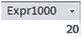

图 8-1.

`COUNT()` 函数的结果

图 8-1 中的输出是在 Access 中生成的，如你所见，列使用了默认名称标记。我们可以通过为列指定别名来提供一个更好的名称。在下面的查询中，我们添加了一个 `WHERE` 子句来统计满足条件 `Gender = 'F'` 的行子集，并使用了 `AS` 子句，使列标题更具信息性：

```sql
SELECT COUNT(*) AS NumberWomen
FROM Member
WHERE Gender = 'F';
```

此查询的输出如图 8-2 所示。

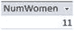

图 8-2.

带有别名的 `COUNT()` 函数结果

为聚合函数返回的列提供别名是个好主意，这样读者就能理解这些数字的含义。


#### 处理空值

上一个查询返回了性别为 `'F'` 的成员数量。现在请考虑下面的查询：

```
SELECT COUNT(*)
FROM Member
WHERE Gender  'F';
```

乍一看，我们可能会认为前两个查询得出的两个计数之和应该等于成员总数。但我们需要谨慎。在第 2 章中，我们探讨了当与空值（或称为空）进行比较时，`WHERE` 条件是如何操作的。如果属性没有值，我们就无法说它是否满足某个条件。我们不知道！在 SQL 中，如果我们比较的值是空值，那么比较的结果将始终为假。表中 `Gender` 列为空值的行将不会包含在前两个查询的任何一个结果中。

我们可以认为，在表设计时该属性应该被声明为 `NOT NULL`。在第 2 章中，我们讨论了为什么这可能不是一个好主意。如果我们正试图为一个尚未提供性别的新成员录入详细信息，那么我们要么无法保存我们已知的信息，要么必须猜测性别。这两种选择都不令人满意。更好的做法是先保存已知信息，稍后再跟进缺失的数据。

我们可以通过以下查询明确找出有多少行没有 `Gender` 的值：

```
SELECT COUNT(*)
FROM Member
WHERE Gender IS NULL;
```

现在，条件分别为 `Gender = 'F'`、`Gender <> 'F'` 和 `Gender IS NULL` 的前三个查询的结果数量加起来，就等于俱乐部成员的总数。像前面那样的查询对于检查我们本应期望有值的列中是否存在空值非常有用。

`COUNT()` 函数也可以返回表中或查询结果中特定列的数值数量。让我们看一下 `Member` 表中的几个列，如图 8-3 所示。

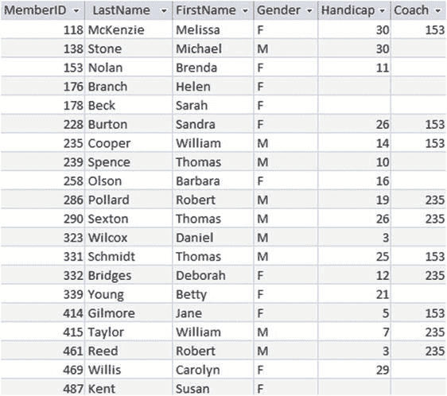

图 8-3. Member 表的部分列

假设我们想找出有多少成员有教练。我们有两个选项。一种方法是构建一个查询，只返回那些 `Coach` 列有非空值的成员，并对它们进行计数：

```
SELECT COUNT(*)
FROM Member
WHERE Coach IS NOT NULL;
```

另一个选项是让 `COUNT()` 函数专门使用 `COUNT(Coach)` 来统计 `Coach` 列中非空值的数量：

```
SELECT COUNT(Coach)
FROM Member;
```

回顾一下：如果我们只想找出查询（或整张表）返回的行数，我们使用 `SELECT COUNT(*)`。如果我们想找出某个特定列中有值的行数，请使用 `SELECT COUNT(<列名>)`。`COUNT(*)` 和 `COUNT(<列名>)` 这两种选项让我们能够明确指定如何处理空值。

#### 处理重复值

`Member` 表中 `Coach` 列的值（图 8-3）是重复的。只有两个不同的值（153 和 235）。因此，通过对 `Coach` 列的值进行计数，我们可以回答两个截然不同的问题：“有多少人拥有教练？” 和 “有多少位教练？” 第一个问题的答案要求我们包含所有值。第二个问题的答案要求我们只统计不同的值。这可以通过包含 `DISTINCT` 关键字来实现，如下列查询所示：

```
-- Won’t work in Access (2016)
SELECT COUNT(DISTINCT Coach)
FROM Member;
```

虽然我在本书中尽量不针对特定产品，但我认为有必要指出（考虑到世界上有如此多的 Access 副本在使用），Access 目前不支持 `COUNT(DISTINCT)`。不过，你可以使用以下嵌套查询在 Access 中获得等效结果。（注意，SQL Server 不允许在聚合查询的 `FROM` 子句中使用子查询。）

```
-- Won’t work in SQL Server (2012)
SELECT COUNT(*)
FROM (SELECT DISTINCT Coach FROM Member WHERE Coach IS NOT NULL);
```

你也可以使用关键字 `ALL`。这只是强调你想统计所有值，而不仅仅是不同的值。如果你没有包含 `DISTINCT` 或 `ALL`，则默认情况下会包含所有值。

类似的查询可以应用于高尔夫俱乐部数据库中的其他表。例如，我们可能想知道 2015 年会员参加了多少次比赛（11 次），或者 2015 年会员参加了多少场不同的比赛（5 场）。下面的两个查询将分别给出答案：

```
-- 参加了多少次比赛
SELECT COUNT(TourID)
FROM Entry
WHERE Year = 2015;
-- 参加了多少场不同的比赛
SELECT COUNT(DISTINCT TourID)
FROM Entry
WHERE Year = 2015;
```

### AVG() 函数

要计算平均值，我们使用 `AVG()` 函数。括号（...）中的参数是我们要求平均值的表达式。该表达式必须是数值型。如果你尝试对 `LastName` 这样的文本字段求平均值，会得到一个错误。

例如，我们可以通过将 `Handicap` 列作为 `AVG()` 函数的参数，来求得我们俱乐部会员的平均差点：

```
SELECT AVG(Handicap)
FROM Member;
```

表达式可以像前一个查询中那样只是一个数值列的名称，也可以是计算的结果。假设在另一个数据库中，我们有一个 `Order` 表，其中包含每个订购项目的 `Price` 和 `Quantity` 列。每个订单的净值可以通过将 `Price` 和 `Quantity` 相乘得出。如果我们想求出所有订单的平均净值，我们可以将表达式 `Price * Quantity` 放在括号中，如下所示：

```
SELECT AVG(Price * Quantity)
FROM Order;
```

#### 处理空值

与 `COUNT()` 函数类似，`AVG()` 函数也不包括表达式值为 null 的行。在 `Member` 表中，我们总共有 20 名成员，其中 17 名成员有 handicap 值。如果我们将所有 handicap 值相加，得到 287。`AVG()` 函数会取 handicap 总值（287）除以 `Handicap` 列中具有非空值的行数（17）。这正是我们想要的。如果我们通过除以总行数（20）来包含没有 handicap 的成员，那么基本上就是默认这些成员的 handicap 为 0。这会严重影响结果。

是否考虑 null 值并不总是那么显而易见。例如，假设我们有另一个数据库，其中有一个名为 `Student` 的表和一个名为 `TestScore` 的列。如果我们录入学生的考试分数，而有些学生没有参加考试，那么这些学生在 `TestScore` 列中就会有一个 null 值。我们真正想要的平均值是什么？我们可以计算所有学生的平均分（总分除以所有学生数），这意味着缺考的学生实际上被视为得了 0 分。另一方面，我们也可以只计算参加考试的学生的平均分（除以参加考试的人数）。`AVG(TestScore)` 总是只给我们提供参加考试学生的平均分。要确定这两种选项中你需要哪一个绝非易事。学校里一直存在关于通过率（可能关系到资金）是否应该包含中途退学学生的争论。

如果我们想要所有学生的平均分，包括那些分数为 null 的学生（计为 0），我们可以在查询中通过计算总分（使用 `SUM()` 函数）并除以学生总数来计算，如下所示：

```sql
SELECT SUM(TestMark)/COUNT(*)
FROM Student;
```

我们本可以为那些没有参加考试的学生录入 0 分，以避免这种复杂性。然而，如果这样做，我们就无法再区分参加了考试但得 0 分的学生和缺考的学生。无论这是否是个问题，意识到其影响总是有用的。

#### 处理重复值

与 `COUNT()` 函数类似，`AVG()` 函数也可以包含关键字 `ALL` 和 `DISTINCT`。请注意，`ALL`（这是默认值）表示所有非空值（包括重复值），而不是仅指不同的非空值。它的意思不是对包括 null 值在内的所有行求平均，这与我们在上一节讨论的不同。我发现很难想到什么时候你只想对不同的值求平均——肯定没有适用于我们俱乐部数据库的例子。

#### 处理类型和输出

`AVG()` 函数只接受数值表达式作为参数。我们无法成功地对 `FirstName` 或 `JoinDate` 求平均（尽管我们可以使用函数来计算成员名字长度的平均值或自加入日期以来的天数平均值）。

当我们对成员的 handicap 求平均时，我们期望得到什么结果？handicap 总和是 287，有 handicap 的人数是 17。在 SQL Server 2012 中，`AVG(Handicap)` 函数的结果是 16。在 Access 2016 中的结果是 16.8823529411765。为什么？

在 SQL Server（以及 SQL 的一些其他实现）中，平均值函数返回与所平均数字相同的类型。在本例中，`Handicap` 列是整数类型，因此 SQL Server 中的 `AVG(Handicap)` 返回一个整数。它还进行整数除法（这意味着结果被截断为 16，而不是四舍五入为 17）。在 Access 中，平均值返回的是一个浮点数（即带小数部分的数）。

我们可以控制结果的计算方式。如果我们想要一个带小数部分的平均值结果，可以在求平均之前将 `Handicap` 值转换为浮点数。为此，我们可以使用在第 7 章中提到的 `CONVERT()` 函数：¹

```sql
SELECT AVG(CONVERT(FLOAT,Handicap))
FROM Member;
```

另一种方法是直接将 handicap 乘以 1.0，这实际上将其转换为浮点数：

```sql
SELECT AVG(Handicap * 1.0)
FROM Member;
```

### ROUND() 函数

虽然严格来说不是一个聚合函数，但值得花点时间看看如何进行舍入。因为平均值涉及除以项目数量，`AVG()` 函数经常会返回一个带有很多小数位的结果。我们使用一个舍入函数来指定我们希望在 `AVG()` 和其他产生浮点数的结果的输出中包含的小数位数。我们向 `ROUND()` 函数提供两个参数：要舍入的表达式和要返回的小数位数。以下语句返回四舍五入到两位小数的平均 handicap：

```sql
SELECT ROUND(AVG(Handicap * 1.0), 2)
FROM Member;
```

舍入在不同的 SQL 实现中可能有不同的行为。在 Access 中，前面的查询将返回 16.88，而在 SQL Server 中将返回 16.880000。虽然在 SQL Server 中删除尾部的零是可能的，但通常最好将这类格式化工作留给报表编写器等前端工具。

有许多不同的舍入方法，因此查阅文档以了解你的 SQL 实现如何处理舍入是一个好主意。传统的将所有以 5 或更大数字结尾的数向上舍入的方法（例如，4.5 向上舍入为 5）会导致偏向更大的数字。为了消除这种偏差，一些舍入函数的实现会舍入到最接近的偶数。例如，3.5 和 4.5 都会舍入到 4。这平衡了结果，但如果你没有预料到，可能会感到惊讶。SQL Server 的 `ROUND()` 函数将所有的 5 向上舍入，而 Access 将 5 舍入到最接近的偶数。

### 其他聚合函数

SQL 还提供了其他常见的聚合函数，如 `SUM()`、`MAX()` 和 `MIN()`，它们非常易于使用。与 `AVG()` 函数类似，`SUM()` 函数的参数必须是数值表达式（数值属性或具有数值结果的某个表达式，例如 `Price * Quantity`）。`MAX()` 和 `MIN()` 的参数可以是数值、文本或日期类型。对于文本类型，顺序是按字母顺序。对于日期，顺序是按时间顺序。例如，`MIN(LastName)` 将按字母顺序返回 `LastName` 的第一个值，而 `MAX(JoinDate)` 将返回 `JoinDate` 的最新值。

可以在一个查询中组合多个聚合函数。以下查询返回 `Handicap` 的最大值、最小值和平均值。

```sql
SELECT MAX(Handicap) AS maximum, MIN(Handicap) AS minimum,
ROUND(AVG(Handicap * 1.0),2) AS average
FROM Member;
```

使用 `AS` 子句为每一列的结果提供别名有助于使结果更易于理解。图 8-4 显示了一些典型输出。

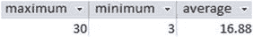

图 8-4.
包含多个聚合函数的查询的典型输出


### 分组

如果我们想知道某个特定成员参加了多少次锦标赛，我们可以查询 `Entry` 表。例如，如果想找出成员 235 参加锦标赛的次数，我们可以像下面的查询那样，选择该成员在 `Entry` 表中的所有行并进行计数：

```sql
SELECT COUNT(*) AS NumEntries
FROM Entry
WHERE MemberID = 235;
```

如果我们想查找另一个成员的参赛次数，就需要用不同的 `WHERE` 子句重写查询。如果想统计所有成员的次数，那将变得非常繁琐。

分组使我们能够用一条 SQL 语句找出所有成员的计数。关键短语 `GROUP BY` 就是用来做这个的。看看下面的查询：

```sql
SELECT COUNT(*) AS NumEntries
FROM Entry
GROUP BY MemberID;
```

额外的 `GROUP BY` 子句表示：“不要仅仅统计 `Entry` 表中的所有行，而是统计具有相同 `MemberID` 的所有子集或组。” 图 8-5 展示了我们如何可视化这一过程。

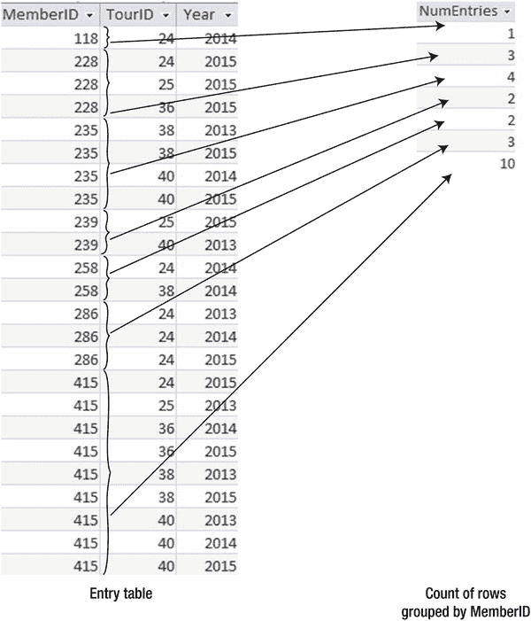
**图 8-5.** 按 MemberID 分组统计 Entry 表中的行数

#### 在 SELECT 子句中包含分组字段

我们也可以在 `SELECT` 子句中包含我们用来分组的字段，这样我们就能看到哪些计数对应哪些条目，如下面的查询所示：

```sql
SELECT MemberID, COUNT(*) AS NumEntries
FROM Entry
GROUP BY MemberID;
```

此查询的输出如图 8-6 所示。

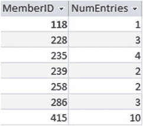
**图 8-6.** 在输出中包含 MemberID

#### 在分组前连接表

我们可能更希望在图 8-6 的输出中看到成员的姓名。在这种情况下，我们需要先将 `Entry` 表与 `Member` 表连接起来，然后再进行分组和计数。

```sql
SELECT m.MemberID, m.LastName, m.FirstName, COUNT(*) AS NumEntries
FROM Entry e INNER JOIN Member m ON m.MemberID = e.MemberID
GROUP BY m.MemberID, m.LastName, m.FirstName;
```

输出如图 8-7 所示。

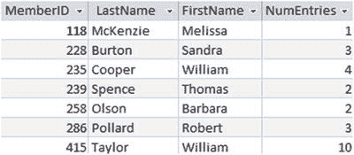
**图 8-7.** 连接 Entry 和 Member 表，并按 ID 和姓名分组

#### SELECT 子句的 GROUP BY 规则

你可能会想知道为什么我们在前面的查询中将 `LastName` 和 `FirstName` 包含在 `GROUP BY` 子句中。当你使用 `GROUP BY` 时，`SELECT` 子句只能包含你用来分组的字段或聚合函数。如果我们希望在输出中看到姓名，就需要将它们包含在我们分组的字段中。这是为了防止出现一个 `MemberID` 可能对应不同姓名的情况（显然在此情况下不可能，因为 `MemberID` 是 `Member` 表的主键）。暂时不考虑这一点，如果有两行 `MemberID` 为 118 但姓名不同，那么如果我们只按 `MemberID` 分组，就无法确定在图 8-7 的输出中，哪个姓名应与计数相关联。

#### 将 GROUP BY 与 WHERE 子句结合

通过在 `GROUP BY` 子句中包含 `WHERE` 子句和不同的属性，我们可以从数据中获取各种不同的信息。让我们再看一下 `Entry` 表。如果我们想找出每个锦标赛的参赛次数，我们可以想象将所有具有相同 `TourID` 的行分组在一起，然后统计每个集合中的行数，如这里的查询所示：

```sql
SELECT TourID, COUNT(*) AS NumEntries
FROM Entry
GROUP BY TourID;
```

输出如图 8-8 所示。

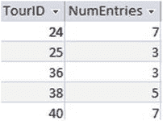
**图 8-8.** 统计每个锦标赛的参赛次数

我们并不总是需要统计表中的所有行。我们可能想先选择一个行的子集。例如，我们可能只想收集图 8-8 中 2014 年的统计数据。下面的查询展示了如何用 SQL 实现这一点。请注意，`WHERE` 子句（用于找到我们想要考虑的行的子集）必须位于 `GROUP BY` 子句之前：

```sql
SELECT TourID, COUNT(*) AS NumEntries
FROM Entry
WHERE Year = 2014
GROUP BY TourID;
```

#### 按多个字段分组

通过在 `GROUP BY` 子句中添加更多字段，我们可以获得更详细的信息。如果我们想为每年每个锦标赛重复此查询，可以移除 `WHERE` 子句，并同时按 `Year` 和 `TourID` 分组：

```sql
SELECT TourID, Year, COUNT(*) AS NumEntries
FROM Entry
GROUP BY TourID, Year;
```

图 8-9 展示了按这两个字段分组的工作原理。

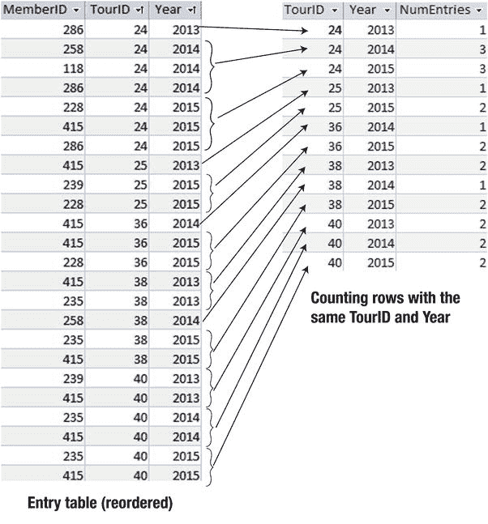
**图 8-9.** 按 TourID 和 Year 分组

#### 与其他聚合函数一起分组

我们可以将分组与 `COUNT()` 以外的聚合函数一起使用。例如，如果我们想查看女性和男性的最大、最小和平均差点，我们可以使用类似下面的查询：

```sql
SELECT Gender, MIN(Handicap)as Minimum, Max(Handicap)as Maximum,
ROUND(AVG(Handicap),1) AS Average
FROM Member
GROUP BY Gender;
```

此查询的输出如图 8-10 所示。

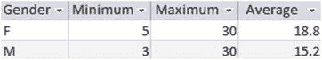
**图 8-10.** 按性别对 Handicap 聚合值进行分组


### 过滤聚合查询的结果

一旦我们为行组计算出了一些聚合值，我们可能想对这些结果提出一些问题。例如，在图 8-9 中，我们有每年每场锦标赛的参赛条目数。一个可能的问题是“哪些锦标赛有 3 个或更多的参赛条目？”。观察图 8-9 中的结果表，我们想在聚合输出中只选择那些计数值大于或等于`3`的行。我们可以使用`HAVING`关键字来实现这一点。看看下面的查询：

```sql
SELECT TourID, Year, COUNT(*) AS NumEntries
FROM Entry
GROUP BY TourID, Year
HAVING COUNT(*) >= 3;
```

`HAVING`子句总是出现在`GROUP BY`子句之后。聚合和分组操作会先执行，然后选择符合条件（本例中为`COUNT(*) >= 3`）的输出行。这就像有一个作用于聚合数字的`WHERE`子句。顺便提一下，我们必须在`HAVING`子句中使用`COUNT(*)`；我们不能使用第一行语句中的别名`NumEntries`。这个别名只是在查询末尾用来标记输出列。

让我们看另一个例子。假设我们想找出那些参加了四场或更多锦标赛的会员。首先，构造一个包含会员及其参赛次数计数的行集，如下面查询的前三行所示。然后，我们使用`HAVING`子句从结果中只选择那些`COUNT(*) >= 4`的行：

```sql
SELECT MemberID, COUNT(*) AS NumEntries
FROM Entry
GROUP BY MemberID
HAVING COUNT(*) >= 4;
```

在涉及聚合的查询中，我们有两个机会来选择行的子集。如果我们在执行聚合之前选取子集，我们使用`WHERE`子句。当我们想在聚合之后只选择某些行时，我们使用`HAVING`子句。例如，让我们修改之前的查询，以找出哪些会员参加了超过四场公开赛。为了找到公开赛，我们需要执行以下操作：

将`Entry`表与`Tournament`表连接起来。
使用`WHERE`子句只选取公开赛的参赛条目子集。
将每个会员的参赛条目分组并计数。
获取生成的聚合表，并使用`HAVING`子句只检索计数大于 4 的行。

此过程如图 8-11 所示。

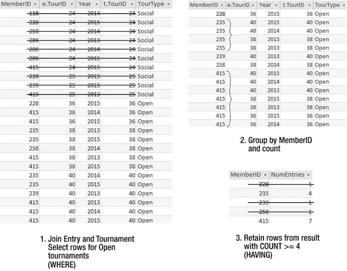

图 8-11.
查找参加了超过四场公开赛的会员

图 8-8 所示过程的查询是：

```sql
SELECT MemberID, COUNT(*) AS NumEntries
FROM Entry e INNER JOIN Tournament t ON e.TourID = t.TourID
WHERE t.TourType = 'Open'
GROUP BY MemberID
HAVING COUNT(*) > 4;
```

在第 2 章中，我们学习了如何对查询结果进行排序。我们也可以根据聚合值对结果进行排序。如果我们想按参赛场次降序查看前一个查询的结果，可以在查询末尾添加一个`ORDER BY COUNT(*) DESC`子句。

### 使用聚合执行除法运算

在第 7 章中，我们学习了代数运算中的除法。回顾一下，除法允许我们回答许多包含“所有”或“每一个”这类词语的问题。例如，假设我们想找出那些参加了每一场锦标赛的会员。图 8-12 回顾了如何使用除法来实现这一点。我们希望在`答案`中返回的属性是`MemberID`。在除法运算符的右侧，是我们需要`检查`对照的事物集合（本例中是`Tournament`表投影出的所有`TourID`值的列表）。在除法运算符的左侧是一个表，它同时包含`答案`和`检查`的属性（本例中是`Entry`表的`MemberID`和`TourID`列）。除法的结果是一个与每一场锦标赛都有关联的`MemberID`值列表（本例中，只有 ID 为`415`的会员）。

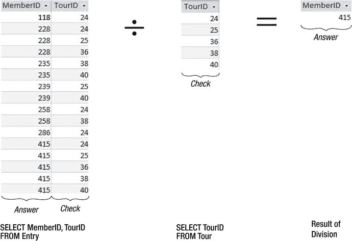

图 8-12.
使用除法找出参加了每一场锦标赛的会员

此图与图 7-25 相同。

目前，SQL 的标准实现没有用于除法运算的关键字，因此我们需要找到其他方法来表达如图 8-12 所示的查询。我们在第 7 章中已经看过一种方法，在附录 2 中还看过一些其他方法。这里，我们将研究一种使用聚合的方法。

`Tournament`表列出了五场不同的锦标赛。如果我们能找到一个参加了五场不同锦标赛的会员，那么他或她必定参加了所有锦标赛。我们现在有能力使用聚合和分组来构建等同于除法运算的查询。

我们已经看到过统计每个会员参加了多少场锦标赛的查询。然而，现在我们只想统计每个会员参加的不同锦标赛的数量。在`COUNT()`函数中添加`DISTINCT`关键字可以实现这一点：

```sql
SELECT MemberID, COUNT(DISTINCT TourID) AS NumTours
FROM Entry e
GROUP BY MemberID;
```

此查询的结果如图 8-13 所示。

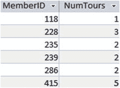

图 8-13.
找出每个会员参加的不同锦标赛的数量

从图 8-13 的结果表中，我们现在只想获取`NumTours`等于不同锦标赛总数的行，在本例中是`5`。我们可以使用`HAVING`子句来找出那些参加了五场不同锦标赛的会员：

```sql
SELECT MemberID
FROM Entry e
GROUP BY MemberID
HAVING COUNT(DISTINCT TourID) = 5;
```

我们可以通过将`5`替换为一个动态计算不同锦标赛数量的表达式，使这个查询更具通用性：

```sql
SELECT MemberID
FROM Entry e
GROUP BY MemberID
HAVING COUNT(DISTINCT TourID) =
(SELECT COUNT(DISTINCT TourID) FROM Tournament);
```

这个查询等同于图 8-12 所描述的代数除法运算。它返回参加了每一场锦标赛的会员的 ID。总结一下，我们先统计每个会员参加的不同锦标赛的数量，然后使用`HAVING`子句，只保留那些计数等于可能锦标赛总数（来自`Tournament`表的不同计数）的会员。我发现这种进行除法的方法在概念上比第 7 章和附录 2 中的方法更直观。当然，所有方法都达到了相同的目标。


### 嵌套查询与聚合函数

我们在第 4 章已经简单介绍了嵌套查询和聚合函数。在这里重新审视这个概念很有用。在本章中，我们已经学习了如何计算平均值、总和、计数等。现在，我们可以在其他查询中使用这些聚合结果。例如，我们可能想找出所有成绩（handicap）大于平均成绩的人。考虑以下查询：

```sql
SELECT * FROM Member
WHERE Handicap >
(SELECT AVG (Handicap)
FROM Member);
```

查询的内部部分返回平均成绩，外部部分将每个成员的成绩与该平均值进行比较。

让我们尝试另一个例子。如何找出参加了超过三场锦标赛的成员？如果你一时没有头绪，可以回溯到“结果导向”的方法：想象一下涉及的表格，并弄清楚你想要返回的行应该是什么样子。图 8-14 展示了如何对这个查询进行可视化。

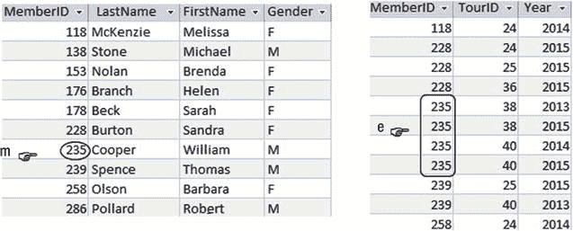
**图 8-14.**
哪些成员参加了三场以上的锦标赛？

我们可以这样描述想要返回的成员：

> 从 `Member` 表中找出所有行 `m`，条件是，如果我们统计 `Entry` 表中该成员（`m.MemberID = e.MemberID`）对应的行数，该计数值大于 3。

这可以很直接地转换成 SQL，如下所示：

```sql
SELECT * FROM Member m
WHERE
(SELECT COUNT (*)
FROM Entry e
WHERE e.MemberID = m.MemberID) > 3;
```

再来个稍微复杂点的？如何找出成员参加锦标赛的平均次数？我们将需要 `AVG()` 函数，但我们试图对什么求平均值呢？我们想要先统计每个成员参加的锦标赛数量，然后对这些数量求平均值。

我们可以使用上一节介绍的分组方法来找出每个成员参加的锦标赛数量：

```sql
SELECT MemberID, COUNT (*) AS CountEntries FROM Entry
GROUP BY MemberID
```

前面查询的结果如图 8-15 所示。

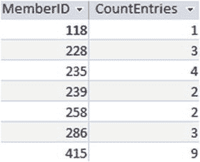
**图 8-15.**
每个成员的参赛次数

现在我们想要找出 `CountEntries` 这一列的平均值。作为第一次尝试，似乎可以将我们之前的查询作为嵌套查询的内部部分，然后尝试求平均值：

```sql
-- 在某些实现中不起作用
SELECT AVG (CountEntries) FROM
(SELECT MemberID, COUNT (*) AS CountEntries FROM Entry
GROUP BY MemberID);
```

然而，许多版本的 SQL 不支持在 `FROM` 子句中使用嵌套查询。上面的查询在 Access 2013 中可以正常工作，但在其他一些 SQL 实现中不行。

我们在上一章遇到了一个类似的问题，当时我们希望将一个表与一个联合（union）的结果进行连接。我们只需给内部查询的结果起一个别名（例如 `NewTable`）。这会创建一个临时的虚拟表（通常称为派生表）。然后，我们可以像这样访问新虚拟表的属性：

```sql
SELECT AVG (NewTable.CountEntries) FROM
(SELECT MemberID, COUNT (*) AS CountEntries FROM Entry
GROUP BY MemberID)AS NewTable;
```

### 本章小结

聚合函数为我们提供了回答关于数据的大量问题的方法。以下是本章的一些要点总结。

大多数 SQL 版本会提供简单的聚合函数 `MIN()`、`MAX()`、`COUNT()`、`SUM()` 和 `AVG()`。

*   对于 `COUNT()`，通常你只想计算查询返回的行数。这可以通过在括号中包含星号来完成：`COUNT(*)`。如果你在括号中包含一个列名（例如 `COUNT(Handicap)`），则只有该列中非空的值会被计入统计。
*   对于其他常见的聚合函数，你需要包含一个字段名。对于 `AVG()` 和 `SUM()`，这需要是一个数值表达式，例如 `AVG(Handicap)`。

空值与重复值：

*   计算聚合时会忽略空值。例如，`AVG(Handicap)` 是所有成绩的总和除以 `Handicap` 列中非空值的行数。
*   默认情况下，所有非空值都包含在聚合中。你可以包含关键字 `DISTINCT` 来去除重复值。例如，`COUNT(DISTINCT Handicap)` 将统计 `Handicap` 列中出现的不同值的数量。

分组：

*   `GROUP BY` 子句可用于将具有相同表达式值的行收集到一起，然后对这些组应用聚合函数。例如，我们可以通过将 `Entry` 表中 `MemberID` 值相同的所有行分组（例如 `SELECT MemberID, COUNT(*) FROM Entry GROUP BY MemberID`）来找出每个成员参加的锦标赛数量。
*   在分组并执行聚合后，你可以使用关键字 `HAVING` 从结果表中选择行。例如，通过在上一项的表达式后添加子句 `HAVING COUNT(*) >= 3`，我们可以找出参加了三场或以上锦标赛的成员。
*   使用 `WHERE` 在分组和聚合之前选择行的子集。使用 `HAVING` 在分组和聚合之后选择行的子集。

更复杂的聚合：

*   当你需要嵌套聚合时（例如，找出计数的平均值），请使用派生表。只需给内部查询起一个别名。
*   通过比较行数来进行等价的关系除法运算。

脚注 1
不同版本的 SQL 会有不同的函数来实现此功能。在 Oracle 中，你可能会考虑使用 `CAST` 函数。

