# 9. 窗口函数

窗口函数于 2003 年被添加到标准 SQL 中，为处理聚合提供了相当大的额外能力。窗口函数允许我们基于当前行，对数据的一个“窗口”执行聚合。这为指定执行排名、累计总和和滚动平均值等操作的查询提供了一种优雅的方式。在将数据分组以进行聚合时，窗口函数也提供了相当大的灵活性，因为它们允许单个查询具有多个不同的组或分区。还可以在查询中引用参与聚合的基础数据。这允许将基础数据与聚合结果进行比较。

Oracle 和 Postgres 支持窗口函数已有多年，而 SQL Server 直到 2012 年才引入它们。Access 和 MySQL 目前不支持这些函数。本章概述了如何使用一些最常见的窗口函数。


### 简单聚合函数

要开始使用窗口函数，我们将利用它们来编写查询，以替代第 8 章中遇到的一些简单聚合函数。让我们重新考虑一个计算成员障碍物总和与平均值的简单聚合查询：

```
SELECT COUNT(Handicap) AS Count, AVG(Handicap * 1.0) as Average
FROM Member;
```

该查询的输出如图 9-1 所示。

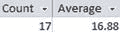

图 9-1. 简单计数和平均障碍物的输出

对于简单聚合，`SELECT`子句中唯一允许的属性是聚合函数本身以及那些包含在`GROUP BY`子句中的属性。这意味着我们不再能够访问构成结果的各个障碍物数据。

窗口函数允许我们在获取聚合值的同时，也能检索底层数据。窗口函数的关键字是`OVER()`；它们有时也被称为 over 函数。

以下是一个与前面查询类似的、使用`OVER()`函数的查询：

```
SELECT MemberID, LastName, FirstName, Handicap,
COUNT(Handicap) OVER() AS Count,
AVG(Handicap * 1.0) OVER() as Average
FROM Member;
```

与简单的`COUNT()`函数不同，使用`OVER()`函数，我们能够在`SELECT`子句中包含额外的字段。在上面的查询中，我们包含了每个成员的四个详细数据字段以及两个聚合值（为了便于阅读，聚合值被缩进在新行上）。这些聚合值与简单聚合相同，只是包含了`OVER()`函数。

上述查询的部分输出如图 9-2 所示。障碍物的计数和平均值与每个成员的详细数据一起显示。

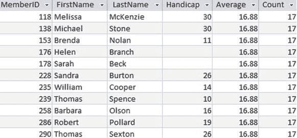

图 9-2. 使用 OVER()计算和平均障碍物时的输出

虽然图 9-2 中的示例为每一行返回聚合值看起来不是特别有用，但它为一些新的查询打开了大门。我们现在可以轻松地将每个个体的障碍物与平均值进行比较，这在没有窗口函数的情况下是完全不简单的。在下面查询的第三行，我们从每个成员的障碍物中减去障碍物的平均值，并将结果包含在`SELECT`子句中：

```
SELECT MemberID, LastName, FirstName, Handicap,
AVG(Handicap * 1.0) OVER() AS Average,
Handicap - AVG(Handicap *1.0) OVER() AS Difference
FROM Member;
```

结果如图 9-3 所示。

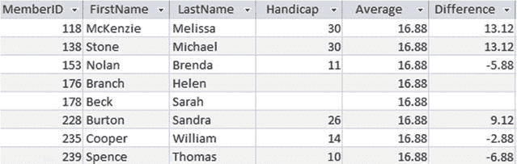

图 9-3. 窗口函数允许我们将聚合值与详细值进行比较

### 分区

`OVER()`函数也可用于生成类似于上一章介绍的`GROUP BY`查询的查询。这里我们需要的关键短语是`PARTITION BY`。让我们尝试对`Entry`表中的行进行一些不同的计数。如果我们只对`COUNT(*)`函数使用`OVER()`函数，我们将计算所有行；而如果我们使用`OVER(PARTITION BY TourID)`，它将为`TourID`的每个不同值计算行数。

分区的真正威力在于，与简单聚合的`GROUP BY`子句不同，它允许在单个查询中包含多个不同的分区。通过一个例子可以最好地说明这一点。以下查询包含三个不同的计数：

```
SELECT MemberID, TourID, Year,
COUNT(*) OVER() as CountAll,
COUNT(*) OVER(PARTITION BY TourID) AS CountTour,
COUNT(*) OVER(PARTITION BY TourID, Year) AS CountTourYear
FROM Entry;
```

输出如图 9-4 所示。

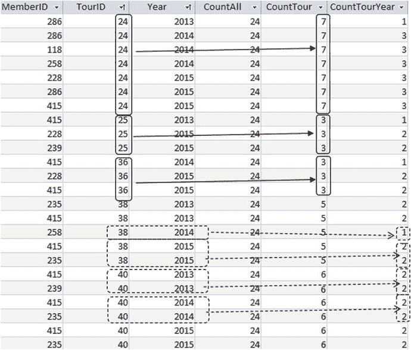

图 9-4. 在单个查询中使用不同的分区

在图 9-4 中，`CountAll`列显示了`COUNT(*) OVER()`的结果，它计算`Entry`表中的每一行（共 24 行）。

`CountTour`列是`COUNT(*) OVER(TourID)`的结果，它对具有相同`TourID`值的行进行分区（或分组）然后计数。图 9-4 顶部的三组实线框显示了对`TourID`为 24、25 和 36 的`CountTour`有贡献的行。

`CountTourYear`列是`COUNT(*) OVER(TourID, Year)`的结果，它对具有相同`TourID`和`Year`值的所有行进行分区。图 9-4 底部附近的虚线框组展示了这些计数是如何评估的。

### ORDER BY 子句

`OVER()`函数可以包含一个`ORDER BY`子句。这指定了在评估聚合时访问行的顺序。为行指定顺序提供了一种执行累计总和和排名操作的机制。

#### 累计聚合

如果在`OVER()`函数中包含了`ORDER BY`子句，那么默认情况下，聚合是从分区的开始执行到当前行（但更精确的定义见下文）。

看看下面的查询：

```
SELECT MemberID, TourID, Year,
COUNT(*) OVER(ORDER BY Year) AS Cumulative
FROM Entry;
```

在`Entry`表中，我们有几行具有相同的`Year`值（如图 9-5 所示）。就排序而言，这些行是等效的，因此如果其中一行被包含在计数中，那么我们应该包含所有这些行。我现在将更正哪些行被包含在聚合中的定义。

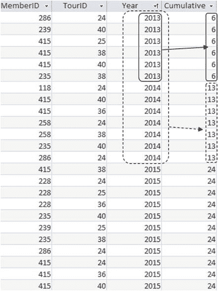

图 9-5. 使用 ORDER BY 为每年生成累计计数

如果在`OVER()`函数中包含了`ORDER BY`子句，那么默认情况下，聚合是从分区的开始执行到当前行，并且包括任何后续具有相同排序表达式值的行。

图 9-5 中的输出说明了这一点的含义。

在图 9-5 中，行按`Year`排序。让我们看看这种累计计数在前几行是如何工作的。对于第一行，如果我们从表的开头计数，我们有 1 行。然而，接下来的 5 行具有与我们排序表达式`Year`相同的值，因此我们将它们包含在计数中，得到总共 6。

现在让我们移动到成员 258 的第一行。从表的开头计数，我们有 10 行，但接下来的 3 行具有相同的`Year`值。这总共是 13。

本质上，我们得到了每年条目的累计计数。我们在第一年有 6 个条目（实线框），在第二年我们有额外的 7 个条目，总共 13 个（虚线框）。

如果`OVER()`函数中有`ORDER BY`子句，`SUM()`函数的工作方式非常相似，可以给我们提供累计总和。

假设俱乐部在一个名为`Income`的表中收集了来自筹款和锦标赛的收入数据。图 9-6 显示了前六个月的收入。

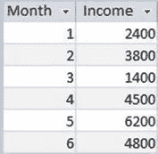

图 9-6. Income 表

我们可以通过执行一个`SUM(Income)`并在`OVER()`函数中包含`ORDER BY Month`子句来找到收入的累计总和，如下面的查询所示：

```
SELECT Month, Income,
SUM(Income) OVER(ORDER BY Month) AS RunningTotal
FROM Income;
```

收入从表的开始累加到当前行（按`Month`的值排序），如图 9-7 所示。

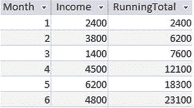

图 9-7. 按月份排序的每月收入累计总和


#### 排名

`ORDER BY` 子句的另一个用途是与 `RANK()` 函数结合使用。作为示例，我们将根据差点值对俱乐部成员进行排名。请看以下查询：

```sql
SELECT MemberID, Handicap,
RANK() OVER (ORDER BY Handicap) AS Rank
FROM Member
WHERE Handicap IS NOT NULL;
```

`OVER()` 函数中的 `ORDER BY` 子句指定了在确定排名时行的顺序——这里使用的是 `Handicap` 的值。每当 `Handicap` 的值发生变化时，排名就变为该分区内的行号（此处是整个表按 `Handicap` 排序）。排名会保持不变，直到 `Handicap` 的值再次改变，如图 9-8 所示。（为了更清晰地说明过程，部分差点值已被修改。具有相同 `Handicap` 值（因此排名也相同）的行已用虚线标出。）

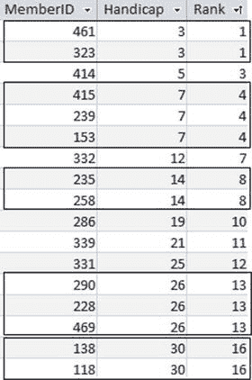

图 9-8.
按差点值排序的 `RANK()` 函数结果。具有相同差点值的行拥有相同的排名。

图 9-8 中的第一行排名为 1（它是第一行！）。第二行的排序表达式 (`Handicap`) 值与前一行相同，因此它的排名也是 1。下一行中 `Handicap` 的值发生了变化，所以排名变为行号 (3)。

空值会被包含在排名中，这就是为什么在前面的查询中明确排除了它们。如果没有 `WHERE` 子句，空值将被包含在排名的顶部（如果排序顺序是 `DESC`，则在底部）。

#### 排序与分区结合

在前面关于排序的部分中，我的查询没有包含任何分区。既然我们（希望）已经理解了这个概念，我们可以看更多的例子。

让我们考虑一个更详细的 `Income` 表，它包含了高尔夫俱乐部进行筹款的三个区域的月度金额。该年头五个月的数据如图 9-9 所示。

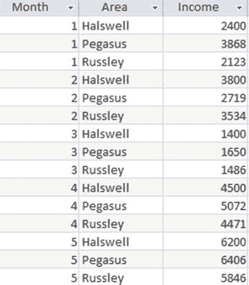

图 9-9.
包含区域的 Income 表

我们将逐步构建一些查询。

首先，我们只计算表的总收入。我们可以使用简单的 `SUM()` 聚合，但我们将包含一个 `OVER()` 函数，以便在输出中保留详细信息：

```sql
SELECT Month, Area, Income,
SUM(Income) OVER() AS Total
FROM Income;
```

这将产生一个与图 9-9 相同的表，但增加了一列 `Total`，该列每行都显示整个表的总和。

现在，让我们将其改为累计总和。我们通过在 `OVER()` 函数中包含一个 `ORDER BY` 子句来实现。默认情况下，这会计算从表开头到当前行以及相同 `Month` 值的后续行的总和。查询如下：

```sql
SELECT Month, Area, Income,
SUM(Income) OVER(ORDER BY MONTH) AS RunningTotal
FROM Income;
```

收入从表顶部累加到当前行，包括具有相同 `Month` 值（我们用于排序的属性）的后续行。本质上，输出对每个月的所有值求和，然后逐月累计总数。输出如图 9-10 所示。不同的月份已用虚线标出。

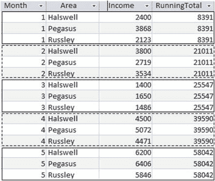

图 9-10.
按月排序时的累计总和

现在让我们独立地查看各个区域。这需要一个 `PARTITION BY` 子句。考虑这个查询：

```sql
SELECT Month, Area, Income,
SUM(Income) OVER(
PARTITION By Area
ORDER BY MONTH) AS AreaRunningTotal
FROM Income;
```

`PARTITION BY` 子句需要放在 `ORDER BY` 子句之前，这反映了执行过程。我们首先对数据进行分区，然后在每个分区内进行排序。聚合是针对从当前分区开头到当前行的行计算的。图 9-11 仅显示了该年头五个月的输出。三个分区已用虚线标出，以便更容易看清发生了什么。

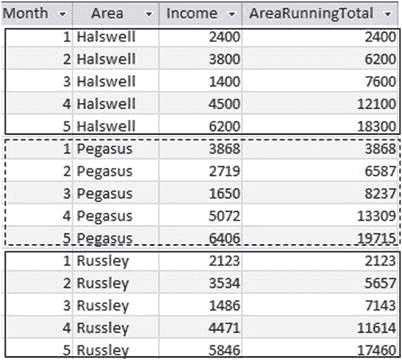

图 9-11.
按区域分区并按月排序的收入累计总和

### 帧规范

窗口函数的最后一个特性是我们能够进一步指定哪些行包含在聚合中。这正是“窗口”函数名称的由来。它们为我们感兴趣的数据部分提供了一个窗口或帧。`OVER()` 函数的通用形式包含三个子句，如下所示：

```sql
OVER(
[PARTITION BY ...]
[ORDER BY ...]
[ROWS ...]
);
```

我们已经了解了其中两个子句：`PARTITION BY` 子句允许我们在聚合前按某些表达式对数据进行分组。`ORDER BY` 子句允许我们确定聚合函数在分区中遍历行的顺序，并允许我们执行排名和累计计算。`ROWS` 子句允许我们缩小相对于当前行、将要包含在聚合中的行集。

默认情况下，带有 `OVER(ORDER BY)` 子句的查询会计算从当前分区开始到当前行（包括当前行）的值的聚合。让我们通过一个计算每个区域累计平均值的查询来回顾一下：

```sql
SELECT Month, Area, Income,
AVG(Income) OVER (
PARTITION BY AREA
ORDER BY Month) AS AreaRunningAverage
FROM Income;
```

图 9-12 的输出仅针对 Halswell 区域。实线框显示了从顶部数第三行的平均值所包含的行。虚线框显示了对图像底部数第三行的平均值有贡献的行。如果 `ORDER BY` 子句后没有 `ROWS` 子句，那么这就是默认行为。

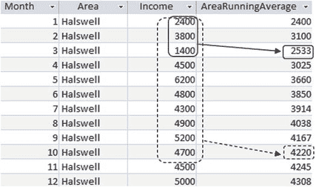

图 9-12.
收入表的累计平均值

`ROWS` 子句的语法是：

```sql
ROWS BETWEEN <start of frame> AND <end of frame>
```

表 9-1 展示了用于指定 `<start of frame>` 和/或 `<end of frame>` 的一些表达式。请记住，如果使用 `ROWS` 子句，则必须始终有 `ORDER BY` 子句。

表 9-1.
指定窗口的行

| 表达式 | 含义 |
| --- | --- |
| `UNBOUNDED PRECEDING` | 从当前分区的起始处开始 |
| `<n> PRECEDING` | 从当前行之前 n 行开始 |
| `CURRENT ROW` | 可用于帧的开始或结束 |
| `<m> FOLLOWING` | 在当前行之后 m 行结束 |
| `UNBOUNDED FOLLOWING` | 在当前分区的结束处结束 |

以下查询明确指定了所需行的（默认）窗口：

```sql
SELECT Month, Area, Income,
AVG(Income) OVER(
PARTITION BY AREA
ORDER BY Month
ROWS BETWEEN UNBOUNDED PRECEDING AND CURRENT ROW
) AS AreaRunningAverage
FROM Income;
```

如果 `ORDER BY` 子句后未指定 `ROWS` 子句，则上述查询中的 `ROWS` 子句是默认行为。

现在我们可以改变哪些行包含在平均值中。假设我们想查看滚动三个月的平均值。这意味着对于每个月，我们取一个平均值，该值包含当前月份、前一个月和后一个月。下面的查询展示了如何在前面的查询中添加另一个 `ROWS` 子句，以同时查看累计平均值和滚动三个月平均值：

```sql
SELECT Month, Area, Income,
AVG(Income) OVER(
PARTITION BY AREA
ORDER BY Month
ROWS BETWEEN UNBOUNDED PRECEDING AND CURRENT ROW
) AS AreaRunningAverage,
AVG(Income) OVER(
PARTITION BY AREA
ORDER BY Month
ROWS BETWEEN 1 PRECEDING AND 1 FOLLOWING
) AS Area3MonthAverage
FROM Income;
```

图 9-13 显示了此查询的输出。框显示了在第 4 个月（实线框）和第 9 个月（虚线框）的行上，哪些值对平均值有贡献。

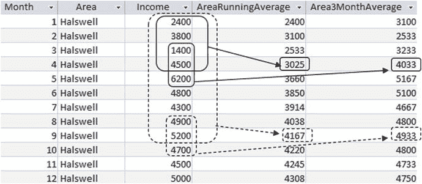

图 9-13.
累计平均值和滚动三个月平均值

第 4 个月行的 `RunningAverage` 包含从开始到第 4 个月的所有值，类似地，第 9 个月行的 `RunningAverage` 包含直到并包括第 9 个月的所有收入。第 4 行的 `Rolling3MonthAverage` 包含第 3 到 5 个月（当前行的前一个月和后一个月）。在第 9 行，`Rolling3MonthAverage` 平均了第 8 到 10 个月（即，第 9 个月的前后各一个月）。

不同的平均值提供了关于业务状况的不同信息。累计平均值提供了本年度迄今为止的平均收入。滚动三个月平均值更好地反映了当前收入的趋势。滚动平均值列中较后的值高于其对应的累计平均值，因为它们不包含最初几个月的较低值。

### 总结

窗口函数提供了一种优雅的方式来执行分区、累计和滚动聚合，并允许在同一个查询中同时获取详细信息和聚合值。

以下是本章涵盖功能的一个简要总结。我在描述中使用了“表”一词，但该功能同样适用于查询的结果。

#### OVER()

使用不带子句的 `OVER()` 函数来计算整个表的聚合值。与简单聚合不同，可以在 `SELECT` 子句中包含其他属性，从而同时保留对详细信息和聚合值的访问。

#### OVER(PARTITION BY <…>)

如果在 `OVER()` 函数中包含 `PARTITION BY`，则行将被按照分区表达式的值相同的方式分组。聚合针对每个分区执行。这类似于简单聚合中的 `GROUP BY`，但其优势在于可以在单个查询中包含多个不同的分区。

#### OVER(ORDER BY <…>)

当 `ORDER BY` 包含在 `OVER()` 函数中时，表（虚拟地）按排序表达式进行排序。然后，聚合针对从表开始到当前行（以及任何排序表达式值相同的后续行）的行进行计算。这用于累计聚合。

#### OVER(PARTITION BY <…> ORDER BY <…>)

表首先按分区表达式的值相同的方式划分为不同的组，然后行在这些组内按排序表达式进行排序。接着，聚合针对从表开始到当前行（以及任何排序表达式值相同的后续行）的行进行计算。

#### OVER(ROWS BETWEEN <…> AND <…>)

`ROWS BETWEEN` 子句可以添加到带有 `ORDER BY` 子句的 `OVER()` 函数中。这会将聚合限制为相对于当前行的一组行，通常是当前行之前的若干行和/或之后的若干行。它对于计算滚动聚合非常有用。

