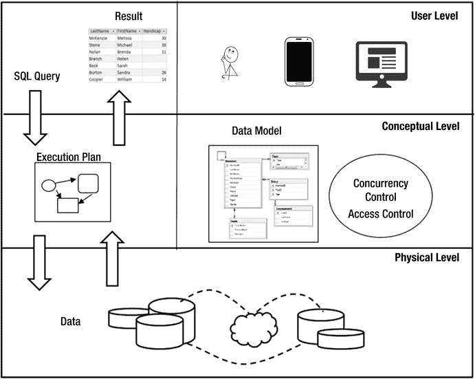
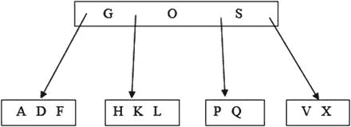
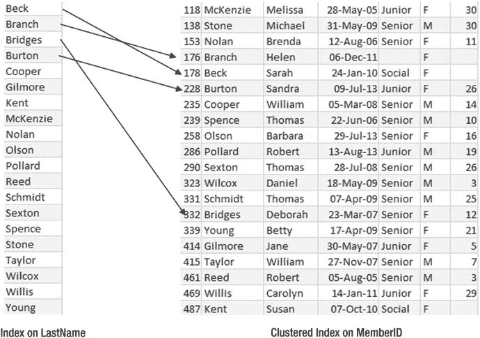
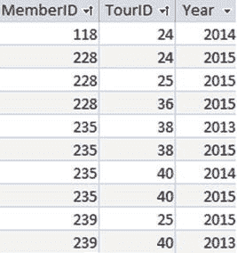
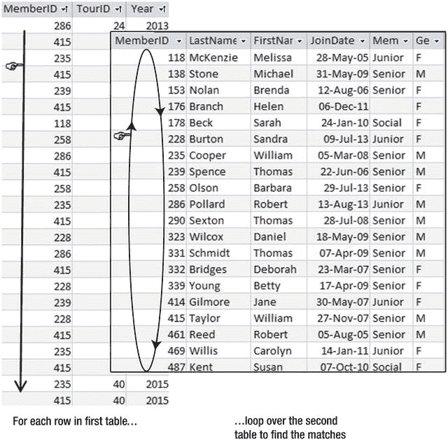
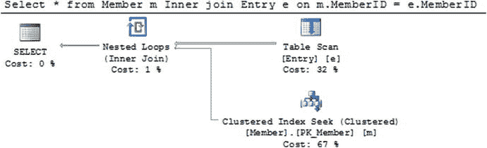
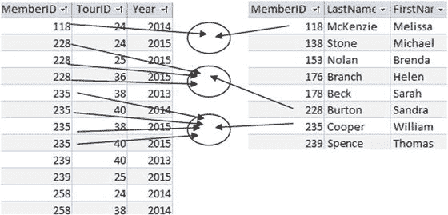
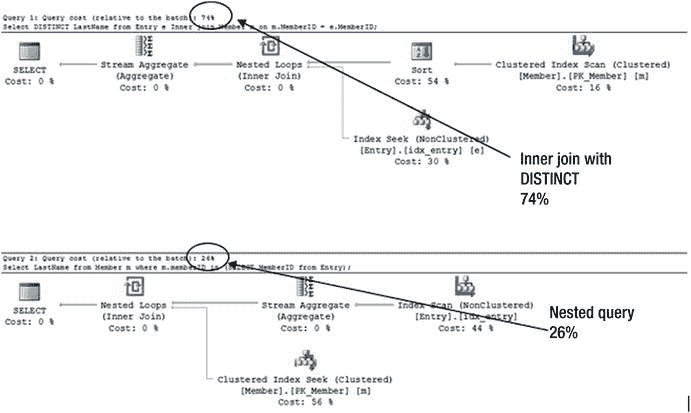

# 10. 效率考量

你可能不需要阅读本章！数据库管理系统（DBMS）非常高效，如果你的数据量适中，大多数查询可能转瞬之间就能完成。为了让查询稍微快一点而把生活复杂化，这并不太有意义。然而，如果你拥有（或可能拥有）海量数据且速度绝对关键，那么你将需要比从一本入门书的一章中所能获得的更多技能和经验。话虽如此，你很可能会听别人说如何表达查询很重要，或者你应该为表建立索引，因此对幕后发生的事情以及理解一些术语有个大致概念会很有帮助。

在本书中，我一直强调，在 SQL 中表达查询往往有多种替代方式。你所使用的 SQL 实现可能不支持某些结构，因此你的选择可能受限。即便如此，对于大多数查询，你通常仍有替代方案。使用哪一种方式有关系吗？其中一个考虑因素是查询的可移植性。如果你不确定查询将在何处使用，你可能会选择避免使用尚未被广泛支持的关键字和操作。然而，通常你会为特定 SQL 实现的数据库编写查询。在这种情况下，你的主要问题是：“查询的不同结构会如何影响性能？”以及“我能做些什么来提高性能？”

### 查询的处理过程

到目前为止，我们一直专注于将需要回答的问题转化为查询，以便从数据库返回恰当且准确的信息。从概念上讲，查询编写者将数据库视为表的集合。SQL 语句是一种表达式，描述了应从这些表中检索哪些数据以及这些数据必须遵守哪些约束（结果 approach）。

我们也已经看到，可以通过描述集合操作（如连接和交集）来指定查询，这将导致返回相应的数据（过程 approach）。使用集合操作使得形成查询非常优雅，但这些操作纯粹是概念性的。虽然我们可能用，比如说，一个连接后跟一个交集来指定查询，但这将被 DBMS 解释为对要返回数据的描述，而不是检索数据的方法。

表和数据模型的概念是我们理解数据片段之间逻辑关系的有用方式。我们将数据的物理存储和检索交给 DBMS 来处理。图 10-1 是一个简化的示意图，展示了不同的抽象层次，有助于我们理解数据库。



图 10-1.
数据库管理系统的层次

在图 10-1 的顶部是用户层。这里我们有各种应用程序和设备，构成了人与数据之间的接口。正是在这里，用户（或应用程序）会构建 SQL 语句（图的左上角）。

中间层是数据库的概念视图。我们可以将数据视为存储在具有各种键和验证约束的表中。在这里，我们还可以建立模型，说明数据库应如何处理并发用户以及允许访问不同数据的规则。我们构建的 SQL 语句都是基于所有这些概念的。

实际数据存储在物理层，如图 10-1 底部所示。我们视为一个表的东西，可能是存储在可能位于不同国家、不同服务器上的数据片段。在这一层，会有索引允许快速访问不同的记录；我们将在本章后面的章节中讨论这些。

如何定位和组装相关信息以产生查询结果，这是 `查询优化器` 的工作。用户构建的 SQL 语句被传递给优化器，优化器可以访问关于（概念）表中的行数、每行中的数据量、已创建索引的属性等信息。它利用所有这些信息来创建一个 `执行计划`。执行计划是一系列高效的步骤，用于查找、比较数据，并将其组装成查询指定的结果。数据根据执行计划从物理存储中检索并组装，然后将结果返回给用户——通常以表的形式。

大多数商业数据库软件提供工具来显示建议的执行计划以及估计的每个步骤执行时间。这提供了对查询如何执行以及时间花费在何处的洞察。一个好的数据库管理员将能够利用此类信息来调整数据库；例如，通过添加新的索引。

在接下来的章节中，我们将简要了解一下记录是如何存储的，索引如何提高效率，以及查询执行时幕后发生的一些事情。

### 查找记录

大多数数据库查询在某些时候都会涉及查找满足特定条件的记录。例如，我们可能想要在单个表中查找记录（例如，`WHERE LastName = 'Smith'`），从两个表中查找满足连接条件的记录（例如，`WHERE m.MemberID = e.MemberID`），或者查找值的存在与否（例如，`WHERE NOT EXISTS...`）。

在一切都以电子方式存储的今天，搜索和查找数据似乎相当容易。如果我们想在在线书籍中查找某个主题，只需打开搜索框并键入一些关键字。但对于实体书来说，情况就大不相同了。我们要么必须逐页扫描，要么希望有一个有用的索引或目录。那些还记得实体电话簿的人会记得，找到 Jim Smith 很容易，但要找出谁住在 Murray Place 16 号却是不可能的。

在数据库幕后，问题与实体书籍相同。数据只能按一种顺序存储，但我们可能希望以多种方式搜索它。了解实际发生的情况很有用，这样我们才能理解影响定位特定记录性能的因素。

查找满足条件的记录的一种方法是简单地顺序扫描表中的每一行。这是找到你想要的东西最慢、成本最高的方式。话虽如此，这可能不是问题。扫描高尔夫俱乐部的 `Type` 表以查找高级会员的会费不会花太长时间。另一方面，扫描（一个现实的）`Entry` 表中的每一行以查找过去四十年中参加了 38 号锦标赛的成员，将是一项更大的工作。

### 按顺序存储记录

如果我们考虑关系理论，那么表²中的行是没有顺序的。这使得我们可以将表视为一个集合，并应用所有的集合操作。从概念的角度看，这很有用，但在实践中，记录的存储方式会影响我们查找所需内容的速度。

如果表中的记录以随机顺序存储（可能是它们被创建的顺序），那么这被称为**堆表**。在堆表中查找记录的唯一方法是扫描整个表。通常，记录会按某个（些）属性有序存储——通常是主键。有各种算法可以在有序表中快速查找特定记录，但大多数都基于**二分查找**的思想。

当我们在电话簿中查找一个姓名或在词典中查找一个单词时，我们采用的就是一种二分查找。在最简单的情况下，我们查看书中中间的一页，判断目标单词是在该页单词之前还是之后。然后我们重新开始，查看感兴趣部分的中间位置。我们很快就能定位到所需的页。如果表中的记录按某个特定字段排序，那么在该字段上的搜索将比在没有索引的字段上搜索更高效。

当我们谈论表中的记录按顺序存储时，我们并不是指它们在磁盘上物理地一个接一个存放。如果是那样的话，如果我们想在开头附近插入一条新记录，就必须移动所有其他记录。可以将这些记录想象成处于一种树状结构中。一种常见的树是 B-树。图 10-2 展示了一个用于存储字母表中字母的 B-树结构的非常简单的表示。



图 10-2. B-树中的数据表示

如果你要在图 10-2 的树中查找一个字母，你会从顶部的节点或方框开始。在顶部节点中，你要么找到你想要的内容，要么沿着合适的路径继续。例如，如果你要找`H`，你会沿着`G`和`O`之间的路径走。这种结构允许在添加和删除记录时造成最小的干扰。我们可以轻松地将`R`添加到包含`P`和`Q`的方框中，而无需更改任何其他字母。维护 B-树并非易事。随着数据的添加和删除，树需要重新排列以保持平衡，并添加和删除节点及层级。幸运的是，所有这些都在底层自动完成。

话虽如此，当我们思考记录有序时，通常最容易想象它们都排成一条线。在本章的剩余部分，我将这样做。

### 聚集索引

如果记录按某种顺序物理存储，那么这被称为**聚集索引**。如果我们认为按姓名顺序存储成员记录是个好主意，我们可以专门创建一个聚集索引，使记录按`LastName`字段的值排序。我们可以用 SQL 语句创建一个索引。我们需要为索引提供一个名称（例如`Clustered_Name`），并指定用于排序索引的字段，如下所示查询：

```
CREATE CLUSTERED INDEX Clustered_Name ON Member (LastName);
```

默认情况下，聚集索引的顺序通常是主键的值。虽然可以为聚集索引指定不同的顺序，但你需要有充分的理由这样做。

有了聚集索引后，现在有两种定位记录的方式。考虑在`Member`表上运行以下查询，该表在`LastName`上有聚集索引：

```
SELECT *
FROM MEMBER WHERE LastName = 'Smith';
```

因为表是按`LastName`排序的，我们可以通过执行二分查找快速导航到正确的记录。这被称为**表查找**。

现在考虑以下查询：

```
SELECT *
FROM MEMBER
WHERE Phone = '03-567-123';
```

我们现在别无选择，只能检查表中的每一条记录。我们甚至不能在找到匹配记录时停止，因为可能有多个记录具有相同的电话号码。这被称为**表扫描**。

### 非聚集索引

表中的记录只能以一种物理顺序存储，因此永远只能有一个聚集索引，而它通常建立在主键上。如果`Member`表的聚集索引建立在主键字段`MemberID`上，我们可以查找特定的`MemberID`值，并找到包含该成员所有详细信息的完整行。如果我们想查找具有特定姓氏的一行，就必须扫描整个表。幸运的是，我们可以在表上设置额外的非聚集索引。从现在开始，我将这些非聚集索引简称为索引。以下是在`Member`表的`LastName`上创建索引的 SQL：

```
CREATE INDEX idx_Name ON Member (LastName);
```

它的作用是创建一个按顺序排列的所有`LastName`值的列表。每个条目都将包含对聚集索引的引用，以便可以找到包含其余信息的完整行。图 10-3 说明了`LastName`索引中的前几个条目如何引用聚集索引。



图 10-3. LastName 上的索引包含对聚集索引的引用以获取完整信息

因为索引是按姓氏排序的，所以可以执行**索引查找**来找到所需的条目，然后使用该引用来查找聚集索引中的关联行，以检索其余信息。

在实践中，查询优化器是否使用特定索引取决于许多因素：表中的行数、索引和表中每行的大小、记录是否最近被访问过并已缓存等等。


#### 复合键上的聚集索引

让我们来考虑 `Entry` 表。回想一下，`Entry` 表有三个字段：`MemberID`、`TourID` 和 `Year`。关于这张表中的数据，我们可能会提出两个问题：

*   某位成员（比如成员 235）参加了哪个锦标赛？
*   谁参加了某个特定的锦标赛（比如锦标赛 40）？

似乎创建两个索引是合理的：一个在 `TourID` 上，一个在 `MemberID` 上。然而，这两个索引都将引用聚集索引。对于 `Entry` 表来说，这将是什么顺序呢？

默认情况下，表将基于主键进行聚集，对于 `Entry` 表，主键是所有三个字段的组合。记录的顺序将取决于我们如何指定主键。假设 `Entry` 表是通过以下 SQL 语句创建的：

```sql
CREATE Table Entry (
MemberID INT,
TourID INT,
Year INT,
PRIMARY KEY (MemberID, TourID, Year);
```

聚集索引中行的顺序将如图 10-4 所示。首先，它们按照 `PRIMARY KEY` 子句中指定的第一个字段（`MemberID`）排序。具有相同 `MemberID` 值的行将按第二个字段（`TourID`）排序，依此类推。



图 10-4.
Entry 表默认聚集索引中的数据顺序

系统可以轻松找到成员 235 参加的锦标赛，因为条目是按 `MemberID` 排序的，并且可以执行表查找。我们不一定需要在 `MemberID` 上添加额外的索引。另一方面，要找出谁参加了锦标赛 40，则需要扫描并检查每一行。在这种情况下，在 `TourID` 上建立索引会是一个改进。

因此，我们指定主键字段的顺序会影响查询的执行方式，并可能影响其他哪些索引是有用的。如果主键字段的顺序被指定为 `PRIMARY KEY (TourID, MemberID, Year)`，那么聚集索引将按 `TourID` 排序。在这种情况下，如果我们经常需要查找特定成员的行，就应该考虑在 `MemberID` 上建立索引。

我特意在图 10-4 的情况中说我们可能不需要在 `MemberID` 上建立索引。优化器会考虑很多因素。其中一个重要的因素是索引中典型条目的大小或字节数。由两个文本字段（如 `LastName` 和 `FirstName`）组成的索引中的每个条目，都会比单个文本字段的索引大，而后者又会比数字字段的索引大。每次访问索引中的一个条目时，都必须检索它，因此存在 I/O（输入/输出）成本，这取决于条目的大小。

如果图 10-3 中的聚集索引在每一行中有显著更多的数据（例如，一些描述性文本字段），那么检索一行的成本将高于仅检索三个数字字段。在这种情况下，考虑在 `MemberID` 上建立索引是值得的。它不会改变需要检查的索引条目数量，但由于每个条目更小，因此 I/O 成本会更小。缺点是，一旦通过索引查找定位到正确的 `MemberID`，系统将需要查找聚集索引以找到其余信息。根据它可以访问的所有信息，优化器将确定是使用 `MemberID` 上的索引并查找其余信息更高效，还是直接扫描聚集索引中的所有记录更高效。

#### 更新索引

索引显然非常有用。为什么我们不直接为我们可能搜索的所有内容都建立索引呢？这当然是可能的。缺点是索引必须维护。每次我们在表中添加或删除一条记录时，该表上的每个索引也需要更新。因此，我们面临一个权衡。大量索引意味着检索速度快但更新慢。较少的索引意味着更新快但可能检索慢。

管理这些权衡是经验丰富的数据库管理员的工作，他们需要具备出色的领域知识。有许多可用的工具可以监控数据库，并提供关于索引使用情况的统计数据以及其他数据信息。如果数据相对稳定，更新很少，那么建立多个索引将使检索更快。如果数据不断更新，那么索引可能适得其反。

在有很多更新的情况下，进行批量数据更新可能是实际可行的。使用批量更新，你可以移除索引。以下查询展示了如何删除本章前面在 `Member` 表上创建的索引：

```sql
Drop idx_Name on Member;
```

然后，可以对表进行所有的添加、删除和修改操作，而无需承担更新索引的开销。在对表的更新结束后，可以重新创建索引。这比对每次更改都更新每个索引可能更高效，也可能不是。

#### 覆盖索引

向某些索引添加更多字段也可能是有效的。考虑以下查询：

```sql
SELECT FirstName
FROM Member
WHERE LastName = 'Smith'
```

如果 `Member` 表在 `LastName` 上有一个索引，那么前面的查询将需要一次索引查找来找到 Smith，然后通过查找聚集索引来找到名字。如果索引是复合索引（`LastName, FirstName`），那么查询所需的所有信息都包含在索引中，无需查找。这被称为覆盖索引。同样，这里存在权衡：索引中更大的行带来更大的 I/O 成本，与查找的成本相比。

#### 索引的选择性

当索引搜索返回的行数相对于表中的行数很小时，索引最有用。

例如，让我们考虑查找特定姓氏的成员信息。在 `Member` 表的 `LastName` 上建立索引，如果我们搜索一个特定的名字，很可能只返回其元素的一小部分。然后，系统可以为这些返回的元素中的每一个查找聚集索引，以检索有关成员的其余信息。

相比之下，如果我们想查找关于女性成员的信息会发生什么？在高尔夫俱乐部的 `Member` 表中，如果我们在 `Gender` 上建立索引并搜索 `'F'`，索引将返回大约一半的条目。然后，DBMS 将不得不在聚集中查找相应的记录。在这种情况下，直接扫描包含我们所需全部信息的聚集索引，而完全不理会索引，可能更高效。

有时索引的选择性并不明显。例如，如果表中的大多数记录具有相同的 `City` 值，并且大多数查询都是针对该城市的，那么在 `City` 字段上建立索引将没有用。

数据库软件通常提供可以为我们提供帮助的工具。这些工具可能提供关于表中字段当前数据分布的统计信息——例如，表中有多少百分比的记录在某个字段（如 `City`）上具有相同的值。这将有助于确定索引是否有用。通常可以收集关于索引使用频率的统计数据。如果优化器很少使用某个索引，那么与其不断更新它，不如将其移除。


### 连接技术

如果我们考虑图 10-4 中的`Entry`表，大多数查询都需要与`Member`表进行连接（join），以找到报名者的姓名，和/或与`Tournament`表进行连接，以找到锦标赛的名称和其他信息。这些连接中的每一个都会将`Entry`表中的外键与`Member`或`Tournament`表的主键进行比较。请参阅第 1 章以回顾我们所说的外键（foreign key）是什么意思。这种将外键与主键连接的情况非常常见，因此值得理解连接是如何执行的。我们将以`Member`和`Entry`表为例，但这些思路具有广泛的应用性。

在执行连接时，可以采用多种不同的方法。哪种方法最高效取决于许多因素，包括表的相对大小、已创建的索引、查询是否还包括投影特定列或选择行、是否指定了输出顺序等等。你不必担心选择哪种方法，因为这将由优化器（optimizer）决定。然而，创建特定的索引会影响所采用的方法。

#### 嵌套循环

一种连接表的方法称为嵌套循环（nested loops）。这意味着系统扫描一个表，并在该表的每一行中查找另一个表中的所有行，以找到符合连接条件的匹配项。图 10-5 针对连接条件`Entry.MemberID = Member.MemberID`说明了嵌套循环方法。



图 10-5. 查找具有匹配 MemberID 的行的嵌套循环方法

在图 10-5 中，外层循环作用于`Entry`表。对于`Entry`表中的每一行，系统都需要在`Member`（内层）表中找到匹配的行。图 10-5 中显示的表是无序的，这意味着为了在`Entry`表的每一行找到匹配记录，需要访问`Member`表的每一行（即全表扫描）。

如果在内层循环的匹配字段上（本例中是`Member`表的`MemberID`）存在索引，那么查找匹配字段将更加高效。可以使用索引快速找到匹配记录，而无需访问每一行。实际上，`Member`表很可能在其主键`MemberID`上有一个聚集索引（clustered index）。如果表以`Entry`表在内层的方式进行嵌套，那么当`Entry`表的`MemberID`上有索引时，内层循环将更有效。优化器将考虑这些信息，以决定嵌套循环选项对于执行连接是否高效，以及哪些表应作为内层表和外层表。

大多数商业数据库系统都会提供工具来查看查询的执行计划。图 10-6 显示了来自 SQL Server 的截图，展示了以下查询中`Member`和`Entry`表连接的执行计划：



图 10-6. 显示嵌套循环的执行计划

```
SELECT *
FROM Member m INNER JOIN Entry e on m.MemberID = e.MemberID;
```

在图 10-6 中，我们在右上角看到对`Entry`表的全表扫描。这是嵌套循环的外层循环（如图 10-5 所示）。右下角的图标显示，对于`Entry`表中的每一行，将对`Member`表的聚集索引执行一次查找（seek），以找到具有匹配`MemberID`的行。

我们在连接查询中指定表的顺序有关系吗？如果我们在 SQL 表达式中把`Entry`表放在前面，会有什么不同吗？以前可能会有。现在几乎肯定不会了。用不同的表顺序表达查询，在 SQL Server 中会产生与图 10-6 相同的执行计划。然而，如果我们更改了选择的字段，或添加了其他索引，或选择对输出进行排序，那么执行计划很可能会发生变化。

#### 合并连接

另一种执行连接的方法是首先按连接字段对两个表进行排序。然后查找匹配行就变得非常容易。这称为合并连接（merge join），如图 10-7 所示。



图 10-7. 合并连接要求每个表都按被比较的字段排序

对表进行排序是一项昂贵的操作。然而，如果表在连接字段上有索引，那么可以通过索引扫描（index scan）有序地访问行，从而使合并连接成为一个可选方案。

如果连接条件中的一个或两个字段都有索引，那么合并连接和嵌套循环连接都将更有效。


### 用于连接的不同 SQL 表达式

在上一节中，我简要提到了连接中表的顺序是否会影响执行。对于图 10-6 中的查询，答案是否定的。然而，我们还有其他表达连接的方式。以下两个查询在 SQL Server 中具有完全相同的执行计划：

```
SELECT LastName FROM Member m, Entry e WHERE m.MemberID = e.MemberID;
SELECT LastName FROM Entry e INNER JOIN Member m ON m.MemberID = e.MemberID;
```

下面两条 SQL 语句则通过嵌套查询来指定连接。它们的执行计划与前面的不同，但彼此之间是相同的：

```
SELECT LastName FROM Member m WHERE m.memberID IN
(SELECT MemberID FROM Entry);
SELECT LastName from Member m WHERE EXISTS
(SELECT * FROM Entry e WHERE m.MemberID = e.MemberID);
```

那么，我们是应该使用还是避免嵌套查询呢？答案一如既往地是“**视情况而定**”。

在比较前面这两对 SQL 语句之前，我们需要注意它们的输出是不同的。第一对会产生重复的名字（为一个成员参加的每个锦标赛重复其姓名）。第二对查询则会产生唯一的姓名。为了进行公平比较，我们将比较以下两个具有相同输出的查询：

```
SELECT DISTINCT LastName
FROM Entry e INNER JOIN Member m ON m.MemberID = e.MemberID;
SELECT LastName FROM Member m WHERE m.MemberID IN
(SELECT MemberID FROM Entry);
```

你可以在图 10-8 中看到这两个计划。



图 10-8.
相同的输出但非常不同的执行计划和成本

图 10-8 显示了顶部使用 `INNER JOIN` 关键字的查询计划和底部嵌套查询的计划。百分比表示如果这两个查询在同一个批次中执行，那么顶部的查询将占总时间的 74%，底部的占 26%。也就是说，`INNER JOIN` 查询花费的时间是嵌套查询的三倍。

顶部查询中 `DISTINCT` 关键字的添加占用了大部分时间。优化器选择对记录进行排序，以便准备移除重复的姓名。这个排序操作占第一个查询总成本的一半以上。看到这个计划，你可能会考虑在 `LastName` 上添加索引，以便可以按照 `LastName` 顺序访问 `Member` 表的记录，从而消除耗时的排序操作。

除非你有真正的内部知识，否则几乎不可能准确猜测优化器会提出什么方案。长远来看，除非表的数据量巨大或者某个查询特别要求时效性，否则这可能并不重要。需要记住的重要一点是，如果你怀疑某个关键查询导致了瓶颈，有些工具可以帮助你理解发生了什么。然后你可以尝试修改索引或查询的表达方式，看看是否能加快速度。

### 总结

索引可以显著提高许多查询的性能。然而，缺点是它们需要被维护。在对数据库进行任何调优时，了解重要的流程是什么至关重要。没有必要费尽心力去改进一个很少执行的查询，而如果你的数据库中大部分时效性强的工作是更新记录，那么提高检索性能反而会适得其反。

许多数据库系统提供的工具可以提供宝贵的信息。执行计划可以深入揭示查询中时间花费在哪里。可以收集有关索引使用情况或字段中数据分布的统计数据。在决定是否值得研究添加新索引时，所有这些信息都很有用。

以下是一些创建索引的通用经验法则。

#### 主键

你通常需要一个很好的理由才不在表的主键字段上创建索引。默认情况下，通常会在主键上放置聚簇索引。

#### 外键

连接条件在 foreign key 和 primary key 之间的连接非常常见。因此，通常值得考虑在外键上创建索引。

#### WHERE 条件

如果你的查询经常在 `WHERE` 条件中使用特定字段，那么在这些字段上创建索引是很有用的。这可以实现索引查找，而不必进行表扫描来查找相关行。当 `WHERE` 条件具有**选择性**（意味着它只会检索一小部分行）时，这种方法最为有用。

#### ORDER BY、GROUP BY 和 DISTINCT

如果没有在排序条件涉及的字段上创建索引，排序可能是一个非常耗时的操作。显然，`ORDER BY` 需要对行进行排序。包含 `DISTINCT` 或 `GROUP BY` 的查询通常会对记录进行排序以删除重复项或聚合数据。通过使用适当的索引，可以使用索引扫描按顺序检索行，从而消除耗时的排序操作。

#### 善用工具

查询优化器非常复杂。它们会维护关于你的表的统计信息（行数、列的大小、数据分布等），并利用这些信息来帮助确定高效的查询执行计划。如果你有一个希望尽可能高效的关键查询，请检查执行计划以了解时间花费在哪里。然后你可以尝试修改查询表述或添加额外索引，观察其效果。

脚注 1

SQL 基于关系演算，它提供了要检索数据的描述。更多信息请参见附录 2。

 2

更正式地说，关系中的元组是没有顺序的。

