# 11. 如何处理查询

在前面的章节中，我们看到了表达查询的不同方式。我们研究了**过程式方法**，它描述了如何操作表和数据以产生所需的结果。这些查询使用描述诸如 `INNER JOIN` 和 `INTERSECTION` 等操作的关键字来表达。我们还研究了如何用**结果式方法**来表达查询，它描述的是结果数据必须满足的条件，而不是检索结果的过程。

然而，有时当我面对一个用自然语言描述的复杂查询时，脑子一片空白的情况也并不罕见。我手头有很多“弹药”，但一时之间却不知道该选择哪种“武器”。

通常，这只是需要自信和放松的问题。大型、复杂的查询总是可以分解为一系列更小、更简单的查询，之后再组合起来。本章将介绍如何做到这一点。

### 理解数据

这听起来像是在陈述显而易见的事实，但如果你不了解所有不同元素的数据存储在哪里以及相关表如何相互关联，你就无法从数据库中检索信息。大多数时候，你查询的是由他人设计的数据库，并且可能随着时间的推移由各种人进行维护和修改。除了理解已实现的表和关系之外，还需要对底层的现实场景有所感受。你还必须警惕一个不幸的现实：数据库可能设计得很糟糕。这可能意味着你无法准确检索所需的信息。我们将在第 12 章更深入地探讨这种应对不良设计的问题。


### 确定表格之间的关系

要概览数据库的实现方式，最好的方法是查看表之间关系的示意图。大多数数据库管理软件都提供了查看表中字段以及表间外键关系的功能。图 11-1 和 11-2 分别展示了我们的俱乐部数据库在外键关系图上的样子，分别由 SQL Server 和 Microsoft Access 描绘。

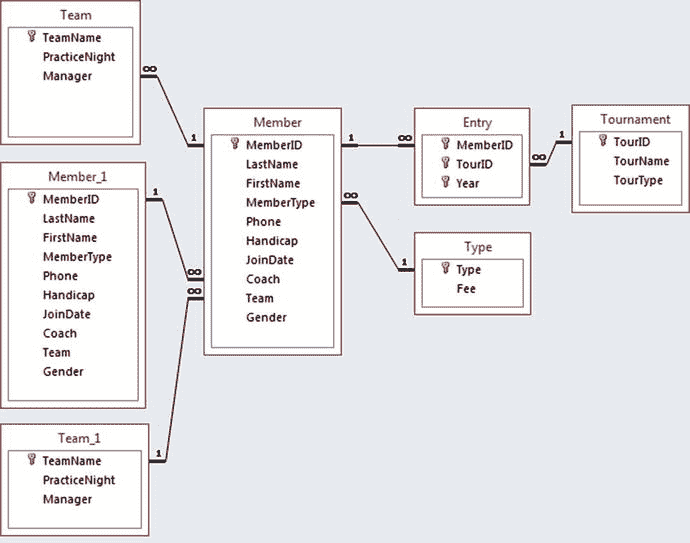

图 11-2.

来自 Microsoft Access 的关系图

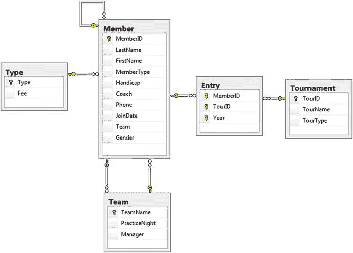

图 11-1.

来自 SQL Server 的数据库图

表面上看，图 11-1 和 11-2 中的示意图看起来有些不同，但它们代表的数据库是完全相同的。图 11-2 中的 Access 示意图多显示了一份 `Member` 和 `Team` 表。`Member` 表出现两份是因为成员之间存在自关系（即，一个成员可以指导其他成员）。`Team` 表出现额外一份则是由于 `Member` 和 `Team` 之间存在两种关系：一个成员可以是一支队伍的管理者，同时一个成员可以属于一支队伍。这些关系在图 11-1 的 SQL Server 图中通过显示表之间的两条连线来描绘，从而避免了表被显示两次。不同的图示表示只是不同管理系统的一个特点。两种示意图都代表了相同的表和关系集合。

图 11-1 和 11-2 中的连线代表了在创建表时设置的外键。例如，创建 `Member` 表的语句包含两个外键约束：

```
CREATE TABLE Member(
MemberID Int PRIMARY KEY,
LastName CHAR(20),
FirstName CHAR (20),
MemberType CHAR (20) FOREIGN KEY REFERENCES Type,
Phone CHAR (20),
Handicap INT,
JoinDate DATETIME,
Coach INT FOREIGN KEY REFERENCES Member,
Team CHAR (20),
Gender CHAR (1));
```

回顾第 1 章，这行代码：

```
MemberType CHAR (20) FOREIGN KEY REFERENCES Type
```

意味着如果 `MemberType` 字段中有值，那么该值必须存在于 `Type` 表的主键字段中。在图 11-1 和 11-2 中可以看到一条代表 `Member` 表和 `Type` 表之间这种外键关系的连线。

而这行代码：

```
Coach INT FOREIGN KEY REFERENCES Member
```

意味着 `Coach` 字段中的值必须已经存在于 `Member` 表的主键字段中；也就是说，`Member` 表上存在一个自关系。在图 11-1 中，这个关系通过一个连接 `Member` 表自身的环形来表示。在图 11-2 中，该关系通过显示 `Member` 表的第二个副本来描绘。

### 现实世界 vs 实现

上一节中的数据库图表示了数据库的实现方式，特别是设置了哪些外键。当数据库最初建立时，其设计基于一个概念数据模型，该模型描述了特定问题的表是如何相互关联的。有多种表示数据模型的方法，例如实体关系图（ER 图）和我们在本书中使用的 UML 类图。图 11-3 展示了高尔夫俱乐部的类图。如果需要回顾如何解读连线和数字，请参考第 1 章。

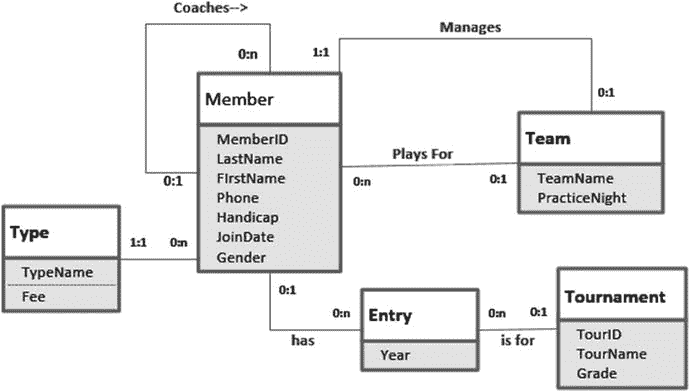

图 11-3.

代表概念模型的类图

图 11-3 中的类图没有在类中显示外键字段。通过比较图 11-3 中的 `Entry` 表与前面两个数据库图中的表，你可以看出这一点。外键 `MemberID` 和 `TourID` 作为属性在类图中缺失了。外键只是在我们选择在关系数据库中实现数据模型时，表示类之间关系的一种方式。如果我们决定在面向对象数据库中实现它，可能根本不需要外键字段。

带有标注清晰的关系的类图，比图 11-1 和 11-2 中的实现图，能让我们对现实世界的情况有更深入的理解。看看 `Member` 和 `Team` 之间的关系，你就明白我的意思了。

关系数据库软件提供的数据库图向你展示了实际已设置的外键。这些可能无法说明全部情况。开发者可能没有（例如）通过在 `Coach` 字段上设置外键约束来实现指导关系。他或她可能忽略了这个需求，或者决定通过其他方式（使用触发器或通过界面）来强制执行“教练必须是现有成员”这一约束。然而，即使 `Member` 表的 `Coach` 字段上没有外键约束，如果我们想设计关于指导关系的可靠查询，仍然需要理解成员之间存在指导关系。

在某些情况下，已实现的数据库可能与准确的数据模型没有太多共同之处。例如，如果高尔夫俱乐部数据库包含单独的成员、教练和管理者表，或者 `Member` 和 `Team` 表之间的某个关系没有实现，那么数据库图和数据模型看起来就会大不相同。获得可靠信息的可能性就会很低。第 12 章会探讨这类问题，尽管除非进行重大重新设计，否则有时你能做的并不多。


### 涉及哪些表？

一旦我们理解了数据库中的表以及它们之间的关系（概念上的以及通过外键存在的关系），我们就可以查看需要哪些表来提取所需的数据子集。考虑这样一个查询：“找出所有参加过利斯顿锦标赛的男性”。这句话包含几个关键词。名词通常是线索，告诉我们可能需要哪些表或字段。动词则常常帮助我们发现关系。让我们看看这些名词。“锦标赛”是一个重要线索，我们有一个 `Tournament` 表，这是一个起点。单词“男性”是查询描述中的另一个名词。我们没有一个 `Men` 表，但我们确实有一个 `Member` 表，其中包含一个 `Gender` 字段。

因此，很明显，`Member` 和 `Tournament` 表将在我们的查询中发挥作用。现在我们需要弄清楚这两个表是如何关联的。图 11-4 显示了包含这两个表的 SQL Server 数据库关系图部分。我们看到它们不是直接相关的，而是通过 `Entry` 表连接起来的。这很有道理，因为动词“参加”就在我们的查询描述中。

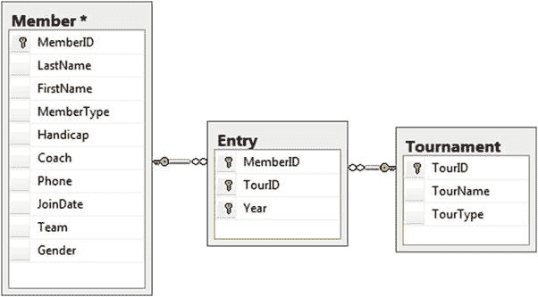

图 11-4. 显示 Member 和 Tournament 表的部分数据库关系图

所以，看起来至少有三个表会涉及我们的查询：`Member`、`Tournament` 和 `Entry`。然后，我们利用对关系运算符的理解来确定如何组合这些表。我们需要连接（join）还是联合（union），或者是这些运算符与其他关系运算符的某种组合？我们将在本章后续章节中探讨如何帮助决定合适的操作。

### 查看一些数据值

从数据库检索信息的请求通常是以相当非正式且不精确的自然语言表述的。即使是一个简单的请求，比如“找出所有参加过利斯顿锦标赛的男性”，也有几点需要我们澄清。查看表中的实际数据有时会有所帮助。

我们的查询实际上并不是“找出”这些男性，而是返回关于他们的一些信息。查看表中的数据值将帮助我们决定哪些信息可能是有用的。提问者大概希望看到这些男性的姓名。我们是否也需要 ID？如果我们想要区分两个同名的成员，就需要 ID。

问题中的某些词指的是什么可能并不总是那么清楚。什么是“利斯顿”锦标赛？利斯顿是一个锦标赛的名称、一种锦标赛的类型，还是一个地点？查看 `Tournament` 表的几行数据可以帮助我们。我们看到 `TourName` 字段里这儿那儿都有值为“Leeston”的情况。有时，确定查询描述中不精确的词所指可能并不那么容易。可能需要与开发人员或用户交谈，以更好地理解他们想要检索什么信息。

我们如何确定哪些成员是男性？幸运的是，`Member` 表有一个 `Gender` 列，看起来我们需要值为 `M` 的行。只选择值为 `M` 的行是否足够？会不会有些行的值是 `m` 或 `Male`？我们将在下一章讨论如何处理数据不一致的问题。现在，我们假设男性由 `M` 表示。

对于本示例中的简单查询，我们现在有了一个更精确的描述。它类似于：“检索 `Gender = 'M'` 且参加了 `TourName = 'Leeston'` 的锦标赛的男性的 `MemberID`、`LastName` 和 `FirstName`。”

你可能还会想到其他需要澄清的细节。询问为什么需要这些信息通常是个好主意。我们只是想找出哪些男性曾经去过利斯顿（因为我们想向其中一人询问有关高尔夫球场的问题），还是我们想知道我们的男性俱乐部成员参加利斯顿锦标赛的次数（因为我们对这个锦标赛在俱乐部成员中的受欢迎程度感兴趣）？正如你将在接下来的“保留适当的列”一节中看到的，这些问题的答案可能不同。

### 宏观方法

我第一次尝试写查询时，很少能做到优雅或完整。对于像“找出所有参加过利斯顿锦标赛的男性”这样的查询，我可能会用两种方式来处理，这取决于我的灵感如何工作。一种方法是宏观法。如果我对如何组合表有点想法，我就会这样做。我将在“不知从何入手？”一节中介绍另一种策略，当我完全不知道从哪里开始时，我会使用它！

在宏观方法中，我喜欢组合所有我需要的表并保留所有列，这样我就能看到发生了什么。我通常发现打开某种 SQL 窗口最容易，这样我可以尝试小的查询，看看中间结果对于回答整体问题是否有希望。

让我们看看查询“找出所有参加过利斯顿锦标赛的男性”的宏观方法。我们确定需要三个表：`Member`、`Entry` 和 `Tournament`。这些表都通过外键连接，这通常意味着连接（join）会很有用。如果你不清楚连接是否是该查询所需要的，那么请参考本章后面“不知从何入手？”部分的方法。

#### 组合表

让我们假设，我们认为连接表对于这个关于男性参加利斯顿锦标赛的查询看起来是一个有希望的方法。你不必一次完成所有事情。从一些小查询开始，慢慢看看情况如何发展。

要执行连接，我们需要找到用于连接的字段。如果需要复习关于连接兼容字段的知识，请回顾第 3 章。`Entry` 表对于此查询至关重要，因为它连接了 `Member` 和 `Tournament` 表。`Entry` 表有一个名为 `TourID` 的外键字段，我们可以将其与 `Tournament` 表的主键连接起来。先做到这一步。

```
SELECT * FROM
Tournament t INNER JOIN Entry e ON t.TourID = e.TourID;
```

图 11-5 显示了结果虚拟表的几行。

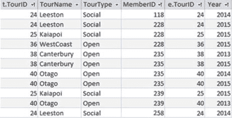

图 11-5. 连接 Tournament 和 Entry 表的部分结果

图 11-5 所示的结果当然很有帮助。我们可以看到参赛记录和相应锦标赛的名称。从前两行可以看出，成员 118 和 228 参加了利斯顿锦标赛。现在我们需要弄清楚 118、228 和其他参加该锦标赛的成员是否是男性，并找到他们的名字。我们可以通过在 `MemberID` 字段上将图 11-5 中的虚拟表与 `Member` 表连接来获取这些额外信息：

```
SELECT * FROM
(Tournament t INNER JOIN Entry e ON t.TourID=e.TourID)
INNER JOIN Member m ON m.MemberID = e.MemberID;
```

图 11-6 显示了结果。我在图 11-6 中没有包含所有列，因为列数很多。你很快就会明白为什么我喜欢尽可能长时间地保留所有列。

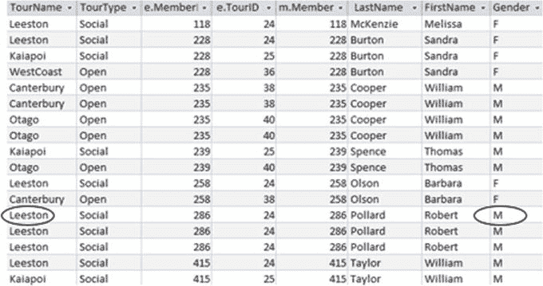

图 11-6. 连接 Tournament、Entry 和 Member 表的部分结果（仅显示部分列）

图 11-6 中显示的虚拟表拥有我们需要查找所需数据的全部信息。前两行显示成员 118 和 228 是女性。成员 286 的行（带有圆圈标记）看起来更有希望。我们该如何修改查询以找到合适的行子集和列子集？


#### 找出所需的行子集

从图 11-6 中我们可以看到，希望在连接结果中保留的行是`Gender`字段值为`M`且`TourName`字段值为`Leeston`的那些行。我们可以通过向之前的查询添加适当的`WHERE`子句来选择这些行：

```
SELECT * FROM
(Entry e INNER JOIN Tournament t ON t.TourID=e.TourID)
INNER JOIN Member m ON m.MemberID = e.MemberID
WHERE m.Gender = 'M' AND t.TourName = 'Leeston';
```

图 11-7 展示了上述查询结果中的部分列。它包含四行：三行对应 Robert Pollard，一行对应 William Taylor。

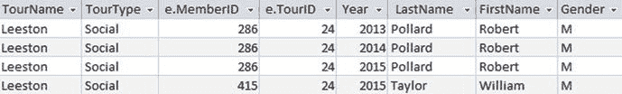

图 11-7.

参加过 Leeston 锦标赛的男性（仅显示部分列）

为什么 Robert Pollard 有三行？这些行除了`Year`字段的值外完全相同。Robert 在三个不同的年份参加了 Leeston 锦标赛。从图 11-6 中可以很清楚地看到这一点，因为我们把`Year`列保留在了输出中。如果我们只保留姓名列，一开始可能会对 Robert Pollard 重复出现三次感到有点困惑。如何处理 Robert Pollard 的重复取决于对初始问题的更清晰理解，这将在下一节中看到。

#### 保留所需的列

我们已经从大型连接中得到了所需的行子集。现在我们需要通过修改`SELECT`子句来仅保留所需的列，该子句当前返回所有列（`SELECT *`）。这并不总是像听起来那么简单。Robert Pollard 的三行数据给了我们一点提示，事情可能并不那么直接。我们有两种可能性。

如果我们只想知道任何年份参加过锦标赛的人，那么我们只需要唯一的姓名 Robert Pollard 和 William Taylor，或许还需要他们的 ID 号。按如下方式修改`SELECT`子句将提供该结果：

```
SELECT DISTINCT m.MemberID, m.LastName, m.FirstName
FROM ...
```

如果问题的目的是找出男性参加 Leeston 锦标赛的频率，那么我们需要保留所有条目。在这种情况下，保留年份以区分不同的行可能是有用的，如下所示：

```
SELECT m.MemberID, m.LastName, m.FirstName, e.Year
FROM ...
```

#### 考虑使用中间视图

用于连接`Entry`、`Member`和`Tournament`表的 SQL 很可能是许多关于参赛情况查询的基础。例如，以下问题都需要连接`Member`、`Entry`和`Tournament`表：

*   青少年会员会参加公开赛吗？
*   William Taylor 在 2015 年参加了哪些锦标赛？
*   2013 年会员参加社交锦标赛的平均次数是多少？

由于我们很可能多次使用这个大型连接，创建一个视图会很方便。视图是一个指令，说明如何创建一个临时表，该表可以在其他查询中使用。以下是尝试创建保留所有连接字段的视图的 SQL：

```
--第一次尝试（未成功）
CREATE VIEW AllTournamentInfo AS
SELECT * FROM
(Entry e INNER JOIN Tournament t ON t.TourID=e.TourID)
INNER JOIN Member m ON m.MemberID = e.MemberID;
```

按目前这样，这个查询在大多数 SQL 版本中无法运行。这是因为视图中会有同名的字段；例如，会有两个名为`MemberID`的字段：一个来自`Entry`表，一个来自`Member`表。

创建视图时，所有字段名必须唯一。视图不会使用别名来区分结果表中的列。`SELECT`子句中的`*`需要修改为列出所有字段名。我们需要要么只包含重名字段中的一个（`MemberID`和`TourID`），要么重命名那些重复的字段（例如，`SELECT m.MemberID AS MMember`，`e.MemberID AS EMember`）。这有点繁琐，但如果你创建的视图可能会多次使用，那么付出这番努力是值得的。

一旦我们有了视图`AllTournamentInfo`，就可以像使用其他任何表一样在查询中使用它。要找出参加过 Leeston 锦标赛的男性姓名，我们可以像这样使用该视图：

```
SELECT DISTINCT LastName, FirstName
FROM AllTournamentInfo
WHERE Gender = 'M' AND TourName = 'Leeston';
```

### 识别问题中的关键词

宏观方法假设我们已经决定了如何组合将对查询有贡献的表。有时，很明显某些表需要被连接。其他时候，可能一开始完全不清楚。在本节中，我们将看一些经常出现在问题中的关键词，这些词可以提供关于需要哪些关系操作的线索。如果这些都没有帮助，请记住我们还有接下来的“不知从何入手？”部分！


### SQL 查询条件分析

#### And, Both, Also

`And` 和 `also` 这两个词在解读查询时可能具有误导性，我们将在下一章进一步探讨这一点。在本节中，我们将研究那些需要同时满足两个条件的查询。需要满足两个条件的查询分为两类：一类可以通过包含布尔 `AND` 运算符的简单 `WHERE` 子句执行，另一类则需要使用交集（`INTERSECT`）或自连接（`self join`）。

为了判断一个查询是否真的需要满足两个条件，我通常会查看一个自然语言语句，看看是否可以用单词 `both` 来连接这些条件。考虑以下示例：

*   查找年轻的男孩。（既是男性又是年轻人？是的。）
*   查找参加了第 24 和 38 号锦标赛的成员。（同时参加了两场锦标赛？是的。）
*   查找妇女和儿童。（既是女性又是儿童？不是。）

最后一个查询有时会让人困惑。虽然它包含了单词 `and`，但“妇女和儿童”的通常含义并非指既是女性又是儿童的人（那是女孩）。相反，这个短语的意思是任何是女性 **或** 是儿童的人（尤其是在救生艇场景下）。

图 11-8 中的图表是可视化自然语言单词 `both` 的真正含义是“两者都”还是“其一”的有效方式。圆圈代表两个集合：女性和儿童。图 11-8a 显示了并集（`UNION`，只需满足一个条件），图 11-8b 显示了交集（`INTERSECT`，必须满足两个条件）。

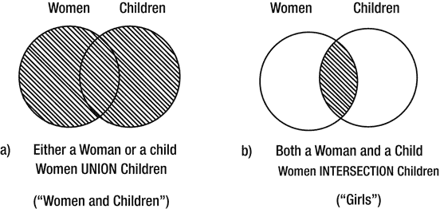
图 11-8. 可视化需要的是并集还是交集

当需要满足两个条件时，我们是在处理两个数据组的交集，如图 11-8b 所示。这并不一定意味着我们必须使用 `INTERSECT` 关键字。我发现以下问题有助于决定下一步该怎么做：

> 我是否需要查看多行数据来判断是否满足了两个条件？

考虑查找年轻男孩的查询。这将需要使用 `Member` 表。我们能否查看单行数据并确定该成员既是年轻人又是男孩？我们可以在图 11-9 中看到，这两条信息都可以在单行中获得。

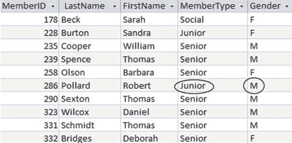
图 11-9. 关于会员类型和性别的信息可在单行中获得

在这种情况下，我们可以使用一个简单的 `SELECT` 操作，配合布尔 `AND` 来检查两个条件，如第 2 章所述：

```
SELECT * FROM Member m
WHERE m.Gender = 'M' AND m.MemberType = 'Junior';
```

现在考虑一个不同类型的查询。如何查找同时参加了第 24 和 36 号锦标赛的成员？为此，我们需要查看 `Entry` 表（如果我们想要姓名，可能还需要与 `Member` 表连接）。正如我们在图 11-10 中所看到的，我们无法通过查看单行数据来检查某个成员（例如，成员 228）是否同时参加了两场锦标赛。

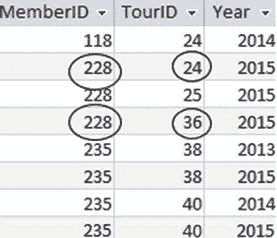
图 11-10. 需要调查多行数据来确认两场锦标赛的参与情况

当我们需要满足两个条件，并且需要查看表中的多行数据时，我们可以使用自连接（第 5 章讨论）或交集（第 7 章讨论）。

如果使用自连接，查询如下：

```
SELECT DISTINCT e1.MemberID
FROM Entry e1 INNER JOIN Entry e2 ON e1.MemberID = e2.MemberID
WHERE e1.TourID = 24 AND e2.TourID = 36;
```

一个使用 `INTERSECT` 关键字但产生相同输出的查询是：

```
SELECT MemberID FROM Entry WHERE TourID = 24
INTERSECT
SELECT MemberID FROM Entry WHERE TourID = 36;
```

#### Not, Never

以下是一些涉及单词 `not` 或 `never` 的查询示例：

*   查找不是老年人的成员。
*   查找不在团队中的成员。
*   查找从未参加过锦标赛的成员。

通常当人们在查询描述中看到 `not` 时，他们会立即想到在 `WHERE` 子句中使用布尔 `NOT` 或 `<>` 运算符。这对某些查询是适用的，但对另一些则会失败。与上一节类似，我发现以下测试有助于理解查询的类别。

> 我是否需要查看多行数据来判断某个条件不成立？

对于前面要点列表中的前两个查询，我们可以查看 `Member` 表中的一行数据，并判断该成员是否满足条件。在第一个查询中，`WHERE` 子句中的条件可以是 `NOT MemberType = 'Senior'` 或 `MemberType <> 'Senior'`。要查找不在团队中的成员，我们希望 `Team` 字段为空，因此类似 `WHERE Team IS NULL` 的子句即可实现。

要查找从未参加过锦标赛的成员，我们需要哪些表？我们肯定需要 `Entry` 表。我们可以通过找到一行包含他或她的 `MemberID` 值来判断该成员是否参加过锦标赛。要查看他或她 **没有** 参加过锦标赛，我们需要查看 `Entry` 表中的每一行数据。我们还必须查看 `Member` 表，因为那些从未参加过锦标赛的成员根本不会出现在 `Entry` 表中。

在这种情况下，像图 11-11 那样从集合的角度思考会很有帮助。

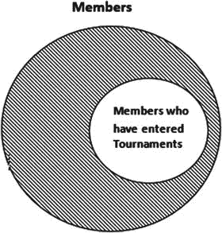
图 11-11. 通过集合运算查找从未参加锦标赛的成员

在第 7 章中，我们学习了如何使用过程方法和 `EXCEPT` 关键字来表示两个集合之间的差集。以下查询将返回从未参加过锦标赛的成员的 ID：

```
SELECT MemberID FROM Member
EXCEPT
SELECT MemberID FROM Entry;
```

如果我们从结果方法的角度思考，可以描述返回特定 `MemberID` 的条件。以下查询是使用 `NOT IN` 查找从未参加过锦标赛的成员 ID 的示例：

```
SELECT m.MemberID FROM Member m
WHERE m.MemberID NOT IN
(SELECT e.MemberID FROM Entry e);
```

第 7 章有很多关于如何使用此类嵌套查询的示例。

#### All, Every

无论何时你在查询描述中看到单词 `all` 或 `every`，都应该立即想到除法运算符（`division operator`）。以下是一些此类查询的例子：

*   查找参加了所有公开锦标赛的成员。
*   是否有人指导过所有的年轻人？

执行这些类型查询的 SQL 示例在第 7 章中有详细解释。


### 无从下手？

现在，让我们来看这样一种情况：我们充分理解了自然语言查询的意图，并且对涉及哪些表有了一定概念。我们已经检查了一些关键词，但仍然感到困惑。接下来该怎么办？这种情况并不少见（我经常遇到），所以放松一点。

当我感到无从下手时，我会把集合操作和 SQL 统统抛在脑后。我不再去想表、外键、连接等等。相反，我会打开我认为回答问题可能需要用到的表，查看其中的一些数据。我尝试找到一些应该是查询会检索出的例子。然后，我尝试写下使这些特定数据可以被接受的条件。

这就是**结果导向法**，描述了查询返回的行应当遵循的条件。如果你在决定操作表的可能操作（即**过程导向法**）时遇到困难，这是一个极好的推进方法。

让我们尝试一个我最初想到时有点被难住的查询：“哪些球队的教练是他们的管理者？”这里描述的步骤真的能帮上忙。

#### 找到一些有用的表

让我们看看查询“哪些球队的教练是管理者？”中的关键词。我们有“球队”、“教练”和“管理者”这些名词。我们有一张名为 `Team` 的表，而 `Coach` 和 `Manager` 分别是 `Member` 表和 `Team` 表中的字段。所以，`Team` 表和 `Member` 表看起来是一个很好的起点。

#### 尝试手工回答问题

接下来，看看表中的数据，思考你将如何判断一支球队的教练是否是其管理者。图 11-12 展示了这两个表的一些相关列。你能找到一支满足条件的球队吗？

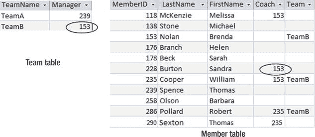

图 11-12.

如何判断一支球队的教练是否也是管理者？

我们可以很容易地找到两位球队管理者的 ID。他们是 `Team` 表中 `Manager` 列的值（239 和 153）。现在，我们如何检查这些成员是否是教练？查看 `Member` 表，我们看到教练位于 `Coach` 列中。我们需要检查这两位管理者中是否有人出现在 `Coach` 列中。成员 153 确实出现在 `Coach` 列中，所以（TeamB）是由一名教练管理的。

#### 写下对检索结果的描述

图 11-12 说明了我们如何确定 TeamB 的教练是其管理者。我们现在需要写下导致该结论的逻辑描述。在这里，我喜欢用手指指向相关的行来更轻松地描述查询，如图 11-13 所示。

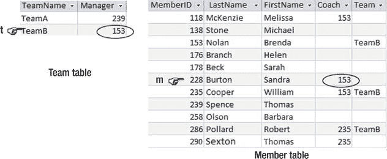

图 11-13.

为行命名以帮助描述所需数据

我们将检查每一支球队，以决定它是否应该被检索。在图 11-13 中，这由标记为 `t` 的手指表示，它会依次访问每一行。我们可以将当前行是否符合标准描述如下：

> 如果存在 `Member` 表中的一行 `m`，其教练值 `m.Coach` 与球队的管理者 `t.Manager` 相同，那么我将输出 `Team` 表中行 `t` 的 `TeamName`。

我们现在几乎可以直接将此翻译成 SQL，使用一个嵌套查询（在第 4 章讨论）。一个可能的查询是：

```sql
SELECT t.TeamName FROM Team t
WHERE EXISTS
(SELECT * FROM Member m WHERE m.Coach = t.Manager);
```

#### 有替代方案吗？

初次尝试的查询不一定是最优雅的。毕竟，我们遵循这条路径正是因为一开始被难住了。这对于查询的执行可能不是问题，因为优化器可能会找到一个高效的过程。然而，一个不够优雅的 SQL 语句可能会让你和他人在以后难以理解。遵循手工求解查询并描述条件的技术，通常能帮助你理解自己试图做什么。这往往会让查询看起来比最初想象的容易得多。

在按照上一节的描述进行了第一次查询尝试后，我们可能会意识到可以这样想：“管理者只需要在教练集合中。”我们可以通过以下查询轻松找到教练的 ID：

```sql
SELECT m.Coach FROM Member m;
```

然后，我们可以在一个嵌套查询中使用它，如下所示：

```sql
SELECT t.TeamName FROM Team t
WHERE t.Manager IN
(SELECT m.Coach FROM Member m);
```

对我来说，前面的查询比之前的那个更简单易懂，尽管它们的结果是等价的。

我们也可以这样表述图 11-13 中说明的条件：

> 如果我在 `Team` 表中有行 `t`，在 `Member` 表中有行 `m`，那么如果 `t.Manager = m.Coach`，我将输出 `Team` 表中行 `t` 的 `TeamName`。

以下是上述句子翻译成的 SQL：

```sql
SELECT t.TeamName FROM Team t, Member m
WHERE t.Manager = m.Coach;
```

前面的查询可以重写为一个连接：

```sql
SELECT t.TeamName
FROM Team t INNER JOIN Member m ON t.Manager = m.Coach;
```

就我个人而言，我不觉得连接操作对于这个查询特别直观。我怀疑其他人看到这个查询时，不会很快理解它的目的。

鉴于有几种方式来表述这个查询，如果你认为效率可能很重要（在此例中不太可能），检查它们的相对效率会很有用（如第 10 章所讨论）。如果我们在连接查询的 `SELECT` 子句中添加一个 `DISTINCT` 短语，那么所有四种替代方案都会产生相同的结果。对于 SQL Server 2012，每个查询都有相同的执行计划，因此它们在底层都是以完全相同的方式执行的。

### 检查查询

我们已经编写了一个查询，运行了它，并检索了一些结果。一切都很好吗？不一定。正如查询的初次尝试可能不优雅一样，它们也可能不正确。错误可能源于查询语法中的简单错误。这些通常很容易发现和纠正。然而，由于对问题或数据的微妙误解而导致的错误可能更难发现。

我无法提供一个万无一失的方法来检查你的查询是否正确，但我可以给你一些发现潜在错误的想法。基本上，它们归结为检查你的结果中是否有额外的、不正确的行，以及检查你没有遗漏任何行。在本节中，我们将探讨发现查询可能存在问题的方法。在下一章，我们将探讨可能导致错误的一些常见错误。

#### 检查一条应该被返回的行

对你的查询应该返回多少行（零行、一行、几行或很多行）有一个大致概念是个好主意。如果你得到的结果数量令人惊讶，那可能是出错的线索。接下来，看看你的数据，确定一条应该被查询返回的记录或行。在我们关于教练是管理者的球队的例子中，我们可以检查各个表，找到一支满足查询的球队。在图 11-13 中，我们看到 TeamB 满足条件，所以检查一下这个球队是否在输出结果中。

记住，有些查询可能完全合理地没有输出。例如，在任何特定时间，基于我们拥有的数据，没有任何球队由教练管理是完全可能的。然而，你的查询必须在所有情况下都能工作。如果可能的话，制作表的副本，修改数据以使某一行符合条件，并检查它是否被正确返回。


#### 检查不应被返回的行

与检查应被返回的行类似，浏览数据并找出一个没有教练作为经理的团队。TeamA 的经理（成员 239）并未作为教练出现在`Member`表中，因此请确保该团队未包含在你的输出中。再次强调，如果真实数据无法覆盖所有可能性，使用一些虚拟数据来检查是个好主意。

#### 检查边界条件

如果一个查询包含任何类型的数字比较，那么除了检查应该返回的数据和不应该返回的数据之外，我们还应该检查边界情况。考虑一个查询，我们想找出加入俱乐部超过十年的人。为了确保正确性，我们需要检查三种可能性：

*   确保对于会员年限少于 10 年的人（例如，8 年会龄），没有记录被返回。
*   确保一个已加入俱乐部 12 年的人，其记录确实被检索到。
*   检查一个会龄恰好为 10 年的人。

最后一个边界条件总是很棘手。这归结为对自然语言问题的解读。“超过十年”是否包括那些恰好在十年前那个季度加入的人？嗯，可能包括，因为一个季度涵盖了一整年。对于这类数字比较，决策在于我们在选择条件中使用`>`还是`>=`。如果对查询意图有任何疑问，向用户确认是很重要的。

在表中找到恰好处于边界上的数据并不总是容易的。然而，通常可以修改查询中的数值以匹配数据。找到一个特定成员，并将你查询中比较的值改为匹配他们的会龄。如果 Harry 是 16 年前加入的，将查询改为与数值 16 进行比较，并查看 Harry 是否如你所预期的那样被包含（或未被包含）。

另一个重要的边界条件，特别是对于聚合和计数（在第 8 章中介绍），是值 0。考虑这样一个查询：“找出参加过少于六个锦标赛的成员。” 对`Entry`表进行分组计数肯定会返回一些行，我们可以检查那些参加次数少于、多于或恰好六次的人。然而，那些从未参加过任何锦标赛的成员呢？他们根本不会出现在`Entry`表中，因此会从结果中缺失。所以，每当涉及聚合时，总要检查计数为 0 时会发生什么。例如，你的查询是否会返回那些没有参加过任何锦标赛的成员？

#### 检查空值

请注意，你正在检查的某些值可能是空值（在第 2 章中讨论）。你关于团队经理的查询如何处理`Manager`字段为空的情况？用一些虚拟数据试试看。当我们运行关于会龄的查询时，如果`JoinDate`字段中存在空值，我们期望（或希望）发生什么？

### 总结

开始查询的第一条规则是不要惊慌。下一条规则是小步前进，并查看中间输出，以判断到目前为止的操作是否对你有帮助。在初始查询中保留尽可能多的列，以便你可以检查自己是否理解正在发生的事情。

图 11-14 总结了一些在刚开始处理查询时可以采取的步骤。该图并未涵盖整个过程，但你应该能够利用这些步骤做出合理的开始。更多帮助请参考相关章节。

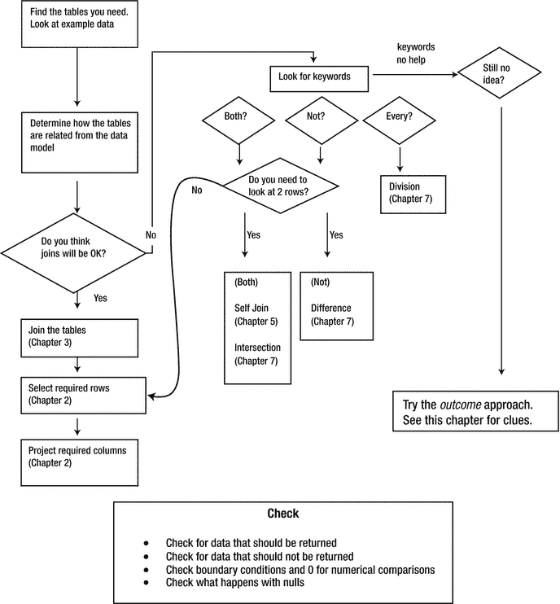

图 11-14. 帮助你开始处理棘手查询的一些步骤

