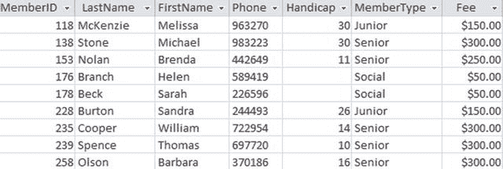
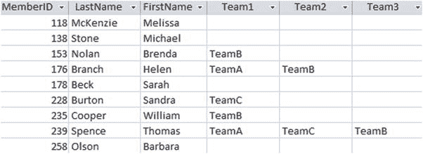
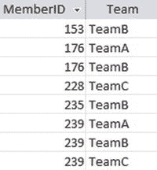
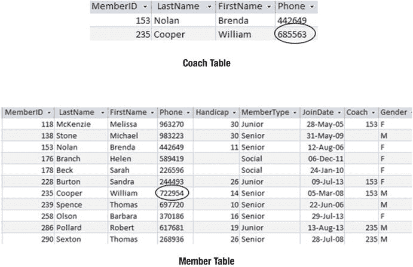

# 12. 常见问题

在本书中，我们探讨了处理各类查询的不同方法。然而，即使一个查询检索出了一些看起来有效的行，也可能并非万事大吉。在上一章中，我们审视了检查输出的重要性，以确认（至少部分）预期的行被检索出来，同时也检查并确保（至少部分）不正确（或不相关）的行没有被返回。

查询可能遇到的问题不仅仅是 SQL 语句语法错误（尽管这当然可能发生）。表设计或数据值的问题也会影响查询的准确性。在本章中，我们将探讨一些常见的设计和数据问题，以及一些最常见的语法错误。

### 糟糕的数据库设计

良好的数据库设计对于能够提取准确信息至关重要。不幸的是，你有时会面临设计糟糕且维护不善的数据库。通常你能做的不多。有时你可以提取出看起来像是所需的信息，但应该附带一个警告，指出底层数据可能不一致。在本节中，我们将看一些常见问题以及如何缓解它们。


#### 未规范化的数据

最常见的数据设计错误之一是使用未规范化的表。我们在第 1 章中已经看过这样的例子：本应分为两个表——一个用于存储会员信息，另一个用于存储会费等会员资格信息——却将所有这些数据都存储在单个表中。如图 12-1 所示，这会导致费用信息被重复存储多次。


图 12-1. 一个包含费用信息的、未规范化的 `会员` 表

那么，现在如果我们被要求查找高级会员的费用会怎样呢？这里的查询将会返回两个值：300 和 250。

```sql
SELECT DISTINCT Fee
FROM Member
WHERE MemberType = 'Senior'
```

虽然查询返回的两个值可能令人惊讶，但查询本身或其结果并没有错。Brenda Nolan 的值与其他高级会员不一致，导致我们得到了额外的费用结果。这个值可能是一个输入错误，或者表示 Brenda 享受了某种折扣，又或者它是去年尚未更新的费用实例。无论哪种情况，设计上都存在问题。设计应该允许为每个等级的常规费用进行一致地记录，并在必要时允许存储额外的折扣方案。此时，除了重新设计表结构，我们别无他法，只能返回已记录在高级会员名下的费用列表。重要的是理解其背后的根本问题。

你可能遇到的另一个问题是，单个表存储了多值数据。我们一直在使用的俱乐部表版本允许一个会员只属于一个团队。俱乐部可能会发展出多种不同类型的团队（俱乐部间团队、社交团队、双人组、四人组等），会员可以同时属于多个团队。当需要为会员记录第二个团队时，一个常见的短期解决方案是在现有表中添加另一个 `团队` 列。图 12-2 展示了 `会员` 表可能如何演变为允许会员关联最多三个团队。


图 12-2. 为会员存储多个团队的糟糕表设计

现在，假设我们被要求查找在 `团队 B` 中的会员。Brenda 在 `团队 1` 列中有 `团队 B`，Helen 在 `团队 2` 列中有 `团队 B`，Thomas 在 `团队 3` 列中有 `团队 B`。我们需要检查每个团队列是否存在 `团队 B`。这并不困难，如下列查询所示：

```sql
SELECT * FROM Member
WHERE Team1 = 'TeamB' OR Team2 = 'TeamB' OR Team3 = 'TeamB';
```

虽然我们可以从图 12-2 的表中提取所需信息，但这种设计会带来问题。如果我们遇到类似“查找同时在 `团队 A` 和 `团队 B` 中的会员”或“查找在两个以上团队中的会员”这样的查询，我们就会遇到麻烦。你或许能设计出回答这些问题的查询，但它们会很笨拙。在尝试满足此类请求之前，我会要求对数据库进行适当重新设计。如果你遇到阻力，可以问他们：如果一个会员属于四个团队甚至二十个团队，他们会怎么办。

如果会员可以属于多个团队，那么我们面对的就是一个 `多对多` 关系，这应该在关系数据库中使用一个中间的 `会员资格` 表¹ 来表示——类似于图 12-3 中的表。


图 12-3. 记录会员与团队之间关系的 `会员资格` 表

图 12-3 中的 `会员资格` 表记录了会员与团队之间的关系，与记录会员和锦标赛关系的 `参赛` 表非常相似。`会员资格` 表需要与 `会员` 表进行连接才能找到关联的姓名，但一旦完成连接，我们就能得到与图 12-2 中相同的信息。有了新的 `会员资格` 表，我们现在就可以使用前面章节描述的所有关系运算，轻松地回答诸如“谁在 `团队 A` 和 `团队 B` 中？”以及“谁在三个或更多团队中？”这样的问题。

我们可以用以下 SQL 代码创建一个 `会员资格` 表。该表仅包含两个外键，分别指向现有的 `会员` 和 `团队` 表，这些字段也共同构成一个连接主键。

```sql
CREATE TABLE Membership(
MemberID INT FOREIGN KEY REFERENCES Member,
Team CHAR(20) FOREIGN KEY REFERENCES Team,
PRIMARY KEY (MemberID, Team) );
```

如果你不介意进行一些手动操作，你可以使用类似下面这样的重复更新查询来填充新的 `会员资格` 表：

```sql
INSERT INTO Membership (MemberID, Team)
SELECT MemberID, 'TeamA'
FROM Member
WHERE Team1 = 'TeamA' OR Team2 = 'TeamA' OR Team3 = 'TeamA';
```

该查询找出每个在 `团队 A` 中的会员，并在 `会员资格` 表中创建相应的行。如果团队数量不多，你可以手动为每个团队（`团队 A`、`团队 B` 等）修改查询的第二行和最后一行，从而相当快速地填充新的 `会员资格` 表。然后，你需要从图 12-2 的 `会员` 表中删除 `团队` 列，这样数据库将得到极大改进。


#### 无主键的表

上一节举例说明了如果底层数据库包含不合适的表，你可能会遇到的问题。有时你会发现表结构是正确的，但却没有设置合适的主键或外键约束。在这种情况下，底层数据值很可能不一致。虽然你的查询语句可能构造正确，但其结果将不可靠。本节将介绍如何使用查询来发现数据中可能存在的一些不一致性。

假设图 12-3 中的 `Membership` 表在创建时没有设置主键。这将允许表中存在重复行。例如，我们可能会有两行完全相同的记录，都表示会员 153 在 `TeamB` 中。一个用于统计 `TeamB` 成员数量的查询将产生错误的结果。

如果你尝试在已存在重复记录的情况下添加主键，系统会报错。这正是发现问题的一种方法！在添加主键之前，你需要先找出重复的行，并研究如何解决问题。一个便捷的找出重复值的方法是，在应该是唯一的字段上执行 `GROUP BY` 查询（参见第 7 章），并使用 `HAVING` 子句找出那些出现两次或以上的记录。以下查询将为我们潜在的主键字段 `MemberID` 和 `Team` 返回重复值：

```sql
SELECT MemberID, Team, Count(*)
FROM Membership
GROUP BY MemberID, Team
HAVING Count(*) > 1;
```

如果表中除了主键字段外还有其他字段，你需要手动检查这些列中的值，以决定应该删除哪一行。只有主键字段的 `Membership` 表则会导致另一个问题。我们如何只删除会员 153 在 `TeamB` 中的那一行的一个副本呢？因为整行数据都是相同的，我们无法区分它们，所以任何删除一行的查询都会把两行都删除。你的软件可能提供类似表格的界面，允许你只删除其中一行，但如果没有，你可能不得不删除两行然后再手动添加回一条记录。如果存在大量重复值，那么另一种解决方法是创建一个新表，然后仅从原表中插入不重复的值。以下查询展示了如何填充新表 `NewMembership`：

```sql
INSERT INTO NewMembership
SELECT DISTINCT MemberID, Team
FROM Membership;
```

之后，你需要移除所有引用旧表的外键约束，删除旧表，重命名新表，并重新创建外键。确保从一开始每张表都有主键会容易得多！

#### 缺少外键的表

另一个问题是 `Membership` 表（如图 12-3 所示）没有外键约束。然后我们可能会遇到这样的问题：存在一行记录表示会员 1118 在 `TeamA` 中，但在 `Member` 表中却找不到会员 1118。如果数据存在这类问题，我们将无法添加外键约束。

有几种方法可以在 `Membership` 表中找出那些在 `Member` 表中没有匹配条目的 `MemberID` 值。一种方法是使用嵌套查询（在第 4 章讨论），如下所示：

```sql
SELECT ms.MemberID FROM Membership ms
WHERE ms.MemberID NOT IN
(SELECT m.MemberID FROM Member m);
```

找到不匹配的 `MemberID` 值后，我们必须判断这是输入错误，还是 `Member` 表中缺失了该会员。

当数据处于一致状态时，就可以为 `Membership` 表添加外键约束，以确保它保持这种状态。以下查询将向 `MemberID` 字段添加该约束：

```sql
ALTER TABLE Membership
ADD FOREIGN KEY (MemberID)
REFERENCES Member;
```

#### 两个表中的相似数据

有时，数据库中可能包含不必要的多余表，这会导致问题。对于我们的俱乐部数据库，一个例子可能是为教练或经理单独设立一张表，如图 12-4 所示。其理由可能是这张额外的表能更方便地创建教练及其电话号码列表（否则需要自连接或嵌套查询）。


*图 12-4. 为教练增设的表可能导致数据不一致*

这张多余的表不可避免地会带来问题。在图 12-4 中，我们已经看到 William Cooper 的电话号码数据不一致。唯一的真正解决办法是去掉这张多余的表。

如果像图 12-4 这样的额外表的目的不明确，我们可以使用集合运算来调查哪些会员出现在各个表中。交集运算符会找出同时存在于两个表中的人的行记录，而差集运算符会找出只存在于一个表而不在另一个表中的人。这可能有助于理解这些表所代表的内容。

一旦设计正确，创建一个显示教练信息的视图将对那些不想每次查询教练信息时都创建自连接的用户有所帮助。以下查询可以实现这一点：

```sql
CREATE VIEW CoachInfo AS
SELECT * FROM Member
WHERE MemberID IN
(SELECT Coach FROM Member);
```


#### 不恰当的类型

在表中使用不恰当的类型创建字段是另一个可能导致查询看起来表现异常的问题。我曾见过整个数据库的所有字段都是默认文本类型。

字段类型错误意味着数据会缺失大量有效性检查。例如，如果我们的`Member`（会员）表全部使用文本字段，最终可能会在`Handicap`（差点）列中出现像 "16a" 或 "1o" 这样的值（该列本应只包含整数），或者在`Coach`（教练）列中出现像 "Brenda" 这样的文本（该列本应只包含会员 ID）。

除了输入值错误之外，不恰当的类型还会引发其他问题。每种类型都有其自身的值排序规则。文本类型按字母顺序排序，数字按数值排序，日期按时间顺序排序。显然，不同的排序方式在我们向查询中添加`ORDER BY`子句时会成为问题。如第 2 章所述，包含数字的文本字段将按字母顺序排序，产生诸如 "1"、"15"、"109"、"20"、"245" 和 "33" 这样的顺序。

错误的类型在进行比较时也会导致问题。如果我们要求比较值，所使用的比较方式将取决于所涉及的具体字段类型的排序方式。对于文本字段中输入的数字，根据前文所述的排序规则，我们会得到诸如 `"109" < "15"` 或 `"33" > "245"` 这样的比较结果。例如，如果我们查询差点小于 5 的人员，这将导致一些奇怪的输出。要弄清楚问题所在可能很困难，因为查询语法是正确的，数据看起来也没问题。深入检查背后的数据类型可能并非显而易见。

可以更改现有表中列的类型，但我觉得这有点令人担心。例如，如果你从文本类型更改为数字类型，"10" 可能没问题，但 "1o" 会导致错误。我倾向于采用更保守的方法：我使用适当的类型创建一个新表，然后借助转换函数插入旧值。下面的查询展示了我们如何用 ID 和姓名，并将`Handicap`列的旧文本值转换为数值，来填充一个新表`NewMember`：

```sql
INSERT INTO NewMember (MemberID, LastName, FirstName, Handicap)
SELECT MemberID, LastName, FirstName, CONVERT(INT, Handicap)
FROM Member;
```

这样，如果转换导致意外结果，我们仍然保留有原始数据。

### 数据值问题

即使数据库设计良好，我们仍然面临已输入数据准确性的问题。作为查询设计者，您无需为某些准确性问题负责。如果一个人的地址输入错误，除了等待邮件被退回发件人之外，几乎没有人能找到或修复这个问题（除了等待邮件被退回发件人）。然而，您可以注意到很多事情，即使无法解决问题，至少也可以发出一些警报。此外，有时通过谨慎使用更新查询，可以修复一些有问题的数据。

#### 意外的空值

空值在数据库中可能引发各种麻烦。真正的问题（如第 2 章所讨论）在于，空值可能意味着值未知，也可能意味着该值不适用于特定记录。如果我们俱乐部的某个会员的`Team`（球队）字段为空，可能意味着他不属于任何球队，也可能意味着他在某个球队但我们尚未记录是哪个。与其他数据问题一样，对此我们能做的有限。然而，对于像`Gender`（性别）字段这样的情况，我们知道对于高尔夫俱乐部，所有会员都需要标识为男性或女性。空值意味着一些会员的性别未被记录。出生日期等字段也是如此。

例如，如果您被要求提供俱乐部中男性的名单，通常最好同时运行另一个查询，查找那些`Gender IS Null`（性别为空）的行。然后您可以告诉您的客户：“这些是男性，这些是我不确定的会员。” 这种方法有助于避免收到未出现在名单上的委屈绅士的来信。

请注意以下两种计数查询的区别：`COUNT(*)` 和 `COUNT(Gender)`。前者将计算数据库中的所有行；后者将计算所有性别值非空的行。在理想的高尔夫俱乐部中，这两者应该是相同的。但在实践中，它们可能并不相同。

#### 不正确或不一致的拼写

任何数据库在某些时候的数据中都会出现拼写错误。Philips 先生可能会因为各种原因显示为 Phillips、Philipps 或 Philps，原因包括申请表上难以辨认的手写到简单的数据录入错误。如果您正在尝试查找有关 Philips 先生的信息，并且怀疑可能有问题，可以使用函数或通配符来查找类似的数据。不同的产品有不同的实现方式。

我们可以使用关键字`LIKE`来查找相似的拼写。通配符符号 `%`（在 Access 中是 `*`）代表任何字符组。以下查询可以检索到我们 Philips 的几种拼写变体：

```sql
SELECT * FROM Member
WHERE LastName LIKE 'Phil%';
```

另一个涉及不正确或不一致拼写的问法出现在您可能期望某个字段有特定值集或类别时。例如，在我们的`Member`表中，我们可能期望`Gender`列有值`M`或`F`，但可能会出现个别`male`或`m`的值。在`MemberType`（会员类型）列中，我们期望`Junior`（初级）、`Senior`（高级）或`Associate`（准会员），但实践中可能会发现`jnior`或`senor`。如果表在设计时设置了适当的检查约束或外键，这不会成为问题。然而，通常这些约束并不存在，因此使用如下查询检查有问题的条目是很有用的：

```sql
SELECT * FROM Member
WHERE MemberType NOT IN ('Senior', 'Junior', 'Associate');
```

找到不符合预期的行后，可能可以修改数据，然后应用检查约束以保持其一致性。例如，以下查询将在`MemberType`字段上应用一个约束，使得只能输入有效的值：

```sql
ALTER TABLE Member
ADD CONSTRAINT Chk_type CHECK(MemberType IN
('Senior', 'Junior', 'Associate'));
```


### 文本字段中的多余字符

当尝试检索与某个文本值匹配的数据时，一个常见的问题是数据中混入了前导或尾随空格以及其他不可打印字符。

例如，如果我们的数据库中有类似 `FirstName` 的字段，我们可能会发现名字前后有一些空格。有时，如果指定了字符字段的特定长度，可能会自动添加尾随空格。如果一行记录的名字被存储为 `'  Dan  '`，那么使用条件 `FirstName = 'Dan'` 的 `WHERE` 子句可能无法检索到该行。大多数数据库软件都提供了多种处理文本的函数。通常会有各种形式的修剪函数，用于删除文本值开头和结尾的空格。请查阅您的文档以了解您的实现提供了哪些函数。

下面的 SQL 语句中的 `RTRIM()` 函数将在进行比较之前，去掉 `FirstName` 值右侧的任何空格：

```
SELECT * FROM Member
WHERE RTRIM(FirstName) = 'Dan';
```

前面的查询并不会永久地从字段中删除空格。`RTRIM()` 函数只是为了进行比较而返回一个不带空格的值。但是，您可以使用更新查询来永久修复其中一些数据不一致的问题。接下来的查询展示了如何确保 `Member` 表的 `FirstName` 列中的任何值都没有前导 (`LTRIM()`) 或尾随 (`RTRIM()`) 空格。它本质上是用修剪后的值替换所有值：

```
UPDATE Member
SET FirstName = RTRIM(LTRIM(FirstName));
```

一个更令人困扰的问题是那些看起来像空格，但实际上是其他空白字符的字符。这有时发生在数据被剪切、粘贴或在各种产品和不同实现之间移动时。这可能需要一些功夫才能追踪出来。

另外两个数据录入陷阱是数字 0（零）和 1（一）被输入，而不是字母 o（哦）和 l（埃尔）。您可能会花费数小时调试一个查找“John”或“Bill”的查询，但如果底层数据被错误地输入为“J0hn”或“Bi11”，您的搜索将是徒劳的。

教训是，数据值可能会发生奇怪的事情，因此当您的查询语法故障排除失败时，请检查底层数据。

### 文本字段中不一致的大小写

如果您的 SQL 实现是区分大小写的，您需要注意某些数据值可能没有预期的大小写。Dan 的名字可能被错误地输入到 `Member` 表中为“dan”。在区分大小写的实现中，使用子句 `WHERE FirstName = 'Dan'` 的查询将无法检索到他的信息。正如第 2 章所述，使用一个将字符串转换为大写的函数将有助于找到正确的行。在接下来的查询中，我们（临时）将 `FirstName` 转换为大写，然后将其与我们要查找内容的大写形式进行比较：

```
SELECT * FROM Member
WHERE UPPER(FirstName) = 'DAN';
```

查找名称中的大小写问题相当困难，因为并非所有名称都符合首字母小写、其余字母小写的规则；例如，de Vere 和 McLennan。但是，对于像 `Gender`（M 或 F）或 `MemberType`（Junior, Senior, 或 Associate）这样的字段，我们知道期望的值是什么。确保它们一致的最佳方法是像本章前面讨论的那样，在字段上设置一个检查约束。

### 诊断问题

在前面的部分中，我们看到了由于糟糕的数据库设计和不一致或错误数据可能出现的问题。然而，在大多数情况下，如果您的查询结果看起来不太对，很可能是因为您的 SQL 语句写错了。该语句可能检索到的行与预期不同。在第 10 章中，有一个部分介绍了一些可以用来检查查询结果是否符合预期的方法。

在上一章中，我建议了一种处理查询的方法，让您能够逐步构建查询，以便检查每个步骤是否返回了合适的行。但是，如果您面对的是一个未能按预期交付结果的、复杂的完整查询，您需要将其精简，直到找到问题所在。如果您已经注意到一个问题，那么您就有了一个很好的起点。您要么注意到一个预期的行缺失了，要么一个不满足要求的行被检索出来了。集中精力找出问题在查询中的哪个位置。以下部分提供了一些建议。

#### 独立检查嵌套查询的部分

如果您有一个查询嵌套在另一个查询中，首先要检查的是嵌套部分本身是否正常工作。看看这个查询：

```
SELECT *
FROM Member m
WHERE m.MemberType = 'Junior' AND Handicap <
(SELECT AVG(Handicap)
FROM Member);
```

如果您在处理类似这样的查询时遇到困难，请剪切并粘贴内部查询，并独立运行它。检查它是否返回了正确的结果。如果这部分没问题，您可以尝试单独执行外部查询。为此，只需在内部查询的位置放一个值（例如 `Handicap < 10`），看看是否返回正确的结果。如果您能将问题缩小到查询的某一部分，那您就开了一个好头。

如果查询的内部和外部部分是相关的（参见第 4 章），这种方法就行不通了，但下面的一些技术可能有助于处理这种情况。

#### 理解表是如何组合的

许多查询涉及使用关系操作（连接、联合等）组合表。确保您理解表是如何组合的，以及这种组合是否合适。考虑如下查询：

```
SELECT m.LastName, m.FirstName
FROM Member m, Entry e, Tournament t
WHERE m.MemberID = e.MemberID
AND e.TourID = t.TourID AND t.TourType = 'Open' AND e.Year = 2014;
```

这个查询涉及三个表。可能需要一点时间才能看出它们正在被连接。确保这对于所问的问题是合适的。第 10 章提供了问题中的关键字示例以及组合表的适当方式。

#### 删除额外的 WHERE 子句

在组合表之后，通常只需要结果行中的一部分。在上一节的查询中，只有部分 `WHERE` 子句是用于连接操作的。连接之后，只保留了满足 `t.TourType = 'Open' AND e.Year = 2014` 的行。如果您的结果中缺少行，删除 `WHERE` 子句中用于在连接后选择最终行子集的那部分通常很有用。如果行仍然缺失，那么您就知道（对于此示例）问题出在连接上。

#### 保留所有列

在开发涉及连接的查询的早期阶段，我非常喜欢始终使用 `SELECT *`。如果我们怀疑连接有问题，那么通过保留所有列可见，我们可以查看连接条件是否按预期工作。一旦我们对检索到的行感到满意，就可以只保留所需的列。

但是，如果我们使用集合操作组合表，这种方法将适得其反，因为投影正确的列至关重要（参见本章后面的“您在集合操作中是否有正确的列”部分）。

#### 检查聚合中的底层查询

如果你的聚合查询（例如 `SELECT AVG(Handicap) FROM ... WHERE ...`）出了问题，请检查在应用聚合函数之前，是否检索到了正确的行。可以将查询改为 `SELECT * FROM ... WHERE ...`，并确认这返回的是你想要计算平均值的那些行。实际上，我建议对聚合查询都这样做，因为否则很难检查返回的数字是否正确。

### 常见症状

在尝试了上一章的一些步骤后，你应该已经简化了查询以定位问题所在。在本节中，我们将看一些具体症状及其可能的原因。

#### 未返回任何行

当你知道本应有行返回但实际上没有时，通常很容易发现查询中的问题。涉及“和”或“两者”的问题常常有此情况。例如，考虑这样一个问题：“哪些成员同时参加了第 24 号和第 36 号锦标赛？”常见的首次尝试（我有时也会不自觉地这样做）的查询语句可能如下：

```sql
SELECT * FROM Entry
WHERE TourID = 24 AND TourID = 36;
```

上述查询要求 `Entry` 表中的某一行，其 `TourID` 字段同时具有两个不同的值。这永远不会发生，因此没有检索到任何行。解决方法是使用自连接（第 5 章介绍）或交集操作（第 7 章介绍）。

查询未返回任何行也可能是下一节中某些问题的一个极端例子。

#### 缺少行

有时很难发现查询漏掉了一些行，尤其是当返回的结果集很大时。如果你得到了 1000 行返回，可能不会注意到少了一行。这需要仔细测试，第 10 章讨论了一些方法。通常值得检查以下常见错误列表，看是否有适用的情况。

##### 是否需要外连接？

在需要外连接时使用内连接是一个非常常见的问题。假设我们要获取包含姓名和费用的成员信息列表。为此，我们需要 `Member` 表（获取姓名）和 `Type` 表（获取费用）。首次尝试的查询可能如下：

```sql
SELECT m.LastName, m.FirstName, t.Fee
FROM Member m, Type t
WHERE m.MemberType = t.Type;
```

我们知道，比如说有 135 个成员，但查询只返回了 133 行。这里的问题是我们执行了内连接（见第 3 章），因此任何成员类型字段为空的成员都不会出现在结果中。当然，这可能是你想要的结果（那些有类型和费用的成员），但如果你想要所有成员的列表以及有费用的成员的费用，这便不是正确的输出。

一个包含 `Member` 表所有行的外连接（也在第 3 章讨论过）将解决这个问题。每当使用连接时，都值得思考连接字段，并考虑当该字段为空时你希望如何处理。

##### 选择条件是否正确处理了空值？

如果你忘记了空值对查询的影响，它们可能会带来不少麻烦。上一节讨论了连接字段中的空值。你还记得检查涉及可能包含空值的字段的比较吗？我们在第 2 章和本章前面已经讨论过这一点。

考虑两个基于 `Member` 表、选择条件分别为 `Gender = 'M'` 和 `Gender <> 'M'` 的查询。按理说，`Member` 表中的所有行都应被其中一个查询返回。然而，`Gender` 字段为空的行对于这两个条件都将返回 `false`（任何与空值的比较都返回 `false`），因此这些行不会出现在任何一个结果集中。

假设我们想获取俱乐部中非顶尖球员的成员列表（也许是为了给他们提供辅导）。有人可能建议使用如下查询来查找没有低差点的成员：

```sql
SELECT *
FROM Member m
WHERE m.Handicap > 10;
```

问题在于上述查询将遗漏所有没有差点值的成员。在这种情况下，将 `WHERE` 条件改为 `m.Handicap > 10 OR m.Handicap IS Null` 会有所帮助。

##### 你是否在查找与文本值的匹配？

试图查找名为 Jim 的行，能在表中看到 Jim，但你的查询却返回空结果，这非常令人困惑。这可能由本章前面“数据值问题”一节中讨论的某个问题引起。

快速排除可疑文本值的一个方法是使用 `LIKE` 进行比较。例如，如果你有 `= 'Jim'`，将其替换为 `LIKE '%Jim%'`。如果查询随后找到了你预期的行（可能还附带其他一些行），那么你就知道问题出在数据上。如前所述，在字符串开头和结尾放置通配符 `%`（在 Access 中是 `*`）可以找到前导或尾随空格以及其他不可打印字符。

##### 是否误用了 AND 代替 OR？

我们在上一章（“识别问题中的关键词”一节）讨论了涉及单词 `and` 或 `or` 的查询问题。我简要回顾一下。单词 `and` 在自然英语中既可以表示并集也可以表示交集。当我们说“妇女和儿童”时，通常指女性集合与年轻人集合的并集。当我们说“小型红色汽车”时，指小型汽车集合与红色汽车集合的交集。

如果我们寻找“妇女和儿童”，并使用选择条件 `Gender = 'F' AND age < 12`，我们实际上是在检索妇女和儿童（或女孩）的交集。我们需要的条件是 `Gender = 'F' OR age < 12`。

很容易在不经意间将英文问题中的 `and` 不恰当地翻译成查询中的 `AND`，这可能导致遗漏行。如有疑问，请尝试绘制上一章描述的维恩图。

##### 集合操作中的列是否正确？

如果你的查询涉及交集或差集操作，结果可能比预期的行数少，因为你最初投影了错误的列。我们在第 7 章讨论过这个问题。这里是一个关于交集的简单示例；差集操作也存在同样的问题。

我们想找出谁同时参加了第 25 号和第 36 号锦标赛。我们知道需要一个交集，并尝试了以下查询：

```sql
SELECT * FROM Entry
WHERE TourID = 25
INTERSECT
SELECT * FROM Entry
WHERE TourID = 36;
```

无论底层数据如何，此查询都不会返回任何行。交集查找的是每个集合中完全相同的行。然而，第一个集合中的所有行 `TourID` 值都是 25，第二个集合中的所有行 `TourID` 值都是 36。永远不可能存在一个同时属于两个集合的行。我们要找的是同时属于两个集合的成员 ID，因此查询每个部分的 `SELECT` 子句应该是 `SELECT MemberID FROM Entry`。

上述查询是一个保留错误列的极端例子，导致没有返回任何行。第 7 章中关于图 7-14 的讨论表明，在交集和差集查询中保留不同的列会导致非常不同的结果。你需要确保保留了与所提问题相适应的列。

#### 比应有的行数更多

通常，发现多余的行比注意到查询结果中缺少行更容易。你只需要看到一个意想不到的记录，然后就可以专注于查询的不同部分，找出它未能被排除的地方。以下是一些导致出现多余行的原因。

##### 你是否用了 `NOT` 而不是差集运算符？

对于包含 `NOT` 或 `NEVER` 字眼的问题，一个必然导致出现多余行的做法是：当你实际上需要一个差集运算符时，却在 `WHERE` 子句中使用了一个条件。我们在第 4 章讨论过这个问题。回顾一下，考虑这样一个问题：“哪些会员从未参加过锦标赛 25？”一个常见的首次尝试是使用选择条件：

```sql
SELECT * FROM Entry
WHERE TourID <> 25;
```

`WHERE` 子句中的条件会逐行检查，判断它们是否应包含在结果中。如果有一条会员 415 参加锦标赛 36 的记录，那么该行将被检索出来，即使可能存在另一条记录显示会员 415 参加了锦标赛 25。例如，如果会员 415 参加了锦标赛 25 和另外四场锦标赛，当我们期望得到零行时，我们却会检索到四行。

解决这类问题的正确方法是使用嵌套查询（参见第 4 章）或 `EXCEPT` 差集运算符（参见第 7 章）。我们需要找到所有会员的集合（来自 `Member` 表），然后移除已参加锦标赛 25 的会员集合（来自 `Entry` 表）。

如果我们采用过程式方法，可能会得出下面这个查询，它寻找两个集合之间的差集：

```sql
SELECT MemberID FROM Member
EXCEPT
SELECT MemberID FROM Entry
WHERE TourID = 25;
```

如果我们从结果式方法入手，可能会得出一个嵌套查询，如下所示：

```sql
SELECT MemberID FROM Member
WHERE MemberID NOT IN
(SELECT MemberID FROM Entry
WHERE TourID = 25);
```

##### 你是否恰当地处理了重复项？

有时需要稍加思考来决定如何处理从查询中检索到的重复记录。默认情况下，SQL 会保留所有重复项。以下两个请求听起来很相似：

*   给我一份我的客户姓名列表。
*   给我一份我的客户所在城市的列表。

在第一个请求中，我们可能期望行数与客户数相同；如果我们有好几个叫 John 的客户，我们期望他们都被保留。在第二个请求中，我们期望每个城市只有一行。如果我们有 500 个客户住在基督城，我们不期望返回所有 500 行。

在查找城市的查询中，我们只想要不重复的值，因此我们应该使用 `DISTINCT` 关键字：

```sql
SELECT DISTINCT (City) FROM Customer;
```

#### 错误的统计信息或聚合

如果我们使用计数、分组或平均值等聚合函数，而基础查询遗漏了行或返回了多余的行，那么统计信息显然会受到影响。另外需要考虑的几点是 `NULL` 值和重复项是如何处理的。

SQL 不会在其统计信息中包含任何 `NULL` 字段。例如，`COUNT(Handicap)` 或 `AVG(Handicap)` 将忽略 `Handicap` 字段中为 `NULL` 的行。同样重要的是考虑你希望如何处理重复项，特别是对于计数函数。`COUNT(Handicap)` 将返回在 `Handicap` 列中有值的会员数量。`COUNT(DISTINCT Handicap)` 将返回 `Handicap` 列中不同值的数量；如果所有会员的障碍值都是 20，它将返回计数 1。

#### 顺序错误

如果你在查询中使用了 `ORDER BY` 子句，并且行的呈现顺序有问题，那么问题通常出在基础数据上。请回顾本章前面的“数据值问题”部分。检查字段类型是否合适（例如，数值没有存储在文本字段中），并且文本值大小写一致且没有多余字符。

#### 常见的拼写错误和语法问题

有时查询无法运行是因为语法上的一些简单问题——即查询的措辞方式。语法问题包括缺少括号、字段或关键字拼写错误等情况。希望数据库软件能在语法有问题时提醒你，但有些编辑器功能相当基础，这可能有助于也可能无助于发现和纠正问题。以下是一些需要检查的项目：

*   **引号**：大多数 SQL 版本要求在文本值周围使用单引号，例如 `'Smith'` 或 `'Junior'`，尽管有些版本在某些情况下使用双引号。如果你复制粘贴查询，请确保正确的引号已被转移。当我将本书中的查询从 Word 复制到 Access 时，引号看起来没问题，但我需要重新输入它们。还要检查所有引号是否正确配对。不要在数值周围使用引号。类似 `Handicap < '12'` 的写法如果 `Handicap` 是数值字段，将会导致问题。
*   **括号**：嵌套查询中需要括号，并且在许多查询（例如涉及多个连接的查询）中，括号也可用于提高可读性。检查所有括号是否正确配对。
*   **表和字段的名称**：显然，你需要正确获取表和字段的名称。然而，有时一个简单的表名或字段拼写错误会导致无法理解的错误信息。请仔细检查。
*   **别名的使用**：如果你对表名使用了别名（例如 `Member m`），请检查你是否将正确的别名与每个字段名关联。
*   **关键字的拼写**：一些用于构建 SQL 查询的软件会高亮显示关键字，因此如果你拼写错误，会非常明显。如果你的软件不显示高亮，那么也要检查关键字的拼写。我经常把 `FORM` 打成 `FROM`，或者把 `AVERAGE()` 打成 `AVG()`。
*   **`IS NULL` 与 `= NULL`**：一些 SQL 版本对这两者的处理方式完全不同。如果你想查找值为 null 的字段，`IS NULL` 总是有效的。

### 总结

在纠正查询之前，你首先需要注意到它是错误的。最好是在用户发现问题之前，由我们自己发现潜在问题。始终检查从查询返回的行，如前一章所述。当你确实发现错误时，以下是一些追踪问题原因的思路：

*   检查基础表是否以适当的方式组合（连接、交集等）。
*   通过移除选择条件和聚合来简化查询，以确保基础行是正确的。
*   在连接查询中保留所有列，直到你确定表已被正确组合。
*   独立地检查嵌套查询或涉及集操作查询的每个部分。
*   检查带有 `AND` 或 `NOT` 字眼的问题的查询，确保在需要集操作或嵌套查询时没有使用选择条件。
*   检查带有集操作的查询中保留的列是否合适。
*   检查 `NULL` 值和重复项是否已得到妥善处理。
*   检查基础数据类型是否正确以及数据值是否一致。

脚注

[1] 更多信息请参阅我的著作《数据库设计入门》（纽约：Apress，20xx）。

[2] 这是定义为具有唯一元组的关系与可以包含重复行的表之间的区别。更多信息请参见附录 2。


