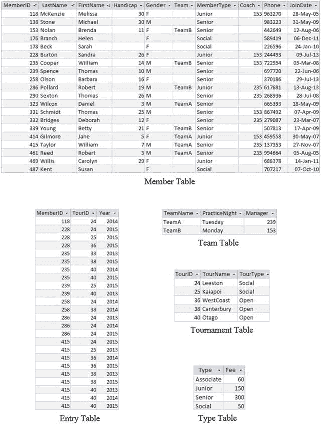
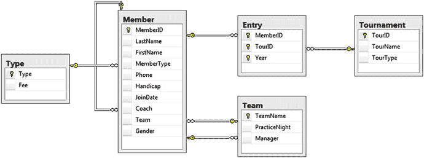

# 1. 示例数据库

本书中的大多数示例都使用高尔夫球俱乐部数据库。请访问本书在 Apress 网站上的目录页面，在“源代码/下载”选项卡下，您将找到此数据库的 Access 版本以及用于创建和填充表的 SQL 脚本。图 A1-1 展示了数据库中各表之间的关系，图 A1-2 展示了表中的数据。

图 A-2. 高尔夫球俱乐部数据库的表和数据

图 A-1. 高尔夫球俱乐部数据库的数据模型

