# 2. 关系表示法

关系数据库理论基于集合论。¹ 当我们查询数据库时，本质上是提出一个问题，以检索包含我们所需信息的子集。检索数据子集有两种方法。关系代数描述了对数据执行的操作（在本书正文中，我们称之为过程方法）。关系演算描述了检索数据必须满足的条件（我们称之为结果方法）。在本附录中，我们将介绍使用关系代数和关系演算来形式化表达查询的表示法。这将使您能够从不同的角度思考查询。如果您对跟进相关的形式数学感兴趣，可以查阅更多理论出版物。² 这里没有提出任何先前未讨论过的新概念——只是表示法不同。更形式化的表示法允许非常简洁地表达查询，并且在处理复杂情况时，其背后的数学基础会非常有用。示例将使用附录 1 中描述的数据库。

#### 引言

作为将数据视为集合如何能帮助我们的一个例子，让我们考虑一个包含地球上所有人信息的集合。我们可以定义一个包含所有男性的子集，另一个包含所有高尔夫球手的子集，另一个包含 40 岁以上人群的子集，以及另一个包含意大利人的子集。这些集合可以相互重叠，如图 A2-1 中的示意图所示。这种类型的图表称为文氏图。

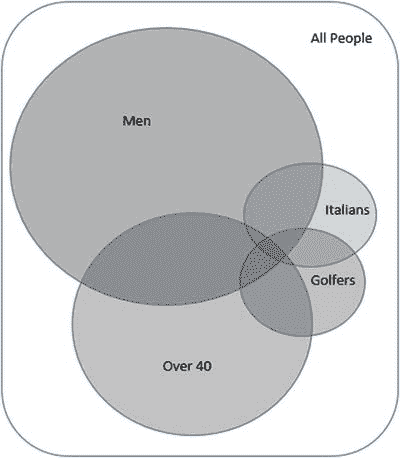

图 A-2-1. 显示人群子集的文氏图

图 A2-1 帮助我们形象化满足特定条件的集合，例如 40 岁以上打高尔夫球的意大利男性（所有圆圈重叠的区域），或者不打高尔夫球的人（大矩形内除高尔夫球手圆圈外的任何地方）。这两个区域很容易描述；然而，定义我们所需的子集并不总是那么简单。找出包含 40 岁及以下的意大利高尔夫球手的区域需要多花点功夫，如果没有图表的帮助也很难描述。

只有当您能在需要时准确提取适当的数据子集时，数据库才是有用的。随着标准变得越来越复杂以及表格数量的增加，要记住所有内容并正确描述您试图查找的内容可能会变得困难。正是在这些更复杂的情况下，拥有更正式和简洁的表示法会非常有帮助。

##### 关系、元组和属性

通常将数据库视为多个表。一个表（例如 `Person`）将包含若干列。表中的每一行代表一个个体，该个体的相应值出现在每一列中。更正式地说，数据库被称为一组关系，每个关系是一组元组。元组是一组属性值；例如，{Ali， Brown， 2/8/1967}。

一个关系由一个标题和一个主体组成。标题是对关系中包含数据的描述。该描述的一部分是一组属性名；例如，{`FirstName`, `LastName`, `Date_of_Birth`}。此外，每个属性都有一个域，或一组允许的值。例如，`Date_of_Birth` 必须是一个有效的日期。域可以是原始类型（例如，整数、字符串）或用户定义的类型（例如，`WeekDays` = {Mon， Tue， Wed， Thu， Fri， Sat， Sun}）。数据库模式是所有关系的标题加上已定义的任何约束的集合。

关系的主体包含数据值。它由包含每个属性值的元组组成。

表 A2-1 展示了描述数据库的两种方式的类比术语。

表 A-2-1. 对比术语

| 关系术语 | 数据库术语 |
| --- | --- |
| 关系（一组关系） | 数据库 |
| 关系（一组元组） | 表 |
| 元组（一组属性值） | 行 |
| 属性名 | 列名 |
| 域 | 列数据类型（原始或用户定义） |

（无键）表与关系或元组集合之间的主要区别在于，元组没有顺序，并且每个元组必须是唯一的。

图 A2-2 展示了我们如何将关系可视化为一组元组。

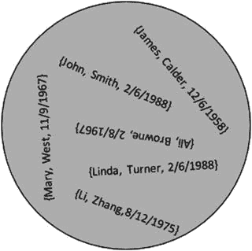

图 A-2-2. 关系是一组元组。

在文氏图中表示集合的传统方式，如图 A2-1，强化了集合中元素没有顺序的概念。没有第一个、下一个或上一个元素。表的常规格式可能暗示行具有某种内在顺序。因此，当您查询数据库时，理论上返回的元组没有保证的顺序，除非您在查询中指定顺序。实际上，一个简单的查询每次重复时很可能以相同的顺序返回行，因为在底层执行的是相同的操作。然而，对于大表，随着元组数量的变化，操作的数量和顺序可能会改变以提高效率，或者可能首先访问先前缓存的数据。这些都可能影响返回元组的顺序。

如第 1 章所述，关系中元组的唯一性对于能够正确识别数据至关重要。如果在图 A2-2 的关系中，我们发现还有另一个名叫 John Smith，出生于 2/6/1988 的人，我们就会遇到麻烦，因为我们将无法区分这两个人的元组。我们需要存储足够的关于人员的信息以便能够区分他们。主键的概念（一组对每个元组都必须唯一的属性）确保了唯一性。

一旦我们将数据视为元组的集合，那么集合操作的所有强大功能就都掌握在我们手中了。


#### SQL、代数与微积分

SQL 是一种主要基于**关系演算**的语言。关系演算描述了所检索的元组必须满足的条件。在下面的 SQL 查询中，`WHERE` 子句描述了结果元组的条件：

```
SELECT LastName, FirstName, Handicap, PracticeNight
FROM Member, Team
WHERE TeamName = Team AND Handicap < 15;
```

尽管 SQL 是一门基于演算的语言，但多年来，其语法中已经包含了越来越多暗示关系代数集合运算的关键字。这在许多情况下使得查询更容易理解。前面的查询也可以使用与关系代数内连接操作相关的语法来编写，如下所示：

```
SELECT LastName, FirstName, Handicap, PracticeNight
FROM Member INNER JOIN Team ON TeamName = Team
WHERE Handicap < 15;
```

前面的 SQL 似乎暗示先执行连接操作，然后再检索那些满足 `Handicap < 15` 的元组。但实际上并非如此。SQL 仅仅是对结果元组的描述，并不暗示查询将如何执行。数据库的查询优化器将决定如何检索元组，一个好的优化器会以相同（最有效）的方式执行这两个查询。

在本附录的剩余部分，我们将探讨一种更正式的关系代数和演算表示法。我通常会提供一个等价的 SQL 表达式，并根据所在章节选择一个与代数或演算相似的表达式。需要记住的重要一点是，所有 SQL 表达式都是对查询输出的描述，其表达方式不一定决定检索结果数据所涉及的实际操作。

#### 关系代数：指定操作

使用关系代数，我们通过对数据库中的关系执行一系列操作或处理来描述查询。一些操作作用于单个关系（一元操作），而另一些操作则是组合两个关系中数据的不同方式（二元操作）。每次我们对一个或多个关系执行操作时，结果都是另一个关系。这是一个非常强大的概念，意味着我们可以通过将一个操作的结果作为输入再应用另一个操作，以小步骤构建出复杂的查询。

关系代数操作及其通常使用的表示符号如表 A2-2 所示。

表 A2-2. 关系运算符及其符号

| Operation | Symbol |
| --- | --- |
| 选择 | σ |
| 投影 | π |
| 笛卡尔积 | 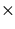 |
| 并 | ∪ |
| 差 | - |
| 内连接 | ⋈ |
| 交 | ∩ |
| 除 | ÷ |

这些操作并非完全独立。例如，我们稍后将看到内连接被定义为笛卡尔积后进行选择和投影。表 A2-2 中的前五个运算符可以用来定义最后三个，这就是为什么 SQL 不需要提供表示除法和交集的关键字。然而，能够为像内连接这样的操作指定等价的 SQL 是很方便的，因为它在数据库查询中出现得非常频繁。现在，我们将为每个操作介绍一种更正式的表示法，并展示如何用它来指定查询。

##### 选择

选择操作仅从关系中返回那些满足涉及属性的特定条件的元组。使用选择操作的一个例子是从我们的 `Member` 关系中检索所有高级会员。希腊字母 sigma (σ) 代表选择操作，条件 `MemberType = 'Senior'` 在下标中指定。以下表达式展示了使用选择操作返回高级会员的表示法：


检查 `Member` 关系中的每一个元组，如果元组满足条件，则将其包含在结果关系中。从表的角度看，选择操作符检索表的行的子集。所有的属性或列都会被返回。

在 SQL 中，`WHERE` 子句包含选择操作符的条件，并控制返回的元组或行。选择操作 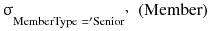 的 SQL 等价形式是：

```
SELECT *
FROM Member m
WHERE m.MemberType = 'Senior';
```

请注意，SQL 中的 `SELECT` 关键字与关系代数的选择操作没有直接关系。更多内容将在下一节中说明。

##### 投影

投影操作返回一个关系，其属性是原关系属性的一个子集。投影操作符用 π (pi) 表示，属性列在下标中。从表的角度看，投影返回表的列的子集。以下语句将从 `Member` 关系中的每个元组返回 `FirstName` 和 `LastName` 属性：

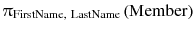

您预期操作 πFirstName 会从 `Member` 关系中返回多少个元组或行？这些元组只包含单个属性 `FirstName`。`Member` 关系有 20 个元组，但这包括了两个 William、两个 Robert 和三个 Thomas。前面我提到，每个操作的结果都是另一个关系。πFirstName 的结果必须是一个唯一元组的集合。重复项都将被移除，最终剩下 16 个唯一的名字。

可以将投影操作理解为返回指定属性值的所有唯一组合。

在 SQL 中，投影操作符要返回的属性在 `SELECT` 子句中指定。我知道这看起来有些反直觉，但请记住 SQL 语法是基于关系演算，而不是代数。投影操作 πFirstName, LastName 的 SQL 等价形式是：

```
SELECT DISTINCT FirstName, LastName
FROM Member;
```


##### 结合选择与投影

由于对关系执行代数运算的结果总是产生另一个关系，因此我们可以连续应用这些运算。下面的表达式首先使用选择操作找出所有高级会员（内层括号内的内容），然后应用投影操作仅返回姓名：

![\[\uppi_{FirstName,\ LastName}\ \left(\ \upsigma_{MemberType = 'Senior'}\left(Member\right)\ \right)\]](A158240_2_En_14_Chapter_Equc.gif)

操作的顺序是否会产生影响？考虑下面这个将选择和投影操作顺序颠倒的表达式：

![\[\upsigma_{MemberType = 'Senior'}\ \left(\uppi_{FirstName,\ LastName}\ \left(Member\right)\ \right)\]](A158240_2_En_14_Chapter_Equd.gif)

由初始投影操作（内层括号）产生的元组仅包含 `FirstName` 和 `LastName` 两个属性。`MemberType` 属性已不在元组中，因此我们无法在选择条件中使用它。该代数表达式无效。

与我们结合的选择和投影操作等价的 SQL 语句是：

```sql
SELECT FirstName, LastName FROM Member
WHERE MemberType = 'Senior';
```

由于 SQL 基于关系演算而非代数，在上述语句中没有操作或顺序的概念。它仅仅是对要检索的元组的描述。

对于更复杂的查询，有时引入中间关系会很有帮助，这样我们可以将查询分解为更小的步骤。例如，我们可以将选择操作产生的关系称为 `SenMemb`，如下所示：

![\[SenMemb\ \leftarrow \upsigma_{MemberType = 'Senior'}\ \left(Member\right)\]](A158240_2_En_14_Chapter_Eque.gif)

现在，我们可以对新命名的关系 `SenMemb` 使用投影操作来返回姓名：

![\[\uppi_{FirstName,\ LastName}\left(SenMemb\right)\]](A158240_2_En_14_Chapter_Equf.gif)

在 SQL 中，我们可以使用视图将查询分解为更简单的步骤。视图可以被视为创建一个新的临时关系的指令：

```sql
CREATE VIEW SenMemb AS
SELECT * FROM Member
WHERE MemberType = 'Senior';
```

然后，该视图可以在其他查询中使用：

```sql
SELECT LastName, FirstName
FROM SenMemb;
```

##### 笛卡尔积

选择和投影操作都是一元运算，这意味着它们作用于单个关系。现在我们将查看二元运算，它们作用于两个关系。一元和二元运算的结果都是一个单一的关系。

笛卡尔积是最通用的二元运算，因为它可以应用于任何两个关系。两个关系 `Member` 和 `Team` 之间进行笛卡尔积的符号表示为：

![\[Member \times Team\]](A158240_2_En_14_Chapter_Equg.gif)

笛卡尔积中的每个元组将包含来自两个参与关系的每个属性的值。结果关系中的元组由原始关系中元组的每一种组合构成。如果一个关系有 N 个元组，另一个有 M 个元组，那么结果关系将有 N x M 个元组。用表格来说，笛卡尔积接受任意形状的两个表，并生成一个表，其中包含原始表中每一列对应的列，以及原始行每一种组合对应的行。图 A2-3 展示了简化的 `Member` 和 `Team` 表及其笛卡尔积。

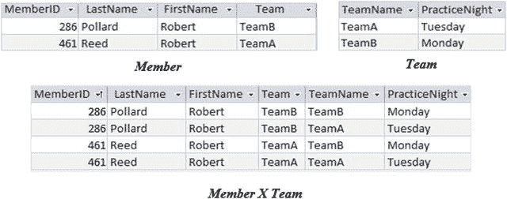

图 A2-3.
`Member` 和 `Team` 的笛卡尔积

SQL 中实现笛卡尔积使用关键字 `CROSS JOIN`，如下语句所示：

```sql
SELECT * FROM Member CROSS JOIN Team;
```

##### 内连接

在关系代数中，内连接被定义为：先进行笛卡尔积，然后进行一个选择操作，该操作比较来自两个原始关系的属性值。被比较的属性必须具有相同的域。

参考图 A2-3 中的表，我们可以指定一个笛卡尔积，后跟一个选择操作，该选择操作将仅返回那些 `Team` 值与 `TeamName` 值相同的元组：

![\[\upsigma_{Team = TeamName}\ \left(\ Member \times Team\ \right)\]](A158240_2_En_14_Chapter_Equh.gif)

我们可以使用连接操作来产生一个等价的表达式。使用连接符号 ⋈，选择条件（或连接条件）在下标中表示，如下所示：

![\[Member\ {\bowtie}_{Team = TeamName}Team\]](A158240_2_En_14_Chapter_Equi.gif)

上面的表达式是等值连接，其中选择条件使用了等号。这是最常见的连接类型。更一般的情况是 θ-连接（西塔连接），其表达式可以包含 `>` 和 `<` 等比较运算。自然连接是指两个关系各自拥有一个或多个同名属性的连接。默认情况下，连接条件将是这些同名属性值的相等性比较，并且其中一个重复属性将通过投影操作从最终结果中移除。

当表达式涉及多个操作时，我们常常可以选择操作的应用顺序。例如，如果我们想检索 Pollard 先生的练习之夜，我们可以在连接之前从 `Member` 关系中选择 `Pollard`，也可以在连接之后从连接结果中选择。这两种选择如下所示：

![\[\uppi_{PracticeNight}\ \left(\upsigma_{LastName\ = 'Pollard'}\ \left(Member\ {\bowtie}_{Team= TeamName\ } Team\right)\ \right)\]](A158240_2_En_14_Chapter_Equj.gif)

上面两个表达式产生的元组是相同的；然而，获取它们的方法却大不相同。第一种方法首先需要创建一个 `Member` 和 `Team` 笛卡尔积的大关系。在第二种表达式中，我们先将 `Member` 关系中的元组数量减少到只有 Pollard 的元组，然后再构造一个更小的笛卡尔积。显然，第二种表达式效率更高。

SQL 基于演算而非代数，因此并不隐含任何操作顺序。虽然下面的 SQL 语句可能暗示连接是首先执行的，但它仅仅是一条描述要检索元组的语句：

```sql
SELECT *
FROM Member INNER JOIN TEAM ON Team = TeamName
WHERE LastName = 'Pollard';
```

数据库系统中的查询优化器将确定执行查询的有效方法。


#### 并集、差集与交集

由于关系被定义为元组的集合，因此可以使用三种二元集合操作——并集（`∪`）、差集（`-`）和交集（`∩`）——来检索信息。对于关系代数，还有一个额外的约束：参与这些操作的两个关系必须是**并兼容的**。这意味着这两个关系必须具有相同数量的属性，并且每个关系中的对应属性必须在相同的域上定义。

例如，考虑具有以下属性的两个关系：

```
Staff:{FamilyName, FirstName, Salary}
Students:{LastName, Name, Address, Course}
```

集合操作将帮助我们检索所有人的姓名（并集）、既是学生又是教职员工的人的姓名（交集），以及是学生但不是教职员工或反之亦然的人的姓名（差集）。（当然，这里对姓名唯一性做了天真的假设！）

我们无法直接比较现有关系中的元组，因为它们具有不同的属性。`Staff` 和 `Student` 不是并兼容的。一个关系有 `Salary`，而另一个有 `Address` 和 `Course`。然而，姓名是可以比较的，因为它们在每个关系中具有相同的域（文本）。我们可以通过对每个原始关系应用投影操作来仅检索姓名，如下所示：

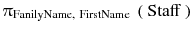

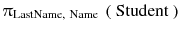

严格来说，对于并兼容性，属性应该是相同的（相同的名称和域）。然而，在实践中，只需要域相同，属性的顺序决定了比较的内容。我们现在可以对新的并兼容关系应用三种集合操作中的任何一种。例如：

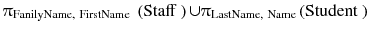

对应的 SQL 表达式是：

```
SELECT FamilyName, FirstName FROM Staff
UNION
SELECT LastName, Name FROM Student;
```

我们可以继续对表达式的结果应用操作。如果慢慢来，这是相当直接的。例如，如果我们想找出既是学生又是教职员工的那些人的姓名和薪水，我们可以从初始关系开始，构建一系列关系代数操作。请参见以下步骤：
1.  投影出姓名以获得并兼容的关系。
2.  使用交集操作找出那些既是教职员工又是学生的人。
3.  将结果与 `Staff` 关系进行连接，以便我们能够访问 `Salary` 属性。
4.  投影出 `Names` 和 `Salary` 属性。

您可以在以下表达式中看到这些操作中的每一个——只需从内到外阅读括号即可：

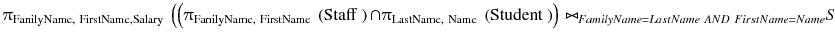

并集、差集和交集并不是独立的。交集可以用两个差集操作来表示。假设 `StaffNames` 和 `StudentNames` 是两个并兼容的关系，我们有：

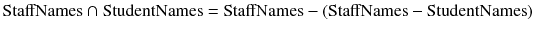

您可以自己画一系列图来确信这一点。

某些版本的 SQL 语言不实现 `INTERSECT` 关键字，因为如上所示，查询可以使用 `EXCEPT`（SQL 中表示差集的语法）重新表述。以下 SQL 查询使用 `INTERSECT` 关键字：

```
SELECT * FROM StaffNames
INTERSECT
SELECT * FROM StudentNames;
```

一个等效的查询可以使用 `EXCEPT` 关键字来构造：

```
SELECT * FROM StaffNames
EXCEPT
(
SELECT * FROM StaffNames
EXCEPT
SELECT * FROM StudentNames
);
```

#### 除法

除法是我们将要考虑的最后一个关系代数操作。理解除法操作最简单的方法是通过一个例子。

如果我们想知道俱乐部的哪些成员参加了每一场比赛，我们需要两条信息。我们需要关于成员以及他们参加过的比赛的信息，这可以从 `Entry` 表中获得；我们还需要所有比赛的列表，这来自 `Tournament` 表。

在图 A2-4 中，您可以看到除法如何工作。它显示了来自 `Entry` 关系的 `MemberID` 和 `TourID` 属性，以及来自 `Tournament` 关系的 `TourID` 属性。除法的结果是 `MemberID` 值的集合，这些值在 `Entry` 关系中对于每一个 `TourID` 值都有一个元组。

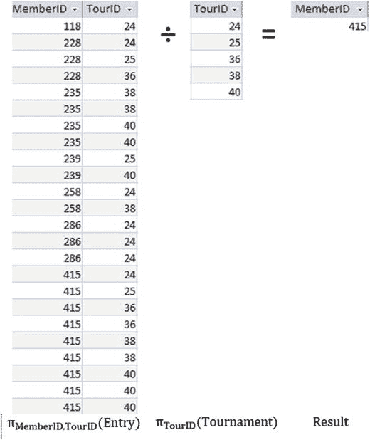

**图 A2-4.** 使用除法操作符查找参加了所有比赛的成员

图 A2-4 中除法操作的关系代数表达式如下：

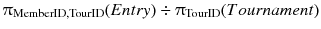

SQL 中没有用于除法操作的关键字。但是，可以用其他代数操作来表达除法。如果一步呈现可能会有点吓人，所以我们会慢慢来。

首先，找出所有参加过至少一场比赛的成员，并通过笛卡尔积为每个成员与每一场比赛创建配对。我们将生成的关系称为 `AllPairs`：

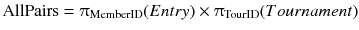

现在，我们将通过使用差集操作，从 `AllPairs` 中移除那些在 `Entry` 表中存在的配对。如果从结果中投影出 `MemberID`，我们将得到没有与所有比赛关联的成员的 ID。

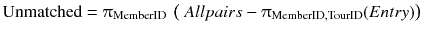

通过从 `Entry` 关系中的 `MemberID` 里移除这些不匹配的 `MemberID`，我们将得到所需的结果：

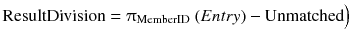

我们可以使用 SQL 视图以可管理的方式表达这些相同的步骤。首先，创建一个包含所有成员和比赛配对的视图：

```
CREATE VIEW AllPairs AS
SELECT M.MemberID, T.TourID FROM
(SELECT MemberID FROM Entry)M
CROSS JOIN
(SELECT TourID FROM Tournament)T;
```

现在创建一个视图来找出不匹配的配对：

```
CREATE VIEW Unmatched AS
SELECT * FROM AllPairs
EXCEPT
SELECT MemberID, TourID
FROM Entry;
```

现在使用这两个视图来找到除法的结果；即，参加了每一场比赛的成员的 `MemberID`：

```
SELECT MemberID FROM Entry
EXCEPT
SELECT MemberID FROM Unmatched;
```

如果您有足够的勇气，可以尝试将所有这些步骤合并为一个 SQL 查询；然而，在本附录后面关于全称量词的部分，我们将探讨一种使用关系演算来表达等效查询的更易于管理的方法。


#### 关系演算：指定结果

关系代数让我们能够指定一系列操作，最终得到包含所需信息的元组集合。关系演算不描述如何执行查询，而是描述结果数据应满足的条件。本节将非常简要地介绍描述演算查询的符号，而不深入数学细节。

##### 简单演算表达式

用非正式语言描述，关系演算对查询的描述具有以下形式：

> 我想要满足以下条件的元组....

更正式地，我们可以将上述内容表达为：

```
{ m | condition(m) }
```

竖线 `|` 左侧的部分指定了我们希望返回的元组中的属性，而右侧部分（通常称为谓词）描述了它们必须满足的条件。`m` 称为元组变量，`condition(m)` 是一个函数，对于返回的每个元组 `m`，该函数必须为真。严格来说，前面的符号称为元组演算。另一种等效的符号（此处不作探讨）是域演算。

以下表达式意味着每个返回的元组 `m` 必须来自 `Member` 关系，并且 `MemberType` 属性的值必须为 'Senior'：

```
{m | Member(m) AND m.MemberType = 'Senior'}
```

我们可以进一步优化表达式，以指定元组 `m` 的哪些属性应包含在结果中：

```
{m.LastName, m.FirstName | Member(m) AND m.MemberType = 'Senior'}
```

由于 SQL 基于关系演算，等效的 SQL 语句几乎是演算表达式的直接翻译，如下所示：

```sql
SELECT m.LastName, m.FirstName
FROM Member m
WHERE m.MemberType = 'Senior';
```

演算表达式中竖线 `|` 左侧的部分成为 `SELECT` 子句，`Member(m)` 成为 `FROM` 子句，表达式的其余部分构成 `WHERE` 子句。在 SQL 中，`m` 可以称为表别名，但将其视为元组变量同样有益。

##### 自由变量与绑定变量

以下演算表达式检索成员姓名及其会员类型对应的费用。它本质上是 `Member` 和 `Type` 关系之间的内连接。

```
{m.LastName, m.FirstName, t.Fee | Member(m) Type(t) AND m.MemberType = t.Type}
```

元组变量 `m` 和 `t` 被称为自由变量。在给 `m` 和 `t` 赋值之前，无法对表达式右侧的条件进行求值。通常的做法是，让自由变量遍历其各自关系中的每个元组，然后对每个组合求值条件，以判断其是否应包含在结果中。在本书正文中，我建议将变量想象成附着在手指上，这些手指在各自的关系中移动，从而确定条件（此处为 `m.MemberType = t.Type`）是否为真。自由变量表示要返回的元组，应始终出现在竖线左侧。

假设我们想要查找那些参加了任何锦标赛的成员的姓名。为了将某个成员包含在结果中，`Entry` 关系中必须存在该成员对应的元组。符号 ∃（意为“存在”）在下面的演算表达式中用于返回那些在 `Entry` 关系中存在 `MemberID` 的成员的姓名：

```
{m.LastName, m.FirstName | Member(m) AND
∃(e)(
Entry(e) AND m.MemberID = e.MemberID
)
}
``

我已将表达式分布在不同行上，以便变量 `e` 的条件清晰可见。变量 `e` 称为绑定变量。它不出现在等式左侧，仅用于确定表达式右侧的条件是否为真。自由变量（始终出现在表达式左侧）是我们需要考虑所有可能性的变量。在上面的表达式中，我们的自由变量 `m` 依次被赋予 `Member` 关系中每个元组的值。对于 `m` 的每个值，我们使用绑定变量 `e` 来帮助判断 `Entry` 关系中是否存在合适的元组。

绑定变量需要有一个所谓的量词，它解释了在计算条件语句时将如何使用该变量。在本例中，我们使用存在量词 (∃)，它要求我们在关联关系中找到一个满足条件的元组。还有一个全称量词 (∀)，要求关联关系中的每个元组都满足条件。我们现在将看一些使用这些量词以及等效 SQL 语句的示例。

##### 存在量词与 SQL

诸如 `∃(e)(Entry(e) AND (condition(e))` 的表达式为真，如果我们在关系 `Entry` 中能找到一个满足指定条件的元组 `e`。让我们看看如何在 SQL 中表示此查询：

```
{m.LastName, m.FirstName | Member(m) AND
∃(e)(
Entry(e) AND e.MemberID = m.MemberID
)
}
```

首先，我们将考虑一个尽可能紧密遵循演算的 SQL 表达式，它使用 `EXISTS` 子句：

```sql
SELECT m.LastName, m.FirstName
FROM Member m
WHERE EXISTS (
Select * FROM Entry e WHERE e.MemberID = m.MemberID
);
```

如你所见，SQL 几乎是演算语句的直接翻译。等效地，我们可以用嵌套查询和 `IN` 子句来表示存在性要求：

```sql
SELECT m.LastName, m.FirstName
FROM Member m
WHERE m.MemberID IN (
SELECT MemberID FROM Entry e
);
```

前面的每个 SQL 语句都返回了正确结果，但我相信你会觉得这是种复杂的实现方式。查找参加过锦标赛的成员的查询可以更简单地表达为两个关系之间的连接：

```sql
SELECT m.LastName, m.FirstName
FROM Member m, Entry e
WHERE e.MemberID = m.MemberID;
```

前面的 SQL 语句与前两个并非严格等效。后者将返回重复的姓名，成员参加的每个锦标赛都会返回一条记录。如果我们看前两个 SQL 查询，它们会检查 `Member` 表中的每个元组（仅一次），并在 `Entry` 表中寻找对应的元组。最后一个查询考虑了 `Member` 和 `Entry` 中元组的所有组合，并返回任何满足条件的组合（从而返回了重复项）。

尽管我们可以通过在最终的 SQL 查询中添加 `DISTINCT` 关键字来删除重复项，但它考虑的是用于包含在结果中的不同元组集合，因此它响应的是与前两个 SQL 语句微妙不同的问题。关系演算查询非常精确，正是这种精确性在某些情况下可能很有帮助。

要查找未参加任何锦标赛的成员，我们只需在查询参加锦标赛成员的表达式中用 `NOT` ∃ (或 ∄) 替换 ∃：

```
{m.LastName, m.FirstName | Member(m) AND
NOT ∃(e)(
Entry(e) AND m.MemberID = e.MemberID
)
}
```

等效的 SQL 语句只需添加关键字 `NOT`，如本例所示：

```sql
SELECT m.LastName, m.FirstName
FROM Member m
WHERE NOT EXISTS (
SELECT * FROM Entry e
WHERE e.MemberID = m.MemberID
);
```


#### 全称量词和 SQL

全称量词 `∀` 允许我们检查一个条件是否对某个集合中的所有元组都成立。这正是我们为了查询找出参加过**所有**锦标赛的会员姓名所需要的功能。我们已经多次研究过这个查询了！下面的关系演算语句是表达该查询的直接方式：

```
{m.LastName, m.FirstName | Member(m) AND
∀(t)(
Tournament(t)
∃(e)(
Entry(e) AND
e.MemberID = m.MemberID
AND e.TourID = t.TourID
)
)
}
```

该演算语句应解释为：“检索`Member`中特定元组`m`的`LastName`和`FirstName`，条件是对于`Tournament`中的每一个元组`t`，在`Entry`中都存在一个对应于会员`m`和锦标赛`t`的元组`e`。”

你会认出这个查询的结果等价于关系代数中的除法运算符。你还会记得 SQL 没有对应于除法的关键字。遗憾的是，它也没有对应于全称量词的关键字。幸运的是，关系演算可以通过使用以下恒等式来帮助我们：

```
∀(t)(condition (t)) ≡ NOT ∃(t)(NOT condition(t))
```

这个语句意味着，如果我们说“对于每个元组`t`，某个条件成立”，那就等同于说“不存在一个元组`t`，使得该条件不成立”。我们可以利用这个恒等式将原始演算表达式改写为如下形式：

```
{m.LastName, m.FirstName | Member(m) AND
NOT ∃(t)(
Tournament(t)(
NOT ∃(e)(
Entry(e) AND e.MemberID = m.MemberID
AND e.TourID = t.TourID
)
)
}
```

本质上，这表示在`Tournament`中不存在元组`t`，使得在`Entry`中没有对应的元组`e`。这可以相当容易地转换成下面看到的 SQL 语句：

```
SELECT m.LastName, m.FirstName
FROM Member m
WHERE NOT EXISTS (
SELECT * FROM Tournament t
WHERE NOT EXISTS (
SELECT * FROM Entry e
WHERE e.MemberID = m.MemberID
AND e.TourID = t.TourID
)
);
```

#### 示例

让我们来看一个在代数和演算上可能有点棘手的查询。我们想找出从未参加过 Leeston 锦标赛的女性姓名。

##### 代数

首先，我们需要通过连接 `Tournament` 和 `Entry` 表，然后使用选择操作，来检索 Leeston 锦标赛的所有参赛记录：

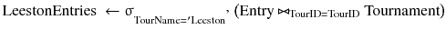

“从未参加过”这个词暗示我们需要一个差集运算符。因此，我们需要通过在 `Member` 表上使用选择操作来找出所有女性的集合，然后移除那些曾在 Leeston 参赛过的人员的集合。为了使用差集运算符，我们需要并兼容的关系，所以我们将从刚才描述的两个集合中只投影出 `MemberID`。下面的表达式将返回那些未参加 Leeston 锦标赛的女性的 ID：

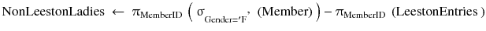

现在我们需要将 `NonLeestonLadies` 连接到 `Member` 表，以便能够获取她们的姓名。我们可以通过以下方式检索最终的姓名集合：

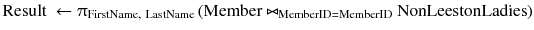

我们现在可以构建一个反映该代数表达式的 SQL 语句。在下面的 SQL 中，最内层缩进行代表`LeestonEntries`，下一层缩进代表`NonLeestonLadies`（并已赋予别名），最外层行代表最终的连接和投影：

```
SELECT m2.LastName, m2.FirstName FROM
(SELECT m.MemberID FROM Member m
WHERE m.Gender = 'F'
EXCEPT
SELECT e.MemberID
FROM entry e INNER JOIN tournament t ON e.tourID = t.tourID
WHERE t.TourName = 'Leeston'
)NonLeestonLadies
INNER JOIN Member m2 ON m2.MemberID  = NonLeestonLadies.MemberID;
```

##### 演算

让我们使用演算来处理同一个查询（找出从未参加过 Leeston 锦标赛的女性姓名）。我总是需要将元组变量想象成手指来帮助自己理解。图 A2-5 展示了我们需要用于该查询的关系。

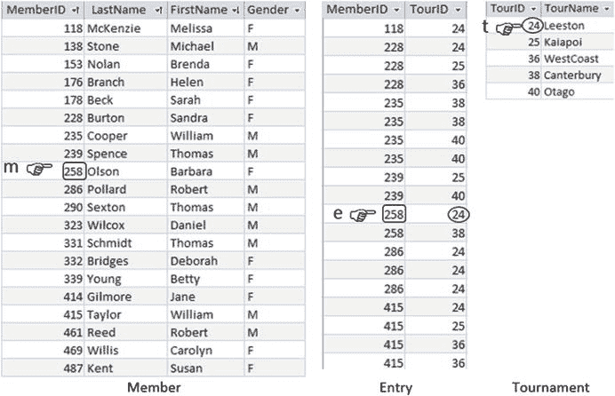

图 A2-5.

查询所需的元组变量

我们想从 `Member` 表中检索女性的姓名，所以我们需要依次考虑每个元组。这意味着 `m` 将是我们的自由变量。对于每个元组 `m`，我们需要检查其 `Gender` 值是否为 `F`，并且在 `Entry` 表中不存在一个元组 `e`，其 `MemberID` 与 `m` 的相同且 `TourID = 24`（即 Leeston 锦标赛）。图 A2-5 显示，尽管 Barbara Olson 是女性，但由于她参加了 Leeston 锦标赛，我们将不会包含她。

下面的演算表达式将检索满足我们刚才描述条件的会员姓名：

```
{m.LastName, m.FirstName | Member(m) AND m.Gender = 'F'
NOT ∃(e)(
Entry(e)(
e.MemberID = m.MemberID
AND ∃(t)(
t.TourID = e.TourID
AND t.Tourname = 'Leeston'
)
}
```

该演算表达式直接转换为以下 SQL 语句：

```
SELECT m.LastName, m.FirstName
FROM Member m
WHERE m.Gender = 'F'
AND NOT EXISTS (
SELECT *
FROM Entry e
WHERE e.MemberID = m.MemberID
AND EXISTS (
Select * FROM Tournament t
WHERE
t.TourID = e.TourID
AND t.Tourname = 'Leeston'
)
);
```


##### 结论

通过应用微积分和代数方法来查询未参加 Leeston 锦标赛的女性选手，我们得到了两个等价但形式迥异的 SQL 查询。毫无疑问，还有其他几种等价的 SQL 语句。在 `SQL Server 2012` 中的测试表明，优化器会产生略有不同的执行计划，其中微积分方法的查询速度稍快——尽管添加一些索引可能完全改变这一结果。

本书传达的信息是：对于任何查询，都存在两种等价但方法迥异的处理途径。本附录补充了简洁的符号表示，以帮助你表述这些方法。

#### 脚注

1
关系理论最早由数学家 E. F. Codd 于 1970 年 6 月在其发表于《ACM 通讯》(卷 13，第 377–387 页) 的文章 "大型共享数据库的关系数据模型" 中提出。

2
例如：C.J. Date 所著的《数据库精要：面向实践者的关系理论》(出版社所在城市/州：O'Reilly, 2005)。

#### 索引

A, B, C
聚合运算
`AVG()` 函数
重复值
Null 值
`COUNT()` 函数
重复值
Null 值
`MAX()` 函数
`MIN()` 函数
嵌套查询
`ROUND()` 函数
`SUM()` 函数

D
数据库设计
合并表
外键约束
不一致的数据
不一致的拼写
数值
主键
SQL 实现

差集

除法

E
`EXISTS` 关键字

F
框架

G, H
高尔夫俱乐部数据库

分组函数
`DISTINCT` 关键字
`HAVING` 关键字

I
交集

J, K, L, M
连接
图形式接口
等值连接
内连接
自然顺序
结果导向方法
外连接
过程导向方法
笛卡尔积
内连接技术
合并连接
嵌套循环
`SQL Server`

N
嵌套查询

范式化

O
结果导向方法
`OVER()` 函数

P, Q
投影
过程导向方法
参见. 关系代数
笛卡尔积
内连接

R
参照完整性

关系代数
代数运算
笛卡尔积
选择与投影的复合操作
差集 (−)
除法运算
内连接
交集 (Ç)
投影操作
选择操作
并集 (È)
全称量词

关系演算
存在量词
自由变量
全称量词

关系数据库
数据模型
基数
类
外键
图形界面
可选性
参照完整性
关系、元组与属性
检索信息
结果导向方法
过程导向方法
关系代数
关系演算
SQL 查询
SQL、代数与演算表
设计
域
主键
行的插入与更新
维恩图

S, T
选择

简单聚合

子查询
`EXISTS` 关键字
`IN` 关键字
内部查询
`EXISTS` 关键字
单个值
值集合
`NOT IN` 关键字
行的插入与删除
更新数据

代理键

U, V
统一建模语言 (UML)

并集

W, X, Y, Z
窗口函数
累计计数
框架
`GROUP BY` 子句
`ORDER BY` 子句
`RANK()` 函数
`SUM()` 函数
简单聚合
