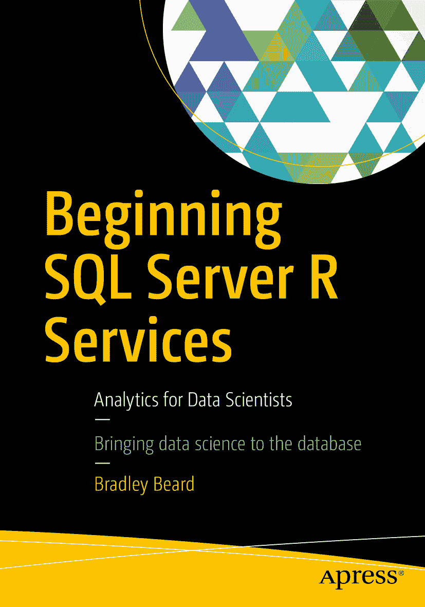

 Bradley Beard 著  SQL Server R Services 数据科学家入门：Beginning SQL Server R Services Analytics for Data Scientists


本书作者引用的任何源代码或其他补充材料，读者均可访问 [`www.apress.com`](http://www.apress.com) 获取。关于如何查找本书源代码的详细信息，请访问 [`www.apress.com/source-code/`](http://www.apress.com/source-code/)。读者也可以在 SpringerLink 各章节的补充材料部分访问源代码。 ISBN 978-1-4842-2297-3 e-ISBN 978-1-4842-2298-0 DOI 10.1007/978-1-4842-2298-0 Library of Congress Control Number: 2016958725 © Bradley Beard 2016 本作品受版权保护。无论涉及材料的全部或部分，所有商业权利均由出版商保留，具体包括翻译权、转载权、插图重用权、朗诵权、广播权、缩微胶片或其他物理方式的复制权，以及信息存储与检索、电子改编、计算机软件方面的传播权，或当前已知或未来开发的类似或不同方法的使用权。书中可能出现商标名称、标识和图像。我们并非每次出现商标名称、标识和图像时都使用商标符号，而是仅以编辑方式使用这些名称、标识和图像，旨在使商标所有者受益，并无侵犯商标权的意图。本书中对商品名称、商标、服务标志及类似术语的使用，即使未特别标识，也不应被视为表达其是否受专有权利约束的意见。尽管本书中的建议和信息在出版时被认为是真实准确的，但作者、编辑或出版商均不对可能出现的任何错误或遗漏承担法律责任。出版商对本出版物所含材料不作任何明示或暗示的担保。 本书使用无酸纸印刷。 由 Springer Science+Business Media New York, 233 Spring Street, 6th Floor, New York, NY 10013 向全球图书贸易发行。电话 1-800-SPRINGER，传真 (201) 348-4505，电子邮件 orders-ny@springer-sbm.com，或访问 www.springer.com。 Apress Media, LLC 是一家加利福尼亚州有限责任公司，其唯一成员（所有者）是 Springer Science + Business Media Finance Inc (SSBM Finance Inc)。SSBM Finance Inc 是一家特拉华州公司。 本书献给我已故的祖母贝茜·德杰恩斯（Bessie Dejaynes），她在本书写作期间离世。 我爱你，我想念你，我们终会再见。

## 引言

为了避免听起来像个彻头彻尾的微软粉丝，我得说 SQL Server 2016 加入了一些非常酷的新功能。其中最重要的之一，便是整合了一个在业界广泛使用的海量数据分析工具。这个工具简单地被称为 R。你们中有些人可能会问，微软为何要加入这个工具，因为它本质上更像是一个分析或绘图工具，而非数据库工具。

我认为原因相当简单：微软正在扩大其影响力。在我看来，R 是实现这一目标的一个绝佳方式。将 R 工具作为 Visual Studio 工具集和 SQL Server 数据库实例的一部分，无疑将改变 SQL Server 开发的格局。过去，数据库开发者需要准备数据以便由某些服务进行分析；现在不再需要了。Visual Studio 的 R 工具允许用户直接在 Visual Studio 中准备其脚本，或者直接在 SQL Server Management Studio 中操作。尽管微软不推荐后一种方式，但它仍然是可行的。

### 我们将涵盖的内容

本书涵盖的内容相当简单明了。我们将……

*   在 SQL Server 2016 上设置一个新实例
*   设置必要的 R 资源，以便正确创建、使用和执行 R
*   简要回顾 R 的历史、语法和函数
*   使用 Visual Studio 的 R 工具创建一个自定义的 R 解决方案
*   配置 SQL Server Reporting Services
*   安装并配置 Report Builder
*   基于在 Visual Studio R 工具中开发的 R 代码，在 Report Builder 中创建报表
*   通过 Reporting Services 使用这些报表

此时有几点需要注意。具体来说，…

*   Visual Studio 的 R 工具是一个全新的发布版本，因此它存在缺陷的可能性相当大。
*   我们是作为全新实例完全安装 SQL Server 2016 的，因为我想展示即使用户尚未完全信服 R 的好处，通过将 R 纳入其工作流程也能获得的优势。

安装和配置在 SQL Server 2016 中运行 R 所需的一切组件，其说明都涵盖在 MSDN 上。目前，相关资源的链接位于 [`https://msdn.microsoft.com/en-us/library/mt604883.aspx`](https://msdn.microsoft.com/en-us/library/mt604883.aspx)。请注意，微软可能不会永久保留这个链接，所以请记住 Google 是你的好帮手。我将解释使其启动并运行所需的步骤。至于在 Microsoft.com 上查找必要的工具，可能就需要你自己动手了。


### 为何选择 R？

问得好。为什么是 R？答案其实很简单……我认为是因为微软希望借助 `SQL Server` 扩大其在数据科学领域的影响力，因此，他们自然会希望拥有最好的数据分析产品，而 `R` 无疑是首选。微软的商业智能（Business Intelligence）产品已经非常出色，因此如果他们能找到一种方法……

*   收购一款已被广泛使用的数据分析产品
*   将该产品整合到其现有的数据库平台中
*   提供一个能与 `Visual Studio` 无缝集成的图形用户界面（GUI）
*   并免费提供这一切

……那么（数据分析）世界就将是他们的囊中之物了！据我所知，目前还没有任何其他数据库系统能实现与 `R` 如此全面的交互。虽然有很多场景是先在数据库中准备数据，然后再导入到 `R` 中，但这种交互是完全不同层面的。

`SQL Server 2016` 实际上将 `R 引擎` 实例作为数据库引擎的原生组件来运行。这太棒了！对于那些在微软对 `SQL Server` 进行重大改动、推出 `SQL Server 2005` 时就使用过它的用户来说，你们还记得当时 `Integration Services` 带来的震撼以及“我的 `DTS` 脚本怎么办？？”的疑问吧？这次的改动是同等级别的；对于那些对数据分析或商业智能感兴趣的人来说，加入 `R` 所带来的影响注定是深远的，并且必将促成数据科学领域一些惊人的进步。就我个人而言，我迫不及待想成为其中的一部分。

另外，为了让这件事明了……

```text
The MIT License (MIT)
Copyright (c) 2016 Microsoft
Permission is hereby granted, free of charge, to any person obtaining a copy of this software and associated documentation files (the "Software"), to deal in the Software without restriction, including without limitation the rights to use, copy, modify, merge, publish, distribute, sublicense, and/or sell copies of the Software, and to permit persons to whom the Software is furnished to do so, subject to the following conditions:
The above copyright notice and this permission notice shall be included in all copies or substantial portions of the Software.
THE SOFTWARE IS PROVIDED "AS IS", WITHOUT WARRANTY OF ANY KIND, EXPRESS OR
IMPLIED, INCLUDING BUT NOT LIMITED TO THE WARRANTIES OF MERCHANTABILITY, FITNESS FOR A
PARTICULAR PURPOSE AND NONINFRINGEMENT. IN NO EVENT SHALL THE
AUTHORS OR COPYRIGHT HOLDERS BE LIABLE FOR ANY CLAIM, DAMAGES OR OTHER
LIABILITY, WHETHER IN AN ACTION OF CONTRACT, TORT OR OTHERWISE, ARISING FROM,
OUT OF OR IN CONNECTION WITH THE SOFTWARE OR THE USE OR OTHER DEALINGS IN THE SOFTWARE.
```

换句话说，感谢你，微软，让我可以免费使用你如此多的资源！我真心感激。

如果你读过我的第一本书 `SQL Server 实用维护计划（Apress, 2016）`，那么你已经熟悉我的写作风格了。我倾向于保持轻松甚至有时古怪的语气，同时不牺牲技术内容。有时，我可能会跑题到一些“兔子洞”里，但最后总会回到正题。大多数时候，我可能需要花点时间才能绕回来，但最终我总会回到原点。

现在——在我们开始安装和设置环境之前——是你花几分钟熟悉 `R` 及其功能的绝佳时机。

一旦你准备好了，就让我们开始数据科学家的旅程吧！

## 致谢

再次感谢 Jonathan Gennick 和 Jill Balzano 在本书出版过程中给予我的指导。你们太棒了。

再次感谢我的第一位导师 John Wysocki，他目前可能正在某个豪华度假村享受半退休生活：我无法表达我对你点燃我创造力火花的感激之情。

感谢我最新的导师 Suzy Moore，她无疑是我认识的最聪明的人：我迫不及待想向你学习更多。

感谢独一无二的 Chester Flake：感谢你在认证方面提供的指导。任何需要认证培训的人都需要去 [`www.certificationcamps.com`](http://www.certificationcamps.com) 今天就注册。你绝不会后悔的。

感谢我的兄弟 Brian、侄女 Holly、嫂子 Andie，以及 Drew、Austin 和 Sam：妈妈说了，晚上 10 点后不准放烟花！

感谢我的父母 Richard 和 Carolyn，我的岳父母 Steve 和 Carey，我的姻亲 Al 和 Val，其他的兄弟 Joe、Rick、Zimmer 和 Dave，以及其他姐妹 Morgan、Erika、Jennifer、Kim 和 Michelle，以及所有我忘了提及的人……嗯，你们了解我的……

最后，感谢我的妻子 Jessica 和孩子们——Josh、Kayloo、Matthew 和 Emma，你们不得不忍受我为写这本书而长时间离开：非常感谢你们。

哦，对了……我不能忘了我最好的朋（友） Courtney。她真是个可爱的小宝贝！！

## 目录

### 第一部分：设置与安装

#### 第 1 章：SQL Server 2016 的设置与安装

*   规划
*   开始安装
*   产品密钥
*   许可条款
*   安装规则
*   功能选择
*   实例配置
*   服务器配置
*   数据库引擎配置
*   Reporting Services 配置
*   同意安装 Microsoft R Open
*   准备安装
*   安装进度
*   安装完成
*   服务验证
*   SQL Server 管理工具
*   摘要

#### 第 2 章：适用于 Visual Studio 的 R 工具的设置与安装

*   SQL Server Data Tools
*   Visual Studio
*   下载适用于 VS 的 R 工具
*   下载 Microsoft R Open
*   Visual Studio 环境
*   会话
*   绘图
*   数据
*   工作目录
*   窗口
*   安装 Microsoft R Client…
*   将 R 更改为 Microsoft R Client
*   Microsoft R 产品…
*   RTVS 文档和示例
*   R 文档
*   反馈
*   检查更新
*   调查/​新闻
*   编辑器选项
*   选项
*   数据科学设置
*   探索示例
*   R 初探
*   摘要

## 第 3 章：项目场景定义

*   范围蔓延
*   项目定义阶段
*   阶段一：需求收集
*   螺旋开发过程
*   软件变更请求流程
*   阶段二：初步界面设计
*   加载 R 解决方案
*   摘要

