# 第一部分
## 安装与设置

### 1. SQL Server 2016 的安装与设置

SQL Server 2016 的一大更新是将 R 语言添加为数据库引擎的组成部分。R 语言始于 1993 年，由奥克兰大学的 Robert Gentleman 和 Ross Ihaka 开发，是一种数据分析语言。它最初是作为一种能在统计分析方面与 S 语言抗衡的语言，并逐渐发展成为在统计计算、数据分析和机器学习领域全球最流行的语言之一。

随着商业世界向商业智能和数据分析的重大转变，将 R 作为 SQL Server 的组成部分是微软一项明智的商业举措。微软不仅将这一新功能引入了一个已被广泛接受的平台，而且保持了该语言核心的完整性，使得现有的 R 统计人员可以轻松迁移到 SQL Server 平台，以增强他们的统计计算方法。最终，这提升了微软在商业智能领域的知名度，并有望使 SQL Server 在日常数据分析操作中获得更广泛的接受。

2016 年，微软收购了 Revolution Analytics，该公司围绕 R 语言构建，并提供了 R 的开源（Revolution R Open）和商业（Revolution R Enterprise）开发平台。现在，微软的重点是将 R 重度集成到现有产品中，显而易见的首选是 SQL Server，最终将是 Azure。这是一个令人兴奋的版本，因为它为 Azure 托管服务提供了机会，可以基于在 Azure 站点或数据库中完成的 R 计算来提供内容。

由于 R 已作为 SQL Server 2016 安装的一部分被添加，我们只需在安装过程中选择该选项进行添加，然后完成一些小的配置任务即可。

为了确保 R 能够运行，有些事项我们需要检查和安装，但我会在具体操作时展示所有步骤。现在，请先下载 SQL Server 2016，然后按照我的指导进行安装。需要注意的是，根据服务包或微软是否决定更改安装界面，您的安装屏幕可能与我的略有不同，但我认为内容的要点是相同的。

### 规划

不过，首先要做的是规划。下载 SQL Server 2016 后，您需要规划基本设置，例如您将使用的账户以及默认文件位置的设置。如果您读过我上一本书，您会知道我对于 SQL Server 文件系统的组织有一套非常特定的方式。在本书中，我创建了一个单独的逻辑磁盘 (`E:\`)，并采用以下文件夹结构：

*   `E:\SQL Server`
    *   `Backups`
    *   `Data`
    *   `Logs`

因此，一个主文件夹 `SQL Server`，然后在该文件夹内创建三个子文件夹，用于存放所需的不同部分。可能还会有其他文件夹，例如 `DTSX` 或 `Output`，您可以用于其他用途，但通常情况下，主文件夹内的这三个子文件夹就很好用。

**注意**

在安装过程中，SQL Server 还会希望将文件放在其他位置；这没问题，因为这是 SQL Server 对系统文件进行分类以保持一切井然有序的方式。我们将在前面指定的文件夹中控制我们的数据、日志和备份文件。

至于您应该使用哪个账户来运行 SQL Server 2016 的功能，这应该是显而易见的。它需要像常规数据库安装一样运行，因此需要分配它通常应有的账户。明确地说，分配您当前正在运行的任何版本 SQL Server 所使用的相同账户。大多数情况下，这需要是一个管理员账户才能安装程序。

这里有个快速的附注：如果您还没有阅读 SQL Server 2016 的硬件和软件要求，您可能需要先查阅一下。另外，附录 A 涵盖了在现有 SQL Server 2014 服务器上安装 SQL Server 2016 的内容。如果您正在运行 SQL Server 2014 并想在同一台服务器上尝试 SQL Server 2016，那么请参阅附录 A 获取指导。（但在任何情况下，您都不应使用生产服务器来跟随本书进行操作）。

### 开始安装

我们开始吧！双击下载文件夹中的 `setup.exe` 文件。您应该会看到如图 1-1 所示的内容。

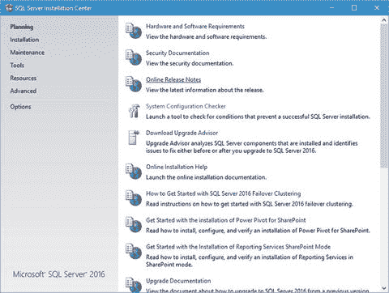

**图 1-1.** SQL Server 2016 初始安装屏幕

如果您看到要求对系统进行更改的屏幕，请直接点击 **是**。

图 1-1 显示了您开始安装时应该看到的第一个屏幕。如果您曾经安装过 SQL Server，这个屏幕应该看起来很熟悉。点击左侧的 **安装** 链接。您应该会看到如图 1-2 所示的内容。

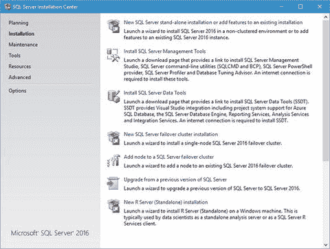

**图 1-2.** SQL Server 2016 安装选项

到达这里后，点击顶部的链接，标题为 **新建 SQL Server 独立安装或向现有安装添加功能**。

请注意，最底部的选项是新增的。它写着 **新建 R 服务器（独立）安装**。如果您只想将 R 服务器安装为服务器（即独立的、自包含的数据分析服务器）或客户端（从远程 SQL Server R 服务安装操作数据），您应选择此选项。请注意，您还需要 SQL Server 2016 服务正在运行，因此此选项用于向现有的 SQL Server 2016 安装添加 R 服务。

### 产品密钥

下一步是输入您的 **产品密钥**。图 1-3 显示了从前一节图 1-2 继续后您看到的屏幕。在这里，您可以指定希望运行免费版本，或者您可以输入产品密钥以运行许可版本。

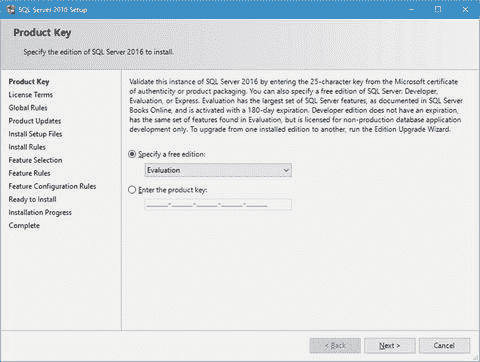

**图 1-3.** 产品密钥屏幕

SQL Server 2016 可以安装为以下三种免费版本之一：

*   **评估版**：具备全部功能；基本上是 SQL Server 2016 的企业版，但有效期仅为 180 天。
*   **开发版**：具备全部功能，但不能用于生产数据库工作。
*   **速达版**：SQL Server 2016 最小、最基本的安装；不会过期，可用于生产用途。

如果您想选择评估版以外的选项，请直接选择。但请理解选择该选项的含义；例如，速达版不支持 R，因此我不会选择此选项。对于您这里的需求，评估版是完美的，因为您肯定能在 180 天内决定是否希望将这项新功能永久包含在您的 SQL Server 安装中。

当您选择了最合适的版本后，点击 **下一步** 继续。

### 许可条款

下一个屏幕，如图 1-4 所示，只是要求您接受许可条款。

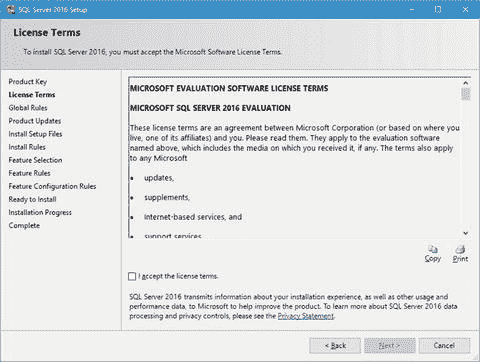

**图 1-4.** 许可条款

老实说，我从未完整阅读过这个许可条款。我不能说我认识有谁读完过。显然，只需勾选 **我接受许可条款** 复选框，然后点击 **下一步** 继续。


### 安装规则

此屏幕显示 SQL Server 在执行初步检查以确保全新安装过程中会发生的情况。如果出现任何错误或警告，您应该着手进行修正，以便尽可能顺利地进行安装。

我的屏幕闪烁了几次，最终停留在如图 1-5 所示的屏幕。

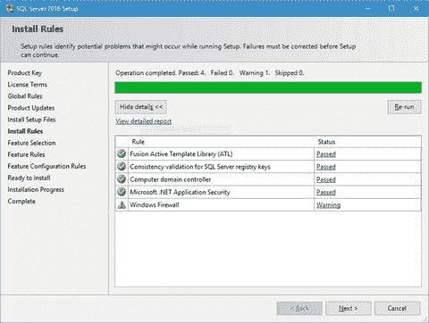
图 1-5. 安装规则

值得注意的是，在此步骤中可能会下载并安装 `SQL Server 2016` 的更新，因此，如果出现包含此信息的提示，请直接安装它。

因此，除了我的防火墙规则外，一切看起来都很好。由于我的笔记本电脑没有来自网络的连接，所以这应该没问题，因此我将单击 `下一步` 继续。

### 功能选择

现在我们进入选择实际安装内容的部分。图 1-6 显示了我们一直期待的屏幕。

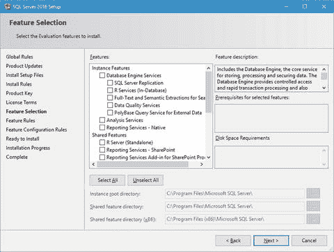
图 1-6. 功能选择

此时，我们需要选择测试数据库实例中 `R` 功能所需的最基本组件。在本书中，我们将熟悉 `R`，并使用 `R Tools for Visual Studio` 创建图表，然后在 `SSMS` 中复制这些结果，最终通过 `Reporting Services` 在报表中呈现这些结果。因此，我们只安装 `R Services (In-Database)` 和 `Reporting Services – Native`。这为我们提供了深入了解 `R` 及其能为我们做什么所需的一切。这也意味着我们无需安装完整的 `SQL Server 2016`。图 1-7 显示了此时您应该选择的选项。

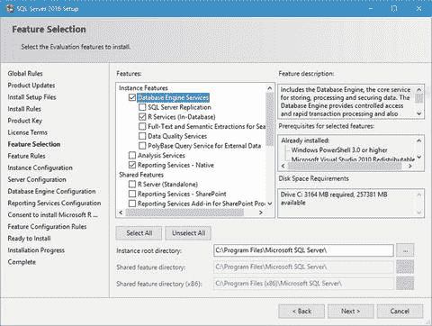
图 1-7. 已选选项

在此处单击 `下一步` 继续。系统会花一点时间思考要做什么，但最终您会看到如图 1-8 所示的 `实例配置` 屏幕。

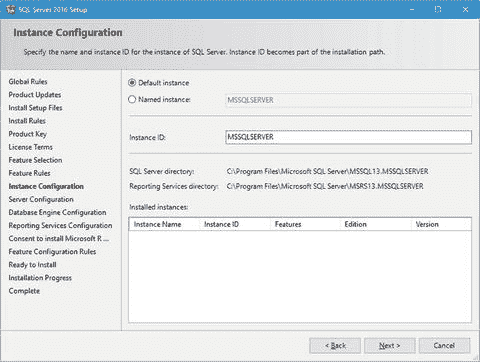
图 1-8. 实例配置

### 实例配置

由于这是一个新的安装，并且之前没有安装过 `SQL Server` 版本，因此 `默认实例` 选项可用。我们当然可以毫无问题地使用此选项，但我通常更喜欢为我的实例命名。这由您决定，但请理解，在本书的剩余部分，我将使用 `命名实例` 而不是 `默认实例`。

此时，我们需要定义我们的新实例。如果您查看 `已安装的实例` 部分，会发现那里什么都没有。我们选择 `命名实例` 选项，并将其称为 `SQL2016RS`，代表 `SQL Server 2016 R Services`。`实例 ID` 字段也应更新为 `SQL2016RS`。完成此操作后，您将看到如图 1-9 所示的内容。

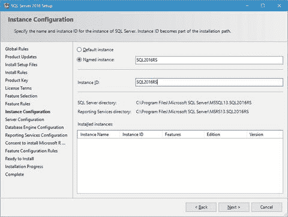
图 1-9. 更新后的实例配置屏幕

请注意此屏幕上列出的 `命名实例` 字段、`实例 ID` 字段、`SQL Server` 目录位置和 `Reporting Services` 目录位置。这些字段都需要引用 `SQL2016RS`。一旦您确认一切都符合预期，请单击 `下一步` 继续。

当您准备好时，单击 `下一步` 继续。

#### 服务器配置

下一个屏幕是我们定义服务的服务器帐户和启动类型的地方。此屏幕如图 1-10 所示。

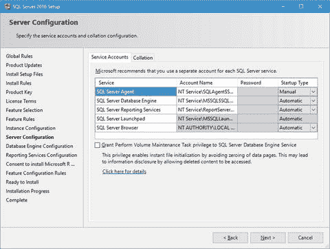
图 1-10. 服务器配置

这里真正需要注意的唯一服务是 `SQL Server Launchpad` 服务。此服务负责在数据库引擎内执行 `R`，因此如果 `R` 的行为不如预期，请首先检查此服务。

`SQL Browser` 服务在本地服务的上下文中运行，因此没有创建新的服务帐户。换句话说，我们不需要担心那个服务。

这些服务帐户是默认的，但如果您有自己的服务帐户，随时可以更改为您的服务帐户。如果您没有自己的服务帐户，可以保留这些建议的服务帐户。我知道许多服务器管理员坚持对服务采用最小权限原则，如果您的特定环境是这种情况，那么您需要从服务器管理员处获取服务名称和登录信息才能继续。另一种方法是复制这些服务名称，并将它们包含在您提供给系统管理员的关于安装期间创建的帐户的摘要中，以便系统管理员可以根据需要审核该用户的权限。这里需要重要注意的是，我指的是与“系统管理员”分开的个人或实体，该管理员不是数据库管理员，而是 `Windows` 级别的管理员。换句话说，是负责操作系统级别、比应用层高一级的人。

我们在这里只想稍作更改；具体来说，将 `SQL Server Agent` 服务的 `启动类型` 设置为 `自动`。这是我们需要做的唯一更改。图 1-11 显示了此时您应该看到的内容。

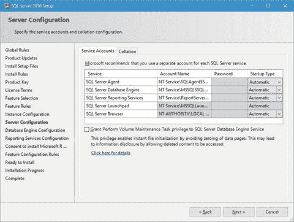
图 1-11. 更新后的服务器配置

请注意，我们无法设置这些帐户中任何一个的密码。这与我见过的每个 `SQL Server` 安装都是一样的。如果您将 `帐户名` 框从默认值更改为自定义服务帐户名，那么 `密码` 框将变为活动状态并接受输入。否则，密码由 `SQL Server` 和 `Windows` 控制。

还请注意，在默认服务列表下方有一个新的 `向 SQL Server 数据库引擎服务授予执行卷维护任务权限` 复选框。对于我们在本书中所做的事情，无需选中此复选框。在将来的安装中，或者对于生产环境，启用此选项可能是个好主意。

此时，我们所有的服务都已正确配置。请注意，我们不会打扰 `排序规则` 选项卡。默认情况下，该选项卡中应指定 `SQL_Latin1_General_CP1_CI_AS`。就是这样。请继续并单击 `下一步` 继续。

### 数据库引擎配置

下一个屏幕是 `数据库引擎配置`，如图 1-12 所示。在这里，您可以在四个不同的选项卡中设置引擎的选项，如下文各小节所述。

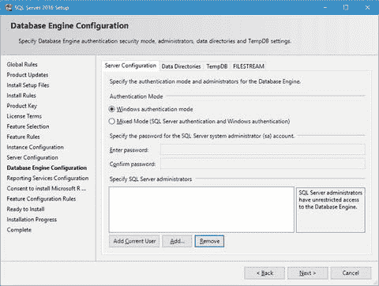
图 1-12. 数据库引擎配置

#### 服务器配置

此选项卡允许您指定此数据库引擎实例的身份验证模式和管理员。由于这只是用于测试和评估，我将通过单击屏幕底部的 `添加当前用户` 按钮并选择 `Windows 身份验证模式`，将我自己添加为 `Windows 身份验证模式` 下的管理员。图 1-13 显示了已选择这些选项的状态。

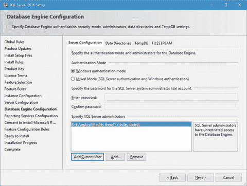
图 1-13. 带选项的服务器配置选项卡


### 数据目录

你还记得我的文件系统是如何设置的吗？“数据目录”部分描述了我指定的文件结构中这些数据目录的位置。图 1-14 显示了这个屏幕最初的样子。图 1-15 显示了我选择的选项。你可以根据喜好设置这些，但我个人的偏好是不把我想要的文件放在默认的复杂文件夹结构中。

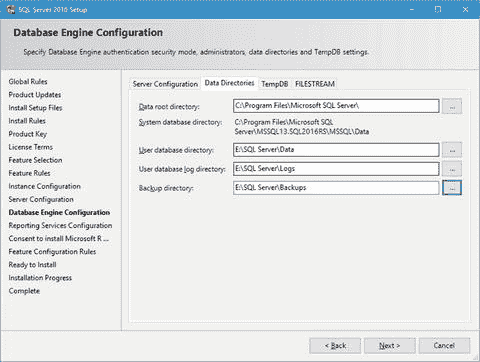

图 1-15.
更新后的 数据目录 选项卡

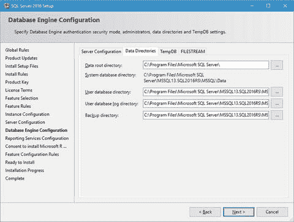

图 1-14.
初始的 数据目录 选项卡

### TempDB

通常，我会保留 TempDB 选项不变。但在这个例子中，我设置了选项来镜像我已经启用的文件系统。图 1-16 显示了默认设置，图 1-17 显示了更新后的设置。

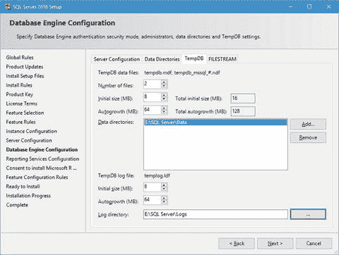

图 1-17.
TempDB 更新后的设置

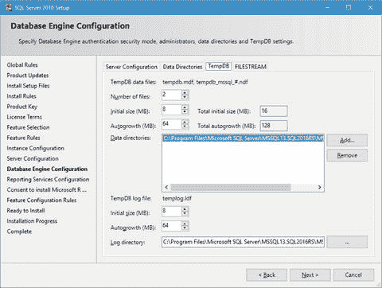

图 1-16.
TempDB 默认设置

我所做的改动很小。我首先在“Data directories”字段中高亮显示现有选项，然后单击“Remove”按钮。接着我单击“Add”按钮，并添加了 `E:\SQL Server\Data`。这个位置在“Log directory”字段中被镜像，因此我将其改为 `E:\SQL Server\Logs`。这个选项卡的设置就到此为止。

### FILESTREAM

直接保留“FILESTREAM”选项卡不变。本书中我们不会使用 FILESTREAM。

当你填好所有其他“Database Engine Configuration”选项卡后，单击“Next”。

### Reporting Services 配置

现在我们来配置 Reporting Services。我们将在第 7 章及后续章节中进一步配置 Reporting Services。我们现在使用默认选中的“Install and configure”选项来安装它。图 1-18 显示了该选项。

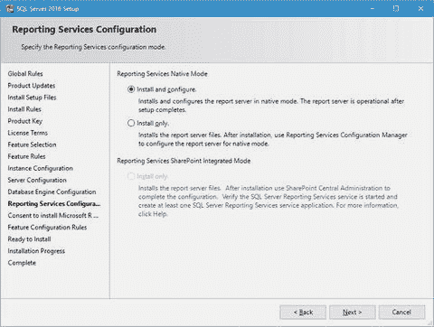

图 1-18.
Reporting Services 配置

另请注意，当你为 SharePoint 集成模式安装 Reporting Services 时，“Install only”选项是选中的。你可以保留该选项不变，因为反正也没有其他选择。

顺便提一下 Reporting Services 的配置；如果你之后进入并希望安装 Reporting Services（因为你当初没有随数据库引擎一起安装），你将只有“Install only”选项可用。原因是，在添加数据库引擎实例后，必须使用 Reporting Services Configuration Manager 来配置 Reporting Services。

确保在顶部选择了“Install and configure”选项，然后在 Reporting Services 配置屏幕上单击“Next”以继续。

### 同意安装 Microsoft R Open

如前所述，将 R 集成到 SQL Server 中是一个重大变化。在 SQL Server 2016 的预发布版本中，必须单独安装组件才能使 R 正确运行。Microsoft 在各个版本中逐步更新了安装过程，直到最终版本，其中包含了 R 组件的完整下载和安装。请注意，SQL Server 2016 中使用的 R 版本被称为 `Microsoft R Open`，它是“Microsoft 在 GNU General Public License v2 下提供的增强版 R 发行版。” R 语言本身的版权仍属于 R Foundation for Statistical Computing。Microsoft 在图 1-19 中非常谨慎地明确说明了这一点。我认为这很重要，因为 Microsoft 为 SQL Server 提供了一个全新的软件包；因此，我们必须同意安装 `Microsoft R Open`，并因此接受 Microsoft 发布的任何补丁或更新。

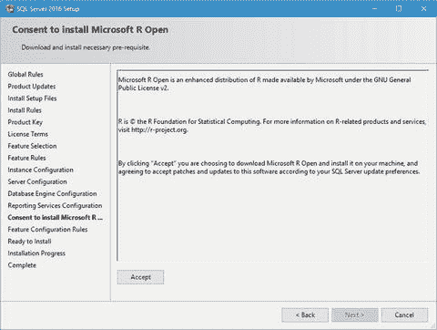

图 1-19.
同意安装 Microsoft R Open

单击“Accept”按钮。“Next”按钮将变为可用。继续并单击“Next”以继续。

### 准备安装

图 1-20 显示了你现在应该看到的“Ready to Install”屏幕。仔细阅读，如果你打算完成本书中的练习，请确保你的设置与之匹配。

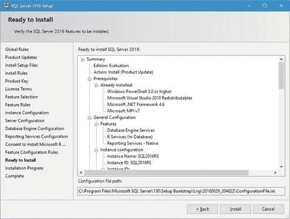

图 1-20.
准备安装

当你准备好后，单击“Install”。在加载和安装所需内容时，你的屏幕会闪烁几次。

### 安装进度

图 1-21 显示了安装运行时你应该看到的内容。进度条显示了总体进度，因此你可以判断进度和剩余时间。耐心等待。看看进度条。或者去喝杯咖啡。

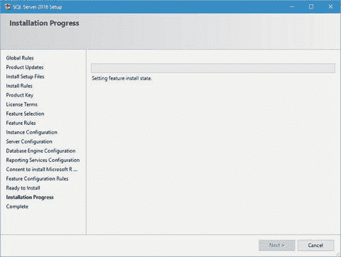

图 1-21.
安装进度

### 安装完成

安装需要一点时间，但最终会完成并显示图 1-22 所示的屏幕。我的安装大约花了 10 分钟完成。向下滚动查看是否所有组件都已正确安装，然后单击“Close”。

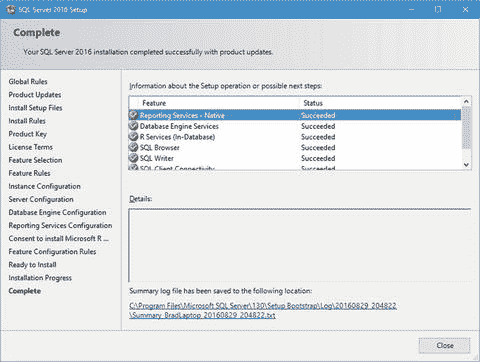

图 1-22.
安装完成

让我们花点时间规划一下本章接下来还要做什么。我们已经进展了不少，但在停下来休息之前，我们还有一点工作要做。

*   我们目前完成的工作
    *   安装了测试新的 R 功能所需的 SQL Server 2016 组件
*   我们接下来将要做的工作
    *   验证所有 SQL Server 2016 服务是否已正确启动
    *   安装 SQL Server Management Tools

第二个要点可能会让你有点困惑。为什么我们需要安装 SQL Server Management Tools？因为，出于某种奇怪的原因（我确信 Microsoft 能给出理由），SQL Server Management Studio 并不作为 SQL Server 安装的一部分提供。我在以前的任何安装中从未见过这种情况，因此我可以假设这是 SQL Server 的新常态。

### 服务验证

让我们去确认一下需要启动的服务是否都已正确启动。按 Windows 键然后输入 `services` 来启动“服务”窗口。你应该会看到“服务”桌面应用作为选项出现，如图 1-23 所示。继续并单击“服务”应用以继续。或者，你也可以按 Windows 键，输入 `services.msc`，然后按 Enter。这样可以直接打开“服务”窗口，无需搜索。

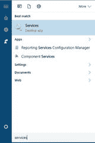

图 1-23.
服务位置

应用程序正常启动，因此向下滚动到 SQL 服务。默认情况下它们应按“名称”排序，所以要跳转到某个字母，只需输入它。这比滚动要快得多。图 1-24 向你显示了相关的 SQL Server 服务及其当前状态。

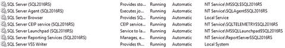

图 1-24.
服务

在我看来一切正常。你觉得呢？所有服务都按预期运行，并且都设置为“自动”启动类型。

恭喜！你已成功安装了 SQL Server 2016，并通过确认所有服务都按预期启动，验证了一切正常。


### SQL Server 管理工具

接下来，我们需要安装 SQL Server 管理工具。此安装任务是 SQL Server 安装中心的一部分，它应该仍在您的桌面上打开。图 1-25 显示了当前 SQL Server 安装中心屏幕的状态。

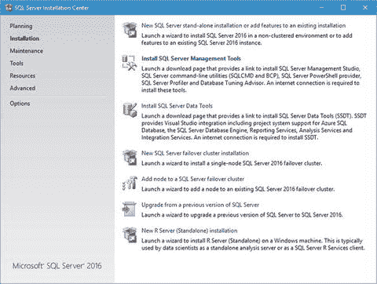

图 1-25. SQL Server 安装中心

请注意，由于已安装 SQL Server 2016，`SQL Server Management Tools` 的链接已经高亮显示。这正是我们现在想要点击的地方。图 1-26 显示了此操作的结果。

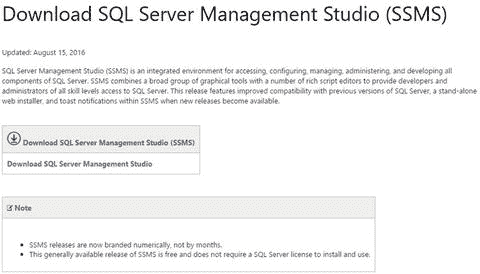

图 1-26. 下载 SQL Server Management Studio

当我们点击 SQL Server 安装中心上的 `Install SQL Server Management Tools` 链接时，Microsoft.com 上会打开一个网页，我们可以从中下载 SSMS。现在，请点击那个名为 `Download SQL Server Management Studio` 的蓝色链接。在撰写本文时，下载大小为 806MB。

在下载的同时，让我们规划一下接下来要做的事情。本质上，我们需要通过验证 R 是否正确安装并与数据库引擎正常通信来“完成” SQL Server 的安装。

您几乎忘了这是一本关于 R 的书，对吗？我知道，这一章长得离谱，但我们确实需要让所有组件都运行起来，才能展示 R 在当前环境下能做什么。

最终，下载完成。在您的浏览器中，您应该会看到一个类似于图 1-27 所示的按钮。

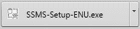

图 1-27. 下载完成

点击此按钮开始安装，或者转到您的“下载”文件夹并双击名为 `SSMS-Setup-ENU.exe` 的文件以开始安装 SQL Server Management Studio。图 1-28 显示了初始安装屏幕。

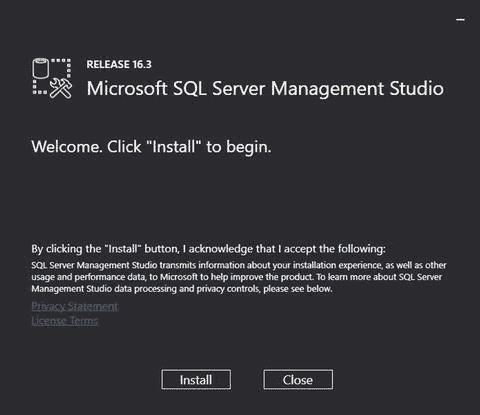

图 1-28. SSMS 安装提示

考虑到在您撰写本文和您下载 SQL Server 管理工具之间，Microsoft 可能会发布更新的版本，您最终的 `Release` 号可能与我的不同。

嗯，这确实是一个新的安装界面。我以为这会更接近 Visual Studio，但并非如此。指示就在那里；点击 `Install` 开始。图 1-29 显示了点击 `Install` 后的界面。

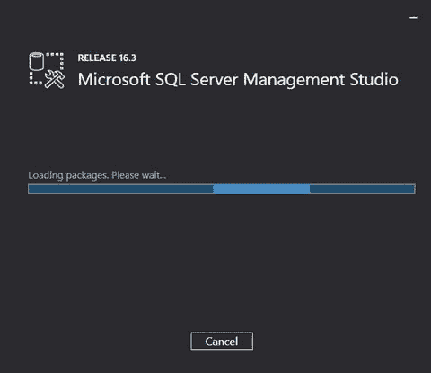

图 1-29. 初始安装界面

它会在这里加载包大约一分钟，所以就让它做自己的事情并安装所需的内容。第一个安装的主要包是 `.NET Framework 4.6.1`。然后它会继续安装其他包，比如 `Visual Studio 2015 Shell`。一旦我们开始查看用于开发 R 项目的不同 IDE，这将变得很重要。

最终，安装完成，我们停留在如图 1-30 所示的屏幕上。

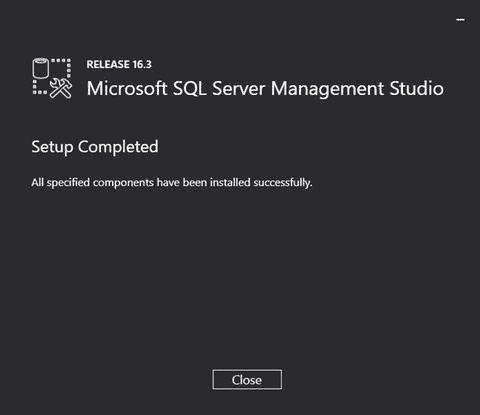

图 1-30. 需要重启

接下来，打开 SQL Server Management Studio 并连接到您新安装的实例。按下您的 Windows 键并输入 `ssms` 以显示 `Microsoft SQL Server Management Studio` 桌面应用。继续点击该应用以启动应用程序。

提示

如果您没有以本地 `Administrator` 帐户登录，您可能需要右键单击“开始”菜单中出现的桌面应用图标，然后选择 `以管理员身份运行`。

图 1-31 显示了此更新版本中 SSMS 的初始界面外观。

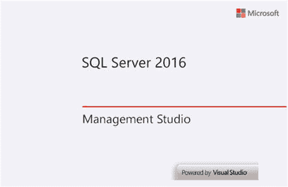

图 1-31. SQL Server Management Studio

这需要加载界面，然后，最终，我们会看到 SSMS 登录屏幕。图 1-32 显示了此版本与先前版本 SSMS 的显著不同之处。

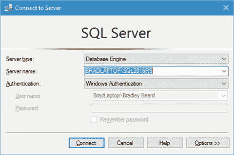

图 1-32. 连接到服务器

回想一下，我将新的 SQL Server 2016 实例命名为 `SQL2016RS`，所以这就是我将要连接的实例。`Server name` 字段的格式是 `SERVER\INSTANCE`，这就是我格式化我的连接的方式。您也可以从那里下拉菜单并导航到您可能已安装的另一个实例。只要您能到达那里，您觉得更舒适的方式都可以。点击 `Connect` 登录到您的实例。

您现在应该看到的对象资源管理器初始屏幕类似于图 1-33。

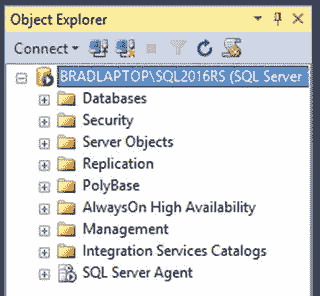

图 1-33. SQL Server Management Studio

请注意命名实例和显示的 SQL Server 版本。您可能需要展开界面才能看到版本号，但除非 Microsoft 从界面中移除它，否则它就会在那里。我的版本是 `13.0.1601-5`，这是撰写本文时的最新稳定版本。一如既往，您可能拥有不同版本的 SQL Server 2016。这没关系，因为 Microsoft 尚未弃用任何可能影响本书结果的主要功能。这也意味着我们已成功连接到我们的新实例，并准备开始。

在我们深入其他内容之前，让我们在 SSMS 中打开行号显示。这是我的一个痛点。转到 `Tools` → `Options`，展开 `Text Editor`，然后点击 `All Languages`。图 1-34 显示了此设置的位置。

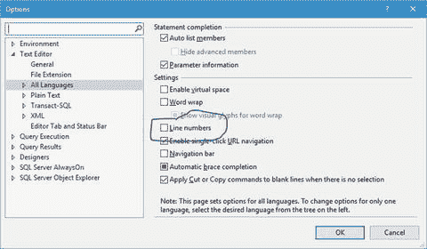

图 1-34. 行号

只需勾选该框并点击 `OK`——您就设置好了。

Microsoft 发布了一个后配置过程，我们将首先运行它。这个步骤未来可能会被移除并添加到安装中，但目前，请按照以下步骤完成安装。

在 SQL Server Management Studio 中打开一个 `New Query` 窗口，并键入以下命令：

```
exec sp_configure 'external scripts enabled', 1
Reconfigure with override
```

这是在 SSMS 中执行此代码的结果：

```
Configuration option 'external scripts enabled' changed from 0 to 1\. Run the RECONFIGURE statement to install.
```

注意

作为查询的一部分，我们已经运行了 `RECONFIGURE` 语句。

请注意，我们是在对 `master` 数据库执行，并且查询已成功执行。这意味着 R 脚本现在在 SQL Server 中已启用。这个脚本至关重要，因为没有它，我们就无法在数据库引擎内执行 R 代码。原因是 `sp_execute_external_script` 存储过程默认是禁用的；必须手动启用它。

接下来，我们需要验证 R 是否确实在运行。为此，Microsoft 说需要重启 SQL Server 实例并运行以下脚本。首先重启实例，然后打开一个 `New Query` 窗口并键入以下内容：

```
exec sp_execute_external_script
@language =N'R',
@script=N'OutputDataSet<-InputDataSet',
@input_data_1 =N'select 1 as hello'
with result sets (([hello] int not null));
go
```

按 `F5` 执行脚本。预期的结果如图 1-35 所示。

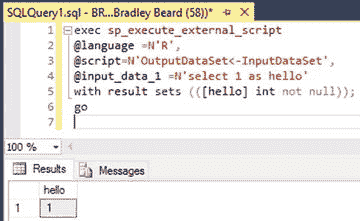

图 1-35. R 已安装并正确通信

太好了！这个简单脚本的成功执行表明 R 运行良好，并与 SQL Server 实例正常通信。从图 1-35 中的结果我们可以看到，我们定义了一个非常简单的查询 `select 1 as hello`，我们将其作为名为 `[hello]` 的列返回，数据类型为 `int`，且 `not null`。


对于那些尚未记全每一个系统存储过程的人来说，你可能不会认出 `sp_execute_external_script` 是一个为执行外部脚本而引入的**全新**存储过程。可以通过以下参数调用此存储过程：

*   `@language`
    *   所支持的语言名称。目前仅支持 R。
*   `@script`
    *   要执行的脚本（你可以将整个脚本输入到存储过程中，或将其作为变量引用）。
*   `@input_data_1`
    *   这里填写用于从数据库收集数据的 SQL 查询。
*   `@input_data_1_name`
    *   作为 `@input_data_1` 查询结果集的数据框。此属性可选。
*   `@output_data_1_name`
    *   在 `@script` 中持有输出数据的数据框变量。此属性可选。

信不信由你，微软说我们接下来只需要再做几件事，所以让我们先把它们搞定。

对于 Windows 用户，按下 Windows 键 + R，输入 `lusrmgr.msc`，然后按回车。你应该会看到你的“本地用户和组”，如图 1-36 所示。

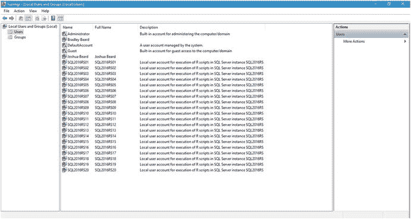

图 1-36. 本地用户和组（用户）

看到了吗？安装过程中创建了二十个新的用户账户，每个账户都是专门为与 R Services 交互而创建的。这 20 个账户被添加到一个名为 `SQLRUserGroup<instance_name>` 的新组中，其中 `<instance_name>` 是你的实例名称。所以以我为例，我的组名为 `SQLRUserGroupSQL2016RS`。如果你遵循了这个命名约定，你的也会是同样的名称。

点击屏幕左侧的“组”选项。你应该会看到图 1-37 所示的内容。

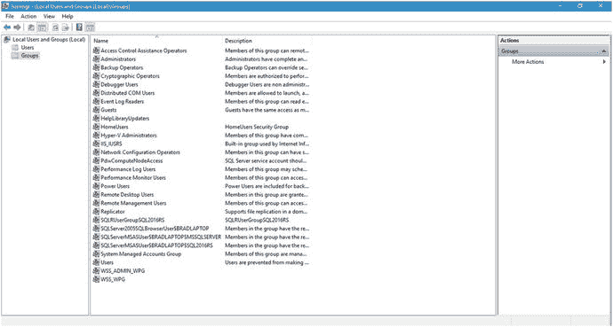

图 1-37. 本地用户和组（组）

双击 `SQLRUserGroupSQL2016RS` 链接。你应该会看到图 1-38 所示的内容。

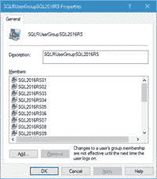

图 1-38. SQLRUserGroupSQL2016RS 详情

按照这种方式配置，我们就可以在这台服务器上正常工作了。我们不需要定义其他任何内容或添加其他用户账户，因为我们已经验证了 R 在数据库中运行正确。微软有一些相当好的文章，介绍如何配置数据库实例以接受来自外部开发者的 R 脚本，这本质上涉及将 `SQLRUserGroupSQL2016RS` 组作为新登录名添加到 SQL Server 中。这样，当用户连接到数据库实例运行 R 脚本时，会使用那 20 个新用户账户中的一个，通过 Launchpad 服务代表该用户执行脚本。微软将此称为**隐式身份验证**，因为该组中的用户随后将能够远程访问 SQL Server R Services。

### 小结

让我们简要回顾一下本章涵盖的内容。

*   安装了完整的 SQL Server 2016 实例
*   安装了 SQL Server Management Tools
*   安装后配置了 R
*   通过运行前面指定的脚本，验证了 R 已正确安装

这是相当重要的第一章。我们涵盖了很多内容，所以如果有任何不清楚的地方，现在正是回头再试一次的好时机。

接下来，我们将安装 Visual Studio 的 R 工具，我们将用它来编写 R 代码。第一部分显然是必要的，以便在服务器级别安装 R 功能和数据库实例。现在，我们将重点转向使用开发工具设置客户端。

## 2. Visual Studio R 工具的设置与安装

既然我们已经正确安装了 SQL Server 2016，我们需要某种 IDE 来开发我们的代码。微软通过在 Visual Studio 中引入一个全新的 R GUI，使 Visual Studio 2016 变得更好。它被简单地命名为 Visual Studio 的 R 工具。

如果你愿意，你也可以使用其他的 R GUI。你完全不受限制或被迫使用 Visual Studio 的 R 工具。如果你目前有喜欢的 IDE，那么请务必继续使用那个。

### SQL Server Data Tools

在我们开始之前，快速说明一点。本书**不会**使用 SQL Server Data Tools。相反，我们将使用 Visual Studio 的 R 工工具。这一点从章节标题应该很明显。原因很简单，但我花了一点时间才弄明白。让我们看看两者的区别。

*   SQL Server Data Tools
    *   为 Analysis Services、Reporting Services 或 Integration Services 开发解决方案。允许连接数据库开发；即“实时”编辑数据库。
*   Visual Studio 的 R 工具
    *   专为当前的微软用户设计，希望他们在学习 R 的同时停留在熟悉的界面中。它不与 SQL Server 中的 R 实例交互，因此需要单独安装一个名为 Microsoft R Open 的组件才能执行任何 R 代码。

本书使用 Visual Studio 的 R 工具 (RTVS) 而不是 SQL Server Data Tools (SSDT) 的主要原因是，RTVS 可用于开发 R 代码，而 SSDT 不能。SSDT 可以连接到数据库实例并对数据库运行查询，但它不是 R 的 IDE。或者，RTVS 是 R 的 IDE，但在本书的范围内，我们不直接连接到数据库实例。

这应该能帮助你快速理解。对我来说，主要区别在于 SSDT 运行一个内部进程，而 RTVS 运行一个外部进程。你可能会发现两者之间的其他差异，如果发现了，很好。不过，正如我所说，我们在本书中使用 RTVS。


## Visual Studio

除了安装 Visual Studio 本身，你还需要下载 Visual Studio 的 R 扩展。这样，RTVS 才能有一个 R 版本来执行代码。为了方便地完成此操作并将所有说明集中在一个地方，微软提供了一个解释 **Visual Studio 的 R 工具**（RTVS）的网站。网址是 [`https://beta.visualstudio.com/vs/rtvs/`](https://beta.visualstudio.com/vs/rtvs/) 。该网站的一部分如图 2-1 所示。

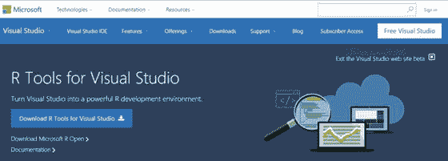
图 2-1. Visual Studio 的 R 工具 网站

正如我提到的，第一步是获取 Visual Studio。点击图 2-1 中显示的“Free Visual Studio”链接。它是右上角的白色方框。随后会打开另一个页面，如图 2-2 所示，页面左侧有一个 Visual Studio Community 的下载链接。

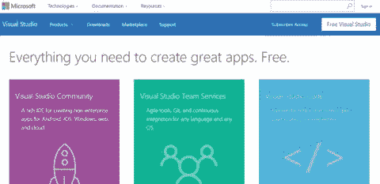
图 2-2. 下载 Community 2015

从图中我们可以看到，Community 2015 几乎可以开发任何东西。向下滚动并点击紫色火箭飞船图示下方的“Download”按钮。你应该会看到如图 2-3 所示的内容。

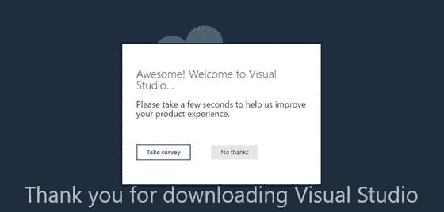
图 2-3. 安装程序开始下载

如果你查看 `Downloads` 文件夹，会发现安装程序已经下载完成。这是一个很小的 209KB 安装程序，很可能在你甚至还没来得及打开 `Downloads` 文件夹检查之前就下载好了。

如果你真的愿意，可以完成图 2-3 中提到的调查，但我选择了“No thanks”。抱歉，微软！

转到你的 `Downloads` 文件夹，双击名为 `vs_community_<random string that looks like a GUID>.exe` 的文件。当然，你的随机字符串和我的不同，所以找一下以 `vs_community` 开头的那个文件。那就是你要双击的文件。然后你应该会在屏幕上看到图 2-4。你即将开始安装，这个过程会消耗几 GB 的带宽。

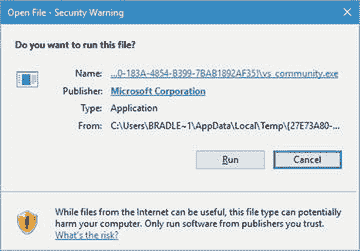
图 2-4. 打开文件

继续点击“Run”。你会看到图 2-5 弹出。

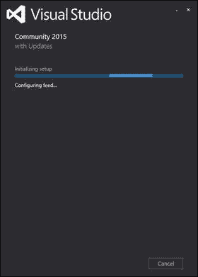
图 2-5. 正在初始化安装

最终，你会看到图 2-6，它显示了 Visual Studio Community 2015 的配置选项。

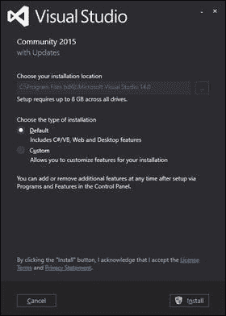
图 2-6. 选择安装类型

从这里，我们可以选择“Default”或“Custom”。我们实际上只需要 Visual Studio 的基本功能，所以保持默认选项选中并点击“Install”。

随后会出现图 2-7 所示的屏幕；这开始了 Visual Studio Community 2015 的实际安装。

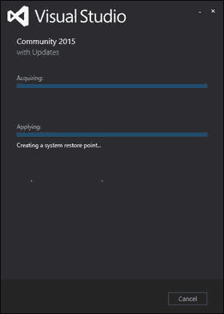
图 2-7. 安装开始

安装过程会持续相当长一段时间直到完成。注意，可能还有需要随实际应用程序一起下载的必需更新；所以请耐心等待，让它完成自己的工作。

你最终会看到图 2-8，它显示应用程序已成功完成安装。

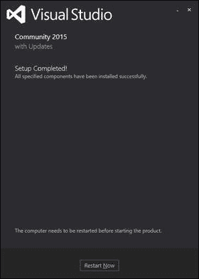
图 2-8. 安装完成

Visual Studio 现在已安装好。接下来，我们需要下载 Visual Studio 的 R 工具，但首先点击“Restart Now”按钮，或者先关闭并保存所有内容然后重新启动你的计算机。

重启后，你可能会看到图 2-9，它显示一个漂亮的小闪屏，说明 Visual Studio 已安装。

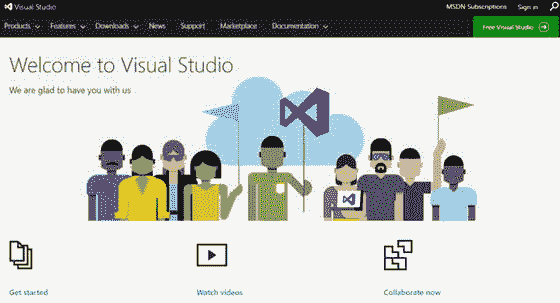
图 2-9. 欢迎使用 Visual Studio

如果重启后没有看到这个屏幕，可能也没关系。只要你成功安装了 Visual Studio，应该就没问题。继续阅读以安装我们需要开始测试 R 功能的其余部分。

### 下载 Visual Studio 的 R 工具

第二步，如图 2-1 所示，是下载 Visual Studio 的 R 工具。点击图 2-1 中也显示的“Download R Tools for Visual Studio”链接，就会开始下载我需要安装的东西。下载的文件名为 `RTVS_2016-06-23.7.exe`，如图 2-10 所示。

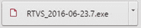
图 2-10. RTVS 文件名

你的文件名可能与此不同，但这没关系。微软负责管理该产品的未来版本，因此我们可以假设安装从你点击的链接中呈现的任何应用程序都是没问题的。

下载完成后运行该可执行文件。你会看到图 2-11，显示你已准备好开始安装 R 工具。点击“Install”按钮开始安装过程。

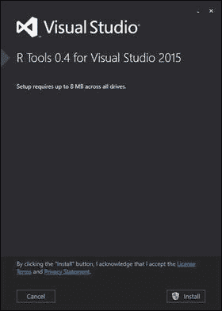
图 2-11. Visual Studio 的 R 工具 0.4

安装程序开始工作，最终在图 2-12 中显示已完成的 R 工具安装界面。

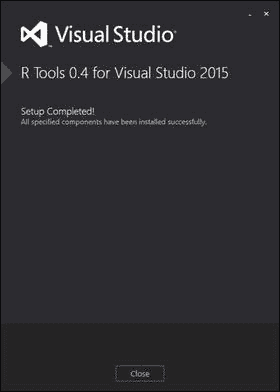
图 2-12. Visual Studio 的 R 工具 0.4 安装完成

如图 2-12 所示，点击“Close”按钮也会打开一个网页，所以接下来我们在图 2-13 中看一下那个页面。


图 2-13. 打开的网页

这不是很棒吗！微软为我们准备了一个很棒的页面，上面列出了所有资源。当你设置时，这个页面可能会变化，但可能会非常相似。我强烈建议你浏览列出的资源，尽可能多地收集关于 R 的信息。一旦我们进入 RTVS 的界面，我会向你展示一个更好的获取 R 文档的方法，但现在，只是大致浏览一下这个网站，以便了解有哪些可用资源。

回到图 2-12 所示的安装屏幕，点击“Close”。Visual Studio 的 R 工具现在已成功安装。


### 下载 Microsoft R Open

完成安装的最后一步是安装 Microsoft R Open。请返回到 Microsoft 提供并显示在图 2-1 中的网页，点击 **Download Microsoft R Open** 链接。此时，会打开另一个网页；其 URL 是 [`https://mran.revolutionanalytics.com/download/`](https://mran.revolutionanalytics.com/download/)。图 2-14 显示了此时您应该看到的 Microsoft R Open 下载页面。


图 2-14. 打开的网页

请注意，Microsoft R Open 的下载仅适用于 64 位平台。Microsoft R Open 可用于 64 位版本的 Windows (7 SP1, 8.1, 10, Server 2008 R2 SP1, 和 Server 2012)、Ubuntu (14.04 和 15.04)、Red Hat Enterprise Linux (7.1 和 6.5) 以及 SUSE Linux Enterprise Server 11。

请继续点击适合您操作系统的链接；下载应该会开始。在撰写本文时，Windows 安装文件的名称是 `microsoft-r-open-3.3.1.msi`，大小为 131MB。可执行文件下载需要一点时间，所以在等待时可以去喝点什么。

Microsoft R Open 下载完成了吗？很好。那么我们现在就安装它吧。双击您刚刚下载的可执行文件。图 2-15 显示了您此时应该看到的界面。


图 2-15. 开始 Microsoft R Open 安装

点击 **Next**。您应该会被带到图 2-16 所示的屏幕。此屏幕提供了一些关于即将进行的安装的详细信息。阅读给出的信息，勾选 **I Acknowledge** 复选框，然后在准备好时点击 **Next**。


图 2-16. 信息

下一个屏幕，如图 2-17 所示，显示了 **Install Math Kernel Library (Intel© `MKL`)** 安装选项。


图 2-17. Install Math Kernel Library (Intel© `MKL`) 选项

是否安装完全由您决定，因为它不是必需的安装部分，但建议您安装。默认选中的原因是，添加数学内核库允许您的 R 代码使用所有可用资源来生成结果，这意味着完成速度会快得多（取决于您机器的速度和可用资源）。我也建议保留选中此选项。准备好继续时点击 **Next**。

接下来，我们必须接受正在安装的 `MKL` 的许可条款。这如图 2-18 所示。


图 2-18. 接受 `MKL` 许可条款

此时，请确保点击 **I accept** 复选框，然后点击 **Next** 继续。

接下来，图 2-19 中的屏幕显示了目标位置信息。点击 **Next** 接受目标文件夹。


图 2-19. 选择目标位置

在这里点击 **Next**。接下来的屏幕，如图 2-20 所示，让我们开始安装；准备好时点击 **Install**。


图 2-20. 准备安装

图 2-21 显示了安装正在进行。谢天谢地，这不需要很长时间。


图 2-21. 安装中

最后，我们完成了 Microsoft R Open 的安装。图 2-22 显示了此时安装过程中您应该看到的最终屏幕。


图 2-22. 安装完成

点击图 2-22 中所示的 **Finish** 按钮，以完成安装。此时不需要重新启动。您已具备在 Visual Studio 中启动和运行 R 所需的一切。

### Visual Studio 环境

现在我们已经按照 Microsoft 的说明安装了所有内容，让我们看看我们新的开发环境，看看有什么新的、改变的或不同的。对于那些以前使用过 Visual Studio 的人（可能你们中的大多数人），你们会看到熟悉的 Visual Studio 环境。对于那些以前没有使用过 Visual Studio 的人，我邀请你们花一点时间在各个菜单部分中浏览一下，看看您对用户界面的熟悉程度。再次说明，如果您有一个熟悉的 IDE 更愿意用来编写 R 代码，请务必使用那个。我将引导您快速了解一下 Visual Studio 2015 中与新的 R 功能特别相关的菜单。

请继续启动 Visual Studio。您可能会看到提示您连接到开发者服务的屏幕。如果看到这个，请继续按 **Maybe Later**。这些都是预期的。您最终会看到图 2-23 所示的主 IDE 屏幕。查看菜单栏中位于菜单工具栏中心稍右侧的 **R Tools** 菜单。


图 2-23. `R` 已作为 Visual Studio 的一部分安装

**R Tools** 菜单是现在 Visual Studio 中所有 R 功能的所在。打开此菜单会显示图 2-24 中的选项。


图 2-24. `R` Tools 菜单选项

让我们看看这些菜单选项。以下小节简要描述了每个菜单选项为您做了什么以及该菜单选项允许您控制什么。

#### 会话

**Session** 选项允许您进行 `R` 会话。以下是可用选项：

*   Interrupt R
*   Attach Debugger
*   Reset
*   Load Workspace…
*   Save Workspace As…

#### 绘图

**Plots** 选项允许您定义希望如何显示结果。以下是您的可用选项：

*   Previous Plot
*   Next Plot
*   Save as Image
*   Save as PDF
*   Copy as Bitmap
*   Copy as Metafile
*   Remove Plot
*   Clear All Plots

显然，您可以看到这是一个巨大的帮助。能够将这些图导出为提到的各种类型，已经比其他一些仅生成 Flash 或 Silverlight 的系统具有了相当大的优势。

#### 数据

**Data** 选项允许您定义希望如何使用已存在的数据。以下是您的可用选项：

*   Import Dataset into R Session from Web URL…
*   Import Dataset into R Session from Text File…
*   Delete All Variables

我想知道未来我们是否会获得连接到不同数据库和/或安装的选项……如果 Microsoft 决定走那条路，这将是一个有趣的发展。我认为，提供更多的数据源供使用只会增强产品的可用性。

#### 工作目录

**Working Directory** 选项允许您更改工作目录。您的工作目录与 `R` 的安装位置不同。工作目录意味着这是您保存正在处理的文件的地方。

*   Set Working Directory to Source File Location
*   Set Working Directory to Project Location
*   Select Working Directory…

## Windows

“Windows”菜单可让你打开新窗口，以监控 R 脚本的运行情况。以下是可用选项：
*   `源代码编辑器`
*   `R 交互窗口`
*   `帮助`
*   `历史记录`
*   `文件`
*   `图形`
*   `包`
*   `变量资源管理器`

这些选项显然取代了通常用于类视图或堆栈跟踪的常规视图。由于 R 是一门完全不同的语言，因此采用不同的方式来查看数据和开发任务也就顺理成章了。

### 安装 Microsoft R Client…

当你想要从 Microsoft 下载并安装 R 客户端时，请选择 `安装 Microsoft R Client` 选项。我们目前不想执行此操作，因此请不要理会它。我稍后会解释 Microsoft R 产品的各个不同组件。

### 将 R 更改为 Microsoft R Client

当你拥有一个本地安装的 R，并希望将其转换为 Microsoft R Client 的一个实例时，请选择 `将 R 更改为 Microsoft R Client`。这意味着你已经安装了 Microsoft R Open，因为这是运行 R Client 的先决条件。在当前示例中，我们同样不想更改 R 客户端。这意味着我们正在连接到远程数据库实例，但事实并非如此。我们是本地连接。

### Microsoft R 产品…

`Microsoft R 产品`菜单选项本质上是一个 URL 快捷方式。选择此选项会将你的网页浏览器导航至 [`www.microsoft.com/en-us/cloud-platform/r-server`](https://www.microsoft.com/en-us/cloud-platform/r-server)，你可以在该页面查看 Microsoft 的 R Server 产品选项。

### RTVS 文档和示例

`RTVS 文档和示例`选项会带你访问专门针对 Visual Studio 的 R 工具（RTVS）的文档和示例。提供两个子选项：
*   `文档`：此选项会带你访问一个网站（[`microsoft.github.io/RTVS-docs`](http://microsoft.github.io/RTVS-docs)），该网站详细介绍了该工具的文档。
*   `示例`：此选项会带你访问一个网站（[`microsoft.github.io/RTVS-docs/samples.html`](http://microsoft.github.io/RTVS-docs/samples.html)），你可以在其中查看大量可用的 R 脚本示例。我们稍后会回到这一部分。

### R 文档

`R 文档`菜单项提供了对 R 语言本身文档的便捷访问。这里有四个选项：
*   `R 语言入门`：点击此选项会带你访问 [`cran.r-project.org/doc/manuals/r-release/R-intro.html`](https://cran.r-project.org/doc/manuals/r-release/R-intro.html)。我认为这是个有趣的补充。Microsoft 将完整的 R 文档集直接链接到了 Visual Studio 中。你只需点击链接——即可访问。
*   `任务视图`：此链接指向 [`cran.r-project.org/web/views/`](https://cran.r-project.org/web/views/)，它展示了一系列可下载和安装的任务视图。在此上下文中，任务视图是为共同目的而协同工作的一组库。这里有很多，所以有机会时可以去探索一下。
*   `数据导入/导出`：此链接指向 [`cran.r-project.org/doc/manuals/r-release/R-data.html`](https://cran.r-project.org/doc/manuals/r-release/R-data.html)，这是另一个文档集。读起来很轻松，没什么大不了的。
*   `编写 R 扩展`：最后，此链接指向 [`cran.r-project.org/doc/manuals/r-release/R-exts.html`](https://cran.r-project.org/doc/manuals/r-release/R-exts.html)，这又是一个内容广泛的文档集。

通过这些菜单选项可以获得大量关于 R 的信息。当你对语言有疑问时，请随时利用这些可用资源。我强烈建议至少简要通读一下这些文档，以便熟悉 R 在语法上是如何工作的。这将使本章后面的部分更容易理解。

### 反馈

选择`反馈`菜单选项来评价产品。以下是可用选项：
*   `在 GitHub 上报告问题`
*   `通过电子邮件发送笑脸`
*   `通过电子邮件发送皱眉`

你选择发送的任何反馈最终都会被转交给 Microsoft。

### 检查更新

选择`检查更新`来检查并下载 R Tools for Visual Studio 的更新。

### 调查/新闻

选择`调查/新闻`选项将导航至 [`rtvs.azurewebsites.net/news/`](http://rtvs.azurewebsites.net/news/)，Microsoft 在此发布有关 R 的新闻。其中还有`调查`选项，目前仍是“实验性功能”。

### 编辑器选项

选择`编辑器选项`可进入自定义界面选项。这与常规菜单中的 `工具` -> `选项`操作相同，只是此菜单默认将选项限定在 R 上下文菜单内。这里有各种选项，包括 `IntelliSense`（智能感知）的运作方式、格式化设置以及常规功能，如行号和自动换行功能。

#### 选项

此选项让你可以自定义环境选项。这与`编辑器选项`菜单不同，因为`编辑器选项`菜单仅处理编辑器上下文中可用的选项。而`选项`菜单让你处理 R 的实际环境选项，例如调试、`CRAN 镜像`位置、常规帮助设置以及 R 安装位置。

##### 数据科学设置

选择此选项将打开一个模态对话框窗口，如图 2-25 所示。你可以选择为所谓的“数据科学家”重新配置 Visual Studio。你将获得一个窗口布局和一些 Microsoft 认为对在 R 中进行数据分析的人员有用的键盘快捷键。


图 2-25.

重置选项

继续并点击是。可能会打开另一个屏幕，如图 2-26 所示。


图 2-26.

重置键盘选项

如果你希望在使用 RTVS 时重置键盘快捷键，请点击是；否则，点击否。

我们现在可以看到更新后的界面。请查看图 2-27 了解这些变化。


图 2-27.

更新后的界面

你可以看到我的界面布局使得 `R Interactive` 是左下角的主窗口。在右侧，顶部是 `Variable Explorer` 和 `Solution Explorer`。`R Plot`、`R Help` 和 `R History` 都整齐地排列在底部。这证明了 R 已正确安装并正常工作。

让我们简要讨论一下 Microsoft 在其 R 产品线中提供了什么。

*   `Microsoft R Server`：一个企业级平台，运行于 Hadoop、Teradata DB 甚至 Linux 之上，以提供与数据的强大交互。使用 `ScaleR` 技术进行并行化。
*   `Microsoft R Client`：一个免费的数据科学工具，与 `Microsoft R Open` 协同工作。`R Client` 使用远程数据并在本地处理操作。使用 `ScaleR` 技术进行并行化。
*   `Microsoft R Open`：Microsoft 的 R “版本”，简称 `MRO`，在各方面与 R 代码完全兼容。不过，它不引用专有的 `ScaleR` 技术。
*   `SQL Server R Services`：将 R 原生集成到 SQL Server 的数据库引擎中。不过，`ScaleR` 仅在企业版中可用。

此外，`R Server` 是一个服务器级分析平台，而 `R Client` 是一个客户端工具。`MRO` 提供了从客户端访问 R 的接口。因此，例如，在一个典型的数据分析环境中，会有一个 `R Server` 运行 `SQL Server R Services`、`Hadoop`、`Teradata DB` 或 `Linux` 的实例，并有一个或多个 `R Client` 连接运行 `MRO` 来与 `R Server` 或 `SQL Server R Services` 实例中的数据进行交互。客户端可以使用 `ScaleR` 函数消耗其本地工作站上的资源，或者在 `R Server` 上使用 `SQL Server R Services` 或其他分析工具（`Hadoop`、`Teradata DB`）在 Windows 或 Linux 服务器上进行计算。

对于本书中的示例，`R Server` 实例是我们的 `SQL Server R Services` 数据库实例，而 `R Client` 是我们安装的带有 `MRO` 的 `RTVS`。

### 探索示例

让我们回到 RTVS 文档和示例菜单项中的示例链接。该链接是 [`http://microsoft.github.io/RTVS-docs/samples.html`](http://microsoft.github.io/RTVS-docs/samples.html)。在该页面上，有一个 `.zip` 文件的下载，其中包含我们将用来熟悉新 R 环境的示例。将该 `.zip` 文件解压缩到你可以访问的位置，然后导航到 `RTVS-docs-master/examples` 并双击 `README.MD`。这将在 RTVS 中打开此文档。图 2-28 显示了打开后的文档。


图 2-28.

自述文件

在我们尝试进行任何开发活动之前，我们需要对 R 语言本身稍微熟悉一下，所以让我们逐步了解《R 初探》中给出的一些示例。在本书后面介绍的教程中，我们会更多地涉及 `R Server` 方面，因为我们将直接与 `SQL Server R Services` 交互以创建包含嵌入式信息的报告。

关于 R 的信息在互联网上非常多，所以如果你已经了解它，那么你可以把这当作复习课程。如果不知道，也别担心。我不打算深入探讨 R 的完整历史，也不会让这成为涵盖 R 所有功能的综合指南。相反，我强调基础——然后我们可以继续深入。我认为这足以引起兴趣，并让我们专注于将 R 用于严肃数据分析的实用性。

### R 初探

导航至 `RTVS-docs-master\examples\A first look at R` 目录，并双击该目录下的 `README.MD` 文件。图 2-29 显示了此时你应该看到的内容。


图 2-29. R 初探的 README 文件

该文档告诉我们，我们可以通过运行微软在之前下载的 `.zip` 文件中提供的 R 脚本来"体验 R"。导航回 `RTVS-docs-master\examples\A first look at R` 目录，并双击 `1-Getting_Started_with_R.R`。该脚本会在 RTVS 中打开，如图 2-30 所示。


图 2-30. R 入门脚本

此时，我们要做的就是逐步执行这个 R 脚本并运行其中的部分内容，以了解 R 的语法结构及其与其他语言的可能对比。我们几乎是一行一行地过一遍这个 R 入门脚本，以便能真正理解这个介绍想要传达的内容。

值得通读前 75 行的注释，因为这为你作为新的 R 用户奠定了基础，或者如果你是资深 R 用户，也能刷新记忆。无论如何，这里总有一些东西适合你，所以请务必仔细阅读，特别是"R 资源"和"R 博客"部分。"帮助"部分也总是很好的，所以也不要跳过它。

第 76 行是第一个可执行的 R 脚本。那一行非常简单，就是 `installed.packages()`。这一行让我们可以看到已安装了哪些包；所以高亮选中第 76 行并按 `Ctrl+Enter` 来执行它。请注意，你的 R 交互窗口（应该仍然打开着）开始加载大量信息，如图 2-31 所示。


图 2-31. R 交互窗口

你可以在 R 交互窗口中向上滚动以查看具体发生了什么，但目前这纯粹是信息性的。浏览这些生成的内容可能会有用，例如，可以确保你安装了最新版本的包，但就一般使用而言，知道它存在是好的。

注意，现在 R 历史记录窗口中也有了一个值。这非常方便，以防我们以后需要重新执行某行代码。你只需要高亮选中想要重新执行的代码，然后按 `Enter`。这会把代码从 R 历史记录窗口移动到 R 交互窗口。从这里，按 `Ctrl+Enter` 即可正常执行该行代码。

高亮选中第 79 行，内容是 `search()`，并执行它。这将列出当前 R 会话中已加载的包。接下来，我们使用 `library()` 函数附加一个包，这是 R 将特定包的功能提供给当前会话的方式。

跳到第 85 行，内容是 `library(foreign)`。这意味着我们在当前会话中包含 `foreign` 库的功能。高亮选中第 85 行并按 `Ctrl+Enter` 来执行它。一旦你看到 R 交互窗口底部的插入符（caret）变回大于号 (`>`)，你就知道代码已经执行完毕。图 2-32 显示了此时你应该看到的内容。


图 2-32. 第 85 行执行结果

这不在此处我们正在使用的 R 脚本中，但如果你现在返回并再次执行第 79 行，你应该会看到图 2-33 所示的内容。


图 2-33. 第 79 行执行结果，显示了 foreign 库

注意 R 交互窗口是如何显示列出的项目的吗？它们按四个一组进行分组，起始的 n 索引号显示在最左侧的列，然后是四个包。下一行以 n+4 索引开始，然后列出另外四个包，依此类推。现在看看第一次执行 `search()` 时显示了 12 个包，但现在我们可以在新返回的 `search()` 命令中看到 13 个包。我们可以看到 `foreign` 包的加入是其原因，这就证明该包已成功添加到我们当前的 R 会话中。

当包被添加到 R 镜像时，它们总会包含一个帮助部分。你可以通过高亮选中第 88 行并按 `Ctrl+Enter` 来参考此帮助部分。这会在 RTVS 顶部框架中作为另一个页面打开帮助文档。图 2-34 显示了这个结果。


图 2-34. foreign 库的帮助文档

你可以关闭该文档。接下来，跳到第 90 行。我们将安装 `ggplot2`，这可能是 R 中最流行且功能强大的绑图包。高亮选中第 92 到 94 行并按 `Ctrl+Enter` 执行。图 2-35 显示了此操作的结果。


图 2-35. 加载 ggplot2 包

现在 `ggplot2` 已加载，我们需要运行 `library()` 函数以将其加载到当前的 R 会话中。这在第 97 行显示；高亮选中此行并执行，然后也执行第 98 行。第 98 行说 `search()` 显示当前已加载的包。请注意，`ggplot2` 现在已添加到当前会话的已安装包列表中。

接下来，我们看一个简单的回归例子，如脚本所示。首先，我需要指出 `ggplot2` 包预加载了许多数据集，用于测试该包的功能。如第 105 行所示，使用语法 `data(package = "ggplot2")$results` 来访问这些数据。这个语法表示我们想对 `ggplot2` 包运行 `data()` 函数，并将输出中标记为 `results` 的子集返回到屏幕上，如图 2-36 所示。


图 2-36. ggplot2 结果

因此，我们也可以执行命令 `data(package = "ggplot2")` 来查看包中包含的数据集列表。图 2-37 显示了这个结果。


图 2-37. ggplot2 数据集

继续并关闭那个窗口，但保持你的 R 脚本打开。我们已经在 R 交互窗口中看到了 `data(package = "ggplot2")$results` 的执行结果，所以下一步跳到第 109 行。这一行是 `data(diamonds, package = "ggplot2")`。这个语法表示我们想要对 `ggplot2` 包中的 `diamonds` 数据集运行 `data()` 命令。高亮选中该行并按 `Ctrl+Enter` 来执行它。这里没有任何巨大的变化或什么特别的事情发生；只是 `diamonds` 数据集刚刚被加载以便进行分析。你知道它刚刚被加载的方式是检查你的变量资源管理器窗口。图 2-38 显示了此时变量资源管理器窗口应有的样子。


图 2-38. diamonds 数据集已加载


这是我们的 `diamonds` 数据集，已加载并准备就绪。接下来请转到第 112 行，即 `ls()` 所在行。该命令不带任何参数时，仅返回当前会话中用户定义的数据集或函数。在当前实例中运行这行简单代码，输出结果仅为一个单词：`diamonds`。原因是这是当前会话中唯一加载的数据集。如果您在某个函数内部执行这行无参数代码，您将能看到该特定函数的局部变量。由此可见，这可以作为一个实用的调试工具。

现在向下执行第 115 行：`str(diamonds)`。该命令允许我们检查作为参数传入的数据集结构。图 2-39 展示了 RTVS 中显示的结构。


图 2-39.

`str(diamonds)` 输出结果

快速浏览一下返回的数据；您会看到信息量很大但似乎被截断了。别担心；再看一下您的变量资源管理器。您会发现有一个非常细微的变化：现在 `diamonds` 旁边出现了一个指示符，而不仅仅是一个表格图标。点击这个指示符；您应该能看到如图 2-40 所示的内容。


图 2-40.

`diamonds` 详细信息

这对我来说更容易阅读和解读。在顶部，就在图 2-40 中显示的蓝色条上方，列被定义为 `Name`（名称）、`Value`（值）、`Class`（类）和 `Type`（类型）。请花点时间在其中浏览一下，熟悉它的外观。这是一个非常酷的功能，允许在真正分析数据之前对其进行内省。

接下来转到第 118 行。这一行是 `head(diamonds)`，它只是指示 R 输出数据集中的前六行数据。相反，第 121 行是 `tail(diamonds)`，正如您可能猜到的，它输出数据集中的最后六行数据。这两次执行的结果如图 2-41 所示。


图 2-41.

`head()` 和 `tail()` 演示

接下来是第 127 行：`dim(diamonds)`。`dim()` 函数允许我们查看作为参数传递的对象的维度，本例中是 `diamonds`。执行此行只是显示了我们之前通过检查变量资源管理器已经了解到的情况：返回了一个包含 53940 个对象、10 个变量的数据集。

接下来，我们进入 R 中的绘图部分。R 中用于绘图主要有三个包：`base`、`lattice` 和 `ggplot2`。这也在第 136 行有所提及。

第 133 和 134 行内容如下：

```
diamondSample <- diamonds[sample(nrow(diamonds), 5000),]
dim(diamondSample)
```

在进一步操作之前，让我们先分解一下这段语法。

*   `diamondSample`：声明一个对象用于存储命令的结果。
*   `<-`：赋值运算符，声明右侧命令的结果将赋值给左侧的对象。
*   `diamonds`：引用 `diamonds` 数据集。
*   `[sample(nrow(diamonds), 5000),]`：从 `diamonds` 数据集中随机抽取 5000 个数据点。
*   `dim(diamondSample)`：显示 `diamondSample` 对象的维度。

不出所料，`dim(diamondSample)` 命令的结果输出为 `[1] 5000   10`，这意味着返回了一个包含 5000 个对象、10 个变量的数据集。

接下来，我们转到第 140 行：`theme_set(theme_gray(base_size = 18))`。这意味着我们将字体大小设置为 18pt 并使用灰色主题。请高亮并执行该行，然后跳至第 143 和 144 行。这两行显示以下代码：

```
ggplot(diamondSample, aes(x = carat, y = price)) +
geom_point(colour = "blue")
```


首先，请注意这是两行不同的命令，但它实际上是一个长命令。加号的存在表示这是一个续行符，用于函数或参数之外。

在继续之前，让我们看一下这个命令的语法。

*   `ggplot`：定义要执行的函数。
*   `diamondSample`：引用 `diamondSample` 对象作为活动数据集。
*   `aes`：定义图表的美学属性；在此示例中，x 轴是 `carat` 集，y 轴是 `price` 集。
*   `geom_point`：在点被绘制后进行自定义。

因此，这意味着我们将生成一个图表。高亮显示这两行并按 `Ctrl+Enter` 执行它们。图 2-42 显示了此操作的结果。


图 2-42.

我们的第一个图表！

注意到 R 绘图窗口在这里获得了焦点吗？这非常方便。还要注意，x 轴是 `carat`，y 轴是 `price`，正如我们在 `aes()` 命令中定义的那样。

接下来，转到第 147 至 149 行。你会看到稍微增加了一个 `scale_x_log10()`。这为我们在 x 轴上提供了一个漂亮的对数刻度（这也已在第 146 行中说明），所以现在请高亮显示并执行第 146 至 149 行。图 2-43 显示了你现在应该看到的内容。


图 2-43.

对数刻度添加

现在开始看起来更有意义了。接下来，又增加了一行让我们在 y 轴上添加另一个对数刻度。这是在第 152 至 155 行；因此高亮显示这些行并按 `Ctrl+Enter` 执行它们。图 2-44 显示了你现在应该看到的内容。


图 2-44.

x 和 y 轴上的对数刻度

我认为图表现在更好了。

接下来，我们看看在加载的数据集范围内 R 中的线性回归。线性回归基本上是统计学家定义标量变量与一个或多个解释变量之间关系的方式。简单线性回归是当只有一个解释变量时，这本质上是我们在此示例中将要处理的情况。

在 R 中，我们必须首先构建数据模型，然后才能访问该模型。为此，请查看第 163 行，其内容是 `model <- lm(log(price) ∼ log(carat) , data = diamondSample)`。再次，在继续之前让我们看看这个语法。

*   `model`：定义继承该命令中定义内容的对象。
*   `<-`：一个赋值运算符，声明右侧命令的结果将分配给左侧的对象。
*   `lm`：定义一个线性模型。
*   `log(price)`：`price` 数据的对数刻度（也是标量变量）。
*   `∼`：分隔标量变量和解释变量。标量变量显示在此符号的左侧，解释变量显示在右侧。
*   `log(carat)`：`carat` 数据的对数刻度（也是解释变量）。
*   `,data = diamondSample`：定义要使用的数据对象（本例中为 `diamondSample`）。

高亮显示第 163 行并执行它。注意 IDE 中没有执行任何明显的操作；所以让我们再次检查变量资源管理器。现在里面还有一个名为 `model` 的数据对象。图 2-45 显示了你现在应该看到的内容。


图 2-45.

model 数据集

第 166 行简单地写着 `summary(model)`。请执行该行。现在 R 交互窗口中显示了很多信息。看一下图 2-46。


图 2-46.

`summary(model)` 信息


