# 分析模型结果与创建图表

查看此操作返回的结果。这里返回了大量关于模型的非常有用的信息，因此请理解，这是获取模型有意义统计信息的一个绝佳位置。

转到第 170 至 172 行，这些行显示以下代码：

```r
coef(model)
coef(model)[1]
exp(coef(model)[1])
```

第 169 行说明我们要提取模型系数。所以，现在让我们高亮显示这些行并执行它们。图 2-47 显示了您现在在 R 交互窗口中应该看到的内容。

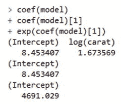

图 2-47.

模型系数

现在我们得到了系数，让我们看看第 175 至 179 行的下一段代码。这段代码定义如下：

```r
ggplot(diamondSample, aes(x = carat, y = price)) +
  geom_point(colour = "blue") +
  geom_smooth(method = "lm", colour = "red", size = 2) +
  scale_x_log10() +
  scale_y_log10()
```

我们已经逐步讲解过这条命令的语法，但我看到有一行`geom_smooth(method = "lm", colour = "red", size = 2) +`是我们之前没有定义过的。添加这行代码会在图表中增加一条细的红色趋势线。现在高亮显示这些行并执行它们。图 2-48 显示了您作为结果应该看到的内容。

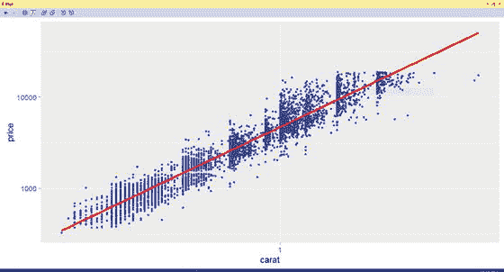

图 2-48.

图表结果

这是一个非常有意义的图表！正如您所看到的，这些图表正变得越来越好，越来越有趣。

现在跳到第 202 行。这一行是`model <- lm(log(price) ∼ log(carat) + ., data = diamondSample)`，它与我们之前构建的模型密切相关，但这次我们声明了`log(price) ∼ log(carat) + .`，这意味着我们希望对价格列的对数与数据集中的所有其他列进行建模。换句话说，这是真正的多元线性回归，而不是简单线性回归。

高亮显示第 202 行并执行它。请注意，“变量资源管理器”现在显示`List of 13`，而之前显示的是`List of 12`；这意味着我们已将模型添加到列表中，它现在在数据集中可用了。如果您愿意，您可以随时双击`model`来查看其中包含的数据。

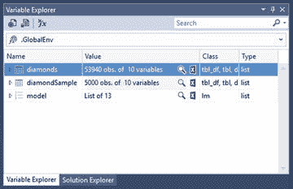

图 2-49.

模型值增加

第 204 行显示了模型的摘要；因此高亮显示此行并执行它。图 2-50 显示了此操作的结果。

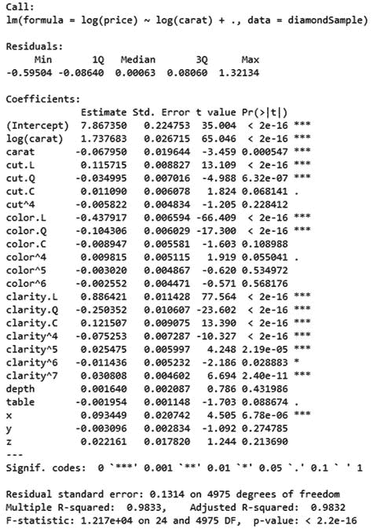

图 2-50.

`summary(model)`信息

这很显著（一个不好的双关语），因为 R 平方值是 98%，这意味着 98%的数据非常接近回归线。不错！

第 211 至 214 行表明我们现在要创建一个数据框，这是 R 在其模型中结构化数据的方式。这些行定义如下：

```r
predicted_values <- data.frame(
  actual = diamonds$price,
  predicted = exp(predict(model, diamonds))
)
```

所以，让我们再次逐步分析，以了解这里的语法在做什么。

*   `predicted_values`: 保存命令结果的对象。
*   `data.frame`: R 处理结构化数据的方式，类似于一个表。
*   `actual = diamonds$price`: 设置一个名为`actual`的列变量，其值等于`diamonds`数据集中的`price`值。
*   `predicted = exp(predict(model, diamonds))`: 设置一个名为`predicted`的列变量，其值等于在`diamonds`数据集中`model`线性模型的预测值的指数。

执行第 211 至 214 行。您会发现又没有发生任何事情，这是预期的。再次查看您的“变量资源管理器”；您会看到现在有另一个名为`predicted_values`的数据集可用，这是我们刚刚添加的。图 2-51 显示了您现在应该看到的内容。

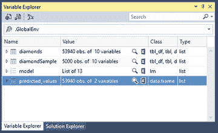

图 2-51.

`predicted_values`数据集

接下来是第 217 行，它是`head(predicted_values)`。我们之前见过这个，请回想一下`head()`命令允许我们查看数据的前六行。执行它。您应该看到图 2-52 所示的内容。

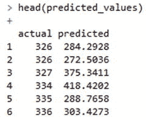

图 2-52.

`head(predicted_values)`

接下来是重头戏。第 220 至 224 行包含`ggplot`命令，它为我们绘制出所有内容。到目前为止，我们已经用`actual`和`predicted`列设置了`data.frame`对象。现在我们看到了这些数据可视化后的样子。此命令的 R 代码定义如下：

```r
ggplot(predicted_values, aes(x = actual, y = predicted)) +
  geom_point(colour = "blue", alpha = 0.01) +
  geom_smooth(colour = "red") +
  coord_equal(ylim = c(0, 20000)) +
  ggtitle("Linear model of diamonds data")
```

我非常确定我们可以读懂并解读这个语法，但基本上，我们是在对`predicted_values`数据集运行`ggplot`命令。我们使用`actual`数据作为 x 轴的美学值，`predicted`数据作为 y 轴的美学值。数据点是蓝色的，具有根据数据值变化的 alpha（透明度），带有一条红色趋势线，y 轴限制为 20000（这强制了比例尺），以及一个标题。

图 2-53 显示了您在执行第 220 至 224 行后应该看到的内容。

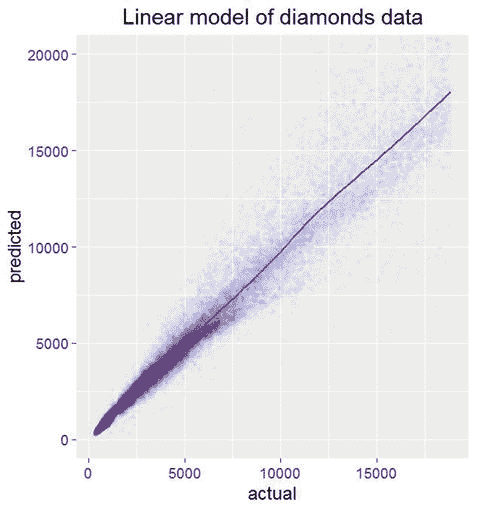

图 2-53.

`predicted_values`的`ggplot`图

真的，这是一个非常有用的图表，你不觉得吗？如果你顺利做到这一步没有任何问题，干得漂亮！你现在已经学到了相当多的 R 语法基础知识，并且看到了最常用的 R 绘图包`ggplot2`的实际应用。

## 摘要

让我们回顾一下本章所完成的工作。

*   阅读了 RTVS 的文档，网址为 [`http://microsoft.github.io/RTVS-docs`](http://microsoft.github.io/RTVS-docs)
*   浏览了位于 [`http://microsoft.github.io/RTVS-docs/samples.html`](http://microsoft.github.io/RTVS-docs/samples.html) 的示例
*   查阅了位于 [`https://cran.r-project.org/doc/manuals/r-release/R-intro.html`](https://cran.r-project.org/doc/manuals/r-release/R-intro.html) 的 R 文档
*   查阅了位于 [`https://cran.r-project.org/web/views/`](https://cran.r-project.org/web/views/) 的任务视图
*   查阅了位于 [`https://cran.r-project.org/doc/manuals/r-release/R-data.html`](https://cran.r-project.org/doc/manuals/r-release/R-data.html) 的关于 R 中数据导入/导出工作原理的资料
*   了解了位于 [`https://cran.r-project.org/doc/manuals/r-release/R-exts.html`](https://cran.r-project.org/doc/manuals/r-release/R-exts.html) 的关于 R 扩展的资料

我现在就期望你成为 `R` 专家吗？不。我期望你仔细钻研前面列出的所有网址吗？不。我期望的是至少满足以下最低要求：

*   `Visual Studio` 已正确安装。
*   `Visual Studio 的 R 工具` 已正确安装。
*   `SQL Server 2016` 已正确安装，并且能够与 `R` 引擎通信。
*   你至少已经简要浏览过前面列出的文档，以便熟悉 `R` 语法。

这些工具的安装方式可能会因后续的服务包而有所不同。但无论如何，都应该有一条清晰的路径来实现我刚才概述的解决方案。至少，在继续本章之前，应该满足上面列出的四点。如果其中任何一项未能 100% 正常运作，请回头解决问题。例如，我在第 1 章中给出的脚本显示了 `SQL Server` 正在与 `R` 引擎协同工作。图 2-29 显示了 `Visual Studio` 也已为 `R` 配置好。因此，此时我们所有人都应处于相同的理解层面。

在下一章中，我们将讨论项目场景定义。在那里，我们将明确界定项目要达成的目标以及我们将采取的步骤来实现它。之后，我们将开始开发我们的解决方案，并使用 `SQL Server 2016` 和 `Visual Studio 的 R 工具` 来实施它。

## 3. 项目场景定义

在开始本章之前，我想花点时间说明一下，本章涉及开发中的项目管理方面，而非实际的开发工作。有时，处理管理方面可能是你工作中最令人沮丧的部分，但它仍然是必要的。为了那些在这方面经验不多的读者，我包含了本章。希望它能帮助你理解为下一个项目制定计划是多么重要。

我们首先要做的，是确保所有部分都能按预期协同工作。回顾第 1 章，从 `SQL Server` 的角度来看，`R` 已设置正确。第 2 章向我们展示了 `RTVS` 也已正确设置。这意味着我们所做工作的软件部分已经就绪。还剩下什么？

本章更侧重于项目的管理方面，而非开发方面。这样做的原因是为你将来（如果还没有的话）终将需要管理一个项目做准备。虽然这绝非关于技术项目管理你需要知道的一切，但它确实为你从技术角度管理期望提供了一个很好的入门。我发现，最好的管理者是那些能够根据情况需要戴上不同帽子的人；他们可以在需要时兼具技术性或管理性。

每当开始一个新项目时，最好能对你想要做什么以及如何到达你想去的地方有一个清晰的想法。就像开始一次公路旅行，你必须确保有一张地图和前往目的地的路线指示；否则，你只会原地打转，永远无法真正到达任何地方。这恰好是描述一个管理不善项目的类比：耗费了大量时间，花费了大量金钱，但项目却从未真正完成。这是管理不善项目的标志。在我的职业生涯中，我见过许多项目因规划不当或不完整而失败，我可以告诉你，很容易成为新开发面临的最大障碍的受害者，那就是**范围蔓延**的要素。

### 范围蔓延

究竟什么是范围蔓延？简单来说，就是项目的**需求**没有得到严格遵守。如果定义项目需求的过程耗费了时间、麻烦、精力与心血，最终却不被遵循，那确实毫无意义。在这种情况下，倒不如直接开始开发，然后由客户临时提出当天或当周的开发需求。与之相反的做法是，确立一套客户与开发团队共同认可、并严格遵循的固定需求。这样一来，就不会产生任何人的误解，因为一切从一开始就被清晰地列出并达成一致。我们将在本章稍后部分深入探讨这一点。

我最喜欢用一块石头来描述范围蔓延。假设你站在栅栏的一侧，你的客户在另一侧。客户隔着栅栏喊话，说想要一块“上了色的石头”。你回应说你非常擅长给石头上色，会尽快交给他们。于是，你四处寻找，找到一块大小适中的石头，然后拿出你最常用的颜色。毕竟你对此非常擅长，所以你默认了客户想要的就是这样。完成的石头看起来棒极了，你把它扔给了栅栏对面的客户。他们立刻扔了回来，因为颜色不对。那么颜色是什么时候确定的呢？其实并没有确定。你假设了你的颜色就是客户想要的；但结果证明，完全不对。然而你并没有吸取教训，决定把石头漆成另一种颜色，然后扔回栅栏。客户立刻又扔了回来，因为颜色还是不对。现在你开始感到沮丧，因为你认为这个颜色是正确的——它必须是正确的！最终，你问客户想要什么颜色；他们回答“蓝色”。这没问题，因为你有蓝色颜料。于是你把石头漆成蓝色，再扔回栅栏。猜猜怎么了？他们立刻又扔了回来，说蓝色的色调不对。这种情况反复发生，直到你终于调对了那个蓝色的色调。但是，他们又一次把石头扔了回来！为什么？这次，他们抱怨石头的形状不对，实际上，这块石头的种类也完全错了。

所以，项目从“给这块石头上色”这个假设开始，最终演变成了“用这种特定色调的颜料，涂在这种特定形状的、这种特定种类的石头上”。看到了吗？我可以告诉你，这非常令人沮丧。不幸的是，许多项目正是这样管理的。如果你是开发团队中不幸的一员，而不是管理层，你将承受最多的抱怨，因为你不断交付的东西在技术上可能完全合理，但对客户来说在审美上毫无意义。当情况变得明显，开发团队是接收指令以满足客户需求的最后一个环节时，情况会变得特别痛苦，因此，项目能否按时且在预算内完成，最终责任落在了开发团队身上。因此，坚持已达成一致的需求并避免偏离至关重要。

我发现管理任何大型任务的最佳方法是将其分解为更小、更易管理的任务。这通常被称为`模块化`，是处理几乎所有事情的绝佳方式。在这方面，将任务按阶段划分对我来说非常有意义，让我们稍作关注这一点。

### 项目定义阶段

与其经历所有范围蔓延的麻烦，最好对需要什么、何时需要以及如何需要有一个非常结构化的构想。项目开发有明确定义的阶段，我很快就会讨论到。相信我；如果你的下一个项目还没有使用某种管理方法，那么采用这些阶段或非常类似的流程将会对你非常有帮助。无论项目规模大小，设定非常具体的目标节点都至关重要。请理解，这绝不是处理项目管理的唯一方式。我确信关于方法论以及必要的步骤会有不同的意见。但我真正希望你从这里学到的是，特别是如果你从未处理过这方面事务的话，那就是在规划项目时，一个管理计划是绝对必要的。


#### 第一阶段：需求收集

此阶段包括软件和硬件定义两部分。这也许是整个流程中最关键的阶段，因为如果此处有误或不完整，将影响其后的所有阶段。因此，我们需要百分之百确保我们的定义是完整的，并获得所有相关方和利益相关者的同意。此阶段需要开发团队创建一套文档，由开发团队交付给客户，并由客户签字并注明日期。至此，该文档集便被视为项目的官方范围。

在这个需求收集阶段需要做些什么？以下是需要完成的事项清单。

*   开发团队需要编写一份 `软件需求文档`。
    *   需要清晰定义一个问题或议题。
        *   尽可能从客户那里获取尽可能多的细节，包括这个问题如何影响他们的日常工作，或者增加某个功能后他们的工作能变得多么高效。
    *   需要对所述问题提出一个大致的解决方案。
        *   这意味着暂时不需要深入细节。如果可能，提供多种不同的解决方案，以便客户了解他们不同的选择。
*   需要确定软件语言和技术。
    *   提供用于开发接口或应用程序的语言和技术的详细信息。
*   需要确定交付媒介。
    *   即它将以何种形式交付；通常是基于 Web 的，或是桌面应用程序。
*   开发团队需要编写一份结构化的 `软件设计文档`。
    *   此文档提供呈现给客户的接口的详细信息。需要向客户指出，该接口很可能会随着时间推移发生细微变化，这取决于当前的 Web 或桌面趋势以及所用语言中可用的选项。此文档的大部分内容将由模拟屏幕截图和报告场景组成。
*   开发团队需要编写一份结构化的 `数据库需求文档`。
    *   此文档提供关于将创建的数据库表和脚本的详细信息，这些内容将呈现接口，并最终向客户呈现整个解决方案。请注意，此文档同时涵盖了数据库的设计和需求。这样做的原因是，客户在很大程度上并不关心数据库的琐碎细节，如数据类型或字段长度。虽然这些信息当然可以在另一份文档中提供给客户，但或许最好将这些信息保持在相对疏远的位置，以免（从客户的角度）用无意义的信息使他们不知所措。这份文档的整体目的是什么？比你最初意识到的要重要得多。例如，此文档可用于为将来与不同远程数据库的交互提供数据库映射。因此，务必将其作为最后创建的文档，以防数据库发生某些变更而文档未能反映这一变化。

这份清单代表了我认为作为正式请求的一部分需要交付的最低限度的文档。可能还有更多，但这已经是一个良好的开端。

一旦此阶段完成并生成了文档集，就需要正式的验收和签字。必须向客户清楚地说明，在文档签署且开发开始后，不允许进行任何形式的更改。如果确实需要进行更改，你有两个选择。你可以开始一个螺旋式开发过程，或者实施一个 `软件变更请求系统`。我强烈推荐使用 `软件变更请求系统`。两者有何区别？

#### 螺旋式开发过程

螺旋式开发是一种特别糟糕的开发形式，发生在项目中实际允许并鼓励范围蔓延时。太可怕了！你能看出允许过多范围蔓延的后果吗？没错；项目永远不会真正完成。项目会持续停留在定义和开发阶段，永远无法进展到完成。

对于我们这些按项目收费的人来说，鼓励范围蔓延是完全不可接受的。可以这样想：如果你估计一个项目需要 10 小时，并且你为这个项目收费 500 美元，那么你每小时赚 50 美元。然而，并不能保证你能在 10 小时内完成。假设它花了你 20 小时；那么你现在的时薪是 25 美元。更糟的是，它花了你 100 小时。哇！你每小时只赚 5 美元。

显然，这不是你想要的工作方式。相反，你只应交付双方同意的内容，任何变更都被视为 `超出` 预估和已支付范围，并受制于新的协议。根据我的经验，我可以告诉你，当对期望完成的工作有非常清晰的定义时，这会让每个人都感到满意。

螺旋式开发过程的另一个危险，就像我说的：项目永远不会真正完成。它只是无休止地持续下去，因为客户得到了超出他们所支付的东西，而开发者往往过于胆怯，不敢指出某些事情实际上超出了项目约定的范围。这对你适用吗？你愿意获得这样的名声吗？——花时间走完所有正确管理技巧的流程，却在项目中途向客户未经证实的变更请求让步？我想你不会。我想我们都希望获得这样的声誉：一个有能力的开发者，有诚信去指出客户可能或明显偏离合同、或期望偏离合同的行为。在这种情况下，合同中需要有一个明确定义的补救条款，专门处理强制执行原始合同及其范围所需的具体步骤。

#### 软件变更请求过程

我推荐在项目及其范围发生变更时使用正式的变更请求。原因很简单：项目保持结构化！初始项目完成并被标记为 `v1.0`，对吧？之后你进行的任何更改，对于小的变更可以是 `v1.1`，对于重大变更可能是 `v2.0`。`软件变更请求过程` 包含一个工作流中需要遵循的不同步骤，以促成一个完整的变更请求。这不是客户发一封 `电子邮件`；而是一个完整的过程，在工作流的每一步都需要签字确认。

##### 请求提交

在此步骤中，任何用户都可以请求对软件进行更改。不过，请求需要完整且有条理，不能只是像“我想把一块石头涂成蓝色”这样模糊的陈述。请求提交通常是一个相当复杂的步骤，用户被迫提供大量与请求相关的信息。确保不仅要收集客户信息，还要收集需要完成的具体任务。

##### 管理员批准

管理员随后会收到一个变更已被请求的通知。此时，管理员可以接受或拒绝该变更。也存在管理员可能联系请求者以获取更多信息，然后拒绝该请求，以便发起人可以详细阐述原始请求的情况。这非常常见，因为十有八九，普通用户不理解正确满足其请求所需的复杂需求。


#### 软件开发工作流程

##### 设计
一旦收到被接受的请求，第一步是设计解决方案。有时，直接画出解决方案是最佳方式。它能让你对布局和实现解决方案所需空间有良好的预期。客户期望看到类似 `Photoshop` 制作的屏幕草图之类的东西，更可能以 `PDF` 格式呈现。这并非总是硬性要求，但如果用户希望随时了解请求的进展，那么这样做是个好主意。无论客户是否参与，花几分钟时间快速绘制草图，并可能写一段简短的伪代码示例来说明思路，总是值得的。

##### 编码
接下来是有趣的部分：编写代码。这可以使用任何完成工作所必需的语言，以及你的应用程序中用于交付解决方案的任何技术。在某些情况下，你会用到多种语言。在 Web 开发中，这非常常见。我日常构建应用程序时，经常稳定地混合使用 `HTML`、`ColdFusion`、`CSS` 和 `jQuery`。某些日子某种语言用得更多，但这大致就是我的工作内容。不过，这是过程中第二耗时的活动；最耗时的……是文档。

##### 文档
开发中最容易被忽视的部分无疑是记录所做的更改。务必严格遵循这一步！这不同于所有优秀开发人员定期进行的行内注释。那些行内注释也很棒，请别误会。这里特指的文档是面向用户的。它包含两份文档，但用户通常只看到其中一份。一份文档需要定义请求以及为实现该请求所采取的步骤。其原因在于，如果需要，可以基本上回滚这项更改。第二份文档是供用户测试更改的测试脚本。它需要相当简单明了；类似于“点击确定按钮”这样的指示。必须明确说明当某个操作发生时期望发生什么，以及失败的条件是什么。

##### 单元测试
这意味着在模块化环境中独立测试解决方案。它是否能独立完成所需功能，还是需要与其他单元或模块交互？换句话说，它应该尽可能地内聚。如果它需要依赖其他东西才能运行，你可能需要重新考虑这个特定的技术方案。是否有可能使用原生代码重写，使其更清晰、更模块化？这些是本阶段必须客观回答的问题。

##### 回归测试
在这里，你需要将解决方案作为涵盖整个应用程序的整体解决方案的一部分进行测试。换句话说，该解决方案与当前应用程序配合得如何？它是否能“无缝契合”，还是存在不一致而需要进一步处理？大多数时候，它能无缝集成，但有时则不然。因此，最好将更改视为应用程序整体的一部分来审视，而不是像单元测试那样以模块化的方式看待。考虑该更改的成功路径和失败路径（如果有独立路径）。考虑到系统其余部分的路径，它们是否合理？它实现其宣称功能的程度如何？

##### 验收测试
这是在解决方案通过所有其他测试且文档完成后进行的。这是提出请求的用户唯一应该看到的步骤。对其他所有内容，该用户都应该如同面对一个黑匣子，以免你陷入螺旋式开发的陷阱。千万别那么做！这个步骤非常简单，就是一行声明，表明客户同意该更改，并且已按预期交付。只需一个签名和当前日期即可完成此步骤。

##### 安装
解决方案被客户接受后，需要进行安装。这有点显而易见，但仍然是流程中必要的部分。这也需要记录，尽管要求可以宽松得多。务必在安装前立即备份数据库。如果你运行的是虚拟实例，我建议创建服务器镜像；如果是常规服务器，则建议创建带备份的系统镜像。其原因应该很清楚：以防万一一切变得一团糟时能快速恢复。一旦所有内容正确加载，请删除任何备份以释放系统空间。

##### 归档
最后，安装完成后，需要对解决方案进行归档。这包括两件事：首先，应将解决方案与所有文档一起打包压缩，并添加到某种源代码存储库中。具体使用哪种存储库由你决定。其次，网站或公告板上的请求物理记录应被移除，并添加到归档或已完成部分，以便日后必要时查阅。

请注意，前述工作流程并非包罗万象，而是旨在帮助你开始理解软件更改请求流程的具体样貌。

现在你已经理解了范围蔓延和螺旋式开发的含义，以及它们为何对项目有害。你也了解了软件更改流程，以及它对几乎任何系统的益处。接下来是什么？让我们继续定义项目定义的各个阶段，然后讨论更多影响项目成功有时也导致项目失败的因素。

#### 第二阶段：初始界面设计
此阶段允许开发者（如果适用）创建初始用户界面。有时项目没有界面，因为它们发生在“幕后”。如果你的项目属于这种情况，请直接跳到下一阶段。如果不是这样，而你必须创建一个界面，那么此阶段正是为你准备的。

初始界面设计相当不言自明：你希望基于需求文档，并利用从客户那里收集到的任何其他信息，创建一个初始界面。请注意，这不包括回头向客户寻求想法或建议。基本上，他们之前已经有机会提出实施建议，而现在实施它们为时已晚，否则就会陷入可怕的螺旋式开发循环。还记得你如何让客户签署了项目范围吗？就像他们不能随意找你一样，从技术上讲，你也不应该回头找他们。如果你发现界面需要以某种方式实施存在真正的问题，或者某个问题阻碍你完成工作，那么你显然需要与客户沟通。这样做的关键在于“训练客户”理解，你严格依据需求文档工作，仅此而已。这样，当你交付所要求的东西时，你就知道它在技术和功能上 100%符合需求文档。

我们已经收集了需求，我在本书的示例下载中列出了这些需求。下载内容包含我们的需求文档和初始数据集。请确保你拥有以下两个文档，否则你会很难跟上进度；它们可以从本书在出版商网站上的目录页面获取：

* ```
  Software Requirements Document.docx
  ```

* `Weather_Sample.csv`

作为参考，`Weather_Sample.csv` 文件与我们之前从微软下载提供的文档相同。经许可，我们在本书中使用相同的示例。

考虑到这一点，让我们来看看我们已同意提供的报告，并规划一个解决方案。


### 加载 R 解决方案

回想一下，在第 2 章中，我们曾从 [`https://microsoft.github.io/RTVS-docs/samples.html`](https://microsoft.github.io/RTVS-docs/samples.html) 下载了一个 `.zip` 文件。它包含了我们最终将要构建的内容所需的一切。请将该 `.zip` 文件解压缩到一个您容易访问的位置，因为我们马上就要加载其中的解决方案。

启动 Visual Studio，然后转到 文件 -> 打开 -> 项目/解决方案…。导航到您保存并解压 `.zip` 文件的位置。沿着文件夹路径找到 `RTVS-docs-master/examples/Examples.sln`。选中它并点击 打开，如图 3-1 所示。

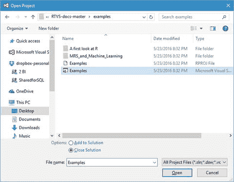

图 3-1. 打开项目

项目需要一点时间打开，然后会将解决方案文件加载到 Visual Studio 中。

请注意您的解决方案资源管理器窗口（如果未显示，请按 `Ctrl+Alt+L` 使其出现），其中有一组文件，如图 3-2 所示。

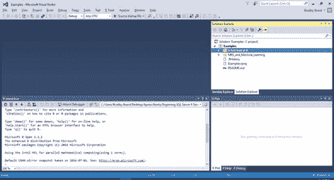

图 3-2. 解决方案资源管理器中的文件

双击最底部的 README 文件；就是不在任何文件夹内的那个。此时您应该看到如图 3-3 所示的内容。

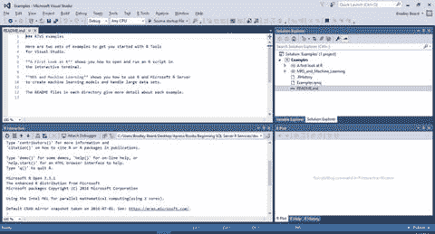

图 3-3. README 文件

这看起来熟悉吗？在第 2 章，图 2-30 中，我们在开始逐步浏览 R 示例之前见过这个。请注意，目录内部还有更多的 README 文件，提供了来自 Microsoft R 专家们的更多指导。

在解决方案资源管理器中展开 `A first look at R` 文件夹，然后在右窗格中点击 `Getting_Started_with_R.R` 文件。您应该看到与图 3-4 所示类似的内容。

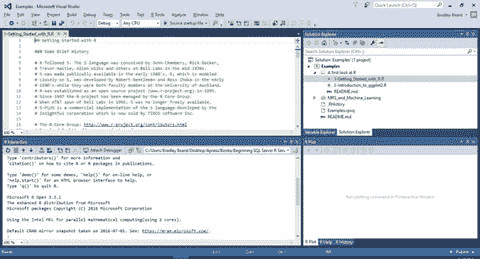

图 3-4. R 入门初始屏幕

需要明确的是，左上窗格是打开的文件，左下窗格是 R 交互窗口（基本上是 R 操作的结果）。屏幕右上角是解决方案资源管理器和变量资源管理器窗格，右下角是 R 绘图、R 帮助和 R 历史记录窗格。您可以根据自己的喜好重新排列窗口，只要您在需要时能方便地使用它们即可。

在本章结束之前，我想讨论几件事。首先，让我向您提出两个问题。数据库中运行的是哪个版本的 R？Visual Studio 中运行的是哪个版本的 R？我不得不停下来思考了一会儿，最终得出的结论是：我无法从 SQL Server 判断安装了哪个版本的 R。不过，我可以很容易地从 Visual Studio 判断运行的是哪个版本的 R，因为它在 RTVS 内的 R 启动消息中显著显示，如图 3-5 所示。

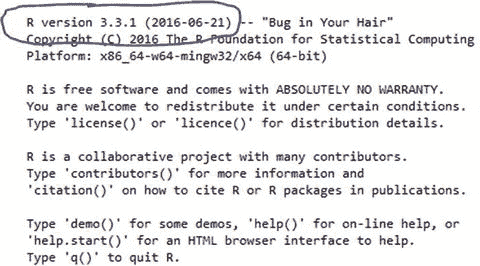

图 3-5. RTVS 中的 R 版本

多么有趣！如果我同时运行两个不同版本的 R 呢？这肯定会引起问题，特别是如果我在 RTVS 中编写代码，然后又希望在 SSMS 中得到相同的结果。这不会给我不同的结果吗？逻辑表明，这很有可能会发生。因此，显然，我们希望尽可能避免这种情况。

还记得我们用来在 SQL Server 中执行 R 代码的存储过程吗？再次展示该过程如下：

```sql
exec sp_execute_external_script
@language =N'R',
@script=N'OutputDataSet<-InputDataSet',
@input_data_1 =N'select 1 as hello'
with result sets (([hello] int not null));
go
```

让我们重写这个过程以获取执行此代码的 R 的版本。我们的重写是一个简单的小脚本，您可能希望将其收入您的技巧库，以备不时之需。您可能希望在新建查询窗口中按 `Ctrl+T` 切换到“结果以文本显示”。脚本如下：

```sql
exec sp_execute_external_script
@language =N'R',
@script=N'OutputDataSet<-InputDataSet;
message (R.Version()$version.string);'
with result sets (([Version] varchar));
go
```

我相信我们都熟悉通用的脚本实践，所以我们可以看到我使用了 R 的 `message()` 函数，通过调用 `R.Version()$version.string` 来返回 R 的版本。

此操作的结果如代码清单 3-1 所示。

```
Version

(0 row(s) affected)
STDERR message(s) from external script:
R version 3.2.2 (2015-08-14)
代码清单 3-1. SQL Server 2016 中的 R 版本
```

我们刚刚验证了 Visual Studio 运行的是 R 3.3.1 版本，而 SQL Server 运行的是 R 3.2.2 版本。造成这种情况的原因是 SQL Server R Services 是服务器版本，而 RTVS 是客户端版本。我们要做的是将 RTVS 指向 R 3.2.2 版本，这样我们就能在 RTVS 中得到与 SQL Server 相同的结果。为此，请打开 Visual Studio，导航到 R Tools 菜单，然后点击 选项。图 3-6 显示了此菜单位置。

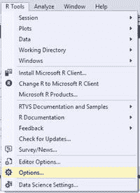

图 3-6. 选项菜单

将打开一个屏幕，如图 3-7 所示。

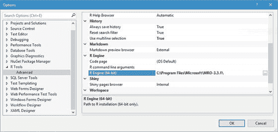

图 3-7. R Tools 高级选项

在图 3-7 所示的屏幕中，`R Engine (64-bit)` 选项被选中，其值为 `C:\Program Files\Microsoft\MRO-3.3.1\`。这需要更改为 `C:\Program Files\Microsoft SQL Server\MSSQL13.SQL2016RS\R_SERVICES`，因为这是 SQL Server 引用数据库内 R 库的位置。请注意，您的文件夹位置可能与我的不同，所以请找到您的 `R_SERVICES` 文件夹位置并使用它。替换完此文件夹位置后，点击 确定。系统会提示您重启 Visual Studio，所以请关闭 Visual Studio 并重新打开它。重新打开后，请注意 R 交互窗口包含一些对我们非常重要的信息。代码清单 3-2 显示了此信息。

```
R version 3.2.2 (2015-08-14) -- "Fire Safety"
Copyright (C) 2015 The R Foundation for Statistical Computing
Platform: x86_64-w64-mingw32/x64 (64-bit)
R is free software and comes with ABSOLUTELY NO WARRANTY.
You are welcome to redistribute it under certain conditions.
Type 'license()' or 'licence()' for distribution details.
R is a collaborative project with many contributors.
Type 'contributors()' for more information and
'citation()' on how to cite R or R packages in publications.
Type 'demo()' for some demos, 'help()' for on-line help, or
'help.start()' for an HTML browser interface to help.
Type 'q()' to quit R.
Microsoft R Server version 8.0 (64-bit):
Microsoft packages Copyright (C) 2016 Microsoft Corporation
Type 'readme()' for release notes.
代码清单 3-2. 更新后的 R 信息
```

这证明我们现在已经成功同步了 SQL Server 和 Visual Studio 的版本。下一步是更新包，我们可以通过 R 包管理器轻松完成。回想一下第 2 章，我们需要安装两个包（及其依赖项）：`ggplot2` 和 `data.table`。

通过转到 R Tools -> Windows -> Packages 在 Visual Studio 中打开 R 包管理器。图 3-8 显示了打开后的 R 包管理器。

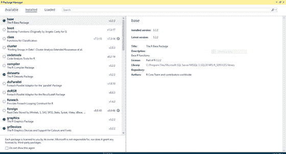

图 3-8. R 包管理器

在顶部窗格中，点击 Available 行，以显示图 3-9 中所示的内容。


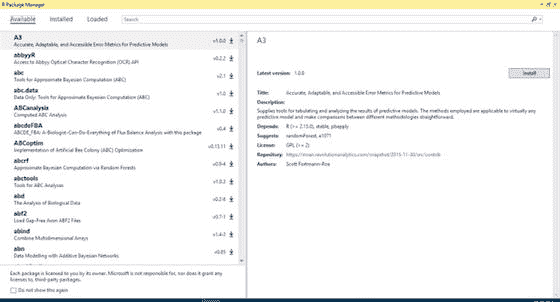

图 3-9 可用的 R 包

我们需要做的就是搜索 `ggplot2`；因此在窗口顶部的搜索框中键入它。`ggplot2` 包出现在左窗格中。图 3-10 显示了此结果。

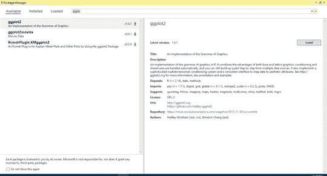

图 3-10 查找 ggplot2

接下来，我们只需点击右侧 `ggplot2` 窗格中的安装按钮来安装该包。安装在后台进行，但你随时可以检查 R 交互窗口以查看安装的当前状态。

包安装完成后，你会看到如图 3-11 所示的内容。

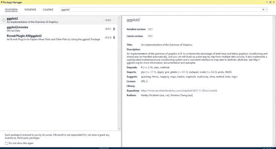

图 3-11 ggplot2 已安装

请注意，`Install` 按钮不再存在，左窗格现在在 `ggplot2` 旁边显示一个圆圈。这表明包已正常安装。

接下来，我们需要为 `data.table` 包重复相同的说明。我将此留给你作为练习，但你可以复制我刚刚给出的说明，作为一个可重复的过程来安装你想要的任何包。

### 总结

如果你一直跟上进度并让一切按预期进行，那么到目前为止做得非常好。如果没有，请返回并重新运行安装，以便看到我在示例中展示的内容。如果看不到，恐怕你就无法获得本书的全部价值。接下来的章节会变得更复杂，所以你要为此做好准备。在空闲时间，确保你正在复习 R 脚本和函数，包括出色的 `ggplot2` 包。大剧透：我们稍后会大量使用它。

回顾时间！让我们快速浏览一下本章所做内容。

*   了解了范围蔓延和项目定义阶段
*   了解了在完成的应用程序中软件变更过程的重要性
*   熟悉了 R Tools for Visual Studio 的初始界面

接下来，在第 4 章中，我们实际开始确定需求，并将其组合成一个可用的报告。

