# 4. 使用 RTVS 构建 R 模型

我们在第 3 章结束时，在 RTVS 中加载了一个解决方案，然后测试了我们是否能在 R 环境中成功工作。在本章中，我们实际在 R 中构建模型，然后在一系列图表中显示该模型中包含的信息。图表逐渐变得更高级，直到我们达到数据可视化的最终高潮。

我们还介绍了生成模型的大部分代码语法。我们通过逐行深入研究 Microsoft 在 `.zip` 文件中提供的文件来实现这一点。这样，我们可以看到发生的事情，并希望不仅理解发生了什么，而且理解为什么发生。

### 探索示例

让我们回到 R Tools for Visual Studio (RTVS) 中 R Tools 菜单下的 RTVS 文档和示例链接。该链接是 [`http://microsoft.github.io/RTVS-docs/samples.html`](http://microsoft.github.io/RTVS-docs/samples.html)。在该页面上，有一个包含示例的 `.zip` 文件下载，我们将用它来熟悉新的 R 环境。将该 `.zip` 文件解压缩到你可以访问的位置，导航到 `RTVS-docs-master/examples`，然后双击 README.MD。这将在 RTVS 中打开自述文档。图 4-1 显示了打开后的此文档。

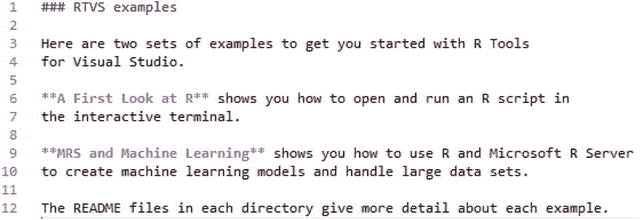

图 4-1 自述文件

在尝试进行任何开发活动之前，我们需要对 R 作为一门语言有点熟悉，因此让我们逐步了解《R 初探》中给出的一些示例。在本书后面介绍的教程中，我们将更多地处理 R Server 方面，因为我们直接与 SQL Server R Services 接口以创建包含嵌入信息的报告。

互联网上关于 R 的信息非常多，所以如果你已经了解它，那么可以将其视为复习课程。如果不了解，也不用担心。我不会深入探讨 R 的完整历史，也不会使这成为 R 所有功能的综合指南。相反，我将重点介绍基础——然后我们可以在此基础上继续。我认为这足以激发我们所谓的兴趣，并让我们的思维敏锐于将 R 用于严肃数据分析的实用性。

导航到 `RTVS-docs-master\examples\A first look at R` 并双击该目录中的 README.MD 文件。图 4-2 显示了此时你应该看到的内容。

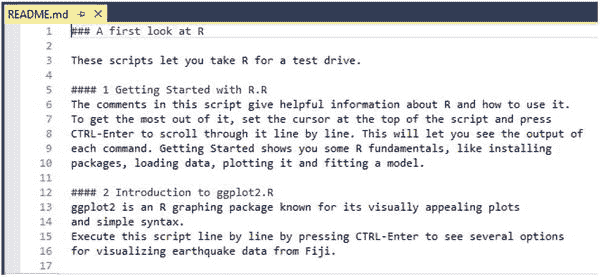

图 4-2 《R 初探》自述文件

该文档告诉我们，通过运行 Microsoft 在我们之前下载的 `.zip` 文件中提供的 R 脚本，我们可以“试驾 R”。导航回 `RTVS-docs-master\examples\A first look at R` 目录并双击 1-Getting_Started_with_R.R。然后脚本将在 RTVS 中打开，如图 4-3 所示。

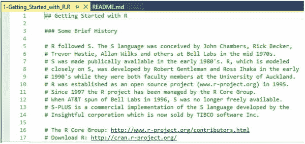

图 4-3 “R 入门”脚本

此时，我们要做的就是逐步查看 R 脚本并执行部分内容，以了解 R 在语法上是如何布局的，以及它与其他语言的比较。我们将几乎逐行浏览“R 入门”脚本，以便我们真正理解这个介绍的内容。

值得阅读前 75 行的注释，因为这为你作为新的 R 用户奠定了基础，或者如果你是旧版 R 用户，可以刷新你的记忆。无论哪种方式，这里都有适合每个人的内容，所以请确保你彻底阅读，特别是 R 资源和 R 博客部分。帮助部分总是很好，所以也不要跳过它。

第 76 行是第一个可执行的 R 脚本。那一行非常简单：`installed.packages()`。这一行让我们看到已安装了哪些包；因此高亮显示第 76 行并按 Ctrl+Enter 执行它。请注意，你的 R 交互窗口（应该仍然打开）开始加载大量信息，如图 4-4 所示。

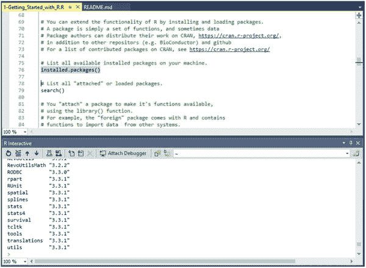

图 4-4 R 交互窗口

你可以在 R 交互窗口中向上滚动以准确查看发生了什么，但就目前而言，它纯粹是信息性的。例如，浏览这些生成的内容以确保你拥有已安装包的最新版本可能很有用，但对于一般用途来说，知道它在那里是好的。

注意


### 在 Visual Studio 的 R 工具中执行代码与管理包

R History 窗口中现在也有一个值了。这非常方便，以防我们将来需要重新执行某行代码。你只需高亮选中想要重新执行的代码，然后按 Enter。这会将代码从 R History 窗口移动到 R Interactive 窗口。接着，按 `Ctrl+Enter` 就可以像往常一样执行该行代码。

高亮选中第 79 行，该行内容是 `search()`，并执行它。这会列出当前 R 会话中已加载的包。接下来，我们使用 `library()` 函数附加一个包，这是 R 为会话提供特定包功能的方式。

跳到第 85 行，该行内容是 `library(foreign)`。这意味着我们将在当前会话中包含 `foreign` 库的功能。高亮选中第 85 行并按 `Ctrl+Enter` 执行它。一旦你看到 R Interactive 窗口底部的插入符号重新变回大于号（`>`），你就知道代码已经执行完毕。图 4-5 展示了此时你应该看到的内容。

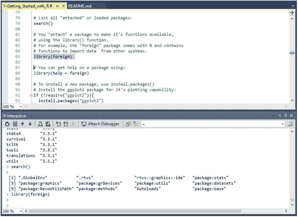

**图 4-5. 第 85 行执行**

这不在我们正在使用的 R 脚本中，但如果你现在返回并再次执行第 79 行，你应该会看到如图 4-6 所示的内容。

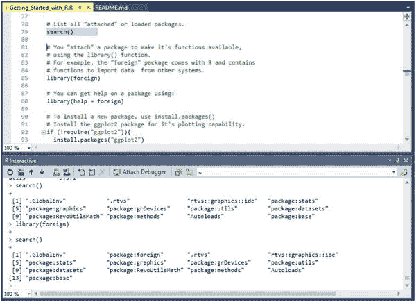

**图 4-6. 第 79 行执行，显示 foreign 库**

注意 R Interactive 是如何显示这些列出项目的吗？它是以每组四个的方式完成的，起始 n 索引号显示为最左边的列，后面跟着四个包。下一行以 n+4 索引开始，然后列出另外四个包，依此类推。现在看看，第一次执行 `search()` 显示了 12 个包，但现在我们可以在新返回的 `search()` 命令中看到返回了 13 个包。我们可以看到 `foreign` 包的添加是造成这个差异的原因，所以这证明了该包已成功添加到我们当前的 R 会话中。

当包被添加到 R 镜像时，它们总是包含一个帮助部分。你可以通过高亮选中第 88 行并按 `Ctrl+Enter` 来参考这个帮助部分。这会在 RTVS 的顶部框架中以另一个页面打开帮助文档。图 4-7 展示了这个结果。

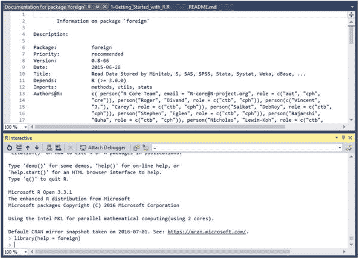

**图 4-7. foreign 库的帮助文档**

你可以关闭该文档。接下来，跳到第 90 行。我们将要安装 `ggplot2`，它可能是 R 可用的最流行、最强大的图表包。高亮选中第 92 到 94 行并按 `Ctrl+Enter` 执行。图 4-8 展示了这个结果。

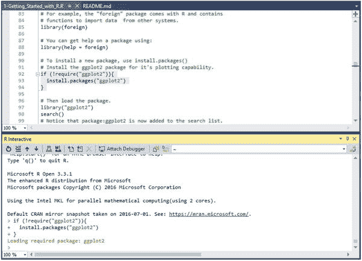

**图 4-8. 加载 ggplot2 包**

现在 `ggplot2` 已经加载，我们需要运行 `library()` 函数以将其加载到当前 R 会话中。这显示在第 97 行；高亮选中该行并执行它，然后也执行第 98 行。第 98 行是 `search()`，如果你还记得，它会显示当前加载的包。注意 `ggplot2` 现在已被添加到此会话当前安装的包列表中。

### R 包管理器

用于 Visual Studio 的 R 工具的安装包括一个 R 包管理器。如果你导航到 R Tools ➤ Windows 并选择 Packages，如图 4-9 所示，会打开一个页面，显示许多关于已安装 R 包的非常酷的信息，如图 4-10 所示。

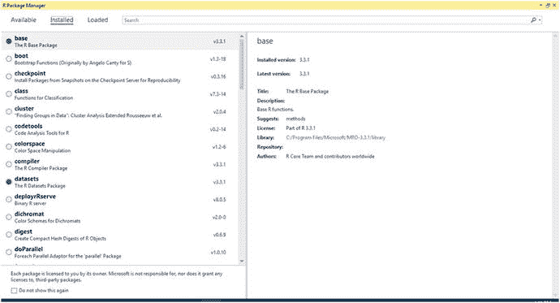

**图 4-10. R 包管理器**

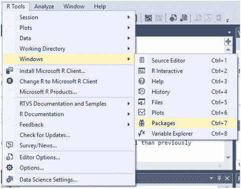

**图 4-9. Packages 选项的位置**

包管理器的添加非常有用，因为否则，用户将被迫通过命令行手动管理包。虽然有些用户可能更习惯这种方法，但这多少违背了快速应用开发的目的。通过此功能，用户现在可以查看其已安装的包，并选择从此界面更新它们，而不是使用 `installed.packages()`。

可以随意在此区域探索一下。例如，左上角包含三个选项：

*   **Available（可用）**：此菜单选项显示当前指向的 CRAN 镜像中所有可用的包。可以通过单击界面右侧的“Install”按钮下载并安装包。
*   **Installed（已安装）**：此选项显示系统上当前安装的所有包。如果已安装的包有可用更新，左窗格中会出现一个蓝色图标，右窗格中会出现一个“Update”按钮。
*   **Loaded（已加载）**：此选项显示项目中当前加载的所有包。

详细阐述这些信息，**Available** 菜单选项如图 4-11 所示。

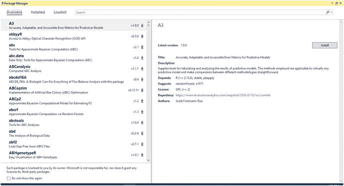

**图 4-11. Available 菜单选项**

注意右侧的“Install”按钮。单击此按钮会将当前选中的包安装到你的 R 安装中。

**Installed** 菜单选项如图 4-12 所示。注意，我已滚动到左窗格底部以显示可更新的包。

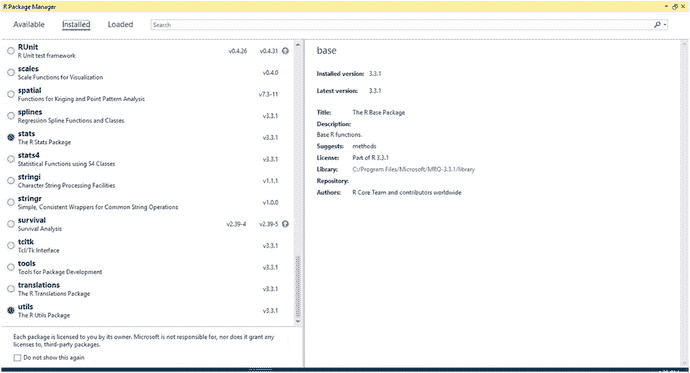

**图 4-12. Installed 菜单选项**

注意 `RUnit` 和 `survival` 都需要更新。在左窗格中单击 `RUnit` 包名称，界面会变为如图 4-13 所示。

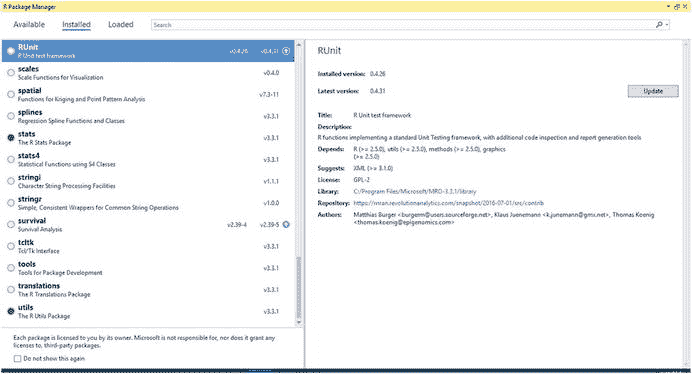

**图 4-13. RUnit 需要更新**

注意，此时“Update”按钮出现在右窗格中。

最后，**Loaded** 菜单选项如图 4-14 所示。

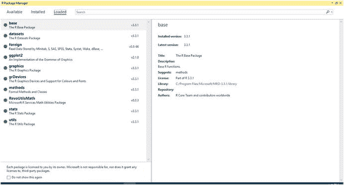

**图 4-14. Loaded 菜单选项**

除了查看已加载的内容外，你对此区域能做的操作不多。请关闭 R 包管理器窗口。我们继续。

### R 中的绘图

接下来，我们来看一个简单的回归示例，如脚本所示。首先，我需要指出 `ggplot2` 包预装了相当多用于测试其功能的数据集。如第 105 行所示，使用语法 `data(package = "ggplot2")$results` 访问这些数据。该语法表示我们希望对 `ggplot2` 包运行 `data()` 函数，并将输出中名为 `results` 的子集显示在屏幕上，如图 4-15 所示。

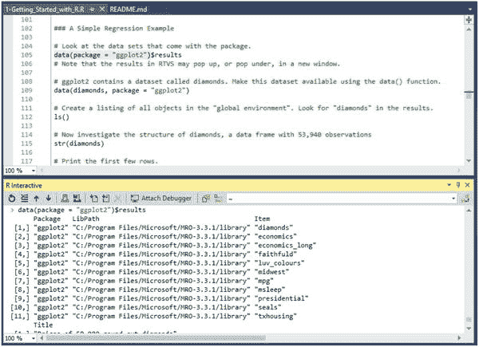

图 4-15.
ggplot2 结果

因此，我们也可以执行命令 `data(package = "ggplot2")` 来查看该包中包含的数据集列表。图 4-16 显示了这一结果。

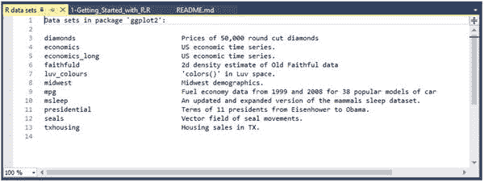

图 4-16.
ggplot2 数据集

关闭该窗口，但保持你的 R 脚本打开。我们已经在 R 交互窗口中看到了 `data(package = "ggplot2")$results` 的执行结果，所以下一个跳到第 109 行。这一行写着 `data(diamonds, package = "ggplot2")`。这个语法表示我们希望对 `ggplot2` 包中的 `diamonds` 数据集运行 `data()` 命令。高亮显示该行并按 Ctrl+Enter 执行。这里并没有任何巨大的变化；只是 `diamonds` 数据集刚刚被加载以供分析。要知道它刚刚被加载，可以检查你的变量资源管理器窗口。图 4-17 显示了此时变量资源管理器窗口应有的样子。

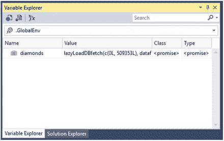

图 4-17.
diamonds 数据集已加载

所以我们的 `diamonds` 数据集已经加载并准备就绪。下一个转到第 112 行，该行写着 `ls()`。这一行本身没有任何参数，只返回当前会话中用户定义的数据集或函数。在这个例子中，运行一行简单的代码只会输出一个词：`diamonds`。原因是这是本次会话中唯一加载的数据集。如果你在一个没有参数的函数中执行这一行，你将能够看到该特定函数的局部变量。如你所见，这可以是一个有用的调试工具。

现在转到并执行第 115 行，该行写着 `str(diamonds)`。该命令允许我们检查作为参数传入的数据集的结构。图 4-18 显示了在 RTVS 中显示的结构。

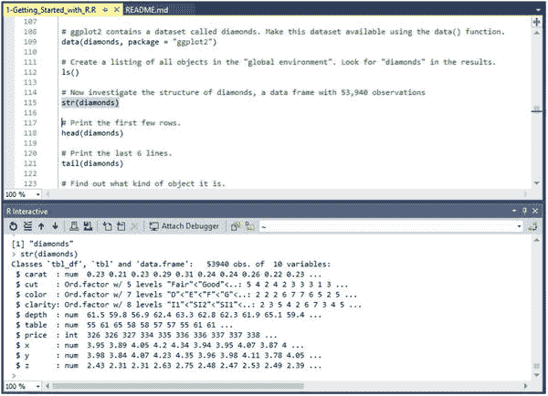

图 4-18.
`str(diamonds)` 输出

简单看一下那里返回的数据。你可以看到有很多信息，但似乎被截断了。别担心；再看一下你的变量资源管理器。你看到一个非常细微的变化，即 `diamonds` 旁边现在有一个指示器，而不是只有一个表格图标。点击这个指示器。你应该看到图 4-19 所示的内容。

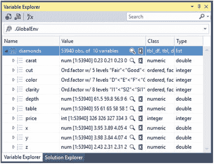

图 4-19.
diamonds 详细信息

这对我来说更容易阅读和理解。在图 4-19 所示的蓝色栏正上方，列被定义为名称、值、类和类型。在那里浏览一会儿，熟悉它的样子。这是一个非常酷的功能，允许在真正分析数据之前对其进行自省。

接下来转到第 118 行。这一行写着 `head(diamonds)`，它简单地指示 R 输出数据集中的前六行数据。相反，第 121 行写着 `tail(diamonds)`，正如你可能猜到的，输出数据集中的最后六行数据。这两次执行的结果如图 4-20 所示。

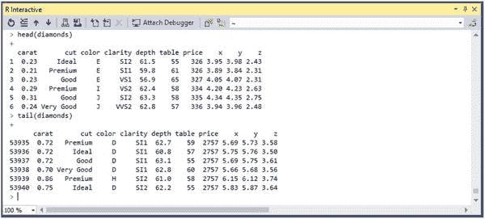

图 4-20.
`head()` 和 `tail()` 演示

下一个是第 127 行，写着 `dim(diamonds)`。`dim()` 函数允许我们查看作为参数传递的对象的维度，这里就是 `diamonds`。执行这一行只是显示了我们之前通过检查变量资源管理器已经收集到的信息：返回了一个数据集，包含 10 个变量的 53940 个对象。

接下来，我们进入 R 中的绘图部分。在 R 中用于绘图有三个主要的包：`base`、`lattice` 和 `ggplot2`。这也体现在第 136 行。

第 133 行和 134 行如下所示：

```
diamondSample <- diamonds[sample(nrow(diamonds), 5000) ,]
dim(diamondSample)
```

在继续之前，让我们分解一下这个语法。

*   `diamondSample`：声明一个对象用于存储命令的结果。
*   `<-`：赋值运算符，声明右边命令的结果将被赋给左边的对象。
*   `diamonds`：引用 `diamonds` 数据集。
*   `[sample(nrow(diamonds), 5000), ]`：从 `diamonds` 数据集中随机抽取 5000 个数据点。
*   `dim(diamondSample)`：显示 `diamondSample` 对象的维度。

正如预期的那样，`dim(diamondSample)` 命令的结果是输出 `[1] 5000   10`，这意味着返回了一个数据集，包含 10 个变量的 5000 个对象。

接下来，我们转到第 140 行，内容是：`theme_set(theme_gray(base_size = 18))`。这意味着我们将字体大小设置为 18pt 并使用灰色主题。高亮显示并执行该行，然后跳到第 143 和 144 行。那些行显示以下代码：

```
ggplot(diamondSample, aes(x = carat, y = price)) +
geom_point(colour = "blue")
```

首先，请注意这是在两行上，但它实际上是一个长命令。加号的存在表示一个续行符，这是在函数或参数内部使用之外的情况。

在我们继续之前，让我们看一下这个命令的语法。

*   `ggplot`：定义要执行的函数。
*   `diamondSample`：引用 `diamondSample` 对象作为活动数据集。
*   `aes`：定义图表的美学品质；在这个例子中，x 轴是 `carat` 集，y 轴是 `price` 集。
*   `geom_point`：在点被绘制后对其进行自定义。

所以这意味着我们将生成一个图表。高亮显示这两行并按 Ctrl+Enter 执行它们。图 4-21 显示了此操作的结果。

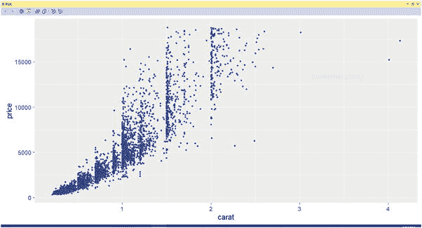

图 4-21.
我们的第一个图表！

注意到 R 绘图窗口在这里获得了焦点吗？这非常方便。还要注意 x 轴是 `carat`，y 轴是 `price`，正如我们在 `aes()` 命令中定义的那样。

接下来转到第 147 到 149 行。你会看到有一个非常轻微的添加：`scale_x_log10()`。这为我们提供了 x 轴上一个很好的对数刻度（这也在第 146 行中说明），所以现在继续高亮显示并执行第 146 到 149 行。图 4-22 显示了你现在应该看到的内容。

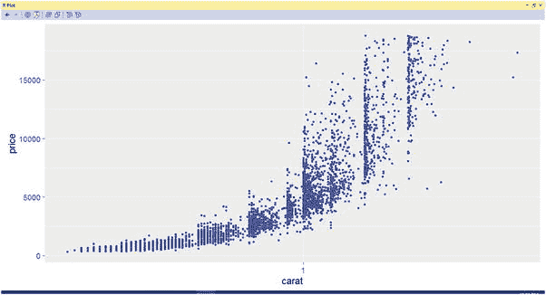

图 4-22.
添加对数刻度

现在开始更有意义了。接下来，添加了另一行，让我们在 y 轴上添加另一个对数刻度。这是在第 152 到 155 行；所以高亮显示这些行并按 Ctrl+Enter 执行它们。图 4-23 显示了你现在应该看到的内容。

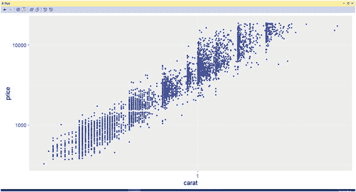

图 4-23.
在 x 和 y 轴上应用对数刻度

我认为，现在这个图表更好了。


### R 中的线性回归

接下来，我们将在已加载的数据集范围内探讨 R 中的线性回归。线性回归本质上是统计学家用来定义一个标量变量与一个或多个解释变量之间关系的方法。简单线性回归是指只有一个解释变量的情况，这基本上就是我们在这个示例中要处理的情形。

在 R 中，我们必须先为数据构建一个模型，然后才能使用该模型。为此，请查看第 163 行代码：`model <- lm(log(price) ∼ log(carat) , data = diamondSample)`。再次强调，在我们继续之前，先来看看这句语法。

-   `model`：定义继承该命令所定义内容的对象。
-   `<-`：一个赋值运算符，声明右侧命令的结果将被赋值给左侧的对象。
-   `lm`：定义一个线性模型。
-   `log(price)`：`price`数据的对数尺度（也是标量变量）。
-   `∼`：分隔标量变量和解释变量。标量变量显示在此符号的左侧，解释变量显示在右侧。
-   `log(carat)`：`carat`数据的对数尺度（也是解释变量）。
-   `, data = diamondSample`：定义要使用的数据对象（此处为`diamondSample`）。

高亮第 163 行并执行它。请注意，IDE 中没有显示明显的操作，所以让我们再次检查变量资源管理器。现在里面又多了一个引用为`model`的数据对象。图 4-24 展示了你现在应该看到的样子。

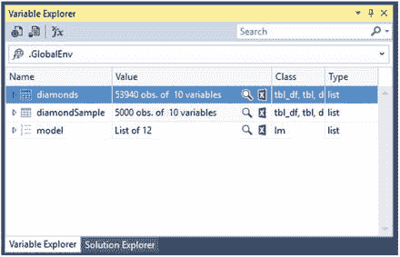
图 4-24. `model`数据集

第 166 行简单地写着`summary(model)`。请执行该行。现在 R 交互窗口中显示了很多信息。看一下图 4-25。

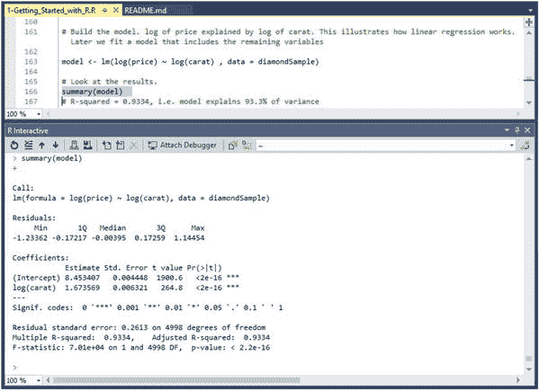
图 4-25. `summary(model)`信息

看看这个操作返回了什么。这里返回了很多关于模型的非常有用的信息，所以请理解，这是获取模型有意义的统计信息的绝佳位置。

继续看第 170 到 172 行，它们展示了以下代码：

```
coef(model)
coef(model)[1]
exp(coef(model)[1])
```

第 169 行说我们提取模型系数。现在让我们高亮这些行并执行它们。图 4-26 展示了你现在在 R 交互窗口中应该看到的内容。

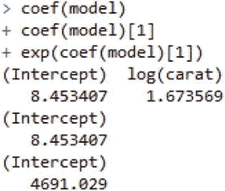
图 4-26. `model`系数

现在我们得到了系数，让我们看看第 175 到 179 行的下一段代码。这段代码定义如下：

```
ggplot(diamondSample, aes(x = carat, y = price)) +
geom_point(colour = "blue") +
geom_smooth(method = "lm", colour = "red", size = 2) +
scale_x_log10() +
scale_y_log10()
```

我们已经逐步讲解过这个命令的语法，但我看到有一行写着`geom_smooth(method = "lm", colour = "red", size = 2) +`，这是我们之前没有定义的。添加这行代码会给图表添加一条细的红色趋势线。现在高亮这些行并执行它们。图 4-27 展示了你应该看到的结果。

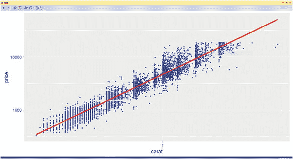
图 4-27. 图表结果

这是一张很有意义的图表！正如你所见，图表正变得越来越好，也越来越有趣。

### 回归诊断

接下来，往下看第 190 到 192 行。它们定义如下：

```
par(mfrow = c(2, 2))
plot(model, col = "blue")
par(mfrow = c(1, 1))
```

因此，在这个例子中，我们将绘图布局设置为生成一个 2×2 的图表网格，在模型数据集内显示绘制的信息，然后将绘图布局重置回 1×1 的网格。让我们进一步看看这些语句的语法。

-   `par`：此函数根据`mfrow()`参数指定的方式，将多个不同的图表组合成一个图表。
-   `mfrow = c(2, 2)`：此参数传入（行数 × 列数）的值，决定了网格在舞台上的布局方式。
-   `plot(model, col = "blue")`：此函数决定了要绘制什么（`model`）以及绘制数据点的颜色（`col`）。

你可以随意尝试这个或其他任何函数，感受一下语法的作用，以及你对函数所做的细微更改如何影响生成的输出。我通常发现这是学习函数的好方法，所以也许你也会喜欢这个方法。例如，将`col`的值改为蓝色或绿色，看看你的图表发生了什么变化。将`c()`的值改为`c(3, 3)`而不是`c(2, 2)`。注意图表是如何重新排列的。

**提示**
如果你遇到一个错误提示 `Error in plot.new(): figure margins too large`，请运行命令 `dev.off()` 和 `par(mar=c(1,1,1,1))` 来清除错误。可能需要运行多次以重置图形组件。非常感谢 Stack Overflow ([`http://stackoverflow.com`](http://stackoverflow.com/)) 提供的提示！

高亮第 190 到 192 行并执行它们。图 4-28 展示了你现在应该看到的内容。

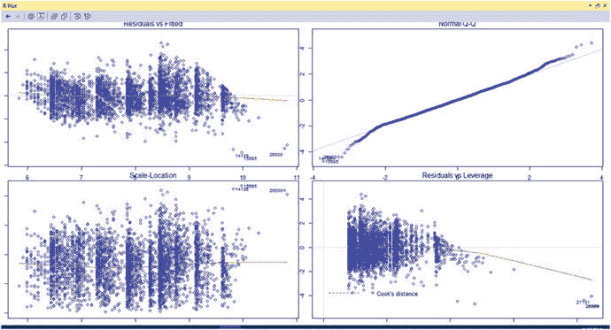
图 4-28. 多图表结果

看起来棒极了。注意到大多数数据点都相当接近红线了吗？这表明这个数据集相当可靠，并且没有包含大量离群值。


### 模型对象

第 198 行让我们查看 `model` 对象的结构。高亮并执行这一行。你会看到 R 交互窗口中出现一连串活动。图 4-29 显示了这些返回的数据。这是预料之中的，所以请回到 R 交互窗口，看看数据是如何返回的。

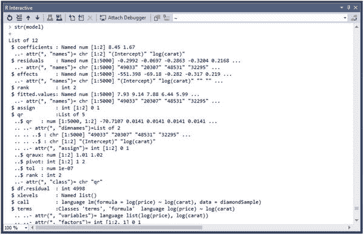
图 4-29. 返回的对象数据

请注意，返回的数据实际上相当难以理解，现在可能不太有意义。幸运的是，这只是我们查看 `model` 对象的一种方式。看看你的变量资源管理器窗口并展开 `model` 条目。图 4-30 显示了你现在应该看到的内容。

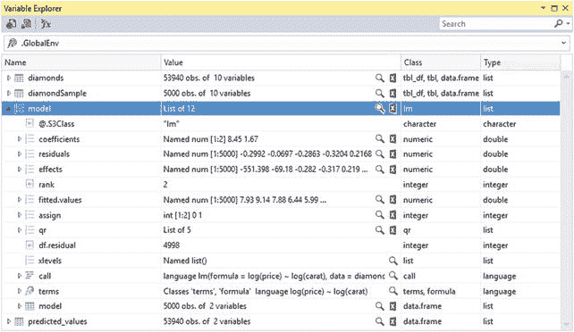
图 4-30. `model` 条目

请注意，`Name` 列中的条目与 R 交互窗口中美元符号旁边对齐的列相对应。如果你在变量资源管理器窗口中双击 `residuals` 列，左上角窗格中会打开另一个标题为 `R Data: $residuals` 的窗口。图 4-31 显示了这个窗口。

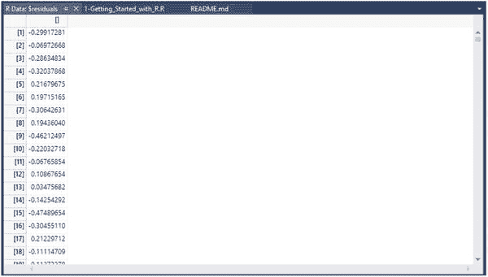
图 4-31. `R Data: $residuals` 窗口

此窗口包含构成数据集的数据。对于变量资源管理器的 Name 列中可以展开的任何列，都可以重复此过程。

接下来是第 199 行，简单地定义为 `model$coefficients`。这行代码基本上意味着我们希望查看 `model` 对象中的 `coefficients` 列。执行第 199 行。图 4-32 显示了你现在应该看到的内容。

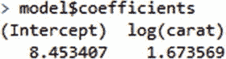
图 4-32. 以文本格式显示的 `coefficients`

因此，我们也可以通过在变量资源管理器中双击 `coefficients` 列来查看相同的数据，如图 4-33 所示。

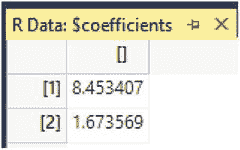
图 4-33. 以表格格式显示的 `coefficients`

所以，再次说明，有两种方法可以完成同一件事，并且我们已经验证了数据是正确的。

现在跳到第 202 行。这行代码是 `model <- lm(log(price) ∼ log(carat) + ., data = diamondSample)`，它与我们之前构建的模型密切相关，但这次我们声明了 `log(price) ∼ log(carat) + .`，这意味着我们希望用数据集中所有其他列对 `price` 列的对数进行建模。换句话说，这是真正的多元线性回归，而不是简单线性回归。

高亮第 202 行并执行它。请注意，变量资源管理器现在显示 `List of 13`，而之前显示的是 `List of 12`，这意味着我们已将 `model` 添加到列表中，它现在在数据集中可用。图 4-34 显示了此更新后的值。如果你愿意，可以随时双击 `model` 查看其中包含的数据。

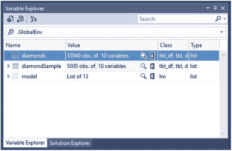
图 4-34. `model` 值增加

第 204 行显示了模型的摘要；因此高亮这一行并执行它。图 4-35 显示了此操作的结果。

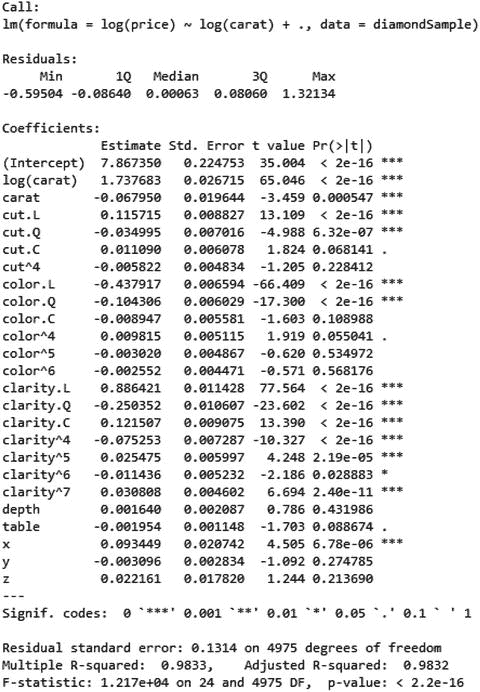
图 4-35. `summary(model)` 信息

这很重要（一个糟糕的双关语），因为 R 平方值是 98%，这意味着 98% 的数据与回归拟合紧密。不错！

第 211 到 214 行展示了我们如何创建一个数据框（`data.frame`），这是 R 在其模型中组织数据的方式。这些行定义如下：

```r
predicted_values <- data.frame(
actual = diamonds$price,
predicted = exp(predict(model, diamonds))
)
```

所以，让我们逐步分析，以了解这里的语法在做什么。

*   `predicted_values`: 保存命令结果的对象。
*   `data.frame`: R 处理结构化数据的方式；类似于表。
*   `actual = diamonds$price`: 将名为 `actual` 的列变量设置为 `diamonds` 数据集中 `price` 值所表示的值。
*   `predicted = exp(predict(model, diamonds))`: 将名为 `predicted` 的列变量设置为 `diamonds` 数据集中 `model` 线性模型预测值的指数值。

执行第 211 到 214 行。你会看到再次没有任何反应，这是预料之中的。再次查看你的变量资源管理器。你会看到现在有另一个名为 `predicted_values` 的数据集可用，这是我们刚刚添加的。图 4-36 显示了你现在应该看到的内容。

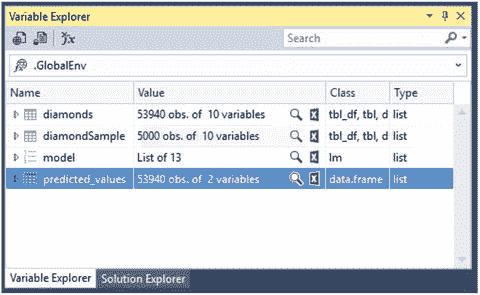
图 4-36. `predicted_values` 数据集

接下来是第 217 行，内容是 `head(predicted_values)`。我们之前见过这个，请回想一下 `head()` 命令允许我们查看数据的前六行。执行它。你应该看到如图 4-37 所示的内容。

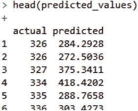
图 4-37. `head(predicted_values)`

接下来是重头戏。第 220 到 224 行包含 `ggplot` 命令，为我们绘制所有这些数据。到目前为止，我们已经用 `actual` 和 `predicted` 列布置好了 `data.frame` 对象。现在我们看到这些数据可视化后的样子。此命令的 R 代码定义如下：

```r
ggplot(predicted_values, aes(x = actual, y = predicted)) +
geom_point(colour = "blue", alpha = 0.01) +
geom_smooth(colour = "red") +
coord_equal(ylim = c(0, 20000)) +
ggtitle("Linear model of diamonds data")
```

我相当确定我们可以读懂并理解这个语法在说什么，但基本上，我们是对 `predicted_values` 数据集运行 `ggplot` 命令。我们使用美学值，将 x 轴设置为 `actual` 数据，y 轴设置为 `predicted` 数据。数据点是蓝色的，具有不同的 alpha（透明度），具体取决于数据值，配有一条红色趋势线，y 限制为 20000（强制比例），并带有一个标题。

图 4-38 显示了你执行第 220 到 224 行后应该看到的内容。

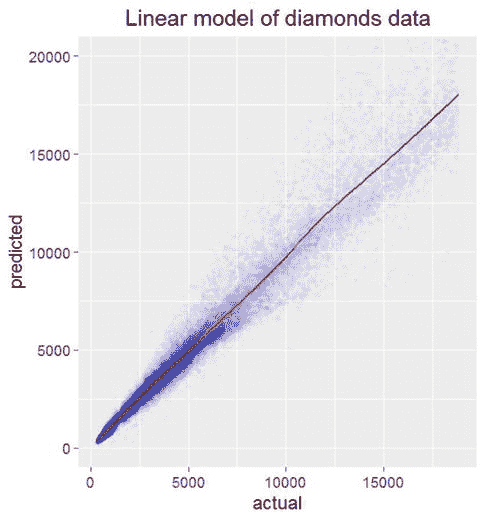
图 4-38. `predicted_values` 的 `ggplot` 图

这张图表真的非常有用，你不觉得吗？如果你毫无问题地走到了这一步，做得太棒了！你实际上已经学到了很多关于 R 语法的基础知识，并且已经看到了最常用的 R 绑定包 `ggplot2` 在实际中的应用。

### 总结

我们在本章中做了相当多的工作，包括构建数据模型并验证我们正在将数据返回到对象变量中。我们还研究了如何通过不同类型的图表对这些值进行绘图。接下来，我们将使用适用于 Visual Studio 的 R 工具（RTVS）深入研究 R 中更高级的绘图。

