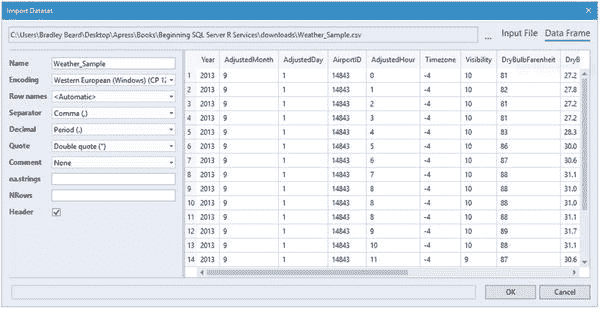
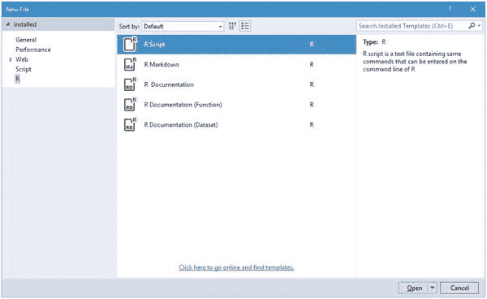
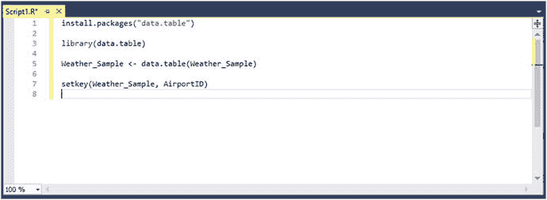
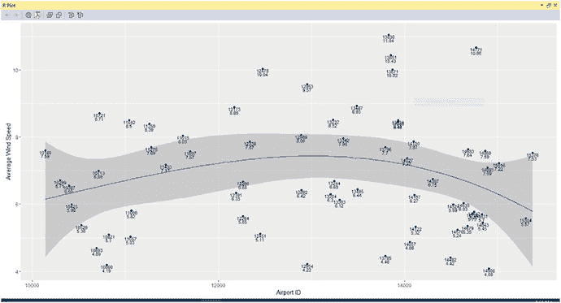
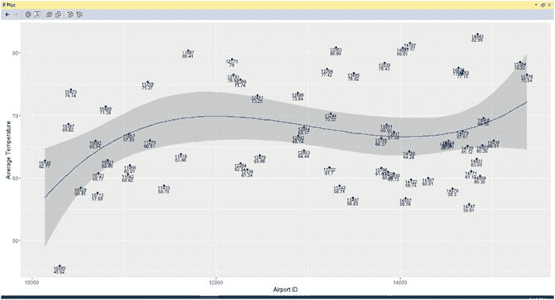

# 5. 在 RTVS 中绘图

接着我们在第 4 章结束的地方继续，我们可能已经对 R 足够熟悉，可以开始着手创建第 3 章中创建的软件需求文档中指定的报告。请理解，我绝不是在暗示我们是这门语言的专家。实际上恰恰相反。我们已经进展到足以理解一些基础知识，现在我们将通过继续前进来扩展这些知识，同时仍然认识到我们是在爬行而非行走。

让我们回顾一下我们的软件需求文档中承诺的报告。这些报告是：

*   每个 AirportID 的平均风速
*   每个 AirportID 的平均温度（°F）

考虑到这一点，让我们开始在适用于 Visual Studio 的 R 工具（RTVS）中规划解决方案，并看看是否能让它们正常工作。


### 报告 1：按机场 ID 计算平均风速

在第一部分中，我们将计算每个机场的平均风速。这可以通过为每个`AirportID`累加所有风速值，然后除以记录数来简单实现。R 通过一个名为`data.table`的核心功能为我们提供了快速实现方法。什么是`data.table`？这是一个免费提供的 R 包，拥有许多非常酷的方式来对大量数值数据进行切片和分块处理。如果你想轻松计算`mean`（平均值）、`sum`（总和）或几乎任何 R 内置函数，都需要`data.table`包。

打开适用于 Visual Studio 的 R 工具（RTVS）。你应该会看到如图 5-1 所示的界面。请注意，我们正在使用一个全新的 RTVS 实例，而不是使用之前章节的旧界面。

图 5-1. Visual Studio 的 R 工具

我们之所以在全新环境中工作，是因为我们正在导入数据集并处理这些数据。我不希望有任何机会使用错误的数据并可能导致不正确的结果。

#### 导入数据集

作为数据科学家，我们要做的第一件事就是收集数据。当你有一个文件位置或 URL 可以获取数据时，这听起来很容易。当你没有现成的数据，必须自己定义时，要确定数据就困难得多了。幸运的是，这次的情况并非如此，因为我们有一套完整的数据可以导入。

首先，请确保你已经解压了从第 4 章下载的文件`RTVS-docs-master`。在这个`.zip`文件中，导航到`RTVS-docs-master\examples\MRS_and_Machine_Learning\Datasets`目录。在这个目录中有一个名为`Weather_Sample.csv`的文件。这个文件是本例的数据源，所以你可以把它留在原地，或者复制到你电脑上另一个更容易记住的位置。

现在，RTVS 已启动并运行，我们依次点击 R Tools ➤ Data ➤ Import Dataset into R Session from Text File... 来将数据导入我们的环境。点击“Import Dataset into R Session from Text File”菜单选项后，会出现一个界面，提示你导航到要导入的文件。我们将使用`Weather_Sample.csv`，所以请导航到你保存该文件的位置，然后单击“打开”按钮。

你应该会看到如图 5-2 所示的内容。

图 5-2. 初始数据视图

相当令人印象深刻！我们可以看到导入了前 19 行数据，这可能是为了让我们对数据类型和长度有一个良好的样本量。

请注意，你可以点击右上角“Input File”和“Data Frame”之间，查看原始数据与格式化数据的对比。

查看完毕后，点击“确定”。然后你会看到如图 5-3 所示的内容。

图 5-3. 变量资源管理器

请注意，R 交互窗口也生成了以下代码：
```
`Weather_Sample` <- read.csv(file="C:/Users/Bradley Beard/AppData/Local/Temp/Weather_Sample.csv.utf8", header=TRUE, row.names=NULL, encoding="UTF-8", sep=",", dec=".", quote="\"", comment.char="")
```
这很有趣，因为它从 R 的角度向我们展示了数据是如何导入到当前工作项目中的。

#### 打开脚本窗格

现在我们已经加载了数据集，可以打开一个 Visual Studio 窗格来执行 R 脚本，以准备和分析我们的数据。关闭图 5-3 左上角窗格中显示的“起始页”。然后通过按`Ctrl+N`，点击左侧窗格中的“R”，并选择“R Script”来打开一个新的 R 脚本，如图 5-4 所示。

图 5-4. 新建 R 脚本

点击“打开”按钮以打开一个空白的脚本窗口。你现在应该有一个类似于图 5-5 所示的界面。

图 5-5. 准备工作！

现在我们的数据已正确加载，并且我们有了一个干净的工作界面，我们可以继续下一节了。

#### 准备数据集

到底如何准备数据集？它不是已经准备好了吗？嗯，是也不是：是的，因为数据本身已经是结构良好且有意义的，所以现在我们可以看到它真正想表达什么；不，因为它尚未准备好供 R 分析，因为它还是原始数据。我们需要先对数据做一些辅助处理，为分析做好准备。

要让数据准备好进行分析，请在你的`Script1.R`窗口中输入以下代码：
```
install.packages("data.table")
library(data.table)
Weather_Sample <- data.table(Weather_Sample)
setkey(Weather_Sample, AirportID)
```
图 5-6 显示了在输入我刚刚给出的代码后，你的 Visual Studio 窗口应有的样子。

图 5-6. 准备工作

现在，让我们来回顾一下这段代码实际在做什么。

*   `install.packages("data.table")`：这段代码只是安装`data.table`包。
*   `library(data.table)`：这段代码使`data.table`包在当前 R 会话中可用。
*   `Weather_Sample <- data.table(Weather_Sample)`：这段代码将一个名为`Weather_Sample`的空对象设置为`Weather_Sample`数据集的`data.table`表示形式。
*   `setkey(Weather_Sample, AirportID)`：这段代码允许按特定列进行分组。

现在我们理解了这里发生的事情，我们看到实际上没有提供分析的代码。你的这个概括是正确的，因为我们还没有真正开始分析，我们只是开始为分析准备数据集。这是重要的第一步，因为它有点像是我们下一步工作的基础，即创建作为软件需求文档一部分需要生成的报告。

执行我在图 5-6 中提供的代码行，显示`chron`包也随`data.table`一起被下载了。需要指出的是，任何请求下载的包的依赖包也总是会被一并下载。这消除了因包依赖关系而导致错误的可能性。如果你还没有执行那些代码行，请现在执行。


#### 按机场 ID 的平均风速（表格版）

我们即将处理的第一份报告是按机场 ID 的平均风速。该报告利用可用数据，计算每个机场的平均风速，然后在图表中显示这些数值。我们需要关注的列名为 `WindSpeed` 和 `AirportID`。我们知道，必须实例化一个对象来保存绘图数据，并且需要将数据作为 `data.frame` 返回给该对象，以便它能被正确地解读为图表。我们可以开始编写代码，如下所示：

```
avg_windspeed_by_ID <- as.data.frame(Weather_Sample)
```

**提示**

在 `data.frame` 声明前使用 `as` 关键字，表示我们希望强制将引用的数据集作为数据框返回。

这段代码尚未完全实现我们的需求，因为我们还没有计算 `WindSpeed` 列的 `mean()`（均值）。为此，我们需要更新代码如下：

```
avg_windspeed_by_ID <- as.data.frame(Weather_Sample[, mean(WindSpeed)])
```

这段代码看起来更接近我们需要的了，但它还不完整。如果数据中存在空行怎么办？这肯定会影响我们的输出，所以让我们通过更新代码来移除这些值：

```
avg_windspeed_by_ID <- as.data.frame(Weather_Sample[, mean(WindSpeed, na.rm = TRUE)])
```

现在我们可以看到，`na.rm = TRUE` 会移除数据集中的“缺失”值。

最后，我们在末尾添加一个排序列。请记住，这与我们之前调用的 `setkey()` 函数不同，因为 `setkey()` 函数是对数据进行分组。要按某一列对数据进行排序，请将代码更新为如下形式：

```
avg_windspeed_by_ID <- as.data.frame(Weather_Sample[, mean(WindSpeed, na.rm = TRUE), by = AirportID])
```

现在，高亮显示我们刚写完的命令，然后按 `Ctrl+Enter`。之后，键入 `avg_windspeed_by_ID`，高亮显示你刚写的内容，再按 `Ctrl+Enter` 来执行它。此时，你应该在 R 交互窗口中看到以下输出：

```
> avg_windspeed_by_ID
AirportID        V1
1      10140  7.594268
2      10299  6.708183
3      10397  6.554401
4      10423  5-991983
5      10529  5-377292
6      10693  4.686593
7      10713  6.993095
8      10721  8.713368
9      10800  4.193095
10     10821  5-095719
```

注意，我向上滚动到了返回数据的顶部，以显示 66 行中的前 10 条结果。以下是生成此结果的完整脚本：

```
install.packages("data.table")
library(data.table)
Weather_Sample <- data.table(Weather_Sample)
setkey(Weather_Sample, AirportID)
avg_windspeed_by_ID <- as.data.frame(Weather_Sample[, mean(WindSpeed, na.rm = TRUE), by = AirportID])
avg_windspeed_by_ID
```

将你的脚本保存为 `avgWindspeedByAirportID.tabular.R`。这是我们即将生成的报告的第一部分。

#### 按机场 ID 的平均风速（图表版）

接下来，打开一个新的 R 脚本窗口。在那个新窗口中，你需要输入以下代码：

```
library(data.table)
Weather_Sample <- data.table(Weather_Sample)
chart_by_ID <- as.data.frame(Weather_Sample[, mean(WindSpeed, na.rm = TRUE), by = AirportID])
library(ggplot2)
ggplot(chart_by_ID, aes(x = AirportID, y = V1)) + geom_point(stat = "identity") + geom_smooth(method = "lm", formula = y ∼ splines::bs(x, 3)) + scale_x_continuous(name = "Airport ID") + scale_y_continuous(name = "Average Wind Speed") +
geom_text(aes(label = AirportID), size = 3, vjust = 1.0) +
geom_text(aes(label = round(V1, digits = 2)), size = 3, vjust = 2.0)
```

在我们继续之前，先来看一下这段代码。

- `Weather_Sample <- data.table(Weather_Sample)`：我们使用 `Weather_Sample` 作为对象变量名，然后用数据集 `Weather_Sample`（如引用所示）中包含的数据的 `data.table` 表示形式来填充该对象。换句话说，有一个对数据的引用，用于创建分析。
- `chart_by_ID <- as.data.frame(Weather_Sample[, mean(WindSpeed, na.rm = TRUE), by = AirportID])`：首先，像之前一样，我们将变量名设为 `chart_by_ID`。然后，我们将这个变量设置为数据集中 `WindSpeed` 列的均值（`na.rm=TRUE` 表示移除 N/A 值）按 `AirportID` 分组后的数据框等价物。这合理吗？理解这个语句的结构至关重要，这样你才能回头基于这些数据创建自定义报告。如果你还没明白，请继续看下去，直到理解为止。
- `library(ggplot2)`：这个命令使新安装的 `ggplot2` 包对该项目可用。
- `ggplot(chart_by_ID, aes(x = AirportID, y = V1)) + geom_point(stat = "identity") + geom_smooth(method = "lm", formula = y ∼ splines::bs(x, 3)) + scale_x_continuous(name = "Airport ID") + scale_y_continuous(name = "Wind Speed") + geom_text(aes(label = AirportID), size = 3, vjust = 1.0) + geom_text(aes(label = round(V1, digits = 2)), size = 3, vjust = 2.0)`：这是一个很长的命令。这是一个控制图表外观和渲染的巨大命令。这个语句的各个部分是：
    - `ggplot(`：这是绘图函数。
    - `chart_by_ID,`：将 Weather_Sample 的 data.frame 输入到这个变量中。
    - `aes(x = AirportID, y = V1)) +`：`aes` 是 ggplot2 的美学定义。它表示 x 轴（水平）显示 AirportID，y 轴（垂直）显示 V1，在这里指的是平均风速。
    - `geom_point(stat = "identity") +`：`geom_point()` 函数让你定义如何定义图上的点。在这里，我们希望它们显示为恒等（identity）。
    - `geom_smooth(method = "lm", formula = y ∼ splines::bs(x, 3)) +`：这让我们可以向图表添加一个条件均值（平滑线）。
    - `scale_x_continuous(name = "Airport ID") +`：这让我们可以连续缩放 x 轴。
    - `scale_y_continuous(name = "Wind Speed") +`：这让我们可以连续缩放 y 轴。
    - `geom_text(aes(label = AirportID), size = 3 , vjust = 1.0) +`：这让我们可以标注并偏移 x 轴标签。
    - `geom_text(aes(label = round(V1, digits = 2)), size = 3 , vjust = 1.0)`：这让我们可以标注并偏移 y 轴标签。

请注意，有些行的末尾有一个加号。这算作一个连续的字符；换句话说，该语句在下一行继续，而不是一个单独的语句。

一旦你全部输入完毕，按 `Ctrl+A` 全选，然后按 `Ctrl+Enter` 运行。然后你会看到如图 5-7 所示的内容。


图 5-7. 绘制的信息

因此，我们在 x 轴上放置了机场 ID，在 y 轴上放置了平均风速。将该脚本保存为 `avgWindspeedByAirportID.plot.R`。

到目前为止非常棒！这完成了第一份报告的基础部分，所以让我们继续处理第二份。

### 报告 2：按机场 ID 的平均温度（°F）

我们的下一个任务是报告按机场 ID 的平均温度。所涉及的代码与“按机场 ID 的平均风速”报告非常相似，所以你应该能轻松跟上。

我们将分两步处理我们的任务。首先计算平均温度值。然后在图中绘制它们。这与我们创建第一份报告的方式完全相同。


#### 按机场 ID 计算平均温度（表格形式）

请注意，数据仍然已加载并可供我们使用，因此我们可以跳过数据加载的步骤，直接开始计算平均温度。以下是实现此操作的代码：

```
install.packages("data.table")
library(data.table)
Weather_Sample <- data.table(Weather_Sample)
setkey(Weather_Sample, AirportID)
avg_temperature_by_ID <- as.data.frame(Weather_Sample[, mean(DryBulbFarenheit, na.rm = TRUE), by = AirportID])
avg_temperature_by_ID
```

输入上述代码，按下 `Ctrl+A` 全选，然后按下 `Ctrl+Enter` 执行。此时，你的 R 交互窗口应显示以下信息：

```
AirportID       V1
1      10140 62.76688
2      10299 45-91877
3      10397 68.61980
4      10423 74.13576
5      10529 58.44648
6      10693 65-93558
7      10713 57.59134
8      10721 60.77466
9      10800 71.38043
10     10821 62.85850
```

以上是你应看到的前 10 行数据。
如果向下滚动，你会看到全部 66 行数据都已返回。现在将此脚本保存为 `avgTemperatureByAirportID.tabular.R`。

#### 按机场 ID 计算平均温度（绘图形式）

我们已有所需的数据，现在将其绘制成图表吧。此绘图的代码基于之前的绘图代码，我们先来看一下那段代码：

```
Weather_Sample <- data.table(Weather_Sample)
chart_by_ID <- as.data.frame(Weather_Sample[, mean(DryBulbFarenheit, na.rm = TRUE), by = AirportID])
install.packages("ggplot2")
library(ggplot2)
ggplot(chart_by_ID, aes(x = AirportID, y = V1)) + geom_point(stat = "identity") + geom_smooth(method = "lm", formula = y ∼ splines::bs(x, 3)) + scale_x_continuous(name = "Airport ID") + scale_y_continuous(name = "Average Temperature") +
geom_text(aes(label = AirportID), size = 3, vjust = 1.0) +
geom_text(aes(label = round(V1, digits = 2)), size = 3, vjust = 2.0)
```

这段代码看起来应该很眼熟。我只将 `chart_by_ID` 部分中的 `WindSpeed` 文本改为了 `DryBulbFarenheit`，并将 `scale_y_continuous` 的名称从 `Average Wind Speed` 改为了 `Average Temperature`。
将此代码输入到 RTVS 后，按下 `Ctrl+A` 全选，然后按下 `Ctrl+Enter` 执行。图 5-8 展示了此时你应该看到的内容。



图 5-8. 绘制的数据

太好了！这向我们展示了数据——甚至还附带了一条移动平均线，以增加可读性。
将此脚本保存为 `avgTemperatureByAirportID.plot.R`。以下是你应该已保存的四个文件：
*   `avgTemperatureByAirportID.plot.R`
*   `avgTemperatureByAirportID.tabular.R`
*   `avgWindspeedByAirportID.plot.R`
*   `avgWindspeedByAirportID.tabular.R`

### 本章小结

让我们快速回顾一下本章内容。我们实际上做了很多工作。你应该对自己和日益增长的 R 知识感到相当满意。我们完成的工作如下：
*   学习了 R 中绘图的基础知识
*   将外部数据源 (`Weather_Sample.csv`) 加载到 Visual Studio 中
*   根据软件需求文档，基于此数据编写了自定义的 R 脚本
*   基于此数据生成了表格数据和图表

下一章将介绍这些报表交付的 Reporting Services 方面。

