# 第三部分
创建与查看报表

## 6. 配置 SQL Server Reporting Services

回想一下，在第 1 章中，我们在初始 SQL Server 安装过程中安装了 Reporting Services。安装 Reporting Services 时，我们选择了“安装并配置”选项。现在，我们需要配置已安装的 Reporting Services 实例。请记住，在 SQL Server 安装时选择“安装并配置”选项时，Reporting Services 就已经安装、配置好（并且可以运行）了。本章的目的是让你熟悉 Reporting Services 配置管理器中可用的选项，以便如果你需要在自己的安装中更改某个设置，你将拥有如何做出所需更改以及从何处寻找解决方案的知识和信心。
首先，我们将运行 Reporting Services 配置管理器并连接到新安装的实例，然后我们将了解一些可用的配置选项。

### 连接到实例

转到 Windows“开始”菜单。Reporting Services 配置管理器应显示在“最近添加”框中。如果不在那里，请打开 Windows“开始”菜单，单击“所有应用”，然后向下滚动到 Microsoft SQL Server 2016。它应该在该文件夹内。如果还是没有，只需开始键入 Reporting Services，它就会弹出。单击它继续。然后你将看到图 6-1 所示的内容。

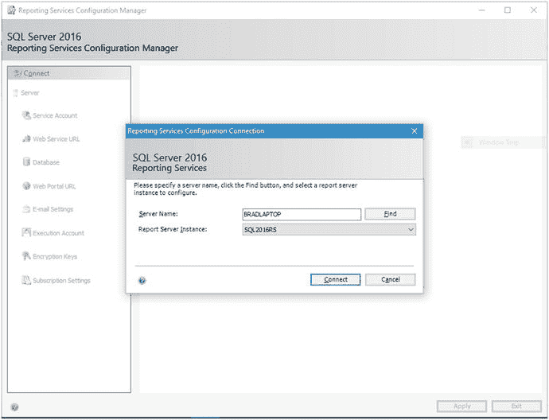

图 6-1. Reporting Services 配置连接

单击此处的“连接”按钮以连接到你的实例。然后你将看到图 6-2 所示的主页配置页面。

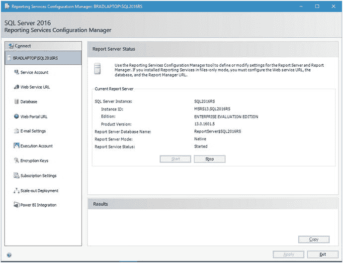

图 6-2. 报表服务器状态

这个主页配置页面（这是我个人的称呼）告诉你有关 Reporting Services 实例的一般信息。最重要的是，请注意服务已启动。否则我们将无法继续。
在继续之前，让我们快速浏览一下这个界面。我将在以下小节中介绍各个区域，然后我们将返回去更新字段，以便我们的报表服务器能够成功启动和运行。

### 服务帐户

“服务帐户”区域中的设置实际上可以保持默认值不变。如果你更改了图 6-3 所示的“使用内置帐户”选项，默认设置是“虚拟服务帐户”。这是在安装 Reporting Services 时创建的一个帐户，用于连接到报表服务器。你也可以选择“本地系统”、“本地服务”或“网络服务”。我建议不要这样做，因为这些帐户具有运行报表服务器所不需要的提升权限。

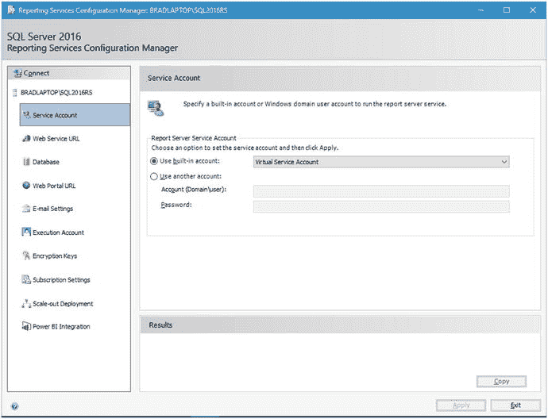

图 6-3. 服务帐户

如果你愿意，也可以指定另一个域帐户来与此服务交互。这是许多专业人士的选择，因为他们可以定制用户帐户以特定于此应用程序的此实例。如果你选择此方法，请继续将此帐户的用户名和密码放入相应的框中。
请记住，如果你选择自定义服务帐户，出于安全目的并遵守公司策略，该指定帐户很可能需要由你组织中的服务器或域管理员审核。根据我的经验，最好让服务器或域管理员提供一个服务帐户列表，这些帐户可用于数据库或应用服务器中所需的各种目的。

### Web 服务 URL

图 6-4 显示，此区域允许你配置一个 URL，Reporting Server 生成的报表将通过此 URL 生成并提供给授权用户。此区域已经设置好，除非你想为虚拟目录指定一个不同的名称。如果是这种情况，请继续执行此操作。

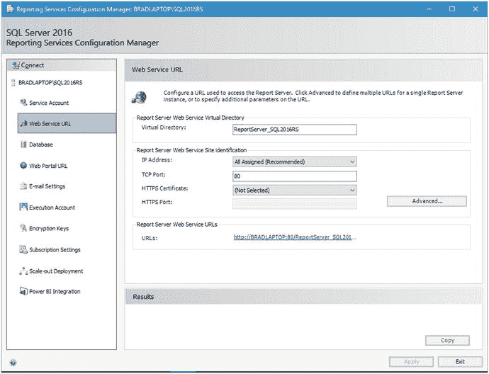

图 6-4. Web 服务 URL

请注意，系统已为你预填充了默认值。
我建议添加的唯一设置是 HTTPS 证书选项。如果你恰好有一个 SSL 证书，并且希望通过 HTTPS 端口 443 运行，请确保在此处提供该证书。

### 数据库

图 6-5 显示了此区域，您可以在其中配置报表服务器将要连接以获取数据的数据库。

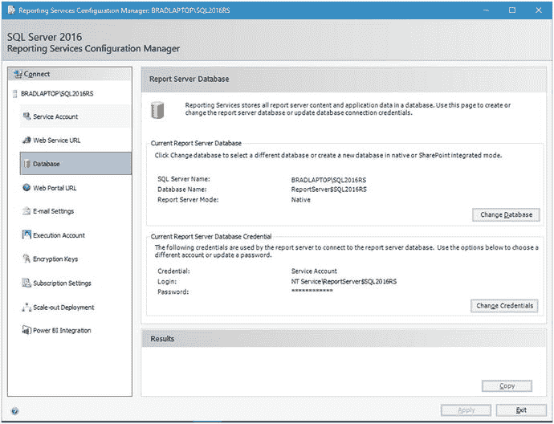

图 6-5. 数据库

请注意，`当前报表服务器数据库`选项也已填写。这表示托管 SQL Server Reporting Services 数据库的数据库服务器。当我们在第 1 章中选择`安装并配置`选项时，Microsoft 已为我们完成了此操作。

接下来，我们设置要将报表服务器指向的数据库。这意味着，报表服务器默认情况下会查看这个特定的数据库。显然，这可以通过单独的安装和报表服务器实例进行更改，但就目前而言，我们只坚持使用这一个，因为这有点超出了本书的范围。这也意味着，除了 Reporting Services 数据库之外的其他数据库也可以用作数据源。

### Web 门户 URL

注意到我们屏幕上现在有一个超链接，内容为 `http://BRADLAPTOP:80/Reports_SQL2016RS` 吗？如果您对这个默认 URL 感到满意，那么此区域的一切就都没问题。图 6-6 显示了此区域，您可以在其中定义用于访问 Web 门户的自定义 URL，以防您对默认值不满意。我建议您不要更改`虚拟目录`值，因为默认值运行良好，并且这只是出于评估目的。

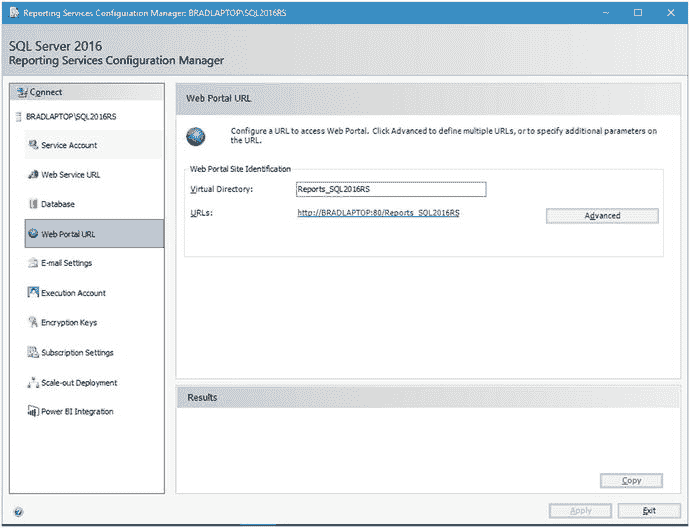

图 6-6. Web 门户 URL

请注意，在定义此区域之前，必须先定义`Web 服务 URL`（本章前面已讨论过）。

### 电子邮件设置

图 6-7 显示了此区域，您可以在其中指定电子邮件设置。显然，如果您想发送附带报表的电子邮件，这将非常有用。默认值未被选中。您必须自己填写这些选项。

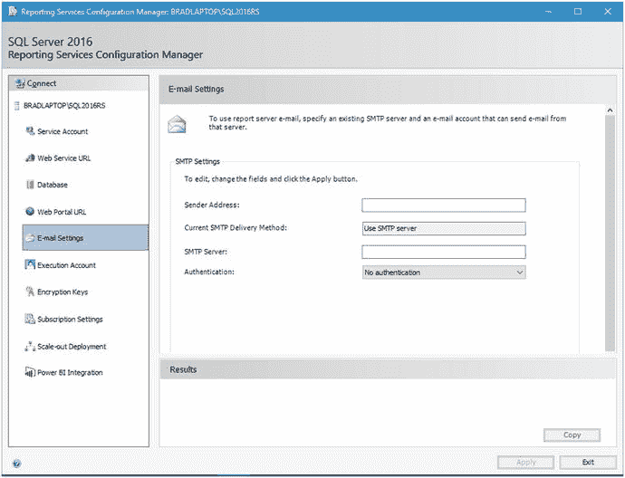

图 6-7. 电子邮件设置

如图 6-8 所示，我提供了如何填写所示字段的一般格式。

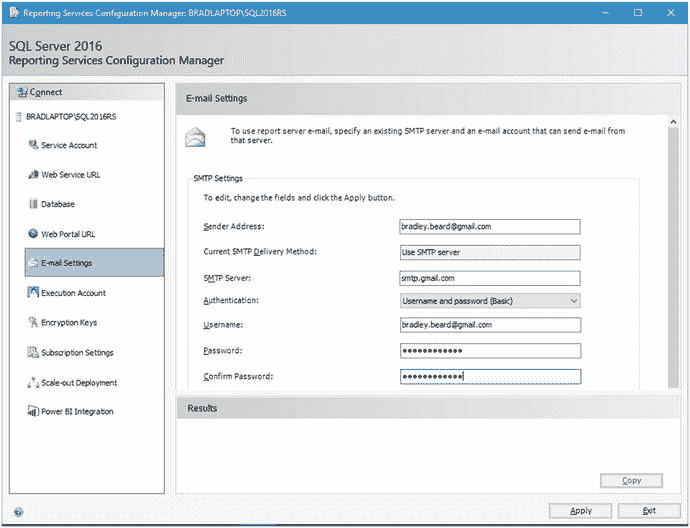

图 6-8. 电子邮件设置（已更新）

更新设置后，单击`应用`进行保存。

注意

显然，您的设置将与此处显示的不同。

### 执行账户

图 6-9 显示了此区域，您可以在其中指定一个执行账户。

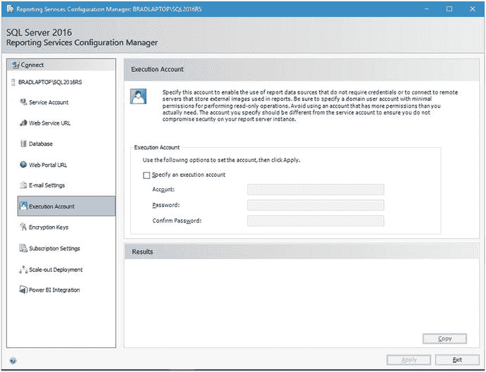

图 6-9. 执行账户

对于本书，我们无需担心执行账户，因此现在只需绕过此部分。

### 加密密钥

图 6-10 显示了此区域，您可以在其中备份、还原、更改或删除加密密钥。

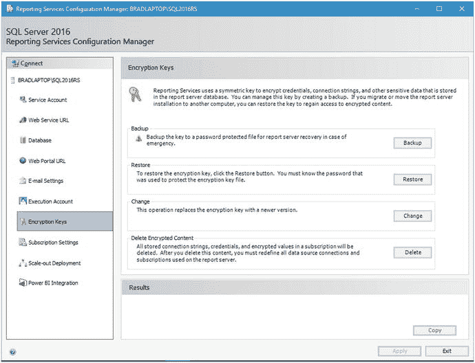

图 6-10. 加密密钥

我强烈建议您立即备份加密密钥。没有这些密钥，您将无法解密任何加密的数据库。定期备份密钥并将其安全存储至关重要。

### 订阅设置

图 6-11 显示了此区域，您可以在其中配置一个账户，供远程用户访问您可用的文件共享订阅。请注意，当不允许电子邮件传递时，文件共享订阅是必需的。

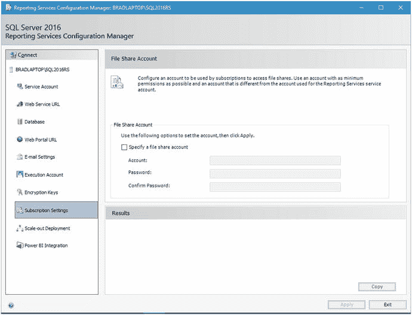

图 6-11. 订阅设置

由于此部署严格用于测试，我们可以忽略此区域。

### 横向扩展部署

图 6-12 显示了此区域，您可以在其中查看有关横向扩展部署的信息。横向扩展部署本质上是一个负载均衡模型，它提高了服务器集群中的可伸缩性。随着 Reporting Services 实例的更多用户消耗资源，负载可以共享到另一个与原始服务器共享相同加密数据的服务器。目前，`横向扩展部署`选项仅在生产实例的企业版中可用。

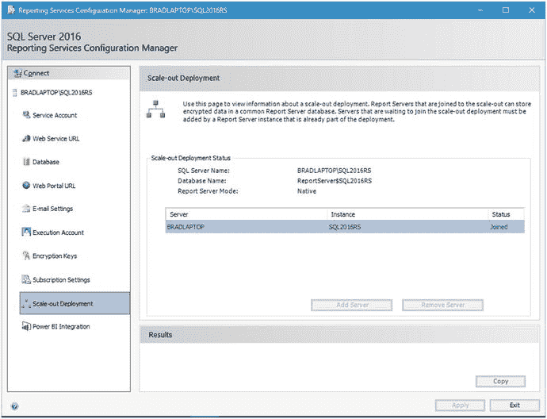

图 6-12. 横向扩展部署

### Power BI 集成

图 6-13 显示了此区域，您可以在其中一键设置与 Power BI 的集成。遗憾的是，Power BI 超出了本书的范围，因此请将这些设置保留为默认值。

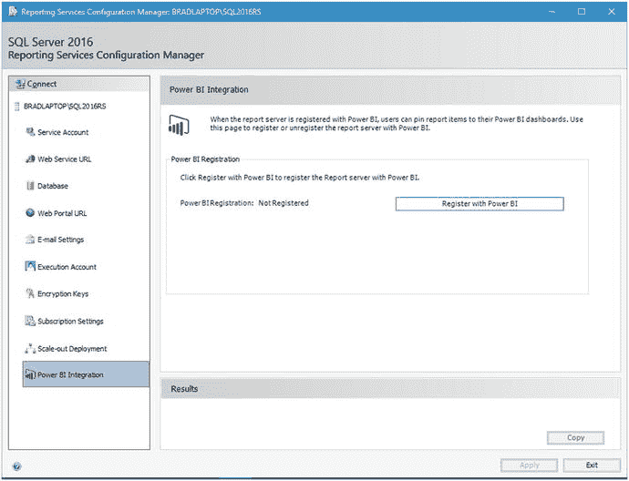

图 6-13. Power BI 集成

首先，Power BI 可以直接集成到 Reporting Services 中——而且只需一键操作——这有多酷？

现在，回到 Web 门户 URL 页面，单击页面上显示的超链接。此超链接的位置如图 6-14 所示。

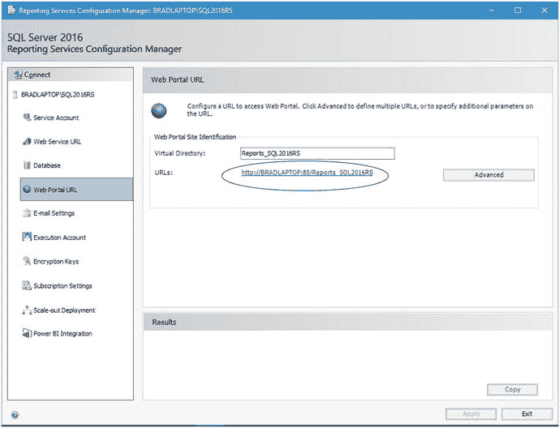

图 6-14. 超链接位置

单击超链接后，您应该看到如图 6-15 所示的内容。

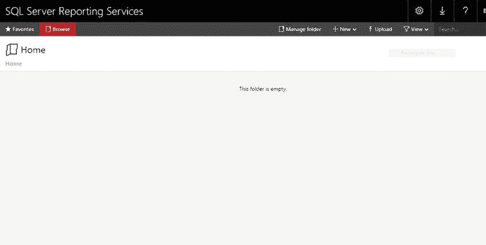

图 6-15. 初始报表界面

如果您看到的不是这个屏幕，那么您的 SQL Server Reporting Services 安装或配置出现了问题。有时，根据您当前使用的操作系统和浏览器设置，您可能会收到错误屏幕。在这种情况下，您可能需要以本地管理员身份运行浏览器实例（如果您在本地计算机上运行）。好消息是，您可能不需要卸载所有内容。如果此时出现错误，建议查看 `Reporting Services 错误日志`。

### 总结

现在是停下来稍作喘息的好时机。在过去的几页中，我们实际上已经做了很多工作，让我们来回顾一下。

*   已验证 Reporting Services 是否正确安装
*   配置了新安装的 Reporting Services
*   已验证 Web 门户是否按预期工作

请注意，Web 门户中尚无任何内容。这是可以预料的，因为这是一个全新的安装，而且我们还没有开始编写报表。

在下一章中，我们将安装和配置 Report Builder，我们使用它来创建消耗 R 数据以供我们报表中使用的报表。配置一个账户供订阅用来访问文件共享。使用一个具有尽可能最低权限的账户，并且该账户不同于用于 Reporting Services 服务账户的账户。

