# 7. Report Builder 安装与数据准备

既然我们已经安装了 `SQL Server Reporting Services`，接下来需要弄清楚如何根据软件需求文档中客户的要求创建并交付报表。创建报表的最佳方式很可能是使用 `Report Builder`，这是微软提供的一个免费下载工具。而交付报表的最佳方式，显然就是使用 `SQL Server Reporting Services` 的内置功能，正如我们在第 6 章中配置的那样。

请记住，如果客户只需要扁平文件报表（即仅包含数据的文件，如 `CSV` 或 `XML` 格式），我们完全可以通过从 `SQL Server` 直接导出数据来实现，丝毫不需要 `SQL Server Reporting Services` 的参与。但本练习的真正目的是展示 `R` 与 `SQL Server` 集成后的强大功能；因此，我们将使用 `Report Builder`，把第 5 章中创建的图表整合到一份外观精美的报表中。之后，我们可以处理诸如格式调整之类的细节，但最重要的部分是确保报表能够首先成功构建。

### 下载 Report Builder

本章开始，我们需要下载 `Report Builder`。下载链接在 [`https://www.microsoft.com/en-us/download/details.aspx?id=52674`](https://www.microsoft.com/en-us/download/details.aspx?id=52674)，但这个链接可能会有变化。记住，`Google` 是你的好帮手。

**提示**：你也可以从第 6 章末尾看到的 `SQL Server Reporting Services` Web 门户中下载 `Report Builder`，只需点击右上角的下箭头即可。

图 7-1 展示了可以下载 `Report Builder` 的页面。请注意，此界面未来可能会变化，但 `下载` 按钮应该会保持清晰可见。

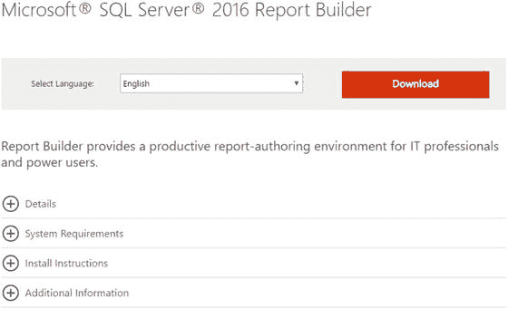

图 7-1. Report Builder 下载界面

点击按钮进行下载。你应该会看到如图 7-2 所示的内容。

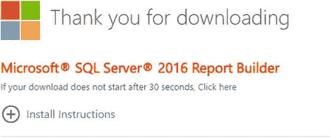

图 7-2. 下载进行中

一个名为 `ReportBuilder3.msi` 的文件正在后台下载。下载完成后，你应该可以在浏览器栏中点击它来开始安装。如果在这里没有看到已下载的文件，只需转到你的“下载”文件夹并按日期排序，该文件就会出现在那里。

图 7-3 显示了安装程序显示的第一个屏幕。

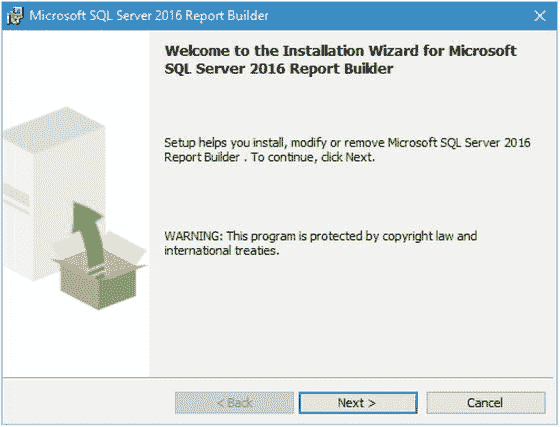

图 7-3. Microsoft SQL Server 2016 Report Builder 安装

显然，我们点击 `下一步` 继续，进入图 7-4 所示的许可条款页面。

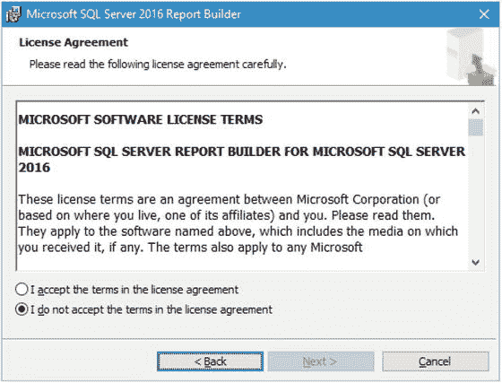

图 7-4. 许可协议

点击 `我接受许可协议中的条款` 单选按钮，然后点击 `下一步`。

接下来，我们选择要安装的功能。图 7-5 显示了默认的功能选择屏幕。

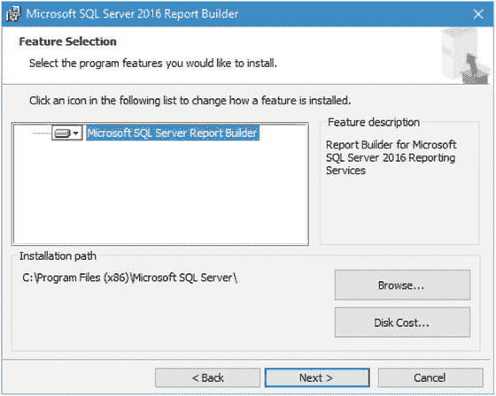

图 7-5. 功能选择

我们为此要安装所有功能，因此在白色区域的磁盘上拉下菜单。选择 `整个功能将安装在本地硬盘驱动器上` 继续。

图 7-6 显示了此处的正确选择。

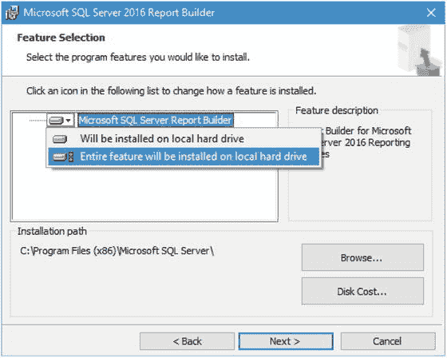

图 7-6. 正确选择

这确保我们拥有 `Report Builder` 绝对所有可能需要的内容。准备就绪后，点击 `下一步` 继续。

现在，界面会要求我们输入 `默认目标服务器`，如图 7-7 所示。

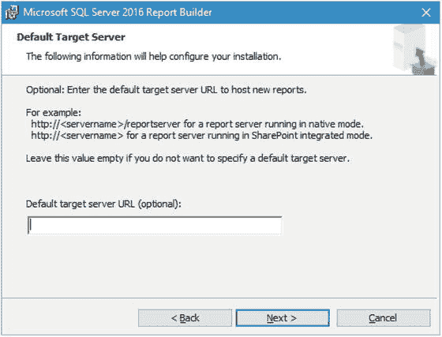

图 7-7. 默认目标服务器

需要输入到 `默认目标服务器 URL（可选）` 框中的值，是我们在第 6 章中配置的 `Reporting Services 配置管理器` 的 `Web 服务 URL` 部分的值，在我的例子中是 `http://bradlaptop/ReportServer_SQL2016RS`，所以请在框中输入你自己的具体 URL。你看到的应该与图 7-8 所示类似。

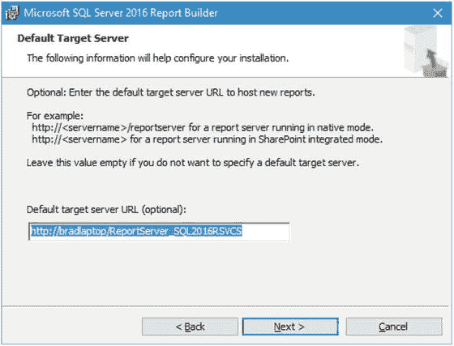

图 7-8. 已更新的默认目标服务器

准备好继续后，点击 `下一步`。然后会显示图 7-9，表明我们已准备好安装。

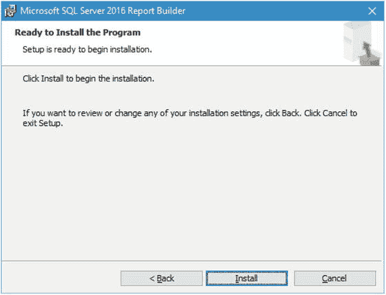

图 7-9. 准备安装

如果需要做任何更改，请点击 `上一步` 进行修改；否则，点击 `安装`。

`Report Builder` 是一个相当小的安装程序，因此加载得相当快。图 7-10 显示了此时你应看到的安装完成屏幕。

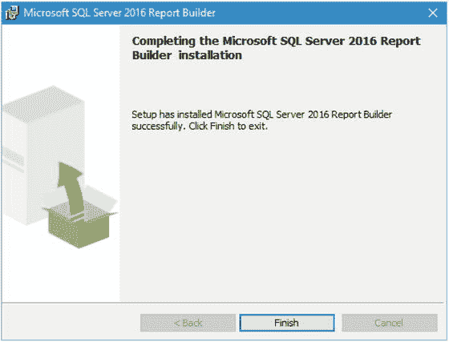

图 7-10. 安装完成

点击 `完成`，大功告成。既然我们已经安装了 `Report Builder`，请在开始菜单中点击 `Report Builder`。最初你应该看到如图 7-11 所示的内容。

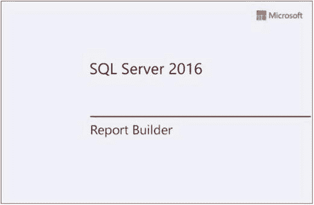

图 7-11. Report Builder 启动画面

最终，界面加载完成，我们看到 `Report Builder` 正在对之前指定的 `SQL2016RS` 实例进行身份验证。如图 7-12 所示。

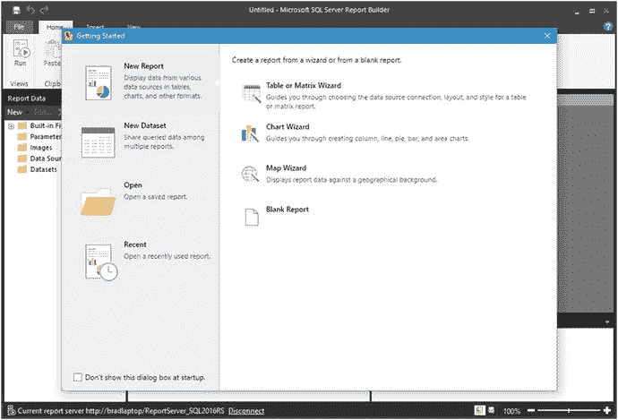

图 7-12. Report Builder 登录界面

加载需要一点时间，因为它必须对安装过程中指定的报表服务器进行身份验证。快速看一下初始登录界面的左下角。我在图 7-13 中将其放大显示，以便我们看清楚。


图 7-13. 报表服务器详情

这个快速参考区域立即告诉我们连接到的是哪个实例。它让我们有机会断开与此实例的连接，然后可以重新连接同一个实例，或者，如果我们愿意，也可以连接到另一个 `SQL Server Reporting Services` 实例。


### 设置新数据库和表

现在一切准备就绪，让我们先做一些温习工作。

回顾第 5 章，我们创建了几个需要交付给客户的报告。这些报告基于`Weather_Sample.csv`数据。稍后，我们将把这些数据导入 SQL Server 并进行处理。不过，首先让我们粗略看一下这些数据。

在继续之前，让我们先设置一些数据库基础设施。我们需要新建一个数据库，然后创建一个表作为该数据的数据源。

在`SSMS`中，右键单击`数据库`并选择`新建数据库`选项。将出现一个允许创建新数据库的屏幕。如图 7-14 所示的`新建数据库`屏幕左窗格中，初始选项卡名为`常规`。请在此屏幕中进行如下更改。

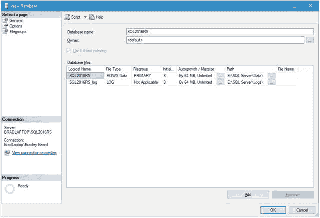

图 7-14. 新建数据库

完成后点击`确定`按钮。名为`SQL2016RS`的新数据库即被创建。

接下来，打开一个新的`查询`窗口，将活动数据库更改为`SQL2016RS`，然后输入以下内容：

```sql
CREATE TABLE [dbo].[chartBinary] (
[uid] int identity(1,1) PRIMARY KEY,
[title] varchar(100) NULL,
[binData] varbinary(max) NULL
)
```

按`F5`执行该代码——瞧！我们的表就创建好了。图 7-15 显示了这个表。

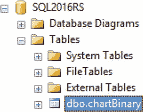

图 7-15. chartBinary 表

现在我们有了一个存储二进制数据和图表标题的表。接下来，我们需要生成实际的二进制数据。虽然我知道有办法将这些二进制数据直接提取到 Reporting Services 中，但我认为理解数据如何与`报表服务器`协作以获取生成的二进制数据并创建图表是很重要的。通过这种方式，你肯定能比有些人偏好的点击方法学到更多关于图表创建过程的知识。

回顾第 5 章，我们是如何将`Weather_Sample.csv`文件导入界面然后生成图表的。完成该操作的代码如下：

```r
Weather_Sample <- read.csv(file="C:/Users/Bradley Beard/AppData/Local/Temp/Weather_Sample.csv.utf8", header=TRUE, row.names=NULL, encoding="UTF-8", sep=",", dec=".", quote="\"", comment.char="")
```

我不再指向`Temp`目录，而是将之前下载的`.zip`文件中的`Weather_Sample.csv`文件复制出来，直接放在`C:`盘根目录下，纯粹是为了让文件路径更短。这是更新后的代码：

```r
Weather_Sample <- read.csv(file="C:\\Weather_Sample.csv", header=TRUE, row.names=NULL,
encoding="UTF-8", sep=",", dec=".", quote="\"", comment.char="")
```

请注意，我将单反斜杠改为了双反斜杠，以转义`\W`命令。当存在转义字符时，`R`会报错，因此请确保已将所有单反斜杠转换为双反斜杠。

那么，我假设我们可以将这段代码放入存储过程中，并让数据可用。这个假设正确吗？事实证明……是的！

考虑以下代码。

```sql
exec sp_execute_external_script
@language =N'R',
@script=N'Weather_Sample <- read.csv(file="C:\\Weather_Sample.csv",
header=TRUE, row.names=NULL, encoding="UTF-8", sep=",", dec=".", quote="\"", comment.char="");
print(unique(Weather_Sample$AirportID) );'
```

将其分解来看，我们可以看到`@script`属性包含一个声明，将`Weather_Sample`定义为对位于`C:\Weather_Sample.csv`的`CSV`文件执行`read()`操作的结果，该操作包含`header`信息，不含`row.names`，编码为`UTF-8`，以逗号分隔，根据需要包含小数点，并处理了转义引号和注释。然后，我们只是打印`Weather_Sample`数据集中`AirportID`列的唯一值。在`SSMS`中输入该代码。代码执行后的情况如图 7-16 所示。

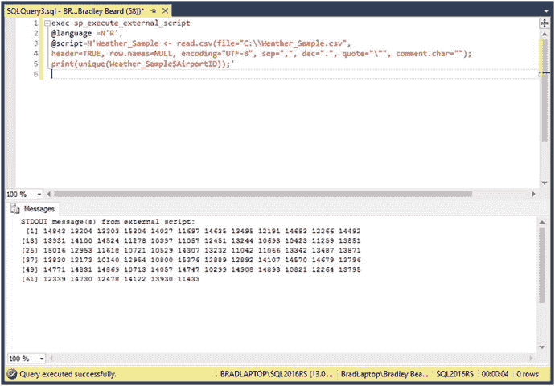

图 7-16. 脚本执行

这些是数据中唯一的`机场` `ID`。我们也可以对任何其他你想要的列执行此操作。`AdjustedDay`列怎么样？只需将最后一部分从`AirportID`改为`AdjustedDay`即可。你的代码应如下所示。

```sql
exec sp_execute_external_script
@language =N'R',
@script=N'Weather_Sample <- read.csv(file="C:\\Weather_Sample.csv",
header=TRUE, row.names=NULL, encoding="UTF-8", sep=",", dec=".", quote="\"", comment.char="");
print(unique(Weather_Sample$AdjustedDay));'
```

在`SSMS`中运行它。你应该看到如图 7-17 所示的结果。

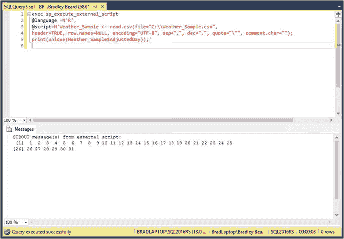

图 7-17. AdjustedDay 脚本

因此，这实际上表明，我们可以将现有的`CSV`格式数据用作本地报告的一部分。回想一下我之前提到的，我们将把此数据添加到`SQL Server`中；那么现在就开始吧。


### 导入天气数据

我们的目标相当简单：导入数据集以便进行处理。这次的技巧在于，我们将直接把它导入 SQL Server，作为一个名为 `Weather_Sample` 的表。为此，我们需要展开 SQL Server Management Studio，直到在 `SQL2016RS` 数据库中看到 "表" 菜单，如图 7-18 所示。

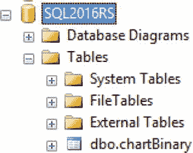
*图 7-18. 表位置*

右键单击 `SQL2016RS` 并选择 **任务** ➤ **导入数据**。这将打开 `SQL Server 导入和导出向导` 窗口。如果你经常处理手动数据操作，可能对此非常熟悉。如图 7-19 所示。

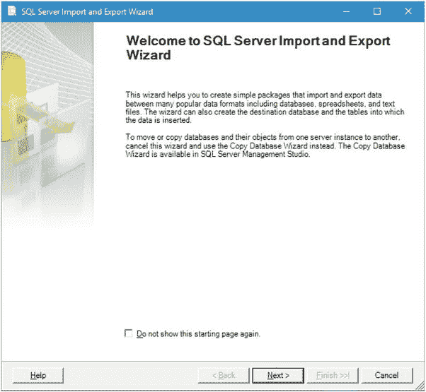
*图 7-19. 导入/导出数据初始屏幕*

在此处点击 **下一步**。你将看到如图 7-20 所示的内容。

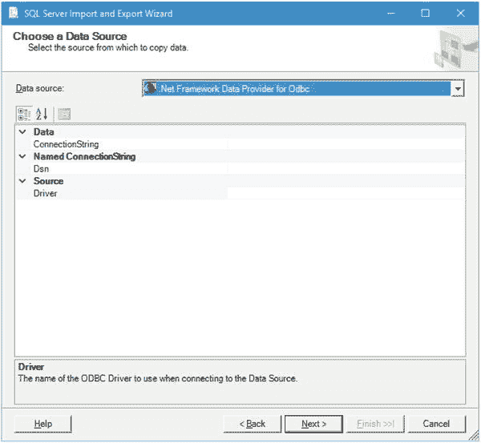
*图 7-20. 选择数据源*

拉下顶部的 **数据源** 菜单并选择 **平面文件源**。然后你会看到如图 7-21 所示的界面，其中显示了此屏幕的默认值。

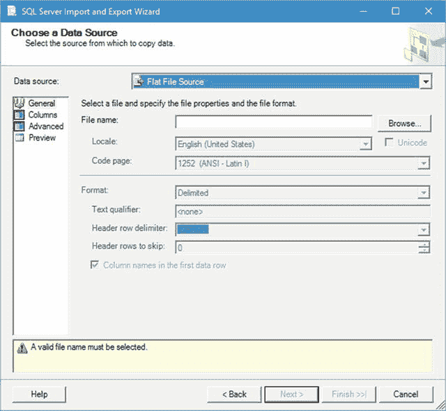
*图 7-21. 平面文件源的默认值*

点击 **浏览...** 按钮，导航到你保存 `Weather_Sample.csv` 文件的位置。你需要拉下文件类型菜单，并将所选选项更改为搜索 `.csv` 文件，以便找到我们要找的文件。找到 `Weather_Sample.csv` 文件后，点击 **打开** 按钮，界面将根据所选文件填充信息。我的示例如图 7-22 所示。

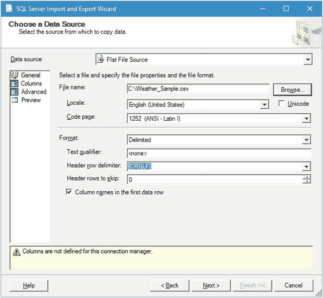
*图 7-22. 已填充的值*

请注意，SQL Server 自动获取了这些列的值，因此它知道数据类型和格式。

注意到下方的黄色警告了吗？点击左上角的 **列** 选项卡，然后再点击一次 **常规** 选项卡。图 7-23 显示了我执行此操作后的情况。

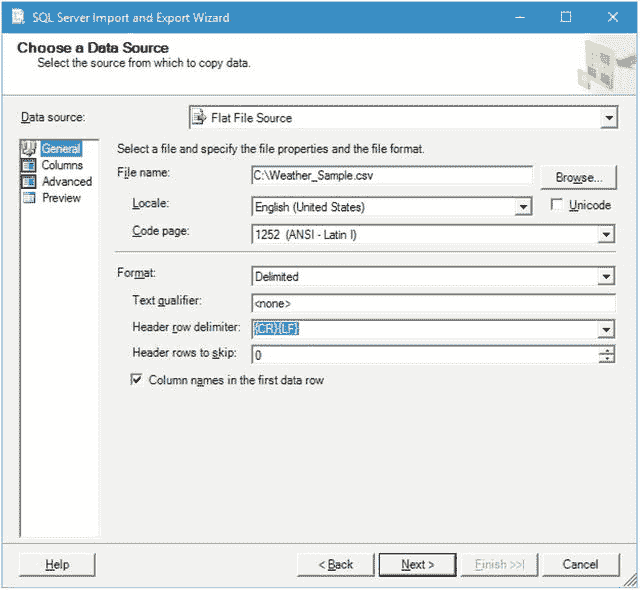
*图 7-23. 消失的警告*

没什么大不了的，执行此操作只是让那个警告消失了，因为一旦选择了 "列" 部分，列就被映射了。其他一切都相同，但我猜界面需要刷新一下。无论如何，这个屏幕已经准备就绪，所以点击 **下一步**。图 7-24 显示了你接下来将看到的内容。

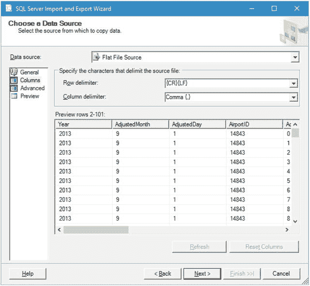
*图 7-24. 字符分隔符部分*

此部分允许你在需要时选择文件的分隔符。我们不需要分隔符，因为默认设置即可正常工作，所以直接点击 **下一步**。

现在我们来到可以选择目标文件的屏幕，如图 7-25 所示。

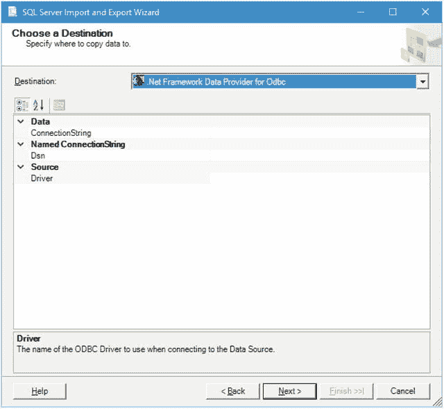
*图 7-25. 目标位置*

我们希望在此处将 **目标** 更改为 `SQL Server Native Client 11.0`。这样做的原因是我们不通过其他目标类型（.Net 和 OLE DB）进行连接。这是本机客户端。进行此更改。你应该看到如图 7-26 所示的内容。

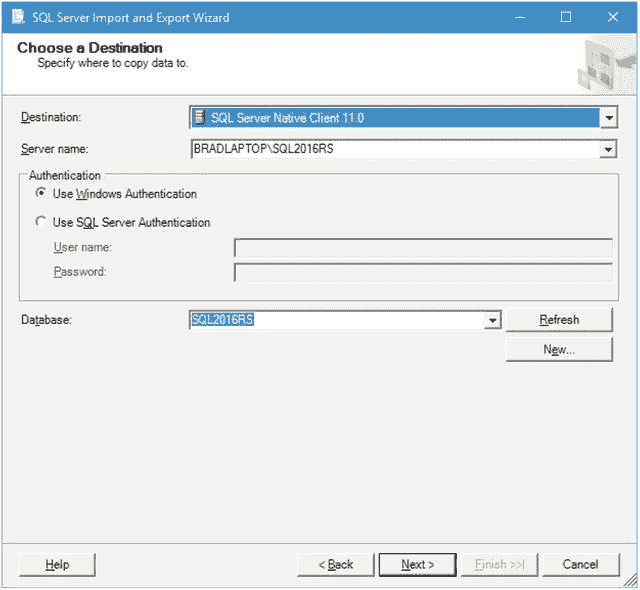
*图 7-26. 更新后的目标*

我们希望保留这些默认值，因此在此屏幕点击 **下一步**。你将看到如图 7-27 所示的源和目标信息。

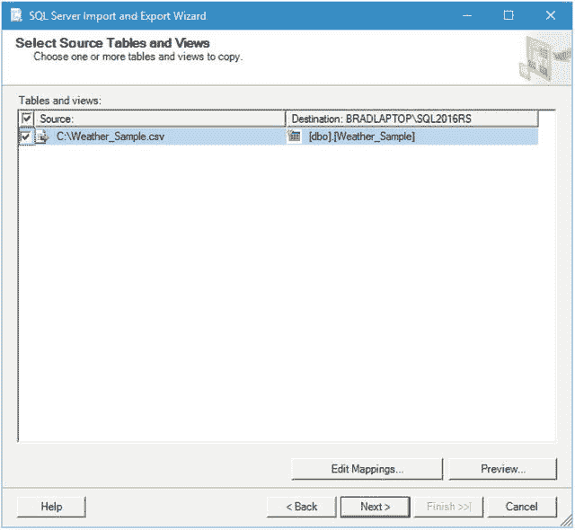
*图 7-27. 源和目标信息*

这基本上表示，我们将左边 **源** 列中表示的数据放入右边的目标位置。

源指向我们最初下载的 `Weather_Sample.csv` 文件。

目标指向我们的数据库命名实例。表由 `[dbo].[Weather_Sample]` 指定。

点击 **下一步** 查看图 7-28 所示的 **保存并运行** 选项。

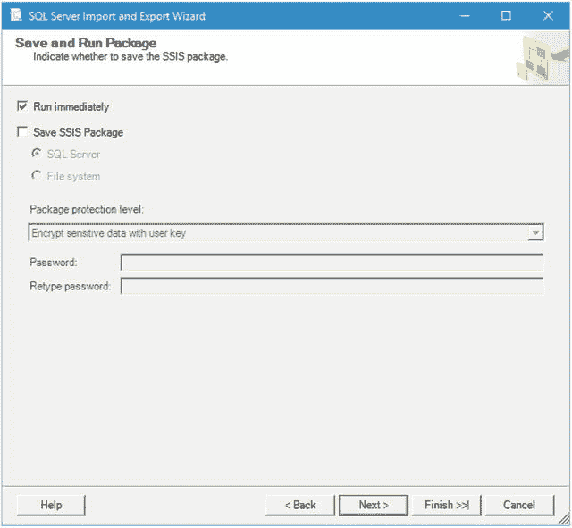
*图 7-28. 保存并运行*

看到此界面时，直接点击 **完成**。然后会显示一个屏幕，快速回顾我们将要执行的操作，如图 7-29 所示。继续在此处也点击 **完成**。

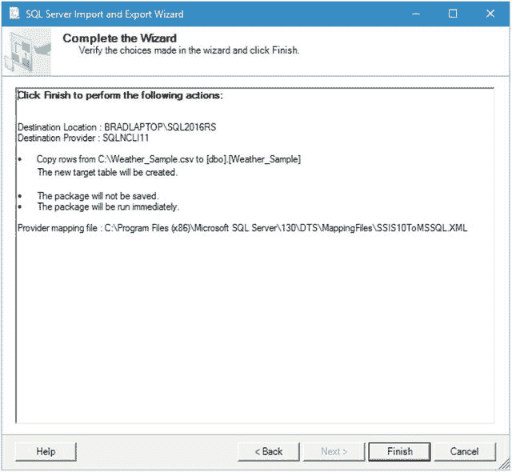
*图 7-29. 完成向导*

安装过程会运行几秒钟，但最终，你将看到如图 7-30 所示的内容。

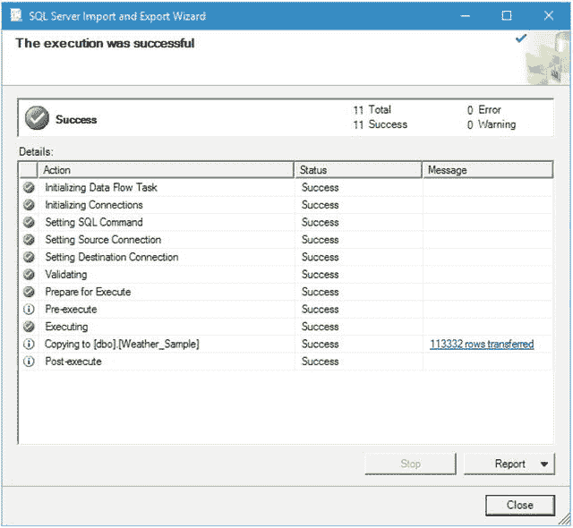
*图 7-30. 导入成功*

继续点击 **关闭**。我们现在已经将外部数据作为内部数据导入到 SQL Server 中。别担心，我们还没有偏离轨道。我们很快就会生成那个二进制数据，但首先得完成这些准备工作。

回想一下，之前我们是通过机场 ID 获取平均风速的。在 SQL 中，既然我们已将数据存入数据库，查询看起来像这样：

```sql
SELECT AirportID, AVG(CONVERT(float, WindSpeed)) as WindSpeed
FROM [Weather_Sample]
GROUP BY AirportID
ORDER BY AirportID
```

将其键入一个新的查询窗口，然后按 **F5** 执行代码。你应该会看到如图 7-31 所示的内容。

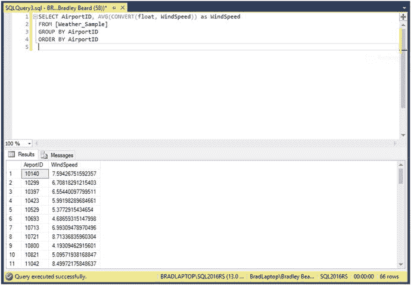
*图 7-31. 查询执行*

太好了！这向我们展示了数据已在正确的表中，并且我们可以正常查询它。这对于即将生成图表数据至关重要。


### 生成二进制数据

接下来，我们需要弄清楚需要使用哪种存储过程语法来获取我们所需图表的二进制数据。借鉴我们之前创建图表时所做的大量工作，我们可以推断其语法可能与以下内容相似。

```
EXEC sp_execute_external_script
@language = N'R',
@script = N'
library("ggplot2");
img <- inputDataSet;
image_file = tempfile();
png(filename = image_file, width=800, height=600);
print(ggplot(img, aes(x = AirportID, y = WindSpeed)) +
labs(x = "Airport ID", y = "Wind Speed") +
theme(axis.text.x = element_text(angle=90, hjust=1, vjust=0)) +
geom_point(stat = "identity") +
geom_smooth(method = "loess", aes(group = 1)) +
geom_text(aes(label = AirportID), size = 3, vjust = 1.0) +
geom_text(aes(label = round(WindSpeed, digits = 2)), size = 3, vjust = 2.0));
dev.off();
OutputDataset <- data.frame(data=readBin(file(image_file,"rb"),what=raw(),n=1e6));',
@input_data_1 = N'SELECT AirportID, AVG(CONVERT(float, WindSpeed)) as WindSpeed FROM [Weather_Sample] GROUP BY AirportID ORDER BY AirportID;',
@input_data_1_name = N'inputDataSet',
@output_data_1_name = N'OutputDataset'
WITH RESULT SETS ((plot varbinary(max)));
```

注意：我们这里生成的是 `PNG` 图像，而不是 `JPG`。这一点在后续使用 Report Builder 动态生成这些图表时很重要。

将此代码输入一个新的查询窗口并执行，会得到一个二进制数据结果。图 7-32 展示了此时你应在 SSMS 中看到的内容。

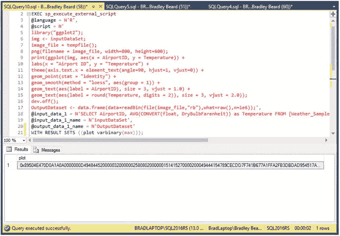

图 7-32. 二进制数据

回顾一下，我们已经创建了一个表来存储图表。现在，我们将通过在存储过程中使用以下代码，将这个二进制数据插入到表中。现在，我们只需要重写存储过程来自动插入数据。知道怎么做吗？没错，我们将使用 `INSERT INTO ... EXEC`。

那么如何构建查询呢？实际上非常简单。我相信你们中的一些人已经知道如何操作，但对于还不清楚的人来说，它看起来是这样的：

```
INSERT INTO chartBinary (binData)
EXEC sp_execute_external_script
@language = N'R',
@script = N'
library("ggplot2");
img <- inputDataSet;
image_file = tempfile();
png(filename = image_file, width=800, height=600);
print(ggplot(img, aes(x = AirportID, y = WindSpeed)) +
labs(x = "Airport ID", y = "Wind Speed") +
theme(axis.text.x = element_text(angle=90, hjust=1, vjust=0)) +
geom_point(stat = "identity") +
geom_smooth(method = "loess", aes(group = 1)) +
geom_text(aes(label = AirportID), size = 3, vjust = 1.0) +
geom_text(aes(label = round(WindSpeed, digits = 2)), size = 3, vjust = 2.0));
dev.off();
OutputDataset <- data.frame(data=readBin(file(image_file,"rb"),what=raw(),n=1e6));',
@input_data_1 = N'SELECT AirportID, AVG(CONVERT(float, WindSpeed)) as WindSpeed FROM [Weather_Sample] GROUP BY AirportID ORDER BY AirportID;',
@input_data_1_name = N'inputDataSet',
@output_data_1_name = N'OutputDataset';
```

这更新了我们的 `binData` 列，但 `title` 列没有赋值。由于这是表中的第一条记录，`UID` 被设置为 1；因此请确保你的 `WHERE` 子句指定了这一点。要为此图表更新 `title` 值，在运行第一个查询后，运行此 `UPDATE` 查询。

```
UPDATE chartBinary
SET title = '按机场 ID 分组的平均风速'
WHERE uid = 1
```

这样应该就可以了。要验证，请运行以下查询来查看你的数据。

```
SELECT title, binData FROM [dbo].[chartBinary] ORDER BY uid
```

结果应如图 7-33 所示。

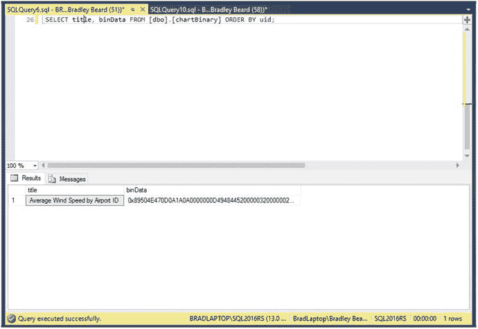

图 7-33. 查询结果

接下来，我们需要为另一个报表构建查询，但这实际上相当简单，因为我们已经完成了大部分困难的工作。以下是完成此操作所需的代码。

```
INSERT INTO chartBinary (binData)
EXEC sp_execute_external_script
@language = N'R',
@script = N'
library("ggplot2");
img <- inputDataSet;
image_file = tempfile();
png(filename = image_file, width=800, height=600);
print(ggplot(img, aes(x = AirportID, y = Temperature)) +
labs(x = "Airport ID", y = "Temperature") +
theme(axis.text.x = element_text(angle=90, hjust=1, vjust=0)) +
geom_point(stat = "identity") +
geom_smooth(method = "loess", aes(group = 1)) +
geom_text(aes(label = AirportID), size = 3, vjust = 1.0) +
geom_text(aes(label = round(Temperature, digits = 2)), size = 3, vjust = 2.0));
dev.off();
OutputDataset <- data.frame(data=readBin(file(image_file,"rb"),what=raw(),n=1e6));',
@input_data_1 = N'SELECT AirportID, AVG(CONVERT(float, DryBulbFarenheit)) as Temperature FROM [Weather_Sample] GROUP BY AirportID ORDER BY AirportID;',
@input_data_1_name = N'inputDataSet',
@output_data_1_name = N'OutputDataset';
```

同样，设置 `title` 列：

```
UPDATE chartBinary
SET title = '按机场 ID 分组的平均温度'
WHERE uid = 2
```

运行那两个代码块，然后运行以下查询来检查并确保所有数据都已正确插入。

```
SELECT title, binData FROM [dbo].[chartBinary] ORDER BY uid
```

此时，你应该看到如图 7-34 所示的内容。

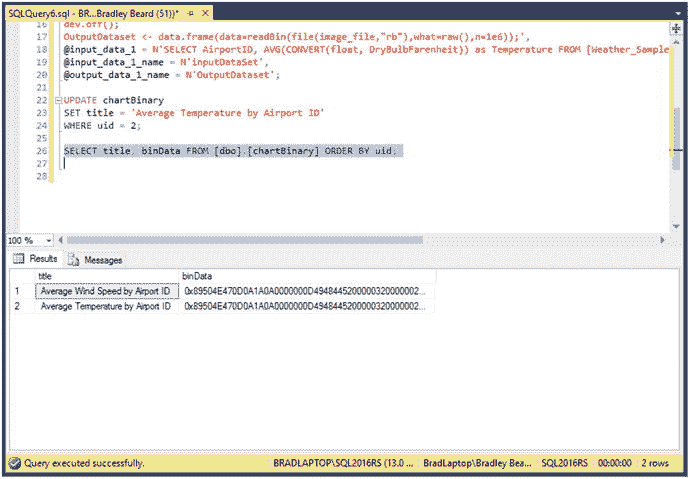

图 7-34. 查询结果

搞定！两个结果，正如我们所愿。现在这些数据已经正确加载到表中，我们可以开始构建要交付给客户的报表了。别忘了定期对照软件需求文档来验证我们的进度。

### 总结

让我们回顾一下本章所做的事情，因为内容确实不少。

*   下载并安装了 Report Builder。
*   将天气数据加载到了 SQL Server 中。
*   基于这些天气数据生成作为二进制数据的图表。

看起来似乎不多，但其实挺多的。请务必仔细阅读本章内容，因为在下一章中，如果没有这个二进制数据，你将无法取得太大进展。

接下来，我们将把所有这些整合起来，构建成要交付给客户实际报表。如果你在本章过程中没有感到头疼，那你可能做错了。说真的，需要消化的信息量非常大。我强烈建议你回过头去重新阅读在 SQL Server 中生成二进制数据的步骤。特别是 `ggplot2` 函数的各个属性，实际上非常有趣。你可以按照你能想到的几乎任何方式自定义图表。互联网上甚至有关于如何创建你自己的 `R` 包以供私人使用或分发的信息。

我们快完成了！坚持下去——我们很快就要大功告成了。如果你已经走到了这一步，我祝贺你，并鼓励你再坚持一小会儿。我保证这一切都是值得的！


