# 第 8 章 使用报表生成器构建报表

至此，我们在本书中已经处理了大量信息。我们执行了 SQL Server R Services 的新安装、安装了 Visual Studio 的 R Tools、配置了 Reporting Services，并安装和配置了 Report Builder。我们对 R 及其工作原理有了相当多的了解，并且总体上获得了许多编写代码的经验。如果你能读到这里，做得很好！这确实是比较高级的内容，因为它基本上是全新的功能。可以相当肯定地假设，R 将在未来的 SQL Server 版本中继续作为一部分提供，所以最好现在就开始熟悉它，而不必以后再应对学习曲线。

在本章中，我们将使用在第 7 章中创建的二进制数据来创建一个报表。这些二进制数据将被动态转换为图像。这听起来相当复杂，但幸运的是，Report Builder 实际上让这变得相当容易。

以下是我们在本章中要做的事情：

*   构建“按机场 ID 的平均风速”报表。
*   构建“按机场 ID 的平均温度”报表。

我们只做两件事？没错。与其他更深入的章节相比，本章内容相对简短。因此，本章比其他章节短得多，但希望你仍然能发现这些信息有用。

### 报表 1：按机场 ID 的平均风速

回想一下，软件需求文档明确要求了客户想要的两份报表。第一份报表就是“按机场 ID 的平均风速”报表。这份特定的报表对客户很重要，因此我们将花点时间进行设置，然后使用相同的格式来创建我们的第二份报表。请记住，一旦编写了第一份报表，创建任何后续报表确实会快得多，因为我们已经对如何操作有了大致的了解。从那时起，我们真正需要做的只是将任何特定格式应用于报表，忽略图像本身，因为图像是使用预编译的二进制数据从数据库生成的。

首先，启动 `Report Builder` 并以 `Administrator` 身份运行。初始界面如图 8-1 所示。

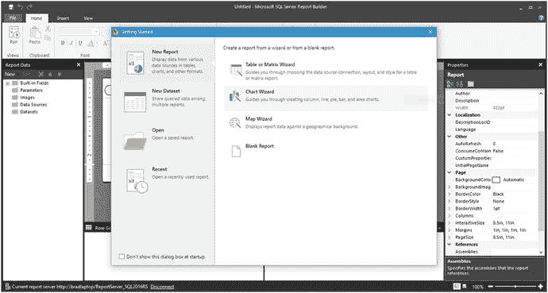

图 8-1. Report Builder 初始界面

回想一下，我们已经逐步介绍了此界面的功能，所以让我们直接开始吧。

#### 设置报表布局

单击“开始使用”屏幕底部的 `空白报表`。重叠窗口应消失，剩下如图 8-2 所示的内容。

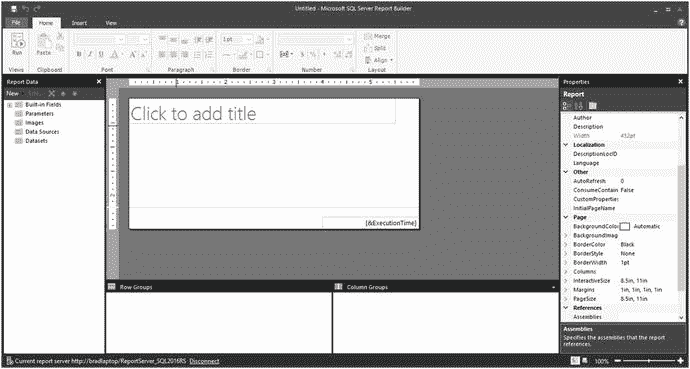

图 8-2. 空白报表

单击标有 `单击以添加标题` 的框内部，并键入 `按机场 ID 的平均风速`。然后将该框拉伸到文本的高度和宽度。之后，使用屏幕顶部的控件将文本居中。图 8-3 显示了你的报表现在应该的样子。

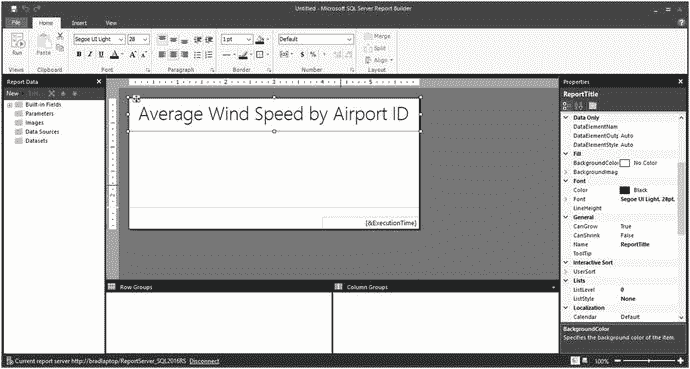

图 8-3. 标题的基本格式

接下来，我们只想对报表主体做一些非常基本的格式设置，因此在报表中间部分的任意位置右键单击，然后选择 `主体属性`。此选项的位置如图 8-4 所示。

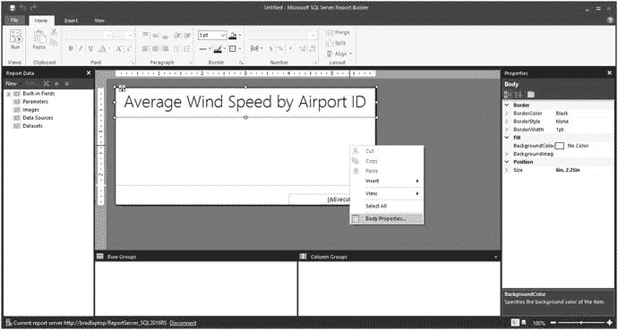

图 8-4. 选项位置

选择该选项会打开另一个屏幕，如图 8-5 所示。

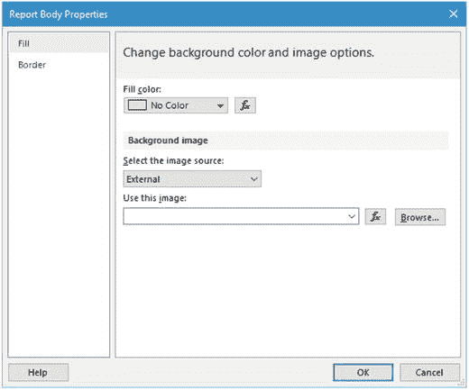

图 8-5. 报表主体属性

现在，我们不希望有填充颜色，除了纯白色，但如果你想尝试一下，请便。我们也不想要背景图像，所以暂时保持空白。就像我说的，如果你想改变这一点，请便。这是你的报表！

单击左侧的 `边框` 选项；你应该会看到如图 8-6 所示的内容。

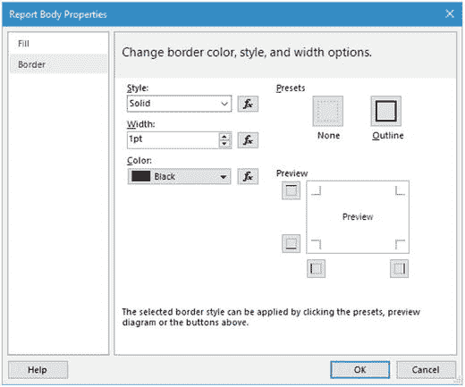

图 8-6. 边框属性

只需单击右上角的 `轮廓` 选项，然后单击 `确定`。该屏幕关闭。在页面上你可能看不到边框，但它确实存在。当你预览报表时，你就会看到它。


#### 数据配置

现在我们需要设置数据源和数据集。这两者难道不是一回事吗？在这个上下文中，数据源（连接到数据库中的数据）为数据集（对数据源的查询）提供数据，这与处理这些概念的其他许多例子很相似。

没有数据源就无法拥有数据集，而没有数据集的数据源也是无用的。

首先，我们必须设置数据源。为此，在屏幕左侧右键单击 `Data Sources` 选项，然后选择 `Add Data Source…`。图 8-7 显示了此菜单选项的位置。

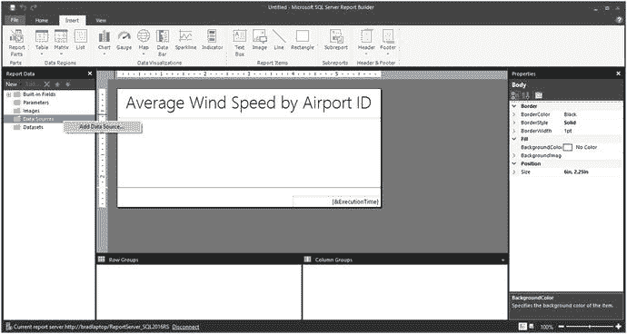

图 8-7. 菜单选项

会出现一个屏幕，如图 8-8 所示。

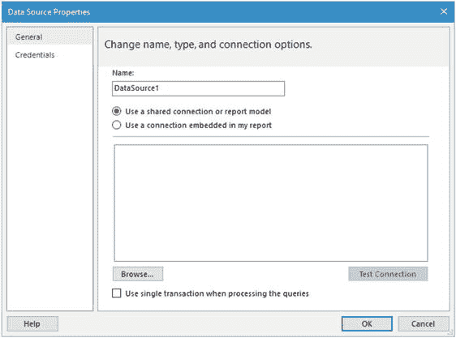

图 8-8. 数据源属性

将该屏幕更新为图 8-9 所示的内容。

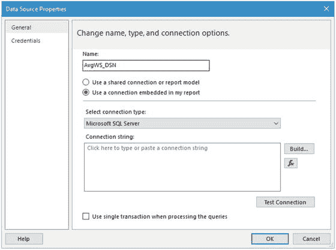

图 8-9. 更新后的值

我们需要配置连接字符串，因此单击 `Build…` 按钮；您应该看到如图 8-10 所示的内容。

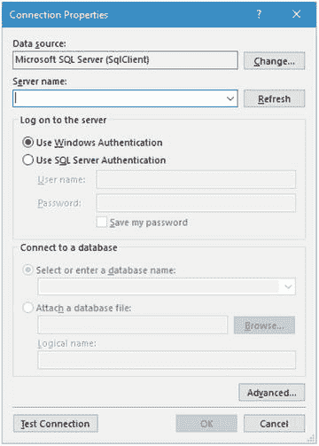

图 8-10. 连接属性

将该屏幕更新为图 8-11 所示的内容。

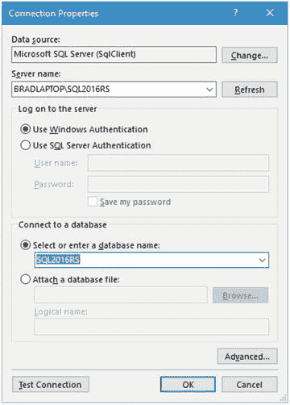

图 8-11. 更新后的值

显然，您要记住您的设置可能与我的不同。

到达此处后，您可以单击 `Test Connection` 按钮以验证是否正在连接到数据库。图 8-12 显示了单击此按钮的结果。

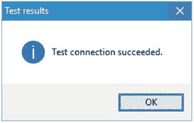

图 8-12. 测试连接成功

在此处单击 `OK`，然后再次单击 `OK` 以保存连接信息。图 8-13 显示了您现在应该看到的内容。

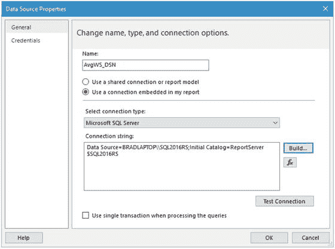

图 8-13. 更新后的值

这样我们的连接字符串值就全部完成了。同样，您可以在此处单击 `Test Connection` 按钮来验证连接性，但我认为我们在这方面已经基本完成了。单击 `OK` 关闭此窗口。

请注意，图 8-14 显示我们现在有一个可用的数据源。

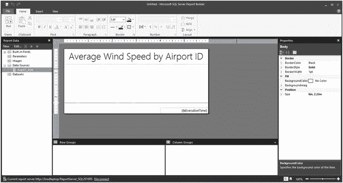

图 8-14. 数据源已更新

接下来，我们需要添加数据集。为此，在左侧右键单击 `Datasets` 选项，然后选择 `Add Dataset…`，如图 8-15 所示。

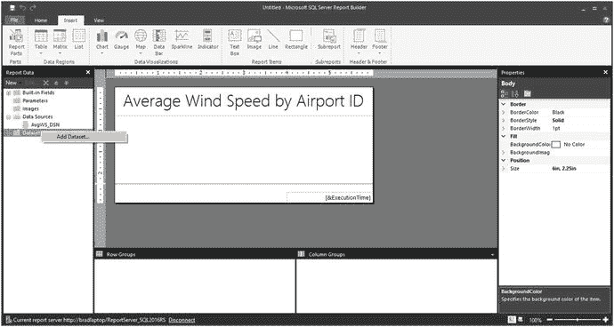

图 8-15. 添加数据集

这将打开如图 8-16 所示的界面。

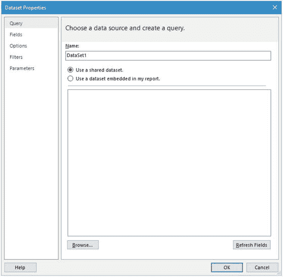

图 8-16. 数据集属性

将该界面更新为与图 8-17 所示内容匹配。

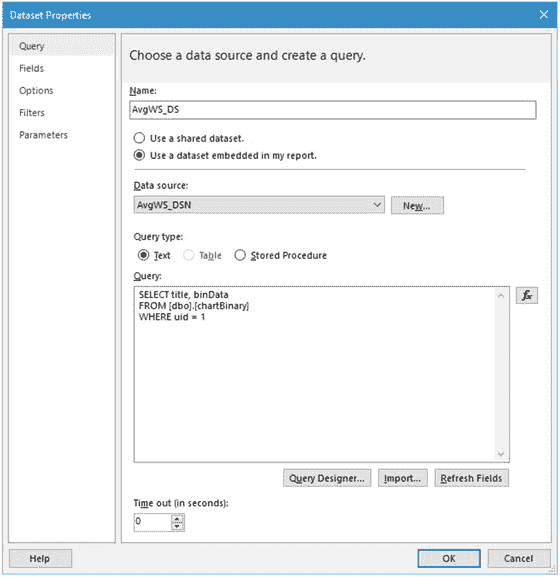

图 8-17. 数据集属性已更新

我为获取此报表数据编写的查询是：

```sql
SELECT title, binData
FROM [dbo].[chartBinary]
WHERE uid = 1
```

超级简单，但很有效。

左侧的选项并不真正适用于本节，但您可以稍后尝试使用它们。单击 `OK` 设置数据集。您应返回到如图 8-18 所示的空白报表屏幕。

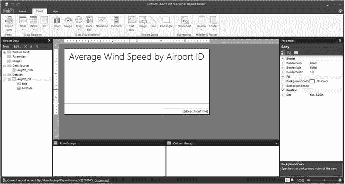

图 8-18. 主屏幕

请注意，现在 `Data Sources` 和 `Datasets` 文件夹下分别有条目。

让我们将标题文本更改为您在查询中输入的标题。请继续删除您之前输入的标题（Average Wind Speed by Airport ID）。只需高亮显示文本，然后按 `Delete`。您应该看到如图 8-19 所示的内容。

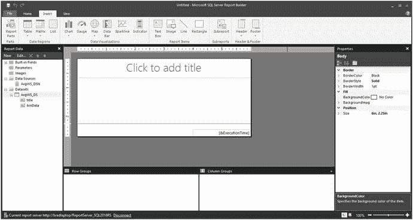

图 8-19. 已删除初始标题值

接下来，单击并将左侧 `AvgWS_DS` 选项下的标题值拖到主屏幕上的标题框中。图 8-20 显示了您现在应该看到的内容。

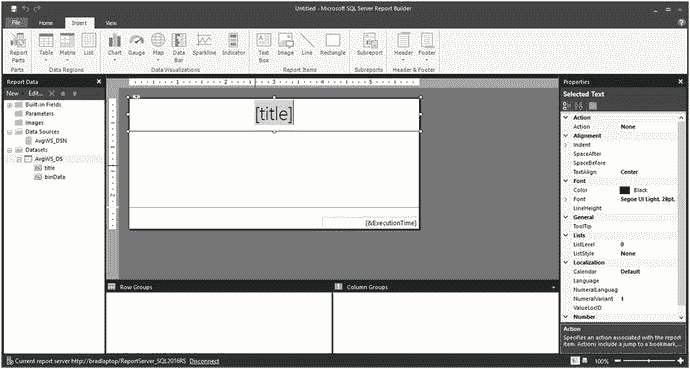

图 8-20. 标题添加

完美！这样，当运行报表时，就会显示标题的值。

#### 添加动态图像

接下来，我们需要添加图像。在正文中的任意位置右键单击，并将鼠标悬停在 `Insert…` 选项上，直到出现子菜单。此子菜单包含一个 `Image` 选项。图 8-21 显示了此菜单选项的位置。

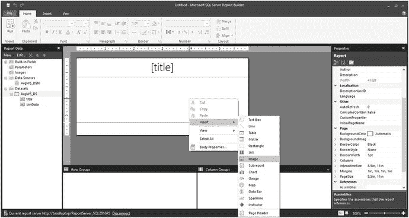

图 8-21. 图像选项

因此，您也可以单击窗口顶部的 `Insert` 菜单选项，然后单击 `Image` 选项。哪种方式对您来说更舒适都可以，因为它们都能完成相同的任务。

选择将图像放入报表后，会出现一个界面，如图 8-22 所示。

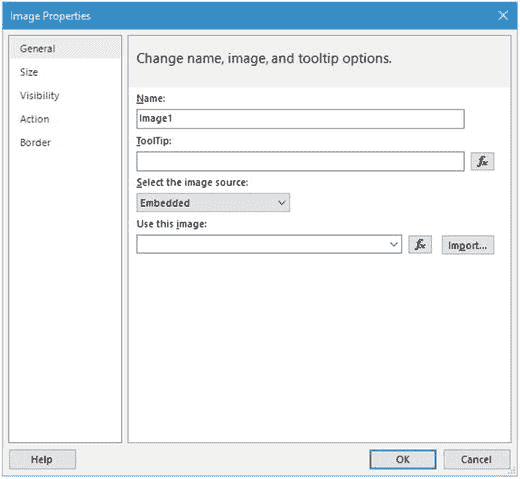

图 8-22. 图像属性

我们需要将这些值更新为与图 8-23 所示内容匹配。请注意，我只更新了 `Name`、`ToolTip` 和图像源字段。

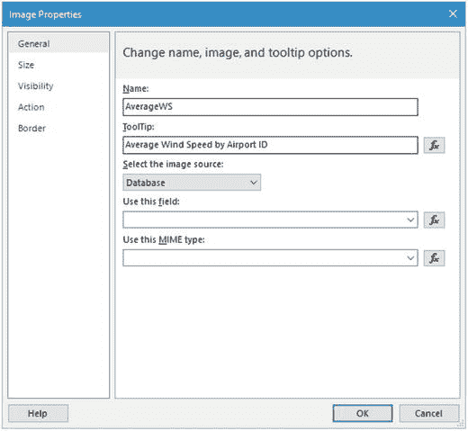

图 8-23. 已更新的图像属性屏幕

下拉 `Use this field` 菜单选项并选择值 `=First(Fields!binData.Value, "AvgWS_DS")`。很容易选错值，因此请确保您选择的是 `binData.value` 选项。

对于 `MIME type`，我们希望选择 `image/png`。

最终产品如图 8-24 所示。

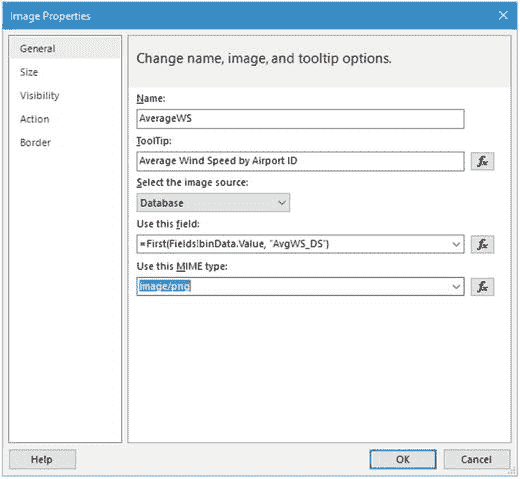

图 8-24. 更新后的值

接下来，单击左侧的 `Size` 选项。图 8-25 显示了此界面。

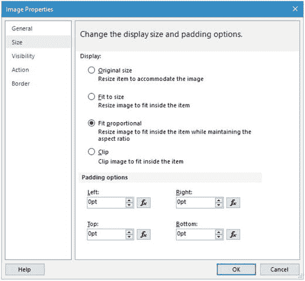

图 8-25. 大小选项

在此处选择 `Fit to size` 选项。这会将图像保持在可打印区域内。单击 `OK`。您应该看到与图 8-26 所示内容非常相似的内容。

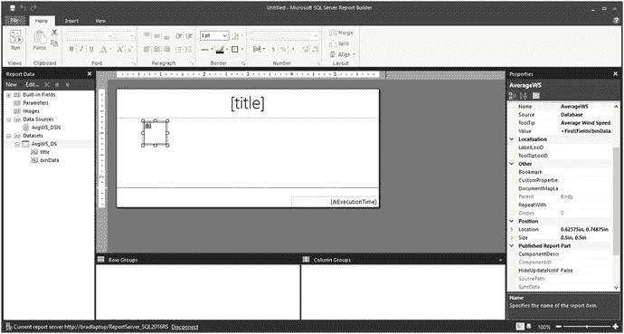

图 8-26. 主屏幕，已更新

此时，我们只看到图像占位符，因为图像是从数据库动态生成的。一旦运行报表，图像就会如预期那样显示出来。

在继续之前，只需在屏幕上抓取图像并将其手动对齐到屏幕左侧的空白区域内。图 8-27 显示了此操作的结果。

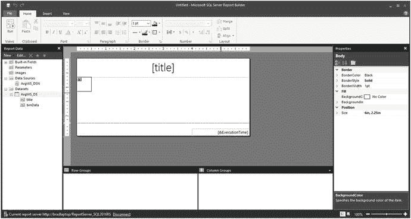

图 8-27. 图像左对齐


