# 9. 在报表服务器中查看报表

我们已经在报表生成器中构建了所需的报表，现在可以通过报表服务器的 Web 门户来查看它们。本章后面会介绍报表服务器的其他方面，现在先来看看我们的报表。

### 查看报表

回顾第 6 章，我们设置报表服务器时，将 URL 指定为`http://bradlaptop:80/Reports_SQL2016RS`。将你的 Web 门户地址输入浏览器并点击回车。你应该会看到与图 9-1 所示类似的内容。

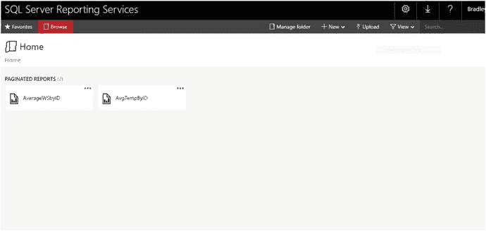
图 9-1. Web 门户

点击左侧的 AverageWSbyID 报表，会显示你在图 9-2 中看到的内容。

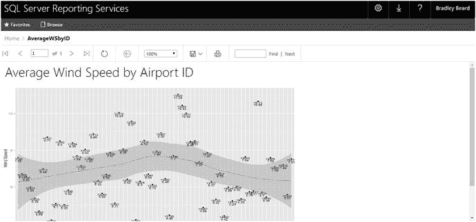
图 9-2. 生成的报表

在主页上点击 AvgTempByID 链接时，也会发生同样的事情。图 9-3 显示了这一点。

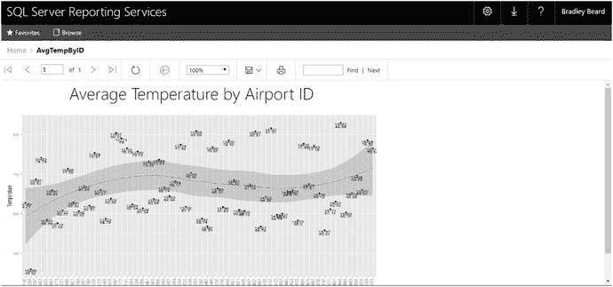
图 9-3. 生成的报表

所以，你得到了……一个使用二进制数据从原始 R 代码生成图像的完整报表。

### 管理报表

与之前的版本一样，此版本的报表服务器也提供了通过其界面管理报表的功能。在报表服务器中管理报表要求用户是管理员（我们应该是），并属于内容管理器组。报表服务器中提供以下安全角色：

*   **浏览器**：此角色可以查看指定文件夹中的文件夹和报表，并且可以订阅报表。但此角色不能创建报表。这将是常规的只读用户角色。
*   **内容管理器**：此角色管理报表服务器中的内容。这是报表服务器的管理员账户，可以在报表服务器的权限范围内执行任何操作。
*   **我的报表**：此角色可以发布报表，并管理他们被特别指派访问的用户文件夹。这将是常规的读/写“高级用户”账户类型。
*   **发布者**：此角色只能将报表和链接报表发布到报表服务器。这将是只写用户角色。
*   **报表生成器**：此角色可以管理和查看报表定义及属性。此角色保留给需要配置报表但不需要成为完全管理员（即内容管理器角色）的特定用户。

请记住，内容管理器角色可以完成此实例中我们需要做的任何事情，因此最小权限原则在这里确实被忽视了。

点击省略号，如图 9-4 所示。从弹出菜单中选择“管理”选项。

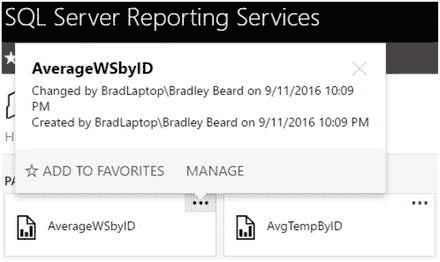
图 9-4. 管理菜单

会出现一个页面，如图 9-5 所示，它允许你编辑报表的部分属性。

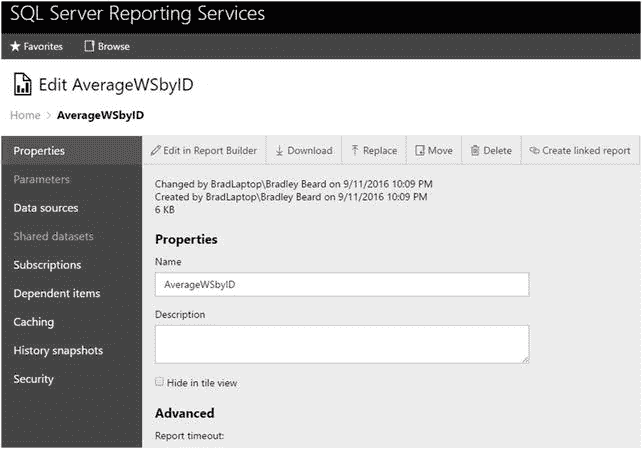
图 9-5. 属性

## 报表正文属性

回想一下，我们创建的图像是 800×600，所以让我们更新报表的样式。右键单击灰色区域，从菜单中选择“报表属性…”。图 8-28 显示了此操作。

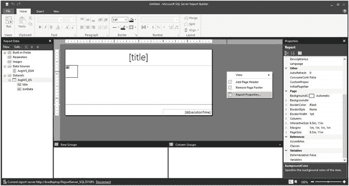
图 8-28. 报表属性位置

这将打开图 8-29 所示的界面。

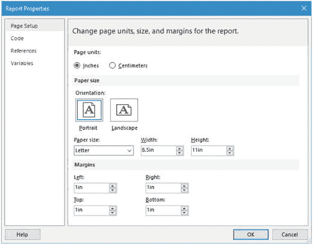
图 8-29. 报表属性

我们需要做的就是将“方向”值更改为“横向”，然后点击“确定”。我们需要检查页面大小以调整图像。稍作尝试会发现，我们希望舞台尺寸大约为 9×5（只需点击并拖动到该大小），图 8-30 显示了其应有的样子。

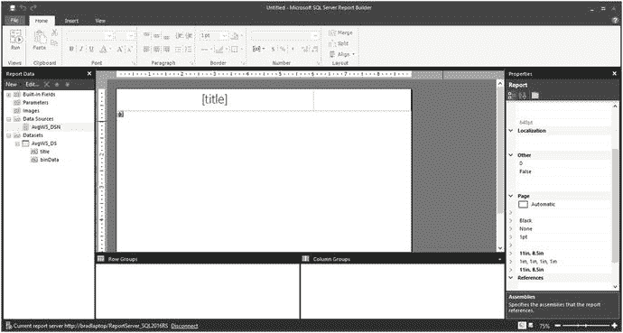
图 8-30. 舞台大小调整

我将页脚设为蓝色背景配白色文字，但你可以根据自己的喜好进行样式设计，让这份报表成为你自己的作品。

### 运行报表

继续点击左上角的“运行”按钮。准备好迎接一个大惊喜。图 8-31 显示了发生此事后你应该看到的内容。

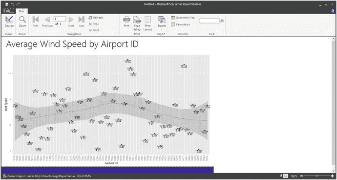
图 8-31. 完成的报表

不错！现在点击菜单栏中的“打印布局”按钮。图 8-32 显示了这个结果。

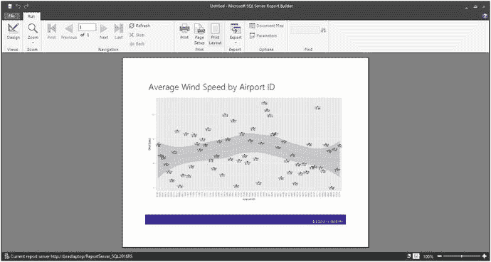
图 8-32. 打印布局视图

它就在那里，整齐地布局在一页上，我们的渲染时间显示在蓝色页脚中。

点击左上角的“设计”按钮，然后按 Ctrl+S 保存报表。默认位置和值如图 8-33 所示。

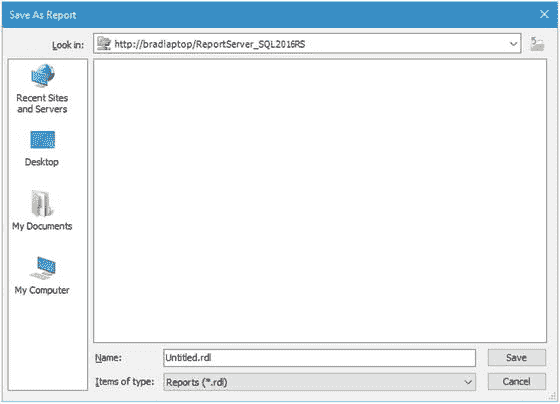
图 8-33. 默认报表位置

我们可以看到默认位置在我们的报表服务器上，这很完美。将文件的“名称”更新为 AverageWSbyID.rdl，如图 8-34 所示。

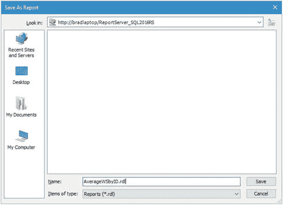
图 8-34. 更新后的名称信息

点击此处的“保存”按钮以保存报表。

此报表现已保存到报表服务器。我们处理完另一份报表后，就会查看它。

### 报表 2：按机场 ID 的平均温度

看看创建第二份报表是多么容易。我希望你开始看到这项技术带给你的灵活性！

按 Ctrl+N 打开一份新报表（请务必保存旧的）。你会立即看到一份空白报表，就像之前一样。你也可以转到“文件”菜单并选择“新建…”来选择不同的类型。

我们需要基本上遵循与之前完全相同的说明，只是这次，在创建数据集时，我们需要将`WHERE`子句更改为显示 UID 等于 2 而不是 1 的地方。我将把进行此更改作为练习留给你自己完成。这是一个微不足道的更改。

完成设置后，你的屏幕应与图 8-35 类似。

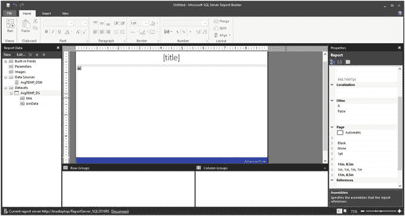
图 8-35. 平均温度报表布局

而你的报表应该与图 8-36 所示非常相似。

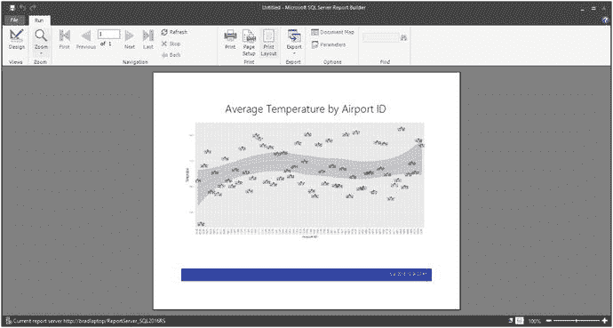
图 8-36. 第二份报表

干得漂亮！务必将该报表保存为`AvgTempByID.rdl`。

### 小结

我希望你从本章中学到了很多。我鼓励你通过尽可能多地学习 R 和商业智能知识，继续你作为数据科学家的旅程。这保证在未来是一个非常有“钱”途的领域，我非常激动能成为其中的一员。

如果本章的任何部分没有弄明白，正如我在前面章节中所说，请务必回头重新做一遍示例。

第 9 章将向你展示如何从报表服务器访问这些报表。这将是一个有趣的章节，不仅因为它是最后一章，而且因为它是我们本书工作的结晶。

### 属性

请注意，我们现在位于左侧的 **“属性”** 部分。顶部有以下几个选项：**“在报表生成器中编辑”**、**“下载”**、**“替换”**、**“移动”**、**“删除”** 和 **“创建链接报表”**。除了 **“创建链接报表”** 之外，其他选项的含义都很直观。**“创建链接报表”** 选项允许你创建一个报表，该报表保留现有报表的布局和数据源信息，但仍允许编辑报表的其他参数，例如订阅和报表参数。可以将其理解为一种模板创建器。你本质上是为一个报表创建了一个模板，然后从该报表的基本框架（数据源和报表布局）创建一个全新的报表，但随后你可以用完全不同的报表信息填充这个框架的主体。

在此页面上，我们可以在图 9-5 所示的 **“描述”** 框中为报表添加描述。如果向下滚动，你会看到另一个标题为 **“高级”** 的区域。此区域允许你更改报表超时时间，但由于这是一个动态生成的报表，我将保持原样。可能存在网络流量导致我的报表无法快速生成的情况。我不希望仅仅因为这个原因导致报表失败。

#### 数据源

左侧菜单显示的下一节是 **“数据源”**。此部分允许我们更新或更改现有的数据源。这里的关键词是 **“现有”**。我们无法在报表服务器中创建新的数据源；它们必须首先在报表生成器中创建。

图 9-6 显示了此屏幕的顶部部分，其中包含我们之前在报表生成器中指定的数据源信息。请注意，我们在这里有更改任何内容的选项，因为我们处于 **“内容管理器”** 角色。

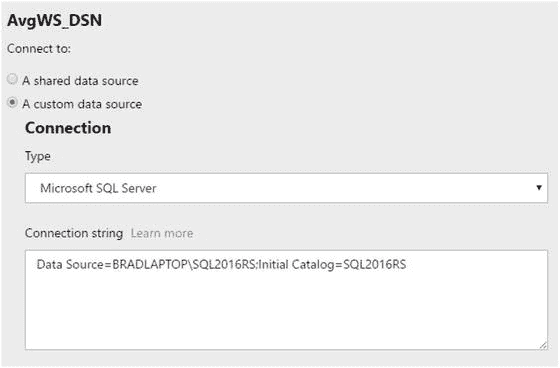

图 9-6.
数据源信息

此屏幕的底部部分如图 9-7 所示。此部分允许我们定义或编辑连接到数据源所需的凭据。显然，这个 **“凭据”** 部分已经按设置工作了，否则我们将无法在此报表服务器界面中看到我们创建的报表。图 9-7 显示了我们这里的选项。

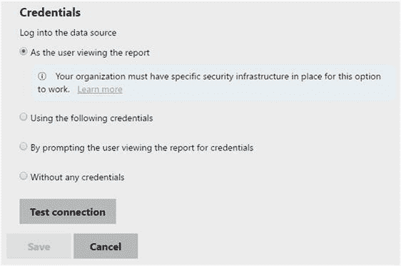

图 9-7.
凭据信息

请注意，我们可以从四种不同的登录类型中选择。

> 注意
> 此选项可能会根据你的具体安装和个别要求而有所不同。

在 **“凭据”** 屏幕上，我们需要滚动到底部并单击 **“测试连接”** 按钮。图 9-8 显示了此时你应该看到的内容。

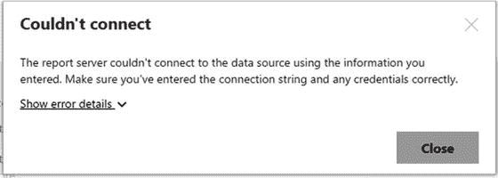

图 9-8.
测试连接不成功

此外，一条错误消息出现在 **“测试连接”** 按钮旁边，如图 9-9 所示。

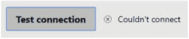

图 9-9.
错误消息

接下来，我们需要单击 **“使用以下凭据”** 单选按钮，并将界面更新为如图 9-10 所示。你的信息很可能与图中所示的信息不同。

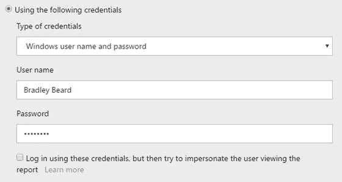

图 9-10.
更新后的凭据信息

请注意，屏幕上显示的复选框未被选中；这对于在下一节中创建订阅至关重要。更新信息后，单击屏幕底部的 **“测试连接”** 按钮。图 9-11 显示了此操作的结果。

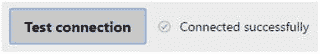

图 9-11.
连接成功

最后我们需要做的是单击 **“保存”** 按钮，这会更新报表。

> 注意
> 此时，你可能需要再次运行报表，并确保它仍能正确呈现。

一旦连接信息被保存，它会立即对订阅了该报表的用户可用。

#### 订阅

单击左侧菜单中的 **“订阅”** 链接。将打开一个界面，如图 9-12 所示；它可用于创建报表订阅。

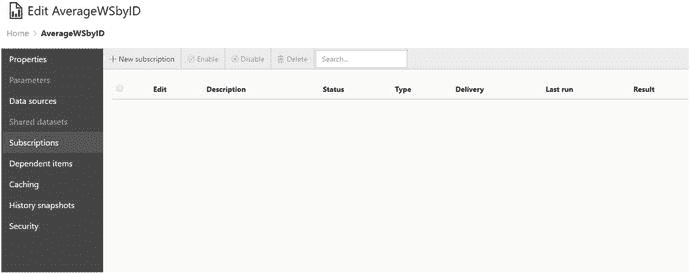

图 9-12.
订阅

请注意，有一个标有 **“新建订阅”** 的按钮，文本左侧带有一个加号。请单击 **“新建订阅”** 按钮。你应该看到如图 9-13 所示的内容。

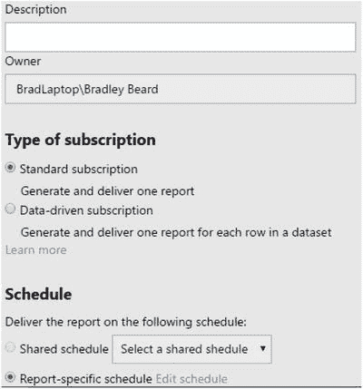

图 9-13.
新建订阅

首先，我们希望将 **“描述”** 字段更新为 **“风速报告”**。接下来，我们将编辑计划，但保持订阅类型不变。单击蓝色的 **“编辑计划”** 链接可以更改当前计划。图 9-14 显示了单击 **“编辑计划”** 选项时的初始界面。

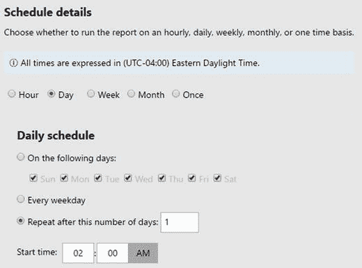

图 9-14.
编辑计划（顶部）

请注意，这是 **“编辑计划”** 界面的顶部部分。单击 **“一次”** 单选按钮，然后输入一个距离你当前时间仅几分钟的时间。

此界面的底部部分如图 9-15 所示。在此区域中，我们只需要单击 **“应用”** 按钮。

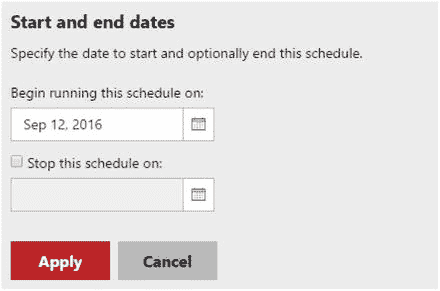

图 9-15.
编辑计划（底部）

此时，订阅界面更新以显示新的计划信息。图 9-16 显示了此更新后的计划信息，以及我们需要更新的下一部分。

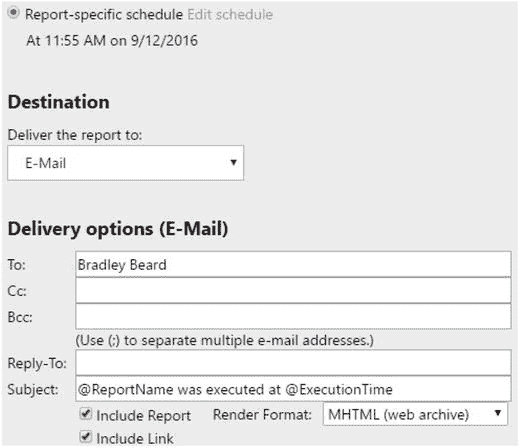

图 9-16.
目标和电子邮件选项

我们希望将目标保留为 **“电子邮件”**，并更新其余信息，如图 9-17 所示。

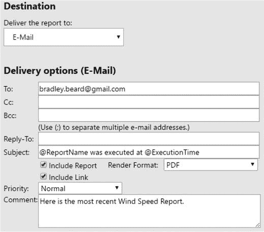

图 9-17.
更新后的目标和电子邮件选项

请注意，我在 **“收件人:”** 字段中输入了我的实际电子邮件地址，并将 **“呈现格式”** 更改为 PDF。

> 注意
> 当前可用的呈现格式包括 Word、Excel、PowerPoint、PDF、TIFF、MHTML、CSV、XML 和数据提要。

接下来，只需在 **“注释”** 字段中添加一些文本，如图 9-18 所示。

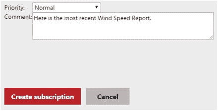

图 9-18.
添加的注释信息

单击 **“创建订阅”** 按钮，我们就完成了此区域的操作。等待几分钟。你应该会在收件箱中看到一封电子邮件。打开它会显示与图 9-19 所示类似的内容。

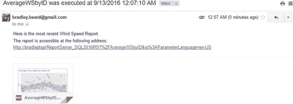

图 9-19.
收到的电子邮件

你已成功为此报表创建了电子邮件订阅。

#### 依赖项

**“依赖项”** 部分没有可配置的区域，因此我们将保持此区域不变。

#### 缓存

“缓存”部分允许您选择是否要缓存您的报表。图 9-20 显示了“缓存”部分的初始界面。

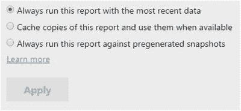

图 9-20. 缓存界面

我个人会选择 `始终使用最新数据运行此报表` 选项，以防报表未按顺序运行或在正常计划运行时间之外运行（对于订阅而言）。在某些情况下，`缓存此报表的副本并在可用时使用它们` 选项可能是更好的选择；例如，如果这严格来说是一个基于订阅的服务器，并且没有允许用户随意运行报表的应急方案，那么生成一次报表，然后服务器在收到请求时提供缓存的报表副本是合理的。最后一个选项 `始终针对预生成的快照运行此报表`，意味着报表是从一个特定时间点生成的，该时间点称为快照，这将在下一节中讨论。

#### 历史快照

此部分允许您生成报表的快照。这使得前面讨论的选项在此上下文中可用。点击图 9-21 中所示的 `新建历史快照` 按钮，会基于当前日期和时间的数据创建报表的快照。

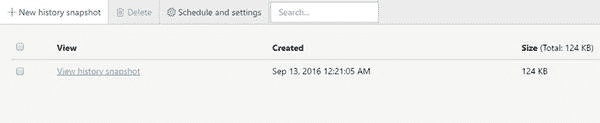

图 9-21. 历史快照

回顾“缓存”部分，如果您在生成快照后选择 `始终针对预生成的快照运行此报表` 选项，那么随后生成的任何报表都将基于此快照运行。

注意：如果您在此处创建了快照，请继续删除它，除非您计划将来使用它。

#### 安全性

“安全性”部分允许您自定义用户和角色。`组或用户` 信息来自 Windows 子系统。`角色` 基于 SQL Server Reporting Services。

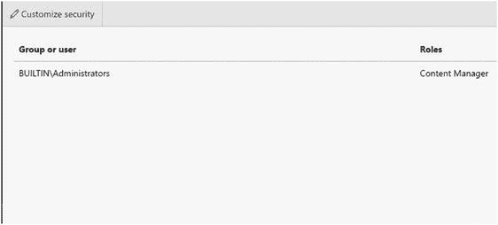

图 9-22. 安全性选项

请注意，我们同样不需要在此处更改任何内容。

### 保存报表

除了订阅之外，还有另一种方法可以在 Reporting Services 中保存已生成的报表。为此，只需在主屏幕上点击报表的名称来运行报表，如图 9-23 所示。

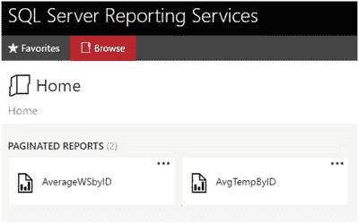

图 9-23. 主屏幕

这将打开我们之前见过的报表。图 9-24 显示了“保存”对话框，通过点击报表工具栏中的磁盘图标调出。

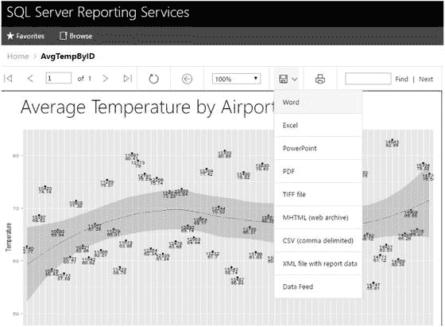

图 9-24. 保存选项

因此，再次说明，我们拥有与之前配置电子邮件设置时相同的呈现选项。此时，您可以将报表保存为任何您希望的格式。

至此，我们就完成了。

### 总结

恭喜！我们已完成了这段数据科学入门之旅。请理解，就 R 所能实现的功能而言，这仅仅是冰山一角。这本书远非您在 R 环境中工作所需了解的全部知识；恰恰相反，本书旨在将您引入 R 与 SQL Server 融合的当下世界，如果您尚未开始，希望您能继续您的探索之旅。我鼓励您继续前进，并通过更广泛的社区参与，让未来版本的 SQL Server R Services 变得更好。

下次再见，非常感谢您花时间阅读本书。希望您阅读本书的乐趣与我撰写本书的乐趣一样多！

