# 在 SQL Server 2014 安装中安装 SQL Server 2016 实例

这些说明与第 1 章中的说明非常相似，但我们不是在一台服务器上单独安装 SQL Server 2016 实例，而是在现有的 SQL Server 2014 安装之上安装一个 SQL Server 2016 实例。

我们也不会像第 1 章那样安装所有组件。相反，我们只安装 `R Services`、SQL Server 2016 数据库引擎和 SQL Server 2016 Reporting Services。我们需要 Reporting Services 以便后续为我们提供 R 内容。

如果您选择在 SQL Server 2014 之上安装 SQL Server 2016，请理解这会带来一些影响，例如依赖旧版本的 Analysis Services 或 Integration Services。如果您可以接受这一点，那么这就是创建此附录的原因。

### 开始

让我们开始安装。双击下载文件夹中的 `setup.exe` 文件。您应该会看到图 A-1。

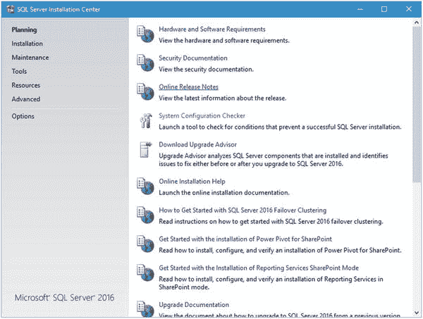

图 A-1. SQL Server 2016 初始安装屏幕

如果看到要求对系统进行更改的屏幕，请点击“是”。

图 A-1 显示了您启动安装后应该看到的第一个屏幕。这个屏幕对您来说应该相当熟悉。点击左侧的 `安装` 链接，查看图 A-2 所示的内容。

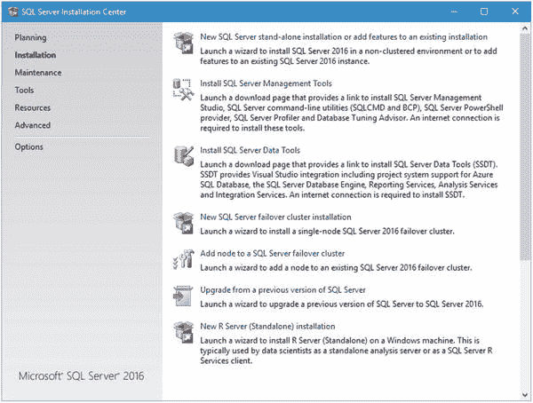

图 A-2. SQL Server 2016 安装选项

到达此处后，点击顶部的 `新建 SQL Server 独立安装或向现有安装添加功能` 链接。

请注意，最底部的选项是新的。它写着 `新建 R 服务器（独立）安装`。如果您只想将 R Server 安装为服务器（独立的、自包含的数据分析服务器）或客户端（操作来自远程 SQL Server R Services 安装的数据），则应选择此选项。请注意，您还需要 SQL Server 2016 服务正在运行，因此这相当于向现有的 SQL Server 2016 安装添加 R 服务。换句话说，它不能添加到以前版本的 SQL Server。

### 产品密钥

现在是输入产品密钥或选择安装产品的免费版本的时候了。换句话说，如果您碰巧拥有许可的 SQL Server 副本，您会获得一个 25 个字符的许可密钥，因此您可以在此处输入。否则，您始终可以选择免费版本。本书的目的是用于评估，因此请从下拉菜单中选择 `Evaluation`。图 A-3 显示了在独立安装过程中从图 A-2 继续后您看到的屏幕。

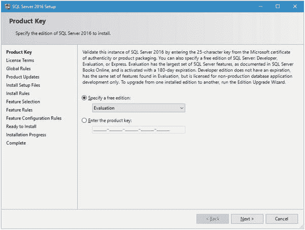

图 A-3. 产品密钥屏幕

SQL Server 2016 可以安装在以下三种免费版本之一：

- `Evaluation`：全套功能，基本上是 SQL Server 2016 的企业版，但有效期仅为 180 天。
- `Developer`：全套功能，但不能用于生产数据库工作。
- `Express`：最小的、最基本的 SQL Server 2016 安装，不会过期，可用于生产用途。

如果您想选择 `Evaluation` 以外的选项，请直接选择。只需理解选择该选项的影响。对于我们所需的功能，`Evaluation` 版本是完美的，因为我们肯定会在 180 天内决定是否要将此新功能永久包含在我们的 SQL Server 安装中。

选择您最习惯的版本后，点击 `下一步` 继续。


### 许可条款

下一个屏幕，如图 A-4 所示，将要求你接受许可条款。

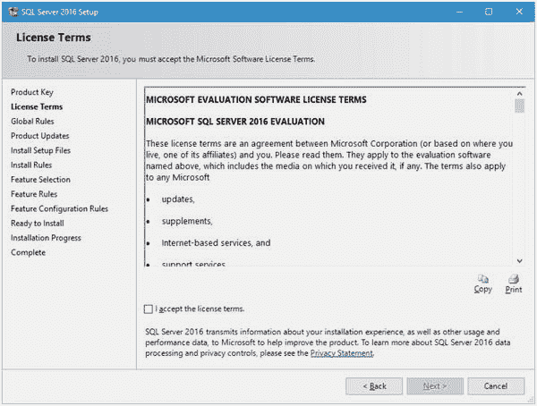

图 A-4.

许可条款

说实话，我从未完整阅读过这份许可条款，我敢说我认识的人里也没有谁读过。显然，只需勾选“我接受许可条款”复选框，然后单击“下一步”继续。

### 安装规则

我的屏幕闪烁了几次，最终停留在如图 A-5 所示的屏幕上。

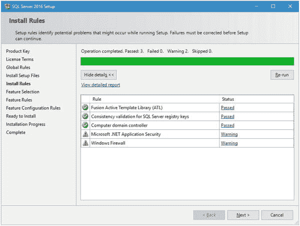

图 A-5.

安装规则

值得注意的是，此步骤可能会下载并安装 SQL Server 2016 的更新；因此，如果出现相关提示信息，请直接安装它。

除了我的 .NET 应用程序安全设置和防火墙规则外，其他一切看起来都很好。这应该没问题，所以我将单击“下一步”继续。

### 功能选择

现在进入正题。图 A-6 显示了我们一直在等待的屏幕。

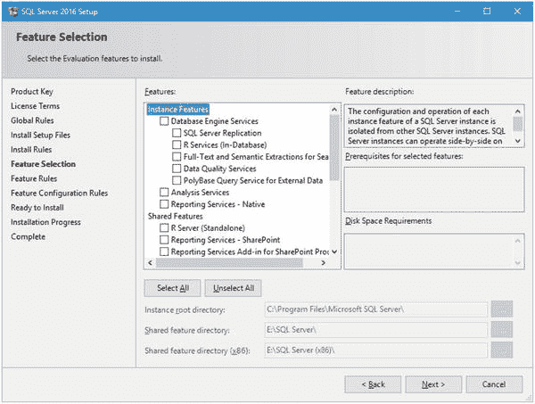

图 A-6.

功能选择

此时，我们可以直接按“全选”就完事了。但如果你仔细查看选项，就会明白它们的含义。我们肯定要选择 `R Services (In-Database)`；否则，你就可以停止阅读本文了。选择该项后，我们会看到 `Database Engine Services` 也被自动选中。我们还需要选择 `Reporting Services – Native`，我们将在第 7 章中使用它。然而，除了这三项，我们不想选择其他任何内容。图 A-7 显示了此时你应该看到的选定项。

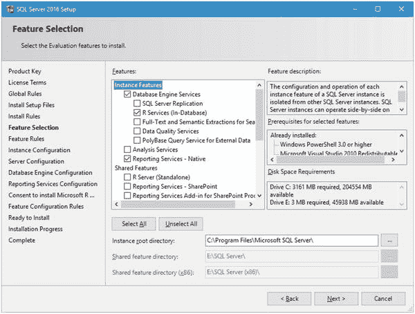

图 A-7.

选定选项后的功能选择

请注意底部显示的默认实例根目录和共享功能目录都指向我的 E 盘。那是我存放 SQL Server 相关内容以便于检索的位置。

在此处单击“下一步”继续。

### 实例配置

系统会思考一小会儿，但最终，你会看到如图 A-8 所示的“实例配置”屏幕。

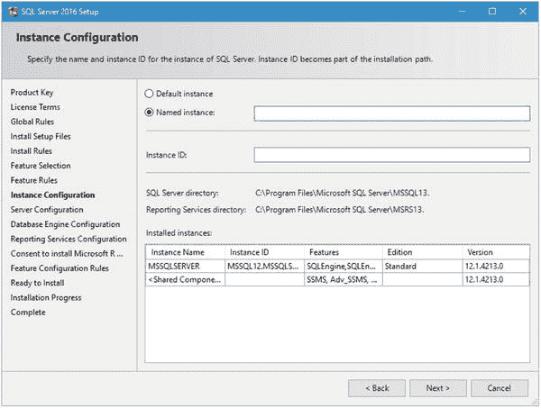

图 A-8.

实例配置

此时，我们需要定义新实例。如果查看“已安装的实例”部分，你会看到已经安装了一个 SQL Server 2014 版本。我们不想通过覆盖安装来破坏它，因此我们选择“命名实例”选项，并将其命名为 `SQL2016RSVCS`，以代表 SQL Server 2016 R Services。

请注意，此值与第 1 章中给出的实例名称不同。这是为了区分两个实例。

为“命名实例”字段输入该值。你会看到如图 A-9 所示的内容。

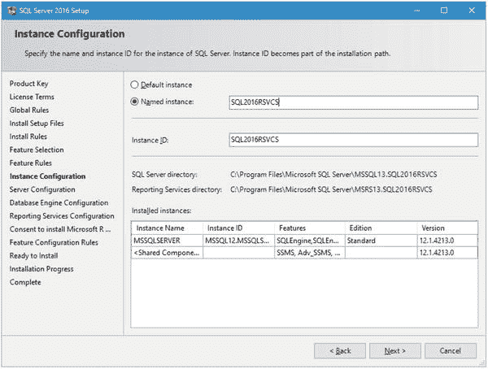

图 A-9.

更新后的实例配置屏幕

请注意此屏幕上列出的“命名实例”字段、“实例 ID”字段、SQL Server 目录位置和 Reporting Services 目录位置。这些位置都需要引用 `SQL2016RSVCS`。一旦你确信一切设置正确，请单击“下一步”继续。

#### 服务器配置

下一个屏幕是我们定义服务的服务账户和启动类型的地方。该屏幕如图 A-10 所示。

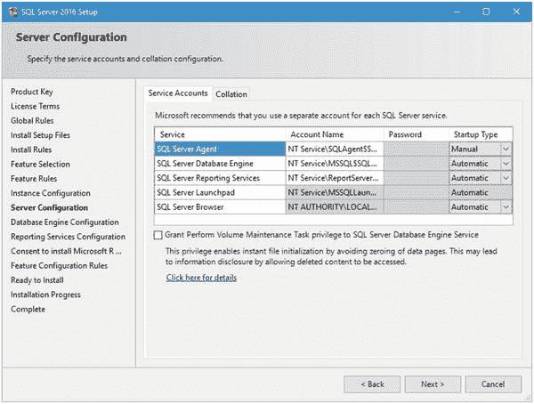

图 A-10.

服务器配置

以下是 SQL Server 2016 创建的服务账户：

*   `NT Service\SQLAgent$SQL2016RSVCS`：启动和管理 SQL Server Agent 服务。
*   `NT Service\MSSQL$SQL2016RSVCS`：启动和管理 SQL Server 服务。
*   `NT Service\ReportServer$SQL2016RSVCS`：启动和管理 Reporting Services 服务。
*   `NT Service\MSSQLLaunchpad$SQL2016RSVCS`：启动和管理 R Services 服务。

SQL Browser 服务在“本地服务”上下文中运行，因此这不是新创建的服务账户。换句话说，我们不用担心那个。

这些是默认服务，但如果你有自己的服务账户，总是可以更改为你自己的。如果你没有自己的服务账户，可以保留这些建议的服务账户。我认识许多服务器管理员，他们坚持对服务采用最小权限原则，如果这是你特定环境的情况，那么你需要从服务器管理员那里获取服务名称和登录信息才能继续。另一种方法是复制这些服务名称，并在给你的系统管理员的安装摘要中包含这些账户信息，以便系统管理员可以根据需要审计此用户的权限。这里需要重点注意的是，我在这里提到的“系统管理员”是一个独立的个人或实体，不是数据库管理员，而是 Windows 级别的管理员。换句话说，是负责操作系统层、应用层之上一层的人。

我们只想在这里更改一小部分；具体来说，将 `SQL Server Agent` 服务的“启动类型”设置为“自动”。这是我们需要做的唯一更改。图 A-11 显示了你此时应该看到的内容。

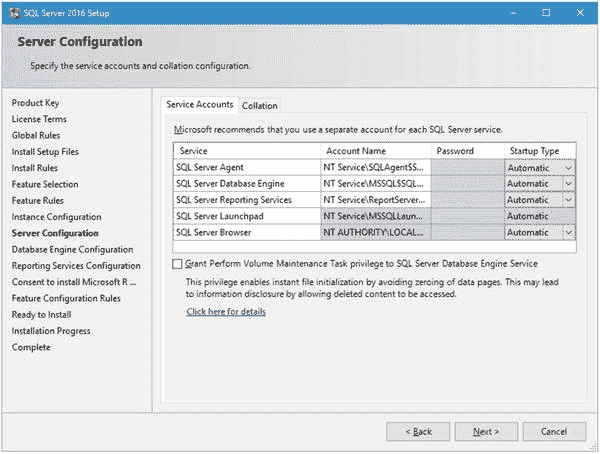

图 A-11.

更新后的服务器配置

请注意，我们无法为这些账户中的任何一个设置密码。这与我见过的每个 SQL Server 安装都是一样的。如果你将“账户名”框从默认值更改为自定义的服务账户名称，那么“密码”框将被激活并接受输入；否则，密码由 SQL Server 控制。

还要注意，在默认列出的服务下方，有一个新的“向 SQL Server 数据库引擎服务授予‘执行卷维护任务’特权”复选框。对于我们在本书中所做的操作，勾选此框不是必需的。在未来的安装或生产环境中，启用此功能可能是个好主意。

此时，我们所有的服务都设置为“自动”。请注意，我们不会去管“排序规则”选项卡。默认情况下，此选项卡应指定为 `SQL_Latin1_General_CP1_CI_AS`。就是这样。继续单击“下一步”继续。

### 数据库引擎配置

下一个是图 A-12 所示的“数据库引擎配置”屏幕。它允许你在四个不同的选项卡中为引擎设置选项。

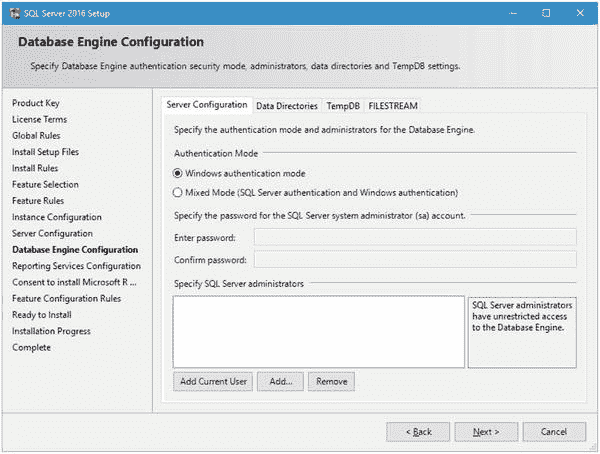

图 A-12.

初始数据库引擎配置屏幕

#### 服务器配置

此选项卡允许你指定此数据库引擎实例的身份验证模式和管理员。由于这只是用于测试和评估，我将通过选择“Windows 身份验证模式”并单击屏幕底部的“添加当前用户”按钮，将我自己添加为管理员。图 A-13 显示了选定这些选项后的界面。

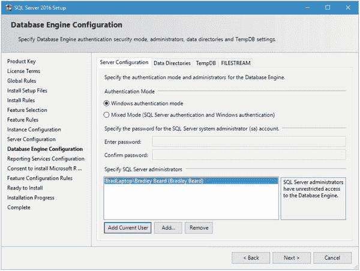

图 A-13.

选定选项后的服务器配置选项卡


### 数据目录

回顾我设置文件系统的方式。这里就派上用场了。图 A-14 展示了此屏幕的初始外观，图 A-15 则展示了我选择的配置选项。你可以按喜好设置这些，但我个人的偏好是不将所需文件放在默认的、如迷宫般的文件夹结构中。

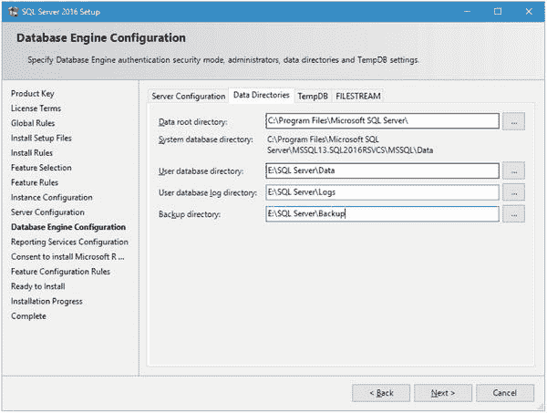

图 A-15.
更新后的数据目录选项卡

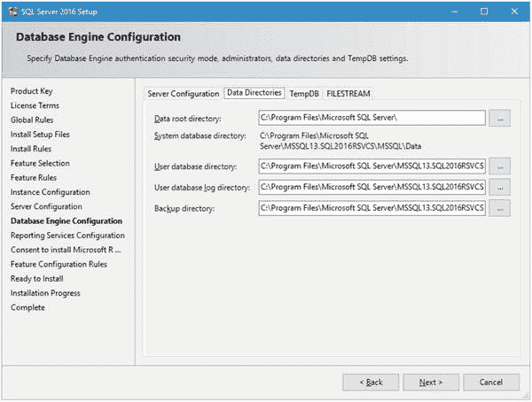

图 A-14.
初始数据目录选项卡

### TempDB

通常，我会保持此选项不变。但在这里，我将选项设置为镜像我已启用的文件系统。图 A-16 显示了默认设置，图 A-17 显示了更新后的设置。

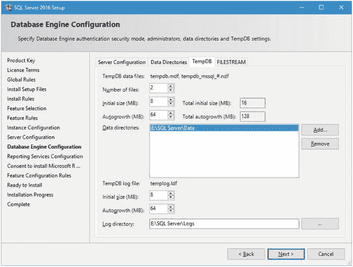

图 A-17.
TempDB 更新后的设置

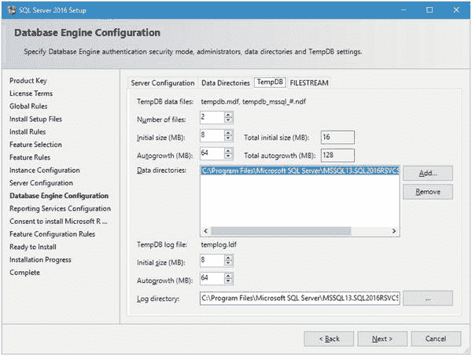

图 A-16.
TempDB 默认设置

我所做的改动很小。首先，我在 `数据目录` 字段中选中了现有选项，然后点击了 `删除` 按钮。接着，我点击了 `添加` 按钮，并添加了 `E:\SQL Server\Data`。该位置在 `日志目录` 字段中被镜像，因此我将其改为 `E:\SQL Server\Logs`。这个选项卡的配置就到此为止。

### FILESTREAM

保持 FILESTREAM 选项卡不变即可。本书中不会使用 FILESTREAM。

### Reporting Services 配置

当你将所有这些选项卡都填写完毕后，点击 `下一步`。图 A-18 展示了你现在应该看到的界面。

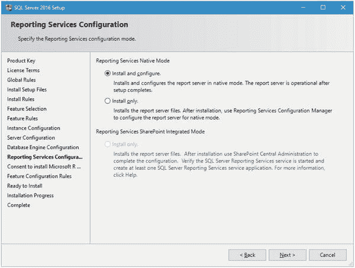

图 A-18.
Reporting Services 配置

这里是我们配置 Reporting Services 的地方。我们将在第 7 章及之后进一步配置它，所以我们现在就使用默认选中的 `安装并配置` 选项来安装它。

顺便提一下；如果以后你想添加 Reporting Services，因为你安装数据库引擎时没有安装它，你将只有 `仅安装` 选项可用。这是因为必须使用 `Reporting Services 配置管理器` 才能将 Reporting Services 添加到现有的数据库引擎实例中。理想情况下，你应该遵循 **最小安装原则**，这个概念指出，安装新软件时，只应安装需要的部分，忽略不需要的部分。特别是在这种情况下，这非常合理，也正是我们现在不安装整个 SQL Server 2016 的原因。在其他某些情况下，安装功能齐全的豪华版软件是完全合理的，但请记住，并非总是如此。

在 Reporting Services 配置屏幕，确保选中了 `安装并配置` 选项，然后点击 `下一步` 继续。

### 同意安装 Microsoft R Open

你现在应该看到如图 A-19 所示的界面。

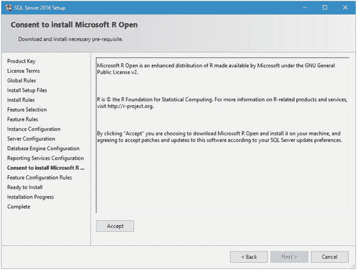

图 A-19.
同意安装 Microsoft R Open

这非常酷。在 SQL Server 2016 完整版之前，你必须下载 R 的单独组件，然后分别安装。在这个版本中，你只需在此授权下载即可。点击 `接受` 按钮。`下一步` 按钮将变为可用。继续点击 `下一步` 以继续。

### 准备安装

图 A-20 显示了你现在应该看到的“准备安装”屏幕。在继续之前（如果你打算按照本书的练习操作），请仔细阅读并确保你的设置与此匹配。

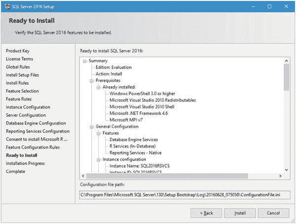

图 A-20.
准备安装

一旦你准备好了，祈祷一下，然后点击 `安装`。在加载和安装所需组件时，你的屏幕会闪烁几次。图 A-21 显示了安装开始运行时你应该看到的内容。

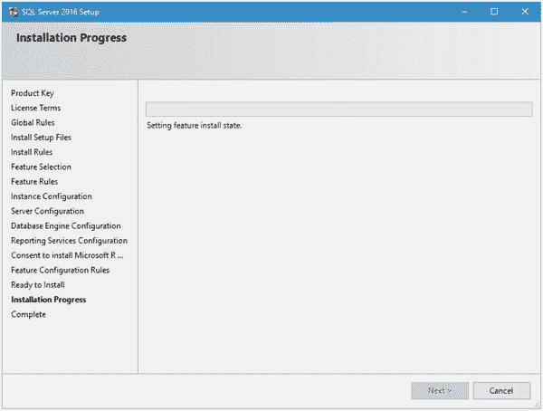

图 A-21.
安装进度

此时，安装正常进行。这需要一点时间，但最终会完成，并显示如图 A-22 所示的界面。

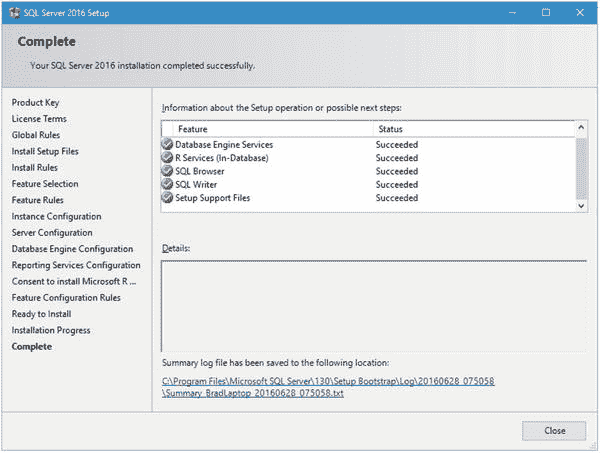

图 A-22.
完成


### 完成

此刻你最希望看到的屏幕就是这个。如果你没有看到此屏幕，反而看到一个错误提示，那么说明出现了问题。如果你遵循了本附录中的说明进行操作，那么很可能是与现有的 SQL Server 2014 安装发生了冲突。

我的安装大约用了 10 分钟才完成。向下滚动查看是否所有组件都已正确安装，然后点击“关闭”。

恭喜！你已经安装了 SQL Server 2016 R Services。不过，根据微软的说法，我们还需要做一些工作。

打开 SQL Server Management Studio（是的，就是 2014 版那个），并连接到你新安装的实例。图 A-23 展示了如何连接到实例。

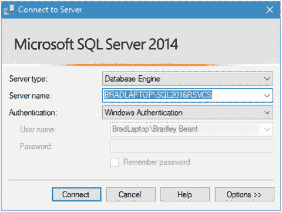

图 A-23.

连接到新实例

回想一下，我将新的 SQL Server 2016 实例命名为 `SQL2016RSVCS`，所以我将连接到这个实例。服务器名称字段的格式是 `服务器名\实例名`，所以我按照这个格式填写了连接信息。你也可以下拉菜单并从那里导航到一个实例。无论你更习惯哪种方式都可以，只要能连上就行。点击“连接”登录到你的实例。

初始屏幕类似于图 A-24。

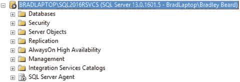

图 A-24.

SQL Server Management Studio 已连接到 SQL Server 2016 实例

注意查看命名实例和显示的 SQL Server 版本。这意味着我们已成功连接到新实例，可以开始下一步了。

微软发布了一个安装后配置步骤，我们需要先运行这个步骤。我完全预期这个步骤在未来会被移除并整合到安装程序中，但就目前而言，请按照以下步骤完成安装。

在 SQL Server Management Studio 中打开一个“新建查询”窗口，并键入以下命令：

```
Exec sp_configure 'external scripts enabled', 1
Reconfigure with override
```

图 A-25 展示了此操作。

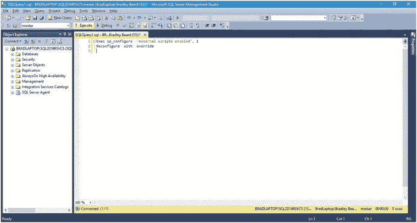

图 A-25.

准备执行的命令

注意，我们是在针对 `master` 数据库执行此命令。

运行它。你应该会看到图 A-26，它告诉我们执行成功了。

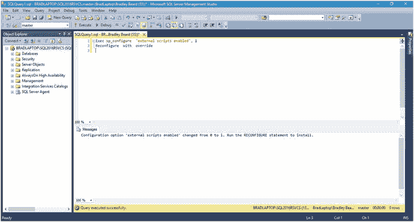

图 A-26.

成功

接下来，我们需要验证 R 是否确实在运行。为此，微软要求重启 SQL Server 实例并运行以下脚本。先重启实例。然后打开一个“新建查询”窗口并键入以下内容：

```
exec sp_execute_external_script
@language =N'R',
@script=N'OutputDataSet<-InputDataSet',
@input_data_1 =N'select 1 as hello'
with result sets (([hello] int not null));
go
```

对于那些还没背下每一个系统存储过程的人来说，你可能不认识 `sp_execute_external_script`，这是一个用于执行外部脚本的全新存储过程。可以使用以下参数调用此存储过程：

*   `@language`：支持的编程语言名称。
*   `@script`：要执行的脚本（你可以将全部内容输入到存储过程中，或将其作为变量引用）。
*   `@input_data_1`：用于从数据库收集数据的 SQL 查询放在这里。
*   `@input_data_1_name`：作为 `@input_data_1` 查询结果集的 data frame。此属性是可选的。
*   `@output_data_1_name`：`@script` 中保存输出数据的 data frame 变量。此属性是可选的。

按 F5 执行脚本。预期结果如图 A-27 所示。

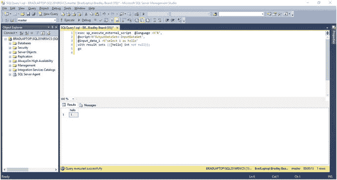

图 A-27.

R 存活了！

太好了！R 运行正常，并且与 SQL Server 实例通信顺畅。

### 总结

让我们简要回顾一下本附录涵盖的内容。

1.  在现有的 SQL Server 2014 默认实例之上安装了一个 SQL Server 2016 命名实例。
2.  安装后配置了 R。
3.  通过运行前面指定的脚本验证了 R 已正确安装。

因此，本质上，这就是如何在 SQL Server 2014 之上安装 SQL Server 2016。

请记住，正如我之前提到的，实例的配置方式可能仍然存在一些冲突。直接将你的实例升级到 2016 版本可能更好，但你永远、永远不应该仅仅因为某个应用程序发布了最新、最强大的版本就去升级一个关键任务服务器。你总是需要检查并做好功课，以确保操作系统是受支持的，并且升级的版本之间没有巨大差异。这就是为什么本书的主要重点是在新服务器上安装，而不是在已有 SQL Server 安装的服务器上安装。

如果你对这个安装感到满意并准备继续，那么现在就可以开始第 2 章。你仍然应该能够完成本书中的练习和示例，但你需要遵循这些说明来正确安装和配置 R Tools for Visual Studio 和 Reporting Services。

