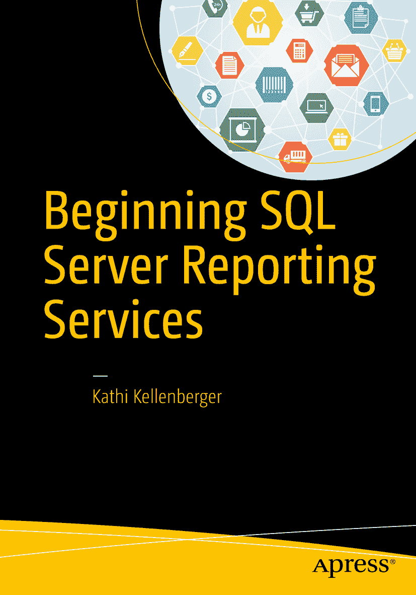

 凯西·凯伦伯格 著 SQL Server 报告服务入门

作者在文中引用的任何源代码或其他补充材料，读者均可访问 [`www.apress.com`](http://www.apress.com) 获取。有关如何定位您书籍源代码的详细信息，请访问 [`www.apress.com/source-code/`](http://www.apress.com/source-code/)。

`ISBN` 978-1-4842-1989-8
`e-ISBN` 978-1-4842-1990-4
`DOI` 10.1007/978-1-4842-1990-4
美国国会图书馆控制编号：2016951945
© 凯西·凯伦伯格 2016
SQL Server 报告服务入门

董事总经理：Welmoed Spahr
主编：Jonathan Gennick
技术审校：Rodney Landrum
编辑委员会：Steve Anglin, Pramila Balan, Laura Berendson, Aaron Black, Louise Corrigan, Jonathan Gennick, Robert Hutchinson, Celestin Suresh John, Nikhil Karkal, James Markham, Susan McDermott, Matthew Moodie, Natalie Pao, Gwenan Spearing
协调编辑：Jill Balzano
文字编辑：Lori Jacobs
排版：SPi Global
索引：SPi Global
美工：SPi Global
封面设计：由 Freepik.com 设计

有关翻译信息，请发送电子邮件至 `rights@apress.com`，或访问 [`www.apress.com`](http://www.apress.com)。Apress 和 friends of ED 的书籍可批量购买，用于学术、企业或推广用途。大多数图书也提供电子书版本和许可。更多信息，请参考我们的《批量销售-电子书许可》网页：[`www.apress.com/bulk-sales`](http://www.apress.com/bulk-sales)。

本作品受版权保护。出版者保留所有权利，无论涉及材料的全部或部分，具体包括翻译权、转载权、插图重用权、朗诵权、广播权、缩微胶片或其他任何物理方式的复制权，以及信息存储与检索、电子改编、计算机软件方面的传播权，或任何现在已知或未来开发的类似或不同的方法。本书中可能出现商标名称、标识和图像。我们并非在每次出现商标名称、标识和图像时都使用商标符号，而是仅以编辑方式并为商标所有者利益使用这些名称、标识和图像，无商标侵权意图。本书中使用的商品名称、商标、服务标志和类似术语，即使未特别标识，也不应被视作表达其是否受专有权约束的意见。尽管本书中的建议和信息在出版时被认为是真实准确的，但作者、编辑或出版商均不对可能存在的任何错误或遗漏承担任何法律责任。出版商对本材料不作任何明示或暗示的担保。本书使用无酸纸印刷。

本书通过 Springer Science+Business Media New York（地址：美国纽约州纽约市斯普林街 233 号 6 楼，邮编：10013）向全球图书贸易发行。电话：1-800-SPRINGER，传真：(201) 348-4505，电子邮件：`orders-ny@springer-sbm.com`，或访问 www.springer.com。Apress Media, LLC 是加利福尼亚州的有限责任公司，其唯一成员（所有者）是 Springer Science + Business Media Finance Inc (SSBM Finance Inc)。SSBM Finance Inc 是特拉华州的一家公司。

献给内特。我爱你帅气的小脸蛋！

## 致谢

又一次，我将话语付诸于书。对我而言，写作确实是爱的劳动。世界上最美好的事，莫过于在会议上遇到读过我的某本书并因此学会新技能的人。这本书献给你们所有感谢我写作的人，是你们让我知道，我改变了你们的职业生涯，甚至生活。

当然，我必须感谢我的丈夫和家人，容忍我经常说“不行——我得写书了”。我希望在你们真正需要我的时候，我都能陪伴在你们身边。

感谢罗德尼、乔纳森和吉尔帮助我顺利并出色地完成了这本书。感谢微软在 2016 版本中给予了 SQL Server 报告服务应有的重视。

最后，感谢每一位阅读本书的读者。希望你们能像我这些年来一样，享受使用 `SSRS` 的过程。

