# 第一部分
开始使用

## 1. 开始使用

电子补充材料 本章在线版本（doi:[10.1007/978-1-4842-1990-4_1](http://dx.doi.org/10.1007/978-1-4842-1990-4_1)）包含补充材料，可供授权用户使用。

在我的第一份数据库管理员工作中，我被要求查看一些报表的问题。这些报表是在`MS Access`中创建的，并链接到一个`SQL Server`数据库。每位经理都有自己版本的报表，尽管这些报表最初是一样的，但多年来被各位经理修改过。经理们抱怨说数据不一致，问我能不能解决这个问题。

我尽力去纠正这些差异，但报表的各个副本仍然存在。不久之后，我参加了 2003 年的 PASS 峰会，看到了关于`SQL Server Reporting Services (SSRS)`的发布公告。2004 年，微软发布了`SSRS`作为`SQL Server 2000`的加载项。我没有等待正式发布。我知道`SSRS`将解决我的`MS Access`报表问题，所以一有可用版本我就安装了`SSRS`。

与`MS Access`报表相比，`SSRS`带来的优势是集中化的网站——`报表管理器`，报表发布于此。经理们不再各自拥有报表副本，而是从一个中心位置运行报表，从而消除了数据不一致的问题。

`SQL Server Reporting Services`是微软商业智能堆栈的核心组件之一。`SSRS`是一个功能丰富的报表工具，现在包含了移动报表以及现代化的本地`Web 门户`。

`SSRS`具有许多交互功能、可视化元素（如图表和地图）、安全性等。报表可以包含以表格形式或可视化方式显示的数据。你还可以创建美观且信息丰富的仪表板。

要运行报表，最终用户需浏览到`Web 门户`并点击报表名称。在后台，`SSRS`从源数据库请求数据并构建报表。然后，报表被传送给最终用户。图 1-1 展示了这一过程。

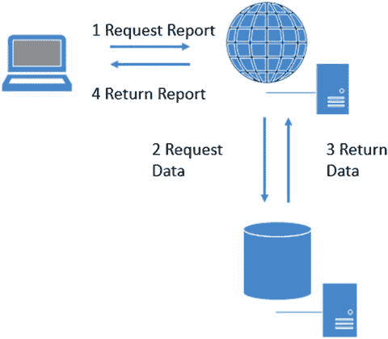

图 1-1.
报表步骤

## 理解 SSRS 架构

一个`SSRS`实现由多个组件构成，可以通过多种不同方式进行配置。至少，所有组件可以放在一台计算机上，甚至是一台笔记本电脑上。这种配置可能仅适用于开发环境，也是我建议你跟随本书示例进行操作时采用的配置。该配置包括一个`SQL Server`实例（其中包含`Reporting Services`）、源数据库以及在`Visual Studio`中运行的`SQL Server Data Tools (SSDT)`。

注意
`SSRS`也可以在`SharePoint`集成模式下安装。开发报表的方式与默认的（称为原生模式）相同。本书将重点介绍原生模式，但在第 8 章中确实有一节介绍如何将报表部署到`SharePoint`。

通常，在生产环境中，会有一台服务器专门用于运行`SSRS`，而源数据则来自网络中的其他服务器。报表开发人员会在他们的本地计算机上使用`SSDT`开发报表，然后将报表发布到生产服务器，或者可能发布到一个可以在上线前测试报表的服务器。

在学习如何在计算机上设置所有内容之前，你将了解更多关于`SSRS`组件的知识。首先，必须有一个`SQL Server`实例来承载`SSRS`数据库。该实例通常安装在运行`SSRS`服务的服务器上，但也可以是不同的服务器。当你安装或初始配置`SSRS`时，将创建两个数据库：`ReportServer`和`ReportServerTempDB`。`ReportServer`用于存储报表定义、安全性、历史记录以及已发布报表所需的所有其他信息。从`ReportServerTempDB`这个名称你大概能猜出，这个数据库是用作临时工作区的。

当你安装`SSRS`时，它会创建一个响应报表请求的 Web 服务。在原生模式下，它提供了一个`Web 门户`，用户可以在其中浏览和运行报表。在早期版本的`SSRS`中，这被称为`报表管理器`，但从 2016 版本开始，这个界面被完全重新设计。现在它就被称为`Web 门户`，类似于图 1-2。

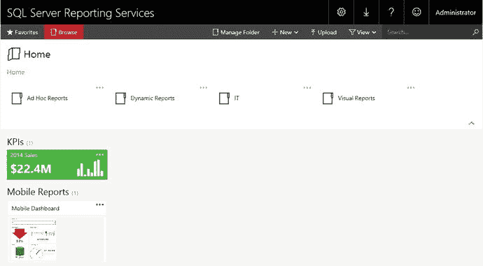

图 1-2.
`Web 门户`

数据源几乎可以来自任何地方。本书将展示来自`SQL Server`数据库的示例，但你也可以针对`Oracle`、`Analysis Services`多维数据集、`XML`文档、`SharePoint`列表、云数据库等创建报表。

## 安装带有 SSRS 的 SQL Server

您可以不安装 SSRS，仅安装开发工具，即可跟随本书中的许多示例进行操作。您也可以使用公司网络中已有的 SSRS 实例。不过，如果可能的话，我建议您在开发计算机上安装 SSRS。这样既能学习报表开发，也能了解一些管理任务的操作。

SQL Server 有多个版本。每个版本都有其特定的功能集和价格。对于开发和学习，您可以下载免费的 **Developer Edition**。只需在网上搜索“SQL Server Developer Edition download”即可找到下载文件。另外还有一个免费的 **Express Edition**，但其功能非常有限。

> 注意
>
> 在撰写本文时，安装介质是一个 iso 文件。我的 Windows 10 笔记本电脑可以轻松处理 iso 文件，但您的操作系统可能不行。如果需要，您可以搜索用于挂载或提取 iso 文件的实用程序。

从安装介质中，您应该能看到如图 1-3 所示的 `setup` 图标。

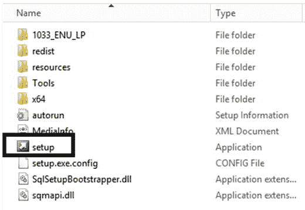

图 1-3. 安装图标

请按照以下说明安装带有 SSRS 的 SQL Server 实例：

1.  双击 `setup` 以启动 `SQL Server 安装中心`。
2.  点击左侧的 `安装`。
3.  点击顶部的 `新建 SQL Server 独立安装或向现有安装添加功能`，如图 1-4 所示。

    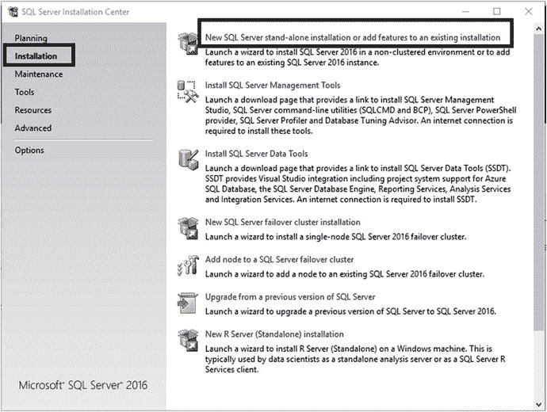

    图 1-4. SQL Server 安装中心

4.  安装向导将启动。在初始信息页面，点击 `下一步`。
5.  在 `许可条款` 页面，点击 `我接受许可条款` 并点击 `下一步`。
6.  在 `Microsoft 更新` 页面点击 `下一步`。
7.  检查更新后，在 `产品更新` 页面点击 `下一步`。
8.  在 `安装规则` 页面，等待完成后点击 `下一步`。如果有任何 `失败` 状态，您需要点击消息以查明问题并加以纠正。
9.  在 `功能选择` 页面，选择 `数据库引擎服务` 和 `Reporting Services – 本机`，如图 1-5 所示。

    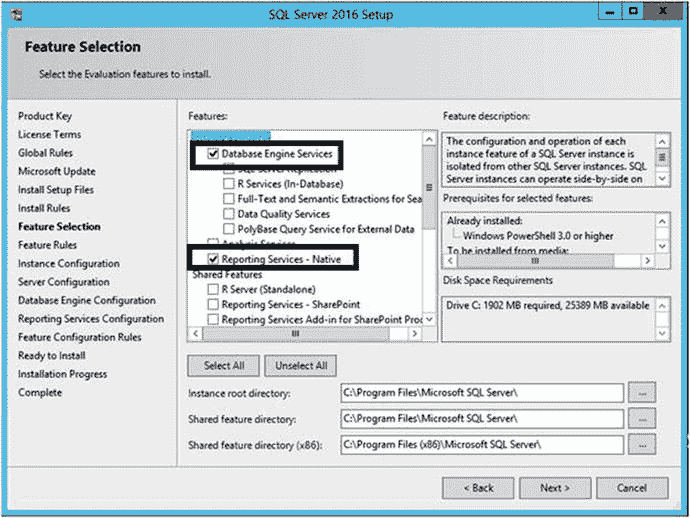

    图 1-5. 功能选择

10. 在 `实例配置` 页面，您必须决定是安装 `实例 ID` 为 `MSSQLSERVER` 的默认实例，还是安装命名实例。计算机上的每个 SQL Server 实例都必须是唯一的。如果已安装了其他 SQL Server 实例，您将看到它们被列出。如果没有其他默认实例，请选择 `默认实例` 并点击 `下一步`。否则，选择 `命名实例` 并在点击 `下一步` 之前键入一个名称。图 1-6 显示了此页面。

    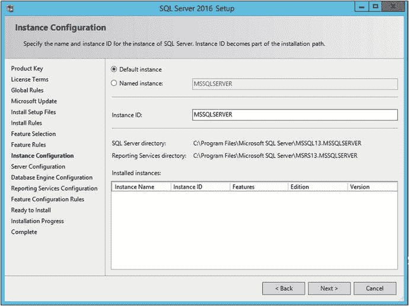

    图 1-6. 实例配置页面

11. 在 `服务器配置` 页面，接受默认设置并点击 `下一步`。
12. 在 `数据库引擎配置` 页面，点击 `添加当前用户`。这将使您的账户成为 SQL Server 的管理员。点击 `下一步`。
13. 在 `Reporting Services 配置` 页面，确保选择 `安装和配置`，如图 1-7 所示，然后点击 `下一步`。

    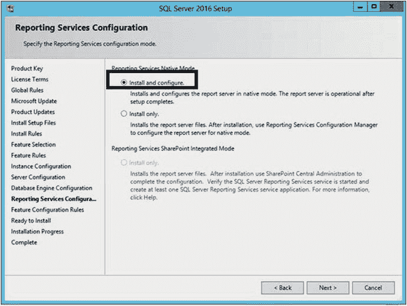

    图 1-7. Reporting Services 配置页面

14. 在 `准备安装` 页面，点击 `安装`。
15. 如果安装结束时要求您重启计算机，请按指示操作。

安装 SQL Server 实例和 SSRS 可能需要几分钟时间。可能导致安装失败的情况有几十种，我无法通过一本书来帮助您排查故障。我的建议是导航到 `C:\Program Files\Microsoft SQL Server\130\Setup Bootstrap\Log`。那里会有安装期间生成的消息的日志文件。如果安装失败，您可以使用找到的任何错误消息在互联网上搜索以寻求帮助和建议。也就是说，安装过程中您可能需要连接到互联网，并且可能需要以管理员身份运行 `setup` 才能成功安装。

先前版本的 SQL Server 允许您在安装 SQL Server 实例时一起安装 `SQL Server Management Studio` (`SSMS`)。从 SQL Server 2016 开始，Microsoft 计划频繁更新此工具，并且仅通过下载提供。要找到下载链接，如果您已关闭 `SQL Server 安装中心`，请重新启动它。在 `安装` 页面，点击 `安装 SQL Server 管理工具`。按照下载页面上的说明操作。

## 安装 SQL Server Data Tools

SSRS 的主要开发工具是前面提到的 `SSDT`，它运行在 `Visual Studio` 内部。Microsoft 在几个版本的 SQL Server 中更改了开发工具的名称和来源。曾几何时，您可以直接从 SQL Server 安装介质安装 `Business Intelligence Development Studio`，也称为 `BIDS`。后来，Microsoft 将其名称更改为 `SQL Server Data Tools – BI`，并且它是一个单独的下载。更令人困惑的是，还有另一个名为 `SSDT` 的产品用于数据库项目，而不是像报表这样的 BI 项目。幸运的是，在 2016 年，Microsoft 已将这两个产品合并为一个 `SSDT` 下载。

您可以在 `SQL Server 安装中心` 的 `安装` 页面上找到下载和安装 `SSDT` 的链接，如图 1-8 所示。

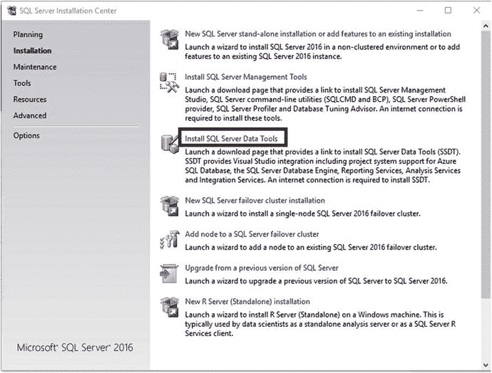

图 1-8. SQL Server Data Tools 的链接

在撰写本文时，您可以下载 `SSDTSetup.exe` 文件并从该文件安装，或者可以向下滚动页面下载 iso 文件。如果您下载了 iso 文件，则从该介质运行 `SSDTSetup.exe` 以开始安装。请按照以下步骤安装 `SSDT`：

1.  运行 `SSDTSetup.exe` 会启动向导。在第一页，确保 `SQL Server Reporting Services` 已被勾选，如图 1-9 所示。您也可以保留其他项的勾选状态。

    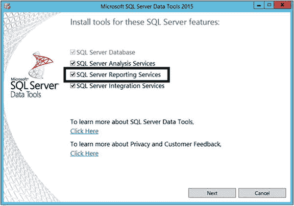

    图 1-9. SQL Server Reporting Services 已勾选

2.  点击 `下一步`。
3.  在 `许可条款` 页面，勾选 `我同意许可条款和条件`。
4.  点击 `安装`。

## 配置 SSRS

如果你严格按照“安装带有 SSRS 的 SQL Server”部分中的安装说明进行操作，`SSRS` 应该已经配置好了。反之，如果你是将 `SSRS` 添加到现有的 `SQL Server` 实例，或者在“Reporting Services 配置”页面上选择了“仅安装”，那么你现在就需要进行配置。要配置 `SSRS`，请按照以下步骤操作：

1.  启动 `Reporting Services 配置管理器`。
2.  当要求连接到你的 `SSRS` 实例时，如果需要，请选择服务器和实例名称，然后如图 1-10 所示点击 `连接`。

    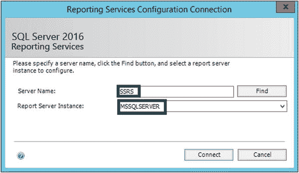

    图 1-10. 连接到 `SSRS` 实例。
3.  选择 `数据库` 页面，然后点击 `更改数据库`，如图 1-11 所示。

    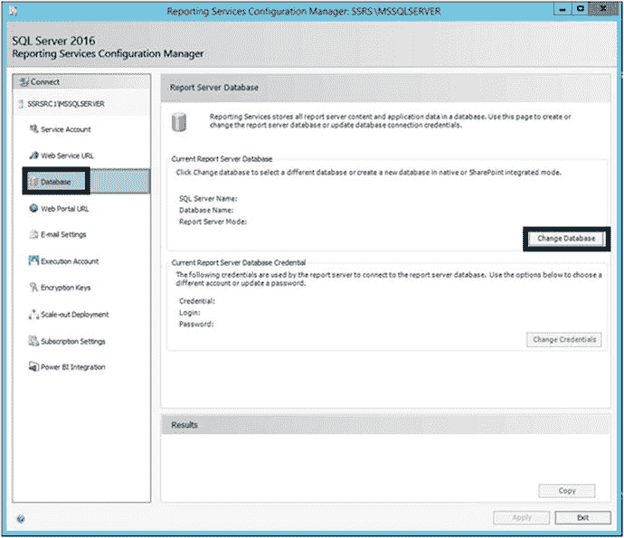

    图 1-11. `数据库` 页面。
4.  这将打开 `报表服务器数据库配置向导`。选择 `创建新的报表服务器数据库`，如图 1-12 所示。点击 `下一步`。

    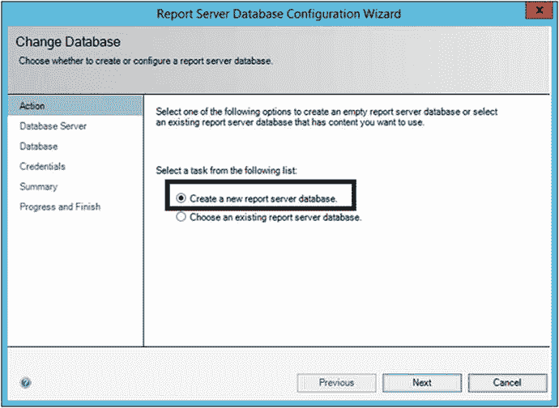

    图 1-12. 创建新的报表服务器数据库。
5.  在 `数据库服务器` 页面上，确保已填写你的服务器名称。如果你有命名实例，请务必包含实例名称。图 1-13 显示了此页面。

    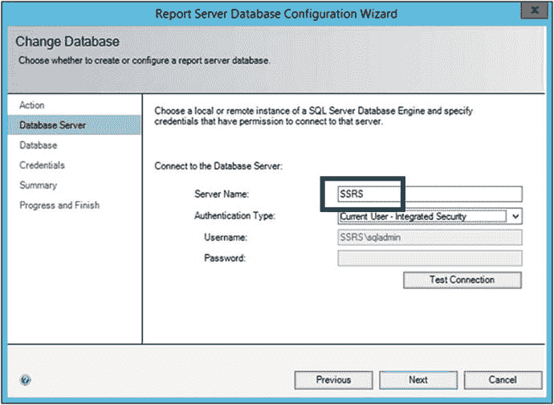

    图 1-13. 连接到数据库服务器。
6.  点击 `下一步` 转到如图 1-14 所示的 `数据库` 页面。接受此页面上的默认设置。如果你的安装是命名实例，实例名称将成为数据库名称的一部分。

    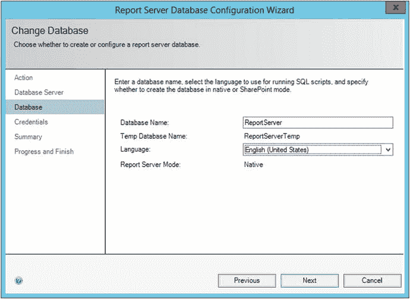

    图 1-14. `数据库名称`。
7.  点击 `下一步` 转到 `凭据` 页面。你可以在此页面上更改 `SSRS` 服务帐户。接受默认设置并点击 `下一步`。
8.  点击向导中剩余页面的 `下一步` 以创建 `SSRS` 数据库。
9.  过程完成后，点击 `完成`。
10. 要创建 `Web 服务 URL`，请选择 `Web 服务 URL` 页面，如图 1-15 所示。

    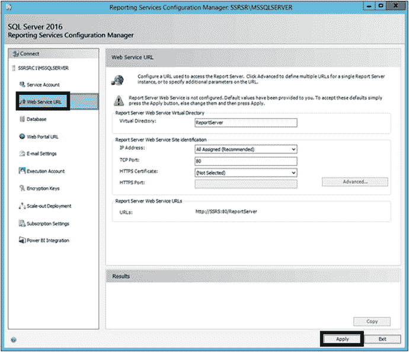

    图 1-15. `Web 服务 URL` 页面。
11. 对于你自己的 `SSRS` 安装，只需接受默认设置并点击 `应用`。这将设置 Web 服务。
12. 任务完成后，选择 `Web 门户 URL` 页面。再次，你可以接受默认设置并点击 `应用`。这将创建 Web 门户。
13. Web 门户创建完成后，点击如图 1-16 所示的 `加密密钥` 页面。点击 `备份` 以保存加密密钥。

    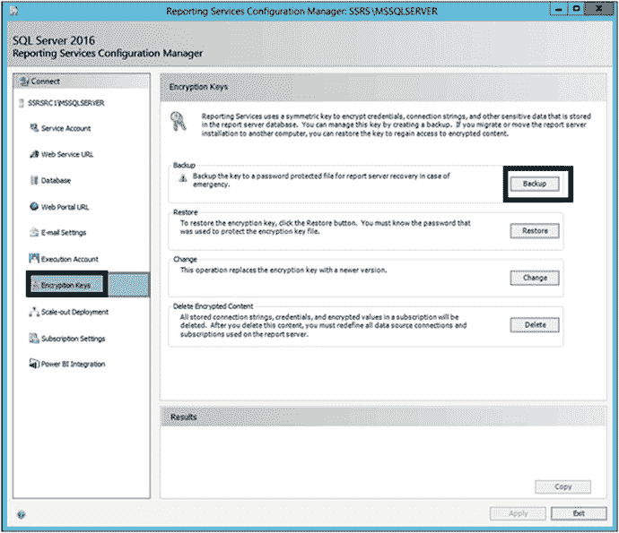

    图 1-16. 备份加密密钥。
14. 提供一个你不会忘记的位置和密码。此步骤在生产环境中尤其重要。加密密钥是还原或移动数据库所必需的。
15. 点击 `退出` 以关闭 `SSRS 配置管理器`。

现在 `SSRS` 应该已经配置好了。在第 8 章中，你将学习如何发布报表。届时，你将返回此工具以确定 Web 服务 URL 和 Web 门户 URL。

## 配置本地 SSRS 设置

如果你在本地安装 `SSRS` 实例，会遇到一个与安全相关的非常令人沮丧的问题。为了启动 Web 门户或发布报表，你需要以管理员身份运行 Web 浏览器和 `SSDT`。此功能有助于防止应用程序在你不知情和未经许可的情况下对操作系统进行更改。

要解决此问题，请按照以下步骤操作：

1.  通过启动 `Reporting Service 配置管理器` 来确定 Web 门户 URL。点击 `Web 门户 URL` 页面并记下链接。不要点击它。
2.  使用 `以管理员身份运行` 选项启动你的 Web 浏览器。
3.  导航到在步骤 1 中确定的 URL。
4.  打开 Web 浏览器的安全设置，并将当前站点添加到 `受信任的站点`。
5.  点击 `确定` 并关闭浏览器。
6.  再次使用 `以管理员身份运行` 选项启动浏览器。
7.  再次导航到 Web 门户 URL。
8.  点击如图 1-17 所示的 `管理文件夹`。

    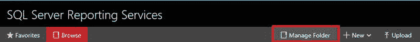

    图 1-17. `管理文件夹` 链接。
9.  点击 `添加组或用户`。
10. 在 `组或用户` 中输入你的计算机名或域名加上帐户。
11. 选择 `内容管理器` 作为角色。对话框将类似于图 1-18。

    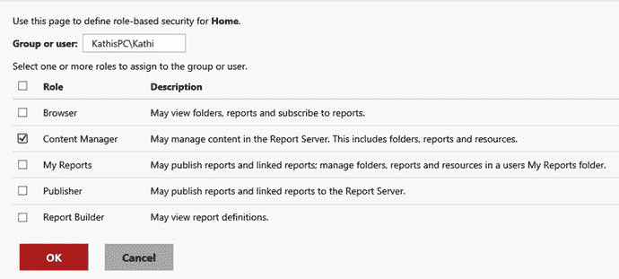

    图 1-18. `主页` 的安全性设置。
12. 点击 `确定`。
13. 点击页面右上角的齿轮图标，选择 `站点设置`，如图 1-19 所示。

    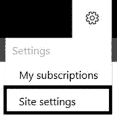

    图 1-19. `站点设置` 链接。
14. 选择 `安全性` 页面。
15. 点击 `添加组或用户`。
16. 输入你的帐户名并点击 `系统管理员`。对话框将如图 1-20 所示。

    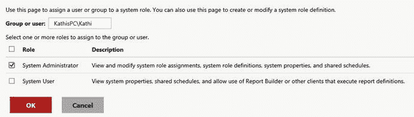

    图 1-20. 站点设置。
17. 点击 `确定`。

你将在第 9 章中了解更多关于这些安全设置的信息。如果你已遵循这些说明，但在启动 Web 门户或发布报表时仍然遇到安全错误，请参阅以下网址的文章以获取更多信息：[`https://msdn.microsoft.com/en-us/library/bb630430.aspx`](https://msdn.microsoft.com/en-us/library/bb630430.aspx)。

## 确定 SQL Server 名称

要遵循本书中的示例，在创建数据源时，你需要连接到你的 `SQL Server` 实例。`SQL Server` 名称由两部分组成：计算机名和实例名。例如，位于名为 `MyServer` 的服务器上、实例名为 `Inst1` 的 `SQL Server` 可以通过 `MyServer\Inst1` 访问。通常，`SQL Server` 会被安装为默认实例。在这种情况下，你不需要提供实际上是 `MSSQLSERVER` 的实例名；你只需提供计算机名即可。

在“安装带有 SSRS 的 SQL Server”部分中，你被指示将 `SQL Server` 安装为默认实例。如果你提供了实例名，那么你将需要该名称来连接数据库。要找出实例名，你需要启动 `SQL Server 配置管理器`。

**注意：** 如果你使用的是网络 `SQL Server` 而不是本地安装的实例，请向负责该服务器的人员询问正确的计算机名和实例名。

`配置管理器` 运行后，点击 `SQL Server 服务`。如果你看到 `MSSQLSERVER`，则表示你有一个默认实例。如果你看到其他任何名称，那就是你的实例名。图 1-21 显示了一个默认实例和一个名为 `SSRS` 的命名实例。

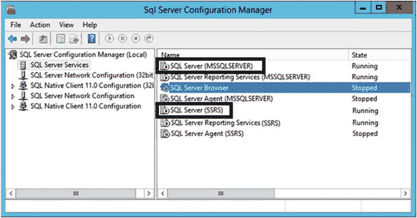

图 1-21. `SQL Server 配置管理器`。

`SQL Server 配置管理器` 实用程序还有许多其他用途，这些超出了本书的范围。

## 恢复 AdventureWorks 数据库

要跟随本书中的示例进行操作，需要准备好若干要素。最后一项是 AdventureWorks 数据库，它经常被用作 SQL Server 的示例数据库。由于下载地址会不时变化，请浏览 [`www.codeplex.com`](http://www.codeplex.com) 并搜索 Microsoft SQL Server Product Samples: Databases。在该页面上，你可能会看到指向几个不同版本的链接。请务必找到 `AdventureWorks2016.bak` 的下载链接。

> 注意
>
> 在发布 SQL Server 2016 时，CodePlex 页面提供了 `AdventureWorks2016CTP3.bak` 文件，但没有提供 `AdventureWorks2016.bak` 文件。CTP3 代表 Community Technology Preview 3（社区技术预览版 3），是 SQL Server 的 Beta 版本。如果正式发布版本不可用，CTP3 版本也可以使用，但你将在还原过程中需要更改数据库名称。

请按照以下步骤还原数据库：

1.  下载 `AdventureWorks2016.bak` 或 `AdventureWorks2016CTP3.bak` 文件。
2.  下载的文件很可能保存在你的“下载”文件夹中。为了还原文件，你需要移动它。如果 `C:\temp` 文件夹不存在，请创建它。将文件移动到这个新文件夹。
3.  启动 SQL Server Management Studio。
4.  在提示连接时，使用你在上一节中确定的服务器名称。如果你在本地安装了 SQL Server，可以使用 `localhost`、`(local)` 或一个点号 `.`，如图 1-22 所示。

    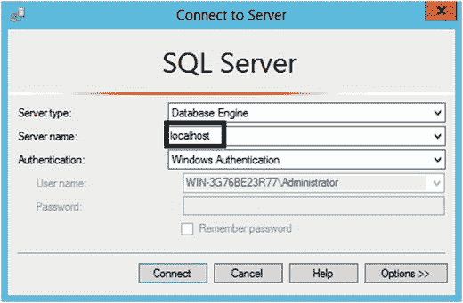
    图 1-22. 连接到服务器对话框

5.  点击“连接”按钮。
6.  在“对象资源管理器”中，右键单击“数据库”，然后选择“还原数据库”，如图 1-23 所示。

    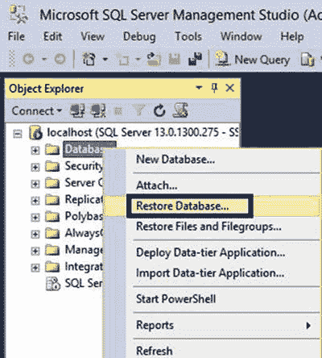
    图 1-23. “还原数据库”选项

7.  在“还原数据库”对话框中，选择“设备”。
8.  点击省略号按钮（...），如图 1-24 所示。

    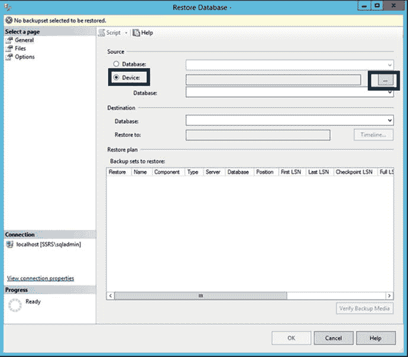
    图 1-24. “还原数据库”对话框

9.  在“选择备份设备”对话框中，点击“添加”，然后导航到文件所在位置，如图 1-25 所示。

    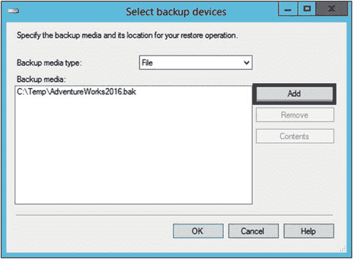
    图 1-25. “选择备份设备”对话框

10. 点击“确定”接受该文件。
11. 如果唯一可下载的是 CTP3 文件，请将数据库属性从 `AdventureWorks2016CTP3` 更改为 `AdventureWorks2016`。
12. 点击“确定”开始还原。
13. 还原完成后，点击“确定”关闭还原实用工具。
14. 展开并刷新“数据库”文件夹。你应该能看到 `AdventureWorks2016` 数据库已就位，如图 1-26 所示。

    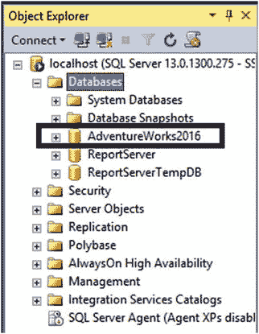
    图 1-26. 新数据库

15. 退出 SSMS。

在此例中，数据源和 SSRS 数据库托管在同一 SQL Server 实例上。在大多数生产环境中，它们会托管在单独的服务器上。

## 探索 SSDT

在本书的许多章节中，你将花相当多的时间使用 SSDT。现在花些时间，通过以下步骤熟悉它：

1.  启动 Visual Studio 2015。
2.  由于这是首次启动，你必须配置几项设置。选择“商业智能设置”。
3.  选择你喜欢的主题，如图 1-27 所示。

    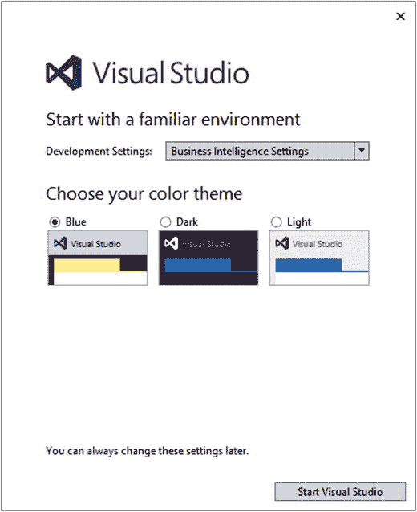
    图 1-27. 设置环境

4.  点击“启动 Visual Studio”。
5.  Visual Studio 运行后，选择 `文件 ➤ 新建 ➤ 项目`，如图 1-28 所示。

    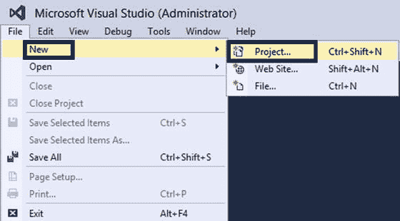
    图 1-28. 创建新项目

6.  在“新建项目”对话框中，选择 `报表服务器项目`，如图 1-29 所示。

    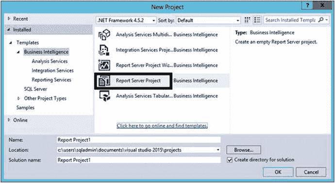
    图 1-29. 选择报表服务器项目

7.  点击“确定”创建项目。

开发报表时，你会用到几个窗口。从第 2 章开始，你将详细了解它们。现在，如果你不熟悉 Visual Studio，花些时间学习一下这些窗口的工作方式。每个窗口都可以重新定位、自动隐藏或关闭。图 1-30 显示了每个窗口顶部的图标。

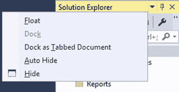
图 1-30. 窗口图标

你也可以通过点击图钉图标来启用“自动隐藏”功能，这会隐藏窗口而不实际关闭它。你可以在程序边缘看到标题，点击标题，窗口就会在你需要时打开。这是一个很实用的功能，可以为你提供更多的工作空间。

通过点击并拖动窗口标题，你可以移动窗口。要查看窗口最终会放置在哪里，请在鼠标悬停时注意标记以及高亮显示的区域，如图 1-31 所示。当你放下窗口时，它将最终落在高亮显示的区域。

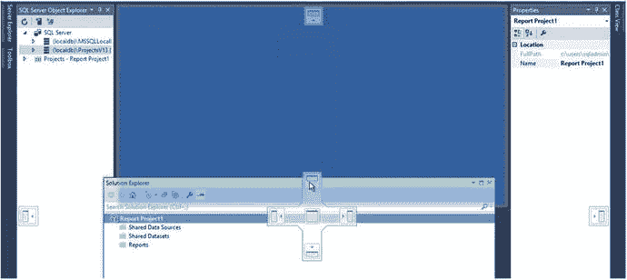
图 1-31. 移动窗口

如果你关闭了一个窗口，总是可以通过查看“视图”菜单将其找回。如果你决定恢复到默认配置，请点击 `窗口 ➤ 重置窗口布局`。

当你关闭 Visual Studio 后，下次打开时，你可以通过 `文件 ➤ 最近的文件和解决方案` 轻松打开上一个项目。你也可以选择 `文件 ➤ 打开 ➤ 项目/解决方案` 并浏览到该项目。

你可能想知道项目和解决方案之间的区别。解决方案只是一个容器，包含一个或多个项目。这些项目可以是相同类型，例如都是 SSRS 项目。在某些情况下，项目可能与一个主题领域相关，但可能都是不同的技术类型。例如，同一个解决方案中可能包含一个数据库项目、一个 SSRS 项目、一个 SQL Server Integration Services 项目和一个 SQL Server Analysis Services 项目。例如，该解决方案可用于开发一个数据集市。

根据设置的值，解决方案名称仅当其包含多个项目时才会显示。如果你愿意，可以通过选择 `工具 ➤ 选项` 来修改该设置。在“选项”对话框中，展开“项目和解决方案”并选择“常规”页面。如果选中了 `始终显示解决方案`，即使解决方案只包含一个项目，其名称也会显示。图 1-32 显示了如果你想进行设置更改时的对话框。

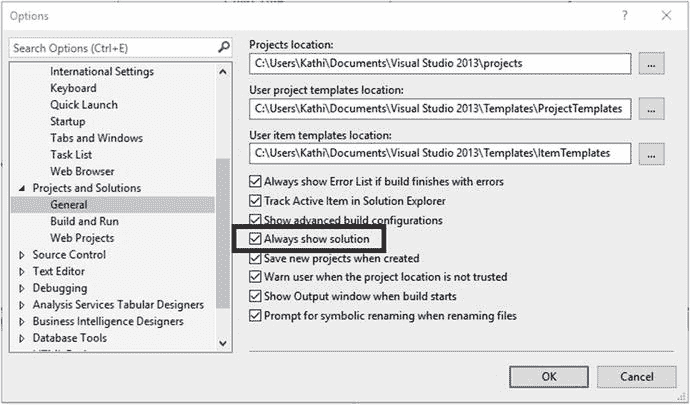
图 1-32. “始终显示解决方案”选项

## 总结

SQL Server Reporting Services 是 SQL Server 的一项强大功能，允许你创建可供组织部署使用的报表。SSRS 2016 拥有一个全新的、名为 Web 门户的用户界面，其中包含传统的分页报表、关键绩效指标（KPI）和移动报表。

要设置你的开发环境，你需要下载并安装几个组件。幸运的是，它们都是微软提供的免费下载。遵循本章的指导，你将准备好学习如何开发和发布 SSRS 报表。

在第 2 章中，你将学习如何使用向导创建你的第一份报表。

