# 2. 使用向导创建你的第一份报表

现在环境已经就绪，你可以开始学习 SQL Server Reporting Services (SSRS) 报表开发了。在深入研究众多细节之前，你可以先利用一个内置向导来快速创建报表。

软件向导会通过询问用户一系列问题来自动化一个复杂的过程。我喜欢把它们比作亨利·福特使用的汽车装配线。福特先生曾说：“任何顾客都可以把车漆成他想要的任何颜色，只要它是黑色的。”如今你购买汽车时有许多选择，但如果你想要制造商没有提供的东西，就必须后期自行添加。

向导可以为你完成大量工作，但不可能囊括每份报表可能需要的所有功能。简单的报表，经过一些调整，可能就足以用于部署了。至少，这是一个绝佳的学习起点。

## 创建你的第一份报表

使用向导，你可以向现有项目中添加新报表。在本练习中，你也将使用它来创建项目。

请按照以下说明启动项目：

1.  启动 `SQL Server Data Tools 2015`。如果你找不到它，并且你已按照第 1 章的说明操作，请改为查找 `Visual Studio 2015`。
2.  点击 `文件` ➤ `新建` ➤ `项目`，以打开“新建项目”对话框。
3.  在左侧，展开 `已安装`、`模板` 和 `商业智能`。
4.  选择 `Reporting Services`。
5.  选择 `报表服务器项目向导`，如图 2-1 所示。

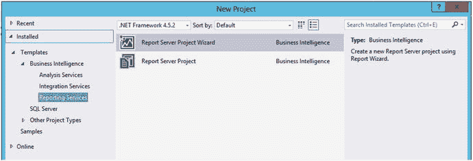

*图 2-1. 选择报表服务器项目向导*

在对话框底部，你需要填写项目和解决方案的名称以及项目的位置。默认情况下，项目保存在 `Visual Studio 2015` 下 `我的文档` 中的 `Projects` 文件夹里。我建议你在自己喜欢但易于找到的位置，专门为本书相关操作创建一个目标文件夹。对于 `名称`，输入 `Wizard Reports`。这实际上是项目的名称。当你输入项目名称时，它会自动填充 `解决方案名称`。请覆盖它，输入 `Beginning SSRS Chapter 2`。在点击 `确定` 之前，请确保属性看起来与图 2-2 中的类似。在这个例子中，我创建了一个名为 `Learn SSRS` 的文件夹，用于存放与本书相关的所有项目和解决方案。

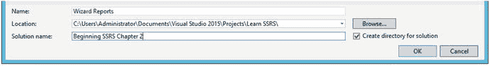

*图 2-2. 项目的名称和位置*

点击 `确定` 创建项目后，报表向导将启动。请按照以下说明逐步操作向导：

1.  点击 `下一步` 跳过欢迎界面。
2.  `选择数据源` 屏幕允许你设置与数据的连接，称为数据源。你将在第 3 章了解更多关于数据源的知识。在本练习中，点击图 2-3 中所示的 `编辑`，以打开 `连接属性` 对话框。

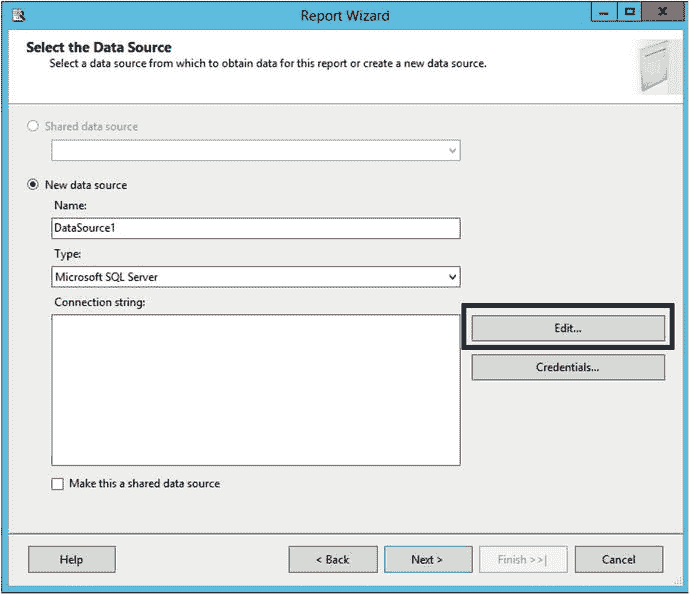

*图 2-3. 选择数据源对话框*

3.  确保 `数据源` 属性设置为 `Microsoft SQL Server (SqlClient)`。
4.  接下来你必须填写你的 `服务器名称`。你可以使用 `(local)`、`localhost` 或一个点号 (`.`) 来指定本地安装的 SQL Server。如果你的实例有实例名称，例如 `Inst1`，你需要在后面加上反斜杠和实例名称：`(local)\Inst1`。如果你不确定你的实例名称，请参阅第 1 章的“确定 SQL Server 名称”部分。如果你的 SQL Server 实例安装在网络上，请向你的数据库管理员寻求帮助。
5.  如果你的 SQL Server 是本地安装的，在 `登录到服务器` 属性中接受默认的 `使用 Windows 身份验证`。否则，请咨询你的数据库管理员，确认你将使用 Windows 身份验证，还是需要提供用户名和密码。
6.  在 `连接到数据库` 部分，选择 `选择或输入数据库名称`，然后在列表中找到 `AdventureWorks2016`。

**注意**

在 SQL Server 2016 发布时，微软尚未提供 `AdventureWorks2016` 数据库。取而代之的是一个名为 `AdventureWork2016ctp3` 的测试版数据库。如果你的数据库名为 `AdventureWorks2016CTP3`，请在 SSMS 的新查询窗口中运行以下命令来更改其名称：

```
ALTER DATABASE AdventureWorks2016CTP3 MODIFY NAME = AdventureWorks2016;
```


1.  点击`Test Connection`，如果测试成功，点击`OK`关闭对话框。如果测试失败，可能需要向数据库管理员寻求帮助，或者确保您提供了正确的信息。
2.  属性将类似于图 2-4 所示。检查无误后，点击`OK`创建数据源。

    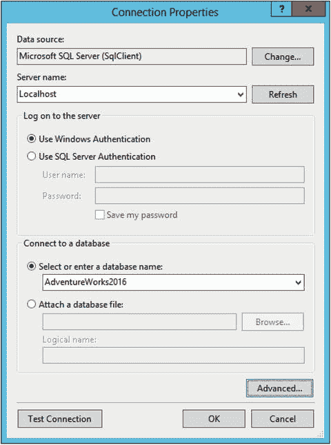
    *图 2-4. 连接属性*
3.  `Select the Data Source`对话框将类似于图 2-5。`ConnectionString`属性会根据您的`SQL Server`实例而有所不同。

    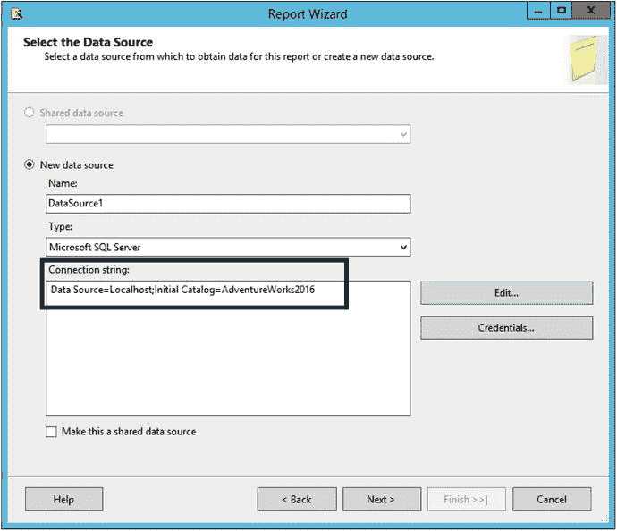
    *图 2-5. 数据源属性*
4.  点击`Next`进入`Design the Query`页面。在此页面，您可以使用`Query Builder`可视化地创建查询，也可以直接输入查询而无需额外辅助。由于本书并非旨在教授您`T-SQL`，查询语句已提供。作者所著的《Beginning T-SQL (Third Edition)》（Apress，2014）可用于学习更多关于`T-SQL`查询语言的知识。
5.  输入或粘贴以下代码（该代码可在 Apress 网站 Apress.com 的源代码/下载区域找到），然后点击`Next`。

    ```sql
    SELECT T.[Group], T.Name AS Region, YEAR(OrderDate) AS OrderYear,
    Month(OrderDate) AS OrderMonth, OrderDate, SalesOrderID, TotalDue
    FROM Sales.SalesOrderHeader AS SOH
    JOIN Sales.SalesTerritory AS T ON SOH.TerritoryID = T.TerritoryID;
    ```

6.  在`Select the Report Type`页面，确保选择`Tabular`。本章稍后将创建`Matrix`报告。点击`Next`。
7.  在`Design the Table`页面，您将指定哪些信息构成报告的分组级别。关于分组级别的更多内容将在第 5 章学习。现在，请按照图 2-6 配置页面。

    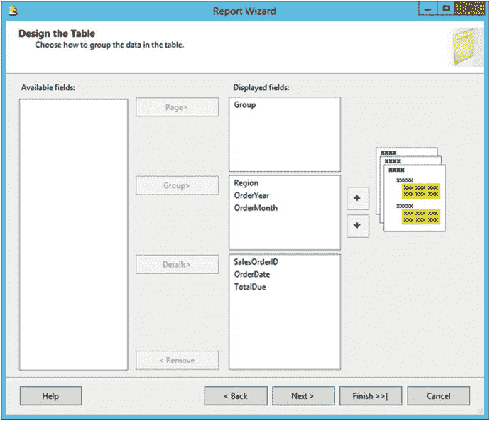
    *图 2-6. 数据分组*
8.  点击`Next`进入`Choose the Table Layout`页面。确保如图 2-7 所示，选中`Stepped`、`Include subtotals`和`Enable drilldown`。

    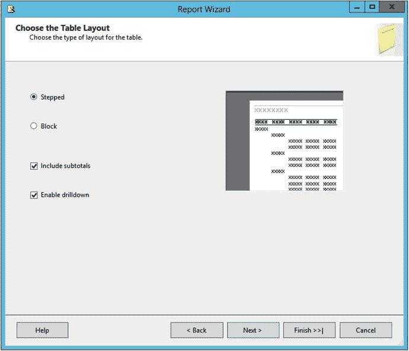
    *图 2-7. 表格布局*
9.  在向导的最后一页，在`Report Name`属性中输入`First Report`，然后点击`Finish`。

    > **注意**
    >
    > 在之前版本的`SQL Server`中，向导有一个额外的页面用于选择配色方案。在`SQL Server 2016`发布时，此选项不可用。

向导完成后，您将拥有一个全新的解决方案、项目和报告。报告将以设计视图显示，如图 2-8 所示。

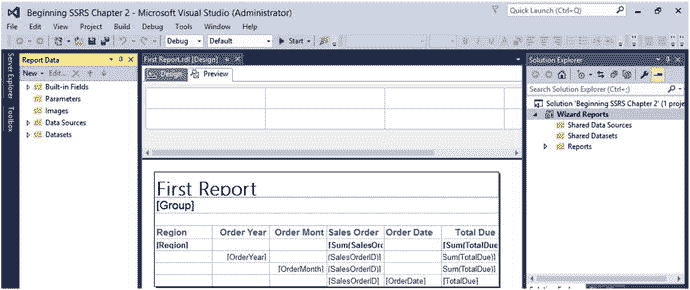
*图 2-8. 设计视图中的报告*

在`Visual Studio`中，您可以通过三种方式查看报告：设计、预览和代码。要查看代码，请在展开`Solution Explorer`中的`Reports`文件夹后，右键单击报告名称并选择`View Code`。图 2-9 显示了部分代码文件，它是`XML`格式。

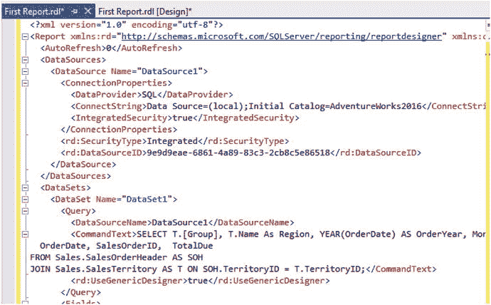
*图 2-9. 报告代码*

关闭代码窗口，点击`Preview`运行报告。图 2-10 显示了报告的第一页。

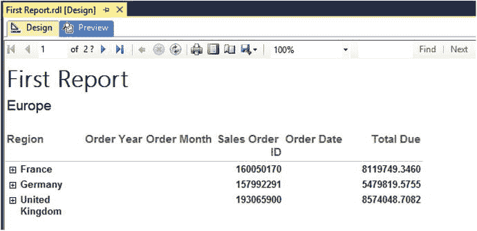
*图 2-10. 报告第 1 页*

请注意，您看到的是第 1 页，但总页数显示为“2？”。为了更快地将结果返回给最终用户，报告的开头部分可能在中间和结尾部分构建完成之前就已返回。点击右箭头查看更多页面。当您到达报告的最后一页时，问号会消失，因为此时已知总页数，如图 2-11 所示。

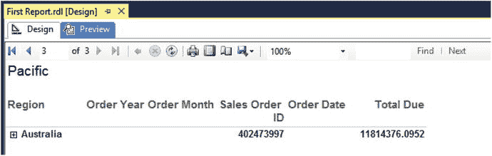
*图 2-11. 报告的最后一页*

在向导的`Choose the Table Layout`页面（参见图 2-7），您勾选了`Enable drilldown`属性。这就是为什么您在`Australia`旁边看到加号的原因。点击加号展开该部分。`Order Year`数据现在可见。点击展开`2011`和`Order Month 6`。现在该部分的详细信息就显示出来了。要查看`drilldown`属性的设置方式，请转到设计视图并选择`Region`行。在报告下方的`Row Groups`部分，右键单击`table1_OrderYear`组并选择`Group Properties`。`Visibility`页面显示了`Region`如何控制`OrderYear`组的可见性，如图 2-12 所示。根据我的实践经验，这个功能并不常用。

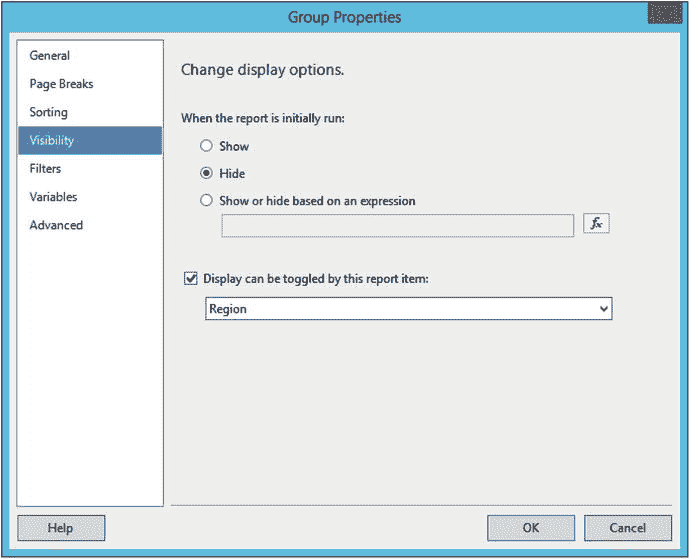
*图 2-12. 可见性属性*

再次预览报告并展开各个部分。图 2-13 显示了报告应有的样子。

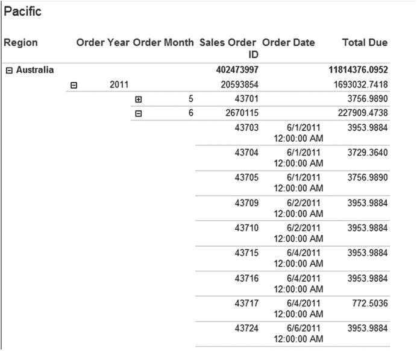
*图 2-13. 报告*

### 使用预览按钮

您可能会注意到此报告存在一些格式问题，但在学习如何纠正它们之前，请先看一下预览报告时位于报告上方、如图 2-14 所示的按钮。

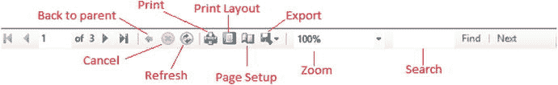
*图 2-14. 报告预览图标*

在导航控件的右侧，您会看到一个指向左边的箭头，即`Back to parent`按钮。在第 6 章开发相互链接的报告时会用到它。您还会看到一个用于停止执行长时间运行的报告的按钮和一个刷新报告的按钮。中间是一个`Print`按钮。最有趣的按钮位于`Print`按钮的右侧。

#### 打印布局按钮

在大约十几年前部署了一组报告后，我接到了项目经理的紧急电话。她问道，为什么报告在每一页打印内容后都会打印一页空白？当然，在从`Visual Studio`或`Report Manager`预览报告时，报告看起来是完美的。只有在打印时，问题才会显现出来。

为了查看报告在打印时的实际效果，您应该点击`Print Layout`按钮。该按钮就在打印按钮的右侧，可在在线视图和打印视图之间切换。

通过在打印布局视图中滚动浏览报告页面，您可以发现并纠正问题，然后再部署报告。在部署之前，请务必以打印布局视图查看您创建的每个报告。

#### 页面设置按钮

`Page Setup`按钮允许您调整报告的边距，并选择纸张大小、来源和方向。默认情况下，报告的页边距为一英寸。这些边距可能过大。通过修改属性，您可以确保报告更好地适应打印页面。关于使报告适应页面的其他方法，将在第 4 章学习。图 2-15 显示了`Page Setup`对话框。

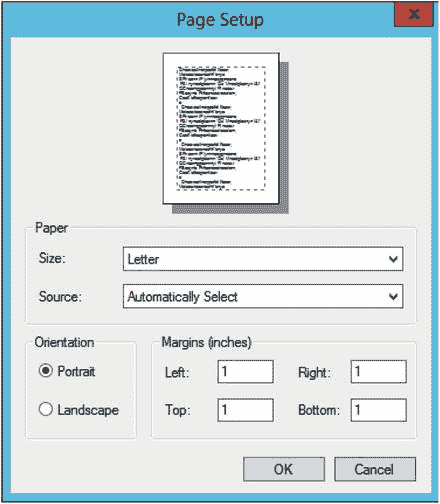
*图 2-15. 页面设置对话框*


### 额外的按钮

对最终用户而言，导出报告与打印报告同等重要。系统提供了带有多种导出类型的`导出`按钮，例如导出为 XML、Excel、Word 和 PDF。导出报告的结果会因导出类型的功能而异。

你可以使用`缩放`按钮将预览窗口放大到多种尺寸，并通过`查找`和`下一个`按钮在报告中搜索文本。

## 格式化向导报告

通过向导创建的表格报告看起来很不错，但它仍有改进空间。在预览时，我列出了需要修复的事项清单：
*   从`OrderDate`中移除时间
*   将美元金额四舍五入到最近的分
*   将金额格式设置为货币
*   移除`SalesOrderID`的汇总值
*   将`OrderMonth`从数字更改为月份名称
*   调整列宽
*   为每个`组`以及整个报告添加总计。

点击`设计`以查看报告的设计视图。在网格底部找到`OrderDate`字段。右键单击该单元格并选择`文本框属性`。

**注意**
在表格网格中选择单元格可能需要一些练习。你可以选择单元格或其内容。选择单元格时，它将显示轮廓。如果遇到困难，请尝试点击单元格的边缘。

在`文本框属性`对话框中，选择左侧的`数字`。在`类别`下，选择`日期`。对于类型，选择一种不包含时间的日期格式，如图 2-16 所示，然后点击`确定`。

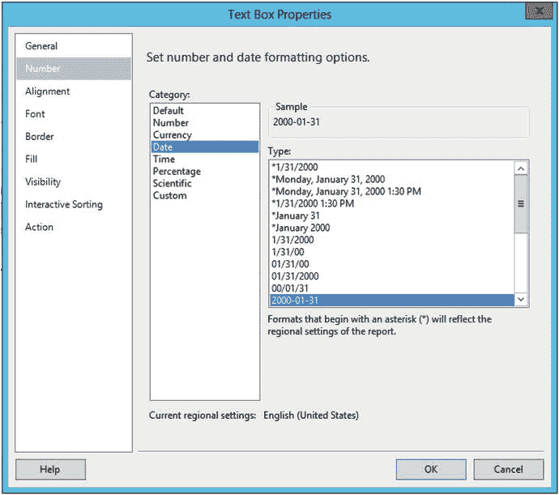
图 2-16. 更改日期格式

右键单击网格右下角的`TotalDue`单元格并选择`文本框属性`。选择`数字`，但这次选择`货币`。勾选`使用千位分隔符 (,)`。如果你在美国，其属性将如图 2-17 所示。

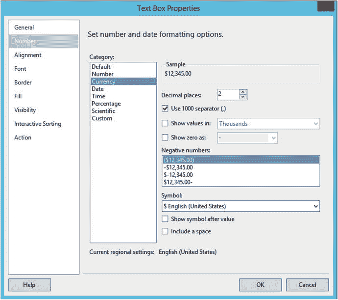
图 2-17. 格式化 `TotalDue` 字段

点击`确定`接受该格式。现在，为了避免对三个汇总字段重复此过程，请调出`属性`窗口。你可以通过按 `F4` 键或在`视图`菜单中找到它。定位到`格式`属性。图 2-18 显示了你要找的内容。

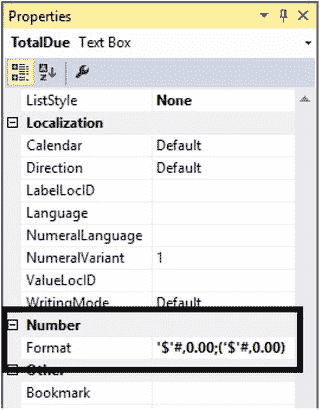
图 2-18. `格式` 属性

将`格式`值复制到`剪贴板`。按住 Shift 键并选择`TotalDue`标题下的三个汇总框。现在属性窗口会同时针对这三个文本框进行选择。找到`格式`属性并粘贴该值。

你可以随时预览报告以检查进度。每次预览时，报告定义都会被保存。此时，在展开各部分后，报告应类似于图 2-19。

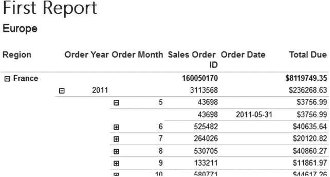
图 2-19. 应用了一些格式的报告

向导自动为`SalesOrderID`列创建了汇总，因为它包含数字数据。对该值求和没有意义。返回设计视图，点击包含该公式的每个单元格并按删除键以移除`[Sum(SalesOrderID)]`。需要从第二、第三和第四行中移除它。

清单上的下一项是将`Order Month`列更改为显示月份名称。要将其更改为显示名称，请按照以下步骤操作：
1.  在设计视图中，右键单击`OrderMonth`单元格并选择`表达式`。
2.  这将打开`表达式`对话框。你可以看到现有表达式`=Fields!OrderMonth.Value`。
3.  展开`类别`框中的`常用函数`。
4.  选择`日期和时间`。
5.  将光标定位在等号和表达式中的字母 F 之间。
6.  在`项`列表中双击`MonthName`。
7.  在表达式末尾添加一个右括号。表达式现在应为`=MonthName(Fields!OrderMonth.Value)`。`表达式`对话框应如图 2-20 所示。

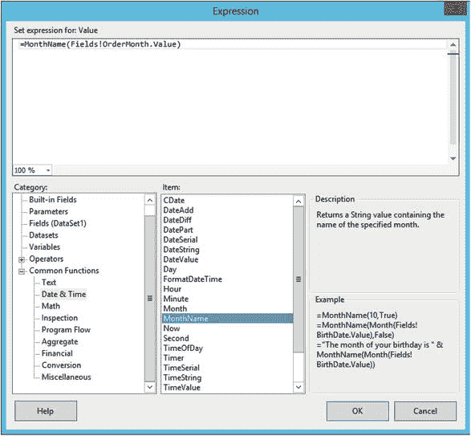
图 2-20. 月份名称的表达式

8.  验证表达式后点击`确定`。由于表达式变得更复杂，单元格值将变为`<<Exp>>`。

有些标题如果列更宽一些会更好看。当表格被选中时，顶部和左侧会出现控制柄。通过在顶部控制柄的列之间点击并拖动，你可以扩展或缩小列宽以容纳列标题。

清单上还有一项任务，添加一个总计和一个每个`组`（`美国`、`欧洲`和`太平洋`）的总计。这比你想象的要容易。你将在第 2 章了解更多关于使用分组级别的内容，但目前要理解，添加在一个级别的总计会显示在上一个级别。例如，在`区域`级别添加的总计会显示在`组`级别。请按照以下步骤添加`组`总计：
1.  在设计视图中，右键单击位于`区域`和`应纳税额`的单元格，如图 2-21 所示。

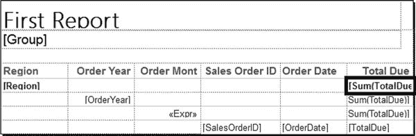
图 2-21. 位于 `区域` 和 `应纳税额` 的单元格

2.  选择`添加总计`。网格底部将出现一个新行，其中包含`[Sum(TotalDue)]`表达式。
3.  在网格底部的`销售订单 ID`列对应的单元格中输入以下内容：`[组]的总计`。请注意，你能够在同一个单元格中包含文本和字段（称为占位符），而无需创建表达式。

报告定义应如图 2-22 所示。

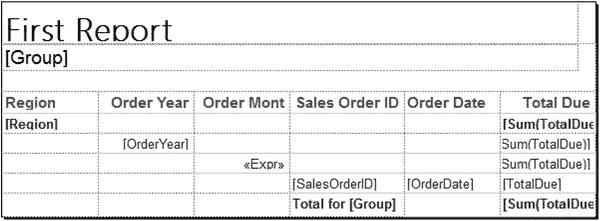
图 2-22. 添加`组`总计后的报告定义

在设计窗口的底部，你会看到`行组`和`列组`部分，你将在第 5 章了解更多关于它们的内容。分组级别可以在这些部分中添加和配置。选择报告顶部的`组`文本框，这会改变`行组`部分中显示的内容。右键单击`行组`下的`list1_Group`，然后选择`添加总计` ➤ `之后`，如图 2-23 所示。

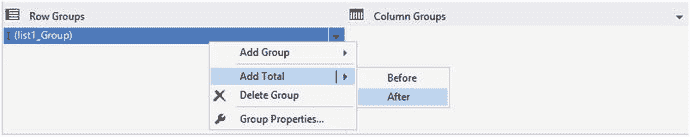
图 2-23. 添加总计

这只是添加了一行，你还需要在其中添加表达式。右键单击报告底部的新文本框并选择`表达式`。输入此表达式并点击`确定`：

```
="总计 " & FormatCurrency(Sum(Fields!TotalDue.Value),2,0,True,True)
```

在屏幕顶部，你会看到一个格式化菜单栏，如图 2-24 所示。此菜单栏类似于在其他程序（如 Microsoft Word）中的操作。

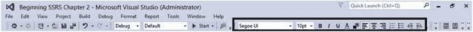
图 2-24. 格式化菜单栏

确保选中新文本框，然后单击右对齐图标。点击`B`图标以加粗文本。报告定义现在应类似于图 2-25。

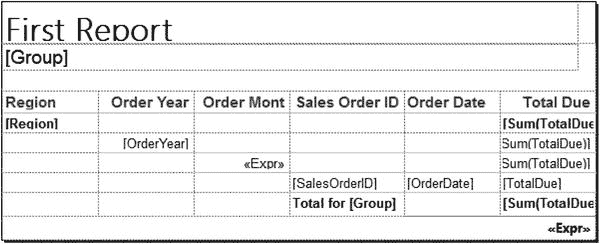
图 2-25. 添加总计后的报告定义

现在预览报告。每一页都将包含该`组`的总计。最后一页将包含一个总计。图 2-26 显示了报告第 3 页及新增的总计。

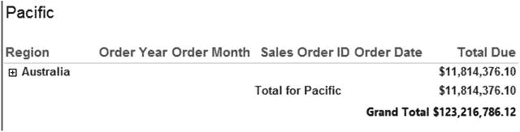
图 2-26. 带有新总计的格式化报告的第 3 页

