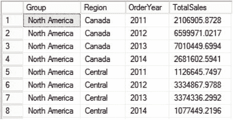
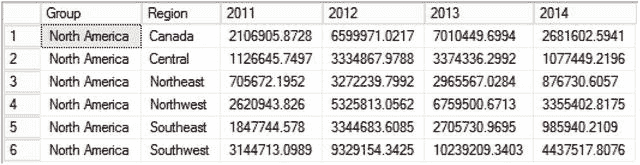
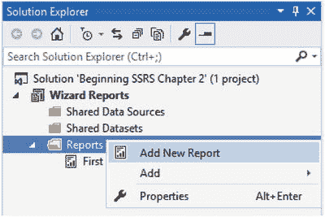
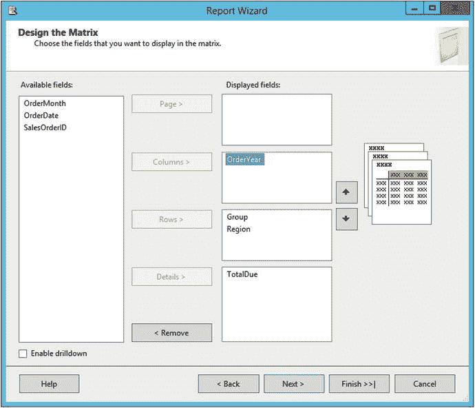
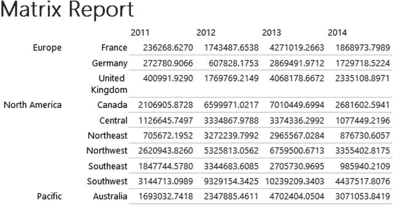
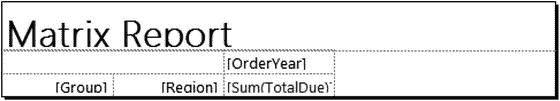
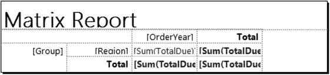
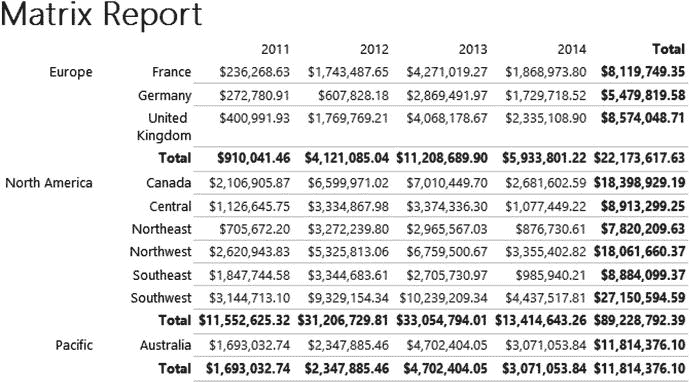

# 第二部分
## 报告开发

## 创建矩阵报告

在上一个练习中，您通过运行向导创建了解决方案、项目以及报告。您也可以使用向导向现有项目添加新报告。在本节中，您将向项目添加一个矩阵报告。

矩阵报告通常比表格报告更为紧凑。在矩阵报告中，数据的某一列或多列将被透视转换为列标题。在本示例中，数据将按年份进行透视。为说明其工作原理，请查看以下查询的结果，该查询返回北美地区按年份统计的总销售额。

```sql
SELECT T.[Group], T.Name As Region, YEAR(OrderDate) AS OrderYear,
SUM(TotalDue) AS TotalSales
FROM Sales.SalesOrderHeader AS SOH
JOIN Sales.SalesTerritory AS T ON SOH.TerritoryID = T.TerritoryID
WHERE T.[Group] = 'North America'
GROUP BY T.[Group], T.Name , YEAR(OrderDate)
ORDER BY Region, OrderYear;
```

您可以在图 2-27 中查看该查询的部分结果。



图 2-27. 按年份统计的总销售额（部分结果）

为了按年份进行比较——换句话说，为了轻松比较 2011 年加拿大地区与中部地区的销售额——您可以对数据进行透视。下面是一个将 `OrderYear` 的值透视为列的查询。

```sql
SELECT [Group], Region,
[2011], [2012], [2013], [2014]
FROM
(SELECT T.[Group], T.Name As Region, YEAR(OrderDate) AS OrderYear,
SUM(TotalDue) AS TotalSales
FROM Sales.SalesOrderHeader AS SOH
JOIN Sales.SalesTerritory AS T ON SOH.TerritoryID = T.TerritoryID
WHERE T.[Group] = 'North America'
GROUP BY T.[Group], T.Name , YEAR(OrderDate)
) AS SourceTable
PIVOT
(SUM(TotalSales)
FOR OrderYear IN ([2011], [2012], [2013], [2014])
)
AS PivotTable
ORDER BY Region;
```

图 2-28 显示了结果。



图 2-28. 透视后的结果

T-SQL 的透视查询语法很复杂，而且您必须在查询中硬编码列名。幸运的是，在 SSRS 中创建透视结果非常简单，并且无需硬编码。

请按照以下步骤创建矩阵报告：

1.  要在项目中启动向导，请在 `解决方案资源管理器` 窗口中右键单击 `报告` 文件夹，然后选择 `添加新报告`，如图 2-29 所示。



图 2-29. 如何启动向导

2.  向导启动后，单击 `下一步` 跳过欢迎页面。
3.  在 `选择数据源` 页面上，单击 `编辑` 以调出 `连接属性`。像本章前面“创建您的第一份报告”一节中那样填写连接信息。
4.  配置好数据源后，单击 `下一步`。在 `设计查询` 页面中，使用与前面示例相同的查询：

```sql
    SELECT T.[Group], T.Name As Region, YEAR(OrderDate) AS OrderYear,
    Month(OrderDate) AS OrderMonth,
    OrderDate, SalesOrderID, TotalDue
    FROM Sales.SalesOrderHeader AS SOH
    JOIN Sales.SalesTerritory AS T ON SOH.TerritoryID = T.TerritoryID;
```

5.  单击 `下一步` 转到 `选择报告类型` 页面。选择 `矩阵` 并单击 `下一步`。
6.  按照图 2-30 所示配置 `设计矩阵` 页面。当您在右侧选择一个字段时，报告中该字段将显示的区域会高亮显示。这可以帮助您弄清楚哪些字段放在哪里。



图 2-30. 矩阵字段配置

7.  单击 `下一步` 并填写报告名称。将其命名为 `矩阵报告`。
8.  单击 `完成` 以结束向导。

现在您将在 `解决方案资源管理器` 的 `报告` 文件夹中看到两份报告。要打开报告，请双击其名称。您也可以在设计区域中切换已打开的报告。要查看矩阵报告的效果，请单击 `预览`。报告应如图 2-31 所示。



图 2-31. 查看矩阵报告

表格报告与矩阵报告的一个显著区别在于，矩阵报告具有跨列的分组级别。您将在第 5 章中学习更多关于矩阵报告的知识。同时，回到报告的设计视图查看属性。图 2-32 展示了矩阵报告的设计实际上是多么简单。



图 2-32. 矩阵报告设计

运用您在本章前面学到的技能，格式化摘要文本框。为了使这份报告更完整，您将添加三个总计字段。请按照以下说明添加总计。

1.  右键单击包含表达式 `[Sum(TotalDue)]` 的文本框。
2.  选择 `添加总计` ➤ `行`。
3.  现在重复此过程，但这次选择 `添加总计` ➤ `列`。
4.  右键单击 `区域` 和 `总计` 交叉点处的单元格。选择 `添加总计`。
5.  选择 `总计` 列，然后在设计菜单中单击 **B** 以将字体加粗。
6.  选择最后一行，然后单击 **B** 以将字体加粗。
7.  将第一行右对齐。

报告设计现在将如图 2-33 所示。



图 2-33. 添加总计后的报告设计

预览报告。您现在拥有所有区域的总计以及跨年份的总计。图 2-34 显示了该报告。



图 2-34. 带有总计的矩阵报告

## 小结

大多数报告，特别是那些利用了 SSRS 一些高级功能的报告，无法使用向导创建。然而，对于简单报告来说，向导是完美的工具。它也是帮助您开始学习开发 SSRS 报告的绝佳辅助工具。在本章中，您创建了两份报告。然后您修改了属性，使它们看起来专业且已准备好部署。

在第 3 章中，您将学习如何配置数据源和数据集，这是报告最基本的元素。

## 3. 理解数据源和数据集

我第一次部署 SSRS 报告组是在 2004 年，当时 SQL Server Reporting Services (`SSRS`) 刚刚发布。这些报告非常成功，消息传到了我工作公司的其他部门。很快，我就收到了多到无法处理的报告请求。我的首要职位是数据库管理员，创建报告只是我工作的一小部分。不久之后，我组织了一个为期一天的 `SSRS` 研讨会，教授来自每个部门的一小部分人员如何开发他们自己的报告。

自那以后，我通过课程、文章和我的第一本 `SSRS` 书籍，向数十人教授了 `SSRS` 开发。本章涵盖的数据源和数据集知识是构建报告的基础。在教授 `SSRS` 的过程中，我认识到这些主题同样具有挑战性。在继续学习之前，请确保您完全理解了本章涵盖的材料，并且在需要帮助时务必回头查阅。

本章涵盖数据源和数据集。您将学习它们是什么、如何创建它们，以及何时在报告之间共享它们是合理的。在第 2 章中，您通过运行向导创建了项目和两份报告。在本章中，您将手动构建报告。


