# 创建共享数据源

如果您以前使用过数据库，可能熟悉**连接字符串**的概念。连接字符串就像是一个地址，告诉您与数据库通信所需的所有信息，例如数据库类型、位置以及用于连接的账户。以下是一个可能的连接字符串：
```
Provider=SQLNCLI11;Server=localhost\INST1;Database=AdventureWorks2016;
Trusted_Connection=yes;
```
此连接字符串表明连接类型是使用最新版本 Native Client 的 SQL Server。服务器位于本地计算机上，且是一个名为 `INST1` 的命名实例。要连接的数据库是 `AdventureWorks2016`。它没有提供用户名和密码，而是使用 Windows 凭据。

连接字符串看起来可能有些吓人，但您不必自己琢磨。大多数应用程序（`SSRS` 也包括在内）都有一个直观的工具来构建连接字符串。

在第 2 章中，您创建了一个包含一个项目的解决方案。在项目内部，您创建了两个报表。为了保持简单并专注于使用向导创建报表，我让您将每个数据源嵌入到报表中。这意味着数据源成为了报表定义的一部分。如果您查看这些报表的 XML 源代码，就会找到连接字符串。

在大多数情况下，数据源应该在报表之间共享。想象一下，您有 100 个或更多报表，每个报表中都嵌入了相同的连接字符串。然后您得知数据库将在周末迁移到新服务器。您将面临数小时的编辑和测试每个报表的工作。如果数据源是共享的而不是嵌入的，您只需要做一个简单的更改，您所有的报表就会指向新的数据库位置。

作为最佳实践，数据源应该是共享的，而 `SSRS` 使得这一点很容易做到。要了解如何为您的项目创建共享数据源，请执行以下步骤：
1.  启动 `SQL Server Data Tools 2015 (SSDT)`。
2.  点击 `文件 ➤ 新建项目` 来创建一个新项目。
3.  新建项目对话框打开后，在 `已安装 ➤ 模板 ➤ 商业智能` 下找到 Reporting Services 模板。
4.  选择 `报表服务器项目`，如图 3-1 所示。

    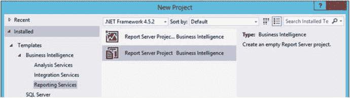
    *图 3-1. 报表服务器项目*

5.  在“项目名称”中填入 `Data Sources and Datasets`。
6.  在“解决方案名称”中填入 `Beginning SSRS Chapter 3`，如图 3-2 所示。

    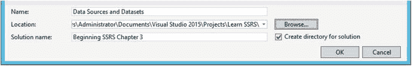
    *图 3-2. 项目和解决方案名称*

7.  确保解决方案将保存在您可以找到的位置。默认情况下，它将在上一个解决方案的位置创建。点击 `确定` 创建项目。
8.  确保您能看到“解决方案资源管理器”窗口。如果不可见，请从“视图”菜单启用它。您也可以使用键盘快捷键 `CTRL + ALT + L`。图 3-3 显示了“解决方案资源管理器”应有的样子。

    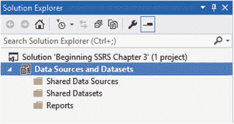
    *图 3-3. 解决方案资源管理器*

项目可以包含三种类型的对象：`共享数据源`、`共享数据集` 和 `报表`。唯一真正的要求是有一个报表；数据源和数据集可以嵌入在报表中。在这种情况下，您将不会在这些文件夹中看到它们。要添加共享数据源，请按照以下步骤操作：
1.  右键单击 `共享数据源` 并选择 `添加新数据源`，如图 3-4 所示。

    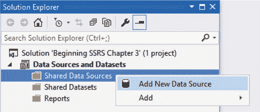
    *图 3-4. 添加新数据源*

2.  这将打开“共享数据源属性”对话框，如图 3-5 所示。在“名称:”处填入数据源名称 `AdventureWorks2016`。为每个数据源命名非常重要，以便以后可以识别。

    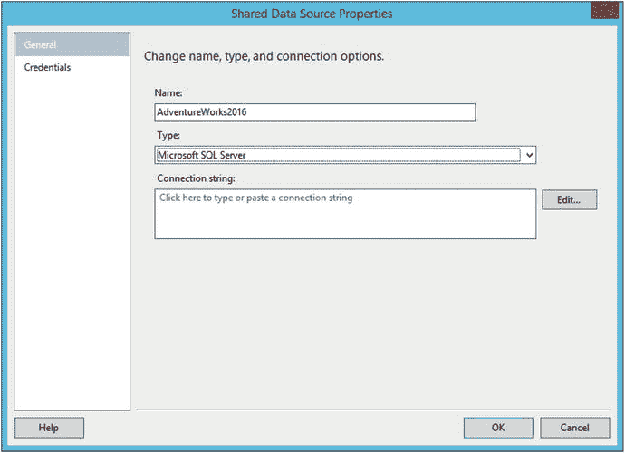
    *图 3-5. 共享数据源属性*

3.  数据源的 `类型` 应为 `Microsoft SQL Server`。
4.  点击 `编辑` 按钮以打开“连接属性”对话框。
5.  填入您的 `SQL Server` 实例的服务器名称和登录属性。如果您难以确定服务器实例名称，请参阅第 1 章中的“确定 SQL Server 名称”部分，或向您的数据库管理员寻求帮助。
6.  在 `选择或输入数据库名称` 下，选择 `AdventureWorks2016` 数据库。属性应类似于图 3-6 所示。

    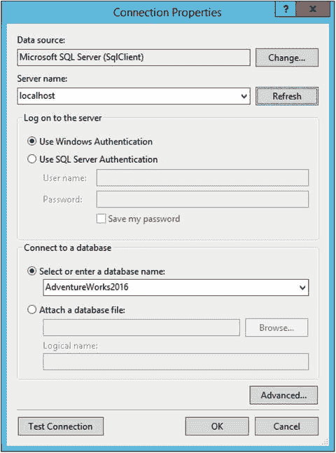
    *图 3-6. 连接属性*

    **注意** 从现在开始，本书中的示例将假定您知道如何连接到自己的数据库。

7.  点击 `测试连接` 以确保连接信息正确。点击 `确定` 关闭测试框，再次点击 `确定` 接受连接属性。`连接字符串` 属性现在应该已被填入。

点击 `确定` 接受数据源的属性。数据源现在将在解决方案资源管理器中可见，如图 3-7 所示。

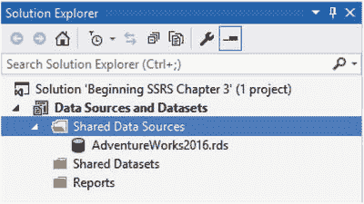
*图 3-7. 新数据源*

请注意，数据源实际上是一个 `XML` 文件。您无法在 `Visual Studio` 中查看文件内容，但如果您愿意，可以导航到 `.rds` 文件并在文本编辑器中打开它。图 3-8 显示了我的数据源文件内容。

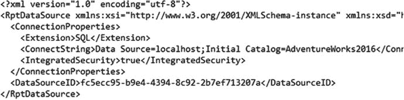
*图 3-8. 数据源文件*

如果您需要编辑数据源属性，请单击数据源或右键单击它并选择 `打开`。这可能有点反直觉，但如果您右键单击并选择 `属性`，您只会在属性窗口中看到 `文件名` 和 `文件路径`，如图 3-9 所示。

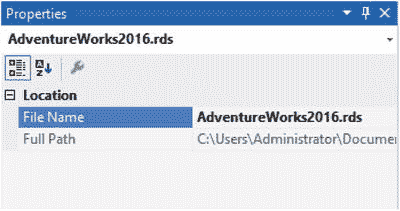
*图 3-9. 数据源的属性*

设置项目中报表所需的任何连接。作为最佳实践，请为共享数据源命名，以便以后可以识别。您应避免使用服务器名称命名数据源。通常，您会在本地、开发或测试服务器上进行开发。已发布的报表通常会指向名称不同的生产服务器。

**注意**
如果您想使用代码下载中的项目，可能需要修改数据源属性才能连接到您自己的 `SQL Server` 实例。


## 创建共享数据集

一个数据集就是一个查询，是你向数据库提出的问题。与数据源不同，数据集通常对报告是唯一的，大多数不应共享。然而，也有几个例外。例如，你可能需要在多个报告中复用一个参数列表。还有一些新功能，例如移动报告，它们需要共享数据集。在本例中，你将创建一个参数列表作为共享数据集。

创建共享数据集请遵循以下步骤：

1.  右键单击 `Shared Datasets` 文件夹并选择 **添加新数据集**。
2.  这将打开 `共享数据集属性` 对话框。在 `名称` 属性中键入 `Year`。
3.  确保在上一节创建的数据源 `AdventureWorks2016` 已在 `数据源` 属性中被选中。
4.  确保 `查询类型` 属性选择的是 `文本`。
5.  在 `查询` 文本框中键入以下代码：
    ```sql
    SELECT DISTINCT YEAR(OrderDate) AS OrderYear
    FROM Sales.SalesOrderHeader
    ORDER BY OrderYear;
    ```
6.  属性应如图 3-10 所示。点击 **确定** 创建新的共享数据集。
    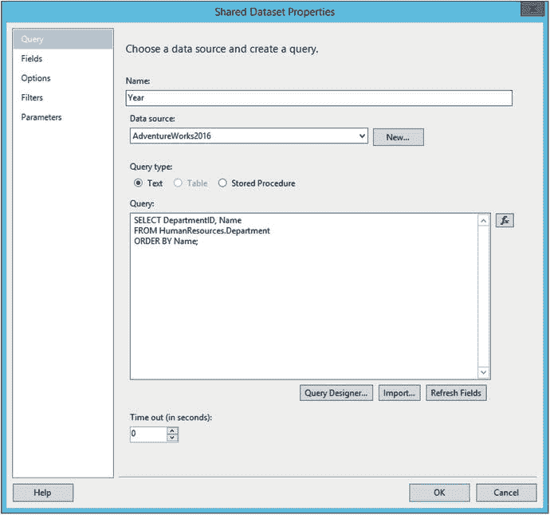
    图 3-10. `共享数据集属性`

现在你应该能在 `Shared Datasets` 文件夹中看到 `Year` 数据集，如图 3-11 所示。与数据源类似，查看其属性会显示文件位置。要编辑属性，可以单击名称或右键单击并选择 **打开**。

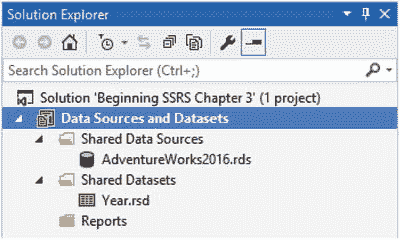
图 3-11. 新的共享数据集

你可以根据需要创建额外的数据集。请记住，除非数据集将在多个报告中使用，否则共享它没有意义。典型的用例是用于参数列表。

### 注意

在 SQL Server 2016 发布时，存在一个涉及共享数据集的错误。要解决此问题，请导航到项目文件并打开 `Year.rsd` 文件。将代码 `<Dataset>` 更改为 `<Dataset Name="Year">`，然后保存文件。Microsoft 已承诺尽快修复此问题，因此在你阅读本书时，这可能已不是问题。

## 使用数据源和数据集

创建数据源和数据集的目的就是在报告中使用它们。现在你将进行此操作。请按照以下步骤创建报告：

1.  右键单击 `Reports` 文件夹并选择 **添加** ➤ **新建项**，如图 3-12 所示。确保不要选择 **添加新报告**，因为这会启动向导。
    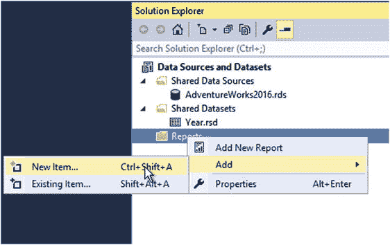
    图 3-12. 添加新报告
2.  在 **添加新项 – 数据源和数据集** 对话框中，选择 `报告`。
3.  在报告名称属性中填入 `Sales by Year`。对话框应如图 3-13 所示。
    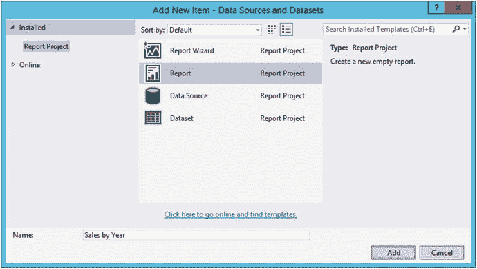
    图 3-13. 新报告属性
4.  点击 **添加** 以创建新报告。

报告现在应该在解决方案资源管理器中可见并在设计视图中打开。如果没有，请双击报告名称将其打开。下一个任务是设置报告内的数据源，使其指向共享数据源。

找到 `报表数据` 窗口，它可能位于左侧。如果不可见，请单击报告的设计画布，然后单击 **视图** 菜单底部的 **报表数据**。`报表数据` 窗口包含几个文件夹，如图 3-14 所示。

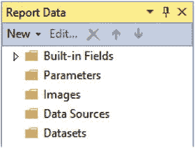
图 3-14. `报表数据` 窗口

请按照以下步骤设置报告的数据源：

1.  右键单击 `数据源` 文件夹并选择 **添加数据源**。
2.  这将打开 `数据源属性` 对话框。在 `名称` 属性中填入 `AdventureWorks`。作为最佳实践，始终为每个数据源指定一个描述性名称。此数据源将链接到 `AdventureWorks2016` 共享数据源。如果你愿意，可以给它完全相同的名称。在本例中，你将稍微更改名称，以便轻松区分共享数据源和报告中的数据源。
3.  对话框中部允许你将此报告数据源创建为嵌入数据源，其连接属性仅对此报告可见。相反，请选择 **使用数据源引用**。在列表中找到 `AdventureWorks2016`。对话框应如图 3-15 所示。
    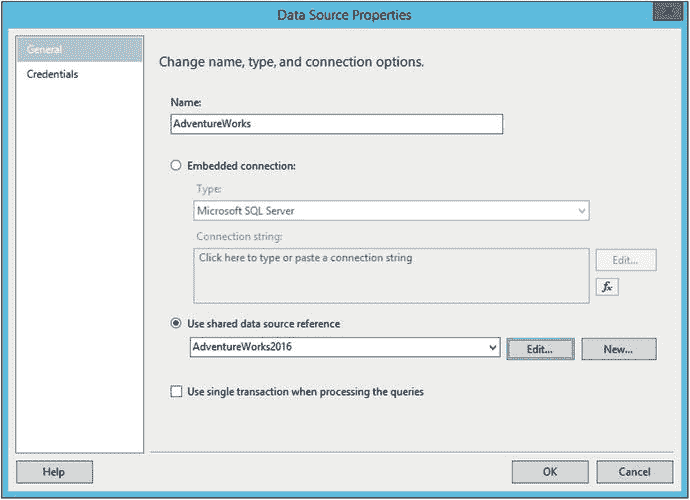
    图 3-15. 报告数据源属性
4.  点击 **确定** 创建数据源。

图 3-15 所示对话框上的 **编辑** 按钮允许你在需要时修改共享数据源。请记住，以此方式进行的更改将影响所有使用此数据源的报告。你也可以创建一个新的共享数据源。作为最佳实践，并避免混淆，始终在项目级别创建和编辑共享数据源。

现在你应该在 `报表数据` 窗口的 `数据源` 文件夹中看到 `AdventureWorks` 数据源，如图 3-16 所示。图标上的小箭头表示它指向一个共享数据源。

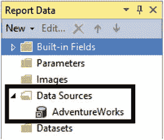
图 3-16. 新的数据源

创建报告的下一步是添加一个数据集。数据集是查询，是向数据库或其他数据源提出的问题。数据集通常特定于某个报告，因此共享大多数数据集没有意义。要为此报告创建第一个数据集，请遵循以下步骤：

1.  右键单击 `数据集` 文件夹并选择 **添加数据集**。这将打开 `数据集属性` 对话框。默认情况下，它设置为 **使用共享数据集**，如图 3-17 所示。
    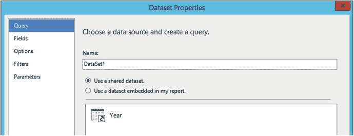
    图 3-17.


